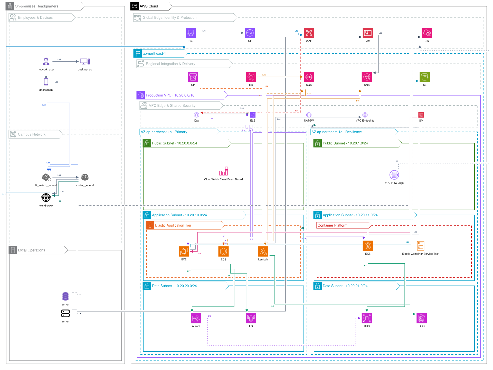

# xaligo


[](LICENSE)
[](https://creativecommons.org/licenses/by/3.0/)

> The Go Gopher was designed by [Renee French](https://reneefrench.blogspot.com/).<br>
> Licensed under [CC BY 3.0](https://creativecommons.org/licenses/by/3.0/).<br>
> This illustration is a derivative work inspired by the original Go Gopher design.

xaligo is a Diagram-as-Code engine for architecture and network diagrams. It
renders the Vue-style `.xal` DSL to Excalidraw, SVG, PPTX, XYFlow, and
Isoflow-compatible output.

## Quick Start

```bash
npm install -g @xaligo/xaligo
xaligo init -o example
xaligo render example/sample.xal --format svg -o example/sample.svg
```

Build from source:

```bash
git clone https://github.com/xaligo/xaligo
cd xaligo
make build
.bin/xaligo render examples/sample.xal --format svg -o output/sample.svg
```

## Samples



Source: [examples/complex-hybrid-architecture.xal](examples/complex-hybrid-architecture.xal)


Source: [examples/complex-hybrid-architecture.xal](examples/complex-hybrid-architecture.xal)

## Documentation

- [Official documentation](docs/src/SUMMARY.md)
- [Getting started](docs/src/getting-started.md)
- [Command line](docs/src/cli.md)
- [.xal DSL](docs/src/xal/overview.md)
- [Samples](docs/src/samples.md)
- [Contributing and Sponsorship](docs/src/contributing.md)

Build the documentation locally:

```bash
mdbook build docs
```

## Contributing

Open an issue, report what can be improved, fix it yourself when possible, and
reflect the improvement back into this repository.

Sponsorship starts at 1 USD per unit. Sponsor logos can be listed in the
documentation. Contact: `xaligo@outlook.com`.

## License

[MIT](LICENSE)
