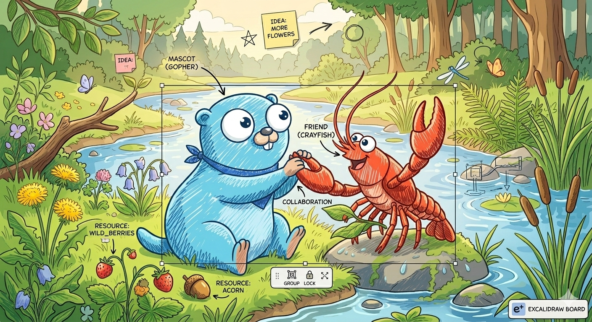

# xaligo



[](LICENSE)
[](https://creativecommons.org/licenses/by/3.0/)

> The Go Gopher was designed by [Renee French](https://reneefrench.blogspot.com/).<br>
> Licensed under [CC BY 3.0](https://creativecommons.org/licenses/by/3.0/).<br>
> This illustration is a derivative work inspired by the original Go Gopher design.

xaligo is a Diagram-as-Code engine for architecture and network diagrams. It
renders the Vue-style `.xal` DSL to Excalidraw, SVG, PPTX, XYFlow, and
Isoflow-compatible output.

## Quick Start

```bash
npm install -g @xaligo/xaligo
xaligo init -o example
xaligo render example/sample.xal --format svg -o example/sample.svg
xaligo diff example/before.xal example/after.xal -o example/architecture-diff
```

The diff command writes `architecture-diff-removed.svg` with pale-red removed
elements and `architecture-diff-added.svg` with pale-green added elements. The
comparison operates on parsed `.xal` structure rather than raw text lines.

Build from source:

```bash
git clone https://github.com/xaligo/xaligo
cd xaligo
make build
.bin/xaligo render docs/src/examples/samples/sample.xal --format svg -o output/sample.svg
```

## Samples


Source: [docs/src/examples/samples/complex-hybrid-architecture.xal](docs/src/examples/samples/complex-hybrid-architecture.xal)


Source: [docs/src/examples/samples/complex-hybrid-architecture.xal](docs/src/examples/samples/complex-hybrid-architecture.xal)

## Roadmap


See [Planned Work](docs/src/roadmap.md) for upcoming and exploratory features.

## Documentation

- [Official documentation](docs/src/SUMMARY.md)
- [Getting started](docs/src/getting-started.md)
- [Command line](docs/src/cli.md)
- [.xal DSL](docs/src/xal/overview.md)
- [Samples](docs/src/samples.md)
- [Contributing](docs/src/contributing.md)

Build the documentation locally:

```bash
cargo install mdbook-tabs --version 0.2.3 --locked
mdbook build docs
```

## Contribution 🤝

There are no formal contribution rules. Open an issue, assign yourself, and
send a pull request. :)

## Sponsor 💖

Sponsorship starts at 1 USD per unit. Sponsor logos, icons, and names can be
listed in the documentation.

Donations are used to maintain the development environment, help cover
community operation costs, and support developer living expenses.

If the donor's identity is clear, in-kind gifts are also welcome 🎁. Please
contact us by X or email before sending anything.

Following Xaligo on X and starring the GitHub repository are also encouraging ⭐.
Please consider following and starring the project. (^^)

Donate via PayPal: [Support from 1 USD](https://www.paypal.com/ncp/payment/6PVX83Y9DMSQJ)

## Contact 📬

X: [@XaligoOrg](https://x.com/XaligoOrg)

Email: `xaligo@outlook.com`.

## License

[MIT](LICENSE)
