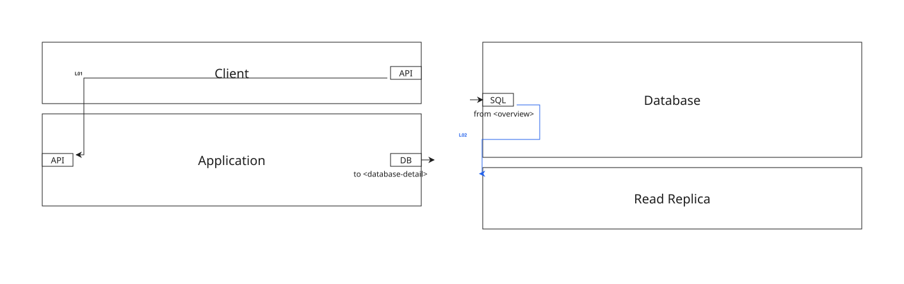

# Canonical V1 Envelope

This sample uses the canonical V1 document hierarchy:

```text
xaligo
├─ data
└─ frames
   ├─ overview
   └─ database-detail
```

The two identified frames share one document. The qualified endpoint
`database-detail.database-in` creates a page link from the overview DB port to
the detail frame's SQL port. Page-oriented output draws one source stub to the
nearest `overview` border labeled `to <database-detail>`, and one destination
stub from the nearest `database-detail` border to the SQL port labeled
`from <overview>`. `<data>` is the document-wide definition registry used by
reusable table, database, and UML definitions.

The checked-in image is the combined compatibility view. Default SVG output
creates one artifact for `overview` and one for `database-detail`.



Source:

```xml
{{#include samples/canonical-v1-envelope.xal}}
```

Validate and render it with:

```bash
xaligo validate docs/src/examples/samples/canonical-v1-envelope.xal
xaligo render docs/src/examples/samples/canonical-v1-envelope.xal \
  --format svg \
  -o output/canonical-v1-envelope.svg
```

The render command writes:

```text
output/canonical-v1-envelope-overview.svg
output/canonical-v1-envelope-database-detail.svg
```

To reproduce the combined image shown above:

```bash
xaligo render docs/src/examples/samples/canonical-v1-envelope.xal \
  --format svg \
  --combine-frames \
  -o output/canonical-v1-envelope.svg
```
