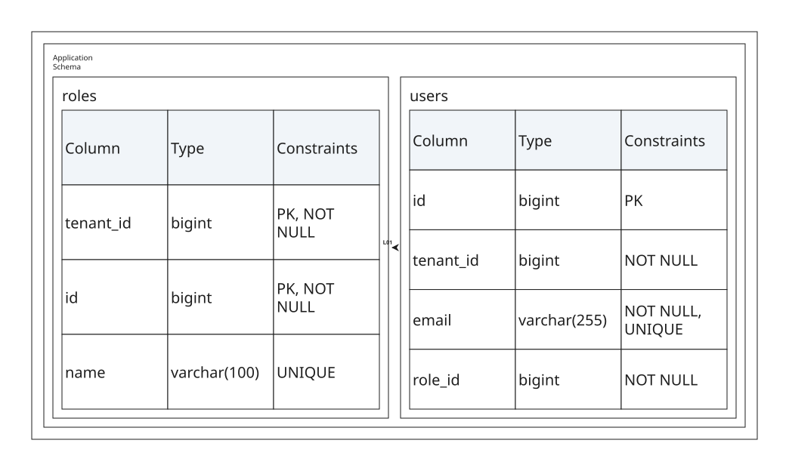

# Relational Database

This example imports one reusable PostgreSQL-compatible schema in `<data>`,
projects it through a `<database>` component, and generates a relation from
the composite foreign key.



```xml
{{#include samples/databases.xal}}
```

```sql
{{#include samples/databases.sql}}
```

```bash
xaligo validate docs/src/examples/samples/databases.xal
xaligo render docs/src/examples/samples/databases.xal \
  --format svg \
  -o output/databases.svg
```
