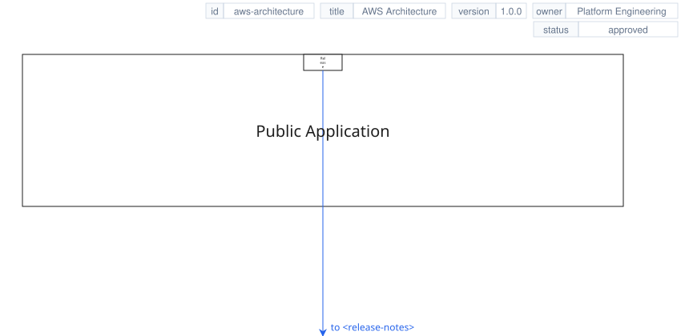
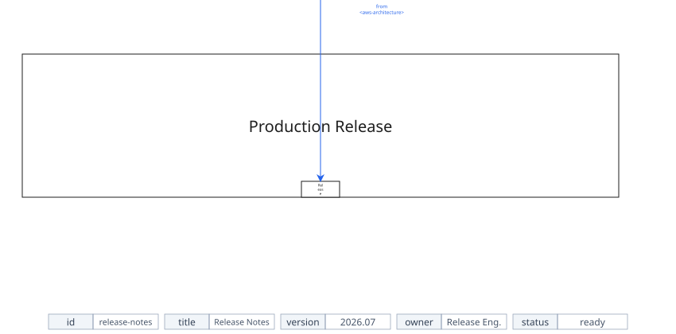

# Frame Metadata Tags

This two-page example adds visible page metadata without drawing a frame outline.
It demonstrates automatic tag sizing, wrapped metadata rows, bottom metadata,
and page-link routing around metadata reservation strips.

### `aws-architecture`



### `release-notes`



Source: [samples/frame-metadata.xal](samples/frame-metadata.xal).

See [Frame and Containers](../reference/frames/frame-containers.md) and
[Frame Attributes](../reference/frames/attributes.md) for metadata defaults,
wrapping, row-gap behavior, and page-link safety rules.

```bash
xaligo validate docs/src/examples/samples/frame-metadata.xal
xaligo render docs/src/examples/samples/frame-metadata.xal --format svg -o output/frame-metadata.svg
```

PPTX preserves the same source order as slides:

```bash
xaligo render docs/src/examples/samples/frame-metadata.xal --format pptx -o output/frame-metadata.pptx
```
