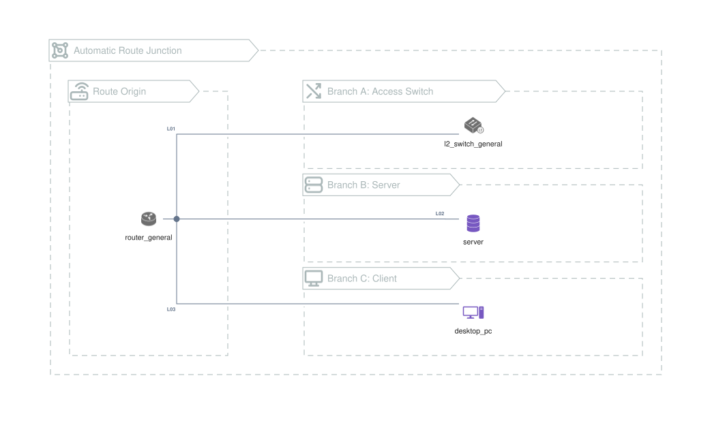

# Automatic Route Junctions

When several route connectors share the same endpoint side, xaligo can route
them through a shared trunk and draw the fan-out junction.

{{#tabs name="examples-junctions"}}
{{#tab name="SVG"}}

{{#endtab}}
{{#tab name="Code"}}

Source: [samples/junctions.xal](samples/junctions.xal).

See [Anchors and Bends](../reference/arrows/anchors-bends.md) for related
connector placement rules.

{{#endtab}}
{{#endtabs}}
