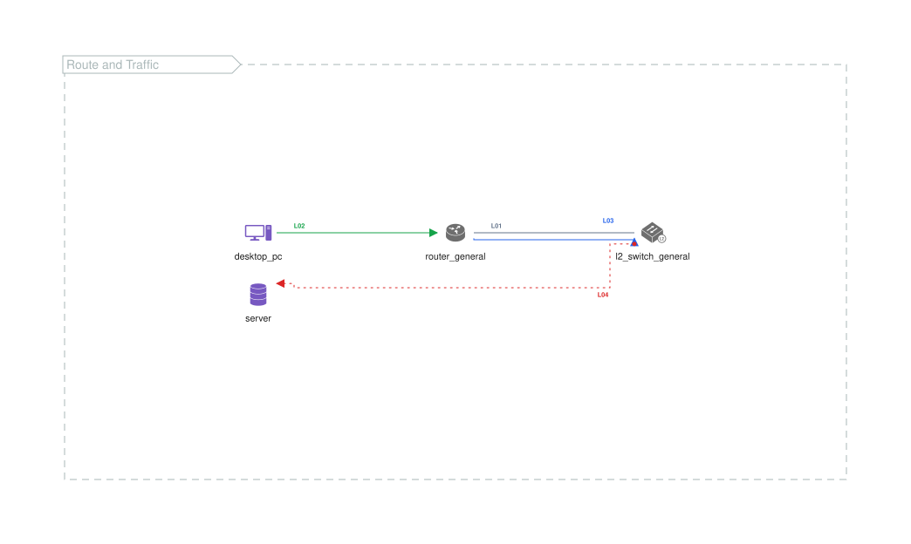

# Line Variants

This example combines structural routes, traffic lanes, and per-line style
overrides in one compact diagram.

{{#tabs name="examples-line-variants"}}
{{#tab name="SVG"}}

{{#endtab}}
{{#tab name="Code"}}

Source: [samples/line-variants.xal](samples/line-variants.xal).

See [Connector Types](../reference/arrows/connector-types.md) and
[Arrow Attributes](../reference/arrows/attributes.md) for detailed syntax.

{{#endtab}}
{{#endtabs}}
