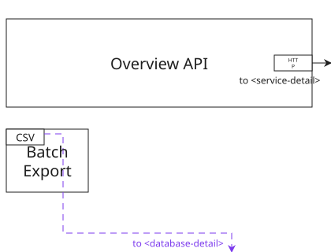
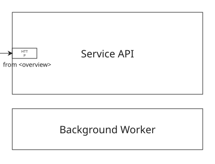
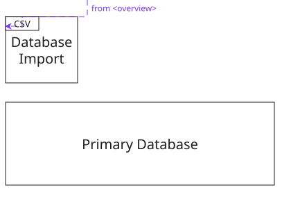
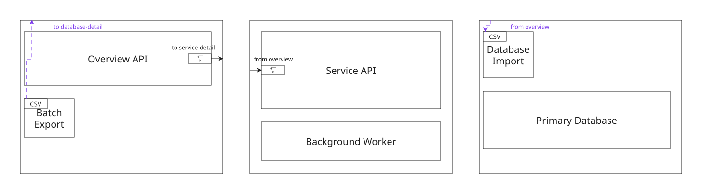

# Cross-Frame Page Links

This example shows how a V1 connection becomes a page link when its endpoints
belong to different frames. The source endpoint is local to the frame that
declares the connection. The destination uses the required
`frame-id.endpoint-id` form.

The HTTP connection leaves the nearest logical page edge of `overview` with
`to <service-detail>` and enters `service-detail` with `from <overview>`. Its sides
are selected automatically from the endpoint envelopes.

The dashed CSV connection uses the child endpoint form to demonstrate that
item and page-edge anchors are independent. It leaves the source port through
the `near` slot on `right` (`right-2`) and exits the overview page through the
`far` slot on `bottom` (`bottom-4`). On the destination page it enters through
the `near` slot on `top` (`top-2`) and reaches the port through the `far` slot
on `left` (`left-4`). Each end segment is
perpendicular to its own selected side. It is labeled `to <database-detail>`
in `overview` and `from <overview>` in `database-detail`.

Each page-link label sits 4 layout pixels inward and at least 4 layout pixels
sideways from its logical page terminal. It uses the closest sideways position
that remains outside endpoint envelopes and metadata reservation strips.

Default SVG export creates one file for each of the three frames. These are the
actual page-local artifacts generated from the sample:

The outer page-frame outline is intentionally absent; the invisible page edge
still anchors each incoming or outgoing page-link stub. Each default SVG is
strictly cropped to the frame rectangle, so no extra marker-safe padding is
added around these three page artifacts.

### `overview`



### `service-detail`



### `database-detail`



The following image is the same source rendered with `--combine-frames` for
compatibility with the former single-canvas output.



Source:

```xml
{{#include samples/page-links.xal}}
```

Validate and render it with:

```bash
xaligo validate docs/src/examples/samples/page-links.xal
xaligo render docs/src/examples/samples/page-links.xal \
  --format svg \
  -o output/page-links.svg
```

The render command writes:

```text
output/page-links-overview.svg
output/page-links-service-detail.svg
output/page-links-database-detail.svg
```

To reproduce the combined image shown above:

```bash
xaligo render docs/src/examples/samples/page-links.xal \
  --format svg \
  --combine-frames \
  -o output/page-links.svg
```

PPTX, PDF, and Excel use the same frame order as slides, pages, and worksheets:

```bash
xaligo render docs/src/examples/samples/page-links.xal --format pptx -o output/page-links.pptx
xaligo render docs/src/examples/samples/page-links.xal --format pdf -o output/page-links.pdf
xaligo render docs/src/examples/samples/page-links.xal --format excel -o output/page-links.xlsx
```
