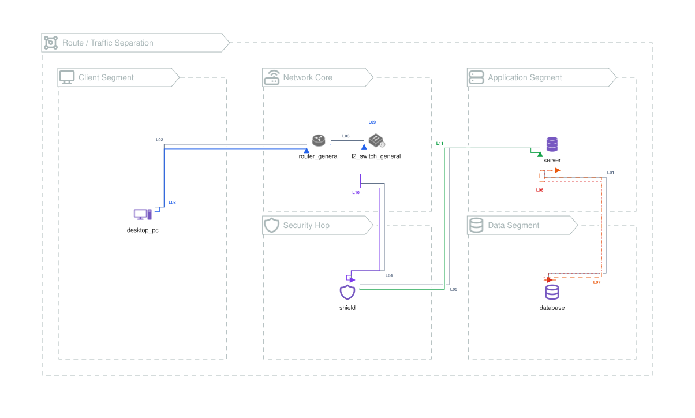

# Route and Traffic Separation

Routes describe the structural path. Traffic lines can then use the same
endpoints and render on nearby lanes with independent colors and arrow styles.

{{#tabs name="examples-route-traffic"}}
{{#tab name="SVG"}}



{{#endtab}}
{{#tab name="Code"}}

```xml
{{#include samples/route-traffic.xal}}
```

{{#endtab}}
{{#endtabs}}
