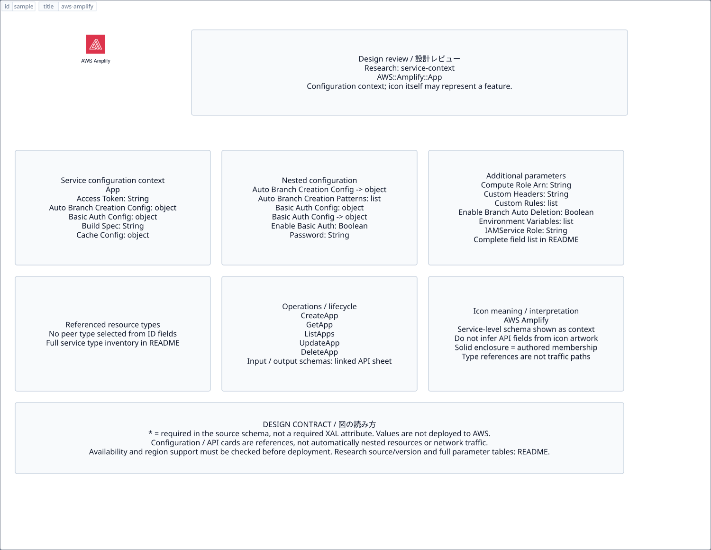

# `aws-amplify` — AWS Amplify

[SVG preview](sample.svg) · [Editable XAL](sample.xal) · [Catalog](../README.md)



AWS service icon. Use a label and explicit annotations to describe its role; scope is selected by the author.

- Kind: `service`; category: Front End Web Mobile.
- Diagram scope: `service` (recommendation, not AWS deployment validation).
- Default catalog ID: 1078. Covered catalog IDs: 1069, 1072, 1075, 1078.
- Implementation: V1 and V2; fixed AWS icon with a wrapped label and explicit functional annotations.

## Parameters

`id` is a required, unique connection ID, not a catalog number. `label`/`title`/`name` override the label; an empty label hides it. `size` > 0 defaults to 48 px. `label-width` > 0 defaults to 160 px (default box width, at least icon size + 12 px). Explicit `width`/`height` must contain the icon and label. `visible="false"` hides it. Children and icon overrides are not supported; use a group for containment.

`detail` adds a free-form diagram annotation. `show-details="false"` hides annotation text. Only supplied values are shown; none are sent to AWS. Service/resource annotations appear on separate wrapped lines.

| Parameter | Type | Meaning | Example |
|---|---|---|---|
| `role` | text | Architectural role annotation | `Application component` |

## Review notes

The catalog provides a baseline for per-component development, not a simulation of the AWS control plane. This component's current functional parameters are the ones listed above. Additional service-specific visual behavior can be developed here without replacing catalog IDs in diagrams. Edit `sample.xal`, then run:

```sh
npm run generate:aws-samples -- --render --tag=aws-amplify
```

<!-- aws-functional-research:start -->
## 機能調査・構成デザイン（2026-09-06）

分類: `service-context`。サービス文脈: [`aws-amplify`](../aws-amplify/README.md)。

サンプルはアイコンと、設定・内包構造・関連リソース・操作を分離したレビューシートです。設定カードは編集可能な `rectangle`、グループは既存の専用タグで実装しています。カードのフィールド名を新しい XAL 属性として受理するわけではありません。専用タグが受理する属性は上の Parameters 表を参照してください。

実線の通信と、設定の参照・同じサービスに属する型一覧を区別します。スキーマの必須項目は AWS 側の仕様であり、図の必須入力ではありません。記載の構成モデル/API は取り込んだ公式資料の範囲であり、全リージョン・全機能の完全性や稼働可否を保証しません。

**重要:** このアイコンに対応する独立した構成リソースを断定せず、所属サービスの構成モデルを参考表示しています。アイコン名や絵柄から属性・親子関係・通信を推測しません。

### 構成モデル: `AWS::Amplify::App`

[公式リファレンス](https://docs.aws.amazon.com/AWSCloudFormation/latest/UserGuide/aws-resource-amplify-app.html)。全 18 プロパティを型付きで列挙します（表示カードには主要項目のみ）。

| Field | Type | Required in AWS schema |
|---|---|---|
| [AccessToken](https://docs.aws.amazon.com/AWSCloudFormation/latest/UserGuide/aws-resource-amplify-app.html#cfn-amplify-app-accesstoken) | `String` | no |
| [AutoBranchCreationConfig](https://docs.aws.amazon.com/AWSCloudFormation/latest/UserGuide/aws-resource-amplify-app.html#cfn-amplify-app-autobranchcreationconfig) | `AutoBranchCreationConfig` | no |
| [BasicAuthConfig](https://docs.aws.amazon.com/AWSCloudFormation/latest/UserGuide/aws-resource-amplify-app.html#cfn-amplify-app-basicauthconfig) | `BasicAuthConfig` | no |
| [BuildSpec](https://docs.aws.amazon.com/AWSCloudFormation/latest/UserGuide/aws-resource-amplify-app.html#cfn-amplify-app-buildspec) | `String` | no |
| [CacheConfig](https://docs.aws.amazon.com/AWSCloudFormation/latest/UserGuide/aws-resource-amplify-app.html#cfn-amplify-app-cacheconfig) | `CacheConfig` | no |
| [ComputeRoleArn](https://docs.aws.amazon.com/AWSCloudFormation/latest/UserGuide/aws-resource-amplify-app.html#cfn-amplify-app-computerolearn) | `String` | no |
| [CustomHeaders](https://docs.aws.amazon.com/AWSCloudFormation/latest/UserGuide/aws-resource-amplify-app.html#cfn-amplify-app-customheaders) | `String` | no |
| [CustomRules](https://docs.aws.amazon.com/AWSCloudFormation/latest/UserGuide/aws-resource-amplify-app.html#cfn-amplify-app-customrules) | `List<CustomRule>` | no |
| [Description](https://docs.aws.amazon.com/AWSCloudFormation/latest/UserGuide/aws-resource-amplify-app.html#cfn-amplify-app-description) | `String` | no |
| [EnableBranchAutoDeletion](https://docs.aws.amazon.com/AWSCloudFormation/latest/UserGuide/aws-resource-amplify-app.html#cfn-amplify-app-enablebranchautodeletion) | `Boolean` | no |
| [EnvironmentVariables](https://docs.aws.amazon.com/AWSCloudFormation/latest/UserGuide/aws-resource-amplify-app.html#cfn-amplify-app-environmentvariables) | `List<EnvironmentVariable>` | no |
| [IAMServiceRole](https://docs.aws.amazon.com/AWSCloudFormation/latest/UserGuide/aws-resource-amplify-app.html#cfn-amplify-app-iamservicerole) | `String` | no |
| [JobConfig](https://docs.aws.amazon.com/AWSCloudFormation/latest/UserGuide/aws-resource-amplify-app.html#cfn-amplify-app-jobconfig) | `JobConfig` | no |
| [Name](https://docs.aws.amazon.com/AWSCloudFormation/latest/UserGuide/aws-resource-amplify-app.html#cfn-amplify-app-name) | `String` | yes |
| [OauthToken](https://docs.aws.amazon.com/AWSCloudFormation/latest/UserGuide/aws-resource-amplify-app.html#cfn-amplify-app-oauthtoken) | `String` | no |
| [Platform](https://docs.aws.amazon.com/AWSCloudFormation/latest/UserGuide/aws-resource-amplify-app.html#cfn-amplify-app-platform) | `String` | no |
| [Repository](https://docs.aws.amazon.com/AWSCloudFormation/latest/UserGuide/aws-resource-amplify-app.html#cfn-amplify-app-repository) | `String` | no |
| [Tags](https://docs.aws.amazon.com/AWSCloudFormation/latest/UserGuide/aws-resource-amplify-app.html#cfn-amplify-app-tags) | `List<Tag>` | no |

#### AutoBranchCreationConfig → `AWS::Amplify::App.AutoBranchCreationConfig`

| Field | Type | Required in AWS schema |
|---|---|---|
| [AutoBranchCreationPatterns](https://docs.aws.amazon.com/AWSCloudFormation/latest/UserGuide/aws-properties-amplify-app-autobranchcreationconfig.html#cfn-amplify-app-autobranchcreationconfig-autobranchcreationpatterns) | `List<String>` | no |
| [BasicAuthConfig](https://docs.aws.amazon.com/AWSCloudFormation/latest/UserGuide/aws-properties-amplify-app-autobranchcreationconfig.html#cfn-amplify-app-autobranchcreationconfig-basicauthconfig) | `BasicAuthConfig` | no |
| [BuildSpec](https://docs.aws.amazon.com/AWSCloudFormation/latest/UserGuide/aws-properties-amplify-app-autobranchcreationconfig.html#cfn-amplify-app-autobranchcreationconfig-buildspec) | `String` | no |
| [EnableAutoBranchCreation](https://docs.aws.amazon.com/AWSCloudFormation/latest/UserGuide/aws-properties-amplify-app-autobranchcreationconfig.html#cfn-amplify-app-autobranchcreationconfig-enableautobranchcreation) | `Boolean` | no |
| [EnableAutoBuild](https://docs.aws.amazon.com/AWSCloudFormation/latest/UserGuide/aws-properties-amplify-app-autobranchcreationconfig.html#cfn-amplify-app-autobranchcreationconfig-enableautobuild) | `Boolean` | no |
| [EnablePerformanceMode](https://docs.aws.amazon.com/AWSCloudFormation/latest/UserGuide/aws-properties-amplify-app-autobranchcreationconfig.html#cfn-amplify-app-autobranchcreationconfig-enableperformancemode) | `Boolean` | no |
| [EnablePullRequestPreview](https://docs.aws.amazon.com/AWSCloudFormation/latest/UserGuide/aws-properties-amplify-app-autobranchcreationconfig.html#cfn-amplify-app-autobranchcreationconfig-enablepullrequestpreview) | `Boolean` | no |
| [EnvironmentVariables](https://docs.aws.amazon.com/AWSCloudFormation/latest/UserGuide/aws-properties-amplify-app-autobranchcreationconfig.html#cfn-amplify-app-autobranchcreationconfig-environmentvariables) | `List<EnvironmentVariable>` | no |
| [Framework](https://docs.aws.amazon.com/AWSCloudFormation/latest/UserGuide/aws-properties-amplify-app-autobranchcreationconfig.html#cfn-amplify-app-autobranchcreationconfig-framework) | `String` | no |
| [PullRequestEnvironmentName](https://docs.aws.amazon.com/AWSCloudFormation/latest/UserGuide/aws-properties-amplify-app-autobranchcreationconfig.html#cfn-amplify-app-autobranchcreationconfig-pullrequestenvironmentname) | `String` | no |
| [Stage](https://docs.aws.amazon.com/AWSCloudFormation/latest/UserGuide/aws-properties-amplify-app-autobranchcreationconfig.html#cfn-amplify-app-autobranchcreationconfig-stage) | `String` | no |

#### BasicAuthConfig → `AWS::Amplify::App.BasicAuthConfig`

| Field | Type | Required in AWS schema |
|---|---|---|
| [EnableBasicAuth](https://docs.aws.amazon.com/AWSCloudFormation/latest/UserGuide/aws-properties-amplify-app-basicauthconfig.html#cfn-amplify-app-basicauthconfig-enablebasicauth) | `Boolean` | no |
| [Password](https://docs.aws.amazon.com/AWSCloudFormation/latest/UserGuide/aws-properties-amplify-app-basicauthconfig.html#cfn-amplify-app-basicauthconfig-password) | `String` | no |
| [Username](https://docs.aws.amazon.com/AWSCloudFormation/latest/UserGuide/aws-properties-amplify-app-basicauthconfig.html#cfn-amplify-app-basicauthconfig-username) | `String` | no |

#### CacheConfig → `AWS::Amplify::App.CacheConfig`

| Field | Type | Required in AWS schema |
|---|---|---|
| [Type](https://docs.aws.amazon.com/AWSCloudFormation/latest/UserGuide/aws-properties-amplify-app-cacheconfig.html#cfn-amplify-app-cacheconfig-type) | `String` | no |

#### CustomRules → `AWS::Amplify::App.CustomRule`

| Field | Type | Required in AWS schema |
|---|---|---|
| [Condition](https://docs.aws.amazon.com/AWSCloudFormation/latest/UserGuide/aws-properties-amplify-app-customrule.html#cfn-amplify-app-customrule-condition) | `String` | no |
| [Source](https://docs.aws.amazon.com/AWSCloudFormation/latest/UserGuide/aws-properties-amplify-app-customrule.html#cfn-amplify-app-customrule-source) | `String` | yes |
| [Status](https://docs.aws.amazon.com/AWSCloudFormation/latest/UserGuide/aws-properties-amplify-app-customrule.html#cfn-amplify-app-customrule-status) | `String` | no |
| [Target](https://docs.aws.amazon.com/AWSCloudFormation/latest/UserGuide/aws-properties-amplify-app-customrule.html#cfn-amplify-app-customrule-target) | `String` | yes |

#### EnvironmentVariables → `AWS::Amplify::App.EnvironmentVariable`

| Field | Type | Required in AWS schema |
|---|---|---|
| [Name](https://docs.aws.amazon.com/AWSCloudFormation/latest/UserGuide/aws-properties-amplify-app-environmentvariable.html#cfn-amplify-app-environmentvariable-name) | `String` | yes |
| [Value](https://docs.aws.amazon.com/AWSCloudFormation/latest/UserGuide/aws-properties-amplify-app-environmentvariable.html#cfn-amplify-app-environmentvariable-value) | `String` | yes |

#### JobConfig → `AWS::Amplify::App.JobConfig`

| Field | Type | Required in AWS schema |
|---|---|---|
| [BuildComputeType](https://docs.aws.amazon.com/AWSCloudFormation/latest/UserGuide/aws-properties-amplify-app-jobconfig.html#cfn-amplify-app-jobconfig-buildcomputetype) | `String` | yes |

### 関連する構成リソース（5 型）

同じサービス文脈の型一覧です。すべてがこのアイコンの子リソースという意味ではありません。さらに深い入れ子は [公式スキーマのスナップショット](../research/cloudformation-models.json) に記録しています。

- [AWS::Amplify::App](https://docs.aws.amazon.com/AWSCloudFormation/latest/UserGuide/aws-resource-amplify-app.html)
- [AWS::Amplify::Branch](https://docs.aws.amazon.com/AWSCloudFormation/latest/UserGuide/aws-resource-amplify-branch.html)
- [AWS::Amplify::Domain](https://docs.aws.amazon.com/AWSCloudFormation/latest/UserGuide/aws-resource-amplify-domain.html)
- [AWS::Amplify::Jobs](https://docs.aws.amazon.com/AWSCloudFormation/latest/UserGuide/aws-resource-amplify-jobs.html)
- [AWS::Amplify::Webhook](https://docs.aws.amazon.com/AWSCloudFormation/latest/UserGuide/aws-resource-amplify-webhook.html)

### API の操作・パラメータ

- [AWS Amplify: 37 操作の入力・出力一覧](../research/api/amplify.md)（API version 2017-07-25）

### 出典・調査範囲

- [公式資料 1](https://docs.aws.amazon.com/AWSCloudFormation/latest/UserGuide/aws-resource-amplify-app.html)
- [公式資料 2](https://github.com/boto/botocore/blob/develop/botocore/data/amplify/2017-07-25/service-2.json)

CloudFormation 仕様 263.0.0、AWS SDK 431 サービスモデルをオフラインで参照。取得日・元データの SHA-256 は [調査マニフェスト](../research/README.md) を参照。API モデル名・フィールド名は仕様から抽出し、説明本文を転載していません。利用可能性は全サービス一律には確認できないため、提供終了の確認がないものも「現在利用可能」と断定していません。

### 次の部品レビュー

- 本アイコンが独立したリソースか、機能・状態・デバイスの記号かを確認する。
- 詳細カードのうち専用の子タグ・参照属性として実装する範囲を選ぶ。
- 通信、制御、認証、監視の関係を分け、必要な接続点・配置制約を確認する。
- 編集後は `npm run generate:aws-samples -- --render --tag=aws-amplify`。通常の再描画は XAL/README を上書きしない。
<!-- aws-functional-research:end -->
