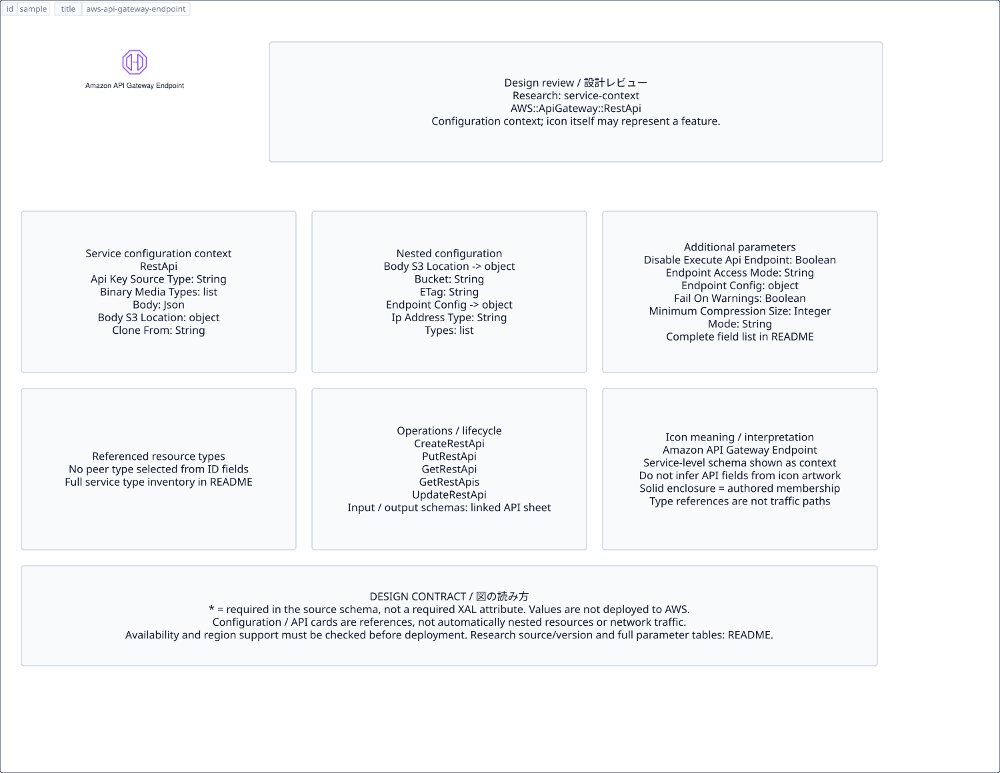

# `aws-api-gateway-endpoint` — Amazon API Gateway Endpoint

[SVG preview](sample.svg) · [Editable XAL](sample.xal) · [Catalog](../README.md)



AWS resource icon. Use a label and explicit annotations to describe its role; scope is selected by the author.

- Kind: `resource`; category: Networking Content Delivery.
- Diagram scope: `logical` (recommendation, not AWS deployment validation).
- Default catalog ID: 1563. Covered catalog IDs: 1563.
- Implementation: V1 and V2; fixed AWS icon with a wrapped label and explicit functional annotations.

## Parameters

`id` is a required, unique connection ID, not a catalog number. `label`/`title`/`name` override the label; an empty label hides it. `size` > 0 defaults to 48 px. `label-width` > 0 defaults to 160 px (default box width, at least icon size + 12 px). Explicit `width`/`height` must contain the icon and label. `visible="false"` hides it. Children and icon overrides are not supported; use a group for containment.

`detail` adds a free-form diagram annotation. `show-details="false"` hides annotation text. Only supplied values are shown; none are sent to AWS. Service/resource annotations appear on separate wrapped lines.

| Parameter | Type | Meaning | Example |
|---|---|---|---|
| `traffic` | text | Traffic/protocol annotation | `HTTPS` |

## Review notes

The catalog provides a baseline for per-component development, not a simulation of the AWS control plane. This component's current functional parameters are the ones listed above. Additional service-specific visual behavior can be developed here without replacing catalog IDs in diagrams. Edit `sample.xal`, then run:

```sh
npm run generate:aws-samples -- --render --tag=aws-api-gateway-endpoint
```

<!-- aws-functional-research:start -->
## 機能調査・構成デザイン（2026-09-06）

分類: `service-context`。サービス文脈: [`aws-api-gateway`](../aws-api-gateway/README.md)。

サンプルはアイコンと、設定・内包構造・関連リソース・操作を分離したレビューシートです。設定カードは編集可能な `rectangle`、グループは既存の専用タグで実装しています。カードのフィールド名を新しい XAL 属性として受理するわけではありません。専用タグが受理する属性は上の Parameters 表を参照してください。

実線の通信と、設定の参照・同じサービスに属する型一覧を区別します。スキーマの必須項目は AWS 側の仕様であり、図の必須入力ではありません。記載の構成モデル/API は取り込んだ公式資料の範囲であり、全リージョン・全機能の完全性や稼働可否を保証しません。

**重要:** このアイコンに対応する独立した構成リソースを断定せず、所属サービスの構成モデルを参考表示しています。アイコン名や絵柄から属性・親子関係・通信を推測しません。

### 構成モデル: `AWS::ApiGateway::RestApi`

[公式リファレンス](https://docs.aws.amazon.com/AWSCloudFormation/latest/UserGuide/aws-resource-apigateway-restapi.html)。全 18 プロパティを型付きで列挙します（表示カードには主要項目のみ）。

| Field | Type | Required in AWS schema |
|---|---|---|
| [ApiKeySourceType](https://docs.aws.amazon.com/AWSCloudFormation/latest/UserGuide/aws-resource-apigateway-restapi.html#cfn-apigateway-restapi-apikeysourcetype) | `String` | no |
| [BinaryMediaTypes](https://docs.aws.amazon.com/AWSCloudFormation/latest/UserGuide/aws-resource-apigateway-restapi.html#cfn-apigateway-restapi-binarymediatypes) | `List<String>` | no |
| [Body](https://docs.aws.amazon.com/AWSCloudFormation/latest/UserGuide/aws-resource-apigateway-restapi.html#cfn-apigateway-restapi-body) | `Json` | no |
| [BodyS3Location](https://docs.aws.amazon.com/AWSCloudFormation/latest/UserGuide/aws-resource-apigateway-restapi.html#cfn-apigateway-restapi-bodys3location) | `S3Location` | no |
| [CloneFrom](https://docs.aws.amazon.com/AWSCloudFormation/latest/UserGuide/aws-resource-apigateway-restapi.html#cfn-apigateway-restapi-clonefrom) | `String` | no |
| [Description](https://docs.aws.amazon.com/AWSCloudFormation/latest/UserGuide/aws-resource-apigateway-restapi.html#cfn-apigateway-restapi-description) | `String` | no |
| [DisableExecuteApiEndpoint](https://docs.aws.amazon.com/AWSCloudFormation/latest/UserGuide/aws-resource-apigateway-restapi.html#cfn-apigateway-restapi-disableexecuteapiendpoint) | `Boolean` | no |
| [EndpointAccessMode](https://docs.aws.amazon.com/AWSCloudFormation/latest/UserGuide/aws-resource-apigateway-restapi.html#cfn-apigateway-restapi-endpointaccessmode) | `String` | no |
| [EndpointConfiguration](https://docs.aws.amazon.com/AWSCloudFormation/latest/UserGuide/aws-resource-apigateway-restapi.html#cfn-apigateway-restapi-endpointconfiguration) | `EndpointConfiguration` | no |
| [FailOnWarnings](https://docs.aws.amazon.com/AWSCloudFormation/latest/UserGuide/aws-resource-apigateway-restapi.html#cfn-apigateway-restapi-failonwarnings) | `Boolean` | no |
| [MinimumCompressionSize](https://docs.aws.amazon.com/AWSCloudFormation/latest/UserGuide/aws-resource-apigateway-restapi.html#cfn-apigateway-restapi-minimumcompressionsize) | `Integer` | no |
| [Mode](https://docs.aws.amazon.com/AWSCloudFormation/latest/UserGuide/aws-resource-apigateway-restapi.html#cfn-apigateway-restapi-mode) | `String` | no |
| [Name](https://docs.aws.amazon.com/AWSCloudFormation/latest/UserGuide/aws-resource-apigateway-restapi.html#cfn-apigateway-restapi-name) | `String` | no |
| [Parameters](https://docs.aws.amazon.com/AWSCloudFormation/latest/UserGuide/aws-resource-apigateway-restapi.html#cfn-apigateway-restapi-parameters) | `Map<String>` | no |
| [Policy](https://docs.aws.amazon.com/AWSCloudFormation/latest/UserGuide/aws-resource-apigateway-restapi.html#cfn-apigateway-restapi-policy) | `Json` | no |
| [SecurityPolicy](https://docs.aws.amazon.com/AWSCloudFormation/latest/UserGuide/aws-resource-apigateway-restapi.html#cfn-apigateway-restapi-securitypolicy) | `String` | no |
| [Tags](https://docs.aws.amazon.com/AWSCloudFormation/latest/UserGuide/aws-resource-apigateway-restapi.html#cfn-apigateway-restapi-tags) | `List<Tag>` | no |
| [Version](https://docs.aws.amazon.com/AWSCloudFormation/latest/UserGuide/aws-resource-apigateway-restapi.html#cfn-apigateway-restapi-version) | `String` | no |

#### BodyS3Location → `AWS::ApiGateway::RestApi.S3Location`

| Field | Type | Required in AWS schema |
|---|---|---|
| [Bucket](https://docs.aws.amazon.com/AWSCloudFormation/latest/UserGuide/aws-properties-apigateway-restapi-s3location.html#cfn-apigateway-restapi-s3location-bucket) | `String` | no |
| [ETag](https://docs.aws.amazon.com/AWSCloudFormation/latest/UserGuide/aws-properties-apigateway-restapi-s3location.html#cfn-apigateway-restapi-s3location-etag) | `String` | no |
| [Key](https://docs.aws.amazon.com/AWSCloudFormation/latest/UserGuide/aws-properties-apigateway-restapi-s3location.html#cfn-apigateway-restapi-s3location-key) | `String` | no |
| [Version](https://docs.aws.amazon.com/AWSCloudFormation/latest/UserGuide/aws-properties-apigateway-restapi-s3location.html#cfn-apigateway-restapi-s3location-version) | `String` | no |

#### EndpointConfiguration → `AWS::ApiGateway::RestApi.EndpointConfiguration`

| Field | Type | Required in AWS schema |
|---|---|---|
| [IpAddressType](https://docs.aws.amazon.com/AWSCloudFormation/latest/UserGuide/aws-properties-apigateway-restapi-endpointconfiguration.html#cfn-apigateway-restapi-endpointconfiguration-ipaddresstype) | `String` | no |
| [Types](https://docs.aws.amazon.com/AWSCloudFormation/latest/UserGuide/aws-properties-apigateway-restapi-endpointconfiguration.html#cfn-apigateway-restapi-endpointconfiguration-types) | `List<String>` | no |
| [VpcEndpointIds](https://docs.aws.amazon.com/AWSCloudFormation/latest/UserGuide/aws-properties-apigateway-restapi-endpointconfiguration.html#cfn-apigateway-restapi-endpointconfiguration-vpcendpointids) | `List<String>` | no |

### 関連する構成リソース（37 型）

同じサービス文脈の型一覧です。すべてがこのアイコンの子リソースという意味ではありません。さらに深い入れ子は [公式スキーマのスナップショット](../research/cloudformation-models.json) に記録しています。

- [AWS::ApiGateway::Account](https://docs.aws.amazon.com/AWSCloudFormation/latest/UserGuide/aws-resource-apigateway-account.html)
- [AWS::ApiGateway::ApiKey](https://docs.aws.amazon.com/AWSCloudFormation/latest/UserGuide/aws-resource-apigateway-apikey.html)
- [AWS::ApiGateway::Authorizer](https://docs.aws.amazon.com/AWSCloudFormation/latest/UserGuide/aws-resource-apigateway-authorizer.html)
- [AWS::ApiGateway::BasePathMapping](https://docs.aws.amazon.com/AWSCloudFormation/latest/UserGuide/aws-resource-apigateway-basepathmapping.html)
- [AWS::ApiGateway::BasePathMappingV2](https://docs.aws.amazon.com/AWSCloudFormation/latest/UserGuide/aws-resource-apigateway-basepathmappingv2.html)
- [AWS::ApiGateway::ClientCertificate](https://docs.aws.amazon.com/AWSCloudFormation/latest/UserGuide/aws-resource-apigateway-clientcertificate.html)
- [AWS::ApiGateway::Deployment](https://docs.aws.amazon.com/AWSCloudFormation/latest/UserGuide/aws-resource-apigateway-deployment.html)
- [AWS::ApiGateway::DocumentationPart](https://docs.aws.amazon.com/AWSCloudFormation/latest/UserGuide/aws-resource-apigateway-documentationpart.html)
- [AWS::ApiGateway::DocumentationVersion](https://docs.aws.amazon.com/AWSCloudFormation/latest/UserGuide/aws-resource-apigateway-documentationversion.html)
- [AWS::ApiGateway::DomainName](https://docs.aws.amazon.com/AWSCloudFormation/latest/UserGuide/aws-resource-apigateway-domainname.html)
- [AWS::ApiGateway::DomainNameAccessAssociation](https://docs.aws.amazon.com/AWSCloudFormation/latest/UserGuide/aws-resource-apigateway-domainnameaccessassociation.html)
- [AWS::ApiGateway::DomainNameV2](https://docs.aws.amazon.com/AWSCloudFormation/latest/UserGuide/aws-resource-apigateway-domainnamev2.html)
- [AWS::ApiGateway::GatewayResponse](https://docs.aws.amazon.com/AWSCloudFormation/latest/UserGuide/aws-resource-apigateway-gatewayresponse.html)
- [AWS::ApiGateway::Method](https://docs.aws.amazon.com/AWSCloudFormation/latest/UserGuide/aws-resource-apigateway-method.html)
- [AWS::ApiGateway::Model](https://docs.aws.amazon.com/AWSCloudFormation/latest/UserGuide/aws-resource-apigateway-model.html)
- [AWS::ApiGateway::RequestValidator](https://docs.aws.amazon.com/AWSCloudFormation/latest/UserGuide/aws-resource-apigateway-requestvalidator.html)
- [AWS::ApiGateway::Resource](https://docs.aws.amazon.com/AWSCloudFormation/latest/UserGuide/aws-resource-apigateway-resource.html)
- [AWS::ApiGateway::RestApi](https://docs.aws.amazon.com/AWSCloudFormation/latest/UserGuide/aws-resource-apigateway-restapi.html)
- [AWS::ApiGateway::Stage](https://docs.aws.amazon.com/AWSCloudFormation/latest/UserGuide/aws-resource-apigateway-stage.html)
- [AWS::ApiGateway::UsagePlan](https://docs.aws.amazon.com/AWSCloudFormation/latest/UserGuide/aws-resource-apigateway-usageplan.html)
- [AWS::ApiGateway::UsagePlanKey](https://docs.aws.amazon.com/AWSCloudFormation/latest/UserGuide/aws-resource-apigateway-usageplankey.html)
- [AWS::ApiGateway::VpcLink](https://docs.aws.amazon.com/AWSCloudFormation/latest/UserGuide/aws-resource-apigateway-vpclink.html)
- [AWS::ApiGatewayV2::Api](https://docs.aws.amazon.com/AWSCloudFormation/latest/UserGuide/aws-resource-apigatewayv2-api.html)
- [AWS::ApiGatewayV2::ApiGatewayManagedOverrides](https://docs.aws.amazon.com/AWSCloudFormation/latest/UserGuide/aws-resource-apigatewayv2-apigatewaymanagedoverrides.html)
- [AWS::ApiGatewayV2::ApiMapping](https://docs.aws.amazon.com/AWSCloudFormation/latest/UserGuide/aws-resource-apigatewayv2-apimapping.html)
- [AWS::ApiGatewayV2::Authorizer](https://docs.aws.amazon.com/AWSCloudFormation/latest/UserGuide/aws-resource-apigatewayv2-authorizer.html)
- [AWS::ApiGatewayV2::Deployment](https://docs.aws.amazon.com/AWSCloudFormation/latest/UserGuide/aws-resource-apigatewayv2-deployment.html)
- [AWS::ApiGatewayV2::DomainName](https://docs.aws.amazon.com/AWSCloudFormation/latest/UserGuide/aws-resource-apigatewayv2-domainname.html)
- [AWS::ApiGatewayV2::Integration](https://docs.aws.amazon.com/AWSCloudFormation/latest/UserGuide/aws-resource-apigatewayv2-integration.html)
- [AWS::ApiGatewayV2::IntegrationResponse](https://docs.aws.amazon.com/AWSCloudFormation/latest/UserGuide/aws-resource-apigatewayv2-integrationresponse.html)
- [AWS::ApiGatewayV2::Model](https://docs.aws.amazon.com/AWSCloudFormation/latest/UserGuide/aws-resource-apigatewayv2-model.html)
- [AWS::ApiGatewayV2::PortalProduct](https://docs.aws.amazon.com/AWSCloudFormation/latest/UserGuide/aws-resource-apigatewayv2-portalproduct.html)
- [AWS::ApiGatewayV2::Route](https://docs.aws.amazon.com/AWSCloudFormation/latest/UserGuide/aws-resource-apigatewayv2-route.html)
- [AWS::ApiGatewayV2::RouteResponse](https://docs.aws.amazon.com/AWSCloudFormation/latest/UserGuide/aws-resource-apigatewayv2-routeresponse.html)
- [AWS::ApiGatewayV2::RoutingRule](https://docs.aws.amazon.com/AWSCloudFormation/latest/UserGuide/aws-resource-apigatewayv2-routingrule.html)
- [AWS::ApiGatewayV2::Stage](https://docs.aws.amazon.com/AWSCloudFormation/latest/UserGuide/aws-resource-apigatewayv2-stage.html)
- [AWS::ApiGatewayV2::VpcLink](https://docs.aws.amazon.com/AWSCloudFormation/latest/UserGuide/aws-resource-apigatewayv2-vpclink.html)

### API の操作・パラメータ

- [Amazon API Gateway: 124 操作の入力・出力一覧](../research/api/apigateway.md)（API version 2015-07-09）
- [AmazonApiGatewayV2: 103 操作の入力・出力一覧](../research/api/apigatewayv2.md)（API version 2018-11-29）

### 出典・調査範囲

- [公式資料 1](https://docs.aws.amazon.com/AWSCloudFormation/latest/UserGuide/aws-resource-apigateway-restapi.html)
- [公式資料 2](https://github.com/boto/botocore/blob/develop/botocore/data/apigateway/2015-07-09/service-2.json)
- [公式資料 3](https://github.com/boto/botocore/blob/develop/botocore/data/apigatewayv2/2018-11-29/service-2.json)

CloudFormation 仕様 263.0.0、AWS SDK 431 サービスモデルをオフラインで参照。取得日・元データの SHA-256 は [調査マニフェスト](../research/README.md) を参照。API モデル名・フィールド名は仕様から抽出し、説明本文を転載していません。利用可能性は全サービス一律には確認できないため、提供終了の確認がないものも「現在利用可能」と断定していません。

### 次の部品レビュー

- 本アイコンが独立したリソースか、機能・状態・デバイスの記号かを確認する。
- 詳細カードのうち専用の子タグ・参照属性として実装する範囲を選ぶ。
- 通信、制御、認証、監視の関係を分け、必要な接続点・配置制約を確認する。
- 編集後は `npm run generate:aws-samples -- --render --tag=aws-api-gateway-endpoint`。通常の再描画は XAL/README を上書きしない。
<!-- aws-functional-research:end -->
