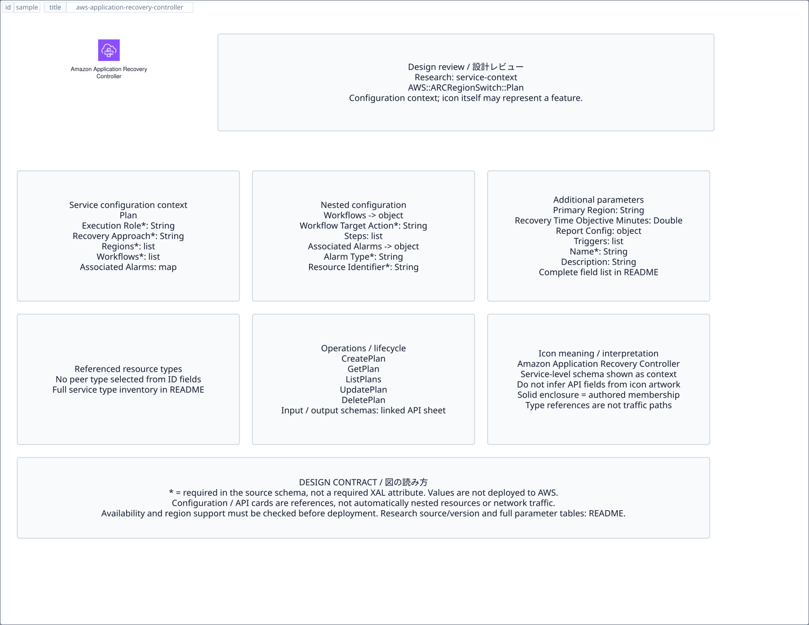

# `aws-application-recovery-controller` — Amazon Application Recovery Controller

[SVG preview](sample.svg) · [Editable XAL](sample.xal) · [Catalog](../README.md)



AWS service icon. Use a label and explicit annotations to describe its role; scope is selected by the author.

- Kind: `service`; category: Networking Content Delivery.
- Diagram scope: `service` (recommendation, not AWS deployment validation).
- Default catalog ID: 1231. Covered catalog IDs: 1177, 1195, 1213, 1231.
- Implementation: V1 and V2; fixed AWS icon with a wrapped label and explicit functional annotations.

## Parameters

`id` is a required, unique connection ID, not a catalog number. `label`/`title`/`name` override the label; an empty label hides it. `size` > 0 defaults to 48 px. `label-width` > 0 defaults to 160 px (default box width, at least icon size + 12 px). Explicit `width`/`height` must contain the icon and label. `visible="false"` hides it. Children and icon overrides are not supported; use a group for containment.

`detail` adds a free-form diagram annotation. `show-details="false"` hides annotation text. Only supplied values are shown; none are sent to AWS. Service/resource annotations appear on separate wrapped lines.

| Parameter | Type | Meaning | Example |
|---|---|---|---|
| `traffic` | text | Traffic/protocol annotation | `HTTPS` |

## Review notes

The catalog provides a baseline for per-component development, not a simulation of the AWS control plane. This component's current functional parameters are the ones listed above. Additional service-specific visual behavior can be developed here without replacing catalog IDs in diagrams. Edit `sample.xal`, then run:

```sh
npm run generate:aws-samples -- --render --tag=aws-application-recovery-controller
```

<!-- aws-functional-research:start -->
## 機能調査・構成デザイン（2026-09-06）

分類: `service-context`。サービス文脈: [`aws-application-recovery-controller`](../aws-application-recovery-controller/README.md)。

サンプルはアイコンと、設定・内包構造・関連リソース・操作を分離したレビューシートです。設定カードは編集可能な `rectangle`、グループは既存の専用タグで実装しています。カードのフィールド名を新しい XAL 属性として受理するわけではありません。専用タグが受理する属性は上の Parameters 表を参照してください。

実線の通信と、設定の参照・同じサービスに属する型一覧を区別します。スキーマの必須項目は AWS 側の仕様であり、図の必須入力ではありません。記載の構成モデル/API は取り込んだ公式資料の範囲であり、全リージョン・全機能の完全性や稼働可否を保証しません。

**重要:** このアイコンに対応する独立した構成リソースを断定せず、所属サービスの構成モデルを参考表示しています。アイコン名や絵柄から属性・親子関係・通信を推測しません。

### 構成モデル: `AWS::ARCRegionSwitch::Plan`

[公式リファレンス](https://docs.aws.amazon.com/AWSCloudFormation/latest/UserGuide/aws-resource-arcregionswitch-plan.html)。全 12 プロパティを型付きで列挙します（表示カードには主要項目のみ）。

| Field | Type | Required in AWS schema |
|---|---|---|
| [AssociatedAlarms](https://docs.aws.amazon.com/AWSCloudFormation/latest/UserGuide/aws-resource-arcregionswitch-plan.html#cfn-arcregionswitch-plan-associatedalarms) | `Map<AssociatedAlarm>` | no |
| [Description](https://docs.aws.amazon.com/AWSCloudFormation/latest/UserGuide/aws-resource-arcregionswitch-plan.html#cfn-arcregionswitch-plan-description) | `String` | no |
| [ExecutionRole](https://docs.aws.amazon.com/AWSCloudFormation/latest/UserGuide/aws-resource-arcregionswitch-plan.html#cfn-arcregionswitch-plan-executionrole) | `String` | yes |
| [Name](https://docs.aws.amazon.com/AWSCloudFormation/latest/UserGuide/aws-resource-arcregionswitch-plan.html#cfn-arcregionswitch-plan-name) | `String` | yes |
| [PrimaryRegion](https://docs.aws.amazon.com/AWSCloudFormation/latest/UserGuide/aws-resource-arcregionswitch-plan.html#cfn-arcregionswitch-plan-primaryregion) | `String` | no |
| [RecoveryApproach](https://docs.aws.amazon.com/AWSCloudFormation/latest/UserGuide/aws-resource-arcregionswitch-plan.html#cfn-arcregionswitch-plan-recoveryapproach) | `String` | yes |
| [RecoveryTimeObjectiveMinutes](https://docs.aws.amazon.com/AWSCloudFormation/latest/UserGuide/aws-resource-arcregionswitch-plan.html#cfn-arcregionswitch-plan-recoverytimeobjectiveminutes) | `Double` | no |
| [Regions](https://docs.aws.amazon.com/AWSCloudFormation/latest/UserGuide/aws-resource-arcregionswitch-plan.html#cfn-arcregionswitch-plan-regions) | `List<String>` | yes |
| [ReportConfiguration](https://docs.aws.amazon.com/AWSCloudFormation/latest/UserGuide/aws-resource-arcregionswitch-plan.html#cfn-arcregionswitch-plan-reportconfiguration) | `ReportConfiguration` | no |
| [Tags](https://docs.aws.amazon.com/AWSCloudFormation/latest/UserGuide/aws-resource-arcregionswitch-plan.html#cfn-arcregionswitch-plan-tags) | `Map<String>` | no |
| [Triggers](https://docs.aws.amazon.com/AWSCloudFormation/latest/UserGuide/aws-resource-arcregionswitch-plan.html#cfn-arcregionswitch-plan-triggers) | `List<Trigger>` | no |
| [Workflows](https://docs.aws.amazon.com/AWSCloudFormation/latest/UserGuide/aws-resource-arcregionswitch-plan.html#cfn-arcregionswitch-plan-workflows) | `List<Workflow>` | yes |

#### Workflows → `AWS::ARCRegionSwitch::Plan.Workflow`

| Field | Type | Required in AWS schema |
|---|---|---|
| [Steps](https://docs.aws.amazon.com/AWSCloudFormation/latest/UserGuide/aws-properties-arcregionswitch-plan-workflow.html#cfn-arcregionswitch-plan-workflow-steps) | `List<Step>` | no |
| [WorkflowDescription](https://docs.aws.amazon.com/AWSCloudFormation/latest/UserGuide/aws-properties-arcregionswitch-plan-workflow.html#cfn-arcregionswitch-plan-workflow-workflowdescription) | `String` | no |
| [WorkflowTargetAction](https://docs.aws.amazon.com/AWSCloudFormation/latest/UserGuide/aws-properties-arcregionswitch-plan-workflow.html#cfn-arcregionswitch-plan-workflow-workflowtargetaction) | `String` | yes |
| [WorkflowTargetRegion](https://docs.aws.amazon.com/AWSCloudFormation/latest/UserGuide/aws-properties-arcregionswitch-plan-workflow.html#cfn-arcregionswitch-plan-workflow-workflowtargetregion) | `String` | no |

#### AssociatedAlarms → `AWS::ARCRegionSwitch::Plan.AssociatedAlarm`

| Field | Type | Required in AWS schema |
|---|---|---|
| [AlarmType](https://docs.aws.amazon.com/AWSCloudFormation/latest/UserGuide/aws-properties-arcregionswitch-plan-associatedalarm.html#cfn-arcregionswitch-plan-associatedalarm-alarmtype) | `String` | yes |
| [CrossAccountRole](https://docs.aws.amazon.com/AWSCloudFormation/latest/UserGuide/aws-properties-arcregionswitch-plan-associatedalarm.html#cfn-arcregionswitch-plan-associatedalarm-crossaccountrole) | `String` | no |
| [ExternalId](https://docs.aws.amazon.com/AWSCloudFormation/latest/UserGuide/aws-properties-arcregionswitch-plan-associatedalarm.html#cfn-arcregionswitch-plan-associatedalarm-externalid) | `String` | no |
| [ResourceIdentifier](https://docs.aws.amazon.com/AWSCloudFormation/latest/UserGuide/aws-properties-arcregionswitch-plan-associatedalarm.html#cfn-arcregionswitch-plan-associatedalarm-resourceidentifier) | `String` | yes |

#### ReportConfiguration → `AWS::ARCRegionSwitch::Plan.ReportConfiguration`

| Field | Type | Required in AWS schema |
|---|---|---|
| [ReportOutput](https://docs.aws.amazon.com/AWSCloudFormation/latest/UserGuide/aws-properties-arcregionswitch-plan-reportconfiguration.html#cfn-arcregionswitch-plan-reportconfiguration-reportoutput) | `List<ReportOutputConfiguration>` | no |

#### Triggers → `AWS::ARCRegionSwitch::Plan.Trigger`

| Field | Type | Required in AWS schema |
|---|---|---|
| [Action](https://docs.aws.amazon.com/AWSCloudFormation/latest/UserGuide/aws-properties-arcregionswitch-plan-trigger.html#cfn-arcregionswitch-plan-trigger-action) | `String` | yes |
| [Conditions](https://docs.aws.amazon.com/AWSCloudFormation/latest/UserGuide/aws-properties-arcregionswitch-plan-trigger.html#cfn-arcregionswitch-plan-trigger-conditions) | `List<TriggerCondition>` | yes |
| [Description](https://docs.aws.amazon.com/AWSCloudFormation/latest/UserGuide/aws-properties-arcregionswitch-plan-trigger.html#cfn-arcregionswitch-plan-trigger-description) | `String` | no |
| [MinDelayMinutesBetweenExecutions](https://docs.aws.amazon.com/AWSCloudFormation/latest/UserGuide/aws-properties-arcregionswitch-plan-trigger.html#cfn-arcregionswitch-plan-trigger-mindelayminutesbetweenexecutions) | `Double` | yes |
| [TargetRegion](https://docs.aws.amazon.com/AWSCloudFormation/latest/UserGuide/aws-properties-arcregionswitch-plan-trigger.html#cfn-arcregionswitch-plan-trigger-targetregion) | `String` | yes |

### 関連する構成リソース（11 型）

同じサービス文脈の型一覧です。すべてがこのアイコンの子リソースという意味ではありません。さらに深い入れ子は [公式スキーマのスナップショット](../research/cloudformation-models.json) に記録しています。

- [AWS::ARCRegionSwitch::Plan](https://docs.aws.amazon.com/AWSCloudFormation/latest/UserGuide/aws-resource-arcregionswitch-plan.html)
- [AWS::ARCZonalShift::AutoshiftObserverNotificationStatus](https://docs.aws.amazon.com/AWSCloudFormation/latest/UserGuide/aws-resource-arczonalshift-autoshiftobservernotificationstatus.html)
- [AWS::ARCZonalShift::ZonalAutoshiftConfiguration](https://docs.aws.amazon.com/AWSCloudFormation/latest/UserGuide/aws-resource-arczonalshift-zonalautoshiftconfiguration.html)
- [AWS::Route53RecoveryControl::Cluster](https://docs.aws.amazon.com/AWSCloudFormation/latest/UserGuide/aws-resource-route53recoverycontrol-cluster.html)
- [AWS::Route53RecoveryControl::ControlPanel](https://docs.aws.amazon.com/AWSCloudFormation/latest/UserGuide/aws-resource-route53recoverycontrol-controlpanel.html)
- [AWS::Route53RecoveryControl::RoutingControl](https://docs.aws.amazon.com/AWSCloudFormation/latest/UserGuide/aws-resource-route53recoverycontrol-routingcontrol.html)
- [AWS::Route53RecoveryControl::SafetyRule](https://docs.aws.amazon.com/AWSCloudFormation/latest/UserGuide/aws-resource-route53recoverycontrol-safetyrule.html)
- [AWS::Route53RecoveryReadiness::Cell](https://docs.aws.amazon.com/AWSCloudFormation/latest/UserGuide/aws-resource-route53recoveryreadiness-cell.html)
- [AWS::Route53RecoveryReadiness::ReadinessCheck](https://docs.aws.amazon.com/AWSCloudFormation/latest/UserGuide/aws-resource-route53recoveryreadiness-readinesscheck.html)
- [AWS::Route53RecoveryReadiness::RecoveryGroup](https://docs.aws.amazon.com/AWSCloudFormation/latest/UserGuide/aws-resource-route53recoveryreadiness-recoverygroup.html)
- [AWS::Route53RecoveryReadiness::ResourceSet](https://docs.aws.amazon.com/AWSCloudFormation/latest/UserGuide/aws-resource-route53recoveryreadiness-resourceset.html)

### API の操作・パラメータ

- [ARC - Region switch: 21 操作の入力・出力一覧](../research/api/arc-region-switch.md)（API version 2022-07-26）
- [AWS ARC - Zonal Shift: 15 操作の入力・出力一覧](../research/api/arc-zonal-shift.md)（API version 2022-10-30）
- [AWS Route53 Recovery Readiness: 32 操作の入力・出力一覧](../research/api/route53-recovery-readiness.md)（API version 2019-12-02）

### 出典・調査範囲

- [公式資料 1](https://docs.aws.amazon.com/AWSCloudFormation/latest/UserGuide/aws-resource-arcregionswitch-plan.html)
- [公式資料 2](https://github.com/boto/botocore/blob/develop/botocore/data/arc-region-switch/2022-07-26/service-2.json)
- [公式資料 3](https://github.com/boto/botocore/blob/develop/botocore/data/arc-zonal-shift/2022-10-30/service-2.json)
- [公式資料 4](https://github.com/boto/botocore/blob/develop/botocore/data/route53-recovery-readiness/2019-12-02/service-2.json)

CloudFormation 仕様 263.0.0、AWS SDK 431 サービスモデルをオフラインで参照。取得日・元データの SHA-256 は [調査マニフェスト](../research/README.md) を参照。API モデル名・フィールド名は仕様から抽出し、説明本文を転載していません。利用可能性は全サービス一律には確認できないため、提供終了の確認がないものも「現在利用可能」と断定していません。

### 次の部品レビュー

- 本アイコンが独立したリソースか、機能・状態・デバイスの記号かを確認する。
- 詳細カードのうち専用の子タグ・参照属性として実装する範囲を選ぶ。
- 通信、制御、認証、監視の関係を分け、必要な接続点・配置制約を確認する。
- 編集後は `npm run generate:aws-samples -- --render --tag=aws-application-recovery-controller`。通常の再描画は XAL/README を上書きしない。
<!-- aws-functional-research:end -->
