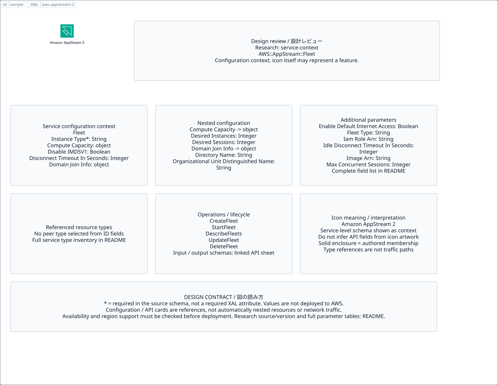

# `aws-appstream-2` — Amazon AppStream 2

[SVG preview](sample.svg) · [Editable XAL](sample.xal) · [Catalog](../README.md)



AWS service icon. Use a label and explicit annotations to describe its role; scope is selected by the author.

- Kind: `service`; category: End User Computing.
- Diagram scope: `service` (recommendation, not AWS deployment validation).
- Default catalog ID: 7. Covered catalog IDs: 1, 3, 5, 7.
- Implementation: V1 and V2; fixed AWS icon with a wrapped label and explicit functional annotations.

## Parameters

`id` is a required, unique connection ID, not a catalog number. `label`/`title`/`name` override the label; an empty label hides it. `size` > 0 defaults to 48 px. `label-width` > 0 defaults to 160 px (default box width, at least icon size + 12 px). Explicit `width`/`height` must contain the icon and label. `visible="false"` hides it. Children and icon overrides are not supported; use a group for containment.

`detail` adds a free-form diagram annotation. `show-details="false"` hides annotation text. Only supplied values are shown; none are sent to AWS. Service/resource annotations appear on separate wrapped lines.

| Parameter | Type | Meaning | Example |
|---|---|---|---|
| `role` | text | Architectural role annotation | `Application component` |

## Review notes

The catalog provides a baseline for per-component development, not a simulation of the AWS control plane. This component's current functional parameters are the ones listed above. Additional service-specific visual behavior can be developed here without replacing catalog IDs in diagrams. Edit `sample.xal`, then run:

```sh
npm run generate:aws-samples -- --render --tag=aws-appstream-2
```

<!-- aws-functional-research:start -->
## 機能調査・構成デザイン（2026-09-06）

分類: `service-context`。サービス文脈: [`aws-appstream-2`](../aws-appstream-2/README.md)。

サンプルはアイコンと、設定・内包構造・関連リソース・操作を分離したレビューシートです。設定カードは編集可能な `rectangle`、グループは既存の専用タグで実装しています。カードのフィールド名を新しい XAL 属性として受理するわけではありません。専用タグが受理する属性は上の Parameters 表を参照してください。

実線の通信と、設定の参照・同じサービスに属する型一覧を区別します。スキーマの必須項目は AWS 側の仕様であり、図の必須入力ではありません。記載の構成モデル/API は取り込んだ公式資料の範囲であり、全リージョン・全機能の完全性や稼働可否を保証しません。

**重要:** このアイコンに対応する独立した構成リソースを断定せず、所属サービスの構成モデルを参考表示しています。アイコン名や絵柄から属性・親子関係・通信を推測しません。

### 構成モデル: `AWS::AppStream::Fleet`

[公式リファレンス](https://docs.aws.amazon.com/AWSCloudFormation/latest/UserGuide/aws-resource-appstream-fleet.html)。全 24 プロパティを型付きで列挙します（表示カードには主要項目のみ）。

| Field | Type | Required in AWS schema |
|---|---|---|
| [ComputeCapacity](https://docs.aws.amazon.com/AWSCloudFormation/latest/UserGuide/aws-resource-appstream-fleet.html#cfn-appstream-fleet-computecapacity) | `ComputeCapacity` | no |
| [Description](https://docs.aws.amazon.com/AWSCloudFormation/latest/UserGuide/aws-resource-appstream-fleet.html#cfn-appstream-fleet-description) | `String` | no |
| [DisableIMDSV1](https://docs.aws.amazon.com/AWSCloudFormation/latest/UserGuide/aws-resource-appstream-fleet.html#cfn-appstream-fleet-disableimdsv1) | `Boolean` | no |
| [DisconnectTimeoutInSeconds](https://docs.aws.amazon.com/AWSCloudFormation/latest/UserGuide/aws-resource-appstream-fleet.html#cfn-appstream-fleet-disconnecttimeoutinseconds) | `Integer` | no |
| [DisplayName](https://docs.aws.amazon.com/AWSCloudFormation/latest/UserGuide/aws-resource-appstream-fleet.html#cfn-appstream-fleet-displayname) | `String` | no |
| [DomainJoinInfo](https://docs.aws.amazon.com/AWSCloudFormation/latest/UserGuide/aws-resource-appstream-fleet.html#cfn-appstream-fleet-domainjoininfo) | `DomainJoinInfo` | no |
| [EnableDefaultInternetAccess](https://docs.aws.amazon.com/AWSCloudFormation/latest/UserGuide/aws-resource-appstream-fleet.html#cfn-appstream-fleet-enabledefaultinternetaccess) | `Boolean` | no |
| [FleetType](https://docs.aws.amazon.com/AWSCloudFormation/latest/UserGuide/aws-resource-appstream-fleet.html#cfn-appstream-fleet-fleettype) | `String` | no |
| [IamRoleArn](https://docs.aws.amazon.com/AWSCloudFormation/latest/UserGuide/aws-resource-appstream-fleet.html#cfn-appstream-fleet-iamrolearn) | `String` | no |
| [IdleDisconnectTimeoutInSeconds](https://docs.aws.amazon.com/AWSCloudFormation/latest/UserGuide/aws-resource-appstream-fleet.html#cfn-appstream-fleet-idledisconnecttimeoutinseconds) | `Integer` | no |
| [ImageArn](https://docs.aws.amazon.com/AWSCloudFormation/latest/UserGuide/aws-resource-appstream-fleet.html#cfn-appstream-fleet-imagearn) | `String` | no |
| [ImageName](https://docs.aws.amazon.com/AWSCloudFormation/latest/UserGuide/aws-resource-appstream-fleet.html#cfn-appstream-fleet-imagename) | `String` | no |
| [InstanceType](https://docs.aws.amazon.com/AWSCloudFormation/latest/UserGuide/aws-resource-appstream-fleet.html#cfn-appstream-fleet-instancetype) | `String` | yes |
| [MaxConcurrentSessions](https://docs.aws.amazon.com/AWSCloudFormation/latest/UserGuide/aws-resource-appstream-fleet.html#cfn-appstream-fleet-maxconcurrentsessions) | `Integer` | no |
| [MaxSessionsPerInstance](https://docs.aws.amazon.com/AWSCloudFormation/latest/UserGuide/aws-resource-appstream-fleet.html#cfn-appstream-fleet-maxsessionsperinstance) | `Integer` | no |
| [MaxUserDurationInSeconds](https://docs.aws.amazon.com/AWSCloudFormation/latest/UserGuide/aws-resource-appstream-fleet.html#cfn-appstream-fleet-maxuserdurationinseconds) | `Integer` | no |
| [Name](https://docs.aws.amazon.com/AWSCloudFormation/latest/UserGuide/aws-resource-appstream-fleet.html#cfn-appstream-fleet-name) | `String` | yes |
| [Platform](https://docs.aws.amazon.com/AWSCloudFormation/latest/UserGuide/aws-resource-appstream-fleet.html#cfn-appstream-fleet-platform) | `String` | no |
| [RootVolumeConfig](https://docs.aws.amazon.com/AWSCloudFormation/latest/UserGuide/aws-resource-appstream-fleet.html#cfn-appstream-fleet-rootvolumeconfig) | `VolumeConfig` | no |
| [SessionScriptS3Location](https://docs.aws.amazon.com/AWSCloudFormation/latest/UserGuide/aws-resource-appstream-fleet.html#cfn-appstream-fleet-sessionscripts3location) | `S3Location` | no |
| [StreamView](https://docs.aws.amazon.com/AWSCloudFormation/latest/UserGuide/aws-resource-appstream-fleet.html#cfn-appstream-fleet-streamview) | `String` | no |
| [Tags](https://docs.aws.amazon.com/AWSCloudFormation/latest/UserGuide/aws-resource-appstream-fleet.html#cfn-appstream-fleet-tags) | `List<Tag>` | no |
| [UsbDeviceFilterStrings](https://docs.aws.amazon.com/AWSCloudFormation/latest/UserGuide/aws-resource-appstream-fleet.html#cfn-appstream-fleet-usbdevicefilterstrings) | `List<String>` | no |
| [VpcConfig](https://docs.aws.amazon.com/AWSCloudFormation/latest/UserGuide/aws-resource-appstream-fleet.html#cfn-appstream-fleet-vpcconfig) | `VpcConfig` | no |

#### ComputeCapacity → `AWS::AppStream::Fleet.ComputeCapacity`

| Field | Type | Required in AWS schema |
|---|---|---|
| [DesiredInstances](https://docs.aws.amazon.com/AWSCloudFormation/latest/UserGuide/aws-properties-appstream-fleet-computecapacity.html#cfn-appstream-fleet-computecapacity-desiredinstances) | `Integer` | no |
| [DesiredSessions](https://docs.aws.amazon.com/AWSCloudFormation/latest/UserGuide/aws-properties-appstream-fleet-computecapacity.html#cfn-appstream-fleet-computecapacity-desiredsessions) | `Integer` | no |

#### DomainJoinInfo → `AWS::AppStream::Fleet.DomainJoinInfo`

| Field | Type | Required in AWS schema |
|---|---|---|
| [DirectoryName](https://docs.aws.amazon.com/AWSCloudFormation/latest/UserGuide/aws-properties-appstream-fleet-domainjoininfo.html#cfn-appstream-fleet-domainjoininfo-directoryname) | `String` | no |
| [OrganizationalUnitDistinguishedName](https://docs.aws.amazon.com/AWSCloudFormation/latest/UserGuide/aws-properties-appstream-fleet-domainjoininfo.html#cfn-appstream-fleet-domainjoininfo-organizationalunitdistinguishedname) | `String` | no |

#### RootVolumeConfig → `AWS::AppStream::Fleet.VolumeConfig`

| Field | Type | Required in AWS schema |
|---|---|---|
| [VolumeSizeInGb](https://docs.aws.amazon.com/AWSCloudFormation/latest/UserGuide/aws-properties-appstream-fleet-volumeconfig.html#cfn-appstream-fleet-volumeconfig-volumesizeingb) | `Integer` | no |

#### SessionScriptS3Location → `AWS::AppStream::Fleet.S3Location`

| Field | Type | Required in AWS schema |
|---|---|---|
| [S3Bucket](https://docs.aws.amazon.com/AWSCloudFormation/latest/UserGuide/aws-properties-appstream-fleet-s3location.html#cfn-appstream-fleet-s3location-s3bucket) | `String` | yes |
| [S3Key](https://docs.aws.amazon.com/AWSCloudFormation/latest/UserGuide/aws-properties-appstream-fleet-s3location.html#cfn-appstream-fleet-s3location-s3key) | `String` | yes |

#### VpcConfig → `AWS::AppStream::Fleet.VpcConfig`

| Field | Type | Required in AWS schema |
|---|---|---|
| [SecurityGroupIds](https://docs.aws.amazon.com/AWSCloudFormation/latest/UserGuide/aws-properties-appstream-fleet-vpcconfig.html#cfn-appstream-fleet-vpcconfig-securitygroupids) | `List<String>` | no |
| [SubnetIds](https://docs.aws.amazon.com/AWSCloudFormation/latest/UserGuide/aws-properties-appstream-fleet-vpcconfig.html#cfn-appstream-fleet-vpcconfig-subnetids) | `List<String>` | no |

### 関連する構成リソース（13 型）

同じサービス文脈の型一覧です。すべてがこのアイコンの子リソースという意味ではありません。さらに深い入れ子は [公式スキーマのスナップショット](../research/cloudformation-models.json) に記録しています。

- [AWS::AppStream::AppBlock](https://docs.aws.amazon.com/AWSCloudFormation/latest/UserGuide/aws-resource-appstream-appblock.html)
- [AWS::AppStream::AppBlockBuilder](https://docs.aws.amazon.com/AWSCloudFormation/latest/UserGuide/aws-resource-appstream-appblockbuilder.html)
- [AWS::AppStream::Application](https://docs.aws.amazon.com/AWSCloudFormation/latest/UserGuide/aws-resource-appstream-application.html)
- [AWS::AppStream::ApplicationEntitlementAssociation](https://docs.aws.amazon.com/AWSCloudFormation/latest/UserGuide/aws-resource-appstream-applicationentitlementassociation.html)
- [AWS::AppStream::ApplicationFleetAssociation](https://docs.aws.amazon.com/AWSCloudFormation/latest/UserGuide/aws-resource-appstream-applicationfleetassociation.html)
- [AWS::AppStream::DirectoryConfig](https://docs.aws.amazon.com/AWSCloudFormation/latest/UserGuide/aws-resource-appstream-directoryconfig.html)
- [AWS::AppStream::Entitlement](https://docs.aws.amazon.com/AWSCloudFormation/latest/UserGuide/aws-resource-appstream-entitlement.html)
- [AWS::AppStream::Fleet](https://docs.aws.amazon.com/AWSCloudFormation/latest/UserGuide/aws-resource-appstream-fleet.html)
- [AWS::AppStream::ImageBuilder](https://docs.aws.amazon.com/AWSCloudFormation/latest/UserGuide/aws-resource-appstream-imagebuilder.html)
- [AWS::AppStream::Stack](https://docs.aws.amazon.com/AWSCloudFormation/latest/UserGuide/aws-resource-appstream-stack.html)
- [AWS::AppStream::StackFleetAssociation](https://docs.aws.amazon.com/AWSCloudFormation/latest/UserGuide/aws-resource-appstream-stackfleetassociation.html)
- [AWS::AppStream::StackUserAssociation](https://docs.aws.amazon.com/AWSCloudFormation/latest/UserGuide/aws-resource-appstream-stackuserassociation.html)
- [AWS::AppStream::User](https://docs.aws.amazon.com/AWSCloudFormation/latest/UserGuide/aws-resource-appstream-user.html)

### API の操作・パラメータ

- [Amazon AppStream: 89 操作の入力・出力一覧](../research/api/appstream.md)（API version 2016-12-01）

### 出典・調査範囲

- [公式資料 1](https://docs.aws.amazon.com/AWSCloudFormation/latest/UserGuide/aws-resource-appstream-fleet.html)
- [公式資料 2](https://github.com/boto/botocore/blob/develop/botocore/data/appstream/2016-12-01/service-2.json)

CloudFormation 仕様 263.0.0、AWS SDK 431 サービスモデルをオフラインで参照。取得日・元データの SHA-256 は [調査マニフェスト](../research/README.md) を参照。API モデル名・フィールド名は仕様から抽出し、説明本文を転載していません。利用可能性は全サービス一律には確認できないため、提供終了の確認がないものも「現在利用可能」と断定していません。

### 次の部品レビュー

- 本アイコンが独立したリソースか、機能・状態・デバイスの記号かを確認する。
- 詳細カードのうち専用の子タグ・参照属性として実装する範囲を選ぶ。
- 通信、制御、認証、監視の関係を分け、必要な接続点・配置制約を確認する。
- 編集後は `npm run generate:aws-samples -- --render --tag=aws-appstream-2`。通常の再描画は XAL/README を上書きしない。
<!-- aws-functional-research:end -->
