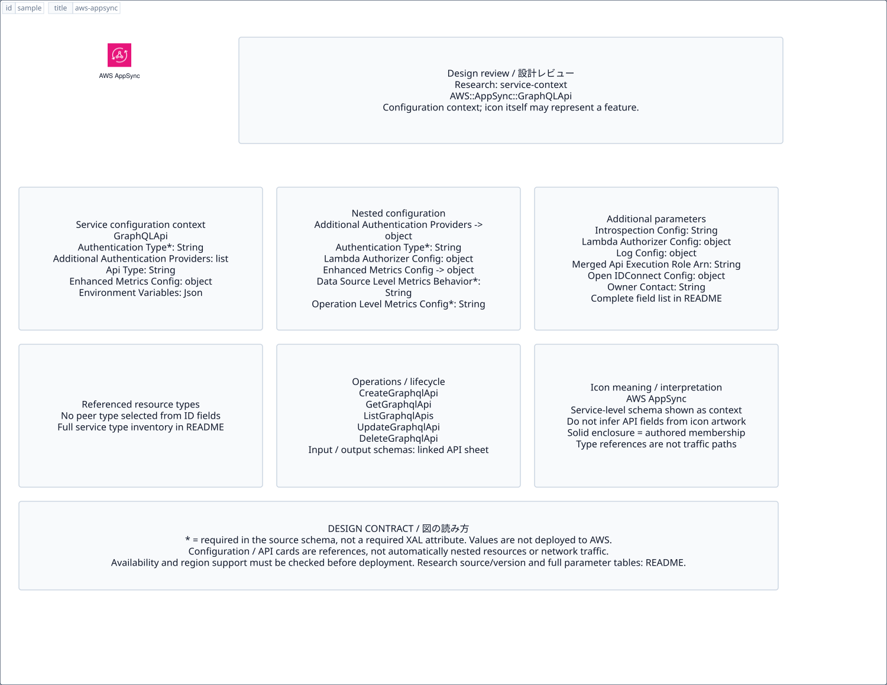

# `aws-appsync` — AWS AppSync

[SVG preview](sample.svg) · [Editable XAL](sample.xal) · [Catalog](../README.md)



AWS service icon. Use a label and explicit annotations to describe its role; scope is selected by the author.

- Kind: `service`; category: App Integration.
- Diagram scope: `service` (recommendation, not AWS deployment validation).
- Default catalog ID: 727. Covered catalog IDs: 697, 707, 717, 727.
- Implementation: V1 and V2; fixed AWS icon with a wrapped label and explicit functional annotations.

## Parameters

`id` is a required, unique connection ID, not a catalog number. `label`/`title`/`name` override the label; an empty label hides it. `size` > 0 defaults to 48 px. `label-width` > 0 defaults to 160 px (default box width, at least icon size + 12 px). Explicit `width`/`height` must contain the icon and label. `visible="false"` hides it. Children and icon overrides are not supported; use a group for containment.

`detail` adds a free-form diagram annotation. `show-details="false"` hides annotation text. Only supplied values are shown; none are sent to AWS. Service/resource annotations appear on separate wrapped lines.

| Parameter | Type | Meaning | Example |
|---|---|---|---|
| `message` | text | Message/event annotation | `Order events` |

## Review notes

The catalog provides a baseline for per-component development, not a simulation of the AWS control plane. This component's current functional parameters are the ones listed above. Additional service-specific visual behavior can be developed here without replacing catalog IDs in diagrams. Edit `sample.xal`, then run:

```sh
npm run generate:aws-samples -- --render --tag=aws-appsync
```

<!-- aws-functional-research:start -->
## 機能調査・構成デザイン（2026-09-06）

分類: `service-context`。サービス文脈: [`aws-appsync`](../aws-appsync/README.md)。

サンプルはアイコンと、設定・内包構造・関連リソース・操作を分離したレビューシートです。設定カードは編集可能な `rectangle`、グループは既存の専用タグで実装しています。カードのフィールド名を新しい XAL 属性として受理するわけではありません。専用タグが受理する属性は上の Parameters 表を参照してください。

実線の通信と、設定の参照・同じサービスに属する型一覧を区別します。スキーマの必須項目は AWS 側の仕様であり、図の必須入力ではありません。記載の構成モデル/API は取り込んだ公式資料の範囲であり、全リージョン・全機能の完全性や稼働可否を保証しません。

**重要:** このアイコンに対応する独立した構成リソースを断定せず、所属サービスの構成モデルを参考表示しています。アイコン名や絵柄から属性・親子関係・通信を推測しません。

### 構成モデル: `AWS::AppSync::GraphQLApi`

[公式リファレンス](https://docs.aws.amazon.com/AWSCloudFormation/latest/UserGuide/aws-resource-appsync-graphqlapi.html)。全 18 プロパティを型付きで列挙します（表示カードには主要項目のみ）。

| Field | Type | Required in AWS schema |
|---|---|---|
| [AdditionalAuthenticationProviders](https://docs.aws.amazon.com/AWSCloudFormation/latest/UserGuide/aws-resource-appsync-graphqlapi.html#cfn-appsync-graphqlapi-additionalauthenticationproviders) | `List<AdditionalAuthenticationProvider>` | no |
| [ApiType](https://docs.aws.amazon.com/AWSCloudFormation/latest/UserGuide/aws-resource-appsync-graphqlapi.html#cfn-appsync-graphqlapi-apitype) | `String` | no |
| [AuthenticationType](https://docs.aws.amazon.com/AWSCloudFormation/latest/UserGuide/aws-resource-appsync-graphqlapi.html#cfn-appsync-graphqlapi-authenticationtype) | `String` | yes |
| [EnhancedMetricsConfig](https://docs.aws.amazon.com/AWSCloudFormation/latest/UserGuide/aws-resource-appsync-graphqlapi.html#cfn-appsync-graphqlapi-enhancedmetricsconfig) | `EnhancedMetricsConfig` | no |
| [EnvironmentVariables](https://docs.aws.amazon.com/AWSCloudFormation/latest/UserGuide/aws-resource-appsync-graphqlapi.html#cfn-appsync-graphqlapi-environmentvariables) | `Json` | no |
| [IntrospectionConfig](https://docs.aws.amazon.com/AWSCloudFormation/latest/UserGuide/aws-resource-appsync-graphqlapi.html#cfn-appsync-graphqlapi-introspectionconfig) | `String` | no |
| [LambdaAuthorizerConfig](https://docs.aws.amazon.com/AWSCloudFormation/latest/UserGuide/aws-resource-appsync-graphqlapi.html#cfn-appsync-graphqlapi-lambdaauthorizerconfig) | `LambdaAuthorizerConfig` | no |
| [LogConfig](https://docs.aws.amazon.com/AWSCloudFormation/latest/UserGuide/aws-resource-appsync-graphqlapi.html#cfn-appsync-graphqlapi-logconfig) | `LogConfig` | no |
| [MergedApiExecutionRoleArn](https://docs.aws.amazon.com/AWSCloudFormation/latest/UserGuide/aws-resource-appsync-graphqlapi.html#cfn-appsync-graphqlapi-mergedapiexecutionrolearn) | `String` | no |
| [Name](https://docs.aws.amazon.com/AWSCloudFormation/latest/UserGuide/aws-resource-appsync-graphqlapi.html#cfn-appsync-graphqlapi-name) | `String` | yes |
| [OpenIDConnectConfig](https://docs.aws.amazon.com/AWSCloudFormation/latest/UserGuide/aws-resource-appsync-graphqlapi.html#cfn-appsync-graphqlapi-openidconnectconfig) | `OpenIDConnectConfig` | no |
| [OwnerContact](https://docs.aws.amazon.com/AWSCloudFormation/latest/UserGuide/aws-resource-appsync-graphqlapi.html#cfn-appsync-graphqlapi-ownercontact) | `String` | no |
| [QueryDepthLimit](https://docs.aws.amazon.com/AWSCloudFormation/latest/UserGuide/aws-resource-appsync-graphqlapi.html#cfn-appsync-graphqlapi-querydepthlimit) | `Integer` | no |
| [ResolverCountLimit](https://docs.aws.amazon.com/AWSCloudFormation/latest/UserGuide/aws-resource-appsync-graphqlapi.html#cfn-appsync-graphqlapi-resolvercountlimit) | `Integer` | no |
| [Tags](https://docs.aws.amazon.com/AWSCloudFormation/latest/UserGuide/aws-resource-appsync-graphqlapi.html#cfn-appsync-graphqlapi-tags) | `List<Tag>` | no |
| [UserPoolConfig](https://docs.aws.amazon.com/AWSCloudFormation/latest/UserGuide/aws-resource-appsync-graphqlapi.html#cfn-appsync-graphqlapi-userpoolconfig) | `UserPoolConfig` | no |
| [Visibility](https://docs.aws.amazon.com/AWSCloudFormation/latest/UserGuide/aws-resource-appsync-graphqlapi.html#cfn-appsync-graphqlapi-visibility) | `String` | no |
| [XrayEnabled](https://docs.aws.amazon.com/AWSCloudFormation/latest/UserGuide/aws-resource-appsync-graphqlapi.html#cfn-appsync-graphqlapi-xrayenabled) | `Boolean` | no |

#### AdditionalAuthenticationProviders → `AWS::AppSync::GraphQLApi.AdditionalAuthenticationProvider`

| Field | Type | Required in AWS schema |
|---|---|---|
| [AuthenticationType](https://docs.aws.amazon.com/AWSCloudFormation/latest/UserGuide/aws-properties-appsync-graphqlapi-additionalauthenticationprovider.html#cfn-appsync-graphqlapi-additionalauthenticationprovider-authenticationtype) | `String` | yes |
| [LambdaAuthorizerConfig](https://docs.aws.amazon.com/AWSCloudFormation/latest/UserGuide/aws-properties-appsync-graphqlapi-additionalauthenticationprovider.html#cfn-appsync-graphqlapi-additionalauthenticationprovider-lambdaauthorizerconfig) | `LambdaAuthorizerConfig` | no |
| [OpenIDConnectConfig](https://docs.aws.amazon.com/AWSCloudFormation/latest/UserGuide/aws-properties-appsync-graphqlapi-additionalauthenticationprovider.html#cfn-appsync-graphqlapi-additionalauthenticationprovider-openidconnectconfig) | `OpenIDConnectConfig` | no |
| [UserPoolConfig](https://docs.aws.amazon.com/AWSCloudFormation/latest/UserGuide/aws-properties-appsync-graphqlapi-additionalauthenticationprovider.html#cfn-appsync-graphqlapi-additionalauthenticationprovider-userpoolconfig) | `CognitoUserPoolConfig` | no |

#### EnhancedMetricsConfig → `AWS::AppSync::GraphQLApi.EnhancedMetricsConfig`

| Field | Type | Required in AWS schema |
|---|---|---|
| [DataSourceLevelMetricsBehavior](https://docs.aws.amazon.com/AWSCloudFormation/latest/UserGuide/aws-properties-appsync-graphqlapi-enhancedmetricsconfig.html#cfn-appsync-graphqlapi-enhancedmetricsconfig-datasourcelevelmetricsbehavior) | `String` | yes |
| [OperationLevelMetricsConfig](https://docs.aws.amazon.com/AWSCloudFormation/latest/UserGuide/aws-properties-appsync-graphqlapi-enhancedmetricsconfig.html#cfn-appsync-graphqlapi-enhancedmetricsconfig-operationlevelmetricsconfig) | `String` | yes |
| [ResolverLevelMetricsBehavior](https://docs.aws.amazon.com/AWSCloudFormation/latest/UserGuide/aws-properties-appsync-graphqlapi-enhancedmetricsconfig.html#cfn-appsync-graphqlapi-enhancedmetricsconfig-resolverlevelmetricsbehavior) | `String` | yes |

#### LambdaAuthorizerConfig → `AWS::AppSync::GraphQLApi.LambdaAuthorizerConfig`

| Field | Type | Required in AWS schema |
|---|---|---|
| [AuthorizerResultTtlInSeconds](https://docs.aws.amazon.com/AWSCloudFormation/latest/UserGuide/aws-properties-appsync-graphqlapi-lambdaauthorizerconfig.html#cfn-appsync-graphqlapi-lambdaauthorizerconfig-authorizerresultttlinseconds) | `Double` | no |
| [AuthorizerUri](https://docs.aws.amazon.com/AWSCloudFormation/latest/UserGuide/aws-properties-appsync-graphqlapi-lambdaauthorizerconfig.html#cfn-appsync-graphqlapi-lambdaauthorizerconfig-authorizeruri) | `String` | no |
| [IdentityValidationExpression](https://docs.aws.amazon.com/AWSCloudFormation/latest/UserGuide/aws-properties-appsync-graphqlapi-lambdaauthorizerconfig.html#cfn-appsync-graphqlapi-lambdaauthorizerconfig-identityvalidationexpression) | `String` | no |

#### LogConfig → `AWS::AppSync::GraphQLApi.LogConfig`

| Field | Type | Required in AWS schema |
|---|---|---|
| [CloudWatchLogsRoleArn](https://docs.aws.amazon.com/AWSCloudFormation/latest/UserGuide/aws-properties-appsync-graphqlapi-logconfig.html#cfn-appsync-graphqlapi-logconfig-cloudwatchlogsrolearn) | `String` | yes |
| [ExcludeVerboseContent](https://docs.aws.amazon.com/AWSCloudFormation/latest/UserGuide/aws-properties-appsync-graphqlapi-logconfig.html#cfn-appsync-graphqlapi-logconfig-excludeverbosecontent) | `Boolean` | no |
| [FieldLogLevel](https://docs.aws.amazon.com/AWSCloudFormation/latest/UserGuide/aws-properties-appsync-graphqlapi-logconfig.html#cfn-appsync-graphqlapi-logconfig-fieldloglevel) | `String` | yes |

#### OpenIDConnectConfig → `AWS::AppSync::GraphQLApi.OpenIDConnectConfig`

| Field | Type | Required in AWS schema |
|---|---|---|
| [AuthTTL](https://docs.aws.amazon.com/AWSCloudFormation/latest/UserGuide/aws-properties-appsync-graphqlapi-openidconnectconfig.html#cfn-appsync-graphqlapi-openidconnectconfig-authttl) | `Double` | no |
| [ClientId](https://docs.aws.amazon.com/AWSCloudFormation/latest/UserGuide/aws-properties-appsync-graphqlapi-openidconnectconfig.html#cfn-appsync-graphqlapi-openidconnectconfig-clientid) | `String` | no |
| [IatTTL](https://docs.aws.amazon.com/AWSCloudFormation/latest/UserGuide/aws-properties-appsync-graphqlapi-openidconnectconfig.html#cfn-appsync-graphqlapi-openidconnectconfig-iatttl) | `Double` | no |
| [Issuer](https://docs.aws.amazon.com/AWSCloudFormation/latest/UserGuide/aws-properties-appsync-graphqlapi-openidconnectconfig.html#cfn-appsync-graphqlapi-openidconnectconfig-issuer) | `String` | no |

#### UserPoolConfig → `AWS::AppSync::GraphQLApi.UserPoolConfig`

| Field | Type | Required in AWS schema |
|---|---|---|
| [AppIdClientRegex](https://docs.aws.amazon.com/AWSCloudFormation/latest/UserGuide/aws-properties-appsync-graphqlapi-userpoolconfig.html#cfn-appsync-graphqlapi-userpoolconfig-appidclientregex) | `String` | no |
| [AwsRegion](https://docs.aws.amazon.com/AWSCloudFormation/latest/UserGuide/aws-properties-appsync-graphqlapi-userpoolconfig.html#cfn-appsync-graphqlapi-userpoolconfig-awsregion) | `String` | no |
| [DefaultAction](https://docs.aws.amazon.com/AWSCloudFormation/latest/UserGuide/aws-properties-appsync-graphqlapi-userpoolconfig.html#cfn-appsync-graphqlapi-userpoolconfig-defaultaction) | `String` | no |
| [UserPoolId](https://docs.aws.amazon.com/AWSCloudFormation/latest/UserGuide/aws-properties-appsync-graphqlapi-userpoolconfig.html#cfn-appsync-graphqlapi-userpoolconfig-userpoolid) | `String` | no |

### 関連する構成リソース（13 型）

同じサービス文脈の型一覧です。すべてがこのアイコンの子リソースという意味ではありません。さらに深い入れ子は [公式スキーマのスナップショット](../research/cloudformation-models.json) に記録しています。

- [AWS::AppSync::Api](https://docs.aws.amazon.com/AWSCloudFormation/latest/UserGuide/aws-resource-appsync-api.html)
- [AWS::AppSync::ApiCache](https://docs.aws.amazon.com/AWSCloudFormation/latest/UserGuide/aws-resource-appsync-apicache.html)
- [AWS::AppSync::ApiKey](https://docs.aws.amazon.com/AWSCloudFormation/latest/UserGuide/aws-resource-appsync-apikey.html)
- [AWS::AppSync::ChannelNamespace](https://docs.aws.amazon.com/AWSCloudFormation/latest/UserGuide/aws-resource-appsync-channelnamespace.html)
- [AWS::AppSync::DataSource](https://docs.aws.amazon.com/AWSCloudFormation/latest/UserGuide/aws-resource-appsync-datasource.html)
- [AWS::AppSync::DomainName](https://docs.aws.amazon.com/AWSCloudFormation/latest/UserGuide/aws-resource-appsync-domainname.html)
- [AWS::AppSync::DomainNameApiAssociation](https://docs.aws.amazon.com/AWSCloudFormation/latest/UserGuide/aws-resource-appsync-domainnameapiassociation.html)
- [AWS::AppSync::FunctionConfiguration](https://docs.aws.amazon.com/AWSCloudFormation/latest/UserGuide/aws-resource-appsync-functionconfiguration.html)
- [AWS::AppSync::GraphQLApi](https://docs.aws.amazon.com/AWSCloudFormation/latest/UserGuide/aws-resource-appsync-graphqlapi.html)
- [AWS::AppSync::GraphQLSchema](https://docs.aws.amazon.com/AWSCloudFormation/latest/UserGuide/aws-resource-appsync-graphqlschema.html)
- [AWS::AppSync::Resolver](https://docs.aws.amazon.com/AWSCloudFormation/latest/UserGuide/aws-resource-appsync-resolver.html)
- [AWS::AppSync::SourceApiAssociation](https://docs.aws.amazon.com/AWSCloudFormation/latest/UserGuide/aws-resource-appsync-sourceapiassociation.html)
- [AWS::AppSync::Type](https://docs.aws.amazon.com/AWSCloudFormation/latest/UserGuide/aws-resource-appsync-type.html)

### API の操作・パラメータ

- [AWS AppSync: 74 操作の入力・出力一覧](../research/api/appsync.md)（API version 2017-07-25）

### 出典・調査範囲

- [公式資料 1](https://docs.aws.amazon.com/AWSCloudFormation/latest/UserGuide/aws-resource-appsync-graphqlapi.html)
- [公式資料 2](https://github.com/boto/botocore/blob/develop/botocore/data/appsync/2017-07-25/service-2.json)

CloudFormation 仕様 263.0.0、AWS SDK 431 サービスモデルをオフラインで参照。取得日・元データの SHA-256 は [調査マニフェスト](../research/README.md) を参照。API モデル名・フィールド名は仕様から抽出し、説明本文を転載していません。利用可能性は全サービス一律には確認できないため、提供終了の確認がないものも「現在利用可能」と断定していません。

### 次の部品レビュー

- 本アイコンが独立したリソースか、機能・状態・デバイスの記号かを確認する。
- 詳細カードのうち専用の子タグ・参照属性として実装する範囲を選ぶ。
- 通信、制御、認証、監視の関係を分け、必要な接続点・配置制約を確認する。
- 編集後は `npm run generate:aws-samples -- --render --tag=aws-appsync`。通常の再描画は XAL/README を上書きしない。
<!-- aws-functional-research:end -->
