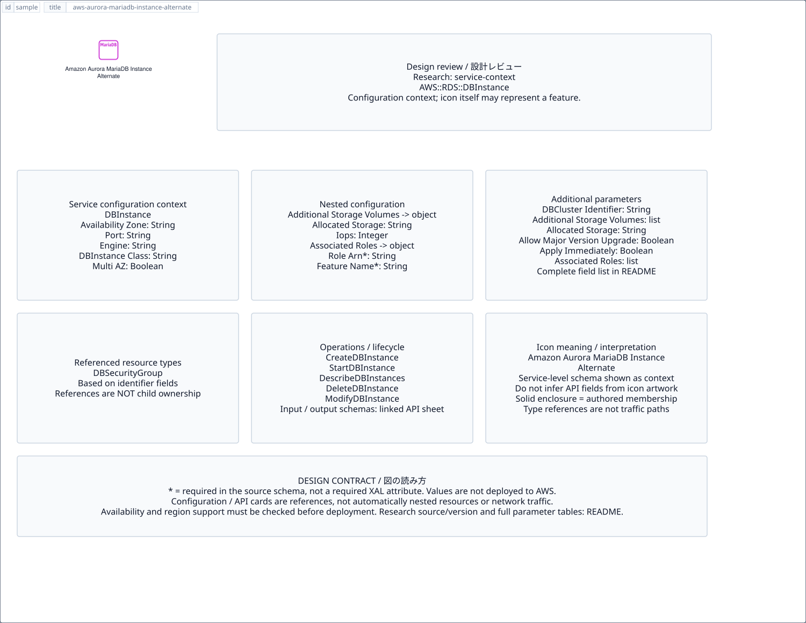

# `aws-aurora-mariadb-instance-alternate` — Amazon Aurora MariaDB Instance Alternate

[SVG preview](sample.svg) · [Editable XAL](sample.xal) · [Catalog](../README.md)



AWS resource icon. Use a label and explicit annotations to describe its role; scope is selected by the author.

- Kind: `resource`; category: Database.
- Diagram scope: `logical` (recommendation, not AWS deployment validation).
- Default catalog ID: 1796. Covered catalog IDs: 1796.
- Implementation: V1 and V2; fixed AWS icon with a wrapped label and explicit functional annotations.

## Parameters

`id` is a required, unique connection ID, not a catalog number. `label`/`title`/`name` override the label; an empty label hides it. `size` > 0 defaults to 48 px. `label-width` > 0 defaults to 160 px (default box width, at least icon size + 12 px). Explicit `width`/`height` must contain the icon and label. `visible="false"` hides it. Children and icon overrides are not supported; use a group for containment.

`detail` adds a free-form diagram annotation. `show-details="false"` hides annotation text. Only supplied values are shown; none are sent to AWS. Service/resource annotations appear on separate wrapped lines.

| Parameter | Type | Meaning | Example |
|---|---|---|---|
| `data-model` | text | Data model annotation | `Application records` |

## Review notes

The catalog provides a baseline for per-component development, not a simulation of the AWS control plane. This component's current functional parameters are the ones listed above. Additional service-specific visual behavior can be developed here without replacing catalog IDs in diagrams. Edit `sample.xal`, then run:

```sh
npm run generate:aws-samples -- --render --tag=aws-aurora-mariadb-instance-alternate
```

<!-- aws-functional-research:start -->
## 機能調査・構成デザイン（2026-09-06）

分類: `service-context`。サービス文脈: [`aws-aurora`](../aws-aurora/README.md)。

サンプルはアイコンと、設定・内包構造・関連リソース・操作を分離したレビューシートです。設定カードは編集可能な `rectangle`、グループは既存の専用タグで実装しています。カードのフィールド名を新しい XAL 属性として受理するわけではありません。専用タグが受理する属性は上の Parameters 表を参照してください。

実線の通信と、設定の参照・同じサービスに属する型一覧を区別します。スキーマの必須項目は AWS 側の仕様であり、図の必須入力ではありません。記載の構成モデル/API は取り込んだ公式資料の範囲であり、全リージョン・全機能の完全性や稼働可否を保証しません。

**重要:** このアイコンに対応する独立した構成リソースを断定せず、所属サービスの構成モデルを参考表示しています。アイコン名や絵柄から属性・親子関係・通信を推測しません。

**カタログ名称の注意:** この既存アイコン名は対応データベースエンジンの保証ではありません。Aurora の MySQL/PostgreSQL 互換性と RDS の他エンジンを混同しないでください。[Aurora guide](https://docs.aws.amazon.com/AmazonRDS/latest/AuroraUserGuide/CHAP_AuroraOverview.html)

### 構成モデル: `AWS::RDS::DBInstance`

[公式リファレンス](https://docs.aws.amazon.com/AWSCloudFormation/latest/UserGuide/aws-resource-rds-dbinstance.html)。全 81 プロパティを型付きで列挙します（表示カードには主要項目のみ）。

| Field | Type | Required in AWS schema |
|---|---|---|
| [AdditionalStorageVolumes](https://docs.aws.amazon.com/AWSCloudFormation/latest/UserGuide/aws-resource-rds-dbinstance.html#cfn-rds-dbinstance-additionalstoragevolumes) | `List<AdditionalStorageVolume>` | no |
| [AllocatedStorage](https://docs.aws.amazon.com/AWSCloudFormation/latest/UserGuide/aws-resource-rds-dbinstance.html#cfn-rds-dbinstance-allocatedstorage) | `String` | no |
| [AllowMajorVersionUpgrade](https://docs.aws.amazon.com/AWSCloudFormation/latest/UserGuide/aws-resource-rds-dbinstance.html#cfn-rds-dbinstance-allowmajorversionupgrade) | `Boolean` | no |
| [ApplyImmediately](https://docs.aws.amazon.com/AWSCloudFormation/latest/UserGuide/aws-resource-rds-dbinstance.html#cfn-rds-dbinstance-applyimmediately) | `Boolean` | no |
| [AssociatedRoles](https://docs.aws.amazon.com/AWSCloudFormation/latest/UserGuide/aws-resource-rds-dbinstance.html#cfn-rds-dbinstance-associatedroles) | `List<DBInstanceRole>` | no |
| [AutomaticBackupReplicationKmsKeyId](https://docs.aws.amazon.com/AWSCloudFormation/latest/UserGuide/aws-resource-rds-dbinstance.html#cfn-rds-dbinstance-automaticbackupreplicationkmskeyid) | `String` | no |
| [AutomaticBackupReplicationRegion](https://docs.aws.amazon.com/AWSCloudFormation/latest/UserGuide/aws-resource-rds-dbinstance.html#cfn-rds-dbinstance-automaticbackupreplicationregion) | `String` | no |
| [AutomaticBackupReplicationRetentionPeriod](https://docs.aws.amazon.com/AWSCloudFormation/latest/UserGuide/aws-resource-rds-dbinstance.html#cfn-rds-dbinstance-automaticbackupreplicationretentionperiod) | `Integer` | no |
| [AutoMinorVersionUpgrade](https://docs.aws.amazon.com/AWSCloudFormation/latest/UserGuide/aws-resource-rds-dbinstance.html#cfn-rds-dbinstance-autominorversionupgrade) | `Boolean` | no |
| [AvailabilityZone](https://docs.aws.amazon.com/AWSCloudFormation/latest/UserGuide/aws-resource-rds-dbinstance.html#cfn-rds-dbinstance-availabilityzone) | `String` | no |
| [BackupRetentionPeriod](https://docs.aws.amazon.com/AWSCloudFormation/latest/UserGuide/aws-resource-rds-dbinstance.html#cfn-rds-dbinstance-backupretentionperiod) | `Integer` | no |
| [BackupTarget](https://docs.aws.amazon.com/AWSCloudFormation/latest/UserGuide/aws-resource-rds-dbinstance.html#cfn-rds-dbinstance-backuptarget) | `String` | no |
| [CACertificateIdentifier](https://docs.aws.amazon.com/AWSCloudFormation/latest/UserGuide/aws-resource-rds-dbinstance.html#cfn-rds-dbinstance-cacertificateidentifier) | `String` | no |
| [CertificateRotationRestart](https://docs.aws.amazon.com/AWSCloudFormation/latest/UserGuide/aws-resource-rds-dbinstance.html#cfn-rds-dbinstance-certificaterotationrestart) | `Boolean` | no |
| [CharacterSetName](https://docs.aws.amazon.com/AWSCloudFormation/latest/UserGuide/aws-resource-rds-dbinstance.html#cfn-rds-dbinstance-charactersetname) | `String` | no |
| [CopyTagsToSnapshot](https://docs.aws.amazon.com/AWSCloudFormation/latest/UserGuide/aws-resource-rds-dbinstance.html#cfn-rds-dbinstance-copytagstosnapshot) | `Boolean` | no |
| [CustomIAMInstanceProfile](https://docs.aws.amazon.com/AWSCloudFormation/latest/UserGuide/aws-resource-rds-dbinstance.html#cfn-rds-dbinstance-customiaminstanceprofile) | `String` | no |
| [DatabaseInsightsMode](https://docs.aws.amazon.com/AWSCloudFormation/latest/UserGuide/aws-resource-rds-dbinstance.html#cfn-rds-dbinstance-databaseinsightsmode) | `String` | no |
| [DBClusterIdentifier](https://docs.aws.amazon.com/AWSCloudFormation/latest/UserGuide/aws-resource-rds-dbinstance.html#cfn-rds-dbinstance-dbclusteridentifier) | `String` | no |
| [DBClusterSnapshotIdentifier](https://docs.aws.amazon.com/AWSCloudFormation/latest/UserGuide/aws-resource-rds-dbinstance.html#cfn-rds-dbinstance-dbclustersnapshotidentifier) | `String` | no |
| [DBInstanceClass](https://docs.aws.amazon.com/AWSCloudFormation/latest/UserGuide/aws-resource-rds-dbinstance.html#cfn-rds-dbinstance-dbinstanceclass) | `String` | no |
| [DBInstanceIdentifier](https://docs.aws.amazon.com/AWSCloudFormation/latest/UserGuide/aws-resource-rds-dbinstance.html#cfn-rds-dbinstance-dbinstanceidentifier) | `String` | no |
| [DBName](https://docs.aws.amazon.com/AWSCloudFormation/latest/UserGuide/aws-resource-rds-dbinstance.html#cfn-rds-dbinstance-dbname) | `String` | no |
| [DBParameterGroupName](https://docs.aws.amazon.com/AWSCloudFormation/latest/UserGuide/aws-resource-rds-dbinstance.html#cfn-rds-dbinstance-dbparametergroupname) | `String` | no |
| [DBSecurityGroups](https://docs.aws.amazon.com/AWSCloudFormation/latest/UserGuide/aws-resource-rds-dbinstance.html#cfn-rds-dbinstance-dbsecuritygroups) | `List<String>` | no |
| [DBSnapshotIdentifier](https://docs.aws.amazon.com/AWSCloudFormation/latest/UserGuide/aws-resource-rds-dbinstance.html#cfn-rds-dbinstance-dbsnapshotidentifier) | `String` | no |
| [DBSubnetGroupName](https://docs.aws.amazon.com/AWSCloudFormation/latest/UserGuide/aws-resource-rds-dbinstance.html#cfn-rds-dbinstance-dbsubnetgroupname) | `String` | no |
| [DBSystemId](https://docs.aws.amazon.com/AWSCloudFormation/latest/UserGuide/aws-resource-rds-dbinstance.html#cfn-rds-dbinstance-dbsystemid) | `String` | no |
| [DedicatedLogVolume](https://docs.aws.amazon.com/AWSCloudFormation/latest/UserGuide/aws-resource-rds-dbinstance.html#cfn-rds-dbinstance-dedicatedlogvolume) | `Boolean` | no |
| [DeleteAutomatedBackups](https://docs.aws.amazon.com/AWSCloudFormation/latest/UserGuide/aws-resource-rds-dbinstance.html#cfn-rds-dbinstance-deleteautomatedbackups) | `Boolean` | no |
| [DeletionProtection](https://docs.aws.amazon.com/AWSCloudFormation/latest/UserGuide/aws-resource-rds-dbinstance.html#cfn-rds-dbinstance-deletionprotection) | `Boolean` | no |
| [Domain](https://docs.aws.amazon.com/AWSCloudFormation/latest/UserGuide/aws-resource-rds-dbinstance.html#cfn-rds-dbinstance-domain) | `String` | no |
| [DomainAuthSecretArn](https://docs.aws.amazon.com/AWSCloudFormation/latest/UserGuide/aws-resource-rds-dbinstance.html#cfn-rds-dbinstance-domainauthsecretarn) | `String` | no |
| [DomainDnsIps](https://docs.aws.amazon.com/AWSCloudFormation/latest/UserGuide/aws-resource-rds-dbinstance.html#cfn-rds-dbinstance-domaindnsips) | `List<String>` | no |
| [DomainFqdn](https://docs.aws.amazon.com/AWSCloudFormation/latest/UserGuide/aws-resource-rds-dbinstance.html#cfn-rds-dbinstance-domainfqdn) | `String` | no |
| [DomainIAMRoleName](https://docs.aws.amazon.com/AWSCloudFormation/latest/UserGuide/aws-resource-rds-dbinstance.html#cfn-rds-dbinstance-domainiamrolename) | `String` | no |
| [DomainOu](https://docs.aws.amazon.com/AWSCloudFormation/latest/UserGuide/aws-resource-rds-dbinstance.html#cfn-rds-dbinstance-domainou) | `String` | no |
| [EnableCloudwatchLogsExports](https://docs.aws.amazon.com/AWSCloudFormation/latest/UserGuide/aws-resource-rds-dbinstance.html#cfn-rds-dbinstance-enablecloudwatchlogsexports) | `List<String>` | no |
| [EnableIAMDatabaseAuthentication](https://docs.aws.amazon.com/AWSCloudFormation/latest/UserGuide/aws-resource-rds-dbinstance.html#cfn-rds-dbinstance-enableiamdatabaseauthentication) | `Boolean` | no |
| [EnablePerformanceInsights](https://docs.aws.amazon.com/AWSCloudFormation/latest/UserGuide/aws-resource-rds-dbinstance.html#cfn-rds-dbinstance-enableperformanceinsights) | `Boolean` | no |
| [Engine](https://docs.aws.amazon.com/AWSCloudFormation/latest/UserGuide/aws-resource-rds-dbinstance.html#cfn-rds-dbinstance-engine) | `String` | no |
| [EngineLifecycleSupport](https://docs.aws.amazon.com/AWSCloudFormation/latest/UserGuide/aws-resource-rds-dbinstance.html#cfn-rds-dbinstance-enginelifecyclesupport) | `String` | no |
| [EngineVersion](https://docs.aws.amazon.com/AWSCloudFormation/latest/UserGuide/aws-resource-rds-dbinstance.html#cfn-rds-dbinstance-engineversion) | `String` | no |
| [Iops](https://docs.aws.amazon.com/AWSCloudFormation/latest/UserGuide/aws-resource-rds-dbinstance.html#cfn-rds-dbinstance-iops) | `Integer` | no |
| [KmsKeyId](https://docs.aws.amazon.com/AWSCloudFormation/latest/UserGuide/aws-resource-rds-dbinstance.html#cfn-rds-dbinstance-kmskeyid) | `String` | no |
| [LicenseModel](https://docs.aws.amazon.com/AWSCloudFormation/latest/UserGuide/aws-resource-rds-dbinstance.html#cfn-rds-dbinstance-licensemodel) | `String` | no |
| [ManageMasterUserPassword](https://docs.aws.amazon.com/AWSCloudFormation/latest/UserGuide/aws-resource-rds-dbinstance.html#cfn-rds-dbinstance-managemasteruserpassword) | `Boolean` | no |
| [MasterUserAuthenticationType](https://docs.aws.amazon.com/AWSCloudFormation/latest/UserGuide/aws-resource-rds-dbinstance.html#cfn-rds-dbinstance-masteruserauthenticationtype) | `String` | no |
| [MasterUsername](https://docs.aws.amazon.com/AWSCloudFormation/latest/UserGuide/aws-resource-rds-dbinstance.html#cfn-rds-dbinstance-masterusername) | `String` | no |
| [MasterUserPassword](https://docs.aws.amazon.com/AWSCloudFormation/latest/UserGuide/aws-resource-rds-dbinstance.html#cfn-rds-dbinstance-masteruserpassword) | `String` | no |
| [MasterUserSecret](https://docs.aws.amazon.com/AWSCloudFormation/latest/UserGuide/aws-resource-rds-dbinstance.html#cfn-rds-dbinstance-masterusersecret) | `MasterUserSecret` | no |
| [MaxAllocatedStorage](https://docs.aws.amazon.com/AWSCloudFormation/latest/UserGuide/aws-resource-rds-dbinstance.html#cfn-rds-dbinstance-maxallocatedstorage) | `Integer` | no |
| [MonitoringInterval](https://docs.aws.amazon.com/AWSCloudFormation/latest/UserGuide/aws-resource-rds-dbinstance.html#cfn-rds-dbinstance-monitoringinterval) | `Integer` | no |
| [MonitoringRoleArn](https://docs.aws.amazon.com/AWSCloudFormation/latest/UserGuide/aws-resource-rds-dbinstance.html#cfn-rds-dbinstance-monitoringrolearn) | `String` | no |
| [MultiAZ](https://docs.aws.amazon.com/AWSCloudFormation/latest/UserGuide/aws-resource-rds-dbinstance.html#cfn-rds-dbinstance-multiaz) | `Boolean` | no |
| [NcharCharacterSetName](https://docs.aws.amazon.com/AWSCloudFormation/latest/UserGuide/aws-resource-rds-dbinstance.html#cfn-rds-dbinstance-ncharcharactersetname) | `String` | no |
| [NetworkType](https://docs.aws.amazon.com/AWSCloudFormation/latest/UserGuide/aws-resource-rds-dbinstance.html#cfn-rds-dbinstance-networktype) | `String` | no |
| [OptionGroupName](https://docs.aws.amazon.com/AWSCloudFormation/latest/UserGuide/aws-resource-rds-dbinstance.html#cfn-rds-dbinstance-optiongroupname) | `String` | no |
| [PerformanceInsightsKMSKeyId](https://docs.aws.amazon.com/AWSCloudFormation/latest/UserGuide/aws-resource-rds-dbinstance.html#cfn-rds-dbinstance-performanceinsightskmskeyid) | `String` | no |
| [PerformanceInsightsRetentionPeriod](https://docs.aws.amazon.com/AWSCloudFormation/latest/UserGuide/aws-resource-rds-dbinstance.html#cfn-rds-dbinstance-performanceinsightsretentionperiod) | `Integer` | no |
| [Port](https://docs.aws.amazon.com/AWSCloudFormation/latest/UserGuide/aws-resource-rds-dbinstance.html#cfn-rds-dbinstance-port) | `String` | no |
| [PreferredBackupWindow](https://docs.aws.amazon.com/AWSCloudFormation/latest/UserGuide/aws-resource-rds-dbinstance.html#cfn-rds-dbinstance-preferredbackupwindow) | `String` | no |
| [PreferredMaintenanceWindow](https://docs.aws.amazon.com/AWSCloudFormation/latest/UserGuide/aws-resource-rds-dbinstance.html#cfn-rds-dbinstance-preferredmaintenancewindow) | `String` | no |
| [ProcessorFeatures](https://docs.aws.amazon.com/AWSCloudFormation/latest/UserGuide/aws-resource-rds-dbinstance.html#cfn-rds-dbinstance-processorfeatures) | `List<ProcessorFeature>` | no |
| [PromotionTier](https://docs.aws.amazon.com/AWSCloudFormation/latest/UserGuide/aws-resource-rds-dbinstance.html#cfn-rds-dbinstance-promotiontier) | `Integer` | no |
| [PubliclyAccessible](https://docs.aws.amazon.com/AWSCloudFormation/latest/UserGuide/aws-resource-rds-dbinstance.html#cfn-rds-dbinstance-publiclyaccessible) | `Boolean` | no |
| [ReplicaMode](https://docs.aws.amazon.com/AWSCloudFormation/latest/UserGuide/aws-resource-rds-dbinstance.html#cfn-rds-dbinstance-replicamode) | `String` | no |
| [RestoreTime](https://docs.aws.amazon.com/AWSCloudFormation/latest/UserGuide/aws-resource-rds-dbinstance.html#cfn-rds-dbinstance-restoretime) | `String` | no |
| [SourceDBClusterIdentifier](https://docs.aws.amazon.com/AWSCloudFormation/latest/UserGuide/aws-resource-rds-dbinstance.html#cfn-rds-dbinstance-sourcedbclusteridentifier) | `String` | no |
| [SourceDBInstanceAutomatedBackupsArn](https://docs.aws.amazon.com/AWSCloudFormation/latest/UserGuide/aws-resource-rds-dbinstance.html#cfn-rds-dbinstance-sourcedbinstanceautomatedbackupsarn) | `String` | no |
| [SourceDBInstanceIdentifier](https://docs.aws.amazon.com/AWSCloudFormation/latest/UserGuide/aws-resource-rds-dbinstance.html#cfn-rds-dbinstance-sourcedbinstanceidentifier) | `String` | no |
| [SourceDbiResourceId](https://docs.aws.amazon.com/AWSCloudFormation/latest/UserGuide/aws-resource-rds-dbinstance.html#cfn-rds-dbinstance-sourcedbiresourceid) | `String` | no |
| [SourceRegion](https://docs.aws.amazon.com/AWSCloudFormation/latest/UserGuide/aws-resource-rds-dbinstance.html#cfn-rds-dbinstance-sourceregion) | `String` | no |
| [StorageEncrypted](https://docs.aws.amazon.com/AWSCloudFormation/latest/UserGuide/aws-resource-rds-dbinstance.html#cfn-rds-dbinstance-storageencrypted) | `Boolean` | no |
| [StorageThroughput](https://docs.aws.amazon.com/AWSCloudFormation/latest/UserGuide/aws-resource-rds-dbinstance.html#cfn-rds-dbinstance-storagethroughput) | `Integer` | no |
| [StorageType](https://docs.aws.amazon.com/AWSCloudFormation/latest/UserGuide/aws-resource-rds-dbinstance.html#cfn-rds-dbinstance-storagetype) | `String` | no |
| [Tags](https://docs.aws.amazon.com/AWSCloudFormation/latest/UserGuide/aws-resource-rds-dbinstance.html#cfn-rds-dbinstance-tags) | `List<Tag>` | no |
| [Timezone](https://docs.aws.amazon.com/AWSCloudFormation/latest/UserGuide/aws-resource-rds-dbinstance.html#cfn-rds-dbinstance-timezone) | `String` | no |
| [UseDefaultProcessorFeatures](https://docs.aws.amazon.com/AWSCloudFormation/latest/UserGuide/aws-resource-rds-dbinstance.html#cfn-rds-dbinstance-usedefaultprocessorfeatures) | `Boolean` | no |
| [UseLatestRestorableTime](https://docs.aws.amazon.com/AWSCloudFormation/latest/UserGuide/aws-resource-rds-dbinstance.html#cfn-rds-dbinstance-uselatestrestorabletime) | `Boolean` | no |
| [VPCSecurityGroups](https://docs.aws.amazon.com/AWSCloudFormation/latest/UserGuide/aws-resource-rds-dbinstance.html#cfn-rds-dbinstance-vpcsecuritygroups) | `List<String>` | no |

#### AdditionalStorageVolumes → `AWS::RDS::DBInstance.AdditionalStorageVolume`

| Field | Type | Required in AWS schema |
|---|---|---|
| [AllocatedStorage](https://docs.aws.amazon.com/AWSCloudFormation/latest/UserGuide/aws-properties-rds-dbinstance-additionalstoragevolume.html#cfn-rds-dbinstance-additionalstoragevolume-allocatedstorage) | `String` | no |
| [Iops](https://docs.aws.amazon.com/AWSCloudFormation/latest/UserGuide/aws-properties-rds-dbinstance-additionalstoragevolume.html#cfn-rds-dbinstance-additionalstoragevolume-iops) | `Integer` | no |
| [MaxAllocatedStorage](https://docs.aws.amazon.com/AWSCloudFormation/latest/UserGuide/aws-properties-rds-dbinstance-additionalstoragevolume.html#cfn-rds-dbinstance-additionalstoragevolume-maxallocatedstorage) | `Integer` | no |
| [StorageThroughput](https://docs.aws.amazon.com/AWSCloudFormation/latest/UserGuide/aws-properties-rds-dbinstance-additionalstoragevolume.html#cfn-rds-dbinstance-additionalstoragevolume-storagethroughput) | `Integer` | no |
| [StorageType](https://docs.aws.amazon.com/AWSCloudFormation/latest/UserGuide/aws-properties-rds-dbinstance-additionalstoragevolume.html#cfn-rds-dbinstance-additionalstoragevolume-storagetype) | `String` | no |
| [VolumeName](https://docs.aws.amazon.com/AWSCloudFormation/latest/UserGuide/aws-properties-rds-dbinstance-additionalstoragevolume.html#cfn-rds-dbinstance-additionalstoragevolume-volumename) | `String` | no |

#### AssociatedRoles → `AWS::RDS::DBInstance.DBInstanceRole`

| Field | Type | Required in AWS schema |
|---|---|---|
| [FeatureName](https://docs.aws.amazon.com/AWSCloudFormation/latest/UserGuide/aws-properties-rds-dbinstance-dbinstancerole.html#cfn-rds-dbinstance-dbinstancerole-featurename) | `String` | yes |
| [RoleArn](https://docs.aws.amazon.com/AWSCloudFormation/latest/UserGuide/aws-properties-rds-dbinstance-dbinstancerole.html#cfn-rds-dbinstance-dbinstancerole-rolearn) | `String` | yes |

#### MasterUserSecret → `AWS::RDS::DBInstance.MasterUserSecret`

| Field | Type | Required in AWS schema |
|---|---|---|
| [KmsKeyId](https://docs.aws.amazon.com/AWSCloudFormation/latest/UserGuide/aws-properties-rds-dbinstance-masterusersecret.html#cfn-rds-dbinstance-masterusersecret-kmskeyid) | `String` | no |
| [SecretArn](https://docs.aws.amazon.com/AWSCloudFormation/latest/UserGuide/aws-properties-rds-dbinstance-masterusersecret.html#cfn-rds-dbinstance-masterusersecret-secretarn) | `String` | no |

#### ProcessorFeatures → `AWS::RDS::DBInstance.ProcessorFeature`

| Field | Type | Required in AWS schema |
|---|---|---|
| [Name](https://docs.aws.amazon.com/AWSCloudFormation/latest/UserGuide/aws-properties-rds-dbinstance-processorfeature.html#cfn-rds-dbinstance-processorfeature-name) | `String` | no |
| [Value](https://docs.aws.amazon.com/AWSCloudFormation/latest/UserGuide/aws-properties-rds-dbinstance-processorfeature.html#cfn-rds-dbinstance-processorfeature-value) | `String` | no |

### 関連する構成リソース（19 型）

同じサービス文脈の型一覧です。すべてがこのアイコンの子リソースという意味ではありません。さらに深い入れ子は [公式スキーマのスナップショット](../research/cloudformation-models.json) に記録しています。

- [AWS::RDS::ClusterSnapshot](https://docs.aws.amazon.com/AWSCloudFormation/latest/UserGuide/aws-resource-rds-clustersnapshot.html)
- [AWS::RDS::CustomDBEngineVersion](https://docs.aws.amazon.com/AWSCloudFormation/latest/UserGuide/aws-resource-rds-customdbengineversion.html)
- [AWS::RDS::DBCluster](https://docs.aws.amazon.com/AWSCloudFormation/latest/UserGuide/aws-resource-rds-dbcluster.html)
- [AWS::RDS::DBClusterParameterGroup](https://docs.aws.amazon.com/AWSCloudFormation/latest/UserGuide/aws-resource-rds-dbclusterparametergroup.html)
- [AWS::RDS::DBInstance](https://docs.aws.amazon.com/AWSCloudFormation/latest/UserGuide/aws-resource-rds-dbinstance.html)
- [AWS::RDS::DBParameterGroup](https://docs.aws.amazon.com/AWSCloudFormation/latest/UserGuide/aws-resource-rds-dbparametergroup.html)
- [AWS::RDS::DBProxy](https://docs.aws.amazon.com/AWSCloudFormation/latest/UserGuide/aws-resource-rds-dbproxy.html)
- [AWS::RDS::DBProxyEndpoint](https://docs.aws.amazon.com/AWSCloudFormation/latest/UserGuide/aws-resource-rds-dbproxyendpoint.html)
- [AWS::RDS::DBProxyTargetGroup](https://docs.aws.amazon.com/AWSCloudFormation/latest/UserGuide/aws-resource-rds-dbproxytargetgroup.html)
- [AWS::RDS::DBSecurityGroup](https://docs.aws.amazon.com/AWSCloudFormation/latest/UserGuide/aws-properties-rds-security-group.html)
- [AWS::RDS::DBSecurityGroupIngress](https://docs.aws.amazon.com/AWSCloudFormation/latest/UserGuide/aws-resource-rds-security-group-ingress.html)
- [AWS::RDS::DBShardGroup](https://docs.aws.amazon.com/AWSCloudFormation/latest/UserGuide/aws-resource-rds-dbshardgroup.html)
- [AWS::RDS::DBSnapshot](https://docs.aws.amazon.com/AWSCloudFormation/latest/UserGuide/aws-resource-rds-dbsnapshot.html)
- [AWS::RDS::DBSubnetGroup](https://docs.aws.amazon.com/AWSCloudFormation/latest/UserGuide/aws-resource-rds-dbsubnetgroup.html)
- [AWS::RDS::EventSubscription](https://docs.aws.amazon.com/AWSCloudFormation/latest/UserGuide/aws-resource-rds-eventsubscription.html)
- [AWS::RDS::GlobalCluster](https://docs.aws.amazon.com/AWSCloudFormation/latest/UserGuide/aws-resource-rds-globalcluster.html)
- [AWS::RDS::Integration](https://docs.aws.amazon.com/AWSCloudFormation/latest/UserGuide/aws-resource-rds-integration.html)
- [AWS::RDS::OptionGroup](https://docs.aws.amazon.com/AWSCloudFormation/latest/UserGuide/aws-resource-rds-optiongroup.html)
- [AWS::RDS::ReservedDBInstance](https://docs.aws.amazon.com/AWSCloudFormation/latest/UserGuide/aws-resource-rds-reserveddbinstance.html)

### API の操作・パラメータ

- [Amazon Relational Database Service: 164 操作の入力・出力一覧](../research/api/rds.md)（API version 2014-10-31）

### 出典・調査範囲

- [公式資料 1](https://docs.aws.amazon.com/AWSCloudFormation/latest/UserGuide/aws-resource-rds-dbinstance.html)
- [公式資料 2](https://github.com/boto/botocore/blob/develop/botocore/data/rds/2014-10-31/service-2.json)

CloudFormation 仕様 263.0.0、AWS SDK 431 サービスモデルをオフラインで参照。取得日・元データの SHA-256 は [調査マニフェスト](../research/README.md) を参照。API モデル名・フィールド名は仕様から抽出し、説明本文を転載していません。利用可能性は全サービス一律には確認できないため、提供終了の確認がないものも「現在利用可能」と断定していません。

### 次の部品レビュー

- 本アイコンが独立したリソースか、機能・状態・デバイスの記号かを確認する。
- 詳細カードのうち専用の子タグ・参照属性として実装する範囲を選ぶ。
- 通信、制御、認証、監視の関係を分け、必要な接続点・配置制約を確認する。
- 編集後は `npm run generate:aws-samples -- --render --tag=aws-aurora-mariadb-instance-alternate`。通常の再描画は XAL/README を上書きしない。
<!-- aws-functional-research:end -->
