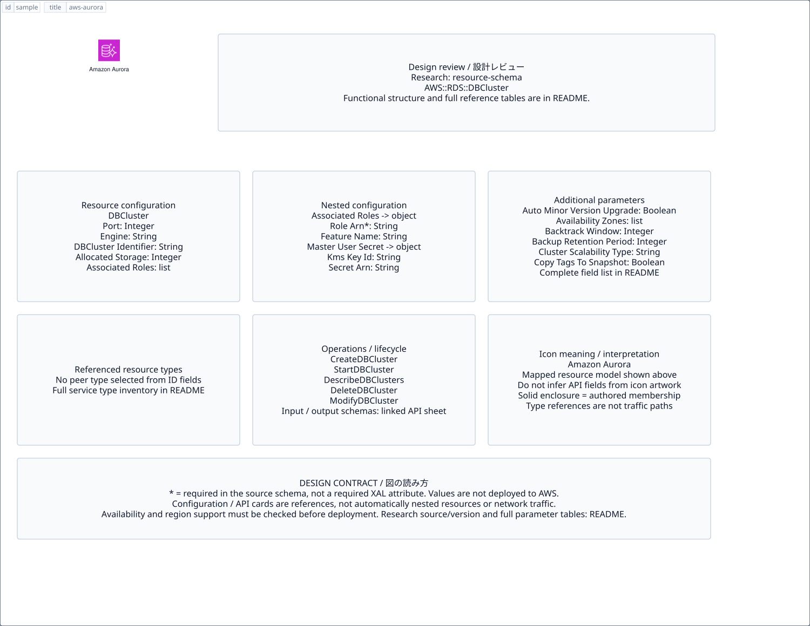

# `aws-aurora` — Amazon Aurora

[SVG preview](sample.svg) · [Editable XAL](sample.xal) · [Catalog](../README.md)



AWS service icon. Use a label and explicit annotations to describe its role; scope is selected by the author.

- Kind: `service`; category: Database.
- Diagram scope: `region` (recommendation, not AWS deployment validation).
- Default catalog ID: 143. Covered catalog IDs: 110, 121, 132, 143.
- Implementation: V1 and V2; fixed AWS icon with a wrapped label and explicit functional annotations.

## Parameters

`id` is a required, unique connection ID, not a catalog number. `label`/`title`/`name` override the label; an empty label hides it. `size` > 0 defaults to 48 px. `label-width` > 0 defaults to 160 px (default box width, at least icon size + 12 px). Explicit `width`/`height` must contain the icon and label. `visible="false"` hides it. Children and icon overrides are not supported; use a group for containment.

`detail` adds a free-form diagram annotation. `show-details="false"` hides annotation text. Only supplied values are shown; none are sent to AWS. Service/resource annotations appear on separate wrapped lines.

| Parameter | Type | Meaning | Example |
|---|---|---|---|
| `engine` | text | Database engine annotation | `PostgreSQL` |
| `multi-az` | boolean | Multi-AZ annotation; does not create replicas | `true` |

## Review notes

The catalog provides a baseline for per-component development, not a simulation of the AWS control plane. This component's current functional parameters are the ones listed above. Additional service-specific visual behavior can be developed here without replacing catalog IDs in diagrams. Edit `sample.xal`, then run:

```sh
npm run generate:aws-samples -- --render --tag=aws-aurora
```

<!-- aws-functional-research:start -->
## 機能調査・構成デザイン（2026-09-06）

分類: `resource-schema`。サービス文脈: [`aws-aurora`](../aws-aurora/README.md)。

サンプルはアイコンと、設定・内包構造・関連リソース・操作を分離したレビューシートです。設定カードは編集可能な `rectangle`、グループは既存の専用タグで実装しています。カードのフィールド名を新しい XAL 属性として受理するわけではありません。専用タグが受理する属性は上の Parameters 表を参照してください。

実線の通信と、設定の参照・同じサービスに属する型一覧を区別します。スキーマの必須項目は AWS 側の仕様であり、図の必須入力ではありません。記載の構成モデル/API は取り込んだ公式資料の範囲であり、全リージョン・全機能の完全性や稼働可否を保証しません。

### 構成モデル: `AWS::RDS::DBCluster`

[公式リファレンス](https://docs.aws.amazon.com/AWSCloudFormation/latest/UserGuide/aws-resource-rds-dbcluster.html)。全 61 プロパティを型付きで列挙します（表示カードには主要項目のみ）。

| Field | Type | Required in AWS schema |
|---|---|---|
| [AllocatedStorage](https://docs.aws.amazon.com/AWSCloudFormation/latest/UserGuide/aws-resource-rds-dbcluster.html#cfn-rds-dbcluster-allocatedstorage) | `Integer` | no |
| [AssociatedRoles](https://docs.aws.amazon.com/AWSCloudFormation/latest/UserGuide/aws-resource-rds-dbcluster.html#cfn-rds-dbcluster-associatedroles) | `List<DBClusterRole>` | no |
| [AutoMinorVersionUpgrade](https://docs.aws.amazon.com/AWSCloudFormation/latest/UserGuide/aws-resource-rds-dbcluster.html#cfn-rds-dbcluster-autominorversionupgrade) | `Boolean` | no |
| [AvailabilityZones](https://docs.aws.amazon.com/AWSCloudFormation/latest/UserGuide/aws-resource-rds-dbcluster.html#cfn-rds-dbcluster-availabilityzones) | `List<String>` | no |
| [BacktrackWindow](https://docs.aws.amazon.com/AWSCloudFormation/latest/UserGuide/aws-resource-rds-dbcluster.html#cfn-rds-dbcluster-backtrackwindow) | `Integer` | no |
| [BackupRetentionPeriod](https://docs.aws.amazon.com/AWSCloudFormation/latest/UserGuide/aws-resource-rds-dbcluster.html#cfn-rds-dbcluster-backupretentionperiod) | `Integer` | no |
| [ClusterScalabilityType](https://docs.aws.amazon.com/AWSCloudFormation/latest/UserGuide/aws-resource-rds-dbcluster.html#cfn-rds-dbcluster-clusterscalabilitytype) | `String` | no |
| [CopyTagsToSnapshot](https://docs.aws.amazon.com/AWSCloudFormation/latest/UserGuide/aws-resource-rds-dbcluster.html#cfn-rds-dbcluster-copytagstosnapshot) | `Boolean` | no |
| [DatabaseInsightsMode](https://docs.aws.amazon.com/AWSCloudFormation/latest/UserGuide/aws-resource-rds-dbcluster.html#cfn-rds-dbcluster-databaseinsightsmode) | `String` | no |
| [DatabaseName](https://docs.aws.amazon.com/AWSCloudFormation/latest/UserGuide/aws-resource-rds-dbcluster.html#cfn-rds-dbcluster-databasename) | `String` | no |
| [DBClusterIdentifier](https://docs.aws.amazon.com/AWSCloudFormation/latest/UserGuide/aws-resource-rds-dbcluster.html#cfn-rds-dbcluster-dbclusteridentifier) | `String` | no |
| [DBClusterInstanceClass](https://docs.aws.amazon.com/AWSCloudFormation/latest/UserGuide/aws-resource-rds-dbcluster.html#cfn-rds-dbcluster-dbclusterinstanceclass) | `String` | no |
| [DBClusterParameterGroupName](https://docs.aws.amazon.com/AWSCloudFormation/latest/UserGuide/aws-resource-rds-dbcluster.html#cfn-rds-dbcluster-dbclusterparametergroupname) | `String` | no |
| [DBInstanceParameterGroupName](https://docs.aws.amazon.com/AWSCloudFormation/latest/UserGuide/aws-resource-rds-dbcluster.html#cfn-rds-dbcluster-dbinstanceparametergroupname) | `String` | no |
| [DBSubnetGroupName](https://docs.aws.amazon.com/AWSCloudFormation/latest/UserGuide/aws-resource-rds-dbcluster.html#cfn-rds-dbcluster-dbsubnetgroupname) | `String` | no |
| [DBSystemId](https://docs.aws.amazon.com/AWSCloudFormation/latest/UserGuide/aws-resource-rds-dbcluster.html#cfn-rds-dbcluster-dbsystemid) | `String` | no |
| [DeleteAutomatedBackups](https://docs.aws.amazon.com/AWSCloudFormation/latest/UserGuide/aws-resource-rds-dbcluster.html#cfn-rds-dbcluster-deleteautomatedbackups) | `Boolean` | no |
| [DeletionProtection](https://docs.aws.amazon.com/AWSCloudFormation/latest/UserGuide/aws-resource-rds-dbcluster.html#cfn-rds-dbcluster-deletionprotection) | `Boolean` | no |
| [Domain](https://docs.aws.amazon.com/AWSCloudFormation/latest/UserGuide/aws-resource-rds-dbcluster.html#cfn-rds-dbcluster-domain) | `String` | no |
| [DomainIAMRoleName](https://docs.aws.amazon.com/AWSCloudFormation/latest/UserGuide/aws-resource-rds-dbcluster.html#cfn-rds-dbcluster-domainiamrolename) | `String` | no |
| [EnableCloudwatchLogsExports](https://docs.aws.amazon.com/AWSCloudFormation/latest/UserGuide/aws-resource-rds-dbcluster.html#cfn-rds-dbcluster-enablecloudwatchlogsexports) | `List<String>` | no |
| [EnableGlobalWriteForwarding](https://docs.aws.amazon.com/AWSCloudFormation/latest/UserGuide/aws-resource-rds-dbcluster.html#cfn-rds-dbcluster-enableglobalwriteforwarding) | `Boolean` | no |
| [EnableHttpEndpoint](https://docs.aws.amazon.com/AWSCloudFormation/latest/UserGuide/aws-resource-rds-dbcluster.html#cfn-rds-dbcluster-enablehttpendpoint) | `Boolean` | no |
| [EnableIAMDatabaseAuthentication](https://docs.aws.amazon.com/AWSCloudFormation/latest/UserGuide/aws-resource-rds-dbcluster.html#cfn-rds-dbcluster-enableiamdatabaseauthentication) | `Boolean` | no |
| [EnableLocalWriteForwarding](https://docs.aws.amazon.com/AWSCloudFormation/latest/UserGuide/aws-resource-rds-dbcluster.html#cfn-rds-dbcluster-enablelocalwriteforwarding) | `Boolean` | no |
| [Engine](https://docs.aws.amazon.com/AWSCloudFormation/latest/UserGuide/aws-resource-rds-dbcluster.html#cfn-rds-dbcluster-engine) | `String` | no |
| [EngineLifecycleSupport](https://docs.aws.amazon.com/AWSCloudFormation/latest/UserGuide/aws-resource-rds-dbcluster.html#cfn-rds-dbcluster-enginelifecyclesupport) | `String` | no |
| [EngineMode](https://docs.aws.amazon.com/AWSCloudFormation/latest/UserGuide/aws-resource-rds-dbcluster.html#cfn-rds-dbcluster-enginemode) | `String` | no |
| [EngineVersion](https://docs.aws.amazon.com/AWSCloudFormation/latest/UserGuide/aws-resource-rds-dbcluster.html#cfn-rds-dbcluster-engineversion) | `String` | no |
| [GlobalClusterIdentifier](https://docs.aws.amazon.com/AWSCloudFormation/latest/UserGuide/aws-resource-rds-dbcluster.html#cfn-rds-dbcluster-globalclusteridentifier) | `String` | no |
| [Iops](https://docs.aws.amazon.com/AWSCloudFormation/latest/UserGuide/aws-resource-rds-dbcluster.html#cfn-rds-dbcluster-iops) | `Integer` | no |
| [KmsKeyId](https://docs.aws.amazon.com/AWSCloudFormation/latest/UserGuide/aws-resource-rds-dbcluster.html#cfn-rds-dbcluster-kmskeyid) | `String` | no |
| [ManageMasterUserPassword](https://docs.aws.amazon.com/AWSCloudFormation/latest/UserGuide/aws-resource-rds-dbcluster.html#cfn-rds-dbcluster-managemasteruserpassword) | `Boolean` | no |
| [MasterUserAuthenticationType](https://docs.aws.amazon.com/AWSCloudFormation/latest/UserGuide/aws-resource-rds-dbcluster.html#cfn-rds-dbcluster-masteruserauthenticationtype) | `String` | no |
| [MasterUsername](https://docs.aws.amazon.com/AWSCloudFormation/latest/UserGuide/aws-resource-rds-dbcluster.html#cfn-rds-dbcluster-masterusername) | `String` | no |
| [MasterUserPassword](https://docs.aws.amazon.com/AWSCloudFormation/latest/UserGuide/aws-resource-rds-dbcluster.html#cfn-rds-dbcluster-masteruserpassword) | `String` | no |
| [MasterUserSecret](https://docs.aws.amazon.com/AWSCloudFormation/latest/UserGuide/aws-resource-rds-dbcluster.html#cfn-rds-dbcluster-masterusersecret) | `MasterUserSecret` | no |
| [MonitoringInterval](https://docs.aws.amazon.com/AWSCloudFormation/latest/UserGuide/aws-resource-rds-dbcluster.html#cfn-rds-dbcluster-monitoringinterval) | `Integer` | no |
| [MonitoringRoleArn](https://docs.aws.amazon.com/AWSCloudFormation/latest/UserGuide/aws-resource-rds-dbcluster.html#cfn-rds-dbcluster-monitoringrolearn) | `String` | no |
| [NetworkType](https://docs.aws.amazon.com/AWSCloudFormation/latest/UserGuide/aws-resource-rds-dbcluster.html#cfn-rds-dbcluster-networktype) | `String` | no |
| [PerformanceInsightsEnabled](https://docs.aws.amazon.com/AWSCloudFormation/latest/UserGuide/aws-resource-rds-dbcluster.html#cfn-rds-dbcluster-performanceinsightsenabled) | `Boolean` | no |
| [PerformanceInsightsKmsKeyId](https://docs.aws.amazon.com/AWSCloudFormation/latest/UserGuide/aws-resource-rds-dbcluster.html#cfn-rds-dbcluster-performanceinsightskmskeyid) | `String` | no |
| [PerformanceInsightsRetentionPeriod](https://docs.aws.amazon.com/AWSCloudFormation/latest/UserGuide/aws-resource-rds-dbcluster.html#cfn-rds-dbcluster-performanceinsightsretentionperiod) | `Integer` | no |
| [Port](https://docs.aws.amazon.com/AWSCloudFormation/latest/UserGuide/aws-resource-rds-dbcluster.html#cfn-rds-dbcluster-port) | `Integer` | no |
| [PreferredBackupWindow](https://docs.aws.amazon.com/AWSCloudFormation/latest/UserGuide/aws-resource-rds-dbcluster.html#cfn-rds-dbcluster-preferredbackupwindow) | `String` | no |
| [PreferredMaintenanceWindow](https://docs.aws.amazon.com/AWSCloudFormation/latest/UserGuide/aws-resource-rds-dbcluster.html#cfn-rds-dbcluster-preferredmaintenancewindow) | `String` | no |
| [PubliclyAccessible](https://docs.aws.amazon.com/AWSCloudFormation/latest/UserGuide/aws-resource-rds-dbcluster.html#cfn-rds-dbcluster-publiclyaccessible) | `Boolean` | no |
| [ReplicationSourceIdentifier](https://docs.aws.amazon.com/AWSCloudFormation/latest/UserGuide/aws-resource-rds-dbcluster.html#cfn-rds-dbcluster-replicationsourceidentifier) | `String` | no |
| [RestoreToTime](https://docs.aws.amazon.com/AWSCloudFormation/latest/UserGuide/aws-resource-rds-dbcluster.html#cfn-rds-dbcluster-restoretotime) | `String` | no |
| [RestoreType](https://docs.aws.amazon.com/AWSCloudFormation/latest/UserGuide/aws-resource-rds-dbcluster.html#cfn-rds-dbcluster-restoretype) | `String` | no |
| [ScalingConfiguration](https://docs.aws.amazon.com/AWSCloudFormation/latest/UserGuide/aws-resource-rds-dbcluster.html#cfn-rds-dbcluster-scalingconfiguration) | `ScalingConfiguration` | no |
| [ServerlessV2ScalingConfiguration](https://docs.aws.amazon.com/AWSCloudFormation/latest/UserGuide/aws-resource-rds-dbcluster.html#cfn-rds-dbcluster-serverlessv2scalingconfiguration) | `ServerlessV2ScalingConfiguration` | no |
| [SnapshotIdentifier](https://docs.aws.amazon.com/AWSCloudFormation/latest/UserGuide/aws-resource-rds-dbcluster.html#cfn-rds-dbcluster-snapshotidentifier) | `String` | no |
| [SourceDBClusterIdentifier](https://docs.aws.amazon.com/AWSCloudFormation/latest/UserGuide/aws-resource-rds-dbcluster.html#cfn-rds-dbcluster-sourcedbclusteridentifier) | `String` | no |
| [SourceDbClusterResourceId](https://docs.aws.amazon.com/AWSCloudFormation/latest/UserGuide/aws-resource-rds-dbcluster.html#cfn-rds-dbcluster-sourcedbclusterresourceid) | `String` | no |
| [SourceRegion](https://docs.aws.amazon.com/AWSCloudFormation/latest/UserGuide/aws-resource-rds-dbcluster.html#cfn-rds-dbcluster-sourceregion) | `String` | no |
| [StorageEncrypted](https://docs.aws.amazon.com/AWSCloudFormation/latest/UserGuide/aws-resource-rds-dbcluster.html#cfn-rds-dbcluster-storageencrypted) | `Boolean` | no |
| [StorageType](https://docs.aws.amazon.com/AWSCloudFormation/latest/UserGuide/aws-resource-rds-dbcluster.html#cfn-rds-dbcluster-storagetype) | `String` | no |
| [Tags](https://docs.aws.amazon.com/AWSCloudFormation/latest/UserGuide/aws-resource-rds-dbcluster.html#cfn-rds-dbcluster-tags) | `List<Tag>` | no |
| [UseLatestRestorableTime](https://docs.aws.amazon.com/AWSCloudFormation/latest/UserGuide/aws-resource-rds-dbcluster.html#cfn-rds-dbcluster-uselatestrestorabletime) | `Boolean` | no |
| [VpcSecurityGroupIds](https://docs.aws.amazon.com/AWSCloudFormation/latest/UserGuide/aws-resource-rds-dbcluster.html#cfn-rds-dbcluster-vpcsecuritygroupids) | `List<String>` | no |

#### AssociatedRoles → `AWS::RDS::DBCluster.DBClusterRole`

| Field | Type | Required in AWS schema |
|---|---|---|
| [FeatureName](https://docs.aws.amazon.com/AWSCloudFormation/latest/UserGuide/aws-properties-rds-dbcluster-dbclusterrole.html#cfn-rds-dbcluster-dbclusterrole-featurename) | `String` | no |
| [RoleArn](https://docs.aws.amazon.com/AWSCloudFormation/latest/UserGuide/aws-properties-rds-dbcluster-dbclusterrole.html#cfn-rds-dbcluster-dbclusterrole-rolearn) | `String` | yes |

#### MasterUserSecret → `AWS::RDS::DBCluster.MasterUserSecret`

| Field | Type | Required in AWS schema |
|---|---|---|
| [KmsKeyId](https://docs.aws.amazon.com/AWSCloudFormation/latest/UserGuide/aws-properties-rds-dbcluster-masterusersecret.html#cfn-rds-dbcluster-masterusersecret-kmskeyid) | `String` | no |
| [SecretArn](https://docs.aws.amazon.com/AWSCloudFormation/latest/UserGuide/aws-properties-rds-dbcluster-masterusersecret.html#cfn-rds-dbcluster-masterusersecret-secretarn) | `String` | no |

#### ScalingConfiguration → `AWS::RDS::DBCluster.ScalingConfiguration`

| Field | Type | Required in AWS schema |
|---|---|---|
| [AutoPause](https://docs.aws.amazon.com/AWSCloudFormation/latest/UserGuide/aws-properties-rds-dbcluster-scalingconfiguration.html#cfn-rds-dbcluster-scalingconfiguration-autopause) | `Boolean` | no |
| [MaxCapacity](https://docs.aws.amazon.com/AWSCloudFormation/latest/UserGuide/aws-properties-rds-dbcluster-scalingconfiguration.html#cfn-rds-dbcluster-scalingconfiguration-maxcapacity) | `Integer` | no |
| [MinCapacity](https://docs.aws.amazon.com/AWSCloudFormation/latest/UserGuide/aws-properties-rds-dbcluster-scalingconfiguration.html#cfn-rds-dbcluster-scalingconfiguration-mincapacity) | `Integer` | no |
| [SecondsBeforeTimeout](https://docs.aws.amazon.com/AWSCloudFormation/latest/UserGuide/aws-properties-rds-dbcluster-scalingconfiguration.html#cfn-rds-dbcluster-scalingconfiguration-secondsbeforetimeout) | `Integer` | no |
| [SecondsUntilAutoPause](https://docs.aws.amazon.com/AWSCloudFormation/latest/UserGuide/aws-properties-rds-dbcluster-scalingconfiguration.html#cfn-rds-dbcluster-scalingconfiguration-secondsuntilautopause) | `Integer` | no |
| [TimeoutAction](https://docs.aws.amazon.com/AWSCloudFormation/latest/UserGuide/aws-properties-rds-dbcluster-scalingconfiguration.html#cfn-rds-dbcluster-scalingconfiguration-timeoutaction) | `String` | no |

#### ServerlessV2ScalingConfiguration → `AWS::RDS::DBCluster.ServerlessV2ScalingConfiguration`

| Field | Type | Required in AWS schema |
|---|---|---|
| [MaxCapacity](https://docs.aws.amazon.com/AWSCloudFormation/latest/UserGuide/aws-properties-rds-dbcluster-serverlessv2scalingconfiguration.html#cfn-rds-dbcluster-serverlessv2scalingconfiguration-maxcapacity) | `Double` | no |
| [MinCapacity](https://docs.aws.amazon.com/AWSCloudFormation/latest/UserGuide/aws-properties-rds-dbcluster-serverlessv2scalingconfiguration.html#cfn-rds-dbcluster-serverlessv2scalingconfiguration-mincapacity) | `Double` | no |
| [SecondsUntilAutoPause](https://docs.aws.amazon.com/AWSCloudFormation/latest/UserGuide/aws-properties-rds-dbcluster-serverlessv2scalingconfiguration.html#cfn-rds-dbcluster-serverlessv2scalingconfiguration-secondsuntilautopause) | `Integer` | no |

### 関連する構成リソース（19 型）

同じサービス文脈の型一覧です。すべてがこのアイコンの子リソースという意味ではありません。さらに深い入れ子は [公式スキーマのスナップショット](../research/cloudformation-models.json) に記録しています。

- [AWS::RDS::DBCluster](https://docs.aws.amazon.com/AWSCloudFormation/latest/UserGuide/aws-resource-rds-dbcluster.html)
- [AWS::RDS::ClusterSnapshot](https://docs.aws.amazon.com/AWSCloudFormation/latest/UserGuide/aws-resource-rds-clustersnapshot.html)
- [AWS::RDS::CustomDBEngineVersion](https://docs.aws.amazon.com/AWSCloudFormation/latest/UserGuide/aws-resource-rds-customdbengineversion.html)
- [AWS::RDS::DBClusterParameterGroup](https://docs.aws.amazon.com/AWSCloudFormation/latest/UserGuide/aws-resource-rds-dbclusterparametergroup.html)
- [AWS::RDS::DBInstance](https://docs.aws.amazon.com/AWSCloudFormation/latest/UserGuide/aws-resource-rds-dbinstance.html)
- [AWS::RDS::DBParameterGroup](https://docs.aws.amazon.com/AWSCloudFormation/latest/UserGuide/aws-resource-rds-dbparametergroup.html)
- [AWS::RDS::DBProxy](https://docs.aws.amazon.com/AWSCloudFormation/latest/UserGuide/aws-resource-rds-dbproxy.html)
- [AWS::RDS::DBProxyEndpoint](https://docs.aws.amazon.com/AWSCloudFormation/latest/UserGuide/aws-resource-rds-dbproxyendpoint.html)
- [AWS::RDS::DBProxyTargetGroup](https://docs.aws.amazon.com/AWSCloudFormation/latest/UserGuide/aws-resource-rds-dbproxytargetgroup.html)
- [AWS::RDS::DBSecurityGroup](https://docs.aws.amazon.com/AWSCloudFormation/latest/UserGuide/aws-properties-rds-security-group.html)
- [AWS::RDS::DBSecurityGroupIngress](https://docs.aws.amazon.com/AWSCloudFormation/latest/UserGuide/aws-resource-rds-security-group-ingress.html)
- [AWS::RDS::DBShardGroup](https://docs.aws.amazon.com/AWSCloudFormation/latest/UserGuide/aws-resource-rds-dbshardgroup.html)
- [AWS::RDS::DBSnapshot](https://docs.aws.amazon.com/AWSCloudFormation/latest/UserGuide/aws-resource-rds-dbsnapshot.html)
- [AWS::RDS::DBSubnetGroup](https://docs.aws.amazon.com/AWSCloudFormation/latest/UserGuide/aws-resource-rds-dbsubnetgroup.html)
- [AWS::RDS::EventSubscription](https://docs.aws.amazon.com/AWSCloudFormation/latest/UserGuide/aws-resource-rds-eventsubscription.html)
- [AWS::RDS::GlobalCluster](https://docs.aws.amazon.com/AWSCloudFormation/latest/UserGuide/aws-resource-rds-globalcluster.html)
- [AWS::RDS::Integration](https://docs.aws.amazon.com/AWSCloudFormation/latest/UserGuide/aws-resource-rds-integration.html)
- [AWS::RDS::OptionGroup](https://docs.aws.amazon.com/AWSCloudFormation/latest/UserGuide/aws-resource-rds-optiongroup.html)
- [AWS::RDS::ReservedDBInstance](https://docs.aws.amazon.com/AWSCloudFormation/latest/UserGuide/aws-resource-rds-reserveddbinstance.html)

### API の操作・パラメータ

- [Amazon Relational Database Service: 164 操作の入力・出力一覧](../research/api/rds.md)（API version 2014-10-31）

### 出典・調査範囲

- [公式資料 1](https://docs.aws.amazon.com/AWSCloudFormation/latest/UserGuide/aws-resource-rds-dbcluster.html)
- [公式資料 2](https://github.com/boto/botocore/blob/develop/botocore/data/rds/2014-10-31/service-2.json)

CloudFormation 仕様 263.0.0、AWS SDK 431 サービスモデルをオフラインで参照。取得日・元データの SHA-256 は [調査マニフェスト](../research/README.md) を参照。API モデル名・フィールド名は仕様から抽出し、説明本文を転載していません。利用可能性は全サービス一律には確認できないため、提供終了の確認がないものも「現在利用可能」と断定していません。

### 次の部品レビュー

- 本アイコンが独立したリソースか、機能・状態・デバイスの記号かを確認する。
- 詳細カードのうち専用の子タグ・参照属性として実装する範囲を選ぶ。
- 通信、制御、認証、監視の関係を分け、必要な接続点・配置制約を確認する。
- 編集後は `npm run generate:aws-samples -- --render --tag=aws-aurora`。通常の再描画は XAL/README を上書きしない。
<!-- aws-functional-research:end -->
