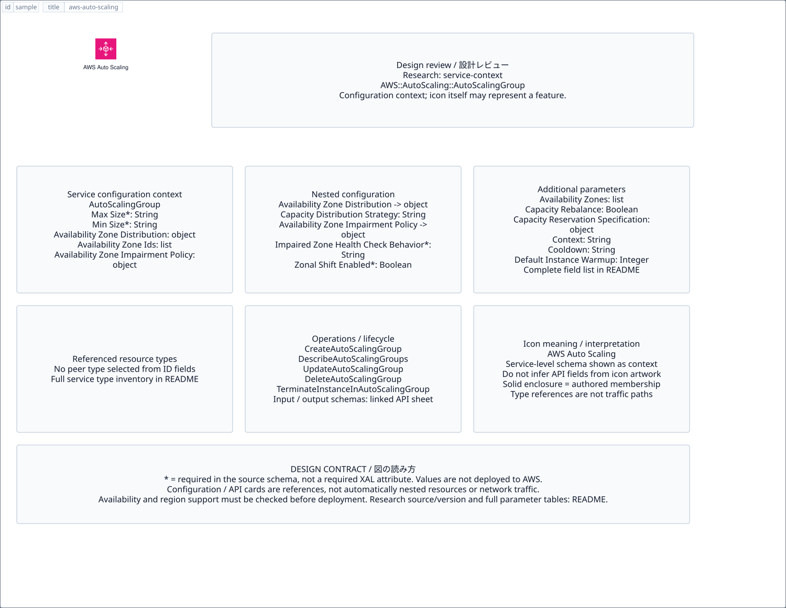

# `aws-auto-scaling` — AWS Auto Scaling

[SVG preview](sample.svg) · [Editable XAL](sample.xal) · [Catalog](../README.md)



AWS service icon. Use a label and explicit annotations to describe its role; scope is selected by the author.

- Kind: `service`; category: Management Governance.
- Diagram scope: `service` (recommendation, not AWS deployment validation).
- Default catalog ID: 669. Covered catalog IDs: 579, 609, 639, 669.
- Implementation: V1 and V2; fixed AWS icon with a wrapped label and explicit functional annotations.

## Parameters

`id` is a required, unique connection ID, not a catalog number. `label`/`title`/`name` override the label; an empty label hides it. `size` > 0 defaults to 48 px. `label-width` > 0 defaults to 160 px (default box width, at least icon size + 12 px). Explicit `width`/`height` must contain the icon and label. `visible="false"` hides it. Children and icon overrides are not supported; use a group for containment.

`detail` adds a free-form diagram annotation. `show-details="false"` hides annotation text. Only supplied values are shown; none are sent to AWS. Service/resource annotations appear on separate wrapped lines.

| Parameter | Type | Meaning | Example |
|---|---|---|---|
| `target` | text | Managed resource or build target | `Application` |

## Review notes

The catalog provides a baseline for per-component development, not a simulation of the AWS control plane. This component's current functional parameters are the ones listed above. Additional service-specific visual behavior can be developed here without replacing catalog IDs in diagrams. Edit `sample.xal`, then run:

```sh
npm run generate:aws-samples -- --render --tag=aws-auto-scaling
```

<!-- aws-functional-research:start -->
## 機能調査・構成デザイン（2026-09-06）

分類: `service-context`。サービス文脈: [`aws-auto-scaling`](../aws-auto-scaling/README.md)。

サンプルはアイコンと、設定・内包構造・関連リソース・操作を分離したレビューシートです。設定カードは編集可能な `rectangle`、グループは既存の専用タグで実装しています。カードのフィールド名を新しい XAL 属性として受理するわけではありません。専用タグが受理する属性は上の Parameters 表を参照してください。

実線の通信と、設定の参照・同じサービスに属する型一覧を区別します。スキーマの必須項目は AWS 側の仕様であり、図の必須入力ではありません。記載の構成モデル/API は取り込んだ公式資料の範囲であり、全リージョン・全機能の完全性や稼働可否を保証しません。

**重要:** このアイコンに対応する独立した構成リソースを断定せず、所属サービスの構成モデルを参考表示しています。アイコン名や絵柄から属性・親子関係・通信を推測しません。

### 構成モデル: `AWS::AutoScaling::AutoScalingGroup`

[公式リファレンス](https://docs.aws.amazon.com/AWSCloudFormation/latest/UserGuide/aws-resource-autoscaling-autoscalinggroup.html)。全 37 プロパティを型付きで列挙します（表示カードには主要項目のみ）。

| Field | Type | Required in AWS schema |
|---|---|---|
| [AutoScalingGroupName](https://docs.aws.amazon.com/AWSCloudFormation/latest/UserGuide/aws-resource-autoscaling-autoscalinggroup.html#cfn-autoscaling-autoscalinggroup-autoscalinggroupname) | `String` | no |
| [AvailabilityZoneDistribution](https://docs.aws.amazon.com/AWSCloudFormation/latest/UserGuide/aws-resource-autoscaling-autoscalinggroup.html#cfn-autoscaling-autoscalinggroup-availabilityzonedistribution) | `AvailabilityZoneDistribution` | no |
| [AvailabilityZoneIds](https://docs.aws.amazon.com/AWSCloudFormation/latest/UserGuide/aws-resource-autoscaling-autoscalinggroup.html#cfn-autoscaling-autoscalinggroup-availabilityzoneids) | `List<String>` | no |
| [AvailabilityZoneImpairmentPolicy](https://docs.aws.amazon.com/AWSCloudFormation/latest/UserGuide/aws-resource-autoscaling-autoscalinggroup.html#cfn-autoscaling-autoscalinggroup-availabilityzoneimpairmentpolicy) | `AvailabilityZoneImpairmentPolicy` | no |
| [AvailabilityZones](https://docs.aws.amazon.com/AWSCloudFormation/latest/UserGuide/aws-resource-autoscaling-autoscalinggroup.html#cfn-autoscaling-autoscalinggroup-availabilityzones) | `List<String>` | no |
| [CapacityRebalance](https://docs.aws.amazon.com/AWSCloudFormation/latest/UserGuide/aws-resource-autoscaling-autoscalinggroup.html#cfn-autoscaling-autoscalinggroup-capacityrebalance) | `Boolean` | no |
| [CapacityReservationSpecification](https://docs.aws.amazon.com/AWSCloudFormation/latest/UserGuide/aws-resource-autoscaling-autoscalinggroup.html#cfn-autoscaling-autoscalinggroup-capacityreservationspecification) | `CapacityReservationSpecification` | no |
| [Context](https://docs.aws.amazon.com/AWSCloudFormation/latest/UserGuide/aws-resource-autoscaling-autoscalinggroup.html#cfn-autoscaling-autoscalinggroup-context) | `String` | no |
| [Cooldown](https://docs.aws.amazon.com/AWSCloudFormation/latest/UserGuide/aws-resource-autoscaling-autoscalinggroup.html#cfn-autoscaling-autoscalinggroup-cooldown) | `String` | no |
| [DefaultInstanceWarmup](https://docs.aws.amazon.com/AWSCloudFormation/latest/UserGuide/aws-resource-autoscaling-autoscalinggroup.html#cfn-autoscaling-autoscalinggroup-defaultinstancewarmup) | `Integer` | no |
| [DeletionProtection](https://docs.aws.amazon.com/AWSCloudFormation/latest/UserGuide/aws-resource-autoscaling-autoscalinggroup.html#cfn-autoscaling-autoscalinggroup-deletionprotection) | `String` | no |
| [DesiredCapacity](https://docs.aws.amazon.com/AWSCloudFormation/latest/UserGuide/aws-resource-autoscaling-autoscalinggroup.html#cfn-autoscaling-autoscalinggroup-desiredcapacity) | `String` | no |
| [DesiredCapacityType](https://docs.aws.amazon.com/AWSCloudFormation/latest/UserGuide/aws-resource-autoscaling-autoscalinggroup.html#cfn-autoscaling-autoscalinggroup-desiredcapacitytype) | `String` | no |
| [HealthCheckGracePeriod](https://docs.aws.amazon.com/AWSCloudFormation/latest/UserGuide/aws-resource-autoscaling-autoscalinggroup.html#cfn-autoscaling-autoscalinggroup-healthcheckgraceperiod) | `Integer` | no |
| [HealthCheckType](https://docs.aws.amazon.com/AWSCloudFormation/latest/UserGuide/aws-resource-autoscaling-autoscalinggroup.html#cfn-autoscaling-autoscalinggroup-healthchecktype) | `String` | no |
| [InstanceId](https://docs.aws.amazon.com/AWSCloudFormation/latest/UserGuide/aws-resource-autoscaling-autoscalinggroup.html#cfn-autoscaling-autoscalinggroup-instanceid) | `String` | no |
| [InstanceLifecyclePolicy](https://docs.aws.amazon.com/AWSCloudFormation/latest/UserGuide/aws-resource-autoscaling-autoscalinggroup.html#cfn-autoscaling-autoscalinggroup-instancelifecyclepolicy) | `InstanceLifecyclePolicy` | no |
| [InstanceMaintenancePolicy](https://docs.aws.amazon.com/AWSCloudFormation/latest/UserGuide/aws-resource-autoscaling-autoscalinggroup.html#cfn-autoscaling-autoscalinggroup-instancemaintenancepolicy) | `InstanceMaintenancePolicy` | no |
| [LaunchConfigurationName](https://docs.aws.amazon.com/AWSCloudFormation/latest/UserGuide/aws-resource-autoscaling-autoscalinggroup.html#cfn-autoscaling-autoscalinggroup-launchconfigurationname) | `String` | no |
| [LaunchTemplate](https://docs.aws.amazon.com/AWSCloudFormation/latest/UserGuide/aws-resource-autoscaling-autoscalinggroup.html#cfn-autoscaling-autoscalinggroup-launchtemplate) | `LaunchTemplateSpecification` | no |
| [LifecycleHookSpecificationList](https://docs.aws.amazon.com/AWSCloudFormation/latest/UserGuide/aws-resource-autoscaling-autoscalinggroup.html#cfn-autoscaling-autoscalinggroup-lifecyclehookspecificationlist) | `List<LifecycleHookSpecification>` | no |
| [LoadBalancerNames](https://docs.aws.amazon.com/AWSCloudFormation/latest/UserGuide/aws-resource-autoscaling-autoscalinggroup.html#cfn-autoscaling-autoscalinggroup-loadbalancernames) | `List<String>` | no |
| [MaxInstanceLifetime](https://docs.aws.amazon.com/AWSCloudFormation/latest/UserGuide/aws-resource-autoscaling-autoscalinggroup.html#cfn-autoscaling-autoscalinggroup-maxinstancelifetime) | `Integer` | no |
| [MaxSize](https://docs.aws.amazon.com/AWSCloudFormation/latest/UserGuide/aws-resource-autoscaling-autoscalinggroup.html#cfn-autoscaling-autoscalinggroup-maxsize) | `String` | yes |
| [MetricsCollection](https://docs.aws.amazon.com/AWSCloudFormation/latest/UserGuide/aws-resource-autoscaling-autoscalinggroup.html#cfn-autoscaling-autoscalinggroup-metricscollection) | `List<MetricsCollection>` | no |
| [MinSize](https://docs.aws.amazon.com/AWSCloudFormation/latest/UserGuide/aws-resource-autoscaling-autoscalinggroup.html#cfn-autoscaling-autoscalinggroup-minsize) | `String` | yes |
| [MixedInstancesPolicy](https://docs.aws.amazon.com/AWSCloudFormation/latest/UserGuide/aws-resource-autoscaling-autoscalinggroup.html#cfn-autoscaling-autoscalinggroup-mixedinstancespolicy) | `MixedInstancesPolicy` | no |
| [NewInstancesProtectedFromScaleIn](https://docs.aws.amazon.com/AWSCloudFormation/latest/UserGuide/aws-resource-autoscaling-autoscalinggroup.html#cfn-autoscaling-autoscalinggroup-newinstancesprotectedfromscalein) | `Boolean` | no |
| [NotificationConfigurations](https://docs.aws.amazon.com/AWSCloudFormation/latest/UserGuide/aws-resource-autoscaling-autoscalinggroup.html#cfn-autoscaling-autoscalinggroup-notificationconfigurations) | `List<NotificationConfiguration>` | no |
| [PlacementGroup](https://docs.aws.amazon.com/AWSCloudFormation/latest/UserGuide/aws-resource-autoscaling-autoscalinggroup.html#cfn-autoscaling-autoscalinggroup-placementgroup) | `String` | no |
| [ServiceLinkedRoleARN](https://docs.aws.amazon.com/AWSCloudFormation/latest/UserGuide/aws-resource-autoscaling-autoscalinggroup.html#cfn-autoscaling-autoscalinggroup-servicelinkedrolearn) | `String` | no |
| [SkipZonalShiftValidation](https://docs.aws.amazon.com/AWSCloudFormation/latest/UserGuide/aws-resource-autoscaling-autoscalinggroup.html#cfn-autoscaling-autoscalinggroup-skipzonalshiftvalidation) | `Boolean` | no |
| [Tags](https://docs.aws.amazon.com/AWSCloudFormation/latest/UserGuide/aws-resource-autoscaling-autoscalinggroup.html#cfn-autoscaling-autoscalinggroup-tags) | `List<TagProperty>` | no |
| [TargetGroupARNs](https://docs.aws.amazon.com/AWSCloudFormation/latest/UserGuide/aws-resource-autoscaling-autoscalinggroup.html#cfn-autoscaling-autoscalinggroup-targetgrouparns) | `List<String>` | no |
| [TerminationPolicies](https://docs.aws.amazon.com/AWSCloudFormation/latest/UserGuide/aws-resource-autoscaling-autoscalinggroup.html#cfn-autoscaling-autoscalinggroup-terminationpolicies) | `List<String>` | no |
| [TrafficSources](https://docs.aws.amazon.com/AWSCloudFormation/latest/UserGuide/aws-resource-autoscaling-autoscalinggroup.html#cfn-autoscaling-autoscalinggroup-trafficsources) | `List<TrafficSourceIdentifier>` | no |
| [VPCZoneIdentifier](https://docs.aws.amazon.com/AWSCloudFormation/latest/UserGuide/aws-resource-autoscaling-autoscalinggroup.html#cfn-autoscaling-autoscalinggroup-vpczoneidentifier) | `List<String>` | no |

#### AvailabilityZoneDistribution → `AWS::AutoScaling::AutoScalingGroup.AvailabilityZoneDistribution`

| Field | Type | Required in AWS schema |
|---|---|---|
| [CapacityDistributionStrategy](https://docs.aws.amazon.com/AWSCloudFormation/latest/UserGuide/aws-properties-autoscaling-autoscalinggroup-availabilityzonedistribution.html#cfn-autoscaling-autoscalinggroup-availabilityzonedistribution-capacitydistributionstrategy) | `String` | no |

#### AvailabilityZoneImpairmentPolicy → `AWS::AutoScaling::AutoScalingGroup.AvailabilityZoneImpairmentPolicy`

| Field | Type | Required in AWS schema |
|---|---|---|
| [ImpairedZoneHealthCheckBehavior](https://docs.aws.amazon.com/AWSCloudFormation/latest/UserGuide/aws-properties-autoscaling-autoscalinggroup-availabilityzoneimpairmentpolicy.html#cfn-autoscaling-autoscalinggroup-availabilityzoneimpairmentpolicy-impairedzonehealthcheckbehavior) | `String` | yes |
| [ZonalShiftEnabled](https://docs.aws.amazon.com/AWSCloudFormation/latest/UserGuide/aws-properties-autoscaling-autoscalinggroup-availabilityzoneimpairmentpolicy.html#cfn-autoscaling-autoscalinggroup-availabilityzoneimpairmentpolicy-zonalshiftenabled) | `Boolean` | yes |

#### CapacityReservationSpecification → `AWS::AutoScaling::AutoScalingGroup.CapacityReservationSpecification`

| Field | Type | Required in AWS schema |
|---|---|---|
| [CapacityReservationPreference](https://docs.aws.amazon.com/AWSCloudFormation/latest/UserGuide/aws-properties-autoscaling-autoscalinggroup-capacityreservationspecification.html#cfn-autoscaling-autoscalinggroup-capacityreservationspecification-capacityreservationpreference) | `String` | yes |
| [CapacityReservationTarget](https://docs.aws.amazon.com/AWSCloudFormation/latest/UserGuide/aws-properties-autoscaling-autoscalinggroup-capacityreservationspecification.html#cfn-autoscaling-autoscalinggroup-capacityreservationspecification-capacityreservationtarget) | `CapacityReservationTarget` | no |

#### InstanceLifecyclePolicy → `AWS::AutoScaling::AutoScalingGroup.InstanceLifecyclePolicy`

| Field | Type | Required in AWS schema |
|---|---|---|
| [RetentionTriggers](https://docs.aws.amazon.com/AWSCloudFormation/latest/UserGuide/aws-properties-autoscaling-autoscalinggroup-instancelifecyclepolicy.html#cfn-autoscaling-autoscalinggroup-instancelifecyclepolicy-retentiontriggers) | `RetentionTriggers` | no |

#### InstanceMaintenancePolicy → `AWS::AutoScaling::AutoScalingGroup.InstanceMaintenancePolicy`

| Field | Type | Required in AWS schema |
|---|---|---|
| [MaxHealthyPercentage](https://docs.aws.amazon.com/AWSCloudFormation/latest/UserGuide/aws-properties-autoscaling-autoscalinggroup-instancemaintenancepolicy.html#cfn-autoscaling-autoscalinggroup-instancemaintenancepolicy-maxhealthypercentage) | `Integer` | no |
| [MinHealthyPercentage](https://docs.aws.amazon.com/AWSCloudFormation/latest/UserGuide/aws-properties-autoscaling-autoscalinggroup-instancemaintenancepolicy.html#cfn-autoscaling-autoscalinggroup-instancemaintenancepolicy-minhealthypercentage) | `Integer` | no |

#### LaunchTemplate → `AWS::AutoScaling::AutoScalingGroup.LaunchTemplateSpecification`

| Field | Type | Required in AWS schema |
|---|---|---|
| [LaunchTemplateId](https://docs.aws.amazon.com/AWSCloudFormation/latest/UserGuide/aws-properties-autoscaling-autoscalinggroup-launchtemplatespecification.html#cfn-autoscaling-autoscalinggroup-launchtemplatespecification-launchtemplateid) | `String` | no |
| [LaunchTemplateName](https://docs.aws.amazon.com/AWSCloudFormation/latest/UserGuide/aws-properties-autoscaling-autoscalinggroup-launchtemplatespecification.html#cfn-autoscaling-autoscalinggroup-launchtemplatespecification-launchtemplatename) | `String` | no |
| [Version](https://docs.aws.amazon.com/AWSCloudFormation/latest/UserGuide/aws-properties-autoscaling-autoscalinggroup-launchtemplatespecification.html#cfn-autoscaling-autoscalinggroup-launchtemplatespecification-version) | `String` | yes |

#### LifecycleHookSpecificationList → `AWS::AutoScaling::AutoScalingGroup.LifecycleHookSpecification`

| Field | Type | Required in AWS schema |
|---|---|---|
| [DefaultResult](https://docs.aws.amazon.com/AWSCloudFormation/latest/UserGuide/aws-properties-autoscaling-autoscalinggroup-lifecyclehookspecification.html#cfn-autoscaling-autoscalinggroup-lifecyclehookspecification-defaultresult) | `String` | no |
| [HeartbeatTimeout](https://docs.aws.amazon.com/AWSCloudFormation/latest/UserGuide/aws-properties-autoscaling-autoscalinggroup-lifecyclehookspecification.html#cfn-autoscaling-autoscalinggroup-lifecyclehookspecification-heartbeattimeout) | `Integer` | no |
| [LifecycleHookName](https://docs.aws.amazon.com/AWSCloudFormation/latest/UserGuide/aws-properties-autoscaling-autoscalinggroup-lifecyclehookspecification.html#cfn-autoscaling-autoscalinggroup-lifecyclehookspecification-lifecyclehookname) | `String` | yes |
| [LifecycleTransition](https://docs.aws.amazon.com/AWSCloudFormation/latest/UserGuide/aws-properties-autoscaling-autoscalinggroup-lifecyclehookspecification.html#cfn-autoscaling-autoscalinggroup-lifecyclehookspecification-lifecycletransition) | `String` | yes |
| [NotificationMetadata](https://docs.aws.amazon.com/AWSCloudFormation/latest/UserGuide/aws-properties-autoscaling-autoscalinggroup-lifecyclehookspecification.html#cfn-autoscaling-autoscalinggroup-lifecyclehookspecification-notificationmetadata) | `String` | no |
| [NotificationTargetARN](https://docs.aws.amazon.com/AWSCloudFormation/latest/UserGuide/aws-properties-autoscaling-autoscalinggroup-lifecyclehookspecification.html#cfn-autoscaling-autoscalinggroup-lifecyclehookspecification-notificationtargetarn) | `String` | no |
| [RoleARN](https://docs.aws.amazon.com/AWSCloudFormation/latest/UserGuide/aws-properties-autoscaling-autoscalinggroup-lifecyclehookspecification.html#cfn-autoscaling-autoscalinggroup-lifecyclehookspecification-rolearn) | `String` | no |

#### MetricsCollection → `AWS::AutoScaling::AutoScalingGroup.MetricsCollection`

| Field | Type | Required in AWS schema |
|---|---|---|
| [Granularity](https://docs.aws.amazon.com/AWSCloudFormation/latest/UserGuide/aws-properties-autoscaling-autoscalinggroup-metricscollection.html#cfn-autoscaling-autoscalinggroup-metricscollection-granularity) | `String` | yes |
| [Metrics](https://docs.aws.amazon.com/AWSCloudFormation/latest/UserGuide/aws-properties-autoscaling-autoscalinggroup-metricscollection.html#cfn-autoscaling-autoscalinggroup-metricscollection-metrics) | `List<String>` | no |

#### MixedInstancesPolicy → `AWS::AutoScaling::AutoScalingGroup.MixedInstancesPolicy`

| Field | Type | Required in AWS schema |
|---|---|---|
| [InstancesDistribution](https://docs.aws.amazon.com/AWSCloudFormation/latest/UserGuide/aws-properties-autoscaling-autoscalinggroup-mixedinstancespolicy.html#cfn-autoscaling-autoscalinggroup-mixedinstancespolicy-instancesdistribution) | `InstancesDistribution` | no |
| [LaunchTemplate](https://docs.aws.amazon.com/AWSCloudFormation/latest/UserGuide/aws-properties-autoscaling-autoscalinggroup-mixedinstancespolicy.html#cfn-autoscaling-autoscalinggroup-mixedinstancespolicy-launchtemplate) | `LaunchTemplate` | yes |

#### NotificationConfigurations → `AWS::AutoScaling::AutoScalingGroup.NotificationConfiguration`

| Field | Type | Required in AWS schema |
|---|---|---|
| [NotificationTypes](https://docs.aws.amazon.com/AWSCloudFormation/latest/UserGuide/aws-properties-autoscaling-autoscalinggroup-notificationconfiguration.html#cfn-autoscaling-autoscalinggroup-notificationconfiguration-notificationtypes) | `List<String>` | no |
| [TopicARN](https://docs.aws.amazon.com/AWSCloudFormation/latest/UserGuide/aws-properties-autoscaling-autoscalinggroup-notificationconfiguration.html#cfn-autoscaling-autoscalinggroup-notificationconfiguration-topicarn) | `List<String>` | yes |

#### TrafficSources → `AWS::AutoScaling::AutoScalingGroup.TrafficSourceIdentifier`

| Field | Type | Required in AWS schema |
|---|---|---|
| [Identifier](https://docs.aws.amazon.com/AWSCloudFormation/latest/UserGuide/aws-properties-autoscaling-autoscalinggroup-trafficsourceidentifier.html#cfn-autoscaling-autoscalinggroup-trafficsourceidentifier-identifier) | `String` | yes |
| [Type](https://docs.aws.amazon.com/AWSCloudFormation/latest/UserGuide/aws-properties-autoscaling-autoscalinggroup-trafficsourceidentifier.html#cfn-autoscaling-autoscalinggroup-trafficsourceidentifier-type) | `String` | yes |

#### Tags → `AWS::AutoScaling::AutoScalingGroup.TagProperty`

| Field | Type | Required in AWS schema |
|---|---|---|
| [Key](https://docs.aws.amazon.com/AWSCloudFormation/latest/UserGuide/aws-properties-autoscaling-autoscalinggroup-tagproperty.html#cfn-autoscaling-autoscalinggroup-tagproperty-key) | `String` | yes |
| [PropagateAtLaunch](https://docs.aws.amazon.com/AWSCloudFormation/latest/UserGuide/aws-properties-autoscaling-autoscalinggroup-tagproperty.html#cfn-autoscaling-autoscalinggroup-tagproperty-propagateatlaunch) | `Boolean` | yes |
| [Value](https://docs.aws.amazon.com/AWSCloudFormation/latest/UserGuide/aws-properties-autoscaling-autoscalinggroup-tagproperty.html#cfn-autoscaling-autoscalinggroup-tagproperty-value) | `String` | yes |

### 関連する構成リソース（7 型）

同じサービス文脈の型一覧です。すべてがこのアイコンの子リソースという意味ではありません。さらに深い入れ子は [公式スキーマのスナップショット](../research/cloudformation-models.json) に記録しています。

- [AWS::AutoScaling::AutoScalingGroup](https://docs.aws.amazon.com/AWSCloudFormation/latest/UserGuide/aws-resource-autoscaling-autoscalinggroup.html)
- [AWS::AutoScaling::LaunchConfiguration](https://docs.aws.amazon.com/AWSCloudFormation/latest/UserGuide/aws-resource-autoscaling-launchconfiguration.html)
- [AWS::AutoScaling::LifecycleHook](https://docs.aws.amazon.com/AWSCloudFormation/latest/UserGuide/aws-resource-autoscaling-lifecyclehook.html)
- [AWS::AutoScaling::ScalingPolicy](https://docs.aws.amazon.com/AWSCloudFormation/latest/UserGuide/aws-resource-autoscaling-scalingpolicy.html)
- [AWS::AutoScaling::ScheduledAction](https://docs.aws.amazon.com/AWSCloudFormation/latest/UserGuide/aws-resource-autoscaling-scheduledaction.html)
- [AWS::AutoScaling::WarmPool](https://docs.aws.amazon.com/AWSCloudFormation/latest/UserGuide/aws-resource-autoscaling-warmpool.html)
- [AWS::AutoScalingPlans::ScalingPlan](https://docs.aws.amazon.com/AWSCloudFormation/latest/UserGuide/aws-resource-autoscalingplans-scalingplan.html)

### API の操作・パラメータ

- [Auto Scaling: 66 操作の入力・出力一覧](../research/api/autoscaling.md)（API version 2011-01-01）
- [AWS Auto Scaling Plans: 6 操作の入力・出力一覧](../research/api/autoscaling-plans.md)（API version 2018-01-06）

### 出典・調査範囲

- [公式資料 1](https://docs.aws.amazon.com/AWSCloudFormation/latest/UserGuide/aws-resource-autoscaling-autoscalinggroup.html)
- [公式資料 2](https://github.com/boto/botocore/blob/develop/botocore/data/autoscaling/2011-01-01/service-2.json)
- [公式資料 3](https://github.com/boto/botocore/blob/develop/botocore/data/autoscaling-plans/2018-01-06/service-2.json)

CloudFormation 仕様 263.0.0、AWS SDK 431 サービスモデルをオフラインで参照。取得日・元データの SHA-256 は [調査マニフェスト](../research/README.md) を参照。API モデル名・フィールド名は仕様から抽出し、説明本文を転載していません。利用可能性は全サービス一律には確認できないため、提供終了の確認がないものも「現在利用可能」と断定していません。

### 次の部品レビュー

- 本アイコンが独立したリソースか、機能・状態・デバイスの記号かを確認する。
- 詳細カードのうち専用の子タグ・参照属性として実装する範囲を選ぶ。
- 通信、制御、認証、監視の関係を分け、必要な接続点・配置制約を確認する。
- 編集後は `npm run generate:aws-samples -- --render --tag=aws-auto-scaling`。通常の再描画は XAL/README を上書きしない。
<!-- aws-functional-research:end -->
