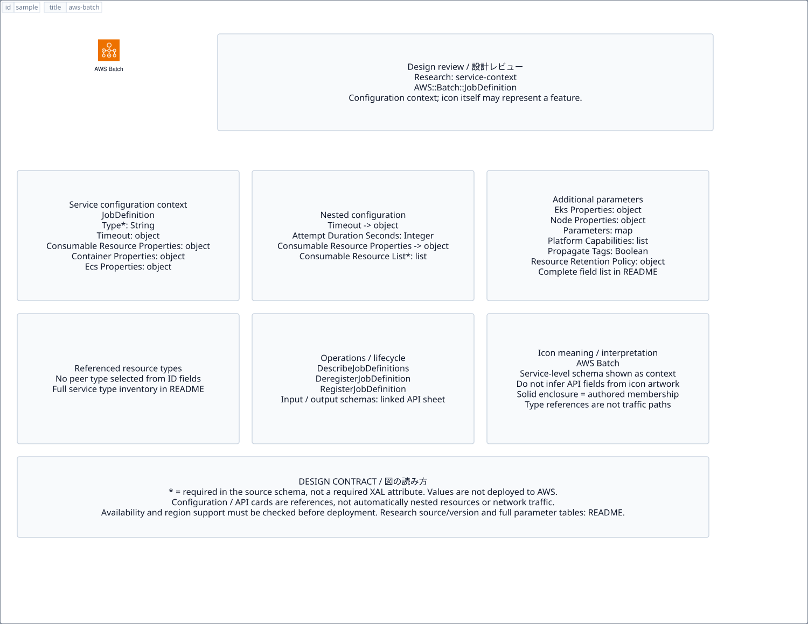

# `aws-batch` — AWS Batch

[SVG preview](sample.svg) · [Editable XAL](sample.xal) · [Catalog](../README.md)



AWS service icon. Use a label and explicit annotations to describe its role; scope is selected by the author.

- Kind: `service`; category: Compute.
- Diagram scope: `service` (recommendation, not AWS deployment validation).
- Default catalog ID: 85. Covered catalog IDs: 10, 35, 60, 85.
- Implementation: V1 and V2; fixed AWS icon with a wrapped label and explicit functional annotations.

## Parameters

`id` is a required, unique connection ID, not a catalog number. `label`/`title`/`name` override the label; an empty label hides it. `size` > 0 defaults to 48 px. `label-width` > 0 defaults to 160 px (default box width, at least icon size + 12 px). Explicit `width`/`height` must contain the icon and label. `visible="false"` hides it. Children and icon overrides are not supported; use a group for containment.

`detail` adds a free-form diagram annotation. `show-details="false"` hides annotation text. Only supplied values are shown; none are sent to AWS. Service/resource annotations appear on separate wrapped lines.

| Parameter | Type | Meaning | Example |
|---|---|---|---|
| `workload` | text | Workload or process annotation | `Web application` |

## Review notes

The catalog provides a baseline for per-component development, not a simulation of the AWS control plane. This component's current functional parameters are the ones listed above. Additional service-specific visual behavior can be developed here without replacing catalog IDs in diagrams. Edit `sample.xal`, then run:

```sh
npm run generate:aws-samples -- --render --tag=aws-batch
```

<!-- aws-functional-research:start -->
## 機能調査・構成デザイン（2026-09-06）

分類: `service-context`。サービス文脈: [`aws-batch`](../aws-batch/README.md)。

サンプルはアイコンと、設定・内包構造・関連リソース・操作を分離したレビューシートです。設定カードは編集可能な `rectangle`、グループは既存の専用タグで実装しています。カードのフィールド名を新しい XAL 属性として受理するわけではありません。専用タグが受理する属性は上の Parameters 表を参照してください。

実線の通信と、設定の参照・同じサービスに属する型一覧を区別します。スキーマの必須項目は AWS 側の仕様であり、図の必須入力ではありません。記載の構成モデル/API は取り込んだ公式資料の範囲であり、全リージョン・全機能の完全性や稼働可否を保証しません。

**重要:** このアイコンに対応する独立した構成リソースを断定せず、所属サービスの構成モデルを参考表示しています。アイコン名や絵柄から属性・親子関係・通信を推測しません。

### 構成モデル: `AWS::Batch::JobDefinition`

[公式リファレンス](https://docs.aws.amazon.com/AWSCloudFormation/latest/UserGuide/aws-resource-batch-jobdefinition.html)。全 15 プロパティを型付きで列挙します（表示カードには主要項目のみ）。

| Field | Type | Required in AWS schema |
|---|---|---|
| [ConsumableResourceProperties](https://docs.aws.amazon.com/AWSCloudFormation/latest/UserGuide/aws-resource-batch-jobdefinition.html#cfn-batch-jobdefinition-consumableresourceproperties) | `ConsumableResourceProperties` | no |
| [ContainerProperties](https://docs.aws.amazon.com/AWSCloudFormation/latest/UserGuide/aws-resource-batch-jobdefinition.html#cfn-batch-jobdefinition-containerproperties) | `ContainerProperties` | no |
| [EcsProperties](https://docs.aws.amazon.com/AWSCloudFormation/latest/UserGuide/aws-resource-batch-jobdefinition.html#cfn-batch-jobdefinition-ecsproperties) | `EcsProperties` | no |
| [EksProperties](https://docs.aws.amazon.com/AWSCloudFormation/latest/UserGuide/aws-resource-batch-jobdefinition.html#cfn-batch-jobdefinition-eksproperties) | `EksProperties` | no |
| [JobDefinitionName](https://docs.aws.amazon.com/AWSCloudFormation/latest/UserGuide/aws-resource-batch-jobdefinition.html#cfn-batch-jobdefinition-jobdefinitionname) | `String` | no |
| [NodeProperties](https://docs.aws.amazon.com/AWSCloudFormation/latest/UserGuide/aws-resource-batch-jobdefinition.html#cfn-batch-jobdefinition-nodeproperties) | `NodeProperties` | no |
| [Parameters](https://docs.aws.amazon.com/AWSCloudFormation/latest/UserGuide/aws-resource-batch-jobdefinition.html#cfn-batch-jobdefinition-parameters) | `Map<String>` | no |
| [PlatformCapabilities](https://docs.aws.amazon.com/AWSCloudFormation/latest/UserGuide/aws-resource-batch-jobdefinition.html#cfn-batch-jobdefinition-platformcapabilities) | `List<String>` | no |
| [PropagateTags](https://docs.aws.amazon.com/AWSCloudFormation/latest/UserGuide/aws-resource-batch-jobdefinition.html#cfn-batch-jobdefinition-propagatetags) | `Boolean` | no |
| [ResourceRetentionPolicy](https://docs.aws.amazon.com/AWSCloudFormation/latest/UserGuide/aws-resource-batch-jobdefinition.html#cfn-batch-jobdefinition-resourceretentionpolicy) | `ResourceRetentionPolicy` | no |
| [RetryStrategy](https://docs.aws.amazon.com/AWSCloudFormation/latest/UserGuide/aws-resource-batch-jobdefinition.html#cfn-batch-jobdefinition-retrystrategy) | `RetryStrategy` | no |
| [SchedulingPriority](https://docs.aws.amazon.com/AWSCloudFormation/latest/UserGuide/aws-resource-batch-jobdefinition.html#cfn-batch-jobdefinition-schedulingpriority) | `Integer` | no |
| [Tags](https://docs.aws.amazon.com/AWSCloudFormation/latest/UserGuide/aws-resource-batch-jobdefinition.html#cfn-batch-jobdefinition-tags) | `Map<String>` | no |
| [Timeout](https://docs.aws.amazon.com/AWSCloudFormation/latest/UserGuide/aws-resource-batch-jobdefinition.html#cfn-batch-jobdefinition-timeout) | `JobTimeout` | no |
| [Type](https://docs.aws.amazon.com/AWSCloudFormation/latest/UserGuide/aws-resource-batch-jobdefinition.html#cfn-batch-jobdefinition-type) | `String` | yes |

#### Timeout → `AWS::Batch::JobDefinition.JobTimeout`

| Field | Type | Required in AWS schema |
|---|---|---|
| [AttemptDurationSeconds](https://docs.aws.amazon.com/AWSCloudFormation/latest/UserGuide/aws-properties-batch-jobdefinition-jobtimeout.html#cfn-batch-jobdefinition-jobtimeout-attemptdurationseconds) | `Integer` | no |

#### ConsumableResourceProperties → `AWS::Batch::JobDefinition.ConsumableResourceProperties`

| Field | Type | Required in AWS schema |
|---|---|---|
| [ConsumableResourceList](https://docs.aws.amazon.com/AWSCloudFormation/latest/UserGuide/aws-properties-batch-jobdefinition-consumableresourceproperties.html#cfn-batch-jobdefinition-consumableresourceproperties-consumableresourcelist) | `List<ConsumableResourceRequirement>` | yes |

#### ContainerProperties → `AWS::Batch::JobDefinition.ContainerProperties`

| Field | Type | Required in AWS schema |
|---|---|---|
| [Command](https://docs.aws.amazon.com/AWSCloudFormation/latest/UserGuide/aws-properties-batch-jobdefinition-containerproperties.html#cfn-batch-jobdefinition-containerproperties-command) | `List<String>` | no |
| [EnableExecuteCommand](https://docs.aws.amazon.com/AWSCloudFormation/latest/UserGuide/aws-properties-batch-jobdefinition-containerproperties.html#cfn-batch-jobdefinition-containerproperties-enableexecutecommand) | `Boolean` | no |
| [Environment](https://docs.aws.amazon.com/AWSCloudFormation/latest/UserGuide/aws-properties-batch-jobdefinition-containerproperties.html#cfn-batch-jobdefinition-containerproperties-environment) | `List<Environment>` | no |
| [EphemeralStorage](https://docs.aws.amazon.com/AWSCloudFormation/latest/UserGuide/aws-properties-batch-jobdefinition-containerproperties.html#cfn-batch-jobdefinition-containerproperties-ephemeralstorage) | `EphemeralStorage` | no |
| [ExecutionRoleArn](https://docs.aws.amazon.com/AWSCloudFormation/latest/UserGuide/aws-properties-batch-jobdefinition-containerproperties.html#cfn-batch-jobdefinition-containerproperties-executionrolearn) | `String` | no |
| [FargatePlatformConfiguration](https://docs.aws.amazon.com/AWSCloudFormation/latest/UserGuide/aws-properties-batch-jobdefinition-containerproperties.html#cfn-batch-jobdefinition-containerproperties-fargateplatformconfiguration) | `FargatePlatformConfiguration` | no |
| [Image](https://docs.aws.amazon.com/AWSCloudFormation/latest/UserGuide/aws-properties-batch-jobdefinition-containerproperties.html#cfn-batch-jobdefinition-containerproperties-image) | `String` | yes |
| [JobRoleArn](https://docs.aws.amazon.com/AWSCloudFormation/latest/UserGuide/aws-properties-batch-jobdefinition-containerproperties.html#cfn-batch-jobdefinition-containerproperties-jobrolearn) | `String` | no |
| [LinuxParameters](https://docs.aws.amazon.com/AWSCloudFormation/latest/UserGuide/aws-properties-batch-jobdefinition-containerproperties.html#cfn-batch-jobdefinition-containerproperties-linuxparameters) | `LinuxParameters` | no |
| [LogConfiguration](https://docs.aws.amazon.com/AWSCloudFormation/latest/UserGuide/aws-properties-batch-jobdefinition-containerproperties.html#cfn-batch-jobdefinition-containerproperties-logconfiguration) | `LogConfiguration` | no |
| [Memory](https://docs.aws.amazon.com/AWSCloudFormation/latest/UserGuide/aws-properties-batch-jobdefinition-containerproperties.html#cfn-batch-jobdefinition-containerproperties-memory) | `Integer` | no |
| [MountPoints](https://docs.aws.amazon.com/AWSCloudFormation/latest/UserGuide/aws-properties-batch-jobdefinition-containerproperties.html#cfn-batch-jobdefinition-containerproperties-mountpoints) | `List<MountPoint>` | no |
| [NetworkConfiguration](https://docs.aws.amazon.com/AWSCloudFormation/latest/UserGuide/aws-properties-batch-jobdefinition-containerproperties.html#cfn-batch-jobdefinition-containerproperties-networkconfiguration) | `NetworkConfiguration` | no |
| [Privileged](https://docs.aws.amazon.com/AWSCloudFormation/latest/UserGuide/aws-properties-batch-jobdefinition-containerproperties.html#cfn-batch-jobdefinition-containerproperties-privileged) | `Boolean` | no |
| [ReadonlyRootFilesystem](https://docs.aws.amazon.com/AWSCloudFormation/latest/UserGuide/aws-properties-batch-jobdefinition-containerproperties.html#cfn-batch-jobdefinition-containerproperties-readonlyrootfilesystem) | `Boolean` | no |
| [RepositoryCredentials](https://docs.aws.amazon.com/AWSCloudFormation/latest/UserGuide/aws-properties-batch-jobdefinition-containerproperties.html#cfn-batch-jobdefinition-containerproperties-repositorycredentials) | `RepositoryCredentials` | no |
| [ResourceRequirements](https://docs.aws.amazon.com/AWSCloudFormation/latest/UserGuide/aws-properties-batch-jobdefinition-containerproperties.html#cfn-batch-jobdefinition-containerproperties-resourcerequirements) | `List<ResourceRequirement>` | no |
| [RuntimePlatform](https://docs.aws.amazon.com/AWSCloudFormation/latest/UserGuide/aws-properties-batch-jobdefinition-containerproperties.html#cfn-batch-jobdefinition-containerproperties-runtimeplatform) | `RuntimePlatform` | no |
| [Secrets](https://docs.aws.amazon.com/AWSCloudFormation/latest/UserGuide/aws-properties-batch-jobdefinition-containerproperties.html#cfn-batch-jobdefinition-containerproperties-secrets) | `List<Secret>` | no |
| [Ulimits](https://docs.aws.amazon.com/AWSCloudFormation/latest/UserGuide/aws-properties-batch-jobdefinition-containerproperties.html#cfn-batch-jobdefinition-containerproperties-ulimits) | `List<Ulimit>` | no |
| [User](https://docs.aws.amazon.com/AWSCloudFormation/latest/UserGuide/aws-properties-batch-jobdefinition-containerproperties.html#cfn-batch-jobdefinition-containerproperties-user) | `String` | no |
| [Vcpus](https://docs.aws.amazon.com/AWSCloudFormation/latest/UserGuide/aws-properties-batch-jobdefinition-containerproperties.html#cfn-batch-jobdefinition-containerproperties-vcpus) | `Integer` | no |
| [Volumes](https://docs.aws.amazon.com/AWSCloudFormation/latest/UserGuide/aws-properties-batch-jobdefinition-containerproperties.html#cfn-batch-jobdefinition-containerproperties-volumes) | `List<Volume>` | no |

#### EcsProperties → `AWS::Batch::JobDefinition.EcsProperties`

| Field | Type | Required in AWS schema |
|---|---|---|
| [TaskProperties](https://docs.aws.amazon.com/AWSCloudFormation/latest/UserGuide/aws-properties-batch-jobdefinition-ecsproperties.html#cfn-batch-jobdefinition-ecsproperties-taskproperties) | `List<EcsTaskProperties>` | yes |

#### EksProperties → `AWS::Batch::JobDefinition.EksProperties`

| Field | Type | Required in AWS schema |
|---|---|---|
| [PodProperties](https://docs.aws.amazon.com/AWSCloudFormation/latest/UserGuide/aws-properties-batch-jobdefinition-eksproperties.html#cfn-batch-jobdefinition-eksproperties-podproperties) | `EksPodProperties` | no |

#### NodeProperties → `AWS::Batch::JobDefinition.NodeProperties`

| Field | Type | Required in AWS schema |
|---|---|---|
| [MainNode](https://docs.aws.amazon.com/AWSCloudFormation/latest/UserGuide/aws-properties-batch-jobdefinition-nodeproperties.html#cfn-batch-jobdefinition-nodeproperties-mainnode) | `Integer` | yes |
| [NodeRangeProperties](https://docs.aws.amazon.com/AWSCloudFormation/latest/UserGuide/aws-properties-batch-jobdefinition-nodeproperties.html#cfn-batch-jobdefinition-nodeproperties-noderangeproperties) | `List<NodeRangeProperty>` | yes |
| [NumNodes](https://docs.aws.amazon.com/AWSCloudFormation/latest/UserGuide/aws-properties-batch-jobdefinition-nodeproperties.html#cfn-batch-jobdefinition-nodeproperties-numnodes) | `Integer` | yes |

#### ResourceRetentionPolicy → `AWS::Batch::JobDefinition.ResourceRetentionPolicy`

| Field | Type | Required in AWS schema |
|---|---|---|
| [SkipDeregisterOnUpdate](https://docs.aws.amazon.com/AWSCloudFormation/latest/UserGuide/aws-properties-batch-jobdefinition-resourceretentionpolicy.html#cfn-batch-jobdefinition-resourceretentionpolicy-skipderegisteronupdate) | `Boolean` | no |

#### RetryStrategy → `AWS::Batch::JobDefinition.RetryStrategy`

| Field | Type | Required in AWS schema |
|---|---|---|
| [Attempts](https://docs.aws.amazon.com/AWSCloudFormation/latest/UserGuide/aws-properties-batch-jobdefinition-retrystrategy.html#cfn-batch-jobdefinition-retrystrategy-attempts) | `Integer` | no |
| [EvaluateOnExit](https://docs.aws.amazon.com/AWSCloudFormation/latest/UserGuide/aws-properties-batch-jobdefinition-retrystrategy.html#cfn-batch-jobdefinition-retrystrategy-evaluateonexit) | `List<EvaluateOnExit>` | no |

### 関連する構成リソース（7 型）

同じサービス文脈の型一覧です。すべてがこのアイコンの子リソースという意味ではありません。さらに深い入れ子は [公式スキーマのスナップショット](../research/cloudformation-models.json) に記録しています。

- [AWS::Batch::ComputeEnvironment](https://docs.aws.amazon.com/AWSCloudFormation/latest/UserGuide/aws-resource-batch-computeenvironment.html)
- [AWS::Batch::ConsumableResource](https://docs.aws.amazon.com/AWSCloudFormation/latest/UserGuide/aws-resource-batch-consumableresource.html)
- [AWS::Batch::JobDefinition](https://docs.aws.amazon.com/AWSCloudFormation/latest/UserGuide/aws-resource-batch-jobdefinition.html)
- [AWS::Batch::JobQueue](https://docs.aws.amazon.com/AWSCloudFormation/latest/UserGuide/aws-resource-batch-jobqueue.html)
- [AWS::Batch::QuotaShare](https://docs.aws.amazon.com/AWSCloudFormation/latest/UserGuide/aws-resource-batch-quotashare.html)
- [AWS::Batch::SchedulingPolicy](https://docs.aws.amazon.com/AWSCloudFormation/latest/UserGuide/aws-resource-batch-schedulingpolicy.html)
- [AWS::Batch::ServiceEnvironment](https://docs.aws.amazon.com/AWSCloudFormation/latest/UserGuide/aws-resource-batch-serviceenvironment.html)

### API の操作・パラメータ

- [AWS Batch: 45 操作の入力・出力一覧](../research/api/batch.md)（API version 2016-08-10）

### 出典・調査範囲

- [公式資料 1](https://docs.aws.amazon.com/AWSCloudFormation/latest/UserGuide/aws-resource-batch-jobdefinition.html)
- [公式資料 2](https://github.com/boto/botocore/blob/develop/botocore/data/batch/2016-08-10/service-2.json)

CloudFormation 仕様 263.0.0、AWS SDK 431 サービスモデルをオフラインで参照。取得日・元データの SHA-256 は [調査マニフェスト](../research/README.md) を参照。API モデル名・フィールド名は仕様から抽出し、説明本文を転載していません。利用可能性は全サービス一律には確認できないため、提供終了の確認がないものも「現在利用可能」と断定していません。

### 次の部品レビュー

- 本アイコンが独立したリソースか、機能・状態・デバイスの記号かを確認する。
- 詳細カードのうち専用の子タグ・参照属性として実装する範囲を選ぶ。
- 通信、制御、認証、監視の関係を分け、必要な接続点・配置制約を確認する。
- 編集後は `npm run generate:aws-samples -- --render --tag=aws-batch`。通常の再描画は XAL/README を上書きしない。
<!-- aws-functional-research:end -->
