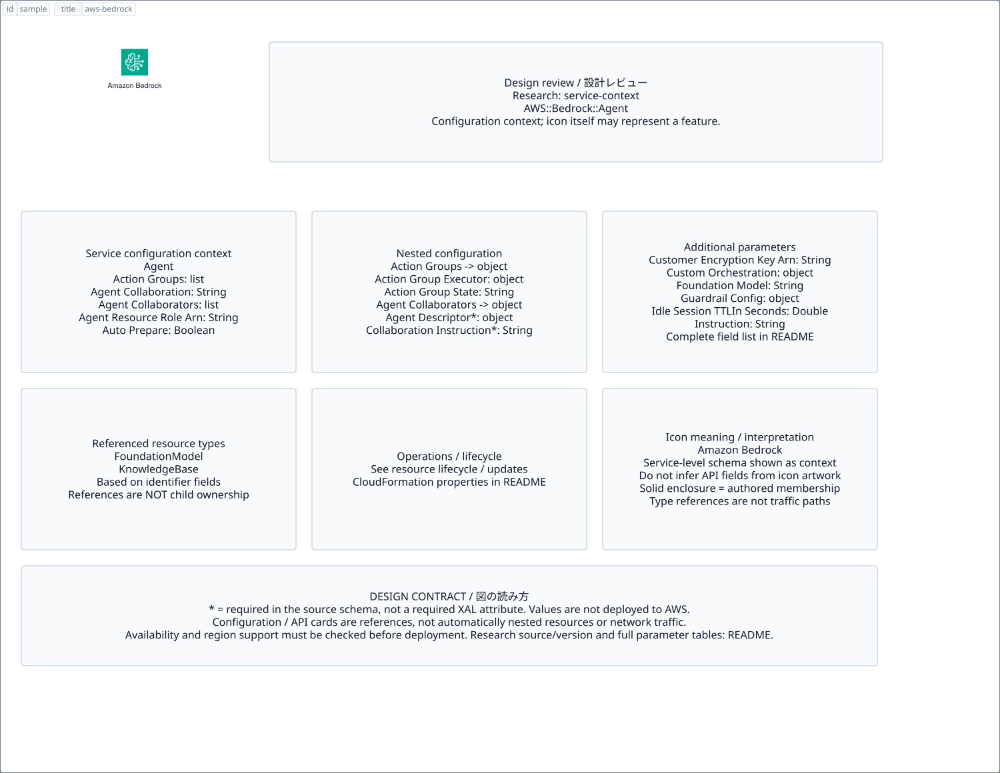

# `aws-bedrock` — Amazon Bedrock

[SVG preview](sample.svg) · [Editable XAL](sample.xal) · [Catalog](../README.md)



AWS service icon. Use a label and explicit annotations to describe its role; scope is selected by the author.

- Kind: `service`; category: Artificial Intelligence.
- Diagram scope: `service` (recommendation, not AWS deployment validation).
- Default catalog ID: 972. Covered catalog IDs: 849, 890, 931, 972.
- Implementation: V1 and V2; fixed AWS icon with a wrapped label and explicit functional annotations.

## Parameters

`id` is a required, unique connection ID, not a catalog number. `label`/`title`/`name` override the label; an empty label hides it. `size` > 0 defaults to 48 px. `label-width` > 0 defaults to 160 px (default box width, at least icon size + 12 px). Explicit `width`/`height` must contain the icon and label. `visible="false"` hides it. Children and icon overrides are not supported; use a group for containment.

`detail` adds a free-form diagram annotation. `show-details="false"` hides annotation text. Only supplied values are shown; none are sent to AWS. Service/resource annotations appear on separate wrapped lines.

| Parameter | Type | Meaning | Example |
|---|---|---|---|
| `input` | text | Input data annotation | `Application events` |
| `output` | text | Output data annotation | `Insights` |

## Review notes

The catalog provides a baseline for per-component development, not a simulation of the AWS control plane. This component's current functional parameters are the ones listed above. Additional service-specific visual behavior can be developed here without replacing catalog IDs in diagrams. Edit `sample.xal`, then run:

```sh
npm run generate:aws-samples -- --render --tag=aws-bedrock
```

<!-- aws-functional-research:start -->
## 機能調査・構成デザイン（2026-09-06）

分類: `service-context`。サービス文脈: [`aws-bedrock`](../aws-bedrock/README.md)。

サンプルはアイコンと、設定・内包構造・関連リソース・操作を分離したレビューシートです。設定カードは編集可能な `rectangle`、グループは既存の専用タグで実装しています。カードのフィールド名を新しい XAL 属性として受理するわけではありません。専用タグが受理する属性は上の Parameters 表を参照してください。

実線の通信と、設定の参照・同じサービスに属する型一覧を区別します。スキーマの必須項目は AWS 側の仕様であり、図の必須入力ではありません。記載の構成モデル/API は取り込んだ公式資料の範囲であり、全リージョン・全機能の完全性や稼働可否を保証しません。

**重要:** このアイコンに対応する独立した構成リソースを断定せず、所属サービスの構成モデルを参考表示しています。アイコン名や絵柄から属性・親子関係・通信を推測しません。

### 構成モデル: `AWS::Bedrock::Agent`

[公式リファレンス](https://docs.aws.amazon.com/AWSCloudFormation/latest/UserGuide/aws-resource-bedrock-agent.html)。全 20 プロパティを型付きで列挙します（表示カードには主要項目のみ）。

| Field | Type | Required in AWS schema |
|---|---|---|
| [ActionGroups](https://docs.aws.amazon.com/AWSCloudFormation/latest/UserGuide/aws-resource-bedrock-agent.html#cfn-bedrock-agent-actiongroups) | `List<AgentActionGroup>` | no |
| [AgentCollaboration](https://docs.aws.amazon.com/AWSCloudFormation/latest/UserGuide/aws-resource-bedrock-agent.html#cfn-bedrock-agent-agentcollaboration) | `String` | no |
| [AgentCollaborators](https://docs.aws.amazon.com/AWSCloudFormation/latest/UserGuide/aws-resource-bedrock-agent.html#cfn-bedrock-agent-agentcollaborators) | `List<AgentCollaborator>` | no |
| [AgentName](https://docs.aws.amazon.com/AWSCloudFormation/latest/UserGuide/aws-resource-bedrock-agent.html#cfn-bedrock-agent-agentname) | `String` | yes |
| [AgentResourceRoleArn](https://docs.aws.amazon.com/AWSCloudFormation/latest/UserGuide/aws-resource-bedrock-agent.html#cfn-bedrock-agent-agentresourcerolearn) | `String` | no |
| [AutoPrepare](https://docs.aws.amazon.com/AWSCloudFormation/latest/UserGuide/aws-resource-bedrock-agent.html#cfn-bedrock-agent-autoprepare) | `Boolean` | no |
| [CustomerEncryptionKeyArn](https://docs.aws.amazon.com/AWSCloudFormation/latest/UserGuide/aws-resource-bedrock-agent.html#cfn-bedrock-agent-customerencryptionkeyarn) | `String` | no |
| [CustomOrchestration](https://docs.aws.amazon.com/AWSCloudFormation/latest/UserGuide/aws-resource-bedrock-agent.html#cfn-bedrock-agent-customorchestration) | `CustomOrchestration` | no |
| [Description](https://docs.aws.amazon.com/AWSCloudFormation/latest/UserGuide/aws-resource-bedrock-agent.html#cfn-bedrock-agent-description) | `String` | no |
| [FoundationModel](https://docs.aws.amazon.com/AWSCloudFormation/latest/UserGuide/aws-resource-bedrock-agent.html#cfn-bedrock-agent-foundationmodel) | `String` | no |
| [GuardrailConfiguration](https://docs.aws.amazon.com/AWSCloudFormation/latest/UserGuide/aws-resource-bedrock-agent.html#cfn-bedrock-agent-guardrailconfiguration) | `GuardrailConfiguration` | no |
| [IdleSessionTTLInSeconds](https://docs.aws.amazon.com/AWSCloudFormation/latest/UserGuide/aws-resource-bedrock-agent.html#cfn-bedrock-agent-idlesessionttlinseconds) | `Double` | no |
| [Instruction](https://docs.aws.amazon.com/AWSCloudFormation/latest/UserGuide/aws-resource-bedrock-agent.html#cfn-bedrock-agent-instruction) | `String` | no |
| [KnowledgeBases](https://docs.aws.amazon.com/AWSCloudFormation/latest/UserGuide/aws-resource-bedrock-agent.html#cfn-bedrock-agent-knowledgebases) | `List<AgentKnowledgeBase>` | no |
| [MemoryConfiguration](https://docs.aws.amazon.com/AWSCloudFormation/latest/UserGuide/aws-resource-bedrock-agent.html#cfn-bedrock-agent-memoryconfiguration) | `MemoryConfiguration` | no |
| [OrchestrationType](https://docs.aws.amazon.com/AWSCloudFormation/latest/UserGuide/aws-resource-bedrock-agent.html#cfn-bedrock-agent-orchestrationtype) | `String` | no |
| [PromptOverrideConfiguration](https://docs.aws.amazon.com/AWSCloudFormation/latest/UserGuide/aws-resource-bedrock-agent.html#cfn-bedrock-agent-promptoverrideconfiguration) | `PromptOverrideConfiguration` | no |
| [SkipResourceInUseCheckOnDelete](https://docs.aws.amazon.com/AWSCloudFormation/latest/UserGuide/aws-resource-bedrock-agent.html#cfn-bedrock-agent-skipresourceinusecheckondelete) | `Boolean` | no |
| [Tags](https://docs.aws.amazon.com/AWSCloudFormation/latest/UserGuide/aws-resource-bedrock-agent.html#cfn-bedrock-agent-tags) | `Map<String>` | no |
| [TestAliasTags](https://docs.aws.amazon.com/AWSCloudFormation/latest/UserGuide/aws-resource-bedrock-agent.html#cfn-bedrock-agent-testaliastags) | `Map<String>` | no |

#### ActionGroups → `AWS::Bedrock::Agent.AgentActionGroup`

| Field | Type | Required in AWS schema |
|---|---|---|
| [ActionGroupExecutor](https://docs.aws.amazon.com/AWSCloudFormation/latest/UserGuide/aws-properties-bedrock-agent-agentactiongroup.html#cfn-bedrock-agent-agentactiongroup-actiongroupexecutor) | `ActionGroupExecutor` | no |
| [ActionGroupName](https://docs.aws.amazon.com/AWSCloudFormation/latest/UserGuide/aws-properties-bedrock-agent-agentactiongroup.html#cfn-bedrock-agent-agentactiongroup-actiongroupname) | `String` | yes |
| [ActionGroupState](https://docs.aws.amazon.com/AWSCloudFormation/latest/UserGuide/aws-properties-bedrock-agent-agentactiongroup.html#cfn-bedrock-agent-agentactiongroup-actiongroupstate) | `String` | no |
| [ApiSchema](https://docs.aws.amazon.com/AWSCloudFormation/latest/UserGuide/aws-properties-bedrock-agent-agentactiongroup.html#cfn-bedrock-agent-agentactiongroup-apischema) | `APISchema` | no |
| [Description](https://docs.aws.amazon.com/AWSCloudFormation/latest/UserGuide/aws-properties-bedrock-agent-agentactiongroup.html#cfn-bedrock-agent-agentactiongroup-description) | `String` | no |
| [FunctionSchema](https://docs.aws.amazon.com/AWSCloudFormation/latest/UserGuide/aws-properties-bedrock-agent-agentactiongroup.html#cfn-bedrock-agent-agentactiongroup-functionschema) | `FunctionSchema` | no |
| [ParentActionGroupSignature](https://docs.aws.amazon.com/AWSCloudFormation/latest/UserGuide/aws-properties-bedrock-agent-agentactiongroup.html#cfn-bedrock-agent-agentactiongroup-parentactiongroupsignature) | `String` | no |
| [SkipResourceInUseCheckOnDelete](https://docs.aws.amazon.com/AWSCloudFormation/latest/UserGuide/aws-properties-bedrock-agent-agentactiongroup.html#cfn-bedrock-agent-agentactiongroup-skipresourceinusecheckondelete) | `Boolean` | no |

#### AgentCollaborators → `AWS::Bedrock::Agent.AgentCollaborator`

| Field | Type | Required in AWS schema |
|---|---|---|
| [AgentDescriptor](https://docs.aws.amazon.com/AWSCloudFormation/latest/UserGuide/aws-properties-bedrock-agent-agentcollaborator.html#cfn-bedrock-agent-agentcollaborator-agentdescriptor) | `AgentDescriptor` | yes |
| [CollaborationInstruction](https://docs.aws.amazon.com/AWSCloudFormation/latest/UserGuide/aws-properties-bedrock-agent-agentcollaborator.html#cfn-bedrock-agent-agentcollaborator-collaborationinstruction) | `String` | yes |
| [CollaboratorName](https://docs.aws.amazon.com/AWSCloudFormation/latest/UserGuide/aws-properties-bedrock-agent-agentcollaborator.html#cfn-bedrock-agent-agentcollaborator-collaboratorname) | `String` | yes |
| [RelayConversationHistory](https://docs.aws.amazon.com/AWSCloudFormation/latest/UserGuide/aws-properties-bedrock-agent-agentcollaborator.html#cfn-bedrock-agent-agentcollaborator-relayconversationhistory) | `String` | no |

#### CustomOrchestration → `AWS::Bedrock::Agent.CustomOrchestration`

| Field | Type | Required in AWS schema |
|---|---|---|
| [Executor](https://docs.aws.amazon.com/AWSCloudFormation/latest/UserGuide/aws-properties-bedrock-agent-customorchestration.html#cfn-bedrock-agent-customorchestration-executor) | `OrchestrationExecutor` | no |

#### GuardrailConfiguration → `AWS::Bedrock::Agent.GuardrailConfiguration`

| Field | Type | Required in AWS schema |
|---|---|---|
| [GuardrailIdentifier](https://docs.aws.amazon.com/AWSCloudFormation/latest/UserGuide/aws-properties-bedrock-agent-guardrailconfiguration.html#cfn-bedrock-agent-guardrailconfiguration-guardrailidentifier) | `String` | no |
| [GuardrailVersion](https://docs.aws.amazon.com/AWSCloudFormation/latest/UserGuide/aws-properties-bedrock-agent-guardrailconfiguration.html#cfn-bedrock-agent-guardrailconfiguration-guardrailversion) | `String` | no |

#### KnowledgeBases → `AWS::Bedrock::Agent.AgentKnowledgeBase`

| Field | Type | Required in AWS schema |
|---|---|---|
| [Description](https://docs.aws.amazon.com/AWSCloudFormation/latest/UserGuide/aws-properties-bedrock-agent-agentknowledgebase.html#cfn-bedrock-agent-agentknowledgebase-description) | `String` | yes |
| [KnowledgeBaseId](https://docs.aws.amazon.com/AWSCloudFormation/latest/UserGuide/aws-properties-bedrock-agent-agentknowledgebase.html#cfn-bedrock-agent-agentknowledgebase-knowledgebaseid) | `String` | yes |
| [KnowledgeBaseState](https://docs.aws.amazon.com/AWSCloudFormation/latest/UserGuide/aws-properties-bedrock-agent-agentknowledgebase.html#cfn-bedrock-agent-agentknowledgebase-knowledgebasestate) | `String` | no |

#### MemoryConfiguration → `AWS::Bedrock::Agent.MemoryConfiguration`

| Field | Type | Required in AWS schema |
|---|---|---|
| [EnabledMemoryTypes](https://docs.aws.amazon.com/AWSCloudFormation/latest/UserGuide/aws-properties-bedrock-agent-memoryconfiguration.html#cfn-bedrock-agent-memoryconfiguration-enabledmemorytypes) | `List<String>` | no |
| [SessionSummaryConfiguration](https://docs.aws.amazon.com/AWSCloudFormation/latest/UserGuide/aws-properties-bedrock-agent-memoryconfiguration.html#cfn-bedrock-agent-memoryconfiguration-sessionsummaryconfiguration) | `SessionSummaryConfiguration` | no |
| [StorageDays](https://docs.aws.amazon.com/AWSCloudFormation/latest/UserGuide/aws-properties-bedrock-agent-memoryconfiguration.html#cfn-bedrock-agent-memoryconfiguration-storagedays) | `Double` | no |

#### PromptOverrideConfiguration → `AWS::Bedrock::Agent.PromptOverrideConfiguration`

| Field | Type | Required in AWS schema |
|---|---|---|
| [OverrideLambda](https://docs.aws.amazon.com/AWSCloudFormation/latest/UserGuide/aws-properties-bedrock-agent-promptoverrideconfiguration.html#cfn-bedrock-agent-promptoverrideconfiguration-overridelambda) | `String` | no |
| [PromptConfigurations](https://docs.aws.amazon.com/AWSCloudFormation/latest/UserGuide/aws-properties-bedrock-agent-promptoverrideconfiguration.html#cfn-bedrock-agent-promptoverrideconfiguration-promptconfigurations) | `List<PromptConfiguration>` | yes |

### 関連する構成リソース（29 型）

同じサービス文脈の型一覧です。すべてがこのアイコンの子リソースという意味ではありません。さらに深い入れ子は [公式スキーマのスナップショット](../research/cloudformation-models.json) に記録しています。

- [AWS::Bedrock::Agent](https://docs.aws.amazon.com/AWSCloudFormation/latest/UserGuide/aws-resource-bedrock-agent.html)
- [AWS::Bedrock::AgentAlias](https://docs.aws.amazon.com/AWSCloudFormation/latest/UserGuide/aws-resource-bedrock-agentalias.html)
- [AWS::Bedrock::ApplicationInferenceProfile](https://docs.aws.amazon.com/AWSCloudFormation/latest/UserGuide/aws-resource-bedrock-applicationinferenceprofile.html)
- [AWS::Bedrock::AsyncInvoke](https://docs.aws.amazon.com/AWSCloudFormation/latest/UserGuide/aws-resource-bedrock-asyncinvoke.html)
- [AWS::Bedrock::AutomatedReasoningPolicy](https://docs.aws.amazon.com/AWSCloudFormation/latest/UserGuide/aws-resource-bedrock-automatedreasoningpolicy.html)
- [AWS::Bedrock::AutomatedReasoningPolicyVersion](https://docs.aws.amazon.com/AWSCloudFormation/latest/UserGuide/aws-resource-bedrock-automatedreasoningpolicyversion.html)
- [AWS::Bedrock::Blueprint](https://docs.aws.amazon.com/AWSCloudFormation/latest/UserGuide/aws-resource-bedrock-blueprint.html)
- [AWS::Bedrock::DataAutomationLibrary](https://docs.aws.amazon.com/AWSCloudFormation/latest/UserGuide/aws-resource-bedrock-dataautomationlibrary.html)
- [AWS::Bedrock::DataAutomationProject](https://docs.aws.amazon.com/AWSCloudFormation/latest/UserGuide/aws-resource-bedrock-dataautomationproject.html)
- [AWS::Bedrock::DataSource](https://docs.aws.amazon.com/AWSCloudFormation/latest/UserGuide/aws-resource-bedrock-datasource.html)
- [AWS::Bedrock::DefaultPromptRouter](https://docs.aws.amazon.com/AWSCloudFormation/latest/UserGuide/aws-resource-bedrock-defaultpromptrouter.html)
- [AWS::Bedrock::EnforcedGuardrailConfiguration](https://docs.aws.amazon.com/AWSCloudFormation/latest/UserGuide/aws-resource-bedrock-enforcedguardrailconfiguration.html)
- [AWS::Bedrock::Flow](https://docs.aws.amazon.com/AWSCloudFormation/latest/UserGuide/aws-resource-bedrock-flow.html)
- [AWS::Bedrock::FlowAlias](https://docs.aws.amazon.com/AWSCloudFormation/latest/UserGuide/aws-resource-bedrock-flowalias.html)
- [AWS::Bedrock::FlowExecution](https://docs.aws.amazon.com/AWSCloudFormation/latest/UserGuide/aws-resource-bedrock-flowexecution.html)
- [AWS::Bedrock::FlowVersion](https://docs.aws.amazon.com/AWSCloudFormation/latest/UserGuide/aws-resource-bedrock-flowversion.html)
- [AWS::Bedrock::FoundationModel](https://docs.aws.amazon.com/AWSCloudFormation/latest/UserGuide/aws-resource-bedrock-foundationmodel.html)
- [AWS::Bedrock::Guardrail](https://docs.aws.amazon.com/AWSCloudFormation/latest/UserGuide/aws-resource-bedrock-guardrail.html)
- [AWS::Bedrock::GuardrailVersion](https://docs.aws.amazon.com/AWSCloudFormation/latest/UserGuide/aws-resource-bedrock-guardrailversion.html)
- [AWS::Bedrock::ImportedModel](https://docs.aws.amazon.com/AWSCloudFormation/latest/UserGuide/aws-resource-bedrock-importedmodel.html)
- [AWS::Bedrock::IntelligentPromptRouter](https://docs.aws.amazon.com/AWSCloudFormation/latest/UserGuide/aws-resource-bedrock-intelligentpromptrouter.html)
- [AWS::Bedrock::KnowledgeBase](https://docs.aws.amazon.com/AWSCloudFormation/latest/UserGuide/aws-resource-bedrock-knowledgebase.html)
- [AWS::Bedrock::KnowledgeBasePolicy](https://docs.aws.amazon.com/AWSCloudFormation/latest/UserGuide/aws-resource-bedrock-knowledgebasepolicy.html)
- [AWS::Bedrock::ModelImportJob](https://docs.aws.amazon.com/AWSCloudFormation/latest/UserGuide/aws-resource-bedrock-modelimportjob.html)
- [AWS::Bedrock::ModelInvocationJob](https://docs.aws.amazon.com/AWSCloudFormation/latest/UserGuide/aws-resource-bedrock-modelinvocationjob.html)
- [AWS::Bedrock::Prompt](https://docs.aws.amazon.com/AWSCloudFormation/latest/UserGuide/aws-resource-bedrock-prompt.html)
- [AWS::Bedrock::PromptVersion](https://docs.aws.amazon.com/AWSCloudFormation/latest/UserGuide/aws-resource-bedrock-promptversion.html)
- [AWS::Bedrock::ResourcePolicy](https://docs.aws.amazon.com/AWSCloudFormation/latest/UserGuide/aws-resource-bedrock-resourcepolicy.html)
- [AWS::Bedrock::Session](https://docs.aws.amazon.com/AWSCloudFormation/latest/UserGuide/aws-resource-bedrock-session.html)

### API の操作・パラメータ

- [Amazon Bedrock: 108 操作の入力・出力一覧](../research/api/bedrock.md)（API version 2023-04-20）

### 出典・調査範囲

- [公式資料 1](https://docs.aws.amazon.com/AWSCloudFormation/latest/UserGuide/aws-resource-bedrock-agent.html)
- [公式資料 2](https://github.com/boto/botocore/blob/develop/botocore/data/bedrock/2023-04-20/service-2.json)

CloudFormation 仕様 263.0.0、AWS SDK 431 サービスモデルをオフラインで参照。取得日・元データの SHA-256 は [調査マニフェスト](../research/README.md) を参照。API モデル名・フィールド名は仕様から抽出し、説明本文を転載していません。利用可能性は全サービス一律には確認できないため、提供終了の確認がないものも「現在利用可能」と断定していません。

### 次の部品レビュー

- 本アイコンが独立したリソースか、機能・状態・デバイスの記号かを確認する。
- 詳細カードのうち専用の子タグ・参照属性として実装する範囲を選ぶ。
- 通信、制御、認証、監視の関係を分け、必要な接続点・配置制約を確認する。
- 編集後は `npm run generate:aws-samples -- --render --tag=aws-bedrock`。通常の再描画は XAL/README を上書きしない。
<!-- aws-functional-research:end -->
