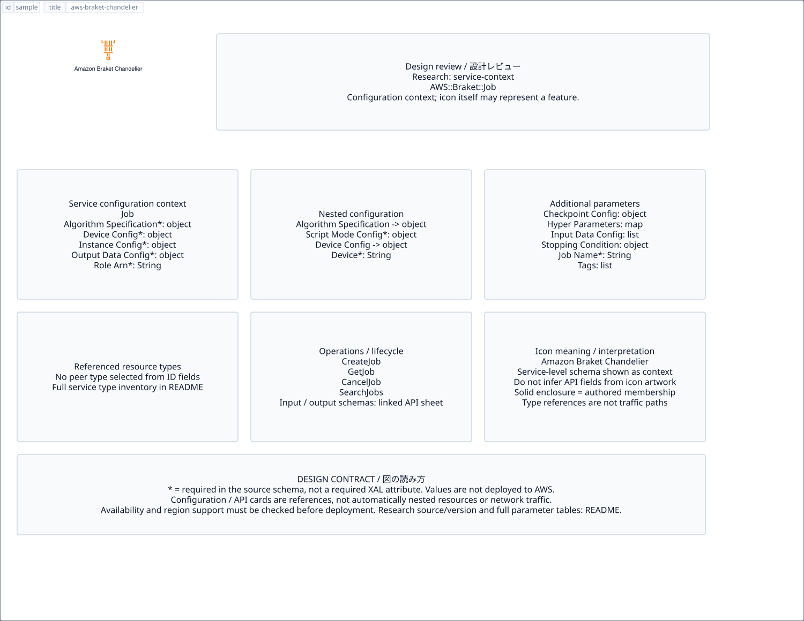

# `aws-braket-chandelier` — Amazon Braket Chandelier

[SVG preview](sample.svg) · [Editable XAL](sample.xal) · [Catalog](../README.md)



AWS resource icon. Use a label and explicit annotations to describe its role; scope is selected by the author.

- Kind: `resource`; category: Quantum Technologies.
- Diagram scope: `logical` (recommendation, not AWS deployment validation).
- Default catalog ID: 1417. Covered catalog IDs: 1417.
- Implementation: V1 and V2; fixed AWS icon with a wrapped label and explicit functional annotations.

## Parameters

`id` is a required, unique connection ID, not a catalog number. `label`/`title`/`name` override the label; an empty label hides it. `size` > 0 defaults to 48 px. `label-width` > 0 defaults to 160 px (default box width, at least icon size + 12 px). Explicit `width`/`height` must contain the icon and label. `visible="false"` hides it. Children and icon overrides are not supported; use a group for containment.

`detail` adds a free-form diagram annotation. `show-details="false"` hides annotation text. Only supplied values are shown; none are sent to AWS. Service/resource annotations appear on separate wrapped lines.

| Parameter | Type | Meaning | Example |
|---|---|---|---|
| `role` | text | Architectural role annotation | `Application component` |

## Review notes

The catalog provides a baseline for per-component development, not a simulation of the AWS control plane. This component's current functional parameters are the ones listed above. Additional service-specific visual behavior can be developed here without replacing catalog IDs in diagrams. Edit `sample.xal`, then run:

```sh
npm run generate:aws-samples -- --render --tag=aws-braket-chandelier
```

<!-- aws-functional-research:start -->
## 機能調査・構成デザイン（2026-09-06）

分類: `service-context`。サービス文脈: [`aws-braket`](../aws-braket/README.md)。

サンプルはアイコンと、設定・内包構造・関連リソース・操作を分離したレビューシートです。設定カードは編集可能な `rectangle`、グループは既存の専用タグで実装しています。カードのフィールド名を新しい XAL 属性として受理するわけではありません。専用タグが受理する属性は上の Parameters 表を参照してください。

実線の通信と、設定の参照・同じサービスに属する型一覧を区別します。スキーマの必須項目は AWS 側の仕様であり、図の必須入力ではありません。記載の構成モデル/API は取り込んだ公式資料の範囲であり、全リージョン・全機能の完全性や稼働可否を保証しません。

**重要:** このアイコンに対応する独立した構成リソースを断定せず、所属サービスの構成モデルを参考表示しています。アイコン名や絵柄から属性・親子関係・通信を推測しません。

### 構成モデル: `AWS::Braket::Job`

[公式リファレンス](https://docs.aws.amazon.com/AWSCloudFormation/latest/UserGuide/aws-resource-braket-job.html)。全 11 プロパティを型付きで列挙します（表示カードには主要項目のみ）。

| Field | Type | Required in AWS schema |
|---|---|---|
| [AlgorithmSpecification](https://docs.aws.amazon.com/AWSCloudFormation/latest/UserGuide/aws-resource-braket-job.html#cfn-braket-job-algorithmspecification) | `AlgorithmSpecification` | yes |
| [CheckpointConfig](https://docs.aws.amazon.com/AWSCloudFormation/latest/UserGuide/aws-resource-braket-job.html#cfn-braket-job-checkpointconfig) | `JobCheckpointConfig` | no |
| [DeviceConfig](https://docs.aws.amazon.com/AWSCloudFormation/latest/UserGuide/aws-resource-braket-job.html#cfn-braket-job-deviceconfig) | `DeviceConfig` | yes |
| [HyperParameters](https://docs.aws.amazon.com/AWSCloudFormation/latest/UserGuide/aws-resource-braket-job.html#cfn-braket-job-hyperparameters) | `Map<String>` | no |
| [InputDataConfig](https://docs.aws.amazon.com/AWSCloudFormation/latest/UserGuide/aws-resource-braket-job.html#cfn-braket-job-inputdataconfig) | `List<InputFileConfig>` | no |
| [InstanceConfig](https://docs.aws.amazon.com/AWSCloudFormation/latest/UserGuide/aws-resource-braket-job.html#cfn-braket-job-instanceconfig) | `InstanceConfig` | yes |
| [JobName](https://docs.aws.amazon.com/AWSCloudFormation/latest/UserGuide/aws-resource-braket-job.html#cfn-braket-job-jobname) | `String` | yes |
| [OutputDataConfig](https://docs.aws.amazon.com/AWSCloudFormation/latest/UserGuide/aws-resource-braket-job.html#cfn-braket-job-outputdataconfig) | `JobOutputDataConfig` | yes |
| [RoleArn](https://docs.aws.amazon.com/AWSCloudFormation/latest/UserGuide/aws-resource-braket-job.html#cfn-braket-job-rolearn) | `String` | yes |
| [StoppingCondition](https://docs.aws.amazon.com/AWSCloudFormation/latest/UserGuide/aws-resource-braket-job.html#cfn-braket-job-stoppingcondition) | `JobStoppingCondition` | no |
| [Tags](https://docs.aws.amazon.com/AWSCloudFormation/latest/UserGuide/aws-resource-braket-job.html#cfn-braket-job-tags) | `List<Tag>` | no |

#### AlgorithmSpecification → `AWS::Braket::Job.AlgorithmSpecification`

| Field | Type | Required in AWS schema |
|---|---|---|
| [ScriptModeConfig](https://docs.aws.amazon.com/AWSCloudFormation/latest/UserGuide/aws-properties-braket-job-algorithmspecification.html#cfn-braket-job-algorithmspecification-scriptmodeconfig) | `ScriptModeConfig` | yes |

#### DeviceConfig → `AWS::Braket::Job.DeviceConfig`

| Field | Type | Required in AWS schema |
|---|---|---|
| [Device](https://docs.aws.amazon.com/AWSCloudFormation/latest/UserGuide/aws-properties-braket-job-deviceconfig.html#cfn-braket-job-deviceconfig-device) | `String` | yes |

#### InstanceConfig → `AWS::Braket::Job.InstanceConfig`

| Field | Type | Required in AWS schema |
|---|---|---|
| [InstanceCount](https://docs.aws.amazon.com/AWSCloudFormation/latest/UserGuide/aws-properties-braket-job-instanceconfig.html#cfn-braket-job-instanceconfig-instancecount) | `Integer` | no |
| [InstanceType](https://docs.aws.amazon.com/AWSCloudFormation/latest/UserGuide/aws-properties-braket-job-instanceconfig.html#cfn-braket-job-instanceconfig-instancetype) | `String` | yes |
| [VolumeSizeInGb](https://docs.aws.amazon.com/AWSCloudFormation/latest/UserGuide/aws-properties-braket-job-instanceconfig.html#cfn-braket-job-instanceconfig-volumesizeingb) | `Integer` | yes |

#### OutputDataConfig → `AWS::Braket::Job.JobOutputDataConfig`

| Field | Type | Required in AWS schema |
|---|---|---|
| [S3Path](https://docs.aws.amazon.com/AWSCloudFormation/latest/UserGuide/aws-properties-braket-job-joboutputdataconfig.html#cfn-braket-job-joboutputdataconfig-s3path) | `String` | yes |

#### CheckpointConfig → `AWS::Braket::Job.JobCheckpointConfig`

| Field | Type | Required in AWS schema |
|---|---|---|
| [LocalPath](https://docs.aws.amazon.com/AWSCloudFormation/latest/UserGuide/aws-properties-braket-job-jobcheckpointconfig.html#cfn-braket-job-jobcheckpointconfig-localpath) | `String` | no |
| [S3Uri](https://docs.aws.amazon.com/AWSCloudFormation/latest/UserGuide/aws-properties-braket-job-jobcheckpointconfig.html#cfn-braket-job-jobcheckpointconfig-s3uri) | `String` | yes |

#### InputDataConfig → `AWS::Braket::Job.InputFileConfig`

| Field | Type | Required in AWS schema |
|---|---|---|
| [ChannelName](https://docs.aws.amazon.com/AWSCloudFormation/latest/UserGuide/aws-properties-braket-job-inputfileconfig.html#cfn-braket-job-inputfileconfig-channelname) | `String` | yes |
| [ContentType](https://docs.aws.amazon.com/AWSCloudFormation/latest/UserGuide/aws-properties-braket-job-inputfileconfig.html#cfn-braket-job-inputfileconfig-contenttype) | `String` | no |
| [DataSource](https://docs.aws.amazon.com/AWSCloudFormation/latest/UserGuide/aws-properties-braket-job-inputfileconfig.html#cfn-braket-job-inputfileconfig-datasource) | `DataSource` | yes |

#### StoppingCondition → `AWS::Braket::Job.JobStoppingCondition`

| Field | Type | Required in AWS schema |
|---|---|---|
| [MaxRuntimeInSeconds](https://docs.aws.amazon.com/AWSCloudFormation/latest/UserGuide/aws-properties-braket-job-jobstoppingcondition.html#cfn-braket-job-jobstoppingcondition-maxruntimeinseconds) | `Integer` | no |

### 関連する構成リソース（2 型）

同じサービス文脈の型一覧です。すべてがこのアイコンの子リソースという意味ではありません。さらに深い入れ子は [公式スキーマのスナップショット](../research/cloudformation-models.json) に記録しています。

- [AWS::Braket::Job](https://docs.aws.amazon.com/AWSCloudFormation/latest/UserGuide/aws-resource-braket-job.html)
- [AWS::Braket::SpendingLimit](https://docs.aws.amazon.com/AWSCloudFormation/latest/UserGuide/aws-resource-braket-spendinglimit.html)

### API の操作・パラメータ

- [Braket: 17 操作の入力・出力一覧](../research/api/braket.md)（API version 2019-09-01）

### 出典・調査範囲

- [公式資料 1](https://docs.aws.amazon.com/AWSCloudFormation/latest/UserGuide/aws-resource-braket-job.html)
- [公式資料 2](https://github.com/boto/botocore/blob/develop/botocore/data/braket/2019-09-01/service-2.json)

CloudFormation 仕様 263.0.0、AWS SDK 431 サービスモデルをオフラインで参照。取得日・元データの SHA-256 は [調査マニフェスト](../research/README.md) を参照。API モデル名・フィールド名は仕様から抽出し、説明本文を転載していません。利用可能性は全サービス一律には確認できないため、提供終了の確認がないものも「現在利用可能」と断定していません。

### 次の部品レビュー

- 本アイコンが独立したリソースか、機能・状態・デバイスの記号かを確認する。
- 詳細カードのうち専用の子タグ・参照属性として実装する範囲を選ぶ。
- 通信、制御、認証、監視の関係を分け、必要な接続点・配置制約を確認する。
- 編集後は `npm run generate:aws-samples -- --render --tag=aws-braket-chandelier`。通常の再描画は XAL/README を上書きしない。
<!-- aws-functional-research:end -->
