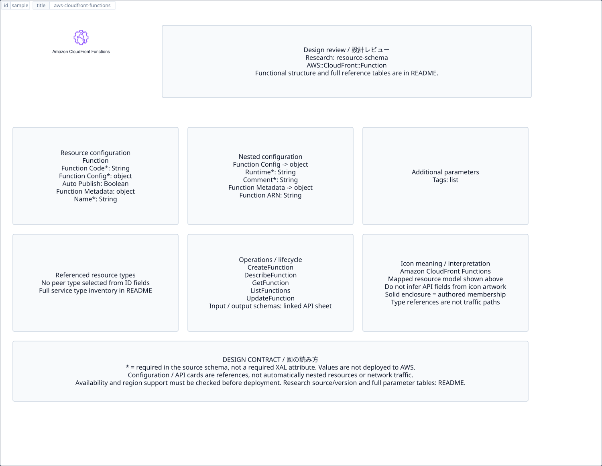

# `aws-cloudfront-functions` — Amazon CloudFront Functions

[SVG preview](sample.svg) · [Editable XAL](sample.xal) · [Catalog](../README.md)



AWS resource icon. Use a label and explicit annotations to describe its role; scope is selected by the author.

- Kind: `resource`; category: Networking Content Delivery.
- Diagram scope: `logical` (recommendation, not AWS deployment validation).
- Default catalog ID: 1566. Covered catalog IDs: 1566.
- Implementation: V1 and V2; fixed AWS icon with a wrapped label and explicit functional annotations.

## Parameters

`id` is a required, unique connection ID, not a catalog number. `label`/`title`/`name` override the label; an empty label hides it. `size` > 0 defaults to 48 px. `label-width` > 0 defaults to 160 px (default box width, at least icon size + 12 px). Explicit `width`/`height` must contain the icon and label. `visible="false"` hides it. Children and icon overrides are not supported; use a group for containment.

`detail` adds a free-form diagram annotation. `show-details="false"` hides annotation text. Only supplied values are shown; none are sent to AWS. Service/resource annotations appear on separate wrapped lines.

| Parameter | Type | Meaning | Example |
|---|---|---|---|
| `traffic` | text | Traffic/protocol annotation | `HTTPS` |

## Review notes

The catalog provides a baseline for per-component development, not a simulation of the AWS control plane. This component's current functional parameters are the ones listed above. Additional service-specific visual behavior can be developed here without replacing catalog IDs in diagrams. Edit `sample.xal`, then run:

```sh
npm run generate:aws-samples -- --render --tag=aws-cloudfront-functions
```

<!-- aws-functional-research:start -->
## 機能調査・構成デザイン（2026-09-06）

分類: `resource-schema`。サービス文脈: [`aws-cloudfront`](../aws-cloudfront/README.md)。

サンプルはアイコンと、設定・内包構造・関連リソース・操作を分離したレビューシートです。設定カードは編集可能な `rectangle`、グループは既存の専用タグで実装しています。カードのフィールド名を新しい XAL 属性として受理するわけではありません。専用タグが受理する属性は上の Parameters 表を参照してください。

実線の通信と、設定の参照・同じサービスに属する型一覧を区別します。スキーマの必須項目は AWS 側の仕様であり、図の必須入力ではありません。記載の構成モデル/API は取り込んだ公式資料の範囲であり、全リージョン・全機能の完全性や稼働可否を保証しません。

### 構成モデル: `AWS::CloudFront::Function`

[公式リファレンス](https://docs.aws.amazon.com/AWSCloudFormation/latest/UserGuide/aws-resource-cloudfront-function.html)。全 6 プロパティを型付きで列挙します（表示カードには主要項目のみ）。

| Field | Type | Required in AWS schema |
|---|---|---|
| [AutoPublish](https://docs.aws.amazon.com/AWSCloudFormation/latest/UserGuide/aws-resource-cloudfront-function.html#cfn-cloudfront-function-autopublish) | `Boolean` | no |
| [FunctionCode](https://docs.aws.amazon.com/AWSCloudFormation/latest/UserGuide/aws-resource-cloudfront-function.html#cfn-cloudfront-function-functioncode) | `String` | yes |
| [FunctionConfig](https://docs.aws.amazon.com/AWSCloudFormation/latest/UserGuide/aws-resource-cloudfront-function.html#cfn-cloudfront-function-functionconfig) | `FunctionConfig` | yes |
| [FunctionMetadata](https://docs.aws.amazon.com/AWSCloudFormation/latest/UserGuide/aws-resource-cloudfront-function.html#cfn-cloudfront-function-functionmetadata) | `FunctionMetadata` | no |
| [Name](https://docs.aws.amazon.com/AWSCloudFormation/latest/UserGuide/aws-resource-cloudfront-function.html#cfn-cloudfront-function-name) | `String` | yes |
| [Tags](https://docs.aws.amazon.com/AWSCloudFormation/latest/UserGuide/aws-resource-cloudfront-function.html#cfn-cloudfront-function-tags) | `List<Tag>` | no |

#### FunctionConfig → `AWS::CloudFront::Function.FunctionConfig`

| Field | Type | Required in AWS schema |
|---|---|---|
| [Comment](https://docs.aws.amazon.com/AWSCloudFormation/latest/UserGuide/aws-properties-cloudfront-function-functionconfig.html#cfn-cloudfront-function-functionconfig-comment) | `String` | yes |
| [KeyValueStoreAssociations](https://docs.aws.amazon.com/AWSCloudFormation/latest/UserGuide/aws-properties-cloudfront-function-functionconfig.html#cfn-cloudfront-function-functionconfig-keyvaluestoreassociations) | `List<KeyValueStoreAssociation>` | no |
| [Runtime](https://docs.aws.amazon.com/AWSCloudFormation/latest/UserGuide/aws-properties-cloudfront-function-functionconfig.html#cfn-cloudfront-function-functionconfig-runtime) | `String` | yes |

#### FunctionMetadata → `AWS::CloudFront::Function.FunctionMetadata`

| Field | Type | Required in AWS schema |
|---|---|---|
| [FunctionARN](https://docs.aws.amazon.com/AWSCloudFormation/latest/UserGuide/aws-properties-cloudfront-function-functionmetadata.html#cfn-cloudfront-function-functionmetadata-functionarn) | `String` | no |

### 関連する構成リソース（20 型）

同じサービス文脈の型一覧です。すべてがこのアイコンの子リソースという意味ではありません。さらに深い入れ子は [公式スキーマのスナップショット](../research/cloudformation-models.json) に記録しています。

- [AWS::CloudFront::AnycastIpList](https://docs.aws.amazon.com/AWSCloudFormation/latest/UserGuide/aws-resource-cloudfront-anycastiplist.html)
- [AWS::CloudFront::CachePolicy](https://docs.aws.amazon.com/AWSCloudFormation/latest/UserGuide/aws-resource-cloudfront-cachepolicy.html)
- [AWS::CloudFront::CloudFrontOriginAccessIdentity](https://docs.aws.amazon.com/AWSCloudFormation/latest/UserGuide/aws-resource-cloudfront-cloudfrontoriginaccessidentity.html)
- [AWS::CloudFront::ConnectionFunction](https://docs.aws.amazon.com/AWSCloudFormation/latest/UserGuide/aws-resource-cloudfront-connectionfunction.html)
- [AWS::CloudFront::ConnectionGroup](https://docs.aws.amazon.com/AWSCloudFormation/latest/UserGuide/aws-resource-cloudfront-connectiongroup.html)
- [AWS::CloudFront::ContinuousDeploymentPolicy](https://docs.aws.amazon.com/AWSCloudFormation/latest/UserGuide/aws-resource-cloudfront-continuousdeploymentpolicy.html)
- [AWS::CloudFront::Distribution](https://docs.aws.amazon.com/AWSCloudFormation/latest/UserGuide/aws-resource-cloudfront-distribution.html)
- [AWS::CloudFront::DistributionTenant](https://docs.aws.amazon.com/AWSCloudFormation/latest/UserGuide/aws-resource-cloudfront-distributiontenant.html)
- [AWS::CloudFront::Function](https://docs.aws.amazon.com/AWSCloudFormation/latest/UserGuide/aws-resource-cloudfront-function.html)
- [AWS::CloudFront::KeyGroup](https://docs.aws.amazon.com/AWSCloudFormation/latest/UserGuide/aws-resource-cloudfront-keygroup.html)
- [AWS::CloudFront::KeyValueStore](https://docs.aws.amazon.com/AWSCloudFormation/latest/UserGuide/aws-resource-cloudfront-keyvaluestore.html)
- [AWS::CloudFront::MonitoringSubscription](https://docs.aws.amazon.com/AWSCloudFormation/latest/UserGuide/aws-resource-cloudfront-monitoringsubscription.html)
- [AWS::CloudFront::OriginAccessControl](https://docs.aws.amazon.com/AWSCloudFormation/latest/UserGuide/aws-resource-cloudfront-originaccesscontrol.html)
- [AWS::CloudFront::OriginRequestPolicy](https://docs.aws.amazon.com/AWSCloudFormation/latest/UserGuide/aws-resource-cloudfront-originrequestpolicy.html)
- [AWS::CloudFront::PublicKey](https://docs.aws.amazon.com/AWSCloudFormation/latest/UserGuide/aws-resource-cloudfront-publickey.html)
- [AWS::CloudFront::RealtimeLogConfig](https://docs.aws.amazon.com/AWSCloudFormation/latest/UserGuide/aws-resource-cloudfront-realtimelogconfig.html)
- [AWS::CloudFront::ResponseHeadersPolicy](https://docs.aws.amazon.com/AWSCloudFormation/latest/UserGuide/aws-resource-cloudfront-responseheaderspolicy.html)
- [AWS::CloudFront::StreamingDistribution](https://docs.aws.amazon.com/AWSCloudFormation/latest/UserGuide/aws-resource-cloudfront-streamingdistribution.html)
- [AWS::CloudFront::TrustStore](https://docs.aws.amazon.com/AWSCloudFormation/latest/UserGuide/aws-resource-cloudfront-truststore.html)
- [AWS::CloudFront::VpcOrigin](https://docs.aws.amazon.com/AWSCloudFormation/latest/UserGuide/aws-resource-cloudfront-vpcorigin.html)

### API の操作・パラメータ

- [Amazon CloudFront: 167 操作の入力・出力一覧](../research/api/cloudfront.md)（API version 2020-05-31）

### 出典・調査範囲

- [公式資料 1](https://docs.aws.amazon.com/AWSCloudFormation/latest/UserGuide/aws-resource-cloudfront-function.html)
- [公式資料 2](https://github.com/boto/botocore/blob/develop/botocore/data/cloudfront/2020-05-31/service-2.json)

CloudFormation 仕様 263.0.0、AWS SDK 431 サービスモデルをオフラインで参照。取得日・元データの SHA-256 は [調査マニフェスト](../research/README.md) を参照。API モデル名・フィールド名は仕様から抽出し、説明本文を転載していません。利用可能性は全サービス一律には確認できないため、提供終了の確認がないものも「現在利用可能」と断定していません。

### 次の部品レビュー

- 本アイコンが独立したリソースか、機能・状態・デバイスの記号かを確認する。
- 詳細カードのうち専用の子タグ・参照属性として実装する範囲を選ぶ。
- 通信、制御、認証、監視の関係を分け、必要な接続点・配置制約を確認する。
- 編集後は `npm run generate:aws-samples -- --render --tag=aws-cloudfront-functions`。通常の再描画は XAL/README を上書きしない。
<!-- aws-functional-research:end -->
