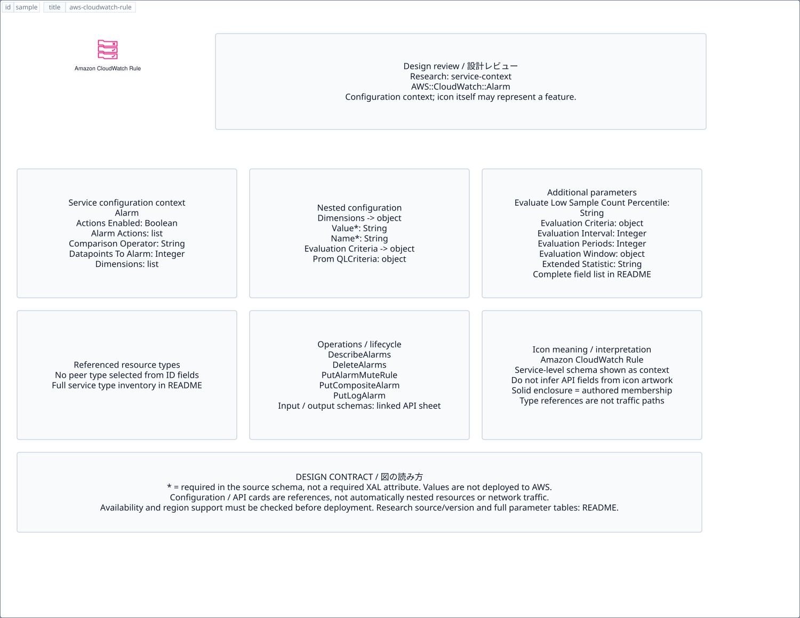

# `aws-cloudwatch-rule` — Amazon CloudWatch Rule

[SVG preview](sample.svg) · [Editable XAL](sample.xal) · [Catalog](../README.md)



AWS resource icon. Use a label and explicit annotations to describe its role; scope is selected by the author.

- Kind: `resource`; category: Management Governance.
- Diagram scope: `logical` (recommendation, not AWS deployment validation).
- Default catalog ID: 1548. Covered catalog IDs: 1548.
- Implementation: V1 and V2; fixed AWS icon with a wrapped label and explicit functional annotations.

## Parameters

`id` is a required, unique connection ID, not a catalog number. `label`/`title`/`name` override the label; an empty label hides it. `size` > 0 defaults to 48 px. `label-width` > 0 defaults to 160 px (default box width, at least icon size + 12 px). Explicit `width`/`height` must contain the icon and label. `visible="false"` hides it. Children and icon overrides are not supported; use a group for containment.

`detail` adds a free-form diagram annotation. `show-details="false"` hides annotation text. Only supplied values are shown; none are sent to AWS. Service/resource annotations appear on separate wrapped lines.

| Parameter | Type | Meaning | Example |
|---|---|---|---|
| `target` | text | Managed resource or build target | `Application` |

## Review notes

The catalog provides a baseline for per-component development, not a simulation of the AWS control plane. This component's current functional parameters are the ones listed above. Additional service-specific visual behavior can be developed here without replacing catalog IDs in diagrams. Edit `sample.xal`, then run:

```sh
npm run generate:aws-samples -- --render --tag=aws-cloudwatch-rule
```

<!-- aws-functional-research:start -->
## 機能調査・構成デザイン（2026-09-06）

分類: `service-context`。サービス文脈: [`aws-cloudwatch`](../aws-cloudwatch/README.md)。

サンプルはアイコンと、設定・内包構造・関連リソース・操作を分離したレビューシートです。設定カードは編集可能な `rectangle`、グループは既存の専用タグで実装しています。カードのフィールド名を新しい XAL 属性として受理するわけではありません。専用タグが受理する属性は上の Parameters 表を参照してください。

実線の通信と、設定の参照・同じサービスに属する型一覧を区別します。スキーマの必須項目は AWS 側の仕様であり、図の必須入力ではありません。記載の構成モデル/API は取り込んだ公式資料の範囲であり、全リージョン・全機能の完全性や稼働可否を保証しません。

**重要:** このアイコンに対応する独立した構成リソースを断定せず、所属サービスの構成モデルを参考表示しています。アイコン名や絵柄から属性・親子関係・通信を推測しません。

### 構成モデル: `AWS::CloudWatch::Alarm`

[公式リファレンス](https://docs.aws.amazon.com/AWSCloudFormation/latest/UserGuide/aws-resource-cloudwatch-alarm.html)。全 26 プロパティを型付きで列挙します（表示カードには主要項目のみ）。

| Field | Type | Required in AWS schema |
|---|---|---|
| [ActionsEnabled](https://docs.aws.amazon.com/AWSCloudFormation/latest/UserGuide/aws-resource-cloudwatch-alarm.html#cfn-cloudwatch-alarm-actionsenabled) | `Boolean` | no |
| [AlarmActions](https://docs.aws.amazon.com/AWSCloudFormation/latest/UserGuide/aws-resource-cloudwatch-alarm.html#cfn-cloudwatch-alarm-alarmactions) | `List<String>` | no |
| [AlarmDescription](https://docs.aws.amazon.com/AWSCloudFormation/latest/UserGuide/aws-resource-cloudwatch-alarm.html#cfn-cloudwatch-alarm-alarmdescription) | `String` | no |
| [AlarmName](https://docs.aws.amazon.com/AWSCloudFormation/latest/UserGuide/aws-resource-cloudwatch-alarm.html#cfn-cloudwatch-alarm-alarmname) | `String` | no |
| [ComparisonOperator](https://docs.aws.amazon.com/AWSCloudFormation/latest/UserGuide/aws-resource-cloudwatch-alarm.html#cfn-cloudwatch-alarm-comparisonoperator) | `String` | no |
| [DatapointsToAlarm](https://docs.aws.amazon.com/AWSCloudFormation/latest/UserGuide/aws-resource-cloudwatch-alarm.html#cfn-cloudwatch-alarm-datapointstoalarm) | `Integer` | no |
| [Dimensions](https://docs.aws.amazon.com/AWSCloudFormation/latest/UserGuide/aws-resource-cloudwatch-alarm.html#cfn-cloudwatch-alarm-dimensions) | `List<Dimension>` | no |
| [EvaluateLowSampleCountPercentile](https://docs.aws.amazon.com/AWSCloudFormation/latest/UserGuide/aws-resource-cloudwatch-alarm.html#cfn-cloudwatch-alarm-evaluatelowsamplecountpercentile) | `String` | no |
| [EvaluationCriteria](https://docs.aws.amazon.com/AWSCloudFormation/latest/UserGuide/aws-resource-cloudwatch-alarm.html#cfn-cloudwatch-alarm-evaluationcriteria) | `EvaluationCriteria` | no |
| [EvaluationInterval](https://docs.aws.amazon.com/AWSCloudFormation/latest/UserGuide/aws-resource-cloudwatch-alarm.html#cfn-cloudwatch-alarm-evaluationinterval) | `Integer` | no |
| [EvaluationPeriods](https://docs.aws.amazon.com/AWSCloudFormation/latest/UserGuide/aws-resource-cloudwatch-alarm.html#cfn-cloudwatch-alarm-evaluationperiods) | `Integer` | no |
| [EvaluationWindow](https://docs.aws.amazon.com/AWSCloudFormation/latest/UserGuide/aws-resource-cloudwatch-alarm.html#cfn-cloudwatch-alarm-evaluationwindow) | `EvaluationWindow` | no |
| [ExtendedStatistic](https://docs.aws.amazon.com/AWSCloudFormation/latest/UserGuide/aws-resource-cloudwatch-alarm.html#cfn-cloudwatch-alarm-extendedstatistic) | `String` | no |
| [InsufficientDataActions](https://docs.aws.amazon.com/AWSCloudFormation/latest/UserGuide/aws-resource-cloudwatch-alarm.html#cfn-cloudwatch-alarm-insufficientdataactions) | `List<String>` | no |
| [MetricName](https://docs.aws.amazon.com/AWSCloudFormation/latest/UserGuide/aws-resource-cloudwatch-alarm.html#cfn-cloudwatch-alarm-metricname) | `String` | no |
| [Metrics](https://docs.aws.amazon.com/AWSCloudFormation/latest/UserGuide/aws-resource-cloudwatch-alarm.html#cfn-cloudwatch-alarm-metrics) | `List<MetricDataQuery>` | no |
| [Namespace](https://docs.aws.amazon.com/AWSCloudFormation/latest/UserGuide/aws-resource-cloudwatch-alarm.html#cfn-cloudwatch-alarm-namespace) | `String` | no |
| [OKActions](https://docs.aws.amazon.com/AWSCloudFormation/latest/UserGuide/aws-resource-cloudwatch-alarm.html#cfn-cloudwatch-alarm-okactions) | `List<String>` | no |
| [Period](https://docs.aws.amazon.com/AWSCloudFormation/latest/UserGuide/aws-resource-cloudwatch-alarm.html#cfn-cloudwatch-alarm-period) | `Integer` | no |
| [Statistic](https://docs.aws.amazon.com/AWSCloudFormation/latest/UserGuide/aws-resource-cloudwatch-alarm.html#cfn-cloudwatch-alarm-statistic) | `String` | no |
| [Tags](https://docs.aws.amazon.com/AWSCloudFormation/latest/UserGuide/aws-resource-cloudwatch-alarm.html#cfn-cloudwatch-alarm-tags) | `List<Tag>` | no |
| [Threshold](https://docs.aws.amazon.com/AWSCloudFormation/latest/UserGuide/aws-resource-cloudwatch-alarm.html#cfn-cloudwatch-alarm-threshold) | `Double` | no |
| [ThresholdMetricId](https://docs.aws.amazon.com/AWSCloudFormation/latest/UserGuide/aws-resource-cloudwatch-alarm.html#cfn-cloudwatch-alarm-thresholdmetricid) | `String` | no |
| [TreatMissingData](https://docs.aws.amazon.com/AWSCloudFormation/latest/UserGuide/aws-resource-cloudwatch-alarm.html#cfn-cloudwatch-alarm-treatmissingdata) | `String` | no |
| [Unit](https://docs.aws.amazon.com/AWSCloudFormation/latest/UserGuide/aws-resource-cloudwatch-alarm.html#cfn-cloudwatch-alarm-unit) | `String` | no |
| [WarmUpConfiguration](https://docs.aws.amazon.com/AWSCloudFormation/latest/UserGuide/aws-resource-cloudwatch-alarm.html#cfn-cloudwatch-alarm-warmupconfiguration) | `WarmUpConfiguration` | no |

#### Dimensions → `AWS::CloudWatch::Alarm.Dimension`

| Field | Type | Required in AWS schema |
|---|---|---|
| [Name](https://docs.aws.amazon.com/AWSCloudFormation/latest/UserGuide/aws-properties-cloudwatch-alarm-dimension.html#cfn-cloudwatch-alarm-dimension-name) | `String` | yes |
| [Value](https://docs.aws.amazon.com/AWSCloudFormation/latest/UserGuide/aws-properties-cloudwatch-alarm-dimension.html#cfn-cloudwatch-alarm-dimension-value) | `String` | yes |

#### EvaluationCriteria → `AWS::CloudWatch::Alarm.EvaluationCriteria`

| Field | Type | Required in AWS schema |
|---|---|---|
| [PromQLCriteria](https://docs.aws.amazon.com/AWSCloudFormation/latest/UserGuide/aws-properties-cloudwatch-alarm-evaluationcriteria.html#cfn-cloudwatch-alarm-evaluationcriteria-promqlcriteria) | `AlarmPromQLCriteria` | no |

#### EvaluationWindow → `AWS::CloudWatch::Alarm.EvaluationWindow`

| Field | Type | Required in AWS schema |
|---|---|---|
| [SlidingWindow](https://docs.aws.amazon.com/AWSCloudFormation/latest/UserGuide/aws-properties-cloudwatch-alarm-evaluationwindow.html#cfn-cloudwatch-alarm-evaluationwindow-slidingwindow) | `Json` | no |
| [WallClockWindow](https://docs.aws.amazon.com/AWSCloudFormation/latest/UserGuide/aws-properties-cloudwatch-alarm-evaluationwindow.html#cfn-cloudwatch-alarm-evaluationwindow-wallclockwindow) | `WallClockWindow` | no |

#### Metrics → `AWS::CloudWatch::Alarm.MetricDataQuery`

| Field | Type | Required in AWS schema |
|---|---|---|
| [AccountId](https://docs.aws.amazon.com/AWSCloudFormation/latest/UserGuide/aws-properties-cloudwatch-alarm-metricdataquery.html#cfn-cloudwatch-alarm-metricdataquery-accountid) | `String` | no |
| [Expression](https://docs.aws.amazon.com/AWSCloudFormation/latest/UserGuide/aws-properties-cloudwatch-alarm-metricdataquery.html#cfn-cloudwatch-alarm-metricdataquery-expression) | `String` | no |
| [Id](https://docs.aws.amazon.com/AWSCloudFormation/latest/UserGuide/aws-properties-cloudwatch-alarm-metricdataquery.html#cfn-cloudwatch-alarm-metricdataquery-id) | `String` | yes |
| [Label](https://docs.aws.amazon.com/AWSCloudFormation/latest/UserGuide/aws-properties-cloudwatch-alarm-metricdataquery.html#cfn-cloudwatch-alarm-metricdataquery-label) | `String` | no |
| [MetricStat](https://docs.aws.amazon.com/AWSCloudFormation/latest/UserGuide/aws-properties-cloudwatch-alarm-metricdataquery.html#cfn-cloudwatch-alarm-metricdataquery-metricstat) | `MetricStat` | no |
| [Period](https://docs.aws.amazon.com/AWSCloudFormation/latest/UserGuide/aws-properties-cloudwatch-alarm-metricdataquery.html#cfn-cloudwatch-alarm-metricdataquery-period) | `Integer` | no |
| [ReturnData](https://docs.aws.amazon.com/AWSCloudFormation/latest/UserGuide/aws-properties-cloudwatch-alarm-metricdataquery.html#cfn-cloudwatch-alarm-metricdataquery-returndata) | `Boolean` | no |

#### WarmUpConfiguration → `AWS::CloudWatch::Alarm.WarmUpConfiguration`

| Field | Type | Required in AWS schema |
|---|---|---|
| [OnlyStartEvaluatingAfterWarmUpPeriodEnds](https://docs.aws.amazon.com/AWSCloudFormation/latest/UserGuide/aws-properties-cloudwatch-alarm-warmupconfiguration.html#cfn-cloudwatch-alarm-warmupconfiguration-onlystartevaluatingafterwarmupperiodends) | `Boolean` | no |
| [WarmUpPeriodDurationInMinutes](https://docs.aws.amazon.com/AWSCloudFormation/latest/UserGuide/aws-properties-cloudwatch-alarm-warmupconfiguration.html#cfn-cloudwatch-alarm-warmupconfiguration-warmupperioddurationinminutes) | `Integer` | no |

### 関連する構成リソース（9 型）

同じサービス文脈の型一覧です。すべてがこのアイコンの子リソースという意味ではありません。さらに深い入れ子は [公式スキーマのスナップショット](../research/cloudformation-models.json) に記録しています。

- [AWS::CloudWatch::Alarm](https://docs.aws.amazon.com/AWSCloudFormation/latest/UserGuide/aws-resource-cloudwatch-alarm.html)
- [AWS::CloudWatch::AlarmMuteRule](https://docs.aws.amazon.com/AWSCloudFormation/latest/UserGuide/aws-resource-cloudwatch-alarmmuterule.html)
- [AWS::CloudWatch::AnomalyDetector](https://docs.aws.amazon.com/AWSCloudFormation/latest/UserGuide/aws-resource-cloudwatch-anomalydetector.html)
- [AWS::CloudWatch::CompositeAlarm](https://docs.aws.amazon.com/AWSCloudFormation/latest/UserGuide/aws-resource-cloudwatch-compositealarm.html)
- [AWS::CloudWatch::Dashboard](https://docs.aws.amazon.com/AWSCloudFormation/latest/UserGuide/aws-resource-cloudwatch-dashboard.html)
- [AWS::CloudWatch::InsightRule](https://docs.aws.amazon.com/AWSCloudFormation/latest/UserGuide/aws-resource-cloudwatch-insightrule.html)
- [AWS::CloudWatch::LogAlarm](https://docs.aws.amazon.com/AWSCloudFormation/latest/UserGuide/aws-resource-cloudwatch-logalarm.html)
- [AWS::CloudWatch::MetricStream](https://docs.aws.amazon.com/AWSCloudFormation/latest/UserGuide/aws-resource-cloudwatch-metricstream.html)
- [AWS::CloudWatch::OTelEnrichment](https://docs.aws.amazon.com/AWSCloudFormation/latest/UserGuide/aws-resource-cloudwatch-otelenrichment.html)

### API の操作・パラメータ

- [Amazon CloudWatch: 50 操作の入力・出力一覧](../research/api/cloudwatch.md)（API version 2010-08-01）

### 出典・調査範囲

- [公式資料 1](https://docs.aws.amazon.com/AWSCloudFormation/latest/UserGuide/aws-resource-cloudwatch-alarm.html)
- [公式資料 2](https://github.com/boto/botocore/blob/develop/botocore/data/cloudwatch/2010-08-01/service-2.json)

CloudFormation 仕様 263.0.0、AWS SDK 431 サービスモデルをオフラインで参照。取得日・元データの SHA-256 は [調査マニフェスト](../research/README.md) を参照。API モデル名・フィールド名は仕様から抽出し、説明本文を転載していません。利用可能性は全サービス一律には確認できないため、提供終了の確認がないものも「現在利用可能」と断定していません。

### 次の部品レビュー

- 本アイコンが独立したリソースか、機能・状態・デバイスの記号かを確認する。
- 詳細カードのうち専用の子タグ・参照属性として実装する範囲を選ぶ。
- 通信、制御、認証、監視の関係を分け、必要な接続点・配置制約を確認する。
- 編集後は `npm run generate:aws-samples -- --render --tag=aws-cloudwatch-rule`。通常の再描画は XAL/README を上書きしない。
<!-- aws-functional-research:end -->
