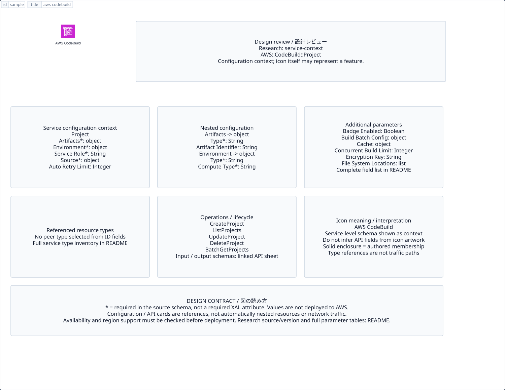

# `aws-codebuild` — AWS CodeBuild

[SVG preview](sample.svg) · [Editable XAL](sample.xal) · [Catalog](../README.md)



AWS service icon. Use a label and explicit annotations to describe its role; scope is selected by the author.

- Kind: `service`; category: Developer Tools.
- Diagram scope: `service` (recommendation, not AWS deployment validation).
- Default catalog ID: 486. Covered catalog IDs: 438, 454, 470, 486.
- Implementation: V1 and V2; fixed AWS icon with a wrapped label and explicit functional annotations.

## Parameters

`id` is a required, unique connection ID, not a catalog number. `label`/`title`/`name` override the label; an empty label hides it. `size` > 0 defaults to 48 px. `label-width` > 0 defaults to 160 px (default box width, at least icon size + 12 px). Explicit `width`/`height` must contain the icon and label. `visible="false"` hides it. Children and icon overrides are not supported; use a group for containment.

`detail` adds a free-form diagram annotation. `show-details="false"` hides annotation text. Only supplied values are shown; none are sent to AWS. Service/resource annotations appear on separate wrapped lines.

| Parameter | Type | Meaning | Example |
|---|---|---|---|
| `target` | text | Managed resource or build target | `Application` |

## Review notes

The catalog provides a baseline for per-component development, not a simulation of the AWS control plane. This component's current functional parameters are the ones listed above. Additional service-specific visual behavior can be developed here without replacing catalog IDs in diagrams. Edit `sample.xal`, then run:

```sh
npm run generate:aws-samples -- --render --tag=aws-codebuild
```

<!-- aws-functional-research:start -->
## 機能調査・構成デザイン（2026-09-06）

分類: `service-context`。サービス文脈: [`aws-codebuild`](../aws-codebuild/README.md)。

サンプルはアイコンと、設定・内包構造・関連リソース・操作を分離したレビューシートです。設定カードは編集可能な `rectangle`、グループは既存の専用タグで実装しています。カードのフィールド名を新しい XAL 属性として受理するわけではありません。専用タグが受理する属性は上の Parameters 表を参照してください。

実線の通信と、設定の参照・同じサービスに属する型一覧を区別します。スキーマの必須項目は AWS 側の仕様であり、図の必須入力ではありません。記載の構成モデル/API は取り込んだ公式資料の範囲であり、全リージョン・全機能の完全性や稼働可否を保証しません。

**重要:** このアイコンに対応する独立した構成リソースを断定せず、所属サービスの構成モデルを参考表示しています。アイコン名や絵柄から属性・親子関係・通信を推測しません。

### 構成モデル: `AWS::CodeBuild::Project`

[公式リファレンス](https://docs.aws.amazon.com/AWSCloudFormation/latest/UserGuide/aws-resource-codebuild-project.html)。全 25 プロパティを型付きで列挙します（表示カードには主要項目のみ）。

| Field | Type | Required in AWS schema |
|---|---|---|
| [Artifacts](https://docs.aws.amazon.com/AWSCloudFormation/latest/UserGuide/aws-resource-codebuild-project.html#cfn-codebuild-project-artifacts) | `Artifacts` | yes |
| [AutoRetryLimit](https://docs.aws.amazon.com/AWSCloudFormation/latest/UserGuide/aws-resource-codebuild-project.html#cfn-codebuild-project-autoretrylimit) | `Integer` | no |
| [BadgeEnabled](https://docs.aws.amazon.com/AWSCloudFormation/latest/UserGuide/aws-resource-codebuild-project.html#cfn-codebuild-project-badgeenabled) | `Boolean` | no |
| [BuildBatchConfig](https://docs.aws.amazon.com/AWSCloudFormation/latest/UserGuide/aws-resource-codebuild-project.html#cfn-codebuild-project-buildbatchconfig) | `ProjectBuildBatchConfig` | no |
| [Cache](https://docs.aws.amazon.com/AWSCloudFormation/latest/UserGuide/aws-resource-codebuild-project.html#cfn-codebuild-project-cache) | `ProjectCache` | no |
| [ConcurrentBuildLimit](https://docs.aws.amazon.com/AWSCloudFormation/latest/UserGuide/aws-resource-codebuild-project.html#cfn-codebuild-project-concurrentbuildlimit) | `Integer` | no |
| [Description](https://docs.aws.amazon.com/AWSCloudFormation/latest/UserGuide/aws-resource-codebuild-project.html#cfn-codebuild-project-description) | `String` | no |
| [EncryptionKey](https://docs.aws.amazon.com/AWSCloudFormation/latest/UserGuide/aws-resource-codebuild-project.html#cfn-codebuild-project-encryptionkey) | `String` | no |
| [Environment](https://docs.aws.amazon.com/AWSCloudFormation/latest/UserGuide/aws-resource-codebuild-project.html#cfn-codebuild-project-environment) | `Environment` | yes |
| [FileSystemLocations](https://docs.aws.amazon.com/AWSCloudFormation/latest/UserGuide/aws-resource-codebuild-project.html#cfn-codebuild-project-filesystemlocations) | `List<ProjectFileSystemLocation>` | no |
| [LogsConfig](https://docs.aws.amazon.com/AWSCloudFormation/latest/UserGuide/aws-resource-codebuild-project.html#cfn-codebuild-project-logsconfig) | `LogsConfig` | no |
| [Name](https://docs.aws.amazon.com/AWSCloudFormation/latest/UserGuide/aws-resource-codebuild-project.html#cfn-codebuild-project-name) | `String` | no |
| [QueuedTimeoutInMinutes](https://docs.aws.amazon.com/AWSCloudFormation/latest/UserGuide/aws-resource-codebuild-project.html#cfn-codebuild-project-queuedtimeoutinminutes) | `Integer` | no |
| [ResourceAccessRole](https://docs.aws.amazon.com/AWSCloudFormation/latest/UserGuide/aws-resource-codebuild-project.html#cfn-codebuild-project-resourceaccessrole) | `String` | no |
| [SecondaryArtifacts](https://docs.aws.amazon.com/AWSCloudFormation/latest/UserGuide/aws-resource-codebuild-project.html#cfn-codebuild-project-secondaryartifacts) | `List<Artifacts>` | no |
| [SecondarySources](https://docs.aws.amazon.com/AWSCloudFormation/latest/UserGuide/aws-resource-codebuild-project.html#cfn-codebuild-project-secondarysources) | `List<Source>` | no |
| [SecondarySourceVersions](https://docs.aws.amazon.com/AWSCloudFormation/latest/UserGuide/aws-resource-codebuild-project.html#cfn-codebuild-project-secondarysourceversions) | `List<ProjectSourceVersion>` | no |
| [ServiceRole](https://docs.aws.amazon.com/AWSCloudFormation/latest/UserGuide/aws-resource-codebuild-project.html#cfn-codebuild-project-servicerole) | `String` | yes |
| [Source](https://docs.aws.amazon.com/AWSCloudFormation/latest/UserGuide/aws-resource-codebuild-project.html#cfn-codebuild-project-source) | `Source` | yes |
| [SourceVersion](https://docs.aws.amazon.com/AWSCloudFormation/latest/UserGuide/aws-resource-codebuild-project.html#cfn-codebuild-project-sourceversion) | `String` | no |
| [Tags](https://docs.aws.amazon.com/AWSCloudFormation/latest/UserGuide/aws-resource-codebuild-project.html#cfn-codebuild-project-tags) | `List<Tag>` | no |
| [TimeoutInMinutes](https://docs.aws.amazon.com/AWSCloudFormation/latest/UserGuide/aws-resource-codebuild-project.html#cfn-codebuild-project-timeoutinminutes) | `Integer` | no |
| [Triggers](https://docs.aws.amazon.com/AWSCloudFormation/latest/UserGuide/aws-resource-codebuild-project.html#cfn-codebuild-project-triggers) | `ProjectTriggers` | no |
| [Visibility](https://docs.aws.amazon.com/AWSCloudFormation/latest/UserGuide/aws-resource-codebuild-project.html#cfn-codebuild-project-visibility) | `String` | no |
| [VpcConfig](https://docs.aws.amazon.com/AWSCloudFormation/latest/UserGuide/aws-resource-codebuild-project.html#cfn-codebuild-project-vpcconfig) | `VpcConfig` | no |

#### Artifacts → `AWS::CodeBuild::Project.Artifacts`

| Field | Type | Required in AWS schema |
|---|---|---|
| [ArtifactIdentifier](https://docs.aws.amazon.com/AWSCloudFormation/latest/UserGuide/aws-properties-codebuild-project-artifacts.html#cfn-codebuild-project-artifacts-artifactidentifier) | `String` | no |
| [EncryptionDisabled](https://docs.aws.amazon.com/AWSCloudFormation/latest/UserGuide/aws-properties-codebuild-project-artifacts.html#cfn-codebuild-project-artifacts-encryptiondisabled) | `Boolean` | no |
| [Location](https://docs.aws.amazon.com/AWSCloudFormation/latest/UserGuide/aws-properties-codebuild-project-artifacts.html#cfn-codebuild-project-artifacts-location) | `String` | no |
| [Name](https://docs.aws.amazon.com/AWSCloudFormation/latest/UserGuide/aws-properties-codebuild-project-artifacts.html#cfn-codebuild-project-artifacts-name) | `String` | no |
| [NamespaceType](https://docs.aws.amazon.com/AWSCloudFormation/latest/UserGuide/aws-properties-codebuild-project-artifacts.html#cfn-codebuild-project-artifacts-namespacetype) | `String` | no |
| [OverrideArtifactName](https://docs.aws.amazon.com/AWSCloudFormation/latest/UserGuide/aws-properties-codebuild-project-artifacts.html#cfn-codebuild-project-artifacts-overrideartifactname) | `Boolean` | no |
| [Packaging](https://docs.aws.amazon.com/AWSCloudFormation/latest/UserGuide/aws-properties-codebuild-project-artifacts.html#cfn-codebuild-project-artifacts-packaging) | `String` | no |
| [Path](https://docs.aws.amazon.com/AWSCloudFormation/latest/UserGuide/aws-properties-codebuild-project-artifacts.html#cfn-codebuild-project-artifacts-path) | `String` | no |
| [Type](https://docs.aws.amazon.com/AWSCloudFormation/latest/UserGuide/aws-properties-codebuild-project-artifacts.html#cfn-codebuild-project-artifacts-type) | `String` | yes |

#### Environment → `AWS::CodeBuild::Project.Environment`

| Field | Type | Required in AWS schema |
|---|---|---|
| [Certificate](https://docs.aws.amazon.com/AWSCloudFormation/latest/UserGuide/aws-properties-codebuild-project-environment.html#cfn-codebuild-project-environment-certificate) | `String` | no |
| [ComputeType](https://docs.aws.amazon.com/AWSCloudFormation/latest/UserGuide/aws-properties-codebuild-project-environment.html#cfn-codebuild-project-environment-computetype) | `String` | yes |
| [DockerServer](https://docs.aws.amazon.com/AWSCloudFormation/latest/UserGuide/aws-properties-codebuild-project-environment.html#cfn-codebuild-project-environment-dockerserver) | `DockerServer` | no |
| [EnvironmentVariables](https://docs.aws.amazon.com/AWSCloudFormation/latest/UserGuide/aws-properties-codebuild-project-environment.html#cfn-codebuild-project-environment-environmentvariables) | `List<EnvironmentVariable>` | no |
| [Fleet](https://docs.aws.amazon.com/AWSCloudFormation/latest/UserGuide/aws-properties-codebuild-project-environment.html#cfn-codebuild-project-environment-fleet) | `ProjectFleet` | no |
| [HostKernel](https://docs.aws.amazon.com/AWSCloudFormation/latest/UserGuide/aws-properties-codebuild-project-environment.html#cfn-codebuild-project-environment-hostkernel) | `String` | no |
| [Image](https://docs.aws.amazon.com/AWSCloudFormation/latest/UserGuide/aws-properties-codebuild-project-environment.html#cfn-codebuild-project-environment-image) | `String` | yes |
| [ImagePullCredentialsType](https://docs.aws.amazon.com/AWSCloudFormation/latest/UserGuide/aws-properties-codebuild-project-environment.html#cfn-codebuild-project-environment-imagepullcredentialstype) | `String` | no |
| [PrivilegedMode](https://docs.aws.amazon.com/AWSCloudFormation/latest/UserGuide/aws-properties-codebuild-project-environment.html#cfn-codebuild-project-environment-privilegedmode) | `Boolean` | no |
| [RegistryCredential](https://docs.aws.amazon.com/AWSCloudFormation/latest/UserGuide/aws-properties-codebuild-project-environment.html#cfn-codebuild-project-environment-registrycredential) | `RegistryCredential` | no |
| [Type](https://docs.aws.amazon.com/AWSCloudFormation/latest/UserGuide/aws-properties-codebuild-project-environment.html#cfn-codebuild-project-environment-type) | `String` | yes |

#### Source → `AWS::CodeBuild::Project.Source`

| Field | Type | Required in AWS schema |
|---|---|---|
| [Auth](https://docs.aws.amazon.com/AWSCloudFormation/latest/UserGuide/aws-properties-codebuild-project-source.html#cfn-codebuild-project-source-auth) | `SourceAuth` | no |
| [BuildSpec](https://docs.aws.amazon.com/AWSCloudFormation/latest/UserGuide/aws-properties-codebuild-project-source.html#cfn-codebuild-project-source-buildspec) | `String` | no |
| [BuildStatusConfig](https://docs.aws.amazon.com/AWSCloudFormation/latest/UserGuide/aws-properties-codebuild-project-source.html#cfn-codebuild-project-source-buildstatusconfig) | `BuildStatusConfig` | no |
| [GitCloneDepth](https://docs.aws.amazon.com/AWSCloudFormation/latest/UserGuide/aws-properties-codebuild-project-source.html#cfn-codebuild-project-source-gitclonedepth) | `Integer` | no |
| [GitSubmodulesConfig](https://docs.aws.amazon.com/AWSCloudFormation/latest/UserGuide/aws-properties-codebuild-project-source.html#cfn-codebuild-project-source-gitsubmodulesconfig) | `GitSubmodulesConfig` | no |
| [InsecureSsl](https://docs.aws.amazon.com/AWSCloudFormation/latest/UserGuide/aws-properties-codebuild-project-source.html#cfn-codebuild-project-source-insecuressl) | `Boolean` | no |
| [Location](https://docs.aws.amazon.com/AWSCloudFormation/latest/UserGuide/aws-properties-codebuild-project-source.html#cfn-codebuild-project-source-location) | `String` | no |
| [ReportBuildStatus](https://docs.aws.amazon.com/AWSCloudFormation/latest/UserGuide/aws-properties-codebuild-project-source.html#cfn-codebuild-project-source-reportbuildstatus) | `Boolean` | no |
| [SourceIdentifier](https://docs.aws.amazon.com/AWSCloudFormation/latest/UserGuide/aws-properties-codebuild-project-source.html#cfn-codebuild-project-source-sourceidentifier) | `String` | no |
| [Type](https://docs.aws.amazon.com/AWSCloudFormation/latest/UserGuide/aws-properties-codebuild-project-source.html#cfn-codebuild-project-source-type) | `String` | yes |

#### BuildBatchConfig → `AWS::CodeBuild::Project.ProjectBuildBatchConfig`

| Field | Type | Required in AWS schema |
|---|---|---|
| [BatchReportMode](https://docs.aws.amazon.com/AWSCloudFormation/latest/UserGuide/aws-properties-codebuild-project-projectbuildbatchconfig.html#cfn-codebuild-project-projectbuildbatchconfig-batchreportmode) | `String` | no |
| [CombineArtifacts](https://docs.aws.amazon.com/AWSCloudFormation/latest/UserGuide/aws-properties-codebuild-project-projectbuildbatchconfig.html#cfn-codebuild-project-projectbuildbatchconfig-combineartifacts) | `Boolean` | no |
| [Restrictions](https://docs.aws.amazon.com/AWSCloudFormation/latest/UserGuide/aws-properties-codebuild-project-projectbuildbatchconfig.html#cfn-codebuild-project-projectbuildbatchconfig-restrictions) | `BatchRestrictions` | no |
| [ServiceRole](https://docs.aws.amazon.com/AWSCloudFormation/latest/UserGuide/aws-properties-codebuild-project-projectbuildbatchconfig.html#cfn-codebuild-project-projectbuildbatchconfig-servicerole) | `String` | no |
| [TimeoutInMins](https://docs.aws.amazon.com/AWSCloudFormation/latest/UserGuide/aws-properties-codebuild-project-projectbuildbatchconfig.html#cfn-codebuild-project-projectbuildbatchconfig-timeoutinmins) | `Integer` | no |

#### Cache → `AWS::CodeBuild::Project.ProjectCache`

| Field | Type | Required in AWS schema |
|---|---|---|
| [CacheNamespace](https://docs.aws.amazon.com/AWSCloudFormation/latest/UserGuide/aws-properties-codebuild-project-projectcache.html#cfn-codebuild-project-projectcache-cachenamespace) | `String` | no |
| [Location](https://docs.aws.amazon.com/AWSCloudFormation/latest/UserGuide/aws-properties-codebuild-project-projectcache.html#cfn-codebuild-project-projectcache-location) | `String` | no |
| [Modes](https://docs.aws.amazon.com/AWSCloudFormation/latest/UserGuide/aws-properties-codebuild-project-projectcache.html#cfn-codebuild-project-projectcache-modes) | `List<String>` | no |
| [Type](https://docs.aws.amazon.com/AWSCloudFormation/latest/UserGuide/aws-properties-codebuild-project-projectcache.html#cfn-codebuild-project-projectcache-type) | `String` | yes |

#### FileSystemLocations → `AWS::CodeBuild::Project.ProjectFileSystemLocation`

| Field | Type | Required in AWS schema |
|---|---|---|
| [Identifier](https://docs.aws.amazon.com/AWSCloudFormation/latest/UserGuide/aws-properties-codebuild-project-projectfilesystemlocation.html#cfn-codebuild-project-projectfilesystemlocation-identifier) | `String` | yes |
| [Location](https://docs.aws.amazon.com/AWSCloudFormation/latest/UserGuide/aws-properties-codebuild-project-projectfilesystemlocation.html#cfn-codebuild-project-projectfilesystemlocation-location) | `String` | yes |
| [MountOptions](https://docs.aws.amazon.com/AWSCloudFormation/latest/UserGuide/aws-properties-codebuild-project-projectfilesystemlocation.html#cfn-codebuild-project-projectfilesystemlocation-mountoptions) | `String` | no |
| [MountPoint](https://docs.aws.amazon.com/AWSCloudFormation/latest/UserGuide/aws-properties-codebuild-project-projectfilesystemlocation.html#cfn-codebuild-project-projectfilesystemlocation-mountpoint) | `String` | yes |
| [Type](https://docs.aws.amazon.com/AWSCloudFormation/latest/UserGuide/aws-properties-codebuild-project-projectfilesystemlocation.html#cfn-codebuild-project-projectfilesystemlocation-type) | `String` | yes |

#### LogsConfig → `AWS::CodeBuild::Project.LogsConfig`

| Field | Type | Required in AWS schema |
|---|---|---|
| [CloudWatchLogs](https://docs.aws.amazon.com/AWSCloudFormation/latest/UserGuide/aws-properties-codebuild-project-logsconfig.html#cfn-codebuild-project-logsconfig-cloudwatchlogs) | `CloudWatchLogsConfig` | no |
| [S3Logs](https://docs.aws.amazon.com/AWSCloudFormation/latest/UserGuide/aws-properties-codebuild-project-logsconfig.html#cfn-codebuild-project-logsconfig-s3logs) | `S3LogsConfig` | no |

#### SecondaryArtifacts → `AWS::CodeBuild::Project.Artifacts`

| Field | Type | Required in AWS schema |
|---|---|---|
| [ArtifactIdentifier](https://docs.aws.amazon.com/AWSCloudFormation/latest/UserGuide/aws-properties-codebuild-project-artifacts.html#cfn-codebuild-project-artifacts-artifactidentifier) | `String` | no |
| [EncryptionDisabled](https://docs.aws.amazon.com/AWSCloudFormation/latest/UserGuide/aws-properties-codebuild-project-artifacts.html#cfn-codebuild-project-artifacts-encryptiondisabled) | `Boolean` | no |
| [Location](https://docs.aws.amazon.com/AWSCloudFormation/latest/UserGuide/aws-properties-codebuild-project-artifacts.html#cfn-codebuild-project-artifacts-location) | `String` | no |
| [Name](https://docs.aws.amazon.com/AWSCloudFormation/latest/UserGuide/aws-properties-codebuild-project-artifacts.html#cfn-codebuild-project-artifacts-name) | `String` | no |
| [NamespaceType](https://docs.aws.amazon.com/AWSCloudFormation/latest/UserGuide/aws-properties-codebuild-project-artifacts.html#cfn-codebuild-project-artifacts-namespacetype) | `String` | no |
| [OverrideArtifactName](https://docs.aws.amazon.com/AWSCloudFormation/latest/UserGuide/aws-properties-codebuild-project-artifacts.html#cfn-codebuild-project-artifacts-overrideartifactname) | `Boolean` | no |
| [Packaging](https://docs.aws.amazon.com/AWSCloudFormation/latest/UserGuide/aws-properties-codebuild-project-artifacts.html#cfn-codebuild-project-artifacts-packaging) | `String` | no |
| [Path](https://docs.aws.amazon.com/AWSCloudFormation/latest/UserGuide/aws-properties-codebuild-project-artifacts.html#cfn-codebuild-project-artifacts-path) | `String` | no |
| [Type](https://docs.aws.amazon.com/AWSCloudFormation/latest/UserGuide/aws-properties-codebuild-project-artifacts.html#cfn-codebuild-project-artifacts-type) | `String` | yes |

#### SecondarySources → `AWS::CodeBuild::Project.Source`

| Field | Type | Required in AWS schema |
|---|---|---|
| [Auth](https://docs.aws.amazon.com/AWSCloudFormation/latest/UserGuide/aws-properties-codebuild-project-source.html#cfn-codebuild-project-source-auth) | `SourceAuth` | no |
| [BuildSpec](https://docs.aws.amazon.com/AWSCloudFormation/latest/UserGuide/aws-properties-codebuild-project-source.html#cfn-codebuild-project-source-buildspec) | `String` | no |
| [BuildStatusConfig](https://docs.aws.amazon.com/AWSCloudFormation/latest/UserGuide/aws-properties-codebuild-project-source.html#cfn-codebuild-project-source-buildstatusconfig) | `BuildStatusConfig` | no |
| [GitCloneDepth](https://docs.aws.amazon.com/AWSCloudFormation/latest/UserGuide/aws-properties-codebuild-project-source.html#cfn-codebuild-project-source-gitclonedepth) | `Integer` | no |
| [GitSubmodulesConfig](https://docs.aws.amazon.com/AWSCloudFormation/latest/UserGuide/aws-properties-codebuild-project-source.html#cfn-codebuild-project-source-gitsubmodulesconfig) | `GitSubmodulesConfig` | no |
| [InsecureSsl](https://docs.aws.amazon.com/AWSCloudFormation/latest/UserGuide/aws-properties-codebuild-project-source.html#cfn-codebuild-project-source-insecuressl) | `Boolean` | no |
| [Location](https://docs.aws.amazon.com/AWSCloudFormation/latest/UserGuide/aws-properties-codebuild-project-source.html#cfn-codebuild-project-source-location) | `String` | no |
| [ReportBuildStatus](https://docs.aws.amazon.com/AWSCloudFormation/latest/UserGuide/aws-properties-codebuild-project-source.html#cfn-codebuild-project-source-reportbuildstatus) | `Boolean` | no |
| [SourceIdentifier](https://docs.aws.amazon.com/AWSCloudFormation/latest/UserGuide/aws-properties-codebuild-project-source.html#cfn-codebuild-project-source-sourceidentifier) | `String` | no |
| [Type](https://docs.aws.amazon.com/AWSCloudFormation/latest/UserGuide/aws-properties-codebuild-project-source.html#cfn-codebuild-project-source-type) | `String` | yes |

#### SecondarySourceVersions → `AWS::CodeBuild::Project.ProjectSourceVersion`

| Field | Type | Required in AWS schema |
|---|---|---|
| [SourceIdentifier](https://docs.aws.amazon.com/AWSCloudFormation/latest/UserGuide/aws-properties-codebuild-project-projectsourceversion.html#cfn-codebuild-project-projectsourceversion-sourceidentifier) | `String` | yes |
| [SourceVersion](https://docs.aws.amazon.com/AWSCloudFormation/latest/UserGuide/aws-properties-codebuild-project-projectsourceversion.html#cfn-codebuild-project-projectsourceversion-sourceversion) | `String` | no |

#### Triggers → `AWS::CodeBuild::Project.ProjectTriggers`

| Field | Type | Required in AWS schema |
|---|---|---|
| [BuildType](https://docs.aws.amazon.com/AWSCloudFormation/latest/UserGuide/aws-properties-codebuild-project-projecttriggers.html#cfn-codebuild-project-projecttriggers-buildtype) | `String` | no |
| [FilterGroups](https://docs.aws.amazon.com/AWSCloudFormation/latest/UserGuide/aws-properties-codebuild-project-projecttriggers.html#cfn-codebuild-project-projecttriggers-filtergroups) | `List<FilterGroup>` | no |
| [PullRequestBuildPolicy](https://docs.aws.amazon.com/AWSCloudFormation/latest/UserGuide/aws-properties-codebuild-project-projecttriggers.html#cfn-codebuild-project-projecttriggers-pullrequestbuildpolicy) | `PullRequestBuildPolicy` | no |
| [ScopeConfiguration](https://docs.aws.amazon.com/AWSCloudFormation/latest/UserGuide/aws-properties-codebuild-project-projecttriggers.html#cfn-codebuild-project-projecttriggers-scopeconfiguration) | `ScopeConfiguration` | no |
| [Webhook](https://docs.aws.amazon.com/AWSCloudFormation/latest/UserGuide/aws-properties-codebuild-project-projecttriggers.html#cfn-codebuild-project-projecttriggers-webhook) | `Boolean` | no |

#### VpcConfig → `AWS::CodeBuild::Project.VpcConfig`

| Field | Type | Required in AWS schema |
|---|---|---|
| [SecurityGroupIds](https://docs.aws.amazon.com/AWSCloudFormation/latest/UserGuide/aws-properties-codebuild-project-vpcconfig.html#cfn-codebuild-project-vpcconfig-securitygroupids) | `List<String>` | no |
| [Subnets](https://docs.aws.amazon.com/AWSCloudFormation/latest/UserGuide/aws-properties-codebuild-project-vpcconfig.html#cfn-codebuild-project-vpcconfig-subnets) | `List<String>` | no |
| [VpcId](https://docs.aws.amazon.com/AWSCloudFormation/latest/UserGuide/aws-properties-codebuild-project-vpcconfig.html#cfn-codebuild-project-vpcconfig-vpcid) | `String` | no |

### 関連する構成リソース（7 型）

同じサービス文脈の型一覧です。すべてがこのアイコンの子リソースという意味ではありません。さらに深い入れ子は [公式スキーマのスナップショット](../research/cloudformation-models.json) に記録しています。

- [AWS::CodeBuild::Build](https://docs.aws.amazon.com/AWSCloudFormation/latest/UserGuide/aws-resource-codebuild-build.html)
- [AWS::CodeBuild::BuildBatch](https://docs.aws.amazon.com/AWSCloudFormation/latest/UserGuide/aws-resource-codebuild-buildbatch.html)
- [AWS::CodeBuild::Fleet](https://docs.aws.amazon.com/AWSCloudFormation/latest/UserGuide/aws-resource-codebuild-fleet.html)
- [AWS::CodeBuild::Project](https://docs.aws.amazon.com/AWSCloudFormation/latest/UserGuide/aws-resource-codebuild-project.html)
- [AWS::CodeBuild::ReportGroup](https://docs.aws.amazon.com/AWSCloudFormation/latest/UserGuide/aws-resource-codebuild-reportgroup.html)
- [AWS::CodeBuild::Sandbox](https://docs.aws.amazon.com/AWSCloudFormation/latest/UserGuide/aws-resource-codebuild-sandbox.html)
- [AWS::CodeBuild::SourceCredential](https://docs.aws.amazon.com/AWSCloudFormation/latest/UserGuide/aws-resource-codebuild-sourcecredential.html)

### API の操作・パラメータ

- [AWS CodeBuild: 59 操作の入力・出力一覧](../research/api/codebuild.md)（API version 2016-10-06）

### 出典・調査範囲

- [公式資料 1](https://docs.aws.amazon.com/AWSCloudFormation/latest/UserGuide/aws-resource-codebuild-project.html)
- [公式資料 2](https://github.com/boto/botocore/blob/develop/botocore/data/codebuild/2016-10-06/service-2.json)

CloudFormation 仕様 263.0.0、AWS SDK 431 サービスモデルをオフラインで参照。取得日・元データの SHA-256 は [調査マニフェスト](../research/README.md) を参照。API モデル名・フィールド名は仕様から抽出し、説明本文を転載していません。利用可能性は全サービス一律には確認できないため、提供終了の確認がないものも「現在利用可能」と断定していません。

### 次の部品レビュー

- 本アイコンが独立したリソースか、機能・状態・デバイスの記号かを確認する。
- 詳細カードのうち専用の子タグ・参照属性として実装する範囲を選ぶ。
- 通信、制御、認証、監視の関係を分け、必要な接続点・配置制約を確認する。
- 編集後は `npm run generate:aws-samples -- --render --tag=aws-codebuild`。通常の再描画は XAL/README を上書きしない。
<!-- aws-functional-research:end -->
