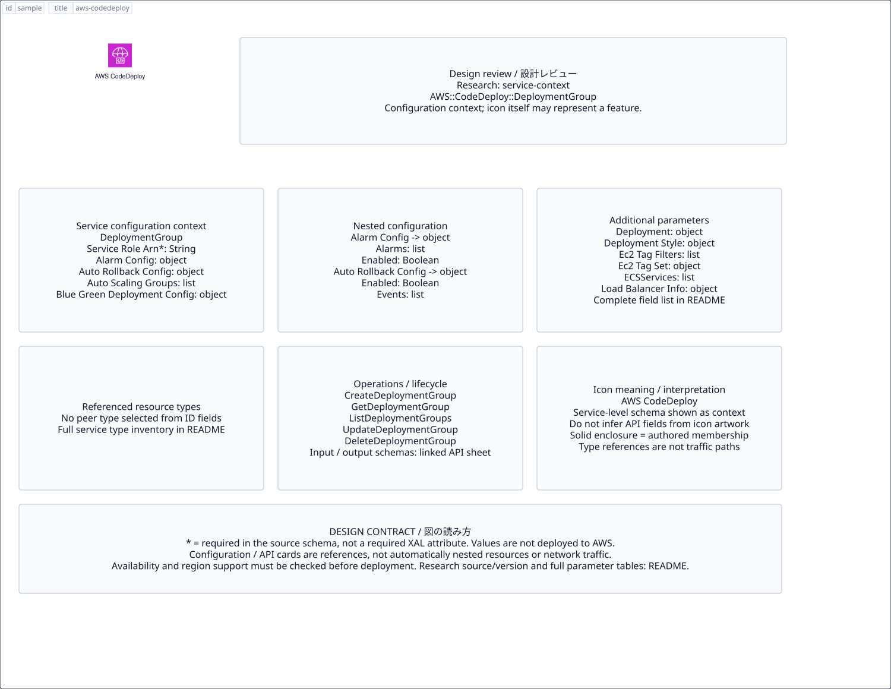

# `aws-codedeploy` — AWS CodeDeploy

[SVG preview](sample.svg) · [Editable XAL](sample.xal) · [Catalog](../README.md)



AWS service icon. Use a label and explicit annotations to describe its role; scope is selected by the author.

- Kind: `service`; category: Developer Tools.
- Diagram scope: `service` (recommendation, not AWS deployment validation).
- Default catalog ID: 488. Covered catalog IDs: 440, 456, 472, 488.
- Implementation: V1 and V2; fixed AWS icon with a wrapped label and explicit functional annotations.

## Parameters

`id` is a required, unique connection ID, not a catalog number. `label`/`title`/`name` override the label; an empty label hides it. `size` > 0 defaults to 48 px. `label-width` > 0 defaults to 160 px (default box width, at least icon size + 12 px). Explicit `width`/`height` must contain the icon and label. `visible="false"` hides it. Children and icon overrides are not supported; use a group for containment.

`detail` adds a free-form diagram annotation. `show-details="false"` hides annotation text. Only supplied values are shown; none are sent to AWS. Service/resource annotations appear on separate wrapped lines.

| Parameter | Type | Meaning | Example |
|---|---|---|---|
| `target` | text | Managed resource or build target | `Application` |

## Review notes

The catalog provides a baseline for per-component development, not a simulation of the AWS control plane. This component's current functional parameters are the ones listed above. Additional service-specific visual behavior can be developed here without replacing catalog IDs in diagrams. Edit `sample.xal`, then run:

```sh
npm run generate:aws-samples -- --render --tag=aws-codedeploy
```

<!-- aws-functional-research:start -->
## 機能調査・構成デザイン（2026-09-06）

分類: `service-context`。サービス文脈: [`aws-codedeploy`](../aws-codedeploy/README.md)。

サンプルはアイコンと、設定・内包構造・関連リソース・操作を分離したレビューシートです。設定カードは編集可能な `rectangle`、グループは既存の専用タグで実装しています。カードのフィールド名を新しい XAL 属性として受理するわけではありません。専用タグが受理する属性は上の Parameters 表を参照してください。

実線の通信と、設定の参照・同じサービスに属する型一覧を区別します。スキーマの必須項目は AWS 側の仕様であり、図の必須入力ではありません。記載の構成モデル/API は取り込んだ公式資料の範囲であり、全リージョン・全機能の完全性や稼働可否を保証しません。

**重要:** このアイコンに対応する独立した構成リソースを断定せず、所属サービスの構成モデルを参考表示しています。アイコン名や絵柄から属性・親子関係・通信を推測しません。

### 構成モデル: `AWS::CodeDeploy::DeploymentGroup`

[公式リファレンス](https://docs.aws.amazon.com/AWSCloudFormation/latest/UserGuide/aws-resource-codedeploy-deploymentgroup.html)。全 20 プロパティを型付きで列挙します（表示カードには主要項目のみ）。

| Field | Type | Required in AWS schema |
|---|---|---|
| [AlarmConfiguration](https://docs.aws.amazon.com/AWSCloudFormation/latest/UserGuide/aws-resource-codedeploy-deploymentgroup.html#cfn-codedeploy-deploymentgroup-alarmconfiguration) | `AlarmConfiguration` | no |
| [ApplicationName](https://docs.aws.amazon.com/AWSCloudFormation/latest/UserGuide/aws-resource-codedeploy-deploymentgroup.html#cfn-codedeploy-deploymentgroup-applicationname) | `String` | yes |
| [AutoRollbackConfiguration](https://docs.aws.amazon.com/AWSCloudFormation/latest/UserGuide/aws-resource-codedeploy-deploymentgroup.html#cfn-codedeploy-deploymentgroup-autorollbackconfiguration) | `AutoRollbackConfiguration` | no |
| [AutoScalingGroups](https://docs.aws.amazon.com/AWSCloudFormation/latest/UserGuide/aws-resource-codedeploy-deploymentgroup.html#cfn-codedeploy-deploymentgroup-autoscalinggroups) | `List<String>` | no |
| [BlueGreenDeploymentConfiguration](https://docs.aws.amazon.com/AWSCloudFormation/latest/UserGuide/aws-resource-codedeploy-deploymentgroup.html#cfn-codedeploy-deploymentgroup-bluegreendeploymentconfiguration) | `BlueGreenDeploymentConfiguration` | no |
| [Deployment](https://docs.aws.amazon.com/AWSCloudFormation/latest/UserGuide/aws-resource-codedeploy-deploymentgroup.html#cfn-codedeploy-deploymentgroup-deployment) | `Deployment` | no |
| [DeploymentConfigName](https://docs.aws.amazon.com/AWSCloudFormation/latest/UserGuide/aws-resource-codedeploy-deploymentgroup.html#cfn-codedeploy-deploymentgroup-deploymentconfigname) | `String` | no |
| [DeploymentGroupName](https://docs.aws.amazon.com/AWSCloudFormation/latest/UserGuide/aws-resource-codedeploy-deploymentgroup.html#cfn-codedeploy-deploymentgroup-deploymentgroupname) | `String` | no |
| [DeploymentStyle](https://docs.aws.amazon.com/AWSCloudFormation/latest/UserGuide/aws-resource-codedeploy-deploymentgroup.html#cfn-codedeploy-deploymentgroup-deploymentstyle) | `DeploymentStyle` | no |
| [Ec2TagFilters](https://docs.aws.amazon.com/AWSCloudFormation/latest/UserGuide/aws-resource-codedeploy-deploymentgroup.html#cfn-codedeploy-deploymentgroup-ec2tagfilters) | `List<EC2TagFilter>` | no |
| [Ec2TagSet](https://docs.aws.amazon.com/AWSCloudFormation/latest/UserGuide/aws-resource-codedeploy-deploymentgroup.html#cfn-codedeploy-deploymentgroup-ec2tagset) | `EC2TagSet` | no |
| [ECSServices](https://docs.aws.amazon.com/AWSCloudFormation/latest/UserGuide/aws-resource-codedeploy-deploymentgroup.html#cfn-codedeploy-deploymentgroup-ecsservices) | `List<ECSService>` | no |
| [LoadBalancerInfo](https://docs.aws.amazon.com/AWSCloudFormation/latest/UserGuide/aws-resource-codedeploy-deploymentgroup.html#cfn-codedeploy-deploymentgroup-loadbalancerinfo) | `LoadBalancerInfo` | no |
| [OnPremisesInstanceTagFilters](https://docs.aws.amazon.com/AWSCloudFormation/latest/UserGuide/aws-resource-codedeploy-deploymentgroup.html#cfn-codedeploy-deploymentgroup-onpremisesinstancetagfilters) | `List<TagFilter>` | no |
| [OnPremisesTagSet](https://docs.aws.amazon.com/AWSCloudFormation/latest/UserGuide/aws-resource-codedeploy-deploymentgroup.html#cfn-codedeploy-deploymentgroup-onpremisestagset) | `OnPremisesTagSet` | no |
| [OutdatedInstancesStrategy](https://docs.aws.amazon.com/AWSCloudFormation/latest/UserGuide/aws-resource-codedeploy-deploymentgroup.html#cfn-codedeploy-deploymentgroup-outdatedinstancesstrategy) | `String` | no |
| [ServiceRoleArn](https://docs.aws.amazon.com/AWSCloudFormation/latest/UserGuide/aws-resource-codedeploy-deploymentgroup.html#cfn-codedeploy-deploymentgroup-servicerolearn) | `String` | yes |
| [Tags](https://docs.aws.amazon.com/AWSCloudFormation/latest/UserGuide/aws-resource-codedeploy-deploymentgroup.html#cfn-codedeploy-deploymentgroup-tags) | `List<Tag>` | no |
| [TerminationHookEnabled](https://docs.aws.amazon.com/AWSCloudFormation/latest/UserGuide/aws-resource-codedeploy-deploymentgroup.html#cfn-codedeploy-deploymentgroup-terminationhookenabled) | `Boolean` | no |
| [TriggerConfigurations](https://docs.aws.amazon.com/AWSCloudFormation/latest/UserGuide/aws-resource-codedeploy-deploymentgroup.html#cfn-codedeploy-deploymentgroup-triggerconfigurations) | `List<TriggerConfig>` | no |

#### AlarmConfiguration → `AWS::CodeDeploy::DeploymentGroup.AlarmConfiguration`

| Field | Type | Required in AWS schema |
|---|---|---|
| [Alarms](https://docs.aws.amazon.com/AWSCloudFormation/latest/UserGuide/aws-properties-codedeploy-deploymentgroup-alarmconfiguration.html#cfn-codedeploy-deploymentgroup-alarmconfiguration-alarms) | `List<Alarm>` | no |
| [Enabled](https://docs.aws.amazon.com/AWSCloudFormation/latest/UserGuide/aws-properties-codedeploy-deploymentgroup-alarmconfiguration.html#cfn-codedeploy-deploymentgroup-alarmconfiguration-enabled) | `Boolean` | no |
| [IgnorePollAlarmFailure](https://docs.aws.amazon.com/AWSCloudFormation/latest/UserGuide/aws-properties-codedeploy-deploymentgroup-alarmconfiguration.html#cfn-codedeploy-deploymentgroup-alarmconfiguration-ignorepollalarmfailure) | `Boolean` | no |

#### AutoRollbackConfiguration → `AWS::CodeDeploy::DeploymentGroup.AutoRollbackConfiguration`

| Field | Type | Required in AWS schema |
|---|---|---|
| [Enabled](https://docs.aws.amazon.com/AWSCloudFormation/latest/UserGuide/aws-properties-codedeploy-deploymentgroup-autorollbackconfiguration.html#cfn-codedeploy-deploymentgroup-autorollbackconfiguration-enabled) | `Boolean` | no |
| [Events](https://docs.aws.amazon.com/AWSCloudFormation/latest/UserGuide/aws-properties-codedeploy-deploymentgroup-autorollbackconfiguration.html#cfn-codedeploy-deploymentgroup-autorollbackconfiguration-events) | `List<String>` | no |

#### BlueGreenDeploymentConfiguration → `AWS::CodeDeploy::DeploymentGroup.BlueGreenDeploymentConfiguration`

| Field | Type | Required in AWS schema |
|---|---|---|
| [DeploymentReadyOption](https://docs.aws.amazon.com/AWSCloudFormation/latest/UserGuide/aws-properties-codedeploy-deploymentgroup-bluegreendeploymentconfiguration.html#cfn-codedeploy-deploymentgroup-bluegreendeploymentconfiguration-deploymentreadyoption) | `DeploymentReadyOption` | no |
| [GreenFleetProvisioningOption](https://docs.aws.amazon.com/AWSCloudFormation/latest/UserGuide/aws-properties-codedeploy-deploymentgroup-bluegreendeploymentconfiguration.html#cfn-codedeploy-deploymentgroup-bluegreendeploymentconfiguration-greenfleetprovisioningoption) | `GreenFleetProvisioningOption` | no |
| [TerminateBlueInstancesOnDeploymentSuccess](https://docs.aws.amazon.com/AWSCloudFormation/latest/UserGuide/aws-properties-codedeploy-deploymentgroup-bluegreendeploymentconfiguration.html#cfn-codedeploy-deploymentgroup-bluegreendeploymentconfiguration-terminateblueinstancesondeploymentsuccess) | `BlueInstanceTerminationOption` | no |

#### Deployment → `AWS::CodeDeploy::DeploymentGroup.Deployment`

| Field | Type | Required in AWS schema |
|---|---|---|
| [Description](https://docs.aws.amazon.com/AWSCloudFormation/latest/UserGuide/aws-properties-codedeploy-deploymentgroup-deployment.html#cfn-codedeploy-deploymentgroup-deployment-description) | `String` | no |
| [IgnoreApplicationStopFailures](https://docs.aws.amazon.com/AWSCloudFormation/latest/UserGuide/aws-properties-codedeploy-deploymentgroup-deployment.html#cfn-codedeploy-deploymentgroup-deployment-ignoreapplicationstopfailures) | `Boolean` | no |
| [Revision](https://docs.aws.amazon.com/AWSCloudFormation/latest/UserGuide/aws-properties-codedeploy-deploymentgroup-deployment.html#cfn-codedeploy-deploymentgroup-deployment-revision) | `RevisionLocation` | yes |

#### DeploymentStyle → `AWS::CodeDeploy::DeploymentGroup.DeploymentStyle`

| Field | Type | Required in AWS schema |
|---|---|---|
| [DeploymentOption](https://docs.aws.amazon.com/AWSCloudFormation/latest/UserGuide/aws-properties-codedeploy-deploymentgroup-deploymentstyle.html#cfn-codedeploy-deploymentgroup-deploymentstyle-deploymentoption) | `String` | no |
| [DeploymentType](https://docs.aws.amazon.com/AWSCloudFormation/latest/UserGuide/aws-properties-codedeploy-deploymentgroup-deploymentstyle.html#cfn-codedeploy-deploymentgroup-deploymentstyle-deploymenttype) | `String` | no |

#### Ec2TagFilters → `AWS::CodeDeploy::DeploymentGroup.EC2TagFilter`

| Field | Type | Required in AWS schema |
|---|---|---|
| [Key](https://docs.aws.amazon.com/AWSCloudFormation/latest/UserGuide/aws-properties-codedeploy-deploymentgroup-ec2tagfilter.html#cfn-codedeploy-deploymentgroup-ec2tagfilter-key) | `String` | no |
| [Type](https://docs.aws.amazon.com/AWSCloudFormation/latest/UserGuide/aws-properties-codedeploy-deploymentgroup-ec2tagfilter.html#cfn-codedeploy-deploymentgroup-ec2tagfilter-type) | `String` | no |
| [Value](https://docs.aws.amazon.com/AWSCloudFormation/latest/UserGuide/aws-properties-codedeploy-deploymentgroup-ec2tagfilter.html#cfn-codedeploy-deploymentgroup-ec2tagfilter-value) | `String` | no |

#### Ec2TagSet → `AWS::CodeDeploy::DeploymentGroup.EC2TagSet`

| Field | Type | Required in AWS schema |
|---|---|---|
| [Ec2TagSetList](https://docs.aws.amazon.com/AWSCloudFormation/latest/UserGuide/aws-properties-codedeploy-deploymentgroup-ec2tagset.html#cfn-codedeploy-deploymentgroup-ec2tagset-ec2tagsetlist) | `List<EC2TagSetListObject>` | no |

#### ECSServices → `AWS::CodeDeploy::DeploymentGroup.ECSService`

| Field | Type | Required in AWS schema |
|---|---|---|
| [ClusterName](https://docs.aws.amazon.com/AWSCloudFormation/latest/UserGuide/aws-properties-codedeploy-deploymentgroup-ecsservice.html#cfn-codedeploy-deploymentgroup-ecsservice-clustername) | `String` | yes |
| [ServiceName](https://docs.aws.amazon.com/AWSCloudFormation/latest/UserGuide/aws-properties-codedeploy-deploymentgroup-ecsservice.html#cfn-codedeploy-deploymentgroup-ecsservice-servicename) | `String` | yes |

#### LoadBalancerInfo → `AWS::CodeDeploy::DeploymentGroup.LoadBalancerInfo`

| Field | Type | Required in AWS schema |
|---|---|---|
| [ElbInfoList](https://docs.aws.amazon.com/AWSCloudFormation/latest/UserGuide/aws-properties-codedeploy-deploymentgroup-loadbalancerinfo.html#cfn-codedeploy-deploymentgroup-loadbalancerinfo-elbinfolist) | `List<ELBInfo>` | no |
| [TargetGroupInfoList](https://docs.aws.amazon.com/AWSCloudFormation/latest/UserGuide/aws-properties-codedeploy-deploymentgroup-loadbalancerinfo.html#cfn-codedeploy-deploymentgroup-loadbalancerinfo-targetgroupinfolist) | `List<TargetGroupInfo>` | no |
| [TargetGroupPairInfoList](https://docs.aws.amazon.com/AWSCloudFormation/latest/UserGuide/aws-properties-codedeploy-deploymentgroup-loadbalancerinfo.html#cfn-codedeploy-deploymentgroup-loadbalancerinfo-targetgrouppairinfolist) | `List<TargetGroupPairInfo>` | no |

#### OnPremisesInstanceTagFilters → `AWS::CodeDeploy::DeploymentGroup.TagFilter`

| Field | Type | Required in AWS schema |
|---|---|---|
| [Key](https://docs.aws.amazon.com/AWSCloudFormation/latest/UserGuide/aws-properties-codedeploy-deploymentgroup-tagfilter.html#cfn-codedeploy-deploymentgroup-tagfilter-key) | `String` | no |
| [Type](https://docs.aws.amazon.com/AWSCloudFormation/latest/UserGuide/aws-properties-codedeploy-deploymentgroup-tagfilter.html#cfn-codedeploy-deploymentgroup-tagfilter-type) | `String` | no |
| [Value](https://docs.aws.amazon.com/AWSCloudFormation/latest/UserGuide/aws-properties-codedeploy-deploymentgroup-tagfilter.html#cfn-codedeploy-deploymentgroup-tagfilter-value) | `String` | no |

#### OnPremisesTagSet → `AWS::CodeDeploy::DeploymentGroup.OnPremisesTagSet`

| Field | Type | Required in AWS schema |
|---|---|---|
| [OnPremisesTagSetList](https://docs.aws.amazon.com/AWSCloudFormation/latest/UserGuide/aws-properties-codedeploy-deploymentgroup-onpremisestagset.html#cfn-codedeploy-deploymentgroup-onpremisestagset-onpremisestagsetlist) | `List<OnPremisesTagSetListObject>` | no |

#### TriggerConfigurations → `AWS::CodeDeploy::DeploymentGroup.TriggerConfig`

| Field | Type | Required in AWS schema |
|---|---|---|
| [TriggerEvents](https://docs.aws.amazon.com/AWSCloudFormation/latest/UserGuide/aws-properties-codedeploy-deploymentgroup-triggerconfig.html#cfn-codedeploy-deploymentgroup-triggerconfig-triggerevents) | `List<String>` | no |
| [TriggerName](https://docs.aws.amazon.com/AWSCloudFormation/latest/UserGuide/aws-properties-codedeploy-deploymentgroup-triggerconfig.html#cfn-codedeploy-deploymentgroup-triggerconfig-triggername) | `String` | no |
| [TriggerTargetArn](https://docs.aws.amazon.com/AWSCloudFormation/latest/UserGuide/aws-properties-codedeploy-deploymentgroup-triggerconfig.html#cfn-codedeploy-deploymentgroup-triggerconfig-triggertargetarn) | `String` | no |

### 関連する構成リソース（3 型）

同じサービス文脈の型一覧です。すべてがこのアイコンの子リソースという意味ではありません。さらに深い入れ子は [公式スキーマのスナップショット](../research/cloudformation-models.json) に記録しています。

- [AWS::CodeDeploy::Application](https://docs.aws.amazon.com/AWSCloudFormation/latest/UserGuide/aws-resource-codedeploy-application.html)
- [AWS::CodeDeploy::DeploymentConfig](https://docs.aws.amazon.com/AWSCloudFormation/latest/UserGuide/aws-resource-codedeploy-deploymentconfig.html)
- [AWS::CodeDeploy::DeploymentGroup](https://docs.aws.amazon.com/AWSCloudFormation/latest/UserGuide/aws-resource-codedeploy-deploymentgroup.html)

### API の操作・パラメータ

- [AWS CodeDeploy: 47 操作の入力・出力一覧](../research/api/codedeploy.md)（API version 2014-10-06）

### 出典・調査範囲

- [公式資料 1](https://docs.aws.amazon.com/AWSCloudFormation/latest/UserGuide/aws-resource-codedeploy-deploymentgroup.html)
- [公式資料 2](https://github.com/boto/botocore/blob/develop/botocore/data/codedeploy/2014-10-06/service-2.json)

CloudFormation 仕様 263.0.0、AWS SDK 431 サービスモデルをオフラインで参照。取得日・元データの SHA-256 は [調査マニフェスト](../research/README.md) を参照。API モデル名・フィールド名は仕様から抽出し、説明本文を転載していません。利用可能性は全サービス一律には確認できないため、提供終了の確認がないものも「現在利用可能」と断定していません。

### 次の部品レビュー

- 本アイコンが独立したリソースか、機能・状態・デバイスの記号かを確認する。
- 詳細カードのうち専用の子タグ・参照属性として実装する範囲を選ぶ。
- 通信、制御、認証、監視の関係を分け、必要な接続点・配置制約を確認する。
- 編集後は `npm run generate:aws-samples -- --render --tag=aws-codedeploy`。通常の再描画は XAL/README を上書きしない。
<!-- aws-functional-research:end -->
