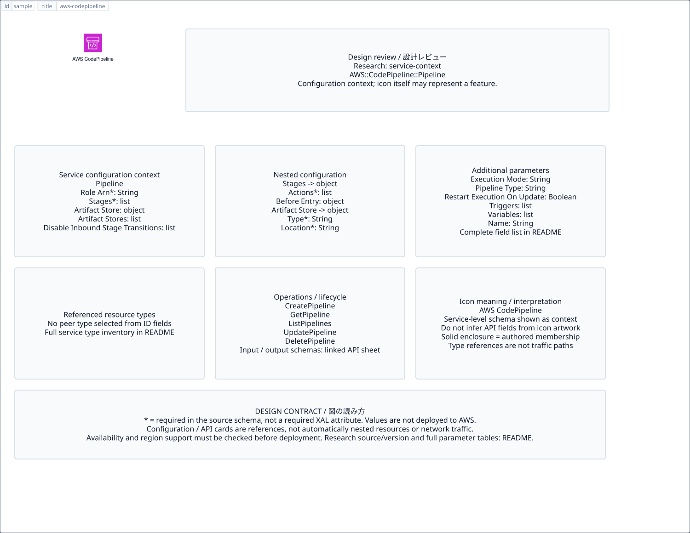

# `aws-codepipeline` — AWS CodePipeline

[SVG preview](sample.svg) · [Editable XAL](sample.xal) · [Catalog](../README.md)



AWS service icon. Use a label and explicit annotations to describe its role; scope is selected by the author.

- Kind: `service`; category: Developer Tools.
- Diagram scope: `service` (recommendation, not AWS deployment validation).
- Default catalog ID: 489. Covered catalog IDs: 441, 457, 473, 489.
- Implementation: V1 and V2; fixed AWS icon with a wrapped label and explicit functional annotations.

## Parameters

`id` is a required, unique connection ID, not a catalog number. `label`/`title`/`name` override the label; an empty label hides it. `size` > 0 defaults to 48 px. `label-width` > 0 defaults to 160 px (default box width, at least icon size + 12 px). Explicit `width`/`height` must contain the icon and label. `visible="false"` hides it. Children and icon overrides are not supported; use a group for containment.

`detail` adds a free-form diagram annotation. `show-details="false"` hides annotation text. Only supplied values are shown; none are sent to AWS. Service/resource annotations appear on separate wrapped lines.

| Parameter | Type | Meaning | Example |
|---|---|---|---|
| `target` | text | Managed resource or build target | `Application` |

## Review notes

The catalog provides a baseline for per-component development, not a simulation of the AWS control plane. This component's current functional parameters are the ones listed above. Additional service-specific visual behavior can be developed here without replacing catalog IDs in diagrams. Edit `sample.xal`, then run:

```sh
npm run generate:aws-samples -- --render --tag=aws-codepipeline
```

<!-- aws-functional-research:start -->
## 機能調査・構成デザイン（2026-09-06）

分類: `service-context`。サービス文脈: [`aws-codepipeline`](../aws-codepipeline/README.md)。

サンプルはアイコンと、設定・内包構造・関連リソース・操作を分離したレビューシートです。設定カードは編集可能な `rectangle`、グループは既存の専用タグで実装しています。カードのフィールド名を新しい XAL 属性として受理するわけではありません。専用タグが受理する属性は上の Parameters 表を参照してください。

実線の通信と、設定の参照・同じサービスに属する型一覧を区別します。スキーマの必須項目は AWS 側の仕様であり、図の必須入力ではありません。記載の構成モデル/API は取り込んだ公式資料の範囲であり、全リージョン・全機能の完全性や稼働可否を保証しません。

**重要:** このアイコンに対応する独立した構成リソースを断定せず、所属サービスの構成モデルを参考表示しています。アイコン名や絵柄から属性・親子関係・通信を推測しません。

### 構成モデル: `AWS::CodePipeline::Pipeline`

[公式リファレンス](https://docs.aws.amazon.com/AWSCloudFormation/latest/UserGuide/aws-resource-codepipeline-pipeline.html)。全 12 プロパティを型付きで列挙します（表示カードには主要項目のみ）。

| Field | Type | Required in AWS schema |
|---|---|---|
| [ArtifactStore](https://docs.aws.amazon.com/AWSCloudFormation/latest/UserGuide/aws-resource-codepipeline-pipeline.html#cfn-codepipeline-pipeline-artifactstore) | `ArtifactStore` | no |
| [ArtifactStores](https://docs.aws.amazon.com/AWSCloudFormation/latest/UserGuide/aws-resource-codepipeline-pipeline.html#cfn-codepipeline-pipeline-artifactstores) | `List<ArtifactStoreMap>` | no |
| [DisableInboundStageTransitions](https://docs.aws.amazon.com/AWSCloudFormation/latest/UserGuide/aws-resource-codepipeline-pipeline.html#cfn-codepipeline-pipeline-disableinboundstagetransitions) | `List<StageTransition>` | no |
| [ExecutionMode](https://docs.aws.amazon.com/AWSCloudFormation/latest/UserGuide/aws-resource-codepipeline-pipeline.html#cfn-codepipeline-pipeline-executionmode) | `String` | no |
| [Name](https://docs.aws.amazon.com/AWSCloudFormation/latest/UserGuide/aws-resource-codepipeline-pipeline.html#cfn-codepipeline-pipeline-name) | `String` | no |
| [PipelineType](https://docs.aws.amazon.com/AWSCloudFormation/latest/UserGuide/aws-resource-codepipeline-pipeline.html#cfn-codepipeline-pipeline-pipelinetype) | `String` | no |
| [RestartExecutionOnUpdate](https://docs.aws.amazon.com/AWSCloudFormation/latest/UserGuide/aws-resource-codepipeline-pipeline.html#cfn-codepipeline-pipeline-restartexecutiononupdate) | `Boolean` | no |
| [RoleArn](https://docs.aws.amazon.com/AWSCloudFormation/latest/UserGuide/aws-resource-codepipeline-pipeline.html#cfn-codepipeline-pipeline-rolearn) | `String` | yes |
| [Stages](https://docs.aws.amazon.com/AWSCloudFormation/latest/UserGuide/aws-resource-codepipeline-pipeline.html#cfn-codepipeline-pipeline-stages) | `List<StageDeclaration>` | yes |
| [Tags](https://docs.aws.amazon.com/AWSCloudFormation/latest/UserGuide/aws-resource-codepipeline-pipeline.html#cfn-codepipeline-pipeline-tags) | `List<Tag>` | no |
| [Triggers](https://docs.aws.amazon.com/AWSCloudFormation/latest/UserGuide/aws-resource-codepipeline-pipeline.html#cfn-codepipeline-pipeline-triggers) | `List<PipelineTriggerDeclaration>` | no |
| [Variables](https://docs.aws.amazon.com/AWSCloudFormation/latest/UserGuide/aws-resource-codepipeline-pipeline.html#cfn-codepipeline-pipeline-variables) | `List<VariableDeclaration>` | no |

#### Stages → `AWS::CodePipeline::Pipeline.StageDeclaration`

| Field | Type | Required in AWS schema |
|---|---|---|
| [Actions](https://docs.aws.amazon.com/AWSCloudFormation/latest/UserGuide/aws-properties-codepipeline-pipeline-stagedeclaration.html#cfn-codepipeline-pipeline-stagedeclaration-actions) | `List<ActionDeclaration>` | yes |
| [BeforeEntry](https://docs.aws.amazon.com/AWSCloudFormation/latest/UserGuide/aws-properties-codepipeline-pipeline-stagedeclaration.html#cfn-codepipeline-pipeline-stagedeclaration-beforeentry) | `BeforeEntryConditions` | no |
| [Blockers](https://docs.aws.amazon.com/AWSCloudFormation/latest/UserGuide/aws-properties-codepipeline-pipeline-stagedeclaration.html#cfn-codepipeline-pipeline-stagedeclaration-blockers) | `List<BlockerDeclaration>` | no |
| [Name](https://docs.aws.amazon.com/AWSCloudFormation/latest/UserGuide/aws-properties-codepipeline-pipeline-stagedeclaration.html#cfn-codepipeline-pipeline-stagedeclaration-name) | `String` | yes |
| [OnFailure](https://docs.aws.amazon.com/AWSCloudFormation/latest/UserGuide/aws-properties-codepipeline-pipeline-stagedeclaration.html#cfn-codepipeline-pipeline-stagedeclaration-onfailure) | `FailureConditions` | no |
| [OnSuccess](https://docs.aws.amazon.com/AWSCloudFormation/latest/UserGuide/aws-properties-codepipeline-pipeline-stagedeclaration.html#cfn-codepipeline-pipeline-stagedeclaration-onsuccess) | `SuccessConditions` | no |

#### ArtifactStore → `AWS::CodePipeline::Pipeline.ArtifactStore`

| Field | Type | Required in AWS schema |
|---|---|---|
| [EncryptionKey](https://docs.aws.amazon.com/AWSCloudFormation/latest/UserGuide/aws-properties-codepipeline-pipeline-artifactstore.html#cfn-codepipeline-pipeline-artifactstore-encryptionkey) | `EncryptionKey` | no |
| [Location](https://docs.aws.amazon.com/AWSCloudFormation/latest/UserGuide/aws-properties-codepipeline-pipeline-artifactstore.html#cfn-codepipeline-pipeline-artifactstore-location) | `String` | yes |
| [Type](https://docs.aws.amazon.com/AWSCloudFormation/latest/UserGuide/aws-properties-codepipeline-pipeline-artifactstore.html#cfn-codepipeline-pipeline-artifactstore-type) | `String` | yes |

#### ArtifactStores → `AWS::CodePipeline::Pipeline.ArtifactStoreMap`

| Field | Type | Required in AWS schema |
|---|---|---|
| [ArtifactStore](https://docs.aws.amazon.com/AWSCloudFormation/latest/UserGuide/aws-properties-codepipeline-pipeline-artifactstoremap.html#cfn-codepipeline-pipeline-artifactstoremap-artifactstore) | `ArtifactStore` | yes |
| [Region](https://docs.aws.amazon.com/AWSCloudFormation/latest/UserGuide/aws-properties-codepipeline-pipeline-artifactstoremap.html#cfn-codepipeline-pipeline-artifactstoremap-region) | `String` | yes |

#### DisableInboundStageTransitions → `AWS::CodePipeline::Pipeline.StageTransition`

| Field | Type | Required in AWS schema |
|---|---|---|
| [Reason](https://docs.aws.amazon.com/AWSCloudFormation/latest/UserGuide/aws-properties-codepipeline-pipeline-stagetransition.html#cfn-codepipeline-pipeline-stagetransition-reason) | `String` | yes |
| [StageName](https://docs.aws.amazon.com/AWSCloudFormation/latest/UserGuide/aws-properties-codepipeline-pipeline-stagetransition.html#cfn-codepipeline-pipeline-stagetransition-stagename) | `String` | yes |

#### Triggers → `AWS::CodePipeline::Pipeline.PipelineTriggerDeclaration`

| Field | Type | Required in AWS schema |
|---|---|---|
| [GitConfiguration](https://docs.aws.amazon.com/AWSCloudFormation/latest/UserGuide/aws-properties-codepipeline-pipeline-pipelinetriggerdeclaration.html#cfn-codepipeline-pipeline-pipelinetriggerdeclaration-gitconfiguration) | `GitConfiguration` | no |
| [ProviderType](https://docs.aws.amazon.com/AWSCloudFormation/latest/UserGuide/aws-properties-codepipeline-pipeline-pipelinetriggerdeclaration.html#cfn-codepipeline-pipeline-pipelinetriggerdeclaration-providertype) | `String` | yes |

#### Variables → `AWS::CodePipeline::Pipeline.VariableDeclaration`

| Field | Type | Required in AWS schema |
|---|---|---|
| [DefaultValue](https://docs.aws.amazon.com/AWSCloudFormation/latest/UserGuide/aws-properties-codepipeline-pipeline-variabledeclaration.html#cfn-codepipeline-pipeline-variabledeclaration-defaultvalue) | `String` | no |
| [Description](https://docs.aws.amazon.com/AWSCloudFormation/latest/UserGuide/aws-properties-codepipeline-pipeline-variabledeclaration.html#cfn-codepipeline-pipeline-variabledeclaration-description) | `String` | no |
| [Name](https://docs.aws.amazon.com/AWSCloudFormation/latest/UserGuide/aws-properties-codepipeline-pipeline-variabledeclaration.html#cfn-codepipeline-pipeline-variabledeclaration-name) | `String` | yes |

### 関連する構成リソース（3 型）

同じサービス文脈の型一覧です。すべてがこのアイコンの子リソースという意味ではありません。さらに深い入れ子は [公式スキーマのスナップショット](../research/cloudformation-models.json) に記録しています。

- [AWS::CodePipeline::CustomActionType](https://docs.aws.amazon.com/AWSCloudFormation/latest/UserGuide/aws-resource-codepipeline-customactiontype.html)
- [AWS::CodePipeline::Pipeline](https://docs.aws.amazon.com/AWSCloudFormation/latest/UserGuide/aws-resource-codepipeline-pipeline.html)
- [AWS::CodePipeline::Webhook](https://docs.aws.amazon.com/AWSCloudFormation/latest/UserGuide/aws-resource-codepipeline-webhook.html)

### API の操作・パラメータ

- [AWS CodePipeline: 44 操作の入力・出力一覧](../research/api/codepipeline.md)（API version 2015-07-09）

### 出典・調査範囲

- [公式資料 1](https://docs.aws.amazon.com/AWSCloudFormation/latest/UserGuide/aws-resource-codepipeline-pipeline.html)
- [公式資料 2](https://github.com/boto/botocore/blob/develop/botocore/data/codepipeline/2015-07-09/service-2.json)

CloudFormation 仕様 263.0.0、AWS SDK 431 サービスモデルをオフラインで参照。取得日・元データの SHA-256 は [調査マニフェスト](../research/README.md) を参照。API モデル名・フィールド名は仕様から抽出し、説明本文を転載していません。利用可能性は全サービス一律には確認できないため、提供終了の確認がないものも「現在利用可能」と断定していません。

### 次の部品レビュー

- 本アイコンが独立したリソースか、機能・状態・デバイスの記号かを確認する。
- 詳細カードのうち専用の子タグ・参照属性として実装する範囲を選ぶ。
- 通信、制御、認証、監視の関係を分け、必要な接続点・配置制約を確認する。
- 編集後は `npm run generate:aws-samples -- --render --tag=aws-codepipeline`。通常の再描画は XAL/README を上書きしない。
<!-- aws-functional-research:end -->
