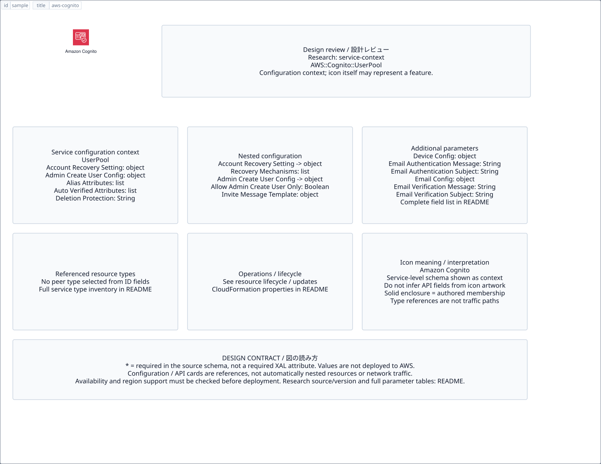

# `aws-cognito` — Amazon Cognito

[SVG preview](sample.svg) · [Editable XAL](sample.xal) · [Catalog](../README.md)



AWS service icon. Use a label and explicit annotations to describe its role; scope is selected by the author.

- Kind: `service`; category: Security Identity Compliance.
- Diagram scope: `service` (recommendation, not AWS deployment validation).
- Default catalog ID: 310. Covered catalog IDs: 229, 256, 283, 310.
- Implementation: V1 and V2; fixed AWS icon with a wrapped label and explicit functional annotations.

## Parameters

`id` is a required, unique connection ID, not a catalog number. `label`/`title`/`name` override the label; an empty label hides it. `size` > 0 defaults to 48 px. `label-width` > 0 defaults to 160 px (default box width, at least icon size + 12 px). Explicit `width`/`height` must contain the icon and label. `visible="false"` hides it. Children and icon overrides are not supported; use a group for containment.

`detail` adds a free-form diagram annotation. `show-details="false"` hides annotation text. Only supplied values are shown; none are sent to AWS. Service/resource annotations appear on separate wrapped lines.

| Parameter | Type | Meaning | Example |
|---|---|---|---|
| `protects` | text | Protected resource or policy annotation | `Application access` |

## Review notes

The catalog provides a baseline for per-component development, not a simulation of the AWS control plane. This component's current functional parameters are the ones listed above. Additional service-specific visual behavior can be developed here without replacing catalog IDs in diagrams. Edit `sample.xal`, then run:

```sh
npm run generate:aws-samples -- --render --tag=aws-cognito
```

<!-- aws-functional-research:start -->
## 機能調査・構成デザイン（2026-09-06）

分類: `service-context`。サービス文脈: [`aws-cognito`](../aws-cognito/README.md)。

サンプルはアイコンと、設定・内包構造・関連リソース・操作を分離したレビューシートです。設定カードは編集可能な `rectangle`、グループは既存の専用タグで実装しています。カードのフィールド名を新しい XAL 属性として受理するわけではありません。専用タグが受理する属性は上の Parameters 表を参照してください。

実線の通信と、設定の参照・同じサービスに属する型一覧を区別します。スキーマの必須項目は AWS 側の仕様であり、図の必須入力ではありません。記載の構成モデル/API は取り込んだ公式資料の範囲であり、全リージョン・全機能の完全性や稼働可否を保証しません。

**重要:** このアイコンに対応する独立した構成リソースを断定せず、所属サービスの構成モデルを参考表示しています。アイコン名や絵柄から属性・親子関係・通信を推測しません。

### 構成モデル: `AWS::Cognito::UserPool`

[公式リファレンス](https://docs.aws.amazon.com/AWSCloudFormation/latest/UserGuide/aws-resource-cognito-userpool.html)。全 32 プロパティを型付きで列挙します（表示カードには主要項目のみ）。

| Field | Type | Required in AWS schema |
|---|---|---|
| [AccountRecoverySetting](https://docs.aws.amazon.com/AWSCloudFormation/latest/UserGuide/aws-resource-cognito-userpool.html#cfn-cognito-userpool-accountrecoverysetting) | `AccountRecoverySetting` | no |
| [AdminCreateUserConfig](https://docs.aws.amazon.com/AWSCloudFormation/latest/UserGuide/aws-resource-cognito-userpool.html#cfn-cognito-userpool-admincreateuserconfig) | `AdminCreateUserConfig` | no |
| [AliasAttributes](https://docs.aws.amazon.com/AWSCloudFormation/latest/UserGuide/aws-resource-cognito-userpool.html#cfn-cognito-userpool-aliasattributes) | `List<String>` | no |
| [AutoVerifiedAttributes](https://docs.aws.amazon.com/AWSCloudFormation/latest/UserGuide/aws-resource-cognito-userpool.html#cfn-cognito-userpool-autoverifiedattributes) | `List<String>` | no |
| [DeletionProtection](https://docs.aws.amazon.com/AWSCloudFormation/latest/UserGuide/aws-resource-cognito-userpool.html#cfn-cognito-userpool-deletionprotection) | `String` | no |
| [DeviceConfiguration](https://docs.aws.amazon.com/AWSCloudFormation/latest/UserGuide/aws-resource-cognito-userpool.html#cfn-cognito-userpool-deviceconfiguration) | `DeviceConfiguration` | no |
| [EmailAuthenticationMessage](https://docs.aws.amazon.com/AWSCloudFormation/latest/UserGuide/aws-resource-cognito-userpool.html#cfn-cognito-userpool-emailauthenticationmessage) | `String` | no |
| [EmailAuthenticationSubject](https://docs.aws.amazon.com/AWSCloudFormation/latest/UserGuide/aws-resource-cognito-userpool.html#cfn-cognito-userpool-emailauthenticationsubject) | `String` | no |
| [EmailConfiguration](https://docs.aws.amazon.com/AWSCloudFormation/latest/UserGuide/aws-resource-cognito-userpool.html#cfn-cognito-userpool-emailconfiguration) | `EmailConfiguration` | no |
| [EmailVerificationMessage](https://docs.aws.amazon.com/AWSCloudFormation/latest/UserGuide/aws-resource-cognito-userpool.html#cfn-cognito-userpool-emailverificationmessage) | `String` | no |
| [EmailVerificationSubject](https://docs.aws.amazon.com/AWSCloudFormation/latest/UserGuide/aws-resource-cognito-userpool.html#cfn-cognito-userpool-emailverificationsubject) | `String` | no |
| [EnabledMfas](https://docs.aws.amazon.com/AWSCloudFormation/latest/UserGuide/aws-resource-cognito-userpool.html#cfn-cognito-userpool-enabledmfas) | `List<String>` | no |
| [IssuerConfiguration](https://docs.aws.amazon.com/AWSCloudFormation/latest/UserGuide/aws-resource-cognito-userpool.html#cfn-cognito-userpool-issuerconfiguration) | `IssuerConfiguration` | no |
| [KeyConfiguration](https://docs.aws.amazon.com/AWSCloudFormation/latest/UserGuide/aws-resource-cognito-userpool.html#cfn-cognito-userpool-keyconfiguration) | `KeyConfiguration` | no |
| [LambdaConfig](https://docs.aws.amazon.com/AWSCloudFormation/latest/UserGuide/aws-resource-cognito-userpool.html#cfn-cognito-userpool-lambdaconfig) | `LambdaConfig` | no |
| [MfaConfiguration](https://docs.aws.amazon.com/AWSCloudFormation/latest/UserGuide/aws-resource-cognito-userpool.html#cfn-cognito-userpool-mfaconfiguration) | `String` | no |
| [Policies](https://docs.aws.amazon.com/AWSCloudFormation/latest/UserGuide/aws-resource-cognito-userpool.html#cfn-cognito-userpool-policies) | `Policies` | no |
| [Schema](https://docs.aws.amazon.com/AWSCloudFormation/latest/UserGuide/aws-resource-cognito-userpool.html#cfn-cognito-userpool-schema) | `List<SchemaAttribute>` | no |
| [SmsAuthenticationMessage](https://docs.aws.amazon.com/AWSCloudFormation/latest/UserGuide/aws-resource-cognito-userpool.html#cfn-cognito-userpool-smsauthenticationmessage) | `String` | no |
| [SmsConfiguration](https://docs.aws.amazon.com/AWSCloudFormation/latest/UserGuide/aws-resource-cognito-userpool.html#cfn-cognito-userpool-smsconfiguration) | `SmsConfiguration` | no |
| [SmsVerificationMessage](https://docs.aws.amazon.com/AWSCloudFormation/latest/UserGuide/aws-resource-cognito-userpool.html#cfn-cognito-userpool-smsverificationmessage) | `String` | no |
| [UserAttributeUpdateSettings](https://docs.aws.amazon.com/AWSCloudFormation/latest/UserGuide/aws-resource-cognito-userpool.html#cfn-cognito-userpool-userattributeupdatesettings) | `UserAttributeUpdateSettings` | no |
| [UsernameAttributes](https://docs.aws.amazon.com/AWSCloudFormation/latest/UserGuide/aws-resource-cognito-userpool.html#cfn-cognito-userpool-usernameattributes) | `List<String>` | no |
| [UsernameConfiguration](https://docs.aws.amazon.com/AWSCloudFormation/latest/UserGuide/aws-resource-cognito-userpool.html#cfn-cognito-userpool-usernameconfiguration) | `UsernameConfiguration` | no |
| [UserPoolAddOns](https://docs.aws.amazon.com/AWSCloudFormation/latest/UserGuide/aws-resource-cognito-userpool.html#cfn-cognito-userpool-userpooladdons) | `UserPoolAddOns` | no |
| [UserPoolName](https://docs.aws.amazon.com/AWSCloudFormation/latest/UserGuide/aws-resource-cognito-userpool.html#cfn-cognito-userpool-userpoolname) | `String` | no |
| [UserPoolTags](https://docs.aws.amazon.com/AWSCloudFormation/latest/UserGuide/aws-resource-cognito-userpool.html#cfn-cognito-userpool-userpooltags) | `Map<String>` | no |
| [UserPoolTier](https://docs.aws.amazon.com/AWSCloudFormation/latest/UserGuide/aws-resource-cognito-userpool.html#cfn-cognito-userpool-userpooltier) | `String` | no |
| [VerificationMessageTemplate](https://docs.aws.amazon.com/AWSCloudFormation/latest/UserGuide/aws-resource-cognito-userpool.html#cfn-cognito-userpool-verificationmessagetemplate) | `VerificationMessageTemplate` | no |
| [WebAuthnFactorConfiguration](https://docs.aws.amazon.com/AWSCloudFormation/latest/UserGuide/aws-resource-cognito-userpool.html#cfn-cognito-userpool-webauthnfactorconfiguration) | `String` | no |
| [WebAuthnRelyingPartyID](https://docs.aws.amazon.com/AWSCloudFormation/latest/UserGuide/aws-resource-cognito-userpool.html#cfn-cognito-userpool-webauthnrelyingpartyid) | `String` | no |
| [WebAuthnUserVerification](https://docs.aws.amazon.com/AWSCloudFormation/latest/UserGuide/aws-resource-cognito-userpool.html#cfn-cognito-userpool-webauthnuserverification) | `String` | no |

#### AccountRecoverySetting → `AWS::Cognito::UserPool.AccountRecoverySetting`

| Field | Type | Required in AWS schema |
|---|---|---|
| [RecoveryMechanisms](https://docs.aws.amazon.com/AWSCloudFormation/latest/UserGuide/aws-properties-cognito-userpool-accountrecoverysetting.html#cfn-cognito-userpool-accountrecoverysetting-recoverymechanisms) | `List<RecoveryOption>` | no |

#### AdminCreateUserConfig → `AWS::Cognito::UserPool.AdminCreateUserConfig`

| Field | Type | Required in AWS schema |
|---|---|---|
| [AllowAdminCreateUserOnly](https://docs.aws.amazon.com/AWSCloudFormation/latest/UserGuide/aws-properties-cognito-userpool-admincreateuserconfig.html#cfn-cognito-userpool-admincreateuserconfig-allowadmincreateuseronly) | `Boolean` | no |
| [InviteMessageTemplate](https://docs.aws.amazon.com/AWSCloudFormation/latest/UserGuide/aws-properties-cognito-userpool-admincreateuserconfig.html#cfn-cognito-userpool-admincreateuserconfig-invitemessagetemplate) | `InviteMessageTemplate` | no |
| [UnusedAccountValidityDays](https://docs.aws.amazon.com/AWSCloudFormation/latest/UserGuide/aws-properties-cognito-userpool-admincreateuserconfig.html#cfn-cognito-userpool-admincreateuserconfig-unusedaccountvaliditydays) | `Integer` | no |

#### DeviceConfiguration → `AWS::Cognito::UserPool.DeviceConfiguration`

| Field | Type | Required in AWS schema |
|---|---|---|
| [ChallengeRequiredOnNewDevice](https://docs.aws.amazon.com/AWSCloudFormation/latest/UserGuide/aws-properties-cognito-userpool-deviceconfiguration.html#cfn-cognito-userpool-deviceconfiguration-challengerequiredonnewdevice) | `Boolean` | no |
| [DeviceOnlyRememberedOnUserPrompt](https://docs.aws.amazon.com/AWSCloudFormation/latest/UserGuide/aws-properties-cognito-userpool-deviceconfiguration.html#cfn-cognito-userpool-deviceconfiguration-deviceonlyrememberedonuserprompt) | `Boolean` | no |

#### EmailConfiguration → `AWS::Cognito::UserPool.EmailConfiguration`

| Field | Type | Required in AWS schema |
|---|---|---|
| [ConfigurationSet](https://docs.aws.amazon.com/AWSCloudFormation/latest/UserGuide/aws-properties-cognito-userpool-emailconfiguration.html#cfn-cognito-userpool-emailconfiguration-configurationset) | `String` | no |
| [EmailSendingAccount](https://docs.aws.amazon.com/AWSCloudFormation/latest/UserGuide/aws-properties-cognito-userpool-emailconfiguration.html#cfn-cognito-userpool-emailconfiguration-emailsendingaccount) | `String` | no |
| [From](https://docs.aws.amazon.com/AWSCloudFormation/latest/UserGuide/aws-properties-cognito-userpool-emailconfiguration.html#cfn-cognito-userpool-emailconfiguration-from) | `String` | no |
| [ReplyToEmailAddress](https://docs.aws.amazon.com/AWSCloudFormation/latest/UserGuide/aws-properties-cognito-userpool-emailconfiguration.html#cfn-cognito-userpool-emailconfiguration-replytoemailaddress) | `String` | no |
| [SourceArn](https://docs.aws.amazon.com/AWSCloudFormation/latest/UserGuide/aws-properties-cognito-userpool-emailconfiguration.html#cfn-cognito-userpool-emailconfiguration-sourcearn) | `String` | no |

#### IssuerConfiguration → `AWS::Cognito::UserPool.IssuerConfiguration`

| Field | Type | Required in AWS schema |
|---|---|---|
| [Type](https://docs.aws.amazon.com/AWSCloudFormation/latest/UserGuide/aws-properties-cognito-userpool-issuerconfiguration.html#cfn-cognito-userpool-issuerconfiguration-type) | `String` | no |

#### KeyConfiguration → `AWS::Cognito::UserPool.KeyConfiguration`

| Field | Type | Required in AWS schema |
|---|---|---|
| [KeyType](https://docs.aws.amazon.com/AWSCloudFormation/latest/UserGuide/aws-properties-cognito-userpool-keyconfiguration.html#cfn-cognito-userpool-keyconfiguration-keytype) | `String` | no |
| [KmsKeyArn](https://docs.aws.amazon.com/AWSCloudFormation/latest/UserGuide/aws-properties-cognito-userpool-keyconfiguration.html#cfn-cognito-userpool-keyconfiguration-kmskeyarn) | `String` | no |

#### LambdaConfig → `AWS::Cognito::UserPool.LambdaConfig`

| Field | Type | Required in AWS schema |
|---|---|---|
| [CreateAuthChallenge](https://docs.aws.amazon.com/AWSCloudFormation/latest/UserGuide/aws-properties-cognito-userpool-lambdaconfig.html#cfn-cognito-userpool-lambdaconfig-createauthchallenge) | `String` | no |
| [CustomEmailSender](https://docs.aws.amazon.com/AWSCloudFormation/latest/UserGuide/aws-properties-cognito-userpool-lambdaconfig.html#cfn-cognito-userpool-lambdaconfig-customemailsender) | `CustomEmailSender` | no |
| [CustomMessage](https://docs.aws.amazon.com/AWSCloudFormation/latest/UserGuide/aws-properties-cognito-userpool-lambdaconfig.html#cfn-cognito-userpool-lambdaconfig-custommessage) | `String` | no |
| [CustomSMSSender](https://docs.aws.amazon.com/AWSCloudFormation/latest/UserGuide/aws-properties-cognito-userpool-lambdaconfig.html#cfn-cognito-userpool-lambdaconfig-customsmssender) | `CustomSMSSender` | no |
| [DefineAuthChallenge](https://docs.aws.amazon.com/AWSCloudFormation/latest/UserGuide/aws-properties-cognito-userpool-lambdaconfig.html#cfn-cognito-userpool-lambdaconfig-defineauthchallenge) | `String` | no |
| [InboundFederation](https://docs.aws.amazon.com/AWSCloudFormation/latest/UserGuide/aws-properties-cognito-userpool-lambdaconfig.html#cfn-cognito-userpool-lambdaconfig-inboundfederation) | `InboundFederation` | no |
| [KMSKeyID](https://docs.aws.amazon.com/AWSCloudFormation/latest/UserGuide/aws-properties-cognito-userpool-lambdaconfig.html#cfn-cognito-userpool-lambdaconfig-kmskeyid) | `String` | no |
| [PostAuthentication](https://docs.aws.amazon.com/AWSCloudFormation/latest/UserGuide/aws-properties-cognito-userpool-lambdaconfig.html#cfn-cognito-userpool-lambdaconfig-postauthentication) | `String` | no |
| [PostConfirmation](https://docs.aws.amazon.com/AWSCloudFormation/latest/UserGuide/aws-properties-cognito-userpool-lambdaconfig.html#cfn-cognito-userpool-lambdaconfig-postconfirmation) | `String` | no |
| [PreAuthentication](https://docs.aws.amazon.com/AWSCloudFormation/latest/UserGuide/aws-properties-cognito-userpool-lambdaconfig.html#cfn-cognito-userpool-lambdaconfig-preauthentication) | `String` | no |
| [PreSignUp](https://docs.aws.amazon.com/AWSCloudFormation/latest/UserGuide/aws-properties-cognito-userpool-lambdaconfig.html#cfn-cognito-userpool-lambdaconfig-presignup) | `String` | no |
| [PreTokenGeneration](https://docs.aws.amazon.com/AWSCloudFormation/latest/UserGuide/aws-properties-cognito-userpool-lambdaconfig.html#cfn-cognito-userpool-lambdaconfig-pretokengeneration) | `String` | no |
| [PreTokenGenerationConfig](https://docs.aws.amazon.com/AWSCloudFormation/latest/UserGuide/aws-properties-cognito-userpool-lambdaconfig.html#cfn-cognito-userpool-lambdaconfig-pretokengenerationconfig) | `PreTokenGenerationConfig` | no |
| [UserMigration](https://docs.aws.amazon.com/AWSCloudFormation/latest/UserGuide/aws-properties-cognito-userpool-lambdaconfig.html#cfn-cognito-userpool-lambdaconfig-usermigration) | `String` | no |
| [VerifyAuthChallengeResponse](https://docs.aws.amazon.com/AWSCloudFormation/latest/UserGuide/aws-properties-cognito-userpool-lambdaconfig.html#cfn-cognito-userpool-lambdaconfig-verifyauthchallengeresponse) | `String` | no |

#### Policies → `AWS::Cognito::UserPool.Policies`

| Field | Type | Required in AWS schema |
|---|---|---|
| [PasswordPolicy](https://docs.aws.amazon.com/AWSCloudFormation/latest/UserGuide/aws-properties-cognito-userpool-policies.html#cfn-cognito-userpool-policies-passwordpolicy) | `PasswordPolicy` | no |
| [SignInPolicy](https://docs.aws.amazon.com/AWSCloudFormation/latest/UserGuide/aws-properties-cognito-userpool-policies.html#cfn-cognito-userpool-policies-signinpolicy) | `SignInPolicy` | no |

#### Schema → `AWS::Cognito::UserPool.SchemaAttribute`

| Field | Type | Required in AWS schema |
|---|---|---|
| [AttributeDataType](https://docs.aws.amazon.com/AWSCloudFormation/latest/UserGuide/aws-properties-cognito-userpool-schemaattribute.html#cfn-cognito-userpool-schemaattribute-attributedatatype) | `String` | no |
| [DeveloperOnlyAttribute](https://docs.aws.amazon.com/AWSCloudFormation/latest/UserGuide/aws-properties-cognito-userpool-schemaattribute.html#cfn-cognito-userpool-schemaattribute-developeronlyattribute) | `Boolean` | no |
| [Mutable](https://docs.aws.amazon.com/AWSCloudFormation/latest/UserGuide/aws-properties-cognito-userpool-schemaattribute.html#cfn-cognito-userpool-schemaattribute-mutable) | `Boolean` | no |
| [Name](https://docs.aws.amazon.com/AWSCloudFormation/latest/UserGuide/aws-properties-cognito-userpool-schemaattribute.html#cfn-cognito-userpool-schemaattribute-name) | `String` | no |
| [NumberAttributeConstraints](https://docs.aws.amazon.com/AWSCloudFormation/latest/UserGuide/aws-properties-cognito-userpool-schemaattribute.html#cfn-cognito-userpool-schemaattribute-numberattributeconstraints) | `NumberAttributeConstraints` | no |
| [Required](https://docs.aws.amazon.com/AWSCloudFormation/latest/UserGuide/aws-properties-cognito-userpool-schemaattribute.html#cfn-cognito-userpool-schemaattribute-required) | `Boolean` | no |
| [StringAttributeConstraints](https://docs.aws.amazon.com/AWSCloudFormation/latest/UserGuide/aws-properties-cognito-userpool-schemaattribute.html#cfn-cognito-userpool-schemaattribute-stringattributeconstraints) | `StringAttributeConstraints` | no |

#### SmsConfiguration → `AWS::Cognito::UserPool.SmsConfiguration`

| Field | Type | Required in AWS schema |
|---|---|---|
| [EumsSms](https://docs.aws.amazon.com/AWSCloudFormation/latest/UserGuide/aws-properties-cognito-userpool-smsconfiguration.html#cfn-cognito-userpool-smsconfiguration-eumssms) | `EumsSmsConfiguration` | no |
| [ExternalId](https://docs.aws.amazon.com/AWSCloudFormation/latest/UserGuide/aws-properties-cognito-userpool-smsconfiguration.html#cfn-cognito-userpool-smsconfiguration-externalid) | `String` | no |
| [SnsCallerArn](https://docs.aws.amazon.com/AWSCloudFormation/latest/UserGuide/aws-properties-cognito-userpool-smsconfiguration.html#cfn-cognito-userpool-smsconfiguration-snscallerarn) | `String` | no |
| [SnsRegion](https://docs.aws.amazon.com/AWSCloudFormation/latest/UserGuide/aws-properties-cognito-userpool-smsconfiguration.html#cfn-cognito-userpool-smsconfiguration-snsregion) | `String` | no |

#### UserAttributeUpdateSettings → `AWS::Cognito::UserPool.UserAttributeUpdateSettings`

| Field | Type | Required in AWS schema |
|---|---|---|
| [AttributesRequireVerificationBeforeUpdate](https://docs.aws.amazon.com/AWSCloudFormation/latest/UserGuide/aws-properties-cognito-userpool-userattributeupdatesettings.html#cfn-cognito-userpool-userattributeupdatesettings-attributesrequireverificationbeforeupdate) | `List<String>` | yes |

#### UsernameConfiguration → `AWS::Cognito::UserPool.UsernameConfiguration`

| Field | Type | Required in AWS schema |
|---|---|---|
| [CaseSensitive](https://docs.aws.amazon.com/AWSCloudFormation/latest/UserGuide/aws-properties-cognito-userpool-usernameconfiguration.html#cfn-cognito-userpool-usernameconfiguration-casesensitive) | `Boolean` | no |

#### UserPoolAddOns → `AWS::Cognito::UserPool.UserPoolAddOns`

| Field | Type | Required in AWS schema |
|---|---|---|
| [AdvancedSecurityAdditionalFlows](https://docs.aws.amazon.com/AWSCloudFormation/latest/UserGuide/aws-properties-cognito-userpool-userpooladdons.html#cfn-cognito-userpool-userpooladdons-advancedsecurityadditionalflows) | `AdvancedSecurityAdditionalFlows` | no |
| [AdvancedSecurityMode](https://docs.aws.amazon.com/AWSCloudFormation/latest/UserGuide/aws-properties-cognito-userpool-userpooladdons.html#cfn-cognito-userpool-userpooladdons-advancedsecuritymode) | `String` | no |

#### VerificationMessageTemplate → `AWS::Cognito::UserPool.VerificationMessageTemplate`

| Field | Type | Required in AWS schema |
|---|---|---|
| [DefaultEmailOption](https://docs.aws.amazon.com/AWSCloudFormation/latest/UserGuide/aws-properties-cognito-userpool-verificationmessagetemplate.html#cfn-cognito-userpool-verificationmessagetemplate-defaultemailoption) | `String` | no |
| [EmailMessage](https://docs.aws.amazon.com/AWSCloudFormation/latest/UserGuide/aws-properties-cognito-userpool-verificationmessagetemplate.html#cfn-cognito-userpool-verificationmessagetemplate-emailmessage) | `String` | no |
| [EmailMessageByLink](https://docs.aws.amazon.com/AWSCloudFormation/latest/UserGuide/aws-properties-cognito-userpool-verificationmessagetemplate.html#cfn-cognito-userpool-verificationmessagetemplate-emailmessagebylink) | `String` | no |
| [EmailSubject](https://docs.aws.amazon.com/AWSCloudFormation/latest/UserGuide/aws-properties-cognito-userpool-verificationmessagetemplate.html#cfn-cognito-userpool-verificationmessagetemplate-emailsubject) | `String` | no |
| [EmailSubjectByLink](https://docs.aws.amazon.com/AWSCloudFormation/latest/UserGuide/aws-properties-cognito-userpool-verificationmessagetemplate.html#cfn-cognito-userpool-verificationmessagetemplate-emailsubjectbylink) | `String` | no |
| [SmsMessage](https://docs.aws.amazon.com/AWSCloudFormation/latest/UserGuide/aws-properties-cognito-userpool-verificationmessagetemplate.html#cfn-cognito-userpool-verificationmessagetemplate-smsmessage) | `String` | no |

### 関連する構成リソース（18 型）

同じサービス文脈の型一覧です。すべてがこのアイコンの子リソースという意味ではありません。さらに深い入れ子は [公式スキーマのスナップショット](../research/cloudformation-models.json) に記録しています。

- [AWS::Cognito::IdentityPool](https://docs.aws.amazon.com/AWSCloudFormation/latest/UserGuide/aws-resource-cognito-identitypool.html)
- [AWS::Cognito::IdentityPoolPrincipalTag](https://docs.aws.amazon.com/AWSCloudFormation/latest/UserGuide/aws-resource-cognito-identitypoolprincipaltag.html)
- [AWS::Cognito::IdentityPoolRoleAttachment](https://docs.aws.amazon.com/AWSCloudFormation/latest/UserGuide/aws-resource-cognito-identitypoolroleattachment.html)
- [AWS::Cognito::LogDeliveryConfiguration](https://docs.aws.amazon.com/AWSCloudFormation/latest/UserGuide/aws-resource-cognito-logdeliveryconfiguration.html)
- [AWS::Cognito::ManagedLoginBranding](https://docs.aws.amazon.com/AWSCloudFormation/latest/UserGuide/aws-resource-cognito-managedloginbranding.html)
- [AWS::Cognito::Terms](https://docs.aws.amazon.com/AWSCloudFormation/latest/UserGuide/aws-resource-cognito-terms.html)
- [AWS::Cognito::UserPool](https://docs.aws.amazon.com/AWSCloudFormation/latest/UserGuide/aws-resource-cognito-userpool.html)
- [AWS::Cognito::UserPoolClient](https://docs.aws.amazon.com/AWSCloudFormation/latest/UserGuide/aws-resource-cognito-userpoolclient.html)
- [AWS::Cognito::UserPoolDomain](https://docs.aws.amazon.com/AWSCloudFormation/latest/UserGuide/aws-resource-cognito-userpooldomain.html)
- [AWS::Cognito::UserPoolGroup](https://docs.aws.amazon.com/AWSCloudFormation/latest/UserGuide/aws-resource-cognito-userpoolgroup.html)
- [AWS::Cognito::UserPoolIdentityProvider](https://docs.aws.amazon.com/AWSCloudFormation/latest/UserGuide/aws-resource-cognito-userpoolidentityprovider.html)
- [AWS::Cognito::UserPoolRegionalConfigurationAttachment](https://docs.aws.amazon.com/AWSCloudFormation/latest/UserGuide/aws-resource-cognito-userpoolregionalconfigurationattachment.html)
- [AWS::Cognito::UserPoolReplica](https://docs.aws.amazon.com/AWSCloudFormation/latest/UserGuide/aws-resource-cognito-userpoolreplica.html)
- [AWS::Cognito::UserPoolResourceServer](https://docs.aws.amazon.com/AWSCloudFormation/latest/UserGuide/aws-resource-cognito-userpoolresourceserver.html)
- [AWS::Cognito::UserPoolRiskConfigurationAttachment](https://docs.aws.amazon.com/AWSCloudFormation/latest/UserGuide/aws-resource-cognito-userpoolriskconfigurationattachment.html)
- [AWS::Cognito::UserPoolUICustomizationAttachment](https://docs.aws.amazon.com/AWSCloudFormation/latest/UserGuide/aws-resource-cognito-userpooluicustomizationattachment.html)
- [AWS::Cognito::UserPoolUser](https://docs.aws.amazon.com/AWSCloudFormation/latest/UserGuide/aws-resource-cognito-userpooluser.html)
- [AWS::Cognito::UserPoolUserToGroupAttachment](https://docs.aws.amazon.com/AWSCloudFormation/latest/UserGuide/aws-resource-cognito-userpoolusertogroupattachment.html)

### 出典・調査範囲

- [公式資料 1](https://docs.aws.amazon.com/AWSCloudFormation/latest/UserGuide/aws-resource-cognito-userpool.html)

CloudFormation 仕様 263.0.0、AWS SDK 431 サービスモデルをオフラインで参照。取得日・元データの SHA-256 は [調査マニフェスト](../research/README.md) を参照。API モデル名・フィールド名は仕様から抽出し、説明本文を転載していません。利用可能性は全サービス一律には確認できないため、提供終了の確認がないものも「現在利用可能」と断定していません。

### 次の部品レビュー

- 本アイコンが独立したリソースか、機能・状態・デバイスの記号かを確認する。
- 詳細カードのうち専用の子タグ・参照属性として実装する範囲を選ぶ。
- 通信、制御、認証、監視の関係を分け、必要な接続点・配置制約を確認する。
- 編集後は `npm run generate:aws-samples -- --render --tag=aws-cognito`。通常の再描画は XAL/README を上書きしない。
<!-- aws-functional-research:end -->
