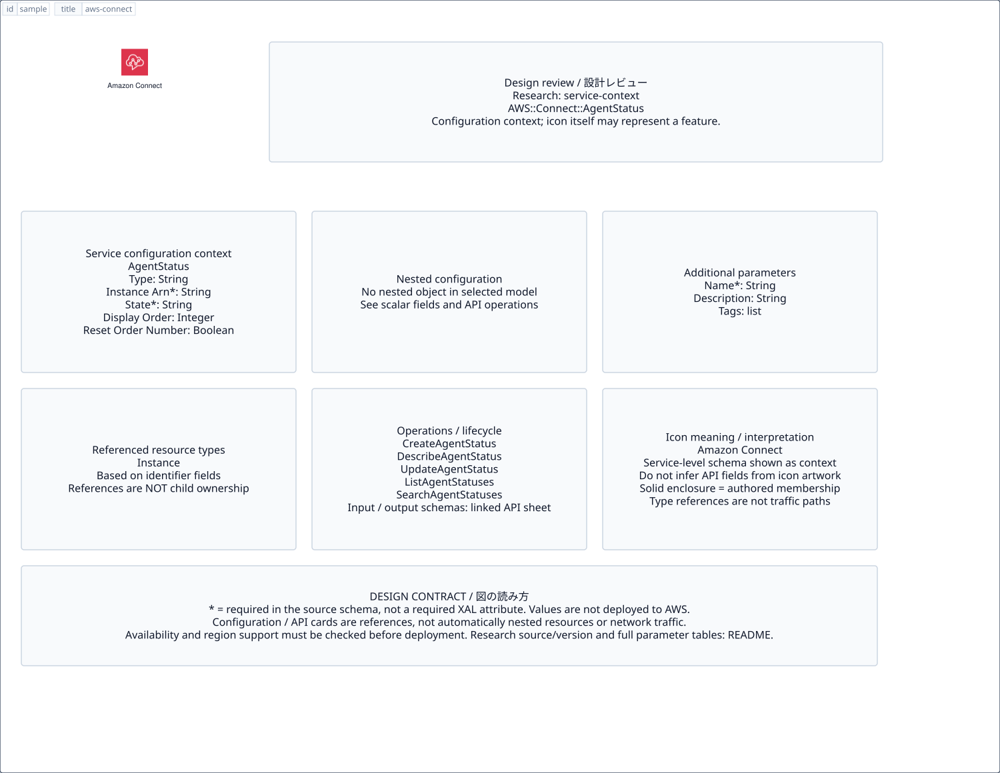

# `aws-connect` — Amazon Connect

[SVG preview](sample.svg) · [Editable XAL](sample.xal) · [Catalog](../README.md)



AWS service icon. Use a label and explicit annotations to describe its role; scope is selected by the author.

- Kind: `service`; category: Business Applications.
- Diagram scope: `service` (recommendation, not AWS deployment validation).
- Default catalog ID: 366. Covered catalog IDs: 324, 338, 352, 366.
- Implementation: V1 and V2; fixed AWS icon with a wrapped label and explicit functional annotations.

## Parameters

`id` is a required, unique connection ID, not a catalog number. `label`/`title`/`name` override the label; an empty label hides it. `size` > 0 defaults to 48 px. `label-width` > 0 defaults to 160 px (default box width, at least icon size + 12 px). Explicit `width`/`height` must contain the icon and label. `visible="false"` hides it. Children and icon overrides are not supported; use a group for containment.

`detail` adds a free-form diagram annotation. `show-details="false"` hides annotation text. Only supplied values are shown; none are sent to AWS. Service/resource annotations appear on separate wrapped lines.

| Parameter | Type | Meaning | Example |
|---|---|---|---|
| `role` | text | Architectural role annotation | `Application component` |

## Review notes

The catalog provides a baseline for per-component development, not a simulation of the AWS control plane. This component's current functional parameters are the ones listed above. Additional service-specific visual behavior can be developed here without replacing catalog IDs in diagrams. Edit `sample.xal`, then run:

```sh
npm run generate:aws-samples -- --render --tag=aws-connect
```

<!-- aws-functional-research:start -->
## 機能調査・構成デザイン（2026-09-06）

分類: `service-context`。サービス文脈: [`aws-connect`](../aws-connect/README.md)。

サンプルはアイコンと、設定・内包構造・関連リソース・操作を分離したレビューシートです。設定カードは編集可能な `rectangle`、グループは既存の専用タグで実装しています。カードのフィールド名を新しい XAL 属性として受理するわけではありません。専用タグが受理する属性は上の Parameters 表を参照してください。

実線の通信と、設定の参照・同じサービスに属する型一覧を区別します。スキーマの必須項目は AWS 側の仕様であり、図の必須入力ではありません。記載の構成モデル/API は取り込んだ公式資料の範囲であり、全リージョン・全機能の完全性や稼働可否を保証しません。

**重要:** このアイコンに対応する独立した構成リソースを断定せず、所属サービスの構成モデルを参考表示しています。アイコン名や絵柄から属性・親子関係・通信を推測しません。

### 構成モデル: `AWS::Connect::AgentStatus`

[公式リファレンス](https://docs.aws.amazon.com/AWSCloudFormation/latest/UserGuide/aws-resource-connect-agentstatus.html)。全 8 プロパティを型付きで列挙します（表示カードには主要項目のみ）。

| Field | Type | Required in AWS schema |
|---|---|---|
| [Description](https://docs.aws.amazon.com/AWSCloudFormation/latest/UserGuide/aws-resource-connect-agentstatus.html#cfn-connect-agentstatus-description) | `String` | no |
| [DisplayOrder](https://docs.aws.amazon.com/AWSCloudFormation/latest/UserGuide/aws-resource-connect-agentstatus.html#cfn-connect-agentstatus-displayorder) | `Integer` | no |
| [InstanceArn](https://docs.aws.amazon.com/AWSCloudFormation/latest/UserGuide/aws-resource-connect-agentstatus.html#cfn-connect-agentstatus-instancearn) | `String` | yes |
| [Name](https://docs.aws.amazon.com/AWSCloudFormation/latest/UserGuide/aws-resource-connect-agentstatus.html#cfn-connect-agentstatus-name) | `String` | yes |
| [ResetOrderNumber](https://docs.aws.amazon.com/AWSCloudFormation/latest/UserGuide/aws-resource-connect-agentstatus.html#cfn-connect-agentstatus-resetordernumber) | `Boolean` | no |
| [State](https://docs.aws.amazon.com/AWSCloudFormation/latest/UserGuide/aws-resource-connect-agentstatus.html#cfn-connect-agentstatus-state) | `String` | yes |
| [Tags](https://docs.aws.amazon.com/AWSCloudFormation/latest/UserGuide/aws-resource-connect-agentstatus.html#cfn-connect-agentstatus-tags) | `List<Tag>` | no |
| [Type](https://docs.aws.amazon.com/AWSCloudFormation/latest/UserGuide/aws-resource-connect-agentstatus.html#cfn-connect-agentstatus-type) | `String` | no |

### 関連する構成リソース（37 型）

同じサービス文脈の型一覧です。すべてがこのアイコンの子リソースという意味ではありません。さらに深い入れ子は [公式スキーマのスナップショット](../research/cloudformation-models.json) に記録しています。

- [AWS::Connect::AgentStatus](https://docs.aws.amazon.com/AWSCloudFormation/latest/UserGuide/aws-resource-connect-agentstatus.html)
- [AWS::Connect::ApprovedOrigin](https://docs.aws.amazon.com/AWSCloudFormation/latest/UserGuide/aws-resource-connect-approvedorigin.html)
- [AWS::Connect::ContactFlow](https://docs.aws.amazon.com/AWSCloudFormation/latest/UserGuide/aws-resource-connect-contactflow.html)
- [AWS::Connect::ContactFlowModule](https://docs.aws.amazon.com/AWSCloudFormation/latest/UserGuide/aws-resource-connect-contactflowmodule.html)
- [AWS::Connect::ContactFlowModuleAlias](https://docs.aws.amazon.com/AWSCloudFormation/latest/UserGuide/aws-resource-connect-contactflowmodulealias.html)
- [AWS::Connect::ContactFlowModuleVersion](https://docs.aws.amazon.com/AWSCloudFormation/latest/UserGuide/aws-resource-connect-contactflowmoduleversion.html)
- [AWS::Connect::ContactFlowVersion](https://docs.aws.amazon.com/AWSCloudFormation/latest/UserGuide/aws-resource-connect-contactflowversion.html)
- [AWS::Connect::DataLakeAssociation](https://docs.aws.amazon.com/AWSCloudFormation/latest/UserGuide/aws-resource-connect-datalakeassociation.html)
- [AWS::Connect::DataTable](https://docs.aws.amazon.com/AWSCloudFormation/latest/UserGuide/aws-resource-connect-datatable.html)
- [AWS::Connect::DataTableAttribute](https://docs.aws.amazon.com/AWSCloudFormation/latest/UserGuide/aws-resource-connect-datatableattribute.html)
- [AWS::Connect::DataTableRecord](https://docs.aws.amazon.com/AWSCloudFormation/latest/UserGuide/aws-resource-connect-datatablerecord.html)
- [AWS::Connect::EmailAddress](https://docs.aws.amazon.com/AWSCloudFormation/latest/UserGuide/aws-resource-connect-emailaddress.html)
- [AWS::Connect::EvaluationForm](https://docs.aws.amazon.com/AWSCloudFormation/latest/UserGuide/aws-resource-connect-evaluationform.html)
- [AWS::Connect::HoursOfOperation](https://docs.aws.amazon.com/AWSCloudFormation/latest/UserGuide/aws-resource-connect-hoursofoperation.html)
- [AWS::Connect::Instance](https://docs.aws.amazon.com/AWSCloudFormation/latest/UserGuide/aws-resource-connect-instance.html)
- [AWS::Connect::InstanceStorageConfig](https://docs.aws.amazon.com/AWSCloudFormation/latest/UserGuide/aws-resource-connect-instancestorageconfig.html)
- [AWS::Connect::IntegrationAssociation](https://docs.aws.amazon.com/AWSCloudFormation/latest/UserGuide/aws-resource-connect-integrationassociation.html)
- [AWS::Connect::Metric](https://docs.aws.amazon.com/AWSCloudFormation/latest/UserGuide/aws-resource-connect-metric.html)
- [AWS::Connect::Notification](https://docs.aws.amazon.com/AWSCloudFormation/latest/UserGuide/aws-resource-connect-notification.html)
- [AWS::Connect::PhoneNumber](https://docs.aws.amazon.com/AWSCloudFormation/latest/UserGuide/aws-resource-connect-phonenumber.html)
- [AWS::Connect::PredefinedAttribute](https://docs.aws.amazon.com/AWSCloudFormation/latest/UserGuide/aws-resource-connect-predefinedattribute.html)
- [AWS::Connect::Prompt](https://docs.aws.amazon.com/AWSCloudFormation/latest/UserGuide/aws-resource-connect-prompt.html)
- [AWS::Connect::Queue](https://docs.aws.amazon.com/AWSCloudFormation/latest/UserGuide/aws-resource-connect-queue.html)
- [AWS::Connect::QuickConnect](https://docs.aws.amazon.com/AWSCloudFormation/latest/UserGuide/aws-resource-connect-quickconnect.html)
- [AWS::Connect::RoutingProfile](https://docs.aws.amazon.com/AWSCloudFormation/latest/UserGuide/aws-resource-connect-routingprofile.html)
- [AWS::Connect::Rule](https://docs.aws.amazon.com/AWSCloudFormation/latest/UserGuide/aws-resource-connect-rule.html)
- [AWS::Connect::SecurityKey](https://docs.aws.amazon.com/AWSCloudFormation/latest/UserGuide/aws-resource-connect-securitykey.html)
- [AWS::Connect::SecurityProfile](https://docs.aws.amazon.com/AWSCloudFormation/latest/UserGuide/aws-resource-connect-securityprofile.html)
- [AWS::Connect::TaskTemplate](https://docs.aws.amazon.com/AWSCloudFormation/latest/UserGuide/aws-resource-connect-tasktemplate.html)
- [AWS::Connect::TestCase](https://docs.aws.amazon.com/AWSCloudFormation/latest/UserGuide/aws-resource-connect-testcase.html)
- [AWS::Connect::TrafficDistributionGroup](https://docs.aws.amazon.com/AWSCloudFormation/latest/UserGuide/aws-resource-connect-trafficdistributiongroup.html)
- [AWS::Connect::User](https://docs.aws.amazon.com/AWSCloudFormation/latest/UserGuide/aws-resource-connect-user.html)
- [AWS::Connect::UserHierarchyGroup](https://docs.aws.amazon.com/AWSCloudFormation/latest/UserGuide/aws-resource-connect-userhierarchygroup.html)
- [AWS::Connect::UserHierarchyStructure](https://docs.aws.amazon.com/AWSCloudFormation/latest/UserGuide/aws-resource-connect-userhierarchystructure.html)
- [AWS::Connect::View](https://docs.aws.amazon.com/AWSCloudFormation/latest/UserGuide/aws-resource-connect-view.html)
- [AWS::Connect::ViewVersion](https://docs.aws.amazon.com/AWSCloudFormation/latest/UserGuide/aws-resource-connect-viewversion.html)
- [AWS::Connect::Workspace](https://docs.aws.amazon.com/AWSCloudFormation/latest/UserGuide/aws-resource-connect-workspace.html)

### API の操作・パラメータ

- [Amazon Connect Service: 395 操作の入力・出力一覧](../research/api/connect.md)（API version 2017-08-08）

### 出典・調査範囲

- [公式資料 1](https://docs.aws.amazon.com/AWSCloudFormation/latest/UserGuide/aws-resource-connect-agentstatus.html)
- [公式資料 2](https://github.com/boto/botocore/blob/develop/botocore/data/connect/2017-08-08/service-2.json)

CloudFormation 仕様 263.0.0、AWS SDK 431 サービスモデルをオフラインで参照。取得日・元データの SHA-256 は [調査マニフェスト](../research/README.md) を参照。API モデル名・フィールド名は仕様から抽出し、説明本文を転載していません。利用可能性は全サービス一律には確認できないため、提供終了の確認がないものも「現在利用可能」と断定していません。

### 次の部品レビュー

- 本アイコンが独立したリソースか、機能・状態・デバイスの記号かを確認する。
- 詳細カードのうち専用の子タグ・参照属性として実装する範囲を選ぶ。
- 通信、制御、認証、監視の関係を分け、必要な接続点・配置制約を確認する。
- 編集後は `npm run generate:aws-samples -- --render --tag=aws-connect`。通常の再描画は XAL/README を上書きしない。
<!-- aws-functional-research:end -->
