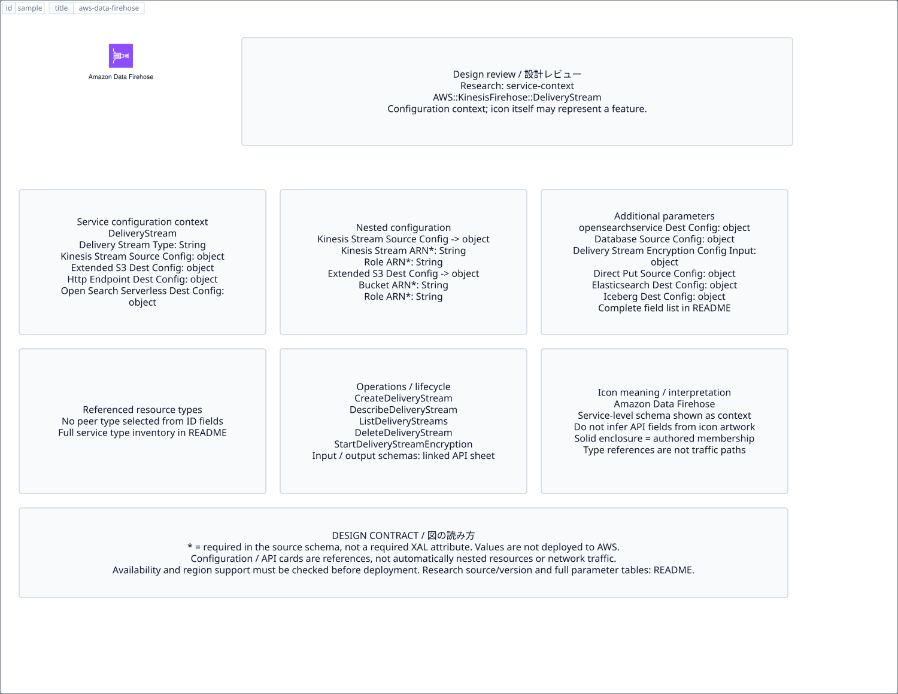

# `aws-data-firehose` — Amazon Data Firehose

[SVG preview](sample.svg) · [Editable XAL](sample.xal) · [Catalog](../README.md)



AWS service icon. Use a label and explicit annotations to describe its role; scope is selected by the author.

- Kind: `service`; category: Analytics.
- Diagram scope: `service` (recommendation, not AWS deployment validation).
- Default catalog ID: 1152. Covered catalog IDs: 1089, 1110, 1131, 1152.
- Implementation: V1 and V2; fixed AWS icon with a wrapped label and explicit functional annotations.

## Parameters

`id` is a required, unique connection ID, not a catalog number. `label`/`title`/`name` override the label; an empty label hides it. `size` > 0 defaults to 48 px. `label-width` > 0 defaults to 160 px (default box width, at least icon size + 12 px). Explicit `width`/`height` must contain the icon and label. `visible="false"` hides it. Children and icon overrides are not supported; use a group for containment.

`detail` adds a free-form diagram annotation. `show-details="false"` hides annotation text. Only supplied values are shown; none are sent to AWS. Service/resource annotations appear on separate wrapped lines.

| Parameter | Type | Meaning | Example |
|---|---|---|---|
| `input` | text | Input data annotation | `Application events` |
| `output` | text | Output data annotation | `Insights` |

## Review notes

The catalog provides a baseline for per-component development, not a simulation of the AWS control plane. This component's current functional parameters are the ones listed above. Additional service-specific visual behavior can be developed here without replacing catalog IDs in diagrams. Edit `sample.xal`, then run:

```sh
npm run generate:aws-samples -- --render --tag=aws-data-firehose
```

<!-- aws-functional-research:start -->
## 機能調査・構成デザイン（2026-09-06）

分類: `service-context`。サービス文脈: [`aws-data-firehose`](../aws-data-firehose/README.md)。

サンプルはアイコンと、設定・内包構造・関連リソース・操作を分離したレビューシートです。設定カードは編集可能な `rectangle`、グループは既存の専用タグで実装しています。カードのフィールド名を新しい XAL 属性として受理するわけではありません。専用タグが受理する属性は上の Parameters 表を参照してください。

実線の通信と、設定の参照・同じサービスに属する型一覧を区別します。スキーマの必須項目は AWS 側の仕様であり、図の必須入力ではありません。記載の構成モデル/API は取り込んだ公式資料の範囲であり、全リージョン・全機能の完全性や稼働可否を保証しません。

**重要:** このアイコンに対応する独立した構成リソースを断定せず、所属サービスの構成モデルを参考表示しています。アイコン名や絵柄から属性・親子関係・通信を推測しません。

### 構成モデル: `AWS::KinesisFirehose::DeliveryStream`

[公式リファレンス](https://docs.aws.amazon.com/AWSCloudFormation/latest/UserGuide/aws-resource-kinesisfirehose-deliverystream.html)。全 18 プロパティを型付きで列挙します（表示カードには主要項目のみ）。

| Field | Type | Required in AWS schema |
|---|---|---|
| [AmazonOpenSearchServerlessDestinationConfiguration](https://docs.aws.amazon.com/AWSCloudFormation/latest/UserGuide/aws-resource-kinesisfirehose-deliverystream.html#cfn-kinesisfirehose-deliverystream-amazonopensearchserverlessdestinationconfiguration) | `AmazonOpenSearchServerlessDestinationConfiguration` | no |
| [AmazonopensearchserviceDestinationConfiguration](https://docs.aws.amazon.com/AWSCloudFormation/latest/UserGuide/aws-resource-kinesisfirehose-deliverystream.html#cfn-kinesisfirehose-deliverystream-amazonopensearchservicedestinationconfiguration) | `AmazonopensearchserviceDestinationConfiguration` | no |
| [DatabaseSourceConfiguration](https://docs.aws.amazon.com/AWSCloudFormation/latest/UserGuide/aws-resource-kinesisfirehose-deliverystream.html#cfn-kinesisfirehose-deliverystream-databasesourceconfiguration) | `DatabaseSourceConfiguration` | no |
| [DeliveryStreamEncryptionConfigurationInput](https://docs.aws.amazon.com/AWSCloudFormation/latest/UserGuide/aws-resource-kinesisfirehose-deliverystream.html#cfn-kinesisfirehose-deliverystream-deliverystreamencryptionconfigurationinput) | `DeliveryStreamEncryptionConfigurationInput` | no |
| [DeliveryStreamName](https://docs.aws.amazon.com/AWSCloudFormation/latest/UserGuide/aws-resource-kinesisfirehose-deliverystream.html#cfn-kinesisfirehose-deliverystream-deliverystreamname) | `String` | no |
| [DeliveryStreamType](https://docs.aws.amazon.com/AWSCloudFormation/latest/UserGuide/aws-resource-kinesisfirehose-deliverystream.html#cfn-kinesisfirehose-deliverystream-deliverystreamtype) | `String` | no |
| [DirectPutSourceConfiguration](https://docs.aws.amazon.com/AWSCloudFormation/latest/UserGuide/aws-resource-kinesisfirehose-deliverystream.html#cfn-kinesisfirehose-deliverystream-directputsourceconfiguration) | `DirectPutSourceConfiguration` | no |
| [ElasticsearchDestinationConfiguration](https://docs.aws.amazon.com/AWSCloudFormation/latest/UserGuide/aws-resource-kinesisfirehose-deliverystream.html#cfn-kinesisfirehose-deliverystream-elasticsearchdestinationconfiguration) | `ElasticsearchDestinationConfiguration` | no |
| [ExtendedS3DestinationConfiguration](https://docs.aws.amazon.com/AWSCloudFormation/latest/UserGuide/aws-resource-kinesisfirehose-deliverystream.html#cfn-kinesisfirehose-deliverystream-extendeds3destinationconfiguration) | `ExtendedS3DestinationConfiguration` | no |
| [HttpEndpointDestinationConfiguration](https://docs.aws.amazon.com/AWSCloudFormation/latest/UserGuide/aws-resource-kinesisfirehose-deliverystream.html#cfn-kinesisfirehose-deliverystream-httpendpointdestinationconfiguration) | `HttpEndpointDestinationConfiguration` | no |
| [IcebergDestinationConfiguration](https://docs.aws.amazon.com/AWSCloudFormation/latest/UserGuide/aws-resource-kinesisfirehose-deliverystream.html#cfn-kinesisfirehose-deliverystream-icebergdestinationconfiguration) | `IcebergDestinationConfiguration` | no |
| [KinesisStreamSourceConfiguration](https://docs.aws.amazon.com/AWSCloudFormation/latest/UserGuide/aws-resource-kinesisfirehose-deliverystream.html#cfn-kinesisfirehose-deliverystream-kinesisstreamsourceconfiguration) | `KinesisStreamSourceConfiguration` | no |
| [MSKSourceConfiguration](https://docs.aws.amazon.com/AWSCloudFormation/latest/UserGuide/aws-resource-kinesisfirehose-deliverystream.html#cfn-kinesisfirehose-deliverystream-msksourceconfiguration) | `MSKSourceConfiguration` | no |
| [RedshiftDestinationConfiguration](https://docs.aws.amazon.com/AWSCloudFormation/latest/UserGuide/aws-resource-kinesisfirehose-deliverystream.html#cfn-kinesisfirehose-deliverystream-redshiftdestinationconfiguration) | `RedshiftDestinationConfiguration` | no |
| [S3DestinationConfiguration](https://docs.aws.amazon.com/AWSCloudFormation/latest/UserGuide/aws-resource-kinesisfirehose-deliverystream.html#cfn-kinesisfirehose-deliverystream-s3destinationconfiguration) | `S3DestinationConfiguration` | no |
| [SnowflakeDestinationConfiguration](https://docs.aws.amazon.com/AWSCloudFormation/latest/UserGuide/aws-resource-kinesisfirehose-deliverystream.html#cfn-kinesisfirehose-deliverystream-snowflakedestinationconfiguration) | `SnowflakeDestinationConfiguration` | no |
| [SplunkDestinationConfiguration](https://docs.aws.amazon.com/AWSCloudFormation/latest/UserGuide/aws-resource-kinesisfirehose-deliverystream.html#cfn-kinesisfirehose-deliverystream-splunkdestinationconfiguration) | `SplunkDestinationConfiguration` | no |
| [Tags](https://docs.aws.amazon.com/AWSCloudFormation/latest/UserGuide/aws-resource-kinesisfirehose-deliverystream.html#cfn-kinesisfirehose-deliverystream-tags) | `List<Tag>` | no |

#### KinesisStreamSourceConfiguration → `AWS::KinesisFirehose::DeliveryStream.KinesisStreamSourceConfiguration`

| Field | Type | Required in AWS schema |
|---|---|---|
| [KinesisStreamARN](https://docs.aws.amazon.com/AWSCloudFormation/latest/UserGuide/aws-properties-kinesisfirehose-deliverystream-kinesisstreamsourceconfiguration.html#cfn-kinesisfirehose-deliverystream-kinesisstreamsourceconfiguration-kinesisstreamarn) | `String` | yes |
| [RoleARN](https://docs.aws.amazon.com/AWSCloudFormation/latest/UserGuide/aws-properties-kinesisfirehose-deliverystream-kinesisstreamsourceconfiguration.html#cfn-kinesisfirehose-deliverystream-kinesisstreamsourceconfiguration-rolearn) | `String` | yes |

#### ExtendedS3DestinationConfiguration → `AWS::KinesisFirehose::DeliveryStream.ExtendedS3DestinationConfiguration`

| Field | Type | Required in AWS schema |
|---|---|---|
| [BucketARN](https://docs.aws.amazon.com/AWSCloudFormation/latest/UserGuide/aws-properties-kinesisfirehose-deliverystream-extendeds3destinationconfiguration.html#cfn-kinesisfirehose-deliverystream-extendeds3destinationconfiguration-bucketarn) | `String` | yes |
| [BufferingHints](https://docs.aws.amazon.com/AWSCloudFormation/latest/UserGuide/aws-properties-kinesisfirehose-deliverystream-extendeds3destinationconfiguration.html#cfn-kinesisfirehose-deliverystream-extendeds3destinationconfiguration-bufferinghints) | `BufferingHints` | no |
| [CloudWatchLoggingOptions](https://docs.aws.amazon.com/AWSCloudFormation/latest/UserGuide/aws-properties-kinesisfirehose-deliverystream-extendeds3destinationconfiguration.html#cfn-kinesisfirehose-deliverystream-extendeds3destinationconfiguration-cloudwatchloggingoptions) | `CloudWatchLoggingOptions` | no |
| [CompressionFormat](https://docs.aws.amazon.com/AWSCloudFormation/latest/UserGuide/aws-properties-kinesisfirehose-deliverystream-extendeds3destinationconfiguration.html#cfn-kinesisfirehose-deliverystream-extendeds3destinationconfiguration-compressionformat) | `String` | no |
| [CustomTimeZone](https://docs.aws.amazon.com/AWSCloudFormation/latest/UserGuide/aws-properties-kinesisfirehose-deliverystream-extendeds3destinationconfiguration.html#cfn-kinesisfirehose-deliverystream-extendeds3destinationconfiguration-customtimezone) | `String` | no |
| [DataFormatConversionConfiguration](https://docs.aws.amazon.com/AWSCloudFormation/latest/UserGuide/aws-properties-kinesisfirehose-deliverystream-extendeds3destinationconfiguration.html#cfn-kinesisfirehose-deliverystream-extendeds3destinationconfiguration-dataformatconversionconfiguration) | `DataFormatConversionConfiguration` | no |
| [DynamicPartitioningConfiguration](https://docs.aws.amazon.com/AWSCloudFormation/latest/UserGuide/aws-properties-kinesisfirehose-deliverystream-extendeds3destinationconfiguration.html#cfn-kinesisfirehose-deliverystream-extendeds3destinationconfiguration-dynamicpartitioningconfiguration) | `DynamicPartitioningConfiguration` | no |
| [EncryptionConfiguration](https://docs.aws.amazon.com/AWSCloudFormation/latest/UserGuide/aws-properties-kinesisfirehose-deliverystream-extendeds3destinationconfiguration.html#cfn-kinesisfirehose-deliverystream-extendeds3destinationconfiguration-encryptionconfiguration) | `EncryptionConfiguration` | no |
| [ErrorOutputPrefix](https://docs.aws.amazon.com/AWSCloudFormation/latest/UserGuide/aws-properties-kinesisfirehose-deliverystream-extendeds3destinationconfiguration.html#cfn-kinesisfirehose-deliverystream-extendeds3destinationconfiguration-erroroutputprefix) | `String` | no |
| [FileExtension](https://docs.aws.amazon.com/AWSCloudFormation/latest/UserGuide/aws-properties-kinesisfirehose-deliverystream-extendeds3destinationconfiguration.html#cfn-kinesisfirehose-deliverystream-extendeds3destinationconfiguration-fileextension) | `String` | no |
| [Prefix](https://docs.aws.amazon.com/AWSCloudFormation/latest/UserGuide/aws-properties-kinesisfirehose-deliverystream-extendeds3destinationconfiguration.html#cfn-kinesisfirehose-deliverystream-extendeds3destinationconfiguration-prefix) | `String` | no |
| [ProcessingConfiguration](https://docs.aws.amazon.com/AWSCloudFormation/latest/UserGuide/aws-properties-kinesisfirehose-deliverystream-extendeds3destinationconfiguration.html#cfn-kinesisfirehose-deliverystream-extendeds3destinationconfiguration-processingconfiguration) | `ProcessingConfiguration` | no |
| [RoleARN](https://docs.aws.amazon.com/AWSCloudFormation/latest/UserGuide/aws-properties-kinesisfirehose-deliverystream-extendeds3destinationconfiguration.html#cfn-kinesisfirehose-deliverystream-extendeds3destinationconfiguration-rolearn) | `String` | yes |
| [S3BackupConfiguration](https://docs.aws.amazon.com/AWSCloudFormation/latest/UserGuide/aws-properties-kinesisfirehose-deliverystream-extendeds3destinationconfiguration.html#cfn-kinesisfirehose-deliverystream-extendeds3destinationconfiguration-s3backupconfiguration) | `S3DestinationConfiguration` | no |
| [S3BackupMode](https://docs.aws.amazon.com/AWSCloudFormation/latest/UserGuide/aws-properties-kinesisfirehose-deliverystream-extendeds3destinationconfiguration.html#cfn-kinesisfirehose-deliverystream-extendeds3destinationconfiguration-s3backupmode) | `String` | no |

#### HttpEndpointDestinationConfiguration → `AWS::KinesisFirehose::DeliveryStream.HttpEndpointDestinationConfiguration`

| Field | Type | Required in AWS schema |
|---|---|---|
| [BufferingHints](https://docs.aws.amazon.com/AWSCloudFormation/latest/UserGuide/aws-properties-kinesisfirehose-deliverystream-httpendpointdestinationconfiguration.html#cfn-kinesisfirehose-deliverystream-httpendpointdestinationconfiguration-bufferinghints) | `BufferingHints` | no |
| [CloudWatchLoggingOptions](https://docs.aws.amazon.com/AWSCloudFormation/latest/UserGuide/aws-properties-kinesisfirehose-deliverystream-httpendpointdestinationconfiguration.html#cfn-kinesisfirehose-deliverystream-httpendpointdestinationconfiguration-cloudwatchloggingoptions) | `CloudWatchLoggingOptions` | no |
| [EndpointConfiguration](https://docs.aws.amazon.com/AWSCloudFormation/latest/UserGuide/aws-properties-kinesisfirehose-deliverystream-httpendpointdestinationconfiguration.html#cfn-kinesisfirehose-deliverystream-httpendpointdestinationconfiguration-endpointconfiguration) | `HttpEndpointConfiguration` | yes |
| [ProcessingConfiguration](https://docs.aws.amazon.com/AWSCloudFormation/latest/UserGuide/aws-properties-kinesisfirehose-deliverystream-httpendpointdestinationconfiguration.html#cfn-kinesisfirehose-deliverystream-httpendpointdestinationconfiguration-processingconfiguration) | `ProcessingConfiguration` | no |
| [RequestConfiguration](https://docs.aws.amazon.com/AWSCloudFormation/latest/UserGuide/aws-properties-kinesisfirehose-deliverystream-httpendpointdestinationconfiguration.html#cfn-kinesisfirehose-deliverystream-httpendpointdestinationconfiguration-requestconfiguration) | `HttpEndpointRequestConfiguration` | no |
| [RetryOptions](https://docs.aws.amazon.com/AWSCloudFormation/latest/UserGuide/aws-properties-kinesisfirehose-deliverystream-httpendpointdestinationconfiguration.html#cfn-kinesisfirehose-deliverystream-httpendpointdestinationconfiguration-retryoptions) | `RetryOptions` | no |
| [RoleARN](https://docs.aws.amazon.com/AWSCloudFormation/latest/UserGuide/aws-properties-kinesisfirehose-deliverystream-httpendpointdestinationconfiguration.html#cfn-kinesisfirehose-deliverystream-httpendpointdestinationconfiguration-rolearn) | `String` | no |
| [S3BackupMode](https://docs.aws.amazon.com/AWSCloudFormation/latest/UserGuide/aws-properties-kinesisfirehose-deliverystream-httpendpointdestinationconfiguration.html#cfn-kinesisfirehose-deliverystream-httpendpointdestinationconfiguration-s3backupmode) | `String` | no |
| [S3Configuration](https://docs.aws.amazon.com/AWSCloudFormation/latest/UserGuide/aws-properties-kinesisfirehose-deliverystream-httpendpointdestinationconfiguration.html#cfn-kinesisfirehose-deliverystream-httpendpointdestinationconfiguration-s3configuration) | `S3DestinationConfiguration` | yes |
| [SecretsManagerConfiguration](https://docs.aws.amazon.com/AWSCloudFormation/latest/UserGuide/aws-properties-kinesisfirehose-deliverystream-httpendpointdestinationconfiguration.html#cfn-kinesisfirehose-deliverystream-httpendpointdestinationconfiguration-secretsmanagerconfiguration) | `SecretsManagerConfiguration` | no |

#### AmazonOpenSearchServerlessDestinationConfiguration → `AWS::KinesisFirehose::DeliveryStream.AmazonOpenSearchServerlessDestinationConfiguration`

| Field | Type | Required in AWS schema |
|---|---|---|
| [BufferingHints](https://docs.aws.amazon.com/AWSCloudFormation/latest/UserGuide/aws-properties-kinesisfirehose-deliverystream-amazonopensearchserverlessdestinationconfiguration.html#cfn-kinesisfirehose-deliverystream-amazonopensearchserverlessdestinationconfiguration-bufferinghints) | `AmazonOpenSearchServerlessBufferingHints` | no |
| [CloudWatchLoggingOptions](https://docs.aws.amazon.com/AWSCloudFormation/latest/UserGuide/aws-properties-kinesisfirehose-deliverystream-amazonopensearchserverlessdestinationconfiguration.html#cfn-kinesisfirehose-deliverystream-amazonopensearchserverlessdestinationconfiguration-cloudwatchloggingoptions) | `CloudWatchLoggingOptions` | no |
| [CollectionEndpoint](https://docs.aws.amazon.com/AWSCloudFormation/latest/UserGuide/aws-properties-kinesisfirehose-deliverystream-amazonopensearchserverlessdestinationconfiguration.html#cfn-kinesisfirehose-deliverystream-amazonopensearchserverlessdestinationconfiguration-collectionendpoint) | `String` | no |
| [IndexName](https://docs.aws.amazon.com/AWSCloudFormation/latest/UserGuide/aws-properties-kinesisfirehose-deliverystream-amazonopensearchserverlessdestinationconfiguration.html#cfn-kinesisfirehose-deliverystream-amazonopensearchserverlessdestinationconfiguration-indexname) | `String` | yes |
| [ProcessingConfiguration](https://docs.aws.amazon.com/AWSCloudFormation/latest/UserGuide/aws-properties-kinesisfirehose-deliverystream-amazonopensearchserverlessdestinationconfiguration.html#cfn-kinesisfirehose-deliverystream-amazonopensearchserverlessdestinationconfiguration-processingconfiguration) | `ProcessingConfiguration` | no |
| [RetryOptions](https://docs.aws.amazon.com/AWSCloudFormation/latest/UserGuide/aws-properties-kinesisfirehose-deliverystream-amazonopensearchserverlessdestinationconfiguration.html#cfn-kinesisfirehose-deliverystream-amazonopensearchserverlessdestinationconfiguration-retryoptions) | `AmazonOpenSearchServerlessRetryOptions` | no |
| [RoleARN](https://docs.aws.amazon.com/AWSCloudFormation/latest/UserGuide/aws-properties-kinesisfirehose-deliverystream-amazonopensearchserverlessdestinationconfiguration.html#cfn-kinesisfirehose-deliverystream-amazonopensearchserverlessdestinationconfiguration-rolearn) | `String` | yes |
| [S3BackupMode](https://docs.aws.amazon.com/AWSCloudFormation/latest/UserGuide/aws-properties-kinesisfirehose-deliverystream-amazonopensearchserverlessdestinationconfiguration.html#cfn-kinesisfirehose-deliverystream-amazonopensearchserverlessdestinationconfiguration-s3backupmode) | `String` | no |
| [S3Configuration](https://docs.aws.amazon.com/AWSCloudFormation/latest/UserGuide/aws-properties-kinesisfirehose-deliverystream-amazonopensearchserverlessdestinationconfiguration.html#cfn-kinesisfirehose-deliverystream-amazonopensearchserverlessdestinationconfiguration-s3configuration) | `S3DestinationConfiguration` | yes |
| [VpcConfiguration](https://docs.aws.amazon.com/AWSCloudFormation/latest/UserGuide/aws-properties-kinesisfirehose-deliverystream-amazonopensearchserverlessdestinationconfiguration.html#cfn-kinesisfirehose-deliverystream-amazonopensearchserverlessdestinationconfiguration-vpcconfiguration) | `VpcConfiguration` | no |

#### AmazonopensearchserviceDestinationConfiguration → `AWS::KinesisFirehose::DeliveryStream.AmazonopensearchserviceDestinationConfiguration`

| Field | Type | Required in AWS schema |
|---|---|---|
| [BufferingHints](https://docs.aws.amazon.com/AWSCloudFormation/latest/UserGuide/aws-properties-kinesisfirehose-deliverystream-amazonopensearchservicedestinationconfiguration.html#cfn-kinesisfirehose-deliverystream-amazonopensearchservicedestinationconfiguration-bufferinghints) | `AmazonopensearchserviceBufferingHints` | no |
| [CloudWatchLoggingOptions](https://docs.aws.amazon.com/AWSCloudFormation/latest/UserGuide/aws-properties-kinesisfirehose-deliverystream-amazonopensearchservicedestinationconfiguration.html#cfn-kinesisfirehose-deliverystream-amazonopensearchservicedestinationconfiguration-cloudwatchloggingoptions) | `CloudWatchLoggingOptions` | no |
| [ClusterEndpoint](https://docs.aws.amazon.com/AWSCloudFormation/latest/UserGuide/aws-properties-kinesisfirehose-deliverystream-amazonopensearchservicedestinationconfiguration.html#cfn-kinesisfirehose-deliverystream-amazonopensearchservicedestinationconfiguration-clusterendpoint) | `String` | no |
| [DocumentIdOptions](https://docs.aws.amazon.com/AWSCloudFormation/latest/UserGuide/aws-properties-kinesisfirehose-deliverystream-amazonopensearchservicedestinationconfiguration.html#cfn-kinesisfirehose-deliverystream-amazonopensearchservicedestinationconfiguration-documentidoptions) | `DocumentIdOptions` | no |
| [DomainARN](https://docs.aws.amazon.com/AWSCloudFormation/latest/UserGuide/aws-properties-kinesisfirehose-deliverystream-amazonopensearchservicedestinationconfiguration.html#cfn-kinesisfirehose-deliverystream-amazonopensearchservicedestinationconfiguration-domainarn) | `String` | no |
| [IndexName](https://docs.aws.amazon.com/AWSCloudFormation/latest/UserGuide/aws-properties-kinesisfirehose-deliverystream-amazonopensearchservicedestinationconfiguration.html#cfn-kinesisfirehose-deliverystream-amazonopensearchservicedestinationconfiguration-indexname) | `String` | yes |
| [IndexRotationPeriod](https://docs.aws.amazon.com/AWSCloudFormation/latest/UserGuide/aws-properties-kinesisfirehose-deliverystream-amazonopensearchservicedestinationconfiguration.html#cfn-kinesisfirehose-deliverystream-amazonopensearchservicedestinationconfiguration-indexrotationperiod) | `String` | no |
| [ProcessingConfiguration](https://docs.aws.amazon.com/AWSCloudFormation/latest/UserGuide/aws-properties-kinesisfirehose-deliverystream-amazonopensearchservicedestinationconfiguration.html#cfn-kinesisfirehose-deliverystream-amazonopensearchservicedestinationconfiguration-processingconfiguration) | `ProcessingConfiguration` | no |
| [RetryOptions](https://docs.aws.amazon.com/AWSCloudFormation/latest/UserGuide/aws-properties-kinesisfirehose-deliverystream-amazonopensearchservicedestinationconfiguration.html#cfn-kinesisfirehose-deliverystream-amazonopensearchservicedestinationconfiguration-retryoptions) | `AmazonopensearchserviceRetryOptions` | no |
| [RoleARN](https://docs.aws.amazon.com/AWSCloudFormation/latest/UserGuide/aws-properties-kinesisfirehose-deliverystream-amazonopensearchservicedestinationconfiguration.html#cfn-kinesisfirehose-deliverystream-amazonopensearchservicedestinationconfiguration-rolearn) | `String` | yes |
| [S3BackupMode](https://docs.aws.amazon.com/AWSCloudFormation/latest/UserGuide/aws-properties-kinesisfirehose-deliverystream-amazonopensearchservicedestinationconfiguration.html#cfn-kinesisfirehose-deliverystream-amazonopensearchservicedestinationconfiguration-s3backupmode) | `String` | no |
| [S3Configuration](https://docs.aws.amazon.com/AWSCloudFormation/latest/UserGuide/aws-properties-kinesisfirehose-deliverystream-amazonopensearchservicedestinationconfiguration.html#cfn-kinesisfirehose-deliverystream-amazonopensearchservicedestinationconfiguration-s3configuration) | `S3DestinationConfiguration` | yes |
| [TypeName](https://docs.aws.amazon.com/AWSCloudFormation/latest/UserGuide/aws-properties-kinesisfirehose-deliverystream-amazonopensearchservicedestinationconfiguration.html#cfn-kinesisfirehose-deliverystream-amazonopensearchservicedestinationconfiguration-typename) | `String` | no |
| [VpcConfiguration](https://docs.aws.amazon.com/AWSCloudFormation/latest/UserGuide/aws-properties-kinesisfirehose-deliverystream-amazonopensearchservicedestinationconfiguration.html#cfn-kinesisfirehose-deliverystream-amazonopensearchservicedestinationconfiguration-vpcconfiguration) | `VpcConfiguration` | no |

#### DatabaseSourceConfiguration → `AWS::KinesisFirehose::DeliveryStream.DatabaseSourceConfiguration`

| Field | Type | Required in AWS schema |
|---|---|---|
| [Columns](https://docs.aws.amazon.com/AWSCloudFormation/latest/UserGuide/aws-properties-kinesisfirehose-deliverystream-databasesourceconfiguration.html#cfn-kinesisfirehose-deliverystream-databasesourceconfiguration-columns) | `DatabaseColumns` | no |
| [Databases](https://docs.aws.amazon.com/AWSCloudFormation/latest/UserGuide/aws-properties-kinesisfirehose-deliverystream-databasesourceconfiguration.html#cfn-kinesisfirehose-deliverystream-databasesourceconfiguration-databases) | `Databases` | yes |
| [DatabaseSourceAuthenticationConfiguration](https://docs.aws.amazon.com/AWSCloudFormation/latest/UserGuide/aws-properties-kinesisfirehose-deliverystream-databasesourceconfiguration.html#cfn-kinesisfirehose-deliverystream-databasesourceconfiguration-databasesourceauthenticationconfiguration) | `DatabaseSourceAuthenticationConfiguration` | yes |
| [DatabaseSourceVPCConfiguration](https://docs.aws.amazon.com/AWSCloudFormation/latest/UserGuide/aws-properties-kinesisfirehose-deliverystream-databasesourceconfiguration.html#cfn-kinesisfirehose-deliverystream-databasesourceconfiguration-databasesourcevpcconfiguration) | `DatabaseSourceVPCConfiguration` | yes |
| [Digest](https://docs.aws.amazon.com/AWSCloudFormation/latest/UserGuide/aws-properties-kinesisfirehose-deliverystream-databasesourceconfiguration.html#cfn-kinesisfirehose-deliverystream-databasesourceconfiguration-digest) | `String` | no |
| [Endpoint](https://docs.aws.amazon.com/AWSCloudFormation/latest/UserGuide/aws-properties-kinesisfirehose-deliverystream-databasesourceconfiguration.html#cfn-kinesisfirehose-deliverystream-databasesourceconfiguration-endpoint) | `String` | yes |
| [Port](https://docs.aws.amazon.com/AWSCloudFormation/latest/UserGuide/aws-properties-kinesisfirehose-deliverystream-databasesourceconfiguration.html#cfn-kinesisfirehose-deliverystream-databasesourceconfiguration-port) | `Integer` | yes |
| [PublicCertificate](https://docs.aws.amazon.com/AWSCloudFormation/latest/UserGuide/aws-properties-kinesisfirehose-deliverystream-databasesourceconfiguration.html#cfn-kinesisfirehose-deliverystream-databasesourceconfiguration-publiccertificate) | `String` | no |
| [SnapshotWatermarkTable](https://docs.aws.amazon.com/AWSCloudFormation/latest/UserGuide/aws-properties-kinesisfirehose-deliverystream-databasesourceconfiguration.html#cfn-kinesisfirehose-deliverystream-databasesourceconfiguration-snapshotwatermarktable) | `String` | yes |
| [SSLMode](https://docs.aws.amazon.com/AWSCloudFormation/latest/UserGuide/aws-properties-kinesisfirehose-deliverystream-databasesourceconfiguration.html#cfn-kinesisfirehose-deliverystream-databasesourceconfiguration-sslmode) | `String` | no |
| [SurrogateKeys](https://docs.aws.amazon.com/AWSCloudFormation/latest/UserGuide/aws-properties-kinesisfirehose-deliverystream-databasesourceconfiguration.html#cfn-kinesisfirehose-deliverystream-databasesourceconfiguration-surrogatekeys) | `List<String>` | no |
| [Tables](https://docs.aws.amazon.com/AWSCloudFormation/latest/UserGuide/aws-properties-kinesisfirehose-deliverystream-databasesourceconfiguration.html#cfn-kinesisfirehose-deliverystream-databasesourceconfiguration-tables) | `DatabaseTables` | yes |
| [Type](https://docs.aws.amazon.com/AWSCloudFormation/latest/UserGuide/aws-properties-kinesisfirehose-deliverystream-databasesourceconfiguration.html#cfn-kinesisfirehose-deliverystream-databasesourceconfiguration-type) | `String` | yes |

#### DeliveryStreamEncryptionConfigurationInput → `AWS::KinesisFirehose::DeliveryStream.DeliveryStreamEncryptionConfigurationInput`

| Field | Type | Required in AWS schema |
|---|---|---|
| [KeyARN](https://docs.aws.amazon.com/AWSCloudFormation/latest/UserGuide/aws-properties-kinesisfirehose-deliverystream-deliverystreamencryptionconfigurationinput.html#cfn-kinesisfirehose-deliverystream-deliverystreamencryptionconfigurationinput-keyarn) | `String` | no |
| [KeyType](https://docs.aws.amazon.com/AWSCloudFormation/latest/UserGuide/aws-properties-kinesisfirehose-deliverystream-deliverystreamencryptionconfigurationinput.html#cfn-kinesisfirehose-deliverystream-deliverystreamencryptionconfigurationinput-keytype) | `String` | yes |

#### DirectPutSourceConfiguration → `AWS::KinesisFirehose::DeliveryStream.DirectPutSourceConfiguration`

| Field | Type | Required in AWS schema |
|---|---|---|
| [ThroughputHintInMBs](https://docs.aws.amazon.com/AWSCloudFormation/latest/UserGuide/aws-properties-kinesisfirehose-deliverystream-directputsourceconfiguration.html#cfn-kinesisfirehose-deliverystream-directputsourceconfiguration-throughputhintinmbs) | `Integer` | no |

#### ElasticsearchDestinationConfiguration → `AWS::KinesisFirehose::DeliveryStream.ElasticsearchDestinationConfiguration`

| Field | Type | Required in AWS schema |
|---|---|---|
| [BufferingHints](https://docs.aws.amazon.com/AWSCloudFormation/latest/UserGuide/aws-properties-kinesisfirehose-deliverystream-elasticsearchdestinationconfiguration.html#cfn-kinesisfirehose-deliverystream-elasticsearchdestinationconfiguration-bufferinghints) | `ElasticsearchBufferingHints` | no |
| [CloudWatchLoggingOptions](https://docs.aws.amazon.com/AWSCloudFormation/latest/UserGuide/aws-properties-kinesisfirehose-deliverystream-elasticsearchdestinationconfiguration.html#cfn-kinesisfirehose-deliverystream-elasticsearchdestinationconfiguration-cloudwatchloggingoptions) | `CloudWatchLoggingOptions` | no |
| [ClusterEndpoint](https://docs.aws.amazon.com/AWSCloudFormation/latest/UserGuide/aws-properties-kinesisfirehose-deliverystream-elasticsearchdestinationconfiguration.html#cfn-kinesisfirehose-deliverystream-elasticsearchdestinationconfiguration-clusterendpoint) | `String` | no |
| [DocumentIdOptions](https://docs.aws.amazon.com/AWSCloudFormation/latest/UserGuide/aws-properties-kinesisfirehose-deliverystream-elasticsearchdestinationconfiguration.html#cfn-kinesisfirehose-deliverystream-elasticsearchdestinationconfiguration-documentidoptions) | `DocumentIdOptions` | no |
| [DomainARN](https://docs.aws.amazon.com/AWSCloudFormation/latest/UserGuide/aws-properties-kinesisfirehose-deliverystream-elasticsearchdestinationconfiguration.html#cfn-kinesisfirehose-deliverystream-elasticsearchdestinationconfiguration-domainarn) | `String` | no |
| [IndexName](https://docs.aws.amazon.com/AWSCloudFormation/latest/UserGuide/aws-properties-kinesisfirehose-deliverystream-elasticsearchdestinationconfiguration.html#cfn-kinesisfirehose-deliverystream-elasticsearchdestinationconfiguration-indexname) | `String` | yes |
| [IndexRotationPeriod](https://docs.aws.amazon.com/AWSCloudFormation/latest/UserGuide/aws-properties-kinesisfirehose-deliverystream-elasticsearchdestinationconfiguration.html#cfn-kinesisfirehose-deliverystream-elasticsearchdestinationconfiguration-indexrotationperiod) | `String` | no |
| [ProcessingConfiguration](https://docs.aws.amazon.com/AWSCloudFormation/latest/UserGuide/aws-properties-kinesisfirehose-deliverystream-elasticsearchdestinationconfiguration.html#cfn-kinesisfirehose-deliverystream-elasticsearchdestinationconfiguration-processingconfiguration) | `ProcessingConfiguration` | no |
| [RetryOptions](https://docs.aws.amazon.com/AWSCloudFormation/latest/UserGuide/aws-properties-kinesisfirehose-deliverystream-elasticsearchdestinationconfiguration.html#cfn-kinesisfirehose-deliverystream-elasticsearchdestinationconfiguration-retryoptions) | `ElasticsearchRetryOptions` | no |
| [RoleARN](https://docs.aws.amazon.com/AWSCloudFormation/latest/UserGuide/aws-properties-kinesisfirehose-deliverystream-elasticsearchdestinationconfiguration.html#cfn-kinesisfirehose-deliverystream-elasticsearchdestinationconfiguration-rolearn) | `String` | yes |
| [S3BackupMode](https://docs.aws.amazon.com/AWSCloudFormation/latest/UserGuide/aws-properties-kinesisfirehose-deliverystream-elasticsearchdestinationconfiguration.html#cfn-kinesisfirehose-deliverystream-elasticsearchdestinationconfiguration-s3backupmode) | `String` | no |
| [S3Configuration](https://docs.aws.amazon.com/AWSCloudFormation/latest/UserGuide/aws-properties-kinesisfirehose-deliverystream-elasticsearchdestinationconfiguration.html#cfn-kinesisfirehose-deliverystream-elasticsearchdestinationconfiguration-s3configuration) | `S3DestinationConfiguration` | yes |
| [TypeName](https://docs.aws.amazon.com/AWSCloudFormation/latest/UserGuide/aws-properties-kinesisfirehose-deliverystream-elasticsearchdestinationconfiguration.html#cfn-kinesisfirehose-deliverystream-elasticsearchdestinationconfiguration-typename) | `String` | no |
| [VpcConfiguration](https://docs.aws.amazon.com/AWSCloudFormation/latest/UserGuide/aws-properties-kinesisfirehose-deliverystream-elasticsearchdestinationconfiguration.html#cfn-kinesisfirehose-deliverystream-elasticsearchdestinationconfiguration-vpcconfiguration) | `VpcConfiguration` | no |

#### IcebergDestinationConfiguration → `AWS::KinesisFirehose::DeliveryStream.IcebergDestinationConfiguration`

| Field | Type | Required in AWS schema |
|---|---|---|
| [AppendOnly](https://docs.aws.amazon.com/AWSCloudFormation/latest/UserGuide/aws-properties-kinesisfirehose-deliverystream-icebergdestinationconfiguration.html#cfn-kinesisfirehose-deliverystream-icebergdestinationconfiguration-appendonly) | `Boolean` | no |
| [BufferingHints](https://docs.aws.amazon.com/AWSCloudFormation/latest/UserGuide/aws-properties-kinesisfirehose-deliverystream-icebergdestinationconfiguration.html#cfn-kinesisfirehose-deliverystream-icebergdestinationconfiguration-bufferinghints) | `BufferingHints` | no |
| [CatalogConfiguration](https://docs.aws.amazon.com/AWSCloudFormation/latest/UserGuide/aws-properties-kinesisfirehose-deliverystream-icebergdestinationconfiguration.html#cfn-kinesisfirehose-deliverystream-icebergdestinationconfiguration-catalogconfiguration) | `CatalogConfiguration` | yes |
| [CloudWatchLoggingOptions](https://docs.aws.amazon.com/AWSCloudFormation/latest/UserGuide/aws-properties-kinesisfirehose-deliverystream-icebergdestinationconfiguration.html#cfn-kinesisfirehose-deliverystream-icebergdestinationconfiguration-cloudwatchloggingoptions) | `CloudWatchLoggingOptions` | no |
| [DestinationTableConfigurationList](https://docs.aws.amazon.com/AWSCloudFormation/latest/UserGuide/aws-properties-kinesisfirehose-deliverystream-icebergdestinationconfiguration.html#cfn-kinesisfirehose-deliverystream-icebergdestinationconfiguration-destinationtableconfigurationlist) | `List<DestinationTableConfiguration>` | no |
| [ProcessingConfiguration](https://docs.aws.amazon.com/AWSCloudFormation/latest/UserGuide/aws-properties-kinesisfirehose-deliverystream-icebergdestinationconfiguration.html#cfn-kinesisfirehose-deliverystream-icebergdestinationconfiguration-processingconfiguration) | `ProcessingConfiguration` | no |
| [RetryOptions](https://docs.aws.amazon.com/AWSCloudFormation/latest/UserGuide/aws-properties-kinesisfirehose-deliverystream-icebergdestinationconfiguration.html#cfn-kinesisfirehose-deliverystream-icebergdestinationconfiguration-retryoptions) | `RetryOptions` | no |
| [RoleARN](https://docs.aws.amazon.com/AWSCloudFormation/latest/UserGuide/aws-properties-kinesisfirehose-deliverystream-icebergdestinationconfiguration.html#cfn-kinesisfirehose-deliverystream-icebergdestinationconfiguration-rolearn) | `String` | yes |
| [s3BackupMode](https://docs.aws.amazon.com/AWSCloudFormation/latest/UserGuide/aws-properties-kinesisfirehose-deliverystream-icebergdestinationconfiguration.html#cfn-kinesisfirehose-deliverystream-icebergdestinationconfiguration-s3backupmode) | `String` | no |
| [S3Configuration](https://docs.aws.amazon.com/AWSCloudFormation/latest/UserGuide/aws-properties-kinesisfirehose-deliverystream-icebergdestinationconfiguration.html#cfn-kinesisfirehose-deliverystream-icebergdestinationconfiguration-s3configuration) | `S3DestinationConfiguration` | yes |
| [SchemaEvolutionConfiguration](https://docs.aws.amazon.com/AWSCloudFormation/latest/UserGuide/aws-properties-kinesisfirehose-deliverystream-icebergdestinationconfiguration.html#cfn-kinesisfirehose-deliverystream-icebergdestinationconfiguration-schemaevolutionconfiguration) | `SchemaEvolutionConfiguration` | no |
| [TableCreationConfiguration](https://docs.aws.amazon.com/AWSCloudFormation/latest/UserGuide/aws-properties-kinesisfirehose-deliverystream-icebergdestinationconfiguration.html#cfn-kinesisfirehose-deliverystream-icebergdestinationconfiguration-tablecreationconfiguration) | `TableCreationConfiguration` | no |

#### MSKSourceConfiguration → `AWS::KinesisFirehose::DeliveryStream.MSKSourceConfiguration`

| Field | Type | Required in AWS schema |
|---|---|---|
| [AuthenticationConfiguration](https://docs.aws.amazon.com/AWSCloudFormation/latest/UserGuide/aws-properties-kinesisfirehose-deliverystream-msksourceconfiguration.html#cfn-kinesisfirehose-deliverystream-msksourceconfiguration-authenticationconfiguration) | `AuthenticationConfiguration` | yes |
| [MSKClusterARN](https://docs.aws.amazon.com/AWSCloudFormation/latest/UserGuide/aws-properties-kinesisfirehose-deliverystream-msksourceconfiguration.html#cfn-kinesisfirehose-deliverystream-msksourceconfiguration-mskclusterarn) | `String` | yes |
| [ReadFromTimestamp](https://docs.aws.amazon.com/AWSCloudFormation/latest/UserGuide/aws-properties-kinesisfirehose-deliverystream-msksourceconfiguration.html#cfn-kinesisfirehose-deliverystream-msksourceconfiguration-readfromtimestamp) | `String` | no |
| [TopicName](https://docs.aws.amazon.com/AWSCloudFormation/latest/UserGuide/aws-properties-kinesisfirehose-deliverystream-msksourceconfiguration.html#cfn-kinesisfirehose-deliverystream-msksourceconfiguration-topicname) | `String` | yes |

#### RedshiftDestinationConfiguration → `AWS::KinesisFirehose::DeliveryStream.RedshiftDestinationConfiguration`

| Field | Type | Required in AWS schema |
|---|---|---|
| [CloudWatchLoggingOptions](https://docs.aws.amazon.com/AWSCloudFormation/latest/UserGuide/aws-properties-kinesisfirehose-deliverystream-redshiftdestinationconfiguration.html#cfn-kinesisfirehose-deliverystream-redshiftdestinationconfiguration-cloudwatchloggingoptions) | `CloudWatchLoggingOptions` | no |
| [ClusterJDBCURL](https://docs.aws.amazon.com/AWSCloudFormation/latest/UserGuide/aws-properties-kinesisfirehose-deliverystream-redshiftdestinationconfiguration.html#cfn-kinesisfirehose-deliverystream-redshiftdestinationconfiguration-clusterjdbcurl) | `String` | yes |
| [CopyCommand](https://docs.aws.amazon.com/AWSCloudFormation/latest/UserGuide/aws-properties-kinesisfirehose-deliverystream-redshiftdestinationconfiguration.html#cfn-kinesisfirehose-deliverystream-redshiftdestinationconfiguration-copycommand) | `CopyCommand` | yes |
| [Password](https://docs.aws.amazon.com/AWSCloudFormation/latest/UserGuide/aws-properties-kinesisfirehose-deliverystream-redshiftdestinationconfiguration.html#cfn-kinesisfirehose-deliverystream-redshiftdestinationconfiguration-password) | `String` | no |
| [ProcessingConfiguration](https://docs.aws.amazon.com/AWSCloudFormation/latest/UserGuide/aws-properties-kinesisfirehose-deliverystream-redshiftdestinationconfiguration.html#cfn-kinesisfirehose-deliverystream-redshiftdestinationconfiguration-processingconfiguration) | `ProcessingConfiguration` | no |
| [RetryOptions](https://docs.aws.amazon.com/AWSCloudFormation/latest/UserGuide/aws-properties-kinesisfirehose-deliverystream-redshiftdestinationconfiguration.html#cfn-kinesisfirehose-deliverystream-redshiftdestinationconfiguration-retryoptions) | `RedshiftRetryOptions` | no |
| [RoleARN](https://docs.aws.amazon.com/AWSCloudFormation/latest/UserGuide/aws-properties-kinesisfirehose-deliverystream-redshiftdestinationconfiguration.html#cfn-kinesisfirehose-deliverystream-redshiftdestinationconfiguration-rolearn) | `String` | yes |
| [S3BackupConfiguration](https://docs.aws.amazon.com/AWSCloudFormation/latest/UserGuide/aws-properties-kinesisfirehose-deliverystream-redshiftdestinationconfiguration.html#cfn-kinesisfirehose-deliverystream-redshiftdestinationconfiguration-s3backupconfiguration) | `S3DestinationConfiguration` | no |
| [S3BackupMode](https://docs.aws.amazon.com/AWSCloudFormation/latest/UserGuide/aws-properties-kinesisfirehose-deliverystream-redshiftdestinationconfiguration.html#cfn-kinesisfirehose-deliverystream-redshiftdestinationconfiguration-s3backupmode) | `String` | no |
| [S3Configuration](https://docs.aws.amazon.com/AWSCloudFormation/latest/UserGuide/aws-properties-kinesisfirehose-deliverystream-redshiftdestinationconfiguration.html#cfn-kinesisfirehose-deliverystream-redshiftdestinationconfiguration-s3configuration) | `S3DestinationConfiguration` | yes |
| [SecretsManagerConfiguration](https://docs.aws.amazon.com/AWSCloudFormation/latest/UserGuide/aws-properties-kinesisfirehose-deliverystream-redshiftdestinationconfiguration.html#cfn-kinesisfirehose-deliverystream-redshiftdestinationconfiguration-secretsmanagerconfiguration) | `SecretsManagerConfiguration` | no |
| [Username](https://docs.aws.amazon.com/AWSCloudFormation/latest/UserGuide/aws-properties-kinesisfirehose-deliverystream-redshiftdestinationconfiguration.html#cfn-kinesisfirehose-deliverystream-redshiftdestinationconfiguration-username) | `String` | no |

#### S3DestinationConfiguration → `AWS::KinesisFirehose::DeliveryStream.S3DestinationConfiguration`

| Field | Type | Required in AWS schema |
|---|---|---|
| [BucketARN](https://docs.aws.amazon.com/AWSCloudFormation/latest/UserGuide/aws-properties-kinesisfirehose-deliverystream-s3destinationconfiguration.html#cfn-kinesisfirehose-deliverystream-s3destinationconfiguration-bucketarn) | `String` | yes |
| [BufferingHints](https://docs.aws.amazon.com/AWSCloudFormation/latest/UserGuide/aws-properties-kinesisfirehose-deliverystream-s3destinationconfiguration.html#cfn-kinesisfirehose-deliverystream-s3destinationconfiguration-bufferinghints) | `BufferingHints` | no |
| [CloudWatchLoggingOptions](https://docs.aws.amazon.com/AWSCloudFormation/latest/UserGuide/aws-properties-kinesisfirehose-deliverystream-s3destinationconfiguration.html#cfn-kinesisfirehose-deliverystream-s3destinationconfiguration-cloudwatchloggingoptions) | `CloudWatchLoggingOptions` | no |
| [CompressionFormat](https://docs.aws.amazon.com/AWSCloudFormation/latest/UserGuide/aws-properties-kinesisfirehose-deliverystream-s3destinationconfiguration.html#cfn-kinesisfirehose-deliverystream-s3destinationconfiguration-compressionformat) | `String` | no |
| [EncryptionConfiguration](https://docs.aws.amazon.com/AWSCloudFormation/latest/UserGuide/aws-properties-kinesisfirehose-deliverystream-s3destinationconfiguration.html#cfn-kinesisfirehose-deliverystream-s3destinationconfiguration-encryptionconfiguration) | `EncryptionConfiguration` | no |
| [ErrorOutputPrefix](https://docs.aws.amazon.com/AWSCloudFormation/latest/UserGuide/aws-properties-kinesisfirehose-deliverystream-s3destinationconfiguration.html#cfn-kinesisfirehose-deliverystream-s3destinationconfiguration-erroroutputprefix) | `String` | no |
| [Prefix](https://docs.aws.amazon.com/AWSCloudFormation/latest/UserGuide/aws-properties-kinesisfirehose-deliverystream-s3destinationconfiguration.html#cfn-kinesisfirehose-deliverystream-s3destinationconfiguration-prefix) | `String` | no |
| [RoleARN](https://docs.aws.amazon.com/AWSCloudFormation/latest/UserGuide/aws-properties-kinesisfirehose-deliverystream-s3destinationconfiguration.html#cfn-kinesisfirehose-deliverystream-s3destinationconfiguration-rolearn) | `String` | yes |

#### SnowflakeDestinationConfiguration → `AWS::KinesisFirehose::DeliveryStream.SnowflakeDestinationConfiguration`

| Field | Type | Required in AWS schema |
|---|---|---|
| [AccountUrl](https://docs.aws.amazon.com/AWSCloudFormation/latest/UserGuide/aws-properties-kinesisfirehose-deliverystream-snowflakedestinationconfiguration.html#cfn-kinesisfirehose-deliverystream-snowflakedestinationconfiguration-accounturl) | `String` | yes |
| [BufferingHints](https://docs.aws.amazon.com/AWSCloudFormation/latest/UserGuide/aws-properties-kinesisfirehose-deliverystream-snowflakedestinationconfiguration.html#cfn-kinesisfirehose-deliverystream-snowflakedestinationconfiguration-bufferinghints) | `SnowflakeBufferingHints` | no |
| [CloudWatchLoggingOptions](https://docs.aws.amazon.com/AWSCloudFormation/latest/UserGuide/aws-properties-kinesisfirehose-deliverystream-snowflakedestinationconfiguration.html#cfn-kinesisfirehose-deliverystream-snowflakedestinationconfiguration-cloudwatchloggingoptions) | `CloudWatchLoggingOptions` | no |
| [ContentColumnName](https://docs.aws.amazon.com/AWSCloudFormation/latest/UserGuide/aws-properties-kinesisfirehose-deliverystream-snowflakedestinationconfiguration.html#cfn-kinesisfirehose-deliverystream-snowflakedestinationconfiguration-contentcolumnname) | `String` | no |
| [Database](https://docs.aws.amazon.com/AWSCloudFormation/latest/UserGuide/aws-properties-kinesisfirehose-deliverystream-snowflakedestinationconfiguration.html#cfn-kinesisfirehose-deliverystream-snowflakedestinationconfiguration-database) | `String` | yes |
| [DataLoadingOption](https://docs.aws.amazon.com/AWSCloudFormation/latest/UserGuide/aws-properties-kinesisfirehose-deliverystream-snowflakedestinationconfiguration.html#cfn-kinesisfirehose-deliverystream-snowflakedestinationconfiguration-dataloadingoption) | `String` | no |
| [KeyPassphrase](https://docs.aws.amazon.com/AWSCloudFormation/latest/UserGuide/aws-properties-kinesisfirehose-deliverystream-snowflakedestinationconfiguration.html#cfn-kinesisfirehose-deliverystream-snowflakedestinationconfiguration-keypassphrase) | `String` | no |
| [MetaDataColumnName](https://docs.aws.amazon.com/AWSCloudFormation/latest/UserGuide/aws-properties-kinesisfirehose-deliverystream-snowflakedestinationconfiguration.html#cfn-kinesisfirehose-deliverystream-snowflakedestinationconfiguration-metadatacolumnname) | `String` | no |
| [PrivateKey](https://docs.aws.amazon.com/AWSCloudFormation/latest/UserGuide/aws-properties-kinesisfirehose-deliverystream-snowflakedestinationconfiguration.html#cfn-kinesisfirehose-deliverystream-snowflakedestinationconfiguration-privatekey) | `String` | no |
| [ProcessingConfiguration](https://docs.aws.amazon.com/AWSCloudFormation/latest/UserGuide/aws-properties-kinesisfirehose-deliverystream-snowflakedestinationconfiguration.html#cfn-kinesisfirehose-deliverystream-snowflakedestinationconfiguration-processingconfiguration) | `ProcessingConfiguration` | no |
| [RetryOptions](https://docs.aws.amazon.com/AWSCloudFormation/latest/UserGuide/aws-properties-kinesisfirehose-deliverystream-snowflakedestinationconfiguration.html#cfn-kinesisfirehose-deliverystream-snowflakedestinationconfiguration-retryoptions) | `SnowflakeRetryOptions` | no |
| [RoleARN](https://docs.aws.amazon.com/AWSCloudFormation/latest/UserGuide/aws-properties-kinesisfirehose-deliverystream-snowflakedestinationconfiguration.html#cfn-kinesisfirehose-deliverystream-snowflakedestinationconfiguration-rolearn) | `String` | yes |
| [S3BackupMode](https://docs.aws.amazon.com/AWSCloudFormation/latest/UserGuide/aws-properties-kinesisfirehose-deliverystream-snowflakedestinationconfiguration.html#cfn-kinesisfirehose-deliverystream-snowflakedestinationconfiguration-s3backupmode) | `String` | no |
| [S3Configuration](https://docs.aws.amazon.com/AWSCloudFormation/latest/UserGuide/aws-properties-kinesisfirehose-deliverystream-snowflakedestinationconfiguration.html#cfn-kinesisfirehose-deliverystream-snowflakedestinationconfiguration-s3configuration) | `S3DestinationConfiguration` | yes |
| [Schema](https://docs.aws.amazon.com/AWSCloudFormation/latest/UserGuide/aws-properties-kinesisfirehose-deliverystream-snowflakedestinationconfiguration.html#cfn-kinesisfirehose-deliverystream-snowflakedestinationconfiguration-schema) | `String` | yes |
| [SecretsManagerConfiguration](https://docs.aws.amazon.com/AWSCloudFormation/latest/UserGuide/aws-properties-kinesisfirehose-deliverystream-snowflakedestinationconfiguration.html#cfn-kinesisfirehose-deliverystream-snowflakedestinationconfiguration-secretsmanagerconfiguration) | `SecretsManagerConfiguration` | no |
| [SnowflakeRoleConfiguration](https://docs.aws.amazon.com/AWSCloudFormation/latest/UserGuide/aws-properties-kinesisfirehose-deliverystream-snowflakedestinationconfiguration.html#cfn-kinesisfirehose-deliverystream-snowflakedestinationconfiguration-snowflakeroleconfiguration) | `SnowflakeRoleConfiguration` | no |
| [SnowflakeVpcConfiguration](https://docs.aws.amazon.com/AWSCloudFormation/latest/UserGuide/aws-properties-kinesisfirehose-deliverystream-snowflakedestinationconfiguration.html#cfn-kinesisfirehose-deliverystream-snowflakedestinationconfiguration-snowflakevpcconfiguration) | `SnowflakeVpcConfiguration` | no |
| [Table](https://docs.aws.amazon.com/AWSCloudFormation/latest/UserGuide/aws-properties-kinesisfirehose-deliverystream-snowflakedestinationconfiguration.html#cfn-kinesisfirehose-deliverystream-snowflakedestinationconfiguration-table) | `String` | yes |
| [User](https://docs.aws.amazon.com/AWSCloudFormation/latest/UserGuide/aws-properties-kinesisfirehose-deliverystream-snowflakedestinationconfiguration.html#cfn-kinesisfirehose-deliverystream-snowflakedestinationconfiguration-user) | `String` | no |

#### SplunkDestinationConfiguration → `AWS::KinesisFirehose::DeliveryStream.SplunkDestinationConfiguration`

| Field | Type | Required in AWS schema |
|---|---|---|
| [BufferingHints](https://docs.aws.amazon.com/AWSCloudFormation/latest/UserGuide/aws-properties-kinesisfirehose-deliverystream-splunkdestinationconfiguration.html#cfn-kinesisfirehose-deliverystream-splunkdestinationconfiguration-bufferinghints) | `SplunkBufferingHints` | no |
| [CloudWatchLoggingOptions](https://docs.aws.amazon.com/AWSCloudFormation/latest/UserGuide/aws-properties-kinesisfirehose-deliverystream-splunkdestinationconfiguration.html#cfn-kinesisfirehose-deliverystream-splunkdestinationconfiguration-cloudwatchloggingoptions) | `CloudWatchLoggingOptions` | no |
| [HECAcknowledgmentTimeoutInSeconds](https://docs.aws.amazon.com/AWSCloudFormation/latest/UserGuide/aws-properties-kinesisfirehose-deliverystream-splunkdestinationconfiguration.html#cfn-kinesisfirehose-deliverystream-splunkdestinationconfiguration-hecacknowledgmenttimeoutinseconds) | `Integer` | no |
| [HECEndpoint](https://docs.aws.amazon.com/AWSCloudFormation/latest/UserGuide/aws-properties-kinesisfirehose-deliverystream-splunkdestinationconfiguration.html#cfn-kinesisfirehose-deliverystream-splunkdestinationconfiguration-hecendpoint) | `String` | yes |
| [HECEndpointType](https://docs.aws.amazon.com/AWSCloudFormation/latest/UserGuide/aws-properties-kinesisfirehose-deliverystream-splunkdestinationconfiguration.html#cfn-kinesisfirehose-deliverystream-splunkdestinationconfiguration-hecendpointtype) | `String` | yes |
| [HECToken](https://docs.aws.amazon.com/AWSCloudFormation/latest/UserGuide/aws-properties-kinesisfirehose-deliverystream-splunkdestinationconfiguration.html#cfn-kinesisfirehose-deliverystream-splunkdestinationconfiguration-hectoken) | `String` | no |
| [ProcessingConfiguration](https://docs.aws.amazon.com/AWSCloudFormation/latest/UserGuide/aws-properties-kinesisfirehose-deliverystream-splunkdestinationconfiguration.html#cfn-kinesisfirehose-deliverystream-splunkdestinationconfiguration-processingconfiguration) | `ProcessingConfiguration` | no |
| [RetryOptions](https://docs.aws.amazon.com/AWSCloudFormation/latest/UserGuide/aws-properties-kinesisfirehose-deliverystream-splunkdestinationconfiguration.html#cfn-kinesisfirehose-deliverystream-splunkdestinationconfiguration-retryoptions) | `SplunkRetryOptions` | no |
| [S3BackupMode](https://docs.aws.amazon.com/AWSCloudFormation/latest/UserGuide/aws-properties-kinesisfirehose-deliverystream-splunkdestinationconfiguration.html#cfn-kinesisfirehose-deliverystream-splunkdestinationconfiguration-s3backupmode) | `String` | no |
| [S3Configuration](https://docs.aws.amazon.com/AWSCloudFormation/latest/UserGuide/aws-properties-kinesisfirehose-deliverystream-splunkdestinationconfiguration.html#cfn-kinesisfirehose-deliverystream-splunkdestinationconfiguration-s3configuration) | `S3DestinationConfiguration` | yes |
| [SecretsManagerConfiguration](https://docs.aws.amazon.com/AWSCloudFormation/latest/UserGuide/aws-properties-kinesisfirehose-deliverystream-splunkdestinationconfiguration.html#cfn-kinesisfirehose-deliverystream-splunkdestinationconfiguration-secretsmanagerconfiguration) | `SecretsManagerConfiguration` | no |

### 関連する構成リソース（1 型）

同じサービス文脈の型一覧です。すべてがこのアイコンの子リソースという意味ではありません。さらに深い入れ子は [公式スキーマのスナップショット](../research/cloudformation-models.json) に記録しています。

- [AWS::KinesisFirehose::DeliveryStream](https://docs.aws.amazon.com/AWSCloudFormation/latest/UserGuide/aws-resource-kinesisfirehose-deliverystream.html)

### API の操作・パラメータ

- [Amazon Kinesis Firehose: 12 操作の入力・出力一覧](../research/api/firehose.md)（API version 2015-08-04）

### 出典・調査範囲

- [公式資料 1](https://docs.aws.amazon.com/AWSCloudFormation/latest/UserGuide/aws-resource-kinesisfirehose-deliverystream.html)
- [公式資料 2](https://github.com/boto/botocore/blob/develop/botocore/data/firehose/2015-08-04/service-2.json)

CloudFormation 仕様 263.0.0、AWS SDK 431 サービスモデルをオフラインで参照。取得日・元データの SHA-256 は [調査マニフェスト](../research/README.md) を参照。API モデル名・フィールド名は仕様から抽出し、説明本文を転載していません。利用可能性は全サービス一律には確認できないため、提供終了の確認がないものも「現在利用可能」と断定していません。

### 次の部品レビュー

- 本アイコンが独立したリソースか、機能・状態・デバイスの記号かを確認する。
- 詳細カードのうち専用の子タグ・参照属性として実装する範囲を選ぶ。
- 通信、制御、認証、監視の関係を分け、必要な接続点・配置制約を確認する。
- 編集後は `npm run generate:aws-samples -- --render --tag=aws-data-firehose`。通常の再描画は XAL/README を上書きしない。
<!-- aws-functional-research:end -->
