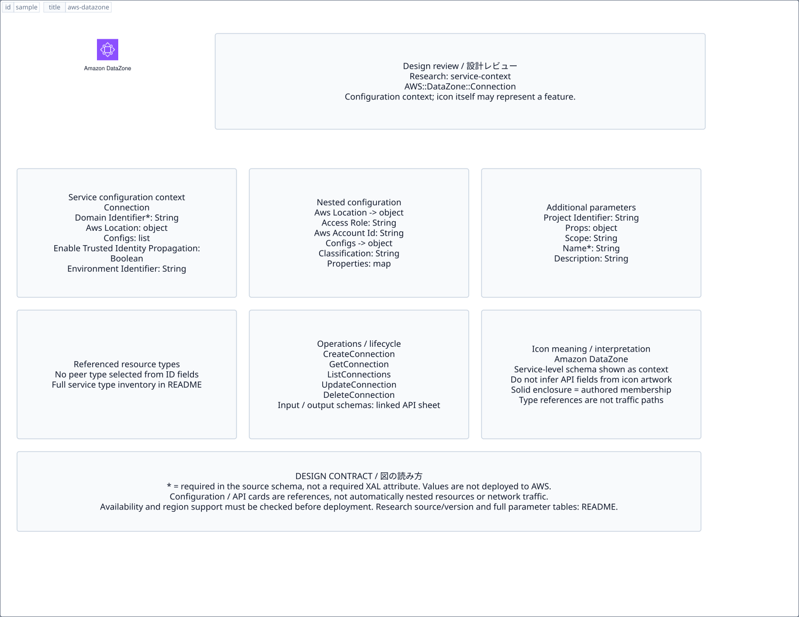

# `aws-datazone` — Amazon DataZone

[SVG preview](sample.svg) · [Editable XAL](sample.xal) · [Catalog](../README.md)



AWS service icon. Use a label and explicit annotations to describe its role; scope is selected by the author.

- Kind: `service`; category: Analytics.
- Diagram scope: `service` (recommendation, not AWS deployment validation).
- Default catalog ID: 1153. Covered catalog IDs: 1090, 1111, 1132, 1153.
- Implementation: V1 and V2; fixed AWS icon with a wrapped label and explicit functional annotations.

## Parameters

`id` is a required, unique connection ID, not a catalog number. `label`/`title`/`name` override the label; an empty label hides it. `size` > 0 defaults to 48 px. `label-width` > 0 defaults to 160 px (default box width, at least icon size + 12 px). Explicit `width`/`height` must contain the icon and label. `visible="false"` hides it. Children and icon overrides are not supported; use a group for containment.

`detail` adds a free-form diagram annotation. `show-details="false"` hides annotation text. Only supplied values are shown; none are sent to AWS. Service/resource annotations appear on separate wrapped lines.

| Parameter | Type | Meaning | Example |
|---|---|---|---|
| `input` | text | Input data annotation | `Application events` |
| `output` | text | Output data annotation | `Insights` |

## Review notes

The catalog provides a baseline for per-component development, not a simulation of the AWS control plane. This component's current functional parameters are the ones listed above. Additional service-specific visual behavior can be developed here without replacing catalog IDs in diagrams. Edit `sample.xal`, then run:

```sh
npm run generate:aws-samples -- --render --tag=aws-datazone
```

<!-- aws-functional-research:start -->
## 機能調査・構成デザイン（2026-09-06）

分類: `service-context`。サービス文脈: [`aws-datazone`](../aws-datazone/README.md)。

サンプルはアイコンと、設定・内包構造・関連リソース・操作を分離したレビューシートです。設定カードは編集可能な `rectangle`、グループは既存の専用タグで実装しています。カードのフィールド名を新しい XAL 属性として受理するわけではありません。専用タグが受理する属性は上の Parameters 表を参照してください。

実線の通信と、設定の参照・同じサービスに属する型一覧を区別します。スキーマの必須項目は AWS 側の仕様であり、図の必須入力ではありません。記載の構成モデル/API は取り込んだ公式資料の範囲であり、全リージョン・全機能の完全性や稼働可否を保証しません。

**重要:** このアイコンに対応する独立した構成リソースを断定せず、所属サービスの構成モデルを参考表示しています。アイコン名や絵柄から属性・親子関係・通信を推測しません。

### 構成モデル: `AWS::DataZone::Connection`

[公式リファレンス](https://docs.aws.amazon.com/AWSCloudFormation/latest/UserGuide/aws-resource-datazone-connection.html)。全 10 プロパティを型付きで列挙します（表示カードには主要項目のみ）。

| Field | Type | Required in AWS schema |
|---|---|---|
| [AwsLocation](https://docs.aws.amazon.com/AWSCloudFormation/latest/UserGuide/aws-resource-datazone-connection.html#cfn-datazone-connection-awslocation) | `AwsLocation` | no |
| [Configurations](https://docs.aws.amazon.com/AWSCloudFormation/latest/UserGuide/aws-resource-datazone-connection.html#cfn-datazone-connection-configurations) | `List<ConnectionConfiguration>` | no |
| [Description](https://docs.aws.amazon.com/AWSCloudFormation/latest/UserGuide/aws-resource-datazone-connection.html#cfn-datazone-connection-description) | `String` | no |
| [DomainIdentifier](https://docs.aws.amazon.com/AWSCloudFormation/latest/UserGuide/aws-resource-datazone-connection.html#cfn-datazone-connection-domainidentifier) | `String` | yes |
| [EnableTrustedIdentityPropagation](https://docs.aws.amazon.com/AWSCloudFormation/latest/UserGuide/aws-resource-datazone-connection.html#cfn-datazone-connection-enabletrustedidentitypropagation) | `Boolean` | no |
| [EnvironmentIdentifier](https://docs.aws.amazon.com/AWSCloudFormation/latest/UserGuide/aws-resource-datazone-connection.html#cfn-datazone-connection-environmentidentifier) | `String` | no |
| [Name](https://docs.aws.amazon.com/AWSCloudFormation/latest/UserGuide/aws-resource-datazone-connection.html#cfn-datazone-connection-name) | `String` | yes |
| [ProjectIdentifier](https://docs.aws.amazon.com/AWSCloudFormation/latest/UserGuide/aws-resource-datazone-connection.html#cfn-datazone-connection-projectidentifier) | `String` | no |
| [Props](https://docs.aws.amazon.com/AWSCloudFormation/latest/UserGuide/aws-resource-datazone-connection.html#cfn-datazone-connection-props) | `ConnectionPropertiesInput` | no |
| [Scope](https://docs.aws.amazon.com/AWSCloudFormation/latest/UserGuide/aws-resource-datazone-connection.html#cfn-datazone-connection-scope) | `String` | no |

#### AwsLocation → `AWS::DataZone::Connection.AwsLocation`

| Field | Type | Required in AWS schema |
|---|---|---|
| [AccessRole](https://docs.aws.amazon.com/AWSCloudFormation/latest/UserGuide/aws-properties-datazone-connection-awslocation.html#cfn-datazone-connection-awslocation-accessrole) | `String` | no |
| [AwsAccountId](https://docs.aws.amazon.com/AWSCloudFormation/latest/UserGuide/aws-properties-datazone-connection-awslocation.html#cfn-datazone-connection-awslocation-awsaccountid) | `String` | no |
| [AwsRegion](https://docs.aws.amazon.com/AWSCloudFormation/latest/UserGuide/aws-properties-datazone-connection-awslocation.html#cfn-datazone-connection-awslocation-awsregion) | `String` | no |
| [IamConnectionId](https://docs.aws.amazon.com/AWSCloudFormation/latest/UserGuide/aws-properties-datazone-connection-awslocation.html#cfn-datazone-connection-awslocation-iamconnectionid) | `String` | no |

#### Configurations → `AWS::DataZone::Connection.ConnectionConfiguration`

| Field | Type | Required in AWS schema |
|---|---|---|
| [Classification](https://docs.aws.amazon.com/AWSCloudFormation/latest/UserGuide/aws-properties-datazone-connection-connectionconfiguration.html#cfn-datazone-connection-connectionconfiguration-classification) | `String` | no |
| [Properties](https://docs.aws.amazon.com/AWSCloudFormation/latest/UserGuide/aws-properties-datazone-connection-connectionconfiguration.html#cfn-datazone-connection-connectionconfiguration-properties) | `Map<String>` | no |

#### Props → `AWS::DataZone::Connection.ConnectionPropertiesInput`

| Field | Type | Required in AWS schema |
|---|---|---|
| [AmazonQProperties](https://docs.aws.amazon.com/AWSCloudFormation/latest/UserGuide/aws-properties-datazone-connection-connectionpropertiesinput.html#cfn-datazone-connection-connectionpropertiesinput-amazonqproperties) | `AmazonQPropertiesInput` | no |
| [AthenaProperties](https://docs.aws.amazon.com/AWSCloudFormation/latest/UserGuide/aws-properties-datazone-connection-connectionpropertiesinput.html#cfn-datazone-connection-connectionpropertiesinput-athenaproperties) | `AthenaPropertiesInput` | no |
| [GlueProperties](https://docs.aws.amazon.com/AWSCloudFormation/latest/UserGuide/aws-properties-datazone-connection-connectionpropertiesinput.html#cfn-datazone-connection-connectionpropertiesinput-glueproperties) | `GluePropertiesInput` | no |
| [HyperPodProperties](https://docs.aws.amazon.com/AWSCloudFormation/latest/UserGuide/aws-properties-datazone-connection-connectionpropertiesinput.html#cfn-datazone-connection-connectionpropertiesinput-hyperpodproperties) | `HyperPodPropertiesInput` | no |
| [IamProperties](https://docs.aws.amazon.com/AWSCloudFormation/latest/UserGuide/aws-properties-datazone-connection-connectionpropertiesinput.html#cfn-datazone-connection-connectionpropertiesinput-iamproperties) | `IamPropertiesInput` | no |
| [LakehouseProperties](https://docs.aws.amazon.com/AWSCloudFormation/latest/UserGuide/aws-properties-datazone-connection-connectionpropertiesinput.html#cfn-datazone-connection-connectionpropertiesinput-lakehouseproperties) | `LakehousePropertiesInput` | no |
| [MlflowProperties](https://docs.aws.amazon.com/AWSCloudFormation/latest/UserGuide/aws-properties-datazone-connection-connectionpropertiesinput.html#cfn-datazone-connection-connectionpropertiesinput-mlflowproperties) | `MlflowPropertiesInput` | no |
| [RedshiftProperties](https://docs.aws.amazon.com/AWSCloudFormation/latest/UserGuide/aws-properties-datazone-connection-connectionpropertiesinput.html#cfn-datazone-connection-connectionpropertiesinput-redshiftproperties) | `RedshiftPropertiesInput` | no |
| [S3Properties](https://docs.aws.amazon.com/AWSCloudFormation/latest/UserGuide/aws-properties-datazone-connection-connectionpropertiesinput.html#cfn-datazone-connection-connectionpropertiesinput-s3properties) | `S3PropertiesInput` | no |
| [SparkEmrProperties](https://docs.aws.amazon.com/AWSCloudFormation/latest/UserGuide/aws-properties-datazone-connection-connectionpropertiesinput.html#cfn-datazone-connection-connectionpropertiesinput-sparkemrproperties) | `SparkEmrPropertiesInput` | no |
| [SparkGlueProperties](https://docs.aws.amazon.com/AWSCloudFormation/latest/UserGuide/aws-properties-datazone-connection-connectionpropertiesinput.html#cfn-datazone-connection-connectionpropertiesinput-sparkglueproperties) | `SparkGluePropertiesInput` | no |
| [WorkflowsMwaaProperties](https://docs.aws.amazon.com/AWSCloudFormation/latest/UserGuide/aws-properties-datazone-connection-connectionpropertiesinput.html#cfn-datazone-connection-connectionpropertiesinput-workflowsmwaaproperties) | `WorkflowsMwaaPropertiesInput` | no |
| [WorkflowsServerlessProperties](https://docs.aws.amazon.com/AWSCloudFormation/latest/UserGuide/aws-properties-datazone-connection-connectionpropertiesinput.html#cfn-datazone-connection-connectionpropertiesinput-workflowsserverlessproperties) | `Json` | no |

### 関連する構成リソース（17 型）

同じサービス文脈の型一覧です。すべてがこのアイコンの子リソースという意味ではありません。さらに深い入れ子は [公式スキーマのスナップショット](../research/cloudformation-models.json) に記録しています。

- [AWS::DataZone::Connection](https://docs.aws.amazon.com/AWSCloudFormation/latest/UserGuide/aws-resource-datazone-connection.html)
- [AWS::DataZone::DataSource](https://docs.aws.amazon.com/AWSCloudFormation/latest/UserGuide/aws-resource-datazone-datasource.html)
- [AWS::DataZone::Domain](https://docs.aws.amazon.com/AWSCloudFormation/latest/UserGuide/aws-resource-datazone-domain.html)
- [AWS::DataZone::DomainUnit](https://docs.aws.amazon.com/AWSCloudFormation/latest/UserGuide/aws-resource-datazone-domainunit.html)
- [AWS::DataZone::Environment](https://docs.aws.amazon.com/AWSCloudFormation/latest/UserGuide/aws-resource-datazone-environment.html)
- [AWS::DataZone::EnvironmentActions](https://docs.aws.amazon.com/AWSCloudFormation/latest/UserGuide/aws-resource-datazone-environmentactions.html)
- [AWS::DataZone::EnvironmentBlueprintConfiguration](https://docs.aws.amazon.com/AWSCloudFormation/latest/UserGuide/aws-resource-datazone-environmentblueprintconfiguration.html)
- [AWS::DataZone::EnvironmentProfile](https://docs.aws.amazon.com/AWSCloudFormation/latest/UserGuide/aws-resource-datazone-environmentprofile.html)
- [AWS::DataZone::FormType](https://docs.aws.amazon.com/AWSCloudFormation/latest/UserGuide/aws-resource-datazone-formtype.html)
- [AWS::DataZone::GroupProfile](https://docs.aws.amazon.com/AWSCloudFormation/latest/UserGuide/aws-resource-datazone-groupprofile.html)
- [AWS::DataZone::Owner](https://docs.aws.amazon.com/AWSCloudFormation/latest/UserGuide/aws-resource-datazone-owner.html)
- [AWS::DataZone::PolicyGrant](https://docs.aws.amazon.com/AWSCloudFormation/latest/UserGuide/aws-resource-datazone-policygrant.html)
- [AWS::DataZone::Project](https://docs.aws.amazon.com/AWSCloudFormation/latest/UserGuide/aws-resource-datazone-project.html)
- [AWS::DataZone::ProjectMembership](https://docs.aws.amazon.com/AWSCloudFormation/latest/UserGuide/aws-resource-datazone-projectmembership.html)
- [AWS::DataZone::ProjectProfile](https://docs.aws.amazon.com/AWSCloudFormation/latest/UserGuide/aws-resource-datazone-projectprofile.html)
- [AWS::DataZone::SubscriptionTarget](https://docs.aws.amazon.com/AWSCloudFormation/latest/UserGuide/aws-resource-datazone-subscriptiontarget.html)
- [AWS::DataZone::UserProfile](https://docs.aws.amazon.com/AWSCloudFormation/latest/UserGuide/aws-resource-datazone-userprofile.html)

### API の操作・パラメータ

- [Amazon DataZone: 190 操作の入力・出力一覧](../research/api/datazone.md)（API version 2018-05-10）

### 出典・調査範囲

- [公式資料 1](https://docs.aws.amazon.com/AWSCloudFormation/latest/UserGuide/aws-resource-datazone-connection.html)
- [公式資料 2](https://github.com/boto/botocore/blob/develop/botocore/data/datazone/2018-05-10/service-2.json)

CloudFormation 仕様 263.0.0、AWS SDK 431 サービスモデルをオフラインで参照。取得日・元データの SHA-256 は [調査マニフェスト](../research/README.md) を参照。API モデル名・フィールド名は仕様から抽出し、説明本文を転載していません。利用可能性は全サービス一律には確認できないため、提供終了の確認がないものも「現在利用可能」と断定していません。

### 次の部品レビュー

- 本アイコンが独立したリソースか、機能・状態・デバイスの記号かを確認する。
- 詳細カードのうち専用の子タグ・参照属性として実装する範囲を選ぶ。
- 通信、制御、認証、監視の関係を分け、必要な接続点・配置制約を確認する。
- 編集後は `npm run generate:aws-samples -- --render --tag=aws-datazone`。通常の再描画は XAL/README を上書きしない。
<!-- aws-functional-research:end -->
