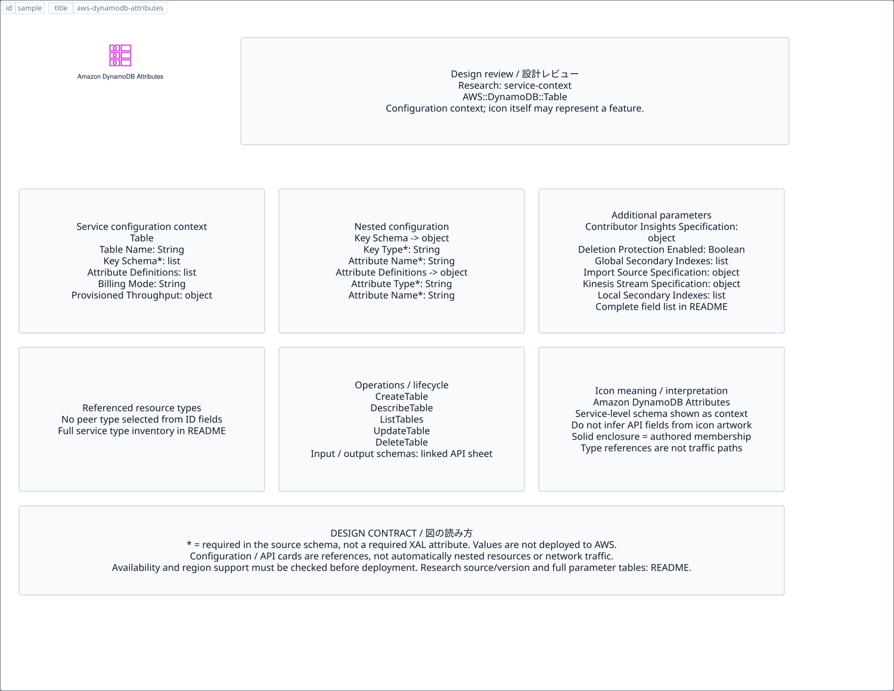

# `aws-dynamodb-attributes` — Amazon DynamoDB Attributes

[SVG preview](sample.svg) · [Editable XAL](sample.xal) · [Catalog](../README.md)



AWS resource icon. Use a label and explicit annotations to describe its role; scope is selected by the author.

- Kind: `resource`; category: Database.
- Diagram scope: `logical` (recommendation, not AWS deployment validation).
- Default catalog ID: 1814. Covered catalog IDs: 1814.
- Implementation: V1 and V2; fixed AWS icon with a wrapped label and explicit functional annotations.

## Parameters

`id` is a required, unique connection ID, not a catalog number. `label`/`title`/`name` override the label; an empty label hides it. `size` > 0 defaults to 48 px. `label-width` > 0 defaults to 160 px (default box width, at least icon size + 12 px). Explicit `width`/`height` must contain the icon and label. `visible="false"` hides it. Children and icon overrides are not supported; use a group for containment.

`detail` adds a free-form diagram annotation. `show-details="false"` hides annotation text. Only supplied values are shown; none are sent to AWS. Service/resource annotations appear on separate wrapped lines.

| Parameter | Type | Meaning | Example |
|---|---|---|---|
| `data-model` | text | Data model annotation | `Application records` |

## Review notes

The catalog provides a baseline for per-component development, not a simulation of the AWS control plane. This component's current functional parameters are the ones listed above. Additional service-specific visual behavior can be developed here without replacing catalog IDs in diagrams. Edit `sample.xal`, then run:

```sh
npm run generate:aws-samples -- --render --tag=aws-dynamodb-attributes
```

<!-- aws-functional-research:start -->
## 機能調査・構成デザイン（2026-09-06）

分類: `service-context`。サービス文脈: [`aws-dynamodb`](../aws-dynamodb/README.md)。

サンプルはアイコンと、設定・内包構造・関連リソース・操作を分離したレビューシートです。設定カードは編集可能な `rectangle`、グループは既存の専用タグで実装しています。カードのフィールド名を新しい XAL 属性として受理するわけではありません。専用タグが受理する属性は上の Parameters 表を参照してください。

実線の通信と、設定の参照・同じサービスに属する型一覧を区別します。スキーマの必須項目は AWS 側の仕様であり、図の必須入力ではありません。記載の構成モデル/API は取り込んだ公式資料の範囲であり、全リージョン・全機能の完全性や稼働可否を保証しません。

**重要:** このアイコンに対応する独立した構成リソースを断定せず、所属サービスの構成モデルを参考表示しています。アイコン名や絵柄から属性・親子関係・通信を推測しません。

### 構成モデル: `AWS::DynamoDB::Table`

[公式リファレンス](https://docs.aws.amazon.com/AWSCloudFormation/latest/UserGuide/aws-resource-dynamodb-table.html)。全 20 プロパティを型付きで列挙します（表示カードには主要項目のみ）。

| Field | Type | Required in AWS schema |
|---|---|---|
| [AttributeDefinitions](https://docs.aws.amazon.com/AWSCloudFormation/latest/UserGuide/aws-resource-dynamodb-table.html#cfn-dynamodb-table-attributedefinitions) | `List<AttributeDefinition>` | no |
| [BillingMode](https://docs.aws.amazon.com/AWSCloudFormation/latest/UserGuide/aws-resource-dynamodb-table.html#cfn-dynamodb-table-billingmode) | `String` | no |
| [ContributorInsightsSpecification](https://docs.aws.amazon.com/AWSCloudFormation/latest/UserGuide/aws-resource-dynamodb-table.html#cfn-dynamodb-table-contributorinsightsspecification) | `ContributorInsightsSpecification` | no |
| [DeletionProtectionEnabled](https://docs.aws.amazon.com/AWSCloudFormation/latest/UserGuide/aws-resource-dynamodb-table.html#cfn-dynamodb-table-deletionprotectionenabled) | `Boolean` | no |
| [GlobalSecondaryIndexes](https://docs.aws.amazon.com/AWSCloudFormation/latest/UserGuide/aws-resource-dynamodb-table.html#cfn-dynamodb-table-globalsecondaryindexes) | `List<GlobalSecondaryIndex>` | no |
| [ImportSourceSpecification](https://docs.aws.amazon.com/AWSCloudFormation/latest/UserGuide/aws-resource-dynamodb-table.html#cfn-dynamodb-table-importsourcespecification) | `ImportSourceSpecification` | no |
| [KeySchema](https://docs.aws.amazon.com/AWSCloudFormation/latest/UserGuide/aws-resource-dynamodb-table.html#cfn-dynamodb-table-keyschema) | `List<KeySchema>` | yes |
| [KinesisStreamSpecification](https://docs.aws.amazon.com/AWSCloudFormation/latest/UserGuide/aws-resource-dynamodb-table.html#cfn-dynamodb-table-kinesisstreamspecification) | `KinesisStreamSpecification` | no |
| [LocalSecondaryIndexes](https://docs.aws.amazon.com/AWSCloudFormation/latest/UserGuide/aws-resource-dynamodb-table.html#cfn-dynamodb-table-localsecondaryindexes) | `List<LocalSecondaryIndex>` | no |
| [OnDemandThroughput](https://docs.aws.amazon.com/AWSCloudFormation/latest/UserGuide/aws-resource-dynamodb-table.html#cfn-dynamodb-table-ondemandthroughput) | `OnDemandThroughput` | no |
| [PointInTimeRecoverySpecification](https://docs.aws.amazon.com/AWSCloudFormation/latest/UserGuide/aws-resource-dynamodb-table.html#cfn-dynamodb-table-pointintimerecoveryspecification) | `PointInTimeRecoverySpecification` | no |
| [ProvisionedThroughput](https://docs.aws.amazon.com/AWSCloudFormation/latest/UserGuide/aws-resource-dynamodb-table.html#cfn-dynamodb-table-provisionedthroughput) | `ProvisionedThroughput` | no |
| [ResourcePolicy](https://docs.aws.amazon.com/AWSCloudFormation/latest/UserGuide/aws-resource-dynamodb-table.html#cfn-dynamodb-table-resourcepolicy) | `ResourcePolicy` | no |
| [SSESpecification](https://docs.aws.amazon.com/AWSCloudFormation/latest/UserGuide/aws-resource-dynamodb-table.html#cfn-dynamodb-table-ssespecification) | `SSESpecification` | no |
| [StreamSpecification](https://docs.aws.amazon.com/AWSCloudFormation/latest/UserGuide/aws-resource-dynamodb-table.html#cfn-dynamodb-table-streamspecification) | `StreamSpecification` | no |
| [TableClass](https://docs.aws.amazon.com/AWSCloudFormation/latest/UserGuide/aws-resource-dynamodb-table.html#cfn-dynamodb-table-tableclass) | `String` | no |
| [TableName](https://docs.aws.amazon.com/AWSCloudFormation/latest/UserGuide/aws-resource-dynamodb-table.html#cfn-dynamodb-table-tablename) | `String` | no |
| [Tags](https://docs.aws.amazon.com/AWSCloudFormation/latest/UserGuide/aws-resource-dynamodb-table.html#cfn-dynamodb-table-tags) | `List<Tag>` | no |
| [TimeToLiveSpecification](https://docs.aws.amazon.com/AWSCloudFormation/latest/UserGuide/aws-resource-dynamodb-table.html#cfn-dynamodb-table-timetolivespecification) | `TimeToLiveSpecification` | no |
| [WarmThroughput](https://docs.aws.amazon.com/AWSCloudFormation/latest/UserGuide/aws-resource-dynamodb-table.html#cfn-dynamodb-table-warmthroughput) | `WarmThroughput` | no |

#### KeySchema → `AWS::DynamoDB::Table.KeySchema`

| Field | Type | Required in AWS schema |
|---|---|---|
| [AttributeName](https://docs.aws.amazon.com/AWSCloudFormation/latest/UserGuide/aws-properties-dynamodb-table-keyschema.html#cfn-dynamodb-table-keyschema-attributename) | `String` | yes |
| [KeyType](https://docs.aws.amazon.com/AWSCloudFormation/latest/UserGuide/aws-properties-dynamodb-table-keyschema.html#cfn-dynamodb-table-keyschema-keytype) | `String` | yes |

#### AttributeDefinitions → `AWS::DynamoDB::Table.AttributeDefinition`

| Field | Type | Required in AWS schema |
|---|---|---|
| [AttributeName](https://docs.aws.amazon.com/AWSCloudFormation/latest/UserGuide/aws-properties-dynamodb-table-attributedefinition.html#cfn-dynamodb-table-attributedefinition-attributename) | `String` | yes |
| [AttributeType](https://docs.aws.amazon.com/AWSCloudFormation/latest/UserGuide/aws-properties-dynamodb-table-attributedefinition.html#cfn-dynamodb-table-attributedefinition-attributetype) | `String` | yes |

#### ProvisionedThroughput → `AWS::DynamoDB::Table.ProvisionedThroughput`

| Field | Type | Required in AWS schema |
|---|---|---|
| [ReadCapacityUnits](https://docs.aws.amazon.com/AWSCloudFormation/latest/UserGuide/aws-properties-dynamodb-table-provisionedthroughput.html#cfn-dynamodb-table-provisionedthroughput-readcapacityunits) | `Integer` | yes |
| [WriteCapacityUnits](https://docs.aws.amazon.com/AWSCloudFormation/latest/UserGuide/aws-properties-dynamodb-table-provisionedthroughput.html#cfn-dynamodb-table-provisionedthroughput-writecapacityunits) | `Integer` | yes |

#### ContributorInsightsSpecification → `AWS::DynamoDB::Table.ContributorInsightsSpecification`

| Field | Type | Required in AWS schema |
|---|---|---|
| [Enabled](https://docs.aws.amazon.com/AWSCloudFormation/latest/UserGuide/aws-properties-dynamodb-table-contributorinsightsspecification.html#cfn-dynamodb-table-contributorinsightsspecification-enabled) | `Boolean` | yes |
| [Mode](https://docs.aws.amazon.com/AWSCloudFormation/latest/UserGuide/aws-properties-dynamodb-table-contributorinsightsspecification.html#cfn-dynamodb-table-contributorinsightsspecification-mode) | `String` | no |

#### GlobalSecondaryIndexes → `AWS::DynamoDB::Table.GlobalSecondaryIndex`

| Field | Type | Required in AWS schema |
|---|---|---|
| [ContributorInsightsSpecification](https://docs.aws.amazon.com/AWSCloudFormation/latest/UserGuide/aws-properties-dynamodb-table-globalsecondaryindex.html#cfn-dynamodb-table-globalsecondaryindex-contributorinsightsspecification) | `ContributorInsightsSpecification` | no |
| [IndexName](https://docs.aws.amazon.com/AWSCloudFormation/latest/UserGuide/aws-properties-dynamodb-table-globalsecondaryindex.html#cfn-dynamodb-table-globalsecondaryindex-indexname) | `String` | yes |
| [KeySchema](https://docs.aws.amazon.com/AWSCloudFormation/latest/UserGuide/aws-properties-dynamodb-table-globalsecondaryindex.html#cfn-dynamodb-table-globalsecondaryindex-keyschema) | `List<KeySchema>` | yes |
| [OnDemandThroughput](https://docs.aws.amazon.com/AWSCloudFormation/latest/UserGuide/aws-properties-dynamodb-table-globalsecondaryindex.html#cfn-dynamodb-table-globalsecondaryindex-ondemandthroughput) | `OnDemandThroughput` | no |
| [Projection](https://docs.aws.amazon.com/AWSCloudFormation/latest/UserGuide/aws-properties-dynamodb-table-globalsecondaryindex.html#cfn-dynamodb-table-globalsecondaryindex-projection) | `Projection` | yes |
| [ProvisionedThroughput](https://docs.aws.amazon.com/AWSCloudFormation/latest/UserGuide/aws-properties-dynamodb-table-globalsecondaryindex.html#cfn-dynamodb-table-globalsecondaryindex-provisionedthroughput) | `ProvisionedThroughput` | no |
| [WarmThroughput](https://docs.aws.amazon.com/AWSCloudFormation/latest/UserGuide/aws-properties-dynamodb-table-globalsecondaryindex.html#cfn-dynamodb-table-globalsecondaryindex-warmthroughput) | `WarmThroughput` | no |

#### ImportSourceSpecification → `AWS::DynamoDB::Table.ImportSourceSpecification`

| Field | Type | Required in AWS schema |
|---|---|---|
| [InputCompressionType](https://docs.aws.amazon.com/AWSCloudFormation/latest/UserGuide/aws-properties-dynamodb-table-importsourcespecification.html#cfn-dynamodb-table-importsourcespecification-inputcompressiontype) | `String` | no |
| [InputFormat](https://docs.aws.amazon.com/AWSCloudFormation/latest/UserGuide/aws-properties-dynamodb-table-importsourcespecification.html#cfn-dynamodb-table-importsourcespecification-inputformat) | `String` | yes |
| [InputFormatOptions](https://docs.aws.amazon.com/AWSCloudFormation/latest/UserGuide/aws-properties-dynamodb-table-importsourcespecification.html#cfn-dynamodb-table-importsourcespecification-inputformatoptions) | `InputFormatOptions` | no |
| [S3BucketSource](https://docs.aws.amazon.com/AWSCloudFormation/latest/UserGuide/aws-properties-dynamodb-table-importsourcespecification.html#cfn-dynamodb-table-importsourcespecification-s3bucketsource) | `S3BucketSource` | yes |

#### KinesisStreamSpecification → `AWS::DynamoDB::Table.KinesisStreamSpecification`

| Field | Type | Required in AWS schema |
|---|---|---|
| [ApproximateCreationDateTimePrecision](https://docs.aws.amazon.com/AWSCloudFormation/latest/UserGuide/aws-properties-dynamodb-table-kinesisstreamspecification.html#cfn-dynamodb-table-kinesisstreamspecification-approximatecreationdatetimeprecision) | `String` | no |
| [StreamArn](https://docs.aws.amazon.com/AWSCloudFormation/latest/UserGuide/aws-properties-dynamodb-table-kinesisstreamspecification.html#cfn-dynamodb-table-kinesisstreamspecification-streamarn) | `String` | yes |

#### LocalSecondaryIndexes → `AWS::DynamoDB::Table.LocalSecondaryIndex`

| Field | Type | Required in AWS schema |
|---|---|---|
| [IndexName](https://docs.aws.amazon.com/AWSCloudFormation/latest/UserGuide/aws-properties-dynamodb-table-localsecondaryindex.html#cfn-dynamodb-table-localsecondaryindex-indexname) | `String` | yes |
| [KeySchema](https://docs.aws.amazon.com/AWSCloudFormation/latest/UserGuide/aws-properties-dynamodb-table-localsecondaryindex.html#cfn-dynamodb-table-localsecondaryindex-keyschema) | `List<KeySchema>` | yes |
| [Projection](https://docs.aws.amazon.com/AWSCloudFormation/latest/UserGuide/aws-properties-dynamodb-table-localsecondaryindex.html#cfn-dynamodb-table-localsecondaryindex-projection) | `Projection` | yes |

#### OnDemandThroughput → `AWS::DynamoDB::Table.OnDemandThroughput`

| Field | Type | Required in AWS schema |
|---|---|---|
| [MaxReadRequestUnits](https://docs.aws.amazon.com/AWSCloudFormation/latest/UserGuide/aws-properties-dynamodb-table-ondemandthroughput.html#cfn-dynamodb-table-ondemandthroughput-maxreadrequestunits) | `Integer` | no |
| [MaxWriteRequestUnits](https://docs.aws.amazon.com/AWSCloudFormation/latest/UserGuide/aws-properties-dynamodb-table-ondemandthroughput.html#cfn-dynamodb-table-ondemandthroughput-maxwriterequestunits) | `Integer` | no |

#### PointInTimeRecoverySpecification → `AWS::DynamoDB::Table.PointInTimeRecoverySpecification`

| Field | Type | Required in AWS schema |
|---|---|---|
| [PointInTimeRecoveryEnabled](https://docs.aws.amazon.com/AWSCloudFormation/latest/UserGuide/aws-properties-dynamodb-table-pointintimerecoveryspecification.html#cfn-dynamodb-table-pointintimerecoveryspecification-pointintimerecoveryenabled) | `Boolean` | no |
| [RecoveryPeriodInDays](https://docs.aws.amazon.com/AWSCloudFormation/latest/UserGuide/aws-properties-dynamodb-table-pointintimerecoveryspecification.html#cfn-dynamodb-table-pointintimerecoveryspecification-recoveryperiodindays) | `Integer` | no |

#### ResourcePolicy → `AWS::DynamoDB::Table.ResourcePolicy`

| Field | Type | Required in AWS schema |
|---|---|---|
| [PolicyDocument](https://docs.aws.amazon.com/AWSCloudFormation/latest/UserGuide/aws-properties-dynamodb-table-resourcepolicy.html#cfn-dynamodb-table-resourcepolicy-policydocument) | `Json` | yes |

#### SSESpecification → `AWS::DynamoDB::Table.SSESpecification`

| Field | Type | Required in AWS schema |
|---|---|---|
| [KMSMasterKeyId](https://docs.aws.amazon.com/AWSCloudFormation/latest/UserGuide/aws-properties-dynamodb-table-ssespecification.html#cfn-dynamodb-table-ssespecification-kmsmasterkeyid) | `String` | no |
| [SSEEnabled](https://docs.aws.amazon.com/AWSCloudFormation/latest/UserGuide/aws-properties-dynamodb-table-ssespecification.html#cfn-dynamodb-table-ssespecification-sseenabled) | `Boolean` | yes |
| [SSEType](https://docs.aws.amazon.com/AWSCloudFormation/latest/UserGuide/aws-properties-dynamodb-table-ssespecification.html#cfn-dynamodb-table-ssespecification-ssetype) | `String` | no |

#### StreamSpecification → `AWS::DynamoDB::Table.StreamSpecification`

| Field | Type | Required in AWS schema |
|---|---|---|
| [ResourcePolicy](https://docs.aws.amazon.com/AWSCloudFormation/latest/UserGuide/aws-properties-dynamodb-table-streamspecification.html#cfn-dynamodb-table-streamspecification-resourcepolicy) | `ResourcePolicy` | no |
| [StreamViewType](https://docs.aws.amazon.com/AWSCloudFormation/latest/UserGuide/aws-properties-dynamodb-table-streamspecification.html#cfn-dynamodb-table-streamspecification-streamviewtype) | `String` | yes |
| [Tags](https://docs.aws.amazon.com/AWSCloudFormation/latest/UserGuide/aws-properties-dynamodb-table-streamspecification.html#cfn-dynamodb-table-streamspecification-tags) | `List<Tag>` | no |

#### TimeToLiveSpecification → `AWS::DynamoDB::Table.TimeToLiveSpecification`

| Field | Type | Required in AWS schema |
|---|---|---|
| [AttributeName](https://docs.aws.amazon.com/AWSCloudFormation/latest/UserGuide/aws-properties-dynamodb-table-timetolivespecification.html#cfn-dynamodb-table-timetolivespecification-attributename) | `String` | no |
| [Enabled](https://docs.aws.amazon.com/AWSCloudFormation/latest/UserGuide/aws-properties-dynamodb-table-timetolivespecification.html#cfn-dynamodb-table-timetolivespecification-enabled) | `Boolean` | yes |

#### WarmThroughput → `AWS::DynamoDB::Table.WarmThroughput`

| Field | Type | Required in AWS schema |
|---|---|---|
| [ReadUnitsPerSecond](https://docs.aws.amazon.com/AWSCloudFormation/latest/UserGuide/aws-properties-dynamodb-table-warmthroughput.html#cfn-dynamodb-table-warmthroughput-readunitspersecond) | `Integer` | no |
| [WriteUnitsPerSecond](https://docs.aws.amazon.com/AWSCloudFormation/latest/UserGuide/aws-properties-dynamodb-table-warmthroughput.html#cfn-dynamodb-table-warmthroughput-writeunitspersecond) | `Integer` | no |

### 関連する構成リソース（5 型）

同じサービス文脈の型一覧です。すべてがこのアイコンの子リソースという意味ではありません。さらに深い入れ子は [公式スキーマのスナップショット](../research/cloudformation-models.json) に記録しています。

- [AWS::DynamoDB::Backup](https://docs.aws.amazon.com/AWSCloudFormation/latest/UserGuide/aws-resource-dynamodb-backup.html)
- [AWS::DynamoDB::Export](https://docs.aws.amazon.com/AWSCloudFormation/latest/UserGuide/aws-resource-dynamodb-export.html)
- [AWS::DynamoDB::GlobalTable](https://docs.aws.amazon.com/AWSCloudFormation/latest/UserGuide/aws-resource-dynamodb-globaltable.html)
- [AWS::DynamoDB::Stream](https://docs.aws.amazon.com/AWSCloudFormation/latest/UserGuide/aws-resource-dynamodb-stream.html)
- [AWS::DynamoDB::Table](https://docs.aws.amazon.com/AWSCloudFormation/latest/UserGuide/aws-resource-dynamodb-table.html)

### API の操作・パラメータ

- [Amazon DynamoDB: 58 操作の入力・出力一覧](../research/api/dynamodb.md)（API version 2012-08-10）

### 出典・調査範囲

- [公式資料 1](https://docs.aws.amazon.com/AWSCloudFormation/latest/UserGuide/aws-resource-dynamodb-table.html)
- [公式資料 2](https://github.com/boto/botocore/blob/develop/botocore/data/dynamodb/2012-08-10/service-2.json)

CloudFormation 仕様 263.0.0、AWS SDK 431 サービスモデルをオフラインで参照。取得日・元データの SHA-256 は [調査マニフェスト](../research/README.md) を参照。API モデル名・フィールド名は仕様から抽出し、説明本文を転載していません。利用可能性は全サービス一律には確認できないため、提供終了の確認がないものも「現在利用可能」と断定していません。

### 次の部品レビュー

- 本アイコンが独立したリソースか、機能・状態・デバイスの記号かを確認する。
- 詳細カードのうち専用の子タグ・参照属性として実装する範囲を選ぶ。
- 通信、制御、認証、監視の関係を分け、必要な接続点・配置制約を確認する。
- 編集後は `npm run generate:aws-samples -- --render --tag=aws-dynamodb-attributes`。通常の再描画は XAL/README を上書きしない。
<!-- aws-functional-research:end -->
