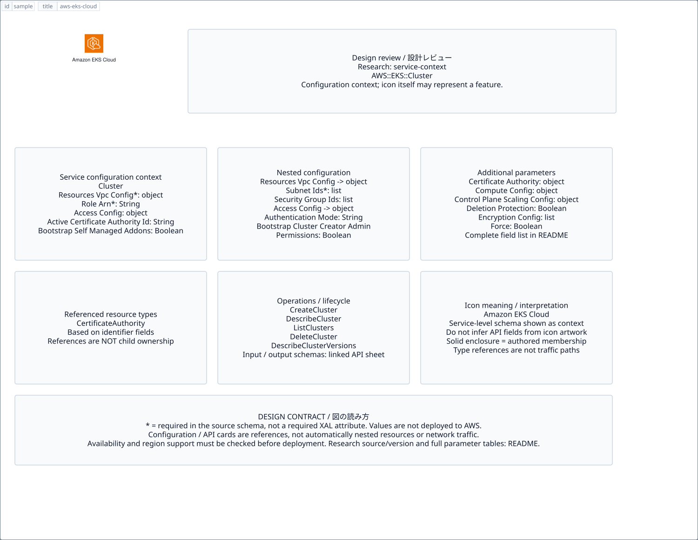

# `aws-eks-cloud` — Amazon EKS Cloud

[SVG preview](sample.svg) · [Editable XAL](sample.xal) · [Catalog](../README.md)



AWS service icon. Use a label and explicit annotations to describe its role; scope is selected by the author.

- Kind: `service`; category: Containers.
- Diagram scope: `service` (recommendation, not AWS deployment validation).
- Default catalog ID: 571. Covered catalog IDs: 544, 553, 562, 571.
- Implementation: V1 and V2; fixed AWS icon with a wrapped label and explicit functional annotations.

## Parameters

`id` is a required, unique connection ID, not a catalog number. `label`/`title`/`name` override the label; an empty label hides it. `size` > 0 defaults to 48 px. `label-width` > 0 defaults to 160 px (default box width, at least icon size + 12 px). Explicit `width`/`height` must contain the icon and label. `visible="false"` hides it. Children and icon overrides are not supported; use a group for containment.

`detail` adds a free-form diagram annotation. `show-details="false"` hides annotation text. Only supplied values are shown; none are sent to AWS. Service/resource annotations appear on separate wrapped lines.

| Parameter | Type | Meaning | Example |
|---|---|---|---|
| `workload` | text | Workload or process annotation | `Web application` |

## Review notes

The catalog provides a baseline for per-component development, not a simulation of the AWS control plane. This component's current functional parameters are the ones listed above. Additional service-specific visual behavior can be developed here without replacing catalog IDs in diagrams. Edit `sample.xal`, then run:

```sh
npm run generate:aws-samples -- --render --tag=aws-eks-cloud
```

<!-- aws-functional-research:start -->
## 機能調査・構成デザイン（2026-09-06）

分類: `service-context`。サービス文脈: [`aws-eks-cloud`](../aws-eks-cloud/README.md)。

サンプルはアイコンと、設定・内包構造・関連リソース・操作を分離したレビューシートです。設定カードは編集可能な `rectangle`、グループは既存の専用タグで実装しています。カードのフィールド名を新しい XAL 属性として受理するわけではありません。専用タグが受理する属性は上の Parameters 表を参照してください。

実線の通信と、設定の参照・同じサービスに属する型一覧を区別します。スキーマの必須項目は AWS 側の仕様であり、図の必須入力ではありません。記載の構成モデル/API は取り込んだ公式資料の範囲であり、全リージョン・全機能の完全性や稼働可否を保証しません。

**重要:** このアイコンに対応する独立した構成リソースを断定せず、所属サービスの構成モデルを参考表示しています。アイコン名や絵柄から属性・親子関係・通信を推測しません。

### 構成モデル: `AWS::EKS::Cluster`

[公式リファレンス](https://docs.aws.amazon.com/AWSCloudFormation/latest/UserGuide/aws-resource-eks-cluster.html)。全 25 プロパティを型付きで列挙します（表示カードには主要項目のみ）。

| Field | Type | Required in AWS schema |
|---|---|---|
| [AccessConfig](https://docs.aws.amazon.com/AWSCloudFormation/latest/UserGuide/aws-resource-eks-cluster.html#cfn-eks-cluster-accessconfig) | `AccessConfig` | no |
| [ActiveCertificateAuthorityId](https://docs.aws.amazon.com/AWSCloudFormation/latest/UserGuide/aws-resource-eks-cluster.html#cfn-eks-cluster-activecertificateauthorityid) | `String` | no |
| [BootstrapSelfManagedAddons](https://docs.aws.amazon.com/AWSCloudFormation/latest/UserGuide/aws-resource-eks-cluster.html#cfn-eks-cluster-bootstrapselfmanagedaddons) | `Boolean` | no |
| [CertificateAuthority](https://docs.aws.amazon.com/AWSCloudFormation/latest/UserGuide/aws-resource-eks-cluster.html#cfn-eks-cluster-certificateauthority) | `CertificateAuthority` | no |
| [ComputeConfig](https://docs.aws.amazon.com/AWSCloudFormation/latest/UserGuide/aws-resource-eks-cluster.html#cfn-eks-cluster-computeconfig) | `ComputeConfig` | no |
| [ControlPlaneScalingConfig](https://docs.aws.amazon.com/AWSCloudFormation/latest/UserGuide/aws-resource-eks-cluster.html#cfn-eks-cluster-controlplanescalingconfig) | `ControlPlaneScalingConfig` | no |
| [DeletionProtection](https://docs.aws.amazon.com/AWSCloudFormation/latest/UserGuide/aws-resource-eks-cluster.html#cfn-eks-cluster-deletionprotection) | `Boolean` | no |
| [EncryptionConfig](https://docs.aws.amazon.com/AWSCloudFormation/latest/UserGuide/aws-resource-eks-cluster.html#cfn-eks-cluster-encryptionconfig) | `List<EncryptionConfig>` | no |
| [Force](https://docs.aws.amazon.com/AWSCloudFormation/latest/UserGuide/aws-resource-eks-cluster.html#cfn-eks-cluster-force) | `Boolean` | no |
| [KubeApiServerConfig](https://docs.aws.amazon.com/AWSCloudFormation/latest/UserGuide/aws-resource-eks-cluster.html#cfn-eks-cluster-kubeapiserverconfig) | `KubeApiServerConfig` | no |
| [KubeControllerManagerConfig](https://docs.aws.amazon.com/AWSCloudFormation/latest/UserGuide/aws-resource-eks-cluster.html#cfn-eks-cluster-kubecontrollermanagerconfig) | `KubeControllerManagerConfig` | no |
| [KubernetesNetworkConfig](https://docs.aws.amazon.com/AWSCloudFormation/latest/UserGuide/aws-resource-eks-cluster.html#cfn-eks-cluster-kubernetesnetworkconfig) | `KubernetesNetworkConfig` | no |
| [KubeSchedulerConfig](https://docs.aws.amazon.com/AWSCloudFormation/latest/UserGuide/aws-resource-eks-cluster.html#cfn-eks-cluster-kubeschedulerconfig) | `KubeSchedulerConfig` | no |
| [Logging](https://docs.aws.amazon.com/AWSCloudFormation/latest/UserGuide/aws-resource-eks-cluster.html#cfn-eks-cluster-logging) | `Logging` | no |
| [Name](https://docs.aws.amazon.com/AWSCloudFormation/latest/UserGuide/aws-resource-eks-cluster.html#cfn-eks-cluster-name) | `String` | no |
| [OutpostConfig](https://docs.aws.amazon.com/AWSCloudFormation/latest/UserGuide/aws-resource-eks-cluster.html#cfn-eks-cluster-outpostconfig) | `OutpostConfig` | no |
| [RemoteNetworkConfig](https://docs.aws.amazon.com/AWSCloudFormation/latest/UserGuide/aws-resource-eks-cluster.html#cfn-eks-cluster-remotenetworkconfig) | `RemoteNetworkConfig` | no |
| [ResourcesVpcConfig](https://docs.aws.amazon.com/AWSCloudFormation/latest/UserGuide/aws-resource-eks-cluster.html#cfn-eks-cluster-resourcesvpcconfig) | `ResourcesVpcConfig` | yes |
| [RoleArn](https://docs.aws.amazon.com/AWSCloudFormation/latest/UserGuide/aws-resource-eks-cluster.html#cfn-eks-cluster-rolearn) | `String` | yes |
| [RollbackConfig](https://docs.aws.amazon.com/AWSCloudFormation/latest/UserGuide/aws-resource-eks-cluster.html#cfn-eks-cluster-rollbackconfig) | `RollbackConfig` | no |
| [StorageConfig](https://docs.aws.amazon.com/AWSCloudFormation/latest/UserGuide/aws-resource-eks-cluster.html#cfn-eks-cluster-storageconfig) | `StorageConfig` | no |
| [Tags](https://docs.aws.amazon.com/AWSCloudFormation/latest/UserGuide/aws-resource-eks-cluster.html#cfn-eks-cluster-tags) | `List<Tag>` | no |
| [UpgradePolicy](https://docs.aws.amazon.com/AWSCloudFormation/latest/UserGuide/aws-resource-eks-cluster.html#cfn-eks-cluster-upgradepolicy) | `UpgradePolicy` | no |
| [Version](https://docs.aws.amazon.com/AWSCloudFormation/latest/UserGuide/aws-resource-eks-cluster.html#cfn-eks-cluster-version) | `String` | no |
| [ZonalShiftConfig](https://docs.aws.amazon.com/AWSCloudFormation/latest/UserGuide/aws-resource-eks-cluster.html#cfn-eks-cluster-zonalshiftconfig) | `ZonalShiftConfig` | no |

#### ResourcesVpcConfig → `AWS::EKS::Cluster.ResourcesVpcConfig`

| Field | Type | Required in AWS schema |
|---|---|---|
| [ControlPlaneEgressMode](https://docs.aws.amazon.com/AWSCloudFormation/latest/UserGuide/aws-properties-eks-cluster-resourcesvpcconfig.html#cfn-eks-cluster-resourcesvpcconfig-controlplaneegressmode) | `String` | no |
| [EndpointPrivateAccess](https://docs.aws.amazon.com/AWSCloudFormation/latest/UserGuide/aws-properties-eks-cluster-resourcesvpcconfig.html#cfn-eks-cluster-resourcesvpcconfig-endpointprivateaccess) | `Boolean` | no |
| [EndpointPublicAccess](https://docs.aws.amazon.com/AWSCloudFormation/latest/UserGuide/aws-properties-eks-cluster-resourcesvpcconfig.html#cfn-eks-cluster-resourcesvpcconfig-endpointpublicaccess) | `Boolean` | no |
| [PublicAccessCidrs](https://docs.aws.amazon.com/AWSCloudFormation/latest/UserGuide/aws-properties-eks-cluster-resourcesvpcconfig.html#cfn-eks-cluster-resourcesvpcconfig-publicaccesscidrs) | `List<String>` | no |
| [SecurityGroupIds](https://docs.aws.amazon.com/AWSCloudFormation/latest/UserGuide/aws-properties-eks-cluster-resourcesvpcconfig.html#cfn-eks-cluster-resourcesvpcconfig-securitygroupids) | `List<String>` | no |
| [SubnetIds](https://docs.aws.amazon.com/AWSCloudFormation/latest/UserGuide/aws-properties-eks-cluster-resourcesvpcconfig.html#cfn-eks-cluster-resourcesvpcconfig-subnetids) | `List<String>` | yes |

#### AccessConfig → `AWS::EKS::Cluster.AccessConfig`

| Field | Type | Required in AWS schema |
|---|---|---|
| [AuthenticationMode](https://docs.aws.amazon.com/AWSCloudFormation/latest/UserGuide/aws-properties-eks-cluster-accessconfig.html#cfn-eks-cluster-accessconfig-authenticationmode) | `String` | no |
| [BootstrapClusterCreatorAdminPermissions](https://docs.aws.amazon.com/AWSCloudFormation/latest/UserGuide/aws-properties-eks-cluster-accessconfig.html#cfn-eks-cluster-accessconfig-bootstrapclustercreatoradminpermissions) | `Boolean` | no |

#### CertificateAuthority → `AWS::EKS::Cluster.CertificateAuthority`

| Field | Type | Required in AWS schema |
|---|---|---|
| [Active](https://docs.aws.amazon.com/AWSCloudFormation/latest/UserGuide/aws-properties-eks-cluster-certificateauthority.html#cfn-eks-cluster-certificateauthority-active) | `ActiveCertificateAuthority` | no |
| [Data](https://docs.aws.amazon.com/AWSCloudFormation/latest/UserGuide/aws-properties-eks-cluster-certificateauthority.html#cfn-eks-cluster-certificateauthority-data) | `String` | no |

#### ComputeConfig → `AWS::EKS::Cluster.ComputeConfig`

| Field | Type | Required in AWS schema |
|---|---|---|
| [Enabled](https://docs.aws.amazon.com/AWSCloudFormation/latest/UserGuide/aws-properties-eks-cluster-computeconfig.html#cfn-eks-cluster-computeconfig-enabled) | `Boolean` | no |
| [NodePools](https://docs.aws.amazon.com/AWSCloudFormation/latest/UserGuide/aws-properties-eks-cluster-computeconfig.html#cfn-eks-cluster-computeconfig-nodepools) | `List<String>` | no |
| [NodeRoleArn](https://docs.aws.amazon.com/AWSCloudFormation/latest/UserGuide/aws-properties-eks-cluster-computeconfig.html#cfn-eks-cluster-computeconfig-noderolearn) | `String` | no |

#### ControlPlaneScalingConfig → `AWS::EKS::Cluster.ControlPlaneScalingConfig`

| Field | Type | Required in AWS schema |
|---|---|---|
| [Tier](https://docs.aws.amazon.com/AWSCloudFormation/latest/UserGuide/aws-properties-eks-cluster-controlplanescalingconfig.html#cfn-eks-cluster-controlplanescalingconfig-tier) | `String` | no |

#### EncryptionConfig → `AWS::EKS::Cluster.EncryptionConfig`

| Field | Type | Required in AWS schema |
|---|---|---|
| [Provider](https://docs.aws.amazon.com/AWSCloudFormation/latest/UserGuide/aws-properties-eks-cluster-encryptionconfig.html#cfn-eks-cluster-encryptionconfig-provider) | `Provider` | no |
| [Resources](https://docs.aws.amazon.com/AWSCloudFormation/latest/UserGuide/aws-properties-eks-cluster-encryptionconfig.html#cfn-eks-cluster-encryptionconfig-resources) | `List<String>` | no |

#### KubeApiServerConfig → `AWS::EKS::Cluster.KubeApiServerConfig`

| Field | Type | Required in AWS schema |
|---|---|---|
| [EventTtl](https://docs.aws.amazon.com/AWSCloudFormation/latest/UserGuide/aws-properties-eks-cluster-kubeapiserverconfig.html#cfn-eks-cluster-kubeapiserverconfig-eventttl) | `String` | no |
| [ServiceNodePortRange](https://docs.aws.amazon.com/AWSCloudFormation/latest/UserGuide/aws-properties-eks-cluster-kubeapiserverconfig.html#cfn-eks-cluster-kubeapiserverconfig-servicenodeportrange) | `ServiceNodePortRange` | no |

#### KubeControllerManagerConfig → `AWS::EKS::Cluster.KubeControllerManagerConfig`

| Field | Type | Required in AWS schema |
|---|---|---|
| [HorizontalPodAutoscalerControllerConfig](https://docs.aws.amazon.com/AWSCloudFormation/latest/UserGuide/aws-properties-eks-cluster-kubecontrollermanagerconfig.html#cfn-eks-cluster-kubecontrollermanagerconfig-horizontalpodautoscalercontrollerconfig) | `HorizontalPodAutoscalerControllerConfig` | no |

#### KubernetesNetworkConfig → `AWS::EKS::Cluster.KubernetesNetworkConfig`

| Field | Type | Required in AWS schema |
|---|---|---|
| [ElasticLoadBalancing](https://docs.aws.amazon.com/AWSCloudFormation/latest/UserGuide/aws-properties-eks-cluster-kubernetesnetworkconfig.html#cfn-eks-cluster-kubernetesnetworkconfig-elasticloadbalancing) | `ElasticLoadBalancing` | no |
| [IpFamily](https://docs.aws.amazon.com/AWSCloudFormation/latest/UserGuide/aws-properties-eks-cluster-kubernetesnetworkconfig.html#cfn-eks-cluster-kubernetesnetworkconfig-ipfamily) | `String` | no |
| [ServiceIpv4Cidr](https://docs.aws.amazon.com/AWSCloudFormation/latest/UserGuide/aws-properties-eks-cluster-kubernetesnetworkconfig.html#cfn-eks-cluster-kubernetesnetworkconfig-serviceipv4cidr) | `String` | no |
| [ServiceIpv6Cidr](https://docs.aws.amazon.com/AWSCloudFormation/latest/UserGuide/aws-properties-eks-cluster-kubernetesnetworkconfig.html#cfn-eks-cluster-kubernetesnetworkconfig-serviceipv6cidr) | `String` | no |

#### KubeSchedulerConfig → `AWS::EKS::Cluster.KubeSchedulerConfig`

| Field | Type | Required in AWS schema |
|---|---|---|
| [NodeResourcesFit](https://docs.aws.amazon.com/AWSCloudFormation/latest/UserGuide/aws-properties-eks-cluster-kubeschedulerconfig.html#cfn-eks-cluster-kubeschedulerconfig-noderesourcesfit) | `NodeResourcesFitConfig` | no |

#### Logging → `AWS::EKS::Cluster.Logging`

| Field | Type | Required in AWS schema |
|---|---|---|
| [ClusterLogging](https://docs.aws.amazon.com/AWSCloudFormation/latest/UserGuide/aws-properties-eks-cluster-logging.html#cfn-eks-cluster-logging-clusterlogging) | `ClusterLogging` | no |

#### OutpostConfig → `AWS::EKS::Cluster.OutpostConfig`

| Field | Type | Required in AWS schema |
|---|---|---|
| [ControlPlaneInstanceType](https://docs.aws.amazon.com/AWSCloudFormation/latest/UserGuide/aws-properties-eks-cluster-outpostconfig.html#cfn-eks-cluster-outpostconfig-controlplaneinstancetype) | `String` | yes |
| [ControlPlanePlacement](https://docs.aws.amazon.com/AWSCloudFormation/latest/UserGuide/aws-properties-eks-cluster-outpostconfig.html#cfn-eks-cluster-outpostconfig-controlplaneplacement) | `ControlPlanePlacement` | no |
| [EtcdInstanceType](https://docs.aws.amazon.com/AWSCloudFormation/latest/UserGuide/aws-properties-eks-cluster-outpostconfig.html#cfn-eks-cluster-outpostconfig-etcdinstancetype) | `String` | no |
| [EtcdPlacement](https://docs.aws.amazon.com/AWSCloudFormation/latest/UserGuide/aws-properties-eks-cluster-outpostconfig.html#cfn-eks-cluster-outpostconfig-etcdplacement) | `EtcdPlacement` | no |
| [OutpostArns](https://docs.aws.amazon.com/AWSCloudFormation/latest/UserGuide/aws-properties-eks-cluster-outpostconfig.html#cfn-eks-cluster-outpostconfig-outpostarns) | `List<String>` | yes |

#### RemoteNetworkConfig → `AWS::EKS::Cluster.RemoteNetworkConfig`

| Field | Type | Required in AWS schema |
|---|---|---|
| [RemoteNodeNetworks](https://docs.aws.amazon.com/AWSCloudFormation/latest/UserGuide/aws-properties-eks-cluster-remotenetworkconfig.html#cfn-eks-cluster-remotenetworkconfig-remotenodenetworks) | `List<RemoteNodeNetwork>` | no |
| [RemotePodNetworks](https://docs.aws.amazon.com/AWSCloudFormation/latest/UserGuide/aws-properties-eks-cluster-remotenetworkconfig.html#cfn-eks-cluster-remotenetworkconfig-remotepodnetworks) | `List<RemotePodNetwork>` | no |

#### RollbackConfig → `AWS::EKS::Cluster.RollbackConfig`

| Field | Type | Required in AWS schema |
|---|---|---|
| [TimeoutMinutes](https://docs.aws.amazon.com/AWSCloudFormation/latest/UserGuide/aws-properties-eks-cluster-rollbackconfig.html#cfn-eks-cluster-rollbackconfig-timeoutminutes) | `Integer` | no |

#### StorageConfig → `AWS::EKS::Cluster.StorageConfig`

| Field | Type | Required in AWS schema |
|---|---|---|
| [BlockStorage](https://docs.aws.amazon.com/AWSCloudFormation/latest/UserGuide/aws-properties-eks-cluster-storageconfig.html#cfn-eks-cluster-storageconfig-blockstorage) | `BlockStorage` | no |

#### UpgradePolicy → `AWS::EKS::Cluster.UpgradePolicy`

| Field | Type | Required in AWS schema |
|---|---|---|
| [SupportType](https://docs.aws.amazon.com/AWSCloudFormation/latest/UserGuide/aws-properties-eks-cluster-upgradepolicy.html#cfn-eks-cluster-upgradepolicy-supporttype) | `String` | no |

#### ZonalShiftConfig → `AWS::EKS::Cluster.ZonalShiftConfig`

| Field | Type | Required in AWS schema |
|---|---|---|
| [Enabled](https://docs.aws.amazon.com/AWSCloudFormation/latest/UserGuide/aws-properties-eks-cluster-zonalshiftconfig.html#cfn-eks-cluster-zonalshiftconfig-enabled) | `Boolean` | no |

### 関連する構成リソース（9 型）

同じサービス文脈の型一覧です。すべてがこのアイコンの子リソースという意味ではありません。さらに深い入れ子は [公式スキーマのスナップショット](../research/cloudformation-models.json) に記録しています。

- [AWS::EKS::AccessEntry](https://docs.aws.amazon.com/AWSCloudFormation/latest/UserGuide/aws-resource-eks-accessentry.html)
- [AWS::EKS::Addon](https://docs.aws.amazon.com/AWSCloudFormation/latest/UserGuide/aws-resource-eks-addon.html)
- [AWS::EKS::Capability](https://docs.aws.amazon.com/AWSCloudFormation/latest/UserGuide/aws-resource-eks-capability.html)
- [AWS::EKS::CertificateAuthority](https://docs.aws.amazon.com/AWSCloudFormation/latest/UserGuide/aws-resource-eks-certificateauthority.html)
- [AWS::EKS::Cluster](https://docs.aws.amazon.com/AWSCloudFormation/latest/UserGuide/aws-resource-eks-cluster.html)
- [AWS::EKS::FargateProfile](https://docs.aws.amazon.com/AWSCloudFormation/latest/UserGuide/aws-resource-eks-fargateprofile.html)
- [AWS::EKS::IdentityProviderConfig](https://docs.aws.amazon.com/AWSCloudFormation/latest/UserGuide/aws-resource-eks-identityproviderconfig.html)
- [AWS::EKS::Nodegroup](https://docs.aws.amazon.com/AWSCloudFormation/latest/UserGuide/aws-resource-eks-nodegroup.html)
- [AWS::EKS::PodIdentityAssociation](https://docs.aws.amazon.com/AWSCloudFormation/latest/UserGuide/aws-resource-eks-podidentityassociation.html)

### API の操作・パラメータ

- [Amazon Elastic Kubernetes Service: 70 操作の入力・出力一覧](../research/api/eks.md)（API version 2017-11-01）

### 出典・調査範囲

- [公式資料 1](https://docs.aws.amazon.com/AWSCloudFormation/latest/UserGuide/aws-resource-eks-cluster.html)
- [公式資料 2](https://github.com/boto/botocore/blob/develop/botocore/data/eks/2017-11-01/service-2.json)

CloudFormation 仕様 263.0.0、AWS SDK 431 サービスモデルをオフラインで参照。取得日・元データの SHA-256 は [調査マニフェスト](../research/README.md) を参照。API モデル名・フィールド名は仕様から抽出し、説明本文を転載していません。利用可能性は全サービス一律には確認できないため、提供終了の確認がないものも「現在利用可能」と断定していません。

### 次の部品レビュー

- 本アイコンが独立したリソースか、機能・状態・デバイスの記号かを確認する。
- 詳細カードのうち専用の子タグ・参照属性として実装する範囲を選ぶ。
- 通信、制御、認証、監視の関係を分け、必要な接続点・配置制約を確認する。
- 編集後は `npm run generate:aws-samples -- --render --tag=aws-eks-cloud`。通常の再描画は XAL/README を上書きしない。
<!-- aws-functional-research:end -->
