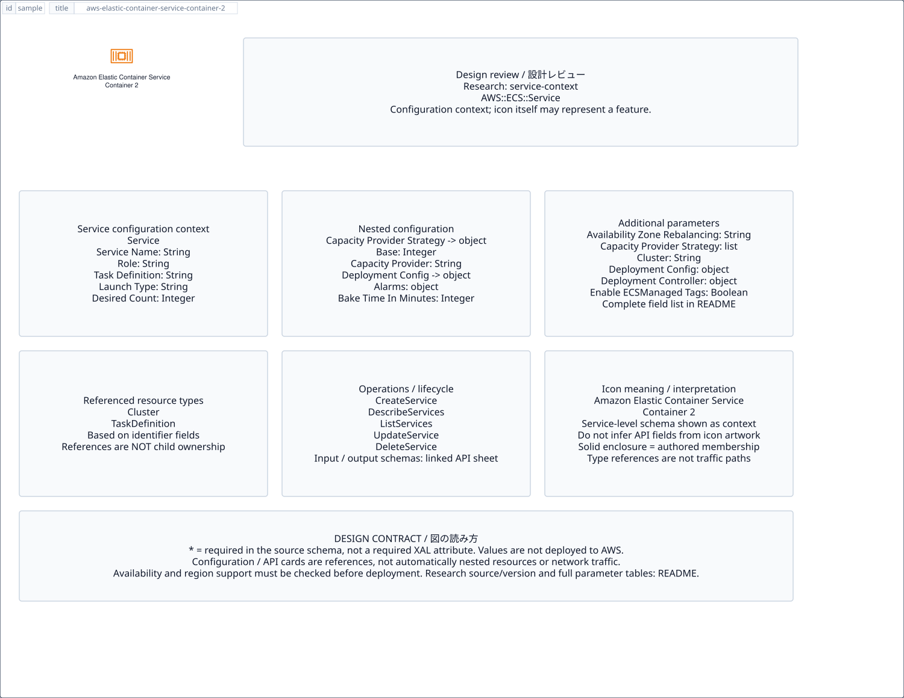

# `aws-elastic-container-service-container-2` — Amazon Elastic Container Service Container 2

[SVG preview](sample.svg) · [Editable XAL](sample.xal) · [Catalog](../README.md)



AWS resource icon. Use a label and explicit annotations to describe its role; scope is selected by the author.

- Kind: `resource`; category: Containers.
- Diagram scope: `logical` (recommendation, not AWS deployment validation).
- Default catalog ID: 1680. Covered catalog IDs: 1680.
- Implementation: V1 and V2; fixed AWS icon with a wrapped label and explicit functional annotations.

## Parameters

`id` is a required, unique connection ID, not a catalog number. `label`/`title`/`name` override the label; an empty label hides it. `size` > 0 defaults to 48 px. `label-width` > 0 defaults to 160 px (default box width, at least icon size + 12 px). Explicit `width`/`height` must contain the icon and label. `visible="false"` hides it. Children and icon overrides are not supported; use a group for containment.

`detail` adds a free-form diagram annotation. `show-details="false"` hides annotation text. Only supplied values are shown; none are sent to AWS. Service/resource annotations appear on separate wrapped lines.

| Parameter | Type | Meaning | Example |
|---|---|---|---|
| `workload` | text | Workload or process annotation | `Web application` |

## Review notes

The catalog provides a baseline for per-component development, not a simulation of the AWS control plane. This component's current functional parameters are the ones listed above. Additional service-specific visual behavior can be developed here without replacing catalog IDs in diagrams. Edit `sample.xal`, then run:

```sh
npm run generate:aws-samples -- --render --tag=aws-elastic-container-service-container-2
```

<!-- aws-functional-research:start -->
## 機能調査・構成デザイン（2026-09-06）

分類: `service-context`。サービス文脈: [`aws-elastic-container-service`](../aws-elastic-container-service/README.md)。

サンプルはアイコンと、設定・内包構造・関連リソース・操作を分離したレビューシートです。設定カードは編集可能な `rectangle`、グループは既存の専用タグで実装しています。カードのフィールド名を新しい XAL 属性として受理するわけではありません。専用タグが受理する属性は上の Parameters 表を参照してください。

実線の通信と、設定の参照・同じサービスに属する型一覧を区別します。スキーマの必須項目は AWS 側の仕様であり、図の必須入力ではありません。記載の構成モデル/API は取り込んだ公式資料の範囲であり、全リージョン・全機能の完全性や稼働可否を保証しません。

**重要:** このアイコンに対応する独立した構成リソースを断定せず、所属サービスの構成モデルを参考表示しています。アイコン名や絵柄から属性・親子関係・通信を推測しません。

### 構成モデル: `AWS::ECS::Service`

[公式リファレンス](https://docs.aws.amazon.com/AWSCloudFormation/latest/UserGuide/aws-resource-ecs-service.html)。全 27 プロパティを型付きで列挙します（表示カードには主要項目のみ）。

| Field | Type | Required in AWS schema |
|---|---|---|
| [AvailabilityZoneRebalancing](https://docs.aws.amazon.com/AWSCloudFormation/latest/UserGuide/aws-resource-ecs-service.html#cfn-ecs-service-availabilityzonerebalancing) | `String` | no |
| [CapacityProviderStrategy](https://docs.aws.amazon.com/AWSCloudFormation/latest/UserGuide/aws-resource-ecs-service.html#cfn-ecs-service-capacityproviderstrategy) | `List<CapacityProviderStrategyItem>` | no |
| [Cluster](https://docs.aws.amazon.com/AWSCloudFormation/latest/UserGuide/aws-resource-ecs-service.html#cfn-ecs-service-cluster) | `String` | no |
| [DeploymentConfiguration](https://docs.aws.amazon.com/AWSCloudFormation/latest/UserGuide/aws-resource-ecs-service.html#cfn-ecs-service-deploymentconfiguration) | `DeploymentConfiguration` | no |
| [DeploymentController](https://docs.aws.amazon.com/AWSCloudFormation/latest/UserGuide/aws-resource-ecs-service.html#cfn-ecs-service-deploymentcontroller) | `DeploymentController` | no |
| [DesiredCount](https://docs.aws.amazon.com/AWSCloudFormation/latest/UserGuide/aws-resource-ecs-service.html#cfn-ecs-service-desiredcount) | `Integer` | no |
| [EnableECSManagedTags](https://docs.aws.amazon.com/AWSCloudFormation/latest/UserGuide/aws-resource-ecs-service.html#cfn-ecs-service-enableecsmanagedtags) | `Boolean` | no |
| [EnableExecuteCommand](https://docs.aws.amazon.com/AWSCloudFormation/latest/UserGuide/aws-resource-ecs-service.html#cfn-ecs-service-enableexecutecommand) | `Boolean` | no |
| [ForceNewDeployment](https://docs.aws.amazon.com/AWSCloudFormation/latest/UserGuide/aws-resource-ecs-service.html#cfn-ecs-service-forcenewdeployment) | `ForceNewDeployment` | no |
| [HealthCheckGracePeriodSeconds](https://docs.aws.amazon.com/AWSCloudFormation/latest/UserGuide/aws-resource-ecs-service.html#cfn-ecs-service-healthcheckgraceperiodseconds) | `Integer` | no |
| [LaunchType](https://docs.aws.amazon.com/AWSCloudFormation/latest/UserGuide/aws-resource-ecs-service.html#cfn-ecs-service-launchtype) | `String` | no |
| [LoadBalancers](https://docs.aws.amazon.com/AWSCloudFormation/latest/UserGuide/aws-resource-ecs-service.html#cfn-ecs-service-loadbalancers) | `List<LoadBalancer>` | no |
| [Monitoring](https://docs.aws.amazon.com/AWSCloudFormation/latest/UserGuide/aws-resource-ecs-service.html#cfn-ecs-service-monitoring) | `MonitoringConfiguration` | no |
| [NetworkConfiguration](https://docs.aws.amazon.com/AWSCloudFormation/latest/UserGuide/aws-resource-ecs-service.html#cfn-ecs-service-networkconfiguration) | `NetworkConfiguration` | no |
| [PlacementConstraints](https://docs.aws.amazon.com/AWSCloudFormation/latest/UserGuide/aws-resource-ecs-service.html#cfn-ecs-service-placementconstraints) | `List<PlacementConstraint>` | no |
| [PlacementStrategies](https://docs.aws.amazon.com/AWSCloudFormation/latest/UserGuide/aws-resource-ecs-service.html#cfn-ecs-service-placementstrategies) | `List<PlacementStrategy>` | no |
| [PlatformVersion](https://docs.aws.amazon.com/AWSCloudFormation/latest/UserGuide/aws-resource-ecs-service.html#cfn-ecs-service-platformversion) | `String` | no |
| [PropagateTags](https://docs.aws.amazon.com/AWSCloudFormation/latest/UserGuide/aws-resource-ecs-service.html#cfn-ecs-service-propagatetags) | `String` | no |
| [Role](https://docs.aws.amazon.com/AWSCloudFormation/latest/UserGuide/aws-resource-ecs-service.html#cfn-ecs-service-role) | `String` | no |
| [SchedulingStrategy](https://docs.aws.amazon.com/AWSCloudFormation/latest/UserGuide/aws-resource-ecs-service.html#cfn-ecs-service-schedulingstrategy) | `String` | no |
| [ServiceConnectConfiguration](https://docs.aws.amazon.com/AWSCloudFormation/latest/UserGuide/aws-resource-ecs-service.html#cfn-ecs-service-serviceconnectconfiguration) | `ServiceConnectConfiguration` | no |
| [ServiceName](https://docs.aws.amazon.com/AWSCloudFormation/latest/UserGuide/aws-resource-ecs-service.html#cfn-ecs-service-servicename) | `String` | no |
| [ServiceRegistries](https://docs.aws.amazon.com/AWSCloudFormation/latest/UserGuide/aws-resource-ecs-service.html#cfn-ecs-service-serviceregistries) | `List<ServiceRegistry>` | no |
| [Tags](https://docs.aws.amazon.com/AWSCloudFormation/latest/UserGuide/aws-resource-ecs-service.html#cfn-ecs-service-tags) | `List<Tag>` | no |
| [TaskDefinition](https://docs.aws.amazon.com/AWSCloudFormation/latest/UserGuide/aws-resource-ecs-service.html#cfn-ecs-service-taskdefinition) | `String` | no |
| [VolumeConfigurations](https://docs.aws.amazon.com/AWSCloudFormation/latest/UserGuide/aws-resource-ecs-service.html#cfn-ecs-service-volumeconfigurations) | `List<ServiceVolumeConfiguration>` | no |
| [VpcLatticeConfigurations](https://docs.aws.amazon.com/AWSCloudFormation/latest/UserGuide/aws-resource-ecs-service.html#cfn-ecs-service-vpclatticeconfigurations) | `List<VpcLatticeConfiguration>` | no |

#### CapacityProviderStrategy → `AWS::ECS::Service.CapacityProviderStrategyItem`

| Field | Type | Required in AWS schema |
|---|---|---|
| [Base](https://docs.aws.amazon.com/AWSCloudFormation/latest/UserGuide/aws-properties-ecs-service-capacityproviderstrategyitem.html#cfn-ecs-service-capacityproviderstrategyitem-base) | `Integer` | no |
| [CapacityProvider](https://docs.aws.amazon.com/AWSCloudFormation/latest/UserGuide/aws-properties-ecs-service-capacityproviderstrategyitem.html#cfn-ecs-service-capacityproviderstrategyitem-capacityprovider) | `String` | no |
| [Weight](https://docs.aws.amazon.com/AWSCloudFormation/latest/UserGuide/aws-properties-ecs-service-capacityproviderstrategyitem.html#cfn-ecs-service-capacityproviderstrategyitem-weight) | `Integer` | no |

#### DeploymentConfiguration → `AWS::ECS::Service.DeploymentConfiguration`

| Field | Type | Required in AWS schema |
|---|---|---|
| [Alarms](https://docs.aws.amazon.com/AWSCloudFormation/latest/UserGuide/aws-properties-ecs-service-deploymentconfiguration.html#cfn-ecs-service-deploymentconfiguration-alarms) | `DeploymentAlarms` | no |
| [BakeTimeInMinutes](https://docs.aws.amazon.com/AWSCloudFormation/latest/UserGuide/aws-properties-ecs-service-deploymentconfiguration.html#cfn-ecs-service-deploymentconfiguration-baketimeinminutes) | `Integer` | no |
| [CanaryConfiguration](https://docs.aws.amazon.com/AWSCloudFormation/latest/UserGuide/aws-properties-ecs-service-deploymentconfiguration.html#cfn-ecs-service-deploymentconfiguration-canaryconfiguration) | `CanaryConfiguration` | no |
| [DeploymentCircuitBreaker](https://docs.aws.amazon.com/AWSCloudFormation/latest/UserGuide/aws-properties-ecs-service-deploymentconfiguration.html#cfn-ecs-service-deploymentconfiguration-deploymentcircuitbreaker) | `DeploymentCircuitBreaker` | no |
| [LifecycleHooks](https://docs.aws.amazon.com/AWSCloudFormation/latest/UserGuide/aws-properties-ecs-service-deploymentconfiguration.html#cfn-ecs-service-deploymentconfiguration-lifecyclehooks) | `List<DeploymentLifecycleHook>` | no |
| [LinearConfiguration](https://docs.aws.amazon.com/AWSCloudFormation/latest/UserGuide/aws-properties-ecs-service-deploymentconfiguration.html#cfn-ecs-service-deploymentconfiguration-linearconfiguration) | `LinearConfiguration` | no |
| [MaximumPercent](https://docs.aws.amazon.com/AWSCloudFormation/latest/UserGuide/aws-properties-ecs-service-deploymentconfiguration.html#cfn-ecs-service-deploymentconfiguration-maximumpercent) | `Integer` | no |
| [MinimumHealthyPercent](https://docs.aws.amazon.com/AWSCloudFormation/latest/UserGuide/aws-properties-ecs-service-deploymentconfiguration.html#cfn-ecs-service-deploymentconfiguration-minimumhealthypercent) | `Integer` | no |
| [Strategy](https://docs.aws.amazon.com/AWSCloudFormation/latest/UserGuide/aws-properties-ecs-service-deploymentconfiguration.html#cfn-ecs-service-deploymentconfiguration-strategy) | `String` | no |

#### DeploymentController → `AWS::ECS::Service.DeploymentController`

| Field | Type | Required in AWS schema |
|---|---|---|
| [Type](https://docs.aws.amazon.com/AWSCloudFormation/latest/UserGuide/aws-properties-ecs-service-deploymentcontroller.html#cfn-ecs-service-deploymentcontroller-type) | `String` | no |

#### ForceNewDeployment → `AWS::ECS::Service.ForceNewDeployment`

| Field | Type | Required in AWS schema |
|---|---|---|
| [EnableForceNewDeployment](https://docs.aws.amazon.com/AWSCloudFormation/latest/UserGuide/aws-properties-ecs-service-forcenewdeployment.html#cfn-ecs-service-forcenewdeployment-enableforcenewdeployment) | `Boolean` | yes |
| [ForceNewDeploymentNonce](https://docs.aws.amazon.com/AWSCloudFormation/latest/UserGuide/aws-properties-ecs-service-forcenewdeployment.html#cfn-ecs-service-forcenewdeployment-forcenewdeploymentnonce) | `String` | no |

#### LoadBalancers → `AWS::ECS::Service.LoadBalancer`

| Field | Type | Required in AWS schema |
|---|---|---|
| [AdvancedConfiguration](https://docs.aws.amazon.com/AWSCloudFormation/latest/UserGuide/aws-properties-ecs-service-loadbalancer.html#cfn-ecs-service-loadbalancer-advancedconfiguration) | `AdvancedConfiguration` | no |
| [ContainerName](https://docs.aws.amazon.com/AWSCloudFormation/latest/UserGuide/aws-properties-ecs-service-loadbalancer.html#cfn-ecs-service-loadbalancer-containername) | `String` | no |
| [ContainerPort](https://docs.aws.amazon.com/AWSCloudFormation/latest/UserGuide/aws-properties-ecs-service-loadbalancer.html#cfn-ecs-service-loadbalancer-containerport) | `Integer` | no |
| [LoadBalancerName](https://docs.aws.amazon.com/AWSCloudFormation/latest/UserGuide/aws-properties-ecs-service-loadbalancer.html#cfn-ecs-service-loadbalancer-loadbalancername) | `String` | no |
| [TargetGroupArn](https://docs.aws.amazon.com/AWSCloudFormation/latest/UserGuide/aws-properties-ecs-service-loadbalancer.html#cfn-ecs-service-loadbalancer-targetgrouparn) | `String` | no |

#### Monitoring → `AWS::ECS::Service.MonitoringConfiguration`

| Field | Type | Required in AWS schema |
|---|---|---|
| [MetricConfigurations](https://docs.aws.amazon.com/AWSCloudFormation/latest/UserGuide/aws-properties-ecs-service-monitoringconfiguration.html#cfn-ecs-service-monitoringconfiguration-metricconfigurations) | `List<MetricConfiguration>` | yes |

#### NetworkConfiguration → `AWS::ECS::Service.NetworkConfiguration`

| Field | Type | Required in AWS schema |
|---|---|---|
| [AwsvpcConfiguration](https://docs.aws.amazon.com/AWSCloudFormation/latest/UserGuide/aws-properties-ecs-service-networkconfiguration.html#cfn-ecs-service-networkconfiguration-awsvpcconfiguration) | `AwsVpcConfiguration` | no |

#### PlacementConstraints → `AWS::ECS::Service.PlacementConstraint`

| Field | Type | Required in AWS schema |
|---|---|---|
| [Expression](https://docs.aws.amazon.com/AWSCloudFormation/latest/UserGuide/aws-properties-ecs-service-placementconstraint.html#cfn-ecs-service-placementconstraint-expression) | `String` | no |
| [Type](https://docs.aws.amazon.com/AWSCloudFormation/latest/UserGuide/aws-properties-ecs-service-placementconstraint.html#cfn-ecs-service-placementconstraint-type) | `String` | yes |

#### PlacementStrategies → `AWS::ECS::Service.PlacementStrategy`

| Field | Type | Required in AWS schema |
|---|---|---|
| [Field](https://docs.aws.amazon.com/AWSCloudFormation/latest/UserGuide/aws-properties-ecs-service-placementstrategy.html#cfn-ecs-service-placementstrategy-field) | `String` | no |
| [Type](https://docs.aws.amazon.com/AWSCloudFormation/latest/UserGuide/aws-properties-ecs-service-placementstrategy.html#cfn-ecs-service-placementstrategy-type) | `String` | yes |

#### ServiceConnectConfiguration → `AWS::ECS::Service.ServiceConnectConfiguration`

| Field | Type | Required in AWS schema |
|---|---|---|
| [AccessLogConfiguration](https://docs.aws.amazon.com/AWSCloudFormation/latest/UserGuide/aws-properties-ecs-service-serviceconnectconfiguration.html#cfn-ecs-service-serviceconnectconfiguration-accesslogconfiguration) | `ServiceConnectAccessLogConfiguration` | no |
| [Enabled](https://docs.aws.amazon.com/AWSCloudFormation/latest/UserGuide/aws-properties-ecs-service-serviceconnectconfiguration.html#cfn-ecs-service-serviceconnectconfiguration-enabled) | `Boolean` | yes |
| [LogConfiguration](https://docs.aws.amazon.com/AWSCloudFormation/latest/UserGuide/aws-properties-ecs-service-serviceconnectconfiguration.html#cfn-ecs-service-serviceconnectconfiguration-logconfiguration) | `LogConfiguration` | no |
| [Namespace](https://docs.aws.amazon.com/AWSCloudFormation/latest/UserGuide/aws-properties-ecs-service-serviceconnectconfiguration.html#cfn-ecs-service-serviceconnectconfiguration-namespace) | `String` | no |
| [Services](https://docs.aws.amazon.com/AWSCloudFormation/latest/UserGuide/aws-properties-ecs-service-serviceconnectconfiguration.html#cfn-ecs-service-serviceconnectconfiguration-services) | `List<ServiceConnectService>` | no |

#### ServiceRegistries → `AWS::ECS::Service.ServiceRegistry`

| Field | Type | Required in AWS schema |
|---|---|---|
| [ContainerName](https://docs.aws.amazon.com/AWSCloudFormation/latest/UserGuide/aws-properties-ecs-service-serviceregistry.html#cfn-ecs-service-serviceregistry-containername) | `String` | no |
| [ContainerPort](https://docs.aws.amazon.com/AWSCloudFormation/latest/UserGuide/aws-properties-ecs-service-serviceregistry.html#cfn-ecs-service-serviceregistry-containerport) | `Integer` | no |
| [Port](https://docs.aws.amazon.com/AWSCloudFormation/latest/UserGuide/aws-properties-ecs-service-serviceregistry.html#cfn-ecs-service-serviceregistry-port) | `Integer` | no |
| [RegistryArn](https://docs.aws.amazon.com/AWSCloudFormation/latest/UserGuide/aws-properties-ecs-service-serviceregistry.html#cfn-ecs-service-serviceregistry-registryarn) | `String` | no |

#### VolumeConfigurations → `AWS::ECS::Service.ServiceVolumeConfiguration`

| Field | Type | Required in AWS schema |
|---|---|---|
| [ManagedEBSVolume](https://docs.aws.amazon.com/AWSCloudFormation/latest/UserGuide/aws-properties-ecs-service-servicevolumeconfiguration.html#cfn-ecs-service-servicevolumeconfiguration-managedebsvolume) | `ServiceManagedEBSVolumeConfiguration` | no |
| [Name](https://docs.aws.amazon.com/AWSCloudFormation/latest/UserGuide/aws-properties-ecs-service-servicevolumeconfiguration.html#cfn-ecs-service-servicevolumeconfiguration-name) | `String` | yes |

#### VpcLatticeConfigurations → `AWS::ECS::Service.VpcLatticeConfiguration`

| Field | Type | Required in AWS schema |
|---|---|---|
| [PortName](https://docs.aws.amazon.com/AWSCloudFormation/latest/UserGuide/aws-properties-ecs-service-vpclatticeconfiguration.html#cfn-ecs-service-vpclatticeconfiguration-portname) | `String` | yes |
| [RoleArn](https://docs.aws.amazon.com/AWSCloudFormation/latest/UserGuide/aws-properties-ecs-service-vpclatticeconfiguration.html#cfn-ecs-service-vpclatticeconfiguration-rolearn) | `String` | yes |
| [TargetGroupArn](https://docs.aws.amazon.com/AWSCloudFormation/latest/UserGuide/aws-properties-ecs-service-vpclatticeconfiguration.html#cfn-ecs-service-vpclatticeconfiguration-targetgrouparn) | `String` | yes |

### 関連する構成リソース（12 型）

同じサービス文脈の型一覧です。すべてがこのアイコンの子リソースという意味ではありません。さらに深い入れ子は [公式スキーマのスナップショット](../research/cloudformation-models.json) に記録しています。

- [AWS::ECS::CapacityProvider](https://docs.aws.amazon.com/AWSCloudFormation/latest/UserGuide/aws-resource-ecs-capacityprovider.html)
- [AWS::ECS::Cluster](https://docs.aws.amazon.com/AWSCloudFormation/latest/UserGuide/aws-resource-ecs-cluster.html)
- [AWS::ECS::ClusterCapacityProviderAssociations](https://docs.aws.amazon.com/AWSCloudFormation/latest/UserGuide/aws-resource-ecs-clustercapacityproviderassociations.html)
- [AWS::ECS::ContainerInstance](https://docs.aws.amazon.com/AWSCloudFormation/latest/UserGuide/aws-resource-ecs-containerinstance.html)
- [AWS::ECS::Daemon](https://docs.aws.amazon.com/AWSCloudFormation/latest/UserGuide/aws-resource-ecs-daemon.html)
- [AWS::ECS::DaemonTaskDefinition](https://docs.aws.amazon.com/AWSCloudFormation/latest/UserGuide/aws-resource-ecs-daemontaskdefinition.html)
- [AWS::ECS::ExpressGatewayService](https://docs.aws.amazon.com/AWSCloudFormation/latest/UserGuide/aws-resource-ecs-expressgatewayservice.html)
- [AWS::ECS::PrimaryTaskSet](https://docs.aws.amazon.com/AWSCloudFormation/latest/UserGuide/aws-resource-ecs-primarytaskset.html)
- [AWS::ECS::Service](https://docs.aws.amazon.com/AWSCloudFormation/latest/UserGuide/aws-resource-ecs-service.html)
- [AWS::ECS::Task](https://docs.aws.amazon.com/AWSCloudFormation/latest/UserGuide/aws-resource-ecs-task.html)
- [AWS::ECS::TaskDefinition](https://docs.aws.amazon.com/AWSCloudFormation/latest/UserGuide/aws-resource-ecs-taskdefinition.html)
- [AWS::ECS::TaskSet](https://docs.aws.amazon.com/AWSCloudFormation/latest/UserGuide/aws-resource-ecs-taskset.html)

### API の操作・パラメータ

- [Amazon EC2 Container Service: 77 操作の入力・出力一覧](../research/api/ecs.md)（API version 2014-11-13）

### 出典・調査範囲

- [公式資料 1](https://docs.aws.amazon.com/AWSCloudFormation/latest/UserGuide/aws-resource-ecs-service.html)
- [公式資料 2](https://github.com/boto/botocore/blob/develop/botocore/data/ecs/2014-11-13/service-2.json)

CloudFormation 仕様 263.0.0、AWS SDK 431 サービスモデルをオフラインで参照。取得日・元データの SHA-256 は [調査マニフェスト](../research/README.md) を参照。API モデル名・フィールド名は仕様から抽出し、説明本文を転載していません。利用可能性は全サービス一律には確認できないため、提供終了の確認がないものも「現在利用可能」と断定していません。

### 次の部品レビュー

- 本アイコンが独立したリソースか、機能・状態・デバイスの記号かを確認する。
- 詳細カードのうち専用の子タグ・参照属性として実装する範囲を選ぶ。
- 通信、制御、認証、監視の関係を分け、必要な接続点・配置制約を確認する。
- 編集後は `npm run generate:aws-samples -- --render --tag=aws-elastic-container-service-container-2`。通常の再描画は XAL/README を上書きしない。
<!-- aws-functional-research:end -->
