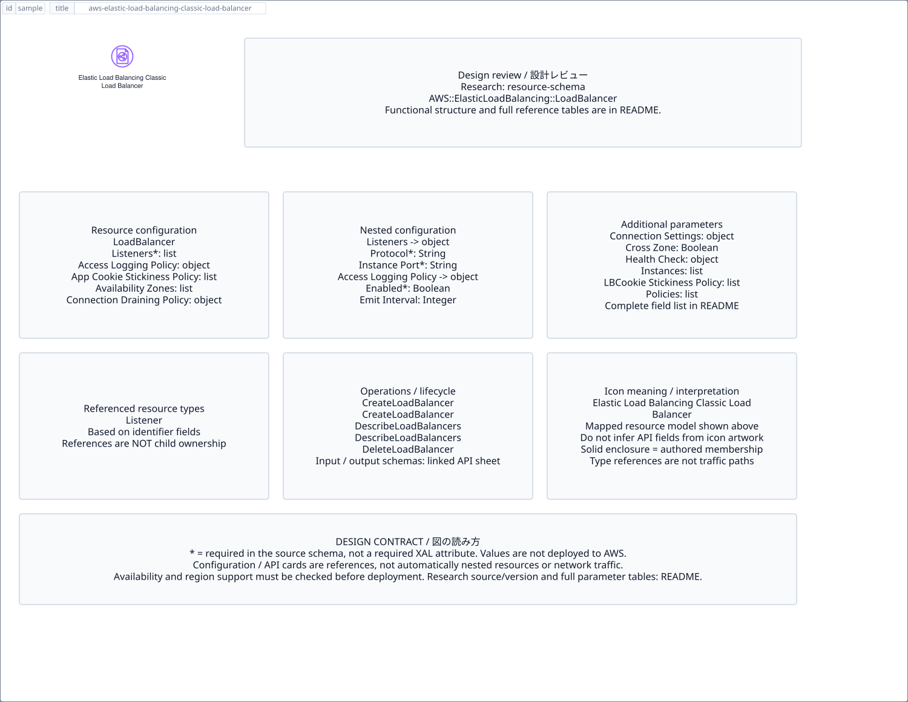

# `aws-elastic-load-balancing-classic-load-balancer` — Elastic Load Balancing Classic Load Balancer

[SVG preview](sample.svg) · [Editable XAL](sample.xal) · [Catalog](../README.md)



AWS resource icon. Use a label and explicit annotations to describe its role; scope is selected by the author.

- Kind: `resource`; category: Networking Content Delivery.
- Diagram scope: `logical` (recommendation, not AWS deployment validation).
- Default catalog ID: 1593. Covered catalog IDs: 1593.
- Implementation: V1 and V2; fixed AWS icon with a wrapped label and explicit functional annotations.

## Parameters

`id` is a required, unique connection ID, not a catalog number. `label`/`title`/`name` override the label; an empty label hides it. `size` > 0 defaults to 48 px. `label-width` > 0 defaults to 160 px (default box width, at least icon size + 12 px). Explicit `width`/`height` must contain the icon and label. `visible="false"` hides it. Children and icon overrides are not supported; use a group for containment.

`detail` adds a free-form diagram annotation. `show-details="false"` hides annotation text. Only supplied values are shown; none are sent to AWS. Service/resource annotations appear on separate wrapped lines.

| Parameter | Type | Meaning | Example |
|---|---|---|---|
| `traffic` | text | Traffic/protocol annotation | `HTTPS` |

## Review notes

The catalog provides a baseline for per-component development, not a simulation of the AWS control plane. This component's current functional parameters are the ones listed above. Additional service-specific visual behavior can be developed here without replacing catalog IDs in diagrams. Edit `sample.xal`, then run:

```sh
npm run generate:aws-samples -- --render --tag=aws-elastic-load-balancing-classic-load-balancer
```

<!-- aws-functional-research:start -->
## 機能調査・構成デザイン（2026-09-06）

分類: `resource-schema`。サービス文脈: [`aws-elastic-load-balancing`](../aws-elastic-load-balancing/README.md)。

サンプルはアイコンと、設定・内包構造・関連リソース・操作を分離したレビューシートです。設定カードは編集可能な `rectangle`、グループは既存の専用タグで実装しています。カードのフィールド名を新しい XAL 属性として受理するわけではありません。専用タグが受理する属性は上の Parameters 表を参照してください。

実線の通信と、設定の参照・同じサービスに属する型一覧を区別します。スキーマの必須項目は AWS 側の仕様であり、図の必須入力ではありません。記載の構成モデル/API は取り込んだ公式資料の範囲であり、全リージョン・全機能の完全性や稼働可否を保証しません。

### 構成モデル: `AWS::ElasticLoadBalancing::LoadBalancer`

[公式リファレンス](https://docs.aws.amazon.com/AWSCloudFormation/latest/UserGuide/aws-resource-elasticloadbalancing-loadbalancer.html)。全 16 プロパティを型付きで列挙します（表示カードには主要項目のみ）。

| Field | Type | Required in AWS schema |
|---|---|---|
| [AccessLoggingPolicy](https://docs.aws.amazon.com/AWSCloudFormation/latest/UserGuide/aws-resource-elasticloadbalancing-loadbalancer.html#cfn-elasticloadbalancing-loadbalancer-accessloggingpolicy) | `AccessLoggingPolicy` | no |
| [AppCookieStickinessPolicy](https://docs.aws.amazon.com/AWSCloudFormation/latest/UserGuide/aws-resource-elasticloadbalancing-loadbalancer.html#cfn-elasticloadbalancing-loadbalancer-appcookiestickinesspolicy) | `List<AppCookieStickinessPolicy>` | no |
| [AvailabilityZones](https://docs.aws.amazon.com/AWSCloudFormation/latest/UserGuide/aws-resource-elasticloadbalancing-loadbalancer.html#cfn-elasticloadbalancing-loadbalancer-availabilityzones) | `List<String>` | no |
| [ConnectionDrainingPolicy](https://docs.aws.amazon.com/AWSCloudFormation/latest/UserGuide/aws-resource-elasticloadbalancing-loadbalancer.html#cfn-elasticloadbalancing-loadbalancer-connectiondrainingpolicy) | `ConnectionDrainingPolicy` | no |
| [ConnectionSettings](https://docs.aws.amazon.com/AWSCloudFormation/latest/UserGuide/aws-resource-elasticloadbalancing-loadbalancer.html#cfn-elasticloadbalancing-loadbalancer-connectionsettings) | `ConnectionSettings` | no |
| [CrossZone](https://docs.aws.amazon.com/AWSCloudFormation/latest/UserGuide/aws-resource-elasticloadbalancing-loadbalancer.html#cfn-elasticloadbalancing-loadbalancer-crosszone) | `Boolean` | no |
| [HealthCheck](https://docs.aws.amazon.com/AWSCloudFormation/latest/UserGuide/aws-resource-elasticloadbalancing-loadbalancer.html#cfn-elasticloadbalancing-loadbalancer-healthcheck) | `HealthCheck` | no |
| [Instances](https://docs.aws.amazon.com/AWSCloudFormation/latest/UserGuide/aws-resource-elasticloadbalancing-loadbalancer.html#cfn-elasticloadbalancing-loadbalancer-instances) | `List<String>` | no |
| [LBCookieStickinessPolicy](https://docs.aws.amazon.com/AWSCloudFormation/latest/UserGuide/aws-resource-elasticloadbalancing-loadbalancer.html#cfn-elasticloadbalancing-loadbalancer-lbcookiestickinesspolicy) | `List<LBCookieStickinessPolicy>` | no |
| [Listeners](https://docs.aws.amazon.com/AWSCloudFormation/latest/UserGuide/aws-resource-elasticloadbalancing-loadbalancer.html#cfn-elasticloadbalancing-loadbalancer-listeners) | `List<Listeners>` | yes |
| [LoadBalancerName](https://docs.aws.amazon.com/AWSCloudFormation/latest/UserGuide/aws-resource-elasticloadbalancing-loadbalancer.html#cfn-elasticloadbalancing-loadbalancer-loadbalancername) | `String` | no |
| [Policies](https://docs.aws.amazon.com/AWSCloudFormation/latest/UserGuide/aws-resource-elasticloadbalancing-loadbalancer.html#cfn-elasticloadbalancing-loadbalancer-policies) | `List<Policies>` | no |
| [Scheme](https://docs.aws.amazon.com/AWSCloudFormation/latest/UserGuide/aws-resource-elasticloadbalancing-loadbalancer.html#cfn-elasticloadbalancing-loadbalancer-scheme) | `String` | no |
| [SecurityGroups](https://docs.aws.amazon.com/AWSCloudFormation/latest/UserGuide/aws-resource-elasticloadbalancing-loadbalancer.html#cfn-elasticloadbalancing-loadbalancer-securitygroups) | `List<String>` | no |
| [Subnets](https://docs.aws.amazon.com/AWSCloudFormation/latest/UserGuide/aws-resource-elasticloadbalancing-loadbalancer.html#cfn-elasticloadbalancing-loadbalancer-subnets) | `List<String>` | no |
| [Tags](https://docs.aws.amazon.com/AWSCloudFormation/latest/UserGuide/aws-resource-elasticloadbalancing-loadbalancer.html#cfn-elasticloadbalancing-loadbalancer-tags) | `List<Tag>` | no |

#### Listeners → `AWS::ElasticLoadBalancing::LoadBalancer.Listeners`

| Field | Type | Required in AWS schema |
|---|---|---|
| [InstancePort](https://docs.aws.amazon.com/AWSCloudFormation/latest/UserGuide/aws-properties-elasticloadbalancing-loadbalancer-listeners.html#cfn-elasticloadbalancing-loadbalancer-listeners-instanceport) | `String` | yes |
| [InstanceProtocol](https://docs.aws.amazon.com/AWSCloudFormation/latest/UserGuide/aws-properties-elasticloadbalancing-loadbalancer-listeners.html#cfn-elasticloadbalancing-loadbalancer-listeners-instanceprotocol) | `String` | no |
| [LoadBalancerPort](https://docs.aws.amazon.com/AWSCloudFormation/latest/UserGuide/aws-properties-elasticloadbalancing-loadbalancer-listeners.html#cfn-elasticloadbalancing-loadbalancer-listeners-loadbalancerport) | `String` | yes |
| [PolicyNames](https://docs.aws.amazon.com/AWSCloudFormation/latest/UserGuide/aws-properties-elasticloadbalancing-loadbalancer-listeners.html#cfn-elasticloadbalancing-loadbalancer-listeners-policynames) | `List<String>` | no |
| [Protocol](https://docs.aws.amazon.com/AWSCloudFormation/latest/UserGuide/aws-properties-elasticloadbalancing-loadbalancer-listeners.html#cfn-elasticloadbalancing-loadbalancer-listeners-protocol) | `String` | yes |
| [SSLCertificateId](https://docs.aws.amazon.com/AWSCloudFormation/latest/UserGuide/aws-properties-elasticloadbalancing-loadbalancer-listeners.html#cfn-elasticloadbalancing-loadbalancer-listeners-sslcertificateid) | `String` | no |

#### AccessLoggingPolicy → `AWS::ElasticLoadBalancing::LoadBalancer.AccessLoggingPolicy`

| Field | Type | Required in AWS schema |
|---|---|---|
| [EmitInterval](https://docs.aws.amazon.com/AWSCloudFormation/latest/UserGuide/aws-properties-elasticloadbalancing-loadbalancer-accessloggingpolicy.html#cfn-elasticloadbalancing-loadbalancer-accessloggingpolicy-emitinterval) | `Integer` | no |
| [Enabled](https://docs.aws.amazon.com/AWSCloudFormation/latest/UserGuide/aws-properties-elasticloadbalancing-loadbalancer-accessloggingpolicy.html#cfn-elasticloadbalancing-loadbalancer-accessloggingpolicy-enabled) | `Boolean` | yes |
| [S3BucketName](https://docs.aws.amazon.com/AWSCloudFormation/latest/UserGuide/aws-properties-elasticloadbalancing-loadbalancer-accessloggingpolicy.html#cfn-elasticloadbalancing-loadbalancer-accessloggingpolicy-s3bucketname) | `String` | yes |
| [S3BucketPrefix](https://docs.aws.amazon.com/AWSCloudFormation/latest/UserGuide/aws-properties-elasticloadbalancing-loadbalancer-accessloggingpolicy.html#cfn-elasticloadbalancing-loadbalancer-accessloggingpolicy-s3bucketprefix) | `String` | no |

#### AppCookieStickinessPolicy → `AWS::ElasticLoadBalancing::LoadBalancer.AppCookieStickinessPolicy`

| Field | Type | Required in AWS schema |
|---|---|---|
| [CookieName](https://docs.aws.amazon.com/AWSCloudFormation/latest/UserGuide/aws-properties-elasticloadbalancing-loadbalancer-appcookiestickinesspolicy.html#cfn-elasticloadbalancing-loadbalancer-appcookiestickinesspolicy-cookiename) | `String` | yes |
| [PolicyName](https://docs.aws.amazon.com/AWSCloudFormation/latest/UserGuide/aws-properties-elasticloadbalancing-loadbalancer-appcookiestickinesspolicy.html#cfn-elasticloadbalancing-loadbalancer-appcookiestickinesspolicy-policyname) | `String` | yes |

#### ConnectionDrainingPolicy → `AWS::ElasticLoadBalancing::LoadBalancer.ConnectionDrainingPolicy`

| Field | Type | Required in AWS schema |
|---|---|---|
| [Enabled](https://docs.aws.amazon.com/AWSCloudFormation/latest/UserGuide/aws-properties-elasticloadbalancing-loadbalancer-connectiondrainingpolicy.html#cfn-elasticloadbalancing-loadbalancer-connectiondrainingpolicy-enabled) | `Boolean` | yes |
| [Timeout](https://docs.aws.amazon.com/AWSCloudFormation/latest/UserGuide/aws-properties-elasticloadbalancing-loadbalancer-connectiondrainingpolicy.html#cfn-elasticloadbalancing-loadbalancer-connectiondrainingpolicy-timeout) | `Integer` | no |

#### ConnectionSettings → `AWS::ElasticLoadBalancing::LoadBalancer.ConnectionSettings`

| Field | Type | Required in AWS schema |
|---|---|---|
| [IdleTimeout](https://docs.aws.amazon.com/AWSCloudFormation/latest/UserGuide/aws-properties-elasticloadbalancing-loadbalancer-connectionsettings.html#cfn-elasticloadbalancing-loadbalancer-connectionsettings-idletimeout) | `Integer` | yes |

#### HealthCheck → `AWS::ElasticLoadBalancing::LoadBalancer.HealthCheck`

| Field | Type | Required in AWS schema |
|---|---|---|
| [HealthyThreshold](https://docs.aws.amazon.com/AWSCloudFormation/latest/UserGuide/aws-properties-elasticloadbalancing-loadbalancer-healthcheck.html#cfn-elasticloadbalancing-loadbalancer-healthcheck-healthythreshold) | `String` | yes |
| [Interval](https://docs.aws.amazon.com/AWSCloudFormation/latest/UserGuide/aws-properties-elasticloadbalancing-loadbalancer-healthcheck.html#cfn-elasticloadbalancing-loadbalancer-healthcheck-interval) | `String` | yes |
| [Target](https://docs.aws.amazon.com/AWSCloudFormation/latest/UserGuide/aws-properties-elasticloadbalancing-loadbalancer-healthcheck.html#cfn-elasticloadbalancing-loadbalancer-healthcheck-target) | `String` | yes |
| [Timeout](https://docs.aws.amazon.com/AWSCloudFormation/latest/UserGuide/aws-properties-elasticloadbalancing-loadbalancer-healthcheck.html#cfn-elasticloadbalancing-loadbalancer-healthcheck-timeout) | `String` | yes |
| [UnhealthyThreshold](https://docs.aws.amazon.com/AWSCloudFormation/latest/UserGuide/aws-properties-elasticloadbalancing-loadbalancer-healthcheck.html#cfn-elasticloadbalancing-loadbalancer-healthcheck-unhealthythreshold) | `String` | yes |

#### LBCookieStickinessPolicy → `AWS::ElasticLoadBalancing::LoadBalancer.LBCookieStickinessPolicy`

| Field | Type | Required in AWS schema |
|---|---|---|
| [CookieExpirationPeriod](https://docs.aws.amazon.com/AWSCloudFormation/latest/UserGuide/aws-properties-elasticloadbalancing-loadbalancer-lbcookiestickinesspolicy.html#cfn-elasticloadbalancing-loadbalancer-lbcookiestickinesspolicy-cookieexpirationperiod) | `String` | no |
| [PolicyName](https://docs.aws.amazon.com/AWSCloudFormation/latest/UserGuide/aws-properties-elasticloadbalancing-loadbalancer-lbcookiestickinesspolicy.html#cfn-elasticloadbalancing-loadbalancer-lbcookiestickinesspolicy-policyname) | `String` | no |

#### Policies → `AWS::ElasticLoadBalancing::LoadBalancer.Policies`

| Field | Type | Required in AWS schema |
|---|---|---|
| [Attributes](https://docs.aws.amazon.com/AWSCloudFormation/latest/UserGuide/aws-properties-elasticloadbalancing-loadbalancer-policies.html#cfn-elasticloadbalancing-loadbalancer-policies-attributes) | `List<PolicyItem>` | yes |
| [InstancePorts](https://docs.aws.amazon.com/AWSCloudFormation/latest/UserGuide/aws-properties-elasticloadbalancing-loadbalancer-policies.html#cfn-elasticloadbalancing-loadbalancer-policies-instanceports) | `List<String>` | no |
| [LoadBalancerPorts](https://docs.aws.amazon.com/AWSCloudFormation/latest/UserGuide/aws-properties-elasticloadbalancing-loadbalancer-policies.html#cfn-elasticloadbalancing-loadbalancer-policies-loadbalancerports) | `List<String>` | no |
| [PolicyName](https://docs.aws.amazon.com/AWSCloudFormation/latest/UserGuide/aws-properties-elasticloadbalancing-loadbalancer-policies.html#cfn-elasticloadbalancing-loadbalancer-policies-policyname) | `String` | yes |
| [PolicyType](https://docs.aws.amazon.com/AWSCloudFormation/latest/UserGuide/aws-properties-elasticloadbalancing-loadbalancer-policies.html#cfn-elasticloadbalancing-loadbalancer-policies-policytype) | `String` | yes |

### 関連する構成リソース（8 型）

同じサービス文脈の型一覧です。すべてがこのアイコンの子リソースという意味ではありません。さらに深い入れ子は [公式スキーマのスナップショット](../research/cloudformation-models.json) に記録しています。

- [AWS::ElasticLoadBalancing::LoadBalancer](https://docs.aws.amazon.com/AWSCloudFormation/latest/UserGuide/aws-resource-elasticloadbalancing-loadbalancer.html)
- [AWS::ElasticLoadBalancingV2::Listener](https://docs.aws.amazon.com/AWSCloudFormation/latest/UserGuide/aws-resource-elasticloadbalancingv2-listener.html)
- [AWS::ElasticLoadBalancingV2::ListenerCertificate](https://docs.aws.amazon.com/AWSCloudFormation/latest/UserGuide/aws-resource-elasticloadbalancingv2-listenercertificate.html)
- [AWS::ElasticLoadBalancingV2::ListenerRule](https://docs.aws.amazon.com/AWSCloudFormation/latest/UserGuide/aws-resource-elasticloadbalancingv2-listenerrule.html)
- [AWS::ElasticLoadBalancingV2::LoadBalancer](https://docs.aws.amazon.com/AWSCloudFormation/latest/UserGuide/aws-resource-elasticloadbalancingv2-loadbalancer.html)
- [AWS::ElasticLoadBalancingV2::TargetGroup](https://docs.aws.amazon.com/AWSCloudFormation/latest/UserGuide/aws-resource-elasticloadbalancingv2-targetgroup.html)
- [AWS::ElasticLoadBalancingV2::TrustStore](https://docs.aws.amazon.com/AWSCloudFormation/latest/UserGuide/aws-resource-elasticloadbalancingv2-truststore.html)
- [AWS::ElasticLoadBalancingV2::TrustStoreRevocation](https://docs.aws.amazon.com/AWSCloudFormation/latest/UserGuide/aws-resource-elasticloadbalancingv2-truststorerevocation.html)

### API の操作・パラメータ

- [Elastic Load Balancing: 51 操作の入力・出力一覧](../research/api/elbv2.md)（API version 2015-12-01）
- [Elastic Load Balancing: 29 操作の入力・出力一覧](../research/api/elb.md)（API version 2012-06-01）

### 出典・調査範囲

- [公式資料 1](https://docs.aws.amazon.com/AWSCloudFormation/latest/UserGuide/aws-resource-elasticloadbalancing-loadbalancer.html)
- [公式資料 2](https://github.com/boto/botocore/blob/develop/botocore/data/elbv2/2015-12-01/service-2.json)
- [公式資料 3](https://github.com/boto/botocore/blob/develop/botocore/data/elb/2012-06-01/service-2.json)

CloudFormation 仕様 263.0.0、AWS SDK 431 サービスモデルをオフラインで参照。取得日・元データの SHA-256 は [調査マニフェスト](../research/README.md) を参照。API モデル名・フィールド名は仕様から抽出し、説明本文を転載していません。利用可能性は全サービス一律には確認できないため、提供終了の確認がないものも「現在利用可能」と断定していません。

### 次の部品レビュー

- 本アイコンが独立したリソースか、機能・状態・デバイスの記号かを確認する。
- 詳細カードのうち専用の子タグ・参照属性として実装する範囲を選ぶ。
- 通信、制御、認証、監視の関係を分け、必要な接続点・配置制約を確認する。
- 編集後は `npm run generate:aws-samples -- --render --tag=aws-elastic-load-balancing-classic-load-balancer`。通常の再描画は XAL/README を上書きしない。
<!-- aws-functional-research:end -->
