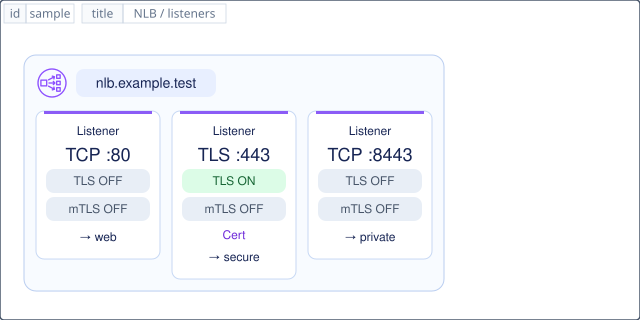

# `aws-elastic-load-balancing-network-load-balancer` — Elastic Load Balancing Network Load Balancer

[SVG preview](sample.svg) · [Editable XAL](sample.xal) · [Catalog](../README.md)



AWS resource icon. Use a label and explicit annotations to describe its role; scope is selected by the author.

- Kind: `resource`; category: Networking Content Delivery.
- Diagram scope: `logical` (recommendation, not AWS deployment validation).
- Default catalog ID: 1595. Covered catalog IDs: 1595.
- Implementation: V1/V2 icon-only form; V2 native component with domain header and aws-listener children (current preview).

## Parameters — icon-only form

`id` is a required, unique connection ID, not a catalog number. `label`/`title`/`name` override the label; an empty label hides it. `size` > 0 defaults to 48 px. `label-width` > 0 defaults to 160 px (default box width, at least icon size + 12 px). Explicit `width`/`height` must contain the icon and label. `visible="false"` hides it. Children and icon overrides are not supported; use a group for containment.

`detail` adds a free-form diagram annotation. `show-details="false"` hides annotation text. Only supplied values are shown; none are sent to AWS. Service/resource annotations appear on separate wrapped lines.

| Parameter | Type | Meaning | Example |
|---|---|---|---|
| `scheme` | `internet-facing` / `internal` | Load balancer reachability annotation | `internet-facing` |
| `ip-address-type` | `dualstack` / `ipv4` | Load balancer address family, not target IP | `dualstack` |
| `subnets` | text | Subnet/AZ or subnet-mapping summary | `subnet-a, subnet-b` |
| `security-groups` | text | Security group references | `sg-example` |
| `listener-protocol` | `TLS` / `TCP` / `UDP` / `TCP_UDP` / `QUIC` / `TCP_QUIC` | One illustrated listener; additional listeners use separate components | `TLS` |
| `listener-port` | port | Listener port (1..65535) | `443` |
| `certificate` | text | Server certificate reference; not a client CA bundle | `server-certificate` |
| `tls-policy` | text | Named security policy annotation; availability is not validated | `selected-policy` |
| `alpn-policy` | text | NLB TLS listener ALPN policy annotation | `HTTP2Preferred` |
| `client-ip-preservation` | boolean | Target-group client IP preservation annotation | `false` |
| `target-group` | text | Forward action target-group reference | `application-targets` |
| `target-type` | `ip` / `instance` / `alb` | Target registration type | `ip` |
| `target-protocol` | `TLS` / `TCP` / `UDP` / `TCP_UDP` / `QUIC` / `TCP_QUIC` | Backend protocol annotation, independent of the client connection | `TLS` |
| `target-port` | port | Backend target port (1..65535); omitted for Lambda | `8443` |
| `targets` | text | Registered instance IDs or IP:port references, not load-balancer IPs | `10.0.2.20:8443` |
| `health-check` | text | Protocol / port / path summary | `TCP:8443` |

## Review notes

The catalog provides a baseline for per-component development, not a simulation of the AWS control plane. This component's current functional parameters are the ones listed above. Additional service-specific visual behavior can be developed here without replacing catalog IDs in diagrams. Edit `sample.xal`, then run:

```sh
npm run generate:aws-samples -- --render --tag=aws-elastic-load-balancing-network-load-balancer
```

<!-- aws-functional-research:start -->
## 機能調査・構成デザイン（2026-09-06）

分類: `resource-schema`。サービス文脈: [`aws-elastic-load-balancing`](../aws-elastic-load-balancing/README.md)。

サンプルはアイコンと、設定・内包構造・関連リソース・操作を分離したレビューシートです。設定カードは編集可能な `rectangle`、グループは既存の専用タグで実装しています。カードのフィールド名を新しい XAL 属性として受理するわけではありません。専用タグが受理する属性は上の Parameters 表を参照してください。

実線の通信と、設定の参照・同じサービスに属する型一覧を区別します。スキーマの必須項目は AWS 側の仕様であり、図の必須入力ではありません。記載の構成モデル/API は取り込んだ公式資料の範囲であり、全リージョン・全機能の完全性や稼働可否を保証しません。

### コンパクトなネイティブ部品（V2）

[見出し非表示のSVG](hidden-title.svg) · [XAL](hidden-title.xal)：
`show-title="false"` は「Listener」だけを隠し、カードと外枠を自動縮小します。

現在の XAL/SVG は透かしなしの専用コンポーネントです。枠の左上に公式アイコンとドメインタグ、内部に `aws-listener` のポート/TLS/mTLS バッジを配置します。上の Parameters 表は従来の**アイコン単体形式**の属性です。新しい形式では `id`, `domain`, `view="component"`, `width/height`, 位置・余白・枠スタイルと、1〜32個のリスナーを受理します。

リスナーは `id`, `protocol`, `port` が必須。任意属性は `mtls`, `certificate`, `trust-store`, `target-group`, `backend-tls`, `backend-mtls`, `visible`, `show-title`。サイズは表示内容から自動計算し、TLS/mTLS は各1タグを縦並びにしてONを緑で表示します。既定の「Listener」見出しは `show-title="false"` で非表示にでき、余白も縮みます。TLS はリスナーのプロトコルから決まり、backend属性は転送先の設定情報として保持します（追加バッジなし）。ALB verify にはトラストストアが必要、NLB の mTLS は TCP パススルーで転送先が担当します。設定参照は存在/有効性を検証しません。

[全属性・制約・V1境界](../../../../xal/aws-resources.md#native-albnlb-components-v2)。リスナー ID に直接接続できます。ターゲットグループ等はまだ汎用矩形であり、全 AWS サービスがネイティブ実装になったわけではありません。専用設計は `external/engine/src/usc/aws/`、モデルは `external/engine/src/ent/model/aws/` で調整します。

### 専用の構成・接続例

#### TLS listener — termination example

- Protocol = TLS; Port = 443
- Certificates = server certificate ARN
- SslPolicy = selected TLS policy
- AlpnPolicy = chosen application policy
- Forward action -> TLS target group

#### TCP listener — alternate example

- Protocol = TCP; Port = 443
- Encrypted bytes pass through NLB
- No certificate / trust store at NLB
- Server certificate lives at the target
- Backend may implement mutual TLS

#### Target group / health

- TargetType = ip
- Protocol = TLS; Port = 8443
- Target = 10.0.2.20:8443
- Health check = TCP
- Target type choices: instance / ip / alb

#### Addressing / network

- SubnetMappings: SubnetId + AllocationId
- PrivateIPv4Address / IPv6Address
- Security groups: ingress + target access
- Client IP preservation / proxy protocol v2
- Cross-zone / deregistration delay

#### Listener and rule capabilities

- TCP, TLS, UDP, TCP_UDP
- QUIC, TCP_QUIC (current guide)
- Port range = 1..65535
- Weighted target-group forwarding
- Dualstack source-IP rules: IP version

#### Authentication boundary

- NLB TLS listeners do NOT terminate mTLS
- No ALB-style TrustStoreArn on NLB
- TCP passthrough keeps backend mTLS
- TLS target-group policy is separate
- Do not combine TLS and TCP TGs on TLS

追加の XAL/SVG ペアに通信経路と設定参照を描いています。NLB の TLS 終端と TCP パススルーは別構成であり、同じロードバランサーの同じポートに二つのリスナーを作る例ではありません。ALB のサーバー証明書とクライアント証明書用トラストストアは別概念です。

- termination: [XAL](termination.xal) / [SVG](termination.svg)
- passthrough: [XAL](passthrough.xal) / [SVG](passthrough.svg)

### 構成モデル: `AWS::ElasticLoadBalancingV2::LoadBalancer`

[公式リファレンス](https://docs.aws.amazon.com/AWSCloudFormation/latest/UserGuide/aws-resource-elasticloadbalancingv2-loadbalancer.html)。全 14 プロパティを型付きで列挙します（表示カードには主要項目のみ）。

| Field | Type | Required in AWS schema |
|---|---|---|
| [EnableCapacityReservationProvisionStabilize](https://docs.aws.amazon.com/AWSCloudFormation/latest/UserGuide/aws-resource-elasticloadbalancingv2-loadbalancer.html#cfn-elasticloadbalancingv2-loadbalancer-enablecapacityreservationprovisionstabilize) | `Boolean` | no |
| [EnablePrefixForIpv6SourceNat](https://docs.aws.amazon.com/AWSCloudFormation/latest/UserGuide/aws-resource-elasticloadbalancingv2-loadbalancer.html#cfn-elasticloadbalancingv2-loadbalancer-enableprefixforipv6sourcenat) | `String` | no |
| [EnforceSecurityGroupInboundRulesOnPrivateLinkTraffic](https://docs.aws.amazon.com/AWSCloudFormation/latest/UserGuide/aws-resource-elasticloadbalancingv2-loadbalancer.html#cfn-elasticloadbalancingv2-loadbalancer-enforcesecuritygroupinboundrulesonprivatelinktraffic) | `String` | no |
| [IpAddressType](https://docs.aws.amazon.com/AWSCloudFormation/latest/UserGuide/aws-resource-elasticloadbalancingv2-loadbalancer.html#cfn-elasticloadbalancingv2-loadbalancer-ipaddresstype) | `String` | no |
| [Ipv4IpamPoolId](https://docs.aws.amazon.com/AWSCloudFormation/latest/UserGuide/aws-resource-elasticloadbalancingv2-loadbalancer.html#cfn-elasticloadbalancingv2-loadbalancer-ipv4ipampoolid) | `String` | no |
| [LoadBalancerAttributes](https://docs.aws.amazon.com/AWSCloudFormation/latest/UserGuide/aws-resource-elasticloadbalancingv2-loadbalancer.html#cfn-elasticloadbalancingv2-loadbalancer-loadbalancerattributes) | `List<LoadBalancerAttribute>` | no |
| [MinimumLoadBalancerCapacity](https://docs.aws.amazon.com/AWSCloudFormation/latest/UserGuide/aws-resource-elasticloadbalancingv2-loadbalancer.html#cfn-elasticloadbalancingv2-loadbalancer-minimumloadbalancercapacity) | `MinimumLoadBalancerCapacity` | no |
| [Name](https://docs.aws.amazon.com/AWSCloudFormation/latest/UserGuide/aws-resource-elasticloadbalancingv2-loadbalancer.html#cfn-elasticloadbalancingv2-loadbalancer-name) | `String` | no |
| [Scheme](https://docs.aws.amazon.com/AWSCloudFormation/latest/UserGuide/aws-resource-elasticloadbalancingv2-loadbalancer.html#cfn-elasticloadbalancingv2-loadbalancer-scheme) | `String` | no |
| [SecurityGroups](https://docs.aws.amazon.com/AWSCloudFormation/latest/UserGuide/aws-resource-elasticloadbalancingv2-loadbalancer.html#cfn-elasticloadbalancingv2-loadbalancer-securitygroups) | `List<String>` | no |
| [SubnetMappings](https://docs.aws.amazon.com/AWSCloudFormation/latest/UserGuide/aws-resource-elasticloadbalancingv2-loadbalancer.html#cfn-elasticloadbalancingv2-loadbalancer-subnetmappings) | `List<SubnetMapping>` | no |
| [Subnets](https://docs.aws.amazon.com/AWSCloudFormation/latest/UserGuide/aws-resource-elasticloadbalancingv2-loadbalancer.html#cfn-elasticloadbalancingv2-loadbalancer-subnets) | `List<String>` | no |
| [Tags](https://docs.aws.amazon.com/AWSCloudFormation/latest/UserGuide/aws-resource-elasticloadbalancingv2-loadbalancer.html#cfn-elasticloadbalancingv2-loadbalancer-tags) | `List<Tag>` | no |
| [Type](https://docs.aws.amazon.com/AWSCloudFormation/latest/UserGuide/aws-resource-elasticloadbalancingv2-loadbalancer.html#cfn-elasticloadbalancingv2-loadbalancer-type) | `String` | no |

#### LoadBalancerAttributes → `AWS::ElasticLoadBalancingV2::LoadBalancer.LoadBalancerAttribute`

| Field | Type | Required in AWS schema |
|---|---|---|
| [Key](https://docs.aws.amazon.com/AWSCloudFormation/latest/UserGuide/aws-properties-elasticloadbalancingv2-loadbalancer-loadbalancerattribute.html#cfn-elasticloadbalancingv2-loadbalancer-loadbalancerattribute-key) | `String` | no |
| [Value](https://docs.aws.amazon.com/AWSCloudFormation/latest/UserGuide/aws-properties-elasticloadbalancingv2-loadbalancer-loadbalancerattribute.html#cfn-elasticloadbalancingv2-loadbalancer-loadbalancerattribute-value) | `String` | no |

#### MinimumLoadBalancerCapacity → `AWS::ElasticLoadBalancingV2::LoadBalancer.MinimumLoadBalancerCapacity`

| Field | Type | Required in AWS schema |
|---|---|---|
| [CapacityUnits](https://docs.aws.amazon.com/AWSCloudFormation/latest/UserGuide/aws-properties-elasticloadbalancingv2-loadbalancer-minimumloadbalancercapacity.html#cfn-elasticloadbalancingv2-loadbalancer-minimumloadbalancercapacity-capacityunits) | `Integer` | yes |

#### SubnetMappings → `AWS::ElasticLoadBalancingV2::LoadBalancer.SubnetMapping`

| Field | Type | Required in AWS schema |
|---|---|---|
| [AllocationId](https://docs.aws.amazon.com/AWSCloudFormation/latest/UserGuide/aws-properties-elasticloadbalancingv2-loadbalancer-subnetmapping.html#cfn-elasticloadbalancingv2-loadbalancer-subnetmapping-allocationid) | `String` | no |
| [IPv6Address](https://docs.aws.amazon.com/AWSCloudFormation/latest/UserGuide/aws-properties-elasticloadbalancingv2-loadbalancer-subnetmapping.html#cfn-elasticloadbalancingv2-loadbalancer-subnetmapping-ipv6address) | `String` | no |
| [PrivateIPv4Address](https://docs.aws.amazon.com/AWSCloudFormation/latest/UserGuide/aws-properties-elasticloadbalancingv2-loadbalancer-subnetmapping.html#cfn-elasticloadbalancingv2-loadbalancer-subnetmapping-privateipv4address) | `String` | no |
| [SourceNatIpv6Prefix](https://docs.aws.amazon.com/AWSCloudFormation/latest/UserGuide/aws-properties-elasticloadbalancingv2-loadbalancer-subnetmapping.html#cfn-elasticloadbalancingv2-loadbalancer-subnetmapping-sourcenatipv6prefix) | `String` | no |
| [SubnetId](https://docs.aws.amazon.com/AWSCloudFormation/latest/UserGuide/aws-properties-elasticloadbalancingv2-loadbalancer-subnetmapping.html#cfn-elasticloadbalancingv2-loadbalancer-subnetmapping-subnetid) | `String` | yes |

### 関連する構成リソース（8 型）

同じサービス文脈の型一覧です。すべてがこのアイコンの子リソースという意味ではありません。さらに深い入れ子は [公式スキーマのスナップショット](../research/cloudformation-models.json) に記録しています。

- [AWS::ElasticLoadBalancingV2::LoadBalancer](https://docs.aws.amazon.com/AWSCloudFormation/latest/UserGuide/aws-resource-elasticloadbalancingv2-loadbalancer.html)
- [AWS::ElasticLoadBalancingV2::Listener](https://docs.aws.amazon.com/AWSCloudFormation/latest/UserGuide/aws-resource-elasticloadbalancingv2-listener.html)
- [AWS::ElasticLoadBalancingV2::TargetGroup](https://docs.aws.amazon.com/AWSCloudFormation/latest/UserGuide/aws-resource-elasticloadbalancingv2-targetgroup.html)
- [AWS::ElasticLoadBalancing::LoadBalancer](https://docs.aws.amazon.com/AWSCloudFormation/latest/UserGuide/aws-resource-elasticloadbalancing-loadbalancer.html)
- [AWS::ElasticLoadBalancingV2::ListenerCertificate](https://docs.aws.amazon.com/AWSCloudFormation/latest/UserGuide/aws-resource-elasticloadbalancingv2-listenercertificate.html)
- [AWS::ElasticLoadBalancingV2::ListenerRule](https://docs.aws.amazon.com/AWSCloudFormation/latest/UserGuide/aws-resource-elasticloadbalancingv2-listenerrule.html)
- [AWS::ElasticLoadBalancingV2::TrustStore](https://docs.aws.amazon.com/AWSCloudFormation/latest/UserGuide/aws-resource-elasticloadbalancingv2-truststore.html)
- [AWS::ElasticLoadBalancingV2::TrustStoreRevocation](https://docs.aws.amazon.com/AWSCloudFormation/latest/UserGuide/aws-resource-elasticloadbalancingv2-truststorerevocation.html)

### API の操作・パラメータ

- [Elastic Load Balancing: 51 操作の入力・出力一覧](../research/api/elbv2.md)（API version 2015-12-01）
- [Elastic Load Balancing: 29 操作の入力・出力一覧](../research/api/elb.md)（API version 2012-06-01）

### 出典・調査範囲

- [公式資料 1](https://docs.aws.amazon.com/AWSCloudFormation/latest/UserGuide/aws-resource-elasticloadbalancingv2-loadbalancer.html)
- [公式資料 2](https://github.com/boto/botocore/blob/develop/botocore/data/elbv2/2015-12-01/service-2.json)
- [公式資料 3](https://github.com/boto/botocore/blob/develop/botocore/data/elb/2012-06-01/service-2.json)
- [公式資料 4](https://docs.aws.amazon.com/elasticloadbalancing/latest/network/load-balancer-listeners.html)
- [公式資料 5](https://docs.aws.amazon.com/elasticloadbalancing/latest/network/load-balancer-target-groups.html)
- [公式資料 6](https://docs.aws.amazon.com/elasticloadbalancing/latest/network/tls-listener-certificates.html)
- [公式資料 7](https://docs.aws.amazon.com/elasticloadbalancing/latest/network/network-load-balancers.html)

CloudFormation 仕様 263.0.0、AWS SDK 431 サービスモデルをオフラインで参照。取得日・元データの SHA-256 は [調査マニフェスト](../research/README.md) を参照。API モデル名・フィールド名は仕様から抽出し、説明本文を転載していません。利用可能性は全サービス一律には確認できないため、提供終了の確認がないものも「現在利用可能」と断定していません。

### 次の部品レビュー

- 本アイコンが独立したリソースか、機能・状態・デバイスの記号かを確認する。
- 詳細カードのうち専用の子タグ・参照属性として実装する範囲を選ぶ。
- 通信、制御、認証、監視の関係を分け、必要な接続点・配置制約を確認する。
- 編集後は `npm run generate:aws-samples -- --render --tag=aws-elastic-load-balancing-network-load-balancer`。通常の再描画は XAL/README を上書きしない。
<!-- aws-functional-research:end -->
