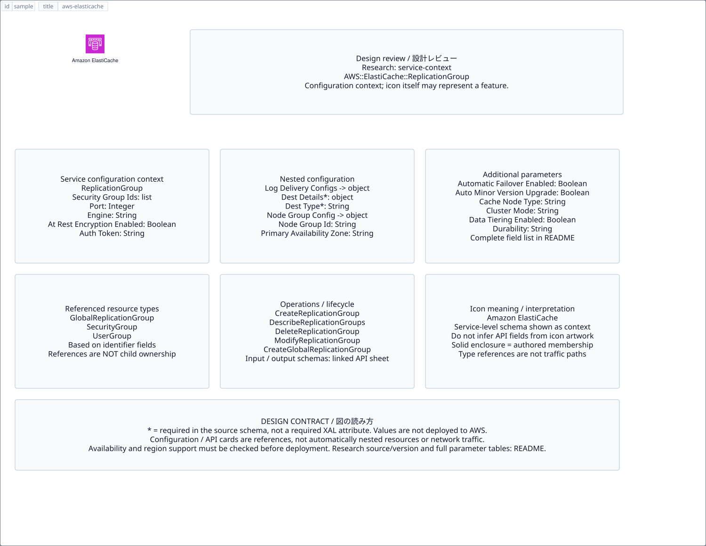

# `aws-elasticache` — Amazon ElastiCache

[SVG preview](sample.svg) · [Editable XAL](sample.xal) · [Catalog](../README.md)



AWS service icon. Use a label and explicit annotations to describe its role; scope is selected by the author.

- Kind: `service`; category: Database.
- Diagram scope: `service` (recommendation, not AWS deployment validation).
- Default catalog ID: 146. Covered catalog IDs: 113, 124, 135, 146.
- Implementation: V1 and V2; fixed AWS icon with a wrapped label and explicit functional annotations.

## Parameters

`id` is a required, unique connection ID, not a catalog number. `label`/`title`/`name` override the label; an empty label hides it. `size` > 0 defaults to 48 px. `label-width` > 0 defaults to 160 px (default box width, at least icon size + 12 px). Explicit `width`/`height` must contain the icon and label. `visible="false"` hides it. Children and icon overrides are not supported; use a group for containment.

`detail` adds a free-form diagram annotation. `show-details="false"` hides annotation text. Only supplied values are shown; none are sent to AWS. Service/resource annotations appear on separate wrapped lines.

| Parameter | Type | Meaning | Example |
|---|---|---|---|
| `data-model` | text | Data model annotation | `Application records` |

## Review notes

The catalog provides a baseline for per-component development, not a simulation of the AWS control plane. This component's current functional parameters are the ones listed above. Additional service-specific visual behavior can be developed here without replacing catalog IDs in diagrams. Edit `sample.xal`, then run:

```sh
npm run generate:aws-samples -- --render --tag=aws-elasticache
```

<!-- aws-functional-research:start -->
## 機能調査・構成デザイン（2026-09-06）

分類: `service-context`。サービス文脈: [`aws-elasticache`](../aws-elasticache/README.md)。

サンプルはアイコンと、設定・内包構造・関連リソース・操作を分離したレビューシートです。設定カードは編集可能な `rectangle`、グループは既存の専用タグで実装しています。カードのフィールド名を新しい XAL 属性として受理するわけではありません。専用タグが受理する属性は上の Parameters 表を参照してください。

実線の通信と、設定の参照・同じサービスに属する型一覧を区別します。スキーマの必須項目は AWS 側の仕様であり、図の必須入力ではありません。記載の構成モデル/API は取り込んだ公式資料の範囲であり、全リージョン・全機能の完全性や稼働可否を保証しません。

**重要:** このアイコンに対応する独立した構成リソースを断定せず、所属サービスの構成モデルを参考表示しています。アイコン名や絵柄から属性・親子関係・通信を推測しません。

### 構成モデル: `AWS::ElastiCache::ReplicationGroup`

[公式リファレンス](https://docs.aws.amazon.com/AWSCloudFormation/latest/UserGuide/aws-resource-elasticache-replicationgroup.html)。全 39 プロパティを型付きで列挙します（表示カードには主要項目のみ）。

| Field | Type | Required in AWS schema |
|---|---|---|
| [AtRestEncryptionEnabled](https://docs.aws.amazon.com/AWSCloudFormation/latest/UserGuide/aws-resource-elasticache-replicationgroup.html#cfn-elasticache-replicationgroup-atrestencryptionenabled) | `Boolean` | no |
| [AuthToken](https://docs.aws.amazon.com/AWSCloudFormation/latest/UserGuide/aws-resource-elasticache-replicationgroup.html#cfn-elasticache-replicationgroup-authtoken) | `String` | no |
| [AutomaticFailoverEnabled](https://docs.aws.amazon.com/AWSCloudFormation/latest/UserGuide/aws-resource-elasticache-replicationgroup.html#cfn-elasticache-replicationgroup-automaticfailoverenabled) | `Boolean` | no |
| [AutoMinorVersionUpgrade](https://docs.aws.amazon.com/AWSCloudFormation/latest/UserGuide/aws-resource-elasticache-replicationgroup.html#cfn-elasticache-replicationgroup-autominorversionupgrade) | `Boolean` | no |
| [CacheNodeType](https://docs.aws.amazon.com/AWSCloudFormation/latest/UserGuide/aws-resource-elasticache-replicationgroup.html#cfn-elasticache-replicationgroup-cachenodetype) | `String` | no |
| [CacheParameterGroupName](https://docs.aws.amazon.com/AWSCloudFormation/latest/UserGuide/aws-resource-elasticache-replicationgroup.html#cfn-elasticache-replicationgroup-cacheparametergroupname) | `String` | no |
| [CacheSubnetGroupName](https://docs.aws.amazon.com/AWSCloudFormation/latest/UserGuide/aws-resource-elasticache-replicationgroup.html#cfn-elasticache-replicationgroup-cachesubnetgroupname) | `String` | no |
| [ClusterMode](https://docs.aws.amazon.com/AWSCloudFormation/latest/UserGuide/aws-resource-elasticache-replicationgroup.html#cfn-elasticache-replicationgroup-clustermode) | `String` | no |
| [DataTieringEnabled](https://docs.aws.amazon.com/AWSCloudFormation/latest/UserGuide/aws-resource-elasticache-replicationgroup.html#cfn-elasticache-replicationgroup-datatieringenabled) | `Boolean` | no |
| [Durability](https://docs.aws.amazon.com/AWSCloudFormation/latest/UserGuide/aws-resource-elasticache-replicationgroup.html#cfn-elasticache-replicationgroup-durability) | `String` | no |
| [Engine](https://docs.aws.amazon.com/AWSCloudFormation/latest/UserGuide/aws-resource-elasticache-replicationgroup.html#cfn-elasticache-replicationgroup-engine) | `String` | no |
| [EngineVersion](https://docs.aws.amazon.com/AWSCloudFormation/latest/UserGuide/aws-resource-elasticache-replicationgroup.html#cfn-elasticache-replicationgroup-engineversion) | `String` | no |
| [GlobalReplicationGroupId](https://docs.aws.amazon.com/AWSCloudFormation/latest/UserGuide/aws-resource-elasticache-replicationgroup.html#cfn-elasticache-replicationgroup-globalreplicationgroupid) | `String` | no |
| [IpDiscovery](https://docs.aws.amazon.com/AWSCloudFormation/latest/UserGuide/aws-resource-elasticache-replicationgroup.html#cfn-elasticache-replicationgroup-ipdiscovery) | `String` | no |
| [KmsKeyId](https://docs.aws.amazon.com/AWSCloudFormation/latest/UserGuide/aws-resource-elasticache-replicationgroup.html#cfn-elasticache-replicationgroup-kmskeyid) | `String` | no |
| [LogDeliveryConfigurations](https://docs.aws.amazon.com/AWSCloudFormation/latest/UserGuide/aws-resource-elasticache-replicationgroup.html#cfn-elasticache-replicationgroup-logdeliveryconfigurations) | `List<LogDeliveryConfigurationRequest>` | no |
| [MultiAZEnabled](https://docs.aws.amazon.com/AWSCloudFormation/latest/UserGuide/aws-resource-elasticache-replicationgroup.html#cfn-elasticache-replicationgroup-multiazenabled) | `Boolean` | no |
| [NetworkType](https://docs.aws.amazon.com/AWSCloudFormation/latest/UserGuide/aws-resource-elasticache-replicationgroup.html#cfn-elasticache-replicationgroup-networktype) | `String` | no |
| [NodeGroupConfiguration](https://docs.aws.amazon.com/AWSCloudFormation/latest/UserGuide/aws-resource-elasticache-replicationgroup.html#cfn-elasticache-replicationgroup-nodegroupconfiguration) | `List<NodeGroupConfiguration>` | no |
| [NotificationTopicArn](https://docs.aws.amazon.com/AWSCloudFormation/latest/UserGuide/aws-resource-elasticache-replicationgroup.html#cfn-elasticache-replicationgroup-notificationtopicarn) | `String` | no |
| [NumCacheClusters](https://docs.aws.amazon.com/AWSCloudFormation/latest/UserGuide/aws-resource-elasticache-replicationgroup.html#cfn-elasticache-replicationgroup-numcacheclusters) | `Integer` | no |
| [NumNodeGroups](https://docs.aws.amazon.com/AWSCloudFormation/latest/UserGuide/aws-resource-elasticache-replicationgroup.html#cfn-elasticache-replicationgroup-numnodegroups) | `Integer` | no |
| [Port](https://docs.aws.amazon.com/AWSCloudFormation/latest/UserGuide/aws-resource-elasticache-replicationgroup.html#cfn-elasticache-replicationgroup-port) | `Integer` | no |
| [PreferredCacheClusterAZs](https://docs.aws.amazon.com/AWSCloudFormation/latest/UserGuide/aws-resource-elasticache-replicationgroup.html#cfn-elasticache-replicationgroup-preferredcacheclusterazs) | `List<String>` | no |
| [PreferredMaintenanceWindow](https://docs.aws.amazon.com/AWSCloudFormation/latest/UserGuide/aws-resource-elasticache-replicationgroup.html#cfn-elasticache-replicationgroup-preferredmaintenancewindow) | `String` | no |
| [PrimaryClusterId](https://docs.aws.amazon.com/AWSCloudFormation/latest/UserGuide/aws-resource-elasticache-replicationgroup.html#cfn-elasticache-replicationgroup-primaryclusterid) | `String` | no |
| [ReplicasPerNodeGroup](https://docs.aws.amazon.com/AWSCloudFormation/latest/UserGuide/aws-resource-elasticache-replicationgroup.html#cfn-elasticache-replicationgroup-replicaspernodegroup) | `Integer` | no |
| [ReplicationGroupDescription](https://docs.aws.amazon.com/AWSCloudFormation/latest/UserGuide/aws-resource-elasticache-replicationgroup.html#cfn-elasticache-replicationgroup-replicationgroupdescription) | `String` | yes |
| [ReplicationGroupId](https://docs.aws.amazon.com/AWSCloudFormation/latest/UserGuide/aws-resource-elasticache-replicationgroup.html#cfn-elasticache-replicationgroup-replicationgroupid) | `String` | no |
| [SecurityGroupIds](https://docs.aws.amazon.com/AWSCloudFormation/latest/UserGuide/aws-resource-elasticache-replicationgroup.html#cfn-elasticache-replicationgroup-securitygroupids) | `List<String>` | no |
| [SnapshotArns](https://docs.aws.amazon.com/AWSCloudFormation/latest/UserGuide/aws-resource-elasticache-replicationgroup.html#cfn-elasticache-replicationgroup-snapshotarns) | `List<String>` | no |
| [SnapshotName](https://docs.aws.amazon.com/AWSCloudFormation/latest/UserGuide/aws-resource-elasticache-replicationgroup.html#cfn-elasticache-replicationgroup-snapshotname) | `String` | no |
| [SnapshotRetentionLimit](https://docs.aws.amazon.com/AWSCloudFormation/latest/UserGuide/aws-resource-elasticache-replicationgroup.html#cfn-elasticache-replicationgroup-snapshotretentionlimit) | `Integer` | no |
| [SnapshottingClusterId](https://docs.aws.amazon.com/AWSCloudFormation/latest/UserGuide/aws-resource-elasticache-replicationgroup.html#cfn-elasticache-replicationgroup-snapshottingclusterid) | `String` | no |
| [SnapshotWindow](https://docs.aws.amazon.com/AWSCloudFormation/latest/UserGuide/aws-resource-elasticache-replicationgroup.html#cfn-elasticache-replicationgroup-snapshotwindow) | `String` | no |
| [Tags](https://docs.aws.amazon.com/AWSCloudFormation/latest/UserGuide/aws-resource-elasticache-replicationgroup.html#cfn-elasticache-replicationgroup-tags) | `List<Tag>` | no |
| [TransitEncryptionEnabled](https://docs.aws.amazon.com/AWSCloudFormation/latest/UserGuide/aws-resource-elasticache-replicationgroup.html#cfn-elasticache-replicationgroup-transitencryptionenabled) | `Boolean` | no |
| [TransitEncryptionMode](https://docs.aws.amazon.com/AWSCloudFormation/latest/UserGuide/aws-resource-elasticache-replicationgroup.html#cfn-elasticache-replicationgroup-transitencryptionmode) | `String` | no |
| [UserGroupIds](https://docs.aws.amazon.com/AWSCloudFormation/latest/UserGuide/aws-resource-elasticache-replicationgroup.html#cfn-elasticache-replicationgroup-usergroupids) | `List<String>` | no |

#### LogDeliveryConfigurations → `AWS::ElastiCache::ReplicationGroup.LogDeliveryConfigurationRequest`

| Field | Type | Required in AWS schema |
|---|---|---|
| [DestinationDetails](https://docs.aws.amazon.com/AWSCloudFormation/latest/UserGuide/aws-properties-elasticache-replicationgroup-logdeliveryconfigurationrequest.html#cfn-elasticache-replicationgroup-logdeliveryconfigurationrequest-destinationdetails) | `DestinationDetails` | yes |
| [DestinationType](https://docs.aws.amazon.com/AWSCloudFormation/latest/UserGuide/aws-properties-elasticache-replicationgroup-logdeliveryconfigurationrequest.html#cfn-elasticache-replicationgroup-logdeliveryconfigurationrequest-destinationtype) | `String` | yes |
| [LogFormat](https://docs.aws.amazon.com/AWSCloudFormation/latest/UserGuide/aws-properties-elasticache-replicationgroup-logdeliveryconfigurationrequest.html#cfn-elasticache-replicationgroup-logdeliveryconfigurationrequest-logformat) | `String` | yes |
| [LogType](https://docs.aws.amazon.com/AWSCloudFormation/latest/UserGuide/aws-properties-elasticache-replicationgroup-logdeliveryconfigurationrequest.html#cfn-elasticache-replicationgroup-logdeliveryconfigurationrequest-logtype) | `String` | yes |

#### NodeGroupConfiguration → `AWS::ElastiCache::ReplicationGroup.NodeGroupConfiguration`

| Field | Type | Required in AWS schema |
|---|---|---|
| [NodeGroupId](https://docs.aws.amazon.com/AWSCloudFormation/latest/UserGuide/aws-properties-elasticache-replicationgroup-nodegroupconfiguration.html#cfn-elasticache-replicationgroup-nodegroupconfiguration-nodegroupid) | `String` | no |
| [PrimaryAvailabilityZone](https://docs.aws.amazon.com/AWSCloudFormation/latest/UserGuide/aws-properties-elasticache-replicationgroup-nodegroupconfiguration.html#cfn-elasticache-replicationgroup-nodegroupconfiguration-primaryavailabilityzone) | `String` | no |
| [ReplicaAvailabilityZones](https://docs.aws.amazon.com/AWSCloudFormation/latest/UserGuide/aws-properties-elasticache-replicationgroup-nodegroupconfiguration.html#cfn-elasticache-replicationgroup-nodegroupconfiguration-replicaavailabilityzones) | `List<String>` | no |
| [ReplicaCount](https://docs.aws.amazon.com/AWSCloudFormation/latest/UserGuide/aws-properties-elasticache-replicationgroup-nodegroupconfiguration.html#cfn-elasticache-replicationgroup-nodegroupconfiguration-replicacount) | `Integer` | no |
| [Slots](https://docs.aws.amazon.com/AWSCloudFormation/latest/UserGuide/aws-properties-elasticache-replicationgroup-nodegroupconfiguration.html#cfn-elasticache-replicationgroup-nodegroupconfiguration-slots) | `String` | no |

### 関連する構成リソース（12 型）

同じサービス文脈の型一覧です。すべてがこのアイコンの子リソースという意味ではありません。さらに深い入れ子は [公式スキーマのスナップショット](../research/cloudformation-models.json) に記録しています。

- [AWS::ElastiCache::CacheCluster](https://docs.aws.amazon.com/AWSCloudFormation/latest/UserGuide/aws-resource-elasticache-cachecluster.html)
- [AWS::ElastiCache::GlobalReplicationGroup](https://docs.aws.amazon.com/AWSCloudFormation/latest/UserGuide/aws-resource-elasticache-globalreplicationgroup.html)
- [AWS::ElastiCache::ParameterGroup](https://docs.aws.amazon.com/AWSCloudFormation/latest/UserGuide/aws-resource-elasticache-parametergroup.html)
- [AWS::ElastiCache::ReplicationGroup](https://docs.aws.amazon.com/AWSCloudFormation/latest/UserGuide/aws-resource-elasticache-replicationgroup.html)
- [AWS::ElastiCache::ReservedCacheNode](https://docs.aws.amazon.com/AWSCloudFormation/latest/UserGuide/aws-resource-elasticache-reservedcachenode.html)
- [AWS::ElastiCache::SecurityGroup](https://docs.aws.amazon.com/AWSCloudFormation/latest/UserGuide/aws-properties-elasticache-security-group.html)
- [AWS::ElastiCache::SecurityGroupIngress](https://docs.aws.amazon.com/AWSCloudFormation/latest/UserGuide/aws-properties-elasticache-security-group-ingress.html)
- [AWS::ElastiCache::ServerlessCache](https://docs.aws.amazon.com/AWSCloudFormation/latest/UserGuide/aws-resource-elasticache-serverlesscache.html)
- [AWS::ElastiCache::ServerlessCacheSnapshot](https://docs.aws.amazon.com/AWSCloudFormation/latest/UserGuide/aws-resource-elasticache-serverlesscachesnapshot.html)
- [AWS::ElastiCache::SubnetGroup](https://docs.aws.amazon.com/AWSCloudFormation/latest/UserGuide/aws-resource-elasticache-subnetgroup.html)
- [AWS::ElastiCache::User](https://docs.aws.amazon.com/AWSCloudFormation/latest/UserGuide/aws-resource-elasticache-user.html)
- [AWS::ElastiCache::UserGroup](https://docs.aws.amazon.com/AWSCloudFormation/latest/UserGuide/aws-resource-elasticache-usergroup.html)

### API の操作・パラメータ

- [Amazon ElastiCache: 75 操作の入力・出力一覧](../research/api/elasticache.md)（API version 2015-02-02）

### 出典・調査範囲

- [公式資料 1](https://docs.aws.amazon.com/AWSCloudFormation/latest/UserGuide/aws-resource-elasticache-replicationgroup.html)
- [公式資料 2](https://github.com/boto/botocore/blob/develop/botocore/data/elasticache/2015-02-02/service-2.json)

CloudFormation 仕様 263.0.0、AWS SDK 431 サービスモデルをオフラインで参照。取得日・元データの SHA-256 は [調査マニフェスト](../research/README.md) を参照。API モデル名・フィールド名は仕様から抽出し、説明本文を転載していません。利用可能性は全サービス一律には確認できないため、提供終了の確認がないものも「現在利用可能」と断定していません。

### 次の部品レビュー

- 本アイコンが独立したリソースか、機能・状態・デバイスの記号かを確認する。
- 詳細カードのうち専用の子タグ・参照属性として実装する範囲を選ぶ。
- 通信、制御、認証、監視の関係を分け、必要な接続点・配置制約を確認する。
- 編集後は `npm run generate:aws-samples -- --render --tag=aws-elasticache`。通常の再描画は XAL/README を上書きしない。
<!-- aws-functional-research:end -->
