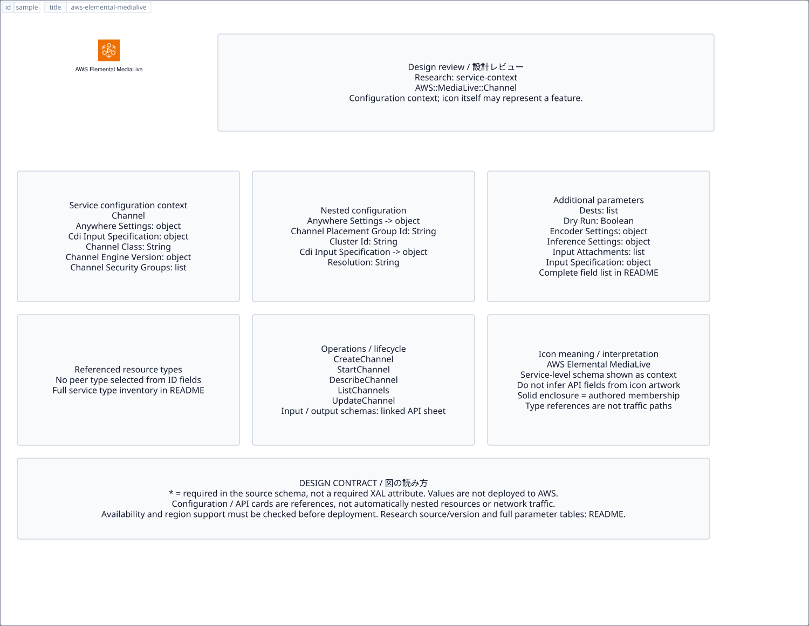

# `aws-elemental-medialive` — AWS Elemental MediaLive

[SVG preview](sample.svg) · [Editable XAL](sample.xal) · [Catalog](../README.md)



AWS service icon. Use a label and explicit annotations to describe its role; scope is selected by the author.

- Kind: `service`; category: Media Services.
- Diagram scope: `service` (recommendation, not AWS deployment validation).
- Default catalog ID: 823. Covered catalog IDs: 757, 779, 801, 823.
- Implementation: V1 and V2; fixed AWS icon with a wrapped label and explicit functional annotations.

## Parameters

`id` is a required, unique connection ID, not a catalog number. `label`/`title`/`name` override the label; an empty label hides it. `size` > 0 defaults to 48 px. `label-width` > 0 defaults to 160 px (default box width, at least icon size + 12 px). Explicit `width`/`height` must contain the icon and label. `visible="false"` hides it. Children and icon overrides are not supported; use a group for containment.

`detail` adds a free-form diagram annotation. `show-details="false"` hides annotation text. Only supplied values are shown; none are sent to AWS. Service/resource annotations appear on separate wrapped lines.

| Parameter | Type | Meaning | Example |
|---|---|---|---|
| `role` | text | Architectural role annotation | `Application component` |

## Review notes

The catalog provides a baseline for per-component development, not a simulation of the AWS control plane. This component's current functional parameters are the ones listed above. Additional service-specific visual behavior can be developed here without replacing catalog IDs in diagrams. Edit `sample.xal`, then run:

```sh
npm run generate:aws-samples -- --render --tag=aws-elemental-medialive
```

<!-- aws-functional-research:start -->
## 機能調査・構成デザイン（2026-09-06）

分類: `service-context`。サービス文脈: [`aws-elemental-medialive`](../aws-elemental-medialive/README.md)。

サンプルはアイコンと、設定・内包構造・関連リソース・操作を分離したレビューシートです。設定カードは編集可能な `rectangle`、グループは既存の専用タグで実装しています。カードのフィールド名を新しい XAL 属性として受理するわけではありません。専用タグが受理する属性は上の Parameters 表を参照してください。

実線の通信と、設定の参照・同じサービスに属する型一覧を区別します。スキーマの必須項目は AWS 側の仕様であり、図の必須入力ではありません。記載の構成モデル/API は取り込んだ公式資料の範囲であり、全リージョン・全機能の完全性や稼働可否を保証しません。

**重要:** このアイコンに対応する独立した構成リソースを断定せず、所属サービスの構成モデルを参考表示しています。アイコン名や絵柄から属性・親子関係・通信を推測しません。

### 構成モデル: `AWS::MediaLive::Channel`

[公式リファレンス](https://docs.aws.amazon.com/AWSCloudFormation/latest/UserGuide/aws-resource-medialive-channel.html)。全 18 プロパティを型付きで列挙します（表示カードには主要項目のみ）。

| Field | Type | Required in AWS schema |
|---|---|---|
| [AnywhereSettings](https://docs.aws.amazon.com/AWSCloudFormation/latest/UserGuide/aws-resource-medialive-channel.html#cfn-medialive-channel-anywheresettings) | `AnywhereSettings` | no |
| [CdiInputSpecification](https://docs.aws.amazon.com/AWSCloudFormation/latest/UserGuide/aws-resource-medialive-channel.html#cfn-medialive-channel-cdiinputspecification) | `CdiInputSpecification` | no |
| [ChannelClass](https://docs.aws.amazon.com/AWSCloudFormation/latest/UserGuide/aws-resource-medialive-channel.html#cfn-medialive-channel-channelclass) | `String` | no |
| [ChannelEngineVersion](https://docs.aws.amazon.com/AWSCloudFormation/latest/UserGuide/aws-resource-medialive-channel.html#cfn-medialive-channel-channelengineversion) | `ChannelEngineVersionRequest` | no |
| [ChannelSecurityGroups](https://docs.aws.amazon.com/AWSCloudFormation/latest/UserGuide/aws-resource-medialive-channel.html#cfn-medialive-channel-channelsecuritygroups) | `List<String>` | no |
| [Destinations](https://docs.aws.amazon.com/AWSCloudFormation/latest/UserGuide/aws-resource-medialive-channel.html#cfn-medialive-channel-destinations) | `List<OutputDestination>` | no |
| [DryRun](https://docs.aws.amazon.com/AWSCloudFormation/latest/UserGuide/aws-resource-medialive-channel.html#cfn-medialive-channel-dryrun) | `Boolean` | no |
| [EncoderSettings](https://docs.aws.amazon.com/AWSCloudFormation/latest/UserGuide/aws-resource-medialive-channel.html#cfn-medialive-channel-encodersettings) | `EncoderSettings` | no |
| [InferenceSettings](https://docs.aws.amazon.com/AWSCloudFormation/latest/UserGuide/aws-resource-medialive-channel.html#cfn-medialive-channel-inferencesettings) | `InferenceSettings` | no |
| [InputAttachments](https://docs.aws.amazon.com/AWSCloudFormation/latest/UserGuide/aws-resource-medialive-channel.html#cfn-medialive-channel-inputattachments) | `List<InputAttachment>` | no |
| [InputSpecification](https://docs.aws.amazon.com/AWSCloudFormation/latest/UserGuide/aws-resource-medialive-channel.html#cfn-medialive-channel-inputspecification) | `InputSpecification` | no |
| [LinkedChannelSettings](https://docs.aws.amazon.com/AWSCloudFormation/latest/UserGuide/aws-resource-medialive-channel.html#cfn-medialive-channel-linkedchannelsettings) | `LinkedChannelSettings` | no |
| [LogLevel](https://docs.aws.amazon.com/AWSCloudFormation/latest/UserGuide/aws-resource-medialive-channel.html#cfn-medialive-channel-loglevel) | `String` | no |
| [Maintenance](https://docs.aws.amazon.com/AWSCloudFormation/latest/UserGuide/aws-resource-medialive-channel.html#cfn-medialive-channel-maintenance) | `MaintenanceCreateSettings` | no |
| [Name](https://docs.aws.amazon.com/AWSCloudFormation/latest/UserGuide/aws-resource-medialive-channel.html#cfn-medialive-channel-name) | `String` | no |
| [RoleArn](https://docs.aws.amazon.com/AWSCloudFormation/latest/UserGuide/aws-resource-medialive-channel.html#cfn-medialive-channel-rolearn) | `String` | no |
| [Tags](https://docs.aws.amazon.com/AWSCloudFormation/latest/UserGuide/aws-resource-medialive-channel.html#cfn-medialive-channel-tags) | `Json` | no |
| [Vpc](https://docs.aws.amazon.com/AWSCloudFormation/latest/UserGuide/aws-resource-medialive-channel.html#cfn-medialive-channel-vpc) | `VpcOutputSettings` | no |

#### AnywhereSettings → `AWS::MediaLive::Channel.AnywhereSettings`

| Field | Type | Required in AWS schema |
|---|---|---|
| [ChannelPlacementGroupId](https://docs.aws.amazon.com/AWSCloudFormation/latest/UserGuide/aws-properties-medialive-channel-anywheresettings.html#cfn-medialive-channel-anywheresettings-channelplacementgroupid) | `String` | no |
| [ClusterId](https://docs.aws.amazon.com/AWSCloudFormation/latest/UserGuide/aws-properties-medialive-channel-anywheresettings.html#cfn-medialive-channel-anywheresettings-clusterid) | `String` | no |

#### CdiInputSpecification → `AWS::MediaLive::Channel.CdiInputSpecification`

| Field | Type | Required in AWS schema |
|---|---|---|
| [Resolution](https://docs.aws.amazon.com/AWSCloudFormation/latest/UserGuide/aws-properties-medialive-channel-cdiinputspecification.html#cfn-medialive-channel-cdiinputspecification-resolution) | `String` | no |

#### ChannelEngineVersion → `AWS::MediaLive::Channel.ChannelEngineVersionRequest`

| Field | Type | Required in AWS schema |
|---|---|---|
| [Version](https://docs.aws.amazon.com/AWSCloudFormation/latest/UserGuide/aws-properties-medialive-channel-channelengineversionrequest.html#cfn-medialive-channel-channelengineversionrequest-version) | `String` | no |

#### Destinations → `AWS::MediaLive::Channel.OutputDestination`

| Field | Type | Required in AWS schema |
|---|---|---|
| [Id](https://docs.aws.amazon.com/AWSCloudFormation/latest/UserGuide/aws-properties-medialive-channel-outputdestination.html#cfn-medialive-channel-outputdestination-id) | `String` | no |
| [LogicalInterfaceNames](https://docs.aws.amazon.com/AWSCloudFormation/latest/UserGuide/aws-properties-medialive-channel-outputdestination.html#cfn-medialive-channel-outputdestination-logicalinterfacenames) | `List<String>` | no |
| [MediaConnectRouterSettings](https://docs.aws.amazon.com/AWSCloudFormation/latest/UserGuide/aws-properties-medialive-channel-outputdestination.html#cfn-medialive-channel-outputdestination-mediaconnectroutersettings) | `List<MediaConnectRouterOutputDestinationSettings>` | no |
| [MediaPackageSettings](https://docs.aws.amazon.com/AWSCloudFormation/latest/UserGuide/aws-properties-medialive-channel-outputdestination.html#cfn-medialive-channel-outputdestination-mediapackagesettings) | `List<MediaPackageOutputDestinationSettings>` | no |
| [MultiplexSettings](https://docs.aws.amazon.com/AWSCloudFormation/latest/UserGuide/aws-properties-medialive-channel-outputdestination.html#cfn-medialive-channel-outputdestination-multiplexsettings) | `MultiplexProgramChannelDestinationSettings` | no |
| [Settings](https://docs.aws.amazon.com/AWSCloudFormation/latest/UserGuide/aws-properties-medialive-channel-outputdestination.html#cfn-medialive-channel-outputdestination-settings) | `List<OutputDestinationSettings>` | no |
| [SrtSettings](https://docs.aws.amazon.com/AWSCloudFormation/latest/UserGuide/aws-properties-medialive-channel-outputdestination.html#cfn-medialive-channel-outputdestination-srtsettings) | `List<SrtOutputDestinationSettings>` | no |

#### EncoderSettings → `AWS::MediaLive::Channel.EncoderSettings`

| Field | Type | Required in AWS schema |
|---|---|---|
| [AudioDescriptions](https://docs.aws.amazon.com/AWSCloudFormation/latest/UserGuide/aws-properties-medialive-channel-encodersettings.html#cfn-medialive-channel-encodersettings-audiodescriptions) | `List<AudioDescription>` | no |
| [AvailBlanking](https://docs.aws.amazon.com/AWSCloudFormation/latest/UserGuide/aws-properties-medialive-channel-encodersettings.html#cfn-medialive-channel-encodersettings-availblanking) | `AvailBlanking` | no |
| [AvailConfiguration](https://docs.aws.amazon.com/AWSCloudFormation/latest/UserGuide/aws-properties-medialive-channel-encodersettings.html#cfn-medialive-channel-encodersettings-availconfiguration) | `AvailConfiguration` | no |
| [BlackoutSlate](https://docs.aws.amazon.com/AWSCloudFormation/latest/UserGuide/aws-properties-medialive-channel-encodersettings.html#cfn-medialive-channel-encodersettings-blackoutslate) | `BlackoutSlate` | no |
| [CaptionDescriptions](https://docs.aws.amazon.com/AWSCloudFormation/latest/UserGuide/aws-properties-medialive-channel-encodersettings.html#cfn-medialive-channel-encodersettings-captiondescriptions) | `List<CaptionDescription>` | no |
| [ColorCorrectionSettings](https://docs.aws.amazon.com/AWSCloudFormation/latest/UserGuide/aws-properties-medialive-channel-encodersettings.html#cfn-medialive-channel-encodersettings-colorcorrectionsettings) | `ColorCorrectionSettings` | no |
| [FeatureActivations](https://docs.aws.amazon.com/AWSCloudFormation/latest/UserGuide/aws-properties-medialive-channel-encodersettings.html#cfn-medialive-channel-encodersettings-featureactivations) | `FeatureActivations` | no |
| [GlobalConfiguration](https://docs.aws.amazon.com/AWSCloudFormation/latest/UserGuide/aws-properties-medialive-channel-encodersettings.html#cfn-medialive-channel-encodersettings-globalconfiguration) | `GlobalConfiguration` | no |
| [MotionGraphicsConfiguration](https://docs.aws.amazon.com/AWSCloudFormation/latest/UserGuide/aws-properties-medialive-channel-encodersettings.html#cfn-medialive-channel-encodersettings-motiongraphicsconfiguration) | `MotionGraphicsConfiguration` | no |
| [NielsenConfiguration](https://docs.aws.amazon.com/AWSCloudFormation/latest/UserGuide/aws-properties-medialive-channel-encodersettings.html#cfn-medialive-channel-encodersettings-nielsenconfiguration) | `NielsenConfiguration` | no |
| [OutputGroups](https://docs.aws.amazon.com/AWSCloudFormation/latest/UserGuide/aws-properties-medialive-channel-encodersettings.html#cfn-medialive-channel-encodersettings-outputgroups) | `List<OutputGroup>` | no |
| [ThumbnailConfiguration](https://docs.aws.amazon.com/AWSCloudFormation/latest/UserGuide/aws-properties-medialive-channel-encodersettings.html#cfn-medialive-channel-encodersettings-thumbnailconfiguration) | `ThumbnailConfiguration` | no |
| [TimecodeConfig](https://docs.aws.amazon.com/AWSCloudFormation/latest/UserGuide/aws-properties-medialive-channel-encodersettings.html#cfn-medialive-channel-encodersettings-timecodeconfig) | `TimecodeConfig` | no |
| [VideoDescriptions](https://docs.aws.amazon.com/AWSCloudFormation/latest/UserGuide/aws-properties-medialive-channel-encodersettings.html#cfn-medialive-channel-encodersettings-videodescriptions) | `List<VideoDescription>` | no |

#### InferenceSettings → `AWS::MediaLive::Channel.InferenceSettings`

| Field | Type | Required in AWS schema |
|---|---|---|
| [AudioFeedInputs](https://docs.aws.amazon.com/AWSCloudFormation/latest/UserGuide/aws-properties-medialive-channel-inferencesettings.html#cfn-medialive-channel-inferencesettings-audiofeedinputs) | `List<AudioFeedInput>` | no |
| [FeedArn](https://docs.aws.amazon.com/AWSCloudFormation/latest/UserGuide/aws-properties-medialive-channel-inferencesettings.html#cfn-medialive-channel-inferencesettings-feedarn) | `String` | no |

#### InputAttachments → `AWS::MediaLive::Channel.InputAttachment`

| Field | Type | Required in AWS schema |
|---|---|---|
| [AutomaticInputFailoverSettings](https://docs.aws.amazon.com/AWSCloudFormation/latest/UserGuide/aws-properties-medialive-channel-inputattachment.html#cfn-medialive-channel-inputattachment-automaticinputfailoversettings) | `AutomaticInputFailoverSettings` | no |
| [InputAttachmentName](https://docs.aws.amazon.com/AWSCloudFormation/latest/UserGuide/aws-properties-medialive-channel-inputattachment.html#cfn-medialive-channel-inputattachment-inputattachmentname) | `String` | no |
| [InputId](https://docs.aws.amazon.com/AWSCloudFormation/latest/UserGuide/aws-properties-medialive-channel-inputattachment.html#cfn-medialive-channel-inputattachment-inputid) | `String` | no |
| [InputSettings](https://docs.aws.amazon.com/AWSCloudFormation/latest/UserGuide/aws-properties-medialive-channel-inputattachment.html#cfn-medialive-channel-inputattachment-inputsettings) | `InputSettings` | no |
| [LogicalInterfaceNames](https://docs.aws.amazon.com/AWSCloudFormation/latest/UserGuide/aws-properties-medialive-channel-inputattachment.html#cfn-medialive-channel-inputattachment-logicalinterfacenames) | `List<String>` | no |

#### InputSpecification → `AWS::MediaLive::Channel.InputSpecification`

| Field | Type | Required in AWS schema |
|---|---|---|
| [Codec](https://docs.aws.amazon.com/AWSCloudFormation/latest/UserGuide/aws-properties-medialive-channel-inputspecification.html#cfn-medialive-channel-inputspecification-codec) | `String` | no |
| [MaximumBitrate](https://docs.aws.amazon.com/AWSCloudFormation/latest/UserGuide/aws-properties-medialive-channel-inputspecification.html#cfn-medialive-channel-inputspecification-maximumbitrate) | `String` | no |
| [Resolution](https://docs.aws.amazon.com/AWSCloudFormation/latest/UserGuide/aws-properties-medialive-channel-inputspecification.html#cfn-medialive-channel-inputspecification-resolution) | `String` | no |

#### LinkedChannelSettings → `AWS::MediaLive::Channel.LinkedChannelSettings`

| Field | Type | Required in AWS schema |
|---|---|---|
| [FollowerChannelSettings](https://docs.aws.amazon.com/AWSCloudFormation/latest/UserGuide/aws-properties-medialive-channel-linkedchannelsettings.html#cfn-medialive-channel-linkedchannelsettings-followerchannelsettings) | `FollowerChannelSettings` | no |
| [PrimaryChannelSettings](https://docs.aws.amazon.com/AWSCloudFormation/latest/UserGuide/aws-properties-medialive-channel-linkedchannelsettings.html#cfn-medialive-channel-linkedchannelsettings-primarychannelsettings) | `PrimaryChannelSettings` | no |

#### Maintenance → `AWS::MediaLive::Channel.MaintenanceCreateSettings`

| Field | Type | Required in AWS schema |
|---|---|---|
| [MaintenanceDay](https://docs.aws.amazon.com/AWSCloudFormation/latest/UserGuide/aws-properties-medialive-channel-maintenancecreatesettings.html#cfn-medialive-channel-maintenancecreatesettings-maintenanceday) | `String` | no |
| [MaintenanceStartTime](https://docs.aws.amazon.com/AWSCloudFormation/latest/UserGuide/aws-properties-medialive-channel-maintenancecreatesettings.html#cfn-medialive-channel-maintenancecreatesettings-maintenancestarttime) | `String` | no |

#### Vpc → `AWS::MediaLive::Channel.VpcOutputSettings`

| Field | Type | Required in AWS schema |
|---|---|---|
| [PublicAddressAllocationIds](https://docs.aws.amazon.com/AWSCloudFormation/latest/UserGuide/aws-properties-medialive-channel-vpcoutputsettings.html#cfn-medialive-channel-vpcoutputsettings-publicaddressallocationids) | `List<String>` | no |
| [SecurityGroupIds](https://docs.aws.amazon.com/AWSCloudFormation/latest/UserGuide/aws-properties-medialive-channel-vpcoutputsettings.html#cfn-medialive-channel-vpcoutputsettings-securitygroupids) | `List<String>` | no |
| [SubnetIds](https://docs.aws.amazon.com/AWSCloudFormation/latest/UserGuide/aws-properties-medialive-channel-vpcoutputsettings.html#cfn-medialive-channel-vpcoutputsettings-subnetids) | `List<String>` | no |

### 関連する構成リソース（16 型）

同じサービス文脈の型一覧です。すべてがこのアイコンの子リソースという意味ではありません。さらに深い入れ子は [公式スキーマのスナップショット](../research/cloudformation-models.json) に記録しています。

- [AWS::MediaLive::Channel](https://docs.aws.amazon.com/AWSCloudFormation/latest/UserGuide/aws-resource-medialive-channel.html)
- [AWS::MediaLive::ChannelPlacementGroup](https://docs.aws.amazon.com/AWSCloudFormation/latest/UserGuide/aws-resource-medialive-channelplacementgroup.html)
- [AWS::MediaLive::CloudWatchAlarmTemplate](https://docs.aws.amazon.com/AWSCloudFormation/latest/UserGuide/aws-resource-medialive-cloudwatchalarmtemplate.html)
- [AWS::MediaLive::CloudWatchAlarmTemplateGroup](https://docs.aws.amazon.com/AWSCloudFormation/latest/UserGuide/aws-resource-medialive-cloudwatchalarmtemplategroup.html)
- [AWS::MediaLive::Cluster](https://docs.aws.amazon.com/AWSCloudFormation/latest/UserGuide/aws-resource-medialive-cluster.html)
- [AWS::MediaLive::EventBridgeRuleTemplate](https://docs.aws.amazon.com/AWSCloudFormation/latest/UserGuide/aws-resource-medialive-eventbridgeruletemplate.html)
- [AWS::MediaLive::EventBridgeRuleTemplateGroup](https://docs.aws.amazon.com/AWSCloudFormation/latest/UserGuide/aws-resource-medialive-eventbridgeruletemplategroup.html)
- [AWS::MediaLive::Input](https://docs.aws.amazon.com/AWSCloudFormation/latest/UserGuide/aws-resource-medialive-input.html)
- [AWS::MediaLive::InputSecurityGroup](https://docs.aws.amazon.com/AWSCloudFormation/latest/UserGuide/aws-resource-medialive-inputsecuritygroup.html)
- [AWS::MediaLive::Multiplex](https://docs.aws.amazon.com/AWSCloudFormation/latest/UserGuide/aws-resource-medialive-multiplex.html)
- [AWS::MediaLive::Multiplexprogram](https://docs.aws.amazon.com/AWSCloudFormation/latest/UserGuide/aws-resource-medialive-multiplexprogram.html)
- [AWS::MediaLive::Network](https://docs.aws.amazon.com/AWSCloudFormation/latest/UserGuide/aws-resource-medialive-network.html)
- [AWS::MediaLive::Node](https://docs.aws.amazon.com/AWSCloudFormation/latest/UserGuide/aws-resource-medialive-node.html)
- [AWS::MediaLive::Offering](https://docs.aws.amazon.com/AWSCloudFormation/latest/UserGuide/aws-resource-medialive-offering.html)
- [AWS::MediaLive::SdiSource](https://docs.aws.amazon.com/AWSCloudFormation/latest/UserGuide/aws-resource-medialive-sdisource.html)
- [AWS::MediaLive::SignalMap](https://docs.aws.amazon.com/AWSCloudFormation/latest/UserGuide/aws-resource-medialive-signalmap.html)

### API の操作・パラメータ

- [AWS Elemental MediaLive: 123 操作の入力・出力一覧](../research/api/medialive.md)（API version 2017-10-14）

### 出典・調査範囲

- [公式資料 1](https://docs.aws.amazon.com/AWSCloudFormation/latest/UserGuide/aws-resource-medialive-channel.html)
- [公式資料 2](https://github.com/boto/botocore/blob/develop/botocore/data/medialive/2017-10-14/service-2.json)

CloudFormation 仕様 263.0.0、AWS SDK 431 サービスモデルをオフラインで参照。取得日・元データの SHA-256 は [調査マニフェスト](../research/README.md) を参照。API モデル名・フィールド名は仕様から抽出し、説明本文を転載していません。利用可能性は全サービス一律には確認できないため、提供終了の確認がないものも「現在利用可能」と断定していません。

### 次の部品レビュー

- 本アイコンが独立したリソースか、機能・状態・デバイスの記号かを確認する。
- 詳細カードのうち専用の子タグ・参照属性として実装する範囲を選ぶ。
- 通信、制御、認証、監視の関係を分け、必要な接続点・配置制約を確認する。
- 編集後は `npm run generate:aws-samples -- --render --tag=aws-elemental-medialive`。通常の再描画は XAL/README を上書きしない。
<!-- aws-functional-research:end -->
