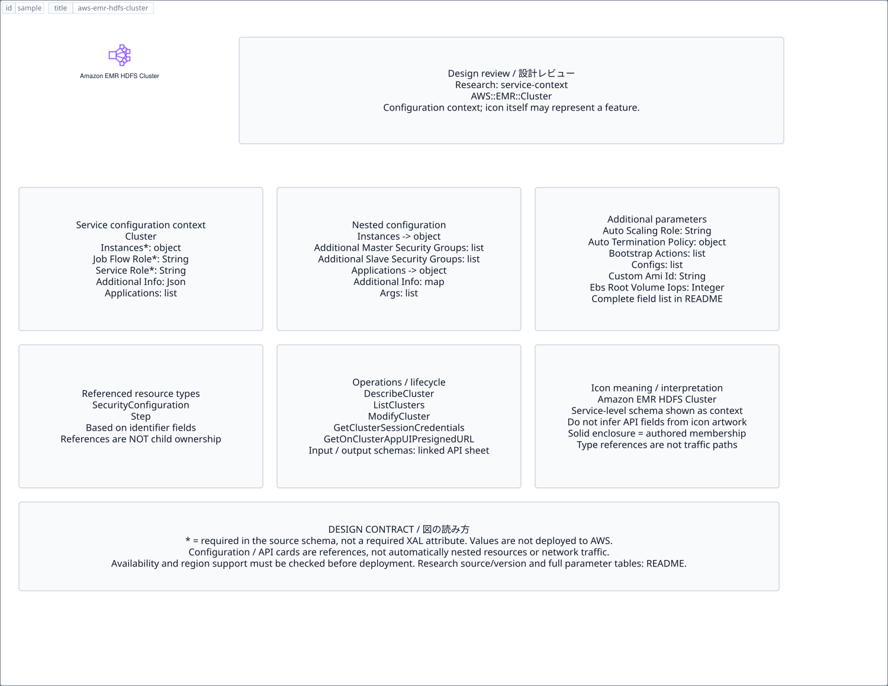

# `aws-emr-hdfs-cluster` — Amazon EMR HDFS Cluster

[SVG preview](sample.svg) · [Editable XAL](sample.xal) · [Catalog](../README.md)



AWS resource icon. Use a label and explicit annotations to describe its role; scope is selected by the author.

- Kind: `resource`; category: Analytics.
- Diagram scope: `logical` (recommendation, not AWS deployment validation).
- Default catalog ID: 1443. Covered catalog IDs: 1443.
- Implementation: V1 and V2; fixed AWS icon with a wrapped label and explicit functional annotations.

## Parameters

`id` is a required, unique connection ID, not a catalog number. `label`/`title`/`name` override the label; an empty label hides it. `size` > 0 defaults to 48 px. `label-width` > 0 defaults to 160 px (default box width, at least icon size + 12 px). Explicit `width`/`height` must contain the icon and label. `visible="false"` hides it. Children and icon overrides are not supported; use a group for containment.

`detail` adds a free-form diagram annotation. `show-details="false"` hides annotation text. Only supplied values are shown; none are sent to AWS. Service/resource annotations appear on separate wrapped lines.

| Parameter | Type | Meaning | Example |
|---|---|---|---|
| `input` | text | Input data annotation | `Application events` |
| `output` | text | Output data annotation | `Insights` |

## Review notes

The catalog provides a baseline for per-component development, not a simulation of the AWS control plane. This component's current functional parameters are the ones listed above. Additional service-specific visual behavior can be developed here without replacing catalog IDs in diagrams. Edit `sample.xal`, then run:

```sh
npm run generate:aws-samples -- --render --tag=aws-emr-hdfs-cluster
```

<!-- aws-functional-research:start -->
## 機能調査・構成デザイン（2026-09-06）

分類: `service-context`。サービス文脈: [`aws-emr`](../aws-emr/README.md)。

サンプルはアイコンと、設定・内包構造・関連リソース・操作を分離したレビューシートです。設定カードは編集可能な `rectangle`、グループは既存の専用タグで実装しています。カードのフィールド名を新しい XAL 属性として受理するわけではありません。専用タグが受理する属性は上の Parameters 表を参照してください。

実線の通信と、設定の参照・同じサービスに属する型一覧を区別します。スキーマの必須項目は AWS 側の仕様であり、図の必須入力ではありません。記載の構成モデル/API は取り込んだ公式資料の範囲であり、全リージョン・全機能の完全性や稼働可否を保証しません。

**重要:** このアイコンに対応する独立した構成リソースを断定せず、所属サービスの構成モデルを参考表示しています。アイコン名や絵柄から属性・親子関係・通信を推測しません。

### 構成モデル: `AWS::EMR::Cluster`

[公式リファレンス](https://docs.aws.amazon.com/AWSCloudFormation/latest/UserGuide/aws-resource-elasticmapreduce-cluster.html)。全 27 プロパティを型付きで列挙します（表示カードには主要項目のみ）。

| Field | Type | Required in AWS schema |
|---|---|---|
| [AdditionalInfo](https://docs.aws.amazon.com/AWSCloudFormation/latest/UserGuide/aws-resource-elasticmapreduce-cluster.html#cfn-elasticmapreduce-cluster-additionalinfo) | `Json` | no |
| [Applications](https://docs.aws.amazon.com/AWSCloudFormation/latest/UserGuide/aws-resource-elasticmapreduce-cluster.html#cfn-elasticmapreduce-cluster-applications) | `List<Application>` | no |
| [AutoScalingRole](https://docs.aws.amazon.com/AWSCloudFormation/latest/UserGuide/aws-resource-elasticmapreduce-cluster.html#cfn-elasticmapreduce-cluster-autoscalingrole) | `String` | no |
| [AutoTerminationPolicy](https://docs.aws.amazon.com/AWSCloudFormation/latest/UserGuide/aws-resource-elasticmapreduce-cluster.html#cfn-elasticmapreduce-cluster-autoterminationpolicy) | `AutoTerminationPolicy` | no |
| [BootstrapActions](https://docs.aws.amazon.com/AWSCloudFormation/latest/UserGuide/aws-resource-elasticmapreduce-cluster.html#cfn-elasticmapreduce-cluster-bootstrapactions) | `List<BootstrapActionConfig>` | no |
| [Configurations](https://docs.aws.amazon.com/AWSCloudFormation/latest/UserGuide/aws-resource-elasticmapreduce-cluster.html#cfn-elasticmapreduce-cluster-configurations) | `List<Configuration>` | no |
| [CustomAmiId](https://docs.aws.amazon.com/AWSCloudFormation/latest/UserGuide/aws-resource-elasticmapreduce-cluster.html#cfn-elasticmapreduce-cluster-customamiid) | `String` | no |
| [EbsRootVolumeIops](https://docs.aws.amazon.com/AWSCloudFormation/latest/UserGuide/aws-resource-elasticmapreduce-cluster.html#cfn-elasticmapreduce-cluster-ebsrootvolumeiops) | `Integer` | no |
| [EbsRootVolumeSize](https://docs.aws.amazon.com/AWSCloudFormation/latest/UserGuide/aws-resource-elasticmapreduce-cluster.html#cfn-elasticmapreduce-cluster-ebsrootvolumesize) | `Integer` | no |
| [EbsRootVolumeThroughput](https://docs.aws.amazon.com/AWSCloudFormation/latest/UserGuide/aws-resource-elasticmapreduce-cluster.html#cfn-elasticmapreduce-cluster-ebsrootvolumethroughput) | `Integer` | no |
| [Instances](https://docs.aws.amazon.com/AWSCloudFormation/latest/UserGuide/aws-resource-elasticmapreduce-cluster.html#cfn-elasticmapreduce-cluster-instances) | `JobFlowInstancesConfig` | yes |
| [JobFlowRole](https://docs.aws.amazon.com/AWSCloudFormation/latest/UserGuide/aws-resource-elasticmapreduce-cluster.html#cfn-elasticmapreduce-cluster-jobflowrole) | `String` | yes |
| [KerberosAttributes](https://docs.aws.amazon.com/AWSCloudFormation/latest/UserGuide/aws-resource-elasticmapreduce-cluster.html#cfn-elasticmapreduce-cluster-kerberosattributes) | `KerberosAttributes` | no |
| [LogEncryptionKmsKeyId](https://docs.aws.amazon.com/AWSCloudFormation/latest/UserGuide/aws-resource-elasticmapreduce-cluster.html#cfn-elasticmapreduce-cluster-logencryptionkmskeyid) | `String` | no |
| [LogUri](https://docs.aws.amazon.com/AWSCloudFormation/latest/UserGuide/aws-resource-elasticmapreduce-cluster.html#cfn-elasticmapreduce-cluster-loguri) | `String` | no |
| [ManagedScalingPolicy](https://docs.aws.amazon.com/AWSCloudFormation/latest/UserGuide/aws-resource-elasticmapreduce-cluster.html#cfn-elasticmapreduce-cluster-managedscalingpolicy) | `ManagedScalingPolicy` | no |
| [Name](https://docs.aws.amazon.com/AWSCloudFormation/latest/UserGuide/aws-resource-elasticmapreduce-cluster.html#cfn-elasticmapreduce-cluster-name) | `String` | yes |
| [OSReleaseLabel](https://docs.aws.amazon.com/AWSCloudFormation/latest/UserGuide/aws-resource-elasticmapreduce-cluster.html#cfn-elasticmapreduce-cluster-osreleaselabel) | `String` | no |
| [PlacementGroupConfigs](https://docs.aws.amazon.com/AWSCloudFormation/latest/UserGuide/aws-resource-elasticmapreduce-cluster.html#cfn-elasticmapreduce-cluster-placementgroupconfigs) | `List<PlacementGroupConfig>` | no |
| [ReleaseLabel](https://docs.aws.amazon.com/AWSCloudFormation/latest/UserGuide/aws-resource-elasticmapreduce-cluster.html#cfn-elasticmapreduce-cluster-releaselabel) | `String` | no |
| [ScaleDownBehavior](https://docs.aws.amazon.com/AWSCloudFormation/latest/UserGuide/aws-resource-elasticmapreduce-cluster.html#cfn-elasticmapreduce-cluster-scaledownbehavior) | `String` | no |
| [SecurityConfiguration](https://docs.aws.amazon.com/AWSCloudFormation/latest/UserGuide/aws-resource-elasticmapreduce-cluster.html#cfn-elasticmapreduce-cluster-securityconfiguration) | `String` | no |
| [ServiceRole](https://docs.aws.amazon.com/AWSCloudFormation/latest/UserGuide/aws-resource-elasticmapreduce-cluster.html#cfn-elasticmapreduce-cluster-servicerole) | `String` | yes |
| [StepConcurrencyLevel](https://docs.aws.amazon.com/AWSCloudFormation/latest/UserGuide/aws-resource-elasticmapreduce-cluster.html#cfn-elasticmapreduce-cluster-stepconcurrencylevel) | `Integer` | no |
| [Steps](https://docs.aws.amazon.com/AWSCloudFormation/latest/UserGuide/aws-resource-elasticmapreduce-cluster.html#cfn-elasticmapreduce-cluster-steps) | `List<StepConfig>` | no |
| [Tags](https://docs.aws.amazon.com/AWSCloudFormation/latest/UserGuide/aws-resource-elasticmapreduce-cluster.html#cfn-elasticmapreduce-cluster-tags) | `List<Tag>` | no |
| [VisibleToAllUsers](https://docs.aws.amazon.com/AWSCloudFormation/latest/UserGuide/aws-resource-elasticmapreduce-cluster.html#cfn-elasticmapreduce-cluster-visibletoallusers) | `Boolean` | no |

#### Instances → `AWS::EMR::Cluster.JobFlowInstancesConfig`

| Field | Type | Required in AWS schema |
|---|---|---|
| [AdditionalMasterSecurityGroups](https://docs.aws.amazon.com/AWSCloudFormation/latest/UserGuide/aws-properties-elasticmapreduce-cluster-jobflowinstancesconfig.html#cfn-elasticmapreduce-cluster-jobflowinstancesconfig-additionalmastersecuritygroups) | `List<String>` | no |
| [AdditionalSlaveSecurityGroups](https://docs.aws.amazon.com/AWSCloudFormation/latest/UserGuide/aws-properties-elasticmapreduce-cluster-jobflowinstancesconfig.html#cfn-elasticmapreduce-cluster-jobflowinstancesconfig-additionalslavesecuritygroups) | `List<String>` | no |
| [CoreInstanceFleet](https://docs.aws.amazon.com/AWSCloudFormation/latest/UserGuide/aws-properties-elasticmapreduce-cluster-jobflowinstancesconfig.html#cfn-elasticmapreduce-cluster-jobflowinstancesconfig-coreinstancefleet) | `InstanceFleetConfig` | no |
| [CoreInstanceGroup](https://docs.aws.amazon.com/AWSCloudFormation/latest/UserGuide/aws-properties-elasticmapreduce-cluster-jobflowinstancesconfig.html#cfn-elasticmapreduce-cluster-jobflowinstancesconfig-coreinstancegroup) | `InstanceGroupConfig` | no |
| [Ec2KeyName](https://docs.aws.amazon.com/AWSCloudFormation/latest/UserGuide/aws-properties-elasticmapreduce-cluster-jobflowinstancesconfig.html#cfn-elasticmapreduce-cluster-jobflowinstancesconfig-ec2keyname) | `String` | no |
| [Ec2SubnetId](https://docs.aws.amazon.com/AWSCloudFormation/latest/UserGuide/aws-properties-elasticmapreduce-cluster-jobflowinstancesconfig.html#cfn-elasticmapreduce-cluster-jobflowinstancesconfig-ec2subnetid) | `String` | no |
| [Ec2SubnetIds](https://docs.aws.amazon.com/AWSCloudFormation/latest/UserGuide/aws-properties-elasticmapreduce-cluster-jobflowinstancesconfig.html#cfn-elasticmapreduce-cluster-jobflowinstancesconfig-ec2subnetids) | `List<String>` | no |
| [EmrManagedMasterSecurityGroup](https://docs.aws.amazon.com/AWSCloudFormation/latest/UserGuide/aws-properties-elasticmapreduce-cluster-jobflowinstancesconfig.html#cfn-elasticmapreduce-cluster-jobflowinstancesconfig-emrmanagedmastersecuritygroup) | `String` | no |
| [EmrManagedSlaveSecurityGroup](https://docs.aws.amazon.com/AWSCloudFormation/latest/UserGuide/aws-properties-elasticmapreduce-cluster-jobflowinstancesconfig.html#cfn-elasticmapreduce-cluster-jobflowinstancesconfig-emrmanagedslavesecuritygroup) | `String` | no |
| [HadoopVersion](https://docs.aws.amazon.com/AWSCloudFormation/latest/UserGuide/aws-properties-elasticmapreduce-cluster-jobflowinstancesconfig.html#cfn-elasticmapreduce-cluster-jobflowinstancesconfig-hadoopversion) | `String` | no |
| [KeepJobFlowAliveWhenNoSteps](https://docs.aws.amazon.com/AWSCloudFormation/latest/UserGuide/aws-properties-elasticmapreduce-cluster-jobflowinstancesconfig.html#cfn-elasticmapreduce-cluster-jobflowinstancesconfig-keepjobflowalivewhennosteps) | `Boolean` | no |
| [MasterInstanceFleet](https://docs.aws.amazon.com/AWSCloudFormation/latest/UserGuide/aws-properties-elasticmapreduce-cluster-jobflowinstancesconfig.html#cfn-elasticmapreduce-cluster-jobflowinstancesconfig-masterinstancefleet) | `InstanceFleetConfig` | no |
| [MasterInstanceGroup](https://docs.aws.amazon.com/AWSCloudFormation/latest/UserGuide/aws-properties-elasticmapreduce-cluster-jobflowinstancesconfig.html#cfn-elasticmapreduce-cluster-jobflowinstancesconfig-masterinstancegroup) | `InstanceGroupConfig` | no |
| [Placement](https://docs.aws.amazon.com/AWSCloudFormation/latest/UserGuide/aws-properties-elasticmapreduce-cluster-jobflowinstancesconfig.html#cfn-elasticmapreduce-cluster-jobflowinstancesconfig-placement) | `PlacementType` | no |
| [ServiceAccessSecurityGroup](https://docs.aws.amazon.com/AWSCloudFormation/latest/UserGuide/aws-properties-elasticmapreduce-cluster-jobflowinstancesconfig.html#cfn-elasticmapreduce-cluster-jobflowinstancesconfig-serviceaccesssecuritygroup) | `String` | no |
| [TaskInstanceFleets](https://docs.aws.amazon.com/AWSCloudFormation/latest/UserGuide/aws-properties-elasticmapreduce-cluster-jobflowinstancesconfig.html#cfn-elasticmapreduce-cluster-jobflowinstancesconfig-taskinstancefleets) | `List<InstanceFleetConfig>` | no |
| [TaskInstanceGroups](https://docs.aws.amazon.com/AWSCloudFormation/latest/UserGuide/aws-properties-elasticmapreduce-cluster-jobflowinstancesconfig.html#cfn-elasticmapreduce-cluster-jobflowinstancesconfig-taskinstancegroups) | `List<InstanceGroupConfig>` | no |
| [TerminationProtected](https://docs.aws.amazon.com/AWSCloudFormation/latest/UserGuide/aws-properties-elasticmapreduce-cluster-jobflowinstancesconfig.html#cfn-elasticmapreduce-cluster-jobflowinstancesconfig-terminationprotected) | `Boolean` | no |
| [UnhealthyNodeReplacement](https://docs.aws.amazon.com/AWSCloudFormation/latest/UserGuide/aws-properties-elasticmapreduce-cluster-jobflowinstancesconfig.html#cfn-elasticmapreduce-cluster-jobflowinstancesconfig-unhealthynodereplacement) | `Boolean` | no |

#### Applications → `AWS::EMR::Cluster.Application`

| Field | Type | Required in AWS schema |
|---|---|---|
| [AdditionalInfo](https://docs.aws.amazon.com/AWSCloudFormation/latest/UserGuide/aws-properties-elasticmapreduce-cluster-application.html#cfn-elasticmapreduce-cluster-application-additionalinfo) | `Map<String>` | no |
| [Args](https://docs.aws.amazon.com/AWSCloudFormation/latest/UserGuide/aws-properties-elasticmapreduce-cluster-application.html#cfn-elasticmapreduce-cluster-application-args) | `List<String>` | no |
| [Name](https://docs.aws.amazon.com/AWSCloudFormation/latest/UserGuide/aws-properties-elasticmapreduce-cluster-application.html#cfn-elasticmapreduce-cluster-application-name) | `String` | no |
| [Version](https://docs.aws.amazon.com/AWSCloudFormation/latest/UserGuide/aws-properties-elasticmapreduce-cluster-application.html#cfn-elasticmapreduce-cluster-application-version) | `String` | no |

#### AutoTerminationPolicy → `AWS::EMR::Cluster.AutoTerminationPolicy`

| Field | Type | Required in AWS schema |
|---|---|---|
| [IdleTimeout](https://docs.aws.amazon.com/AWSCloudFormation/latest/UserGuide/aws-properties-elasticmapreduce-cluster-autoterminationpolicy.html#cfn-elasticmapreduce-cluster-autoterminationpolicy-idletimeout) | `Long` | no |

#### BootstrapActions → `AWS::EMR::Cluster.BootstrapActionConfig`

| Field | Type | Required in AWS schema |
|---|---|---|
| [Name](https://docs.aws.amazon.com/AWSCloudFormation/latest/UserGuide/aws-properties-elasticmapreduce-cluster-bootstrapactionconfig.html#cfn-elasticmapreduce-cluster-bootstrapactionconfig-name) | `String` | yes |
| [ScriptBootstrapAction](https://docs.aws.amazon.com/AWSCloudFormation/latest/UserGuide/aws-properties-elasticmapreduce-cluster-bootstrapactionconfig.html#cfn-elasticmapreduce-cluster-bootstrapactionconfig-scriptbootstrapaction) | `ScriptBootstrapActionConfig` | yes |

#### Configurations → `AWS::EMR::Cluster.Configuration`

| Field | Type | Required in AWS schema |
|---|---|---|
| [Classification](https://docs.aws.amazon.com/AWSCloudFormation/latest/UserGuide/aws-properties-elasticmapreduce-cluster-configuration.html#cfn-elasticmapreduce-cluster-configuration-classification) | `String` | no |
| [ConfigurationProperties](https://docs.aws.amazon.com/AWSCloudFormation/latest/UserGuide/aws-properties-elasticmapreduce-cluster-configuration.html#cfn-elasticmapreduce-cluster-configuration-configurationproperties) | `Map<String>` | no |
| [Configurations](https://docs.aws.amazon.com/AWSCloudFormation/latest/UserGuide/aws-properties-elasticmapreduce-cluster-configuration.html#cfn-elasticmapreduce-cluster-configuration-configurations) | `List<Configuration>` | no |

#### KerberosAttributes → `AWS::EMR::Cluster.KerberosAttributes`

| Field | Type | Required in AWS schema |
|---|---|---|
| [ADDomainJoinPassword](https://docs.aws.amazon.com/AWSCloudFormation/latest/UserGuide/aws-properties-elasticmapreduce-cluster-kerberosattributes.html#cfn-elasticmapreduce-cluster-kerberosattributes-addomainjoinpassword) | `String` | no |
| [ADDomainJoinUser](https://docs.aws.amazon.com/AWSCloudFormation/latest/UserGuide/aws-properties-elasticmapreduce-cluster-kerberosattributes.html#cfn-elasticmapreduce-cluster-kerberosattributes-addomainjoinuser) | `String` | no |
| [CrossRealmTrustPrincipalPassword](https://docs.aws.amazon.com/AWSCloudFormation/latest/UserGuide/aws-properties-elasticmapreduce-cluster-kerberosattributes.html#cfn-elasticmapreduce-cluster-kerberosattributes-crossrealmtrustprincipalpassword) | `String` | no |
| [KdcAdminPassword](https://docs.aws.amazon.com/AWSCloudFormation/latest/UserGuide/aws-properties-elasticmapreduce-cluster-kerberosattributes.html#cfn-elasticmapreduce-cluster-kerberosattributes-kdcadminpassword) | `String` | yes |
| [Realm](https://docs.aws.amazon.com/AWSCloudFormation/latest/UserGuide/aws-properties-elasticmapreduce-cluster-kerberosattributes.html#cfn-elasticmapreduce-cluster-kerberosattributes-realm) | `String` | yes |

#### ManagedScalingPolicy → `AWS::EMR::Cluster.ManagedScalingPolicy`

| Field | Type | Required in AWS schema |
|---|---|---|
| [ComputeLimits](https://docs.aws.amazon.com/AWSCloudFormation/latest/UserGuide/aws-properties-elasticmapreduce-cluster-managedscalingpolicy.html#cfn-elasticmapreduce-cluster-managedscalingpolicy-computelimits) | `ComputeLimits` | no |
| [ScalingStrategy](https://docs.aws.amazon.com/AWSCloudFormation/latest/UserGuide/aws-properties-elasticmapreduce-cluster-managedscalingpolicy.html#cfn-elasticmapreduce-cluster-managedscalingpolicy-scalingstrategy) | `String` | no |
| [UtilizationPerformanceIndex](https://docs.aws.amazon.com/AWSCloudFormation/latest/UserGuide/aws-properties-elasticmapreduce-cluster-managedscalingpolicy.html#cfn-elasticmapreduce-cluster-managedscalingpolicy-utilizationperformanceindex) | `Integer` | no |

#### PlacementGroupConfigs → `AWS::EMR::Cluster.PlacementGroupConfig`

| Field | Type | Required in AWS schema |
|---|---|---|
| [InstanceRole](https://docs.aws.amazon.com/AWSCloudFormation/latest/UserGuide/aws-properties-elasticmapreduce-cluster-placementgroupconfig.html#cfn-elasticmapreduce-cluster-placementgroupconfig-instancerole) | `String` | yes |
| [PlacementStrategy](https://docs.aws.amazon.com/AWSCloudFormation/latest/UserGuide/aws-properties-elasticmapreduce-cluster-placementgroupconfig.html#cfn-elasticmapreduce-cluster-placementgroupconfig-placementstrategy) | `String` | no |

#### Steps → `AWS::EMR::Cluster.StepConfig`

| Field | Type | Required in AWS schema |
|---|---|---|
| [ActionOnFailure](https://docs.aws.amazon.com/AWSCloudFormation/latest/UserGuide/aws-properties-elasticmapreduce-cluster-stepconfig.html#cfn-elasticmapreduce-cluster-stepconfig-actiononfailure) | `String` | no |
| [HadoopJarStep](https://docs.aws.amazon.com/AWSCloudFormation/latest/UserGuide/aws-properties-elasticmapreduce-cluster-stepconfig.html#cfn-elasticmapreduce-cluster-stepconfig-hadoopjarstep) | `HadoopJarStepConfig` | yes |
| [Name](https://docs.aws.amazon.com/AWSCloudFormation/latest/UserGuide/aws-properties-elasticmapreduce-cluster-stepconfig.html#cfn-elasticmapreduce-cluster-stepconfig-name) | `String` | yes |

### 関連する構成リソース（9 型）

同じサービス文脈の型一覧です。すべてがこのアイコンの子リソースという意味ではありません。さらに深い入れ子は [公式スキーマのスナップショット](../research/cloudformation-models.json) に記録しています。

- [AWS::EMR::Cluster](https://docs.aws.amazon.com/AWSCloudFormation/latest/UserGuide/aws-resource-elasticmapreduce-cluster.html)
- [AWS::EMR::InstanceFleetConfig](https://docs.aws.amazon.com/AWSCloudFormation/latest/UserGuide/aws-resource-elasticmapreduce-instancefleetconfig.html)
- [AWS::EMR::InstanceGroupConfig](https://docs.aws.amazon.com/AWSCloudFormation/latest/UserGuide/aws-resource-emr-instancegroupconfig.html)
- [AWS::EMR::NotebookExecution](https://docs.aws.amazon.com/AWSCloudFormation/latest/UserGuide/aws-resource-emr-notebookexecution.html)
- [AWS::EMR::SecurityConfiguration](https://docs.aws.amazon.com/AWSCloudFormation/latest/UserGuide/aws-resource-emr-securityconfiguration.html)
- [AWS::EMR::Step](https://docs.aws.amazon.com/AWSCloudFormation/latest/UserGuide/aws-resource-emr-step.html)
- [AWS::EMR::Studio](https://docs.aws.amazon.com/AWSCloudFormation/latest/UserGuide/aws-resource-emr-studio.html)
- [AWS::EMR::StudioSessionMapping](https://docs.aws.amazon.com/AWSCloudFormation/latest/UserGuide/aws-resource-emr-studiosessionmapping.html)
- [AWS::EMR::WALWorkspace](https://docs.aws.amazon.com/AWSCloudFormation/latest/UserGuide/aws-resource-emr-walworkspace.html)

### API の操作・パラメータ

- [Amazon EMR: 65 操作の入力・出力一覧](../research/api/emr.md)（API version 2009-03-31）

### 出典・調査範囲

- [公式資料 1](https://docs.aws.amazon.com/AWSCloudFormation/latest/UserGuide/aws-resource-elasticmapreduce-cluster.html)
- [公式資料 2](https://github.com/boto/botocore/blob/develop/botocore/data/emr/2009-03-31/service-2.json)

CloudFormation 仕様 263.0.0、AWS SDK 431 サービスモデルをオフラインで参照。取得日・元データの SHA-256 は [調査マニフェスト](../research/README.md) を参照。API モデル名・フィールド名は仕様から抽出し、説明本文を転載していません。利用可能性は全サービス一律には確認できないため、提供終了の確認がないものも「現在利用可能」と断定していません。

### 次の部品レビュー

- 本アイコンが独立したリソースか、機能・状態・デバイスの記号かを確認する。
- 詳細カードのうち専用の子タグ・参照属性として実装する範囲を選ぶ。
- 通信、制御、認証、監視の関係を分け、必要な接続点・配置制約を確認する。
- 編集後は `npm run generate:aws-samples -- --render --tag=aws-emr-hdfs-cluster`。通常の再描画は XAL/README を上書きしない。
<!-- aws-functional-research:end -->
