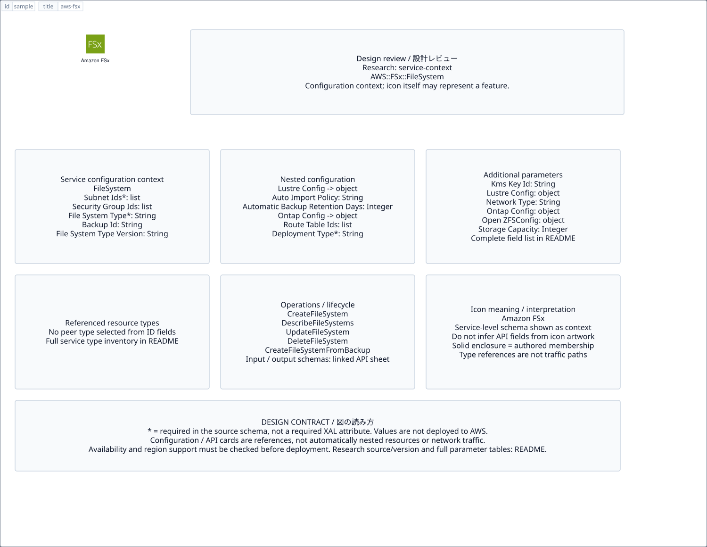

# `aws-fsx` — Amazon FSx

[SVG preview](sample.svg) · [Editable XAL](sample.xal) · [Catalog](../README.md)



AWS service icon. Use a label and explicit annotations to describe its role; scope is selected by the author.

- Kind: `service`; category: Storage.
- Diagram scope: `service` (recommendation, not AWS deployment validation).
- Default catalog ID: 1064. Covered catalog IDs: 1016, 1032, 1048, 1064.
- Implementation: V1 and V2; fixed AWS icon with a wrapped label and explicit functional annotations.

## Parameters

`id` is a required, unique connection ID, not a catalog number. `label`/`title`/`name` override the label; an empty label hides it. `size` > 0 defaults to 48 px. `label-width` > 0 defaults to 160 px (default box width, at least icon size + 12 px). Explicit `width`/`height` must contain the icon and label. `visible="false"` hides it. Children and icon overrides are not supported; use a group for containment.

`detail` adds a free-form diagram annotation. `show-details="false"` hides annotation text. Only supplied values are shown; none are sent to AWS. Service/resource annotations appear on separate wrapped lines.

| Parameter | Type | Meaning | Example |
|---|---|---|---|
| `data` | text | Stored data annotation | `Application data` |

## Review notes

The catalog provides a baseline for per-component development, not a simulation of the AWS control plane. This component's current functional parameters are the ones listed above. Additional service-specific visual behavior can be developed here without replacing catalog IDs in diagrams. Edit `sample.xal`, then run:

```sh
npm run generate:aws-samples -- --render --tag=aws-fsx
```

<!-- aws-functional-research:start -->
## 機能調査・構成デザイン（2026-09-06）

分類: `service-context`。サービス文脈: [`aws-fsx`](../aws-fsx/README.md)。

サンプルはアイコンと、設定・内包構造・関連リソース・操作を分離したレビューシートです。設定カードは編集可能な `rectangle`、グループは既存の専用タグで実装しています。カードのフィールド名を新しい XAL 属性として受理するわけではありません。専用タグが受理する属性は上の Parameters 表を参照してください。

実線の通信と、設定の参照・同じサービスに属する型一覧を区別します。スキーマの必須項目は AWS 側の仕様であり、図の必須入力ではありません。記載の構成モデル/API は取り込んだ公式資料の範囲であり、全リージョン・全機能の完全性や稼働可否を保証しません。

**重要:** このアイコンに対応する独立した構成リソースを断定せず、所属サービスの構成モデルを参考表示しています。アイコン名や絵柄から属性・親子関係・通信を推測しません。

### 構成モデル: `AWS::FSx::FileSystem`

[公式リファレンス](https://docs.aws.amazon.com/AWSCloudFormation/latest/UserGuide/aws-resource-fsx-filesystem.html)。全 14 プロパティを型付きで列挙します（表示カードには主要項目のみ）。

| Field | Type | Required in AWS schema |
|---|---|---|
| [BackupId](https://docs.aws.amazon.com/AWSCloudFormation/latest/UserGuide/aws-resource-fsx-filesystem.html#cfn-fsx-filesystem-backupid) | `String` | no |
| [FileSystemType](https://docs.aws.amazon.com/AWSCloudFormation/latest/UserGuide/aws-resource-fsx-filesystem.html#cfn-fsx-filesystem-filesystemtype) | `String` | yes |
| [FileSystemTypeVersion](https://docs.aws.amazon.com/AWSCloudFormation/latest/UserGuide/aws-resource-fsx-filesystem.html#cfn-fsx-filesystem-filesystemtypeversion) | `String` | no |
| [KmsKeyId](https://docs.aws.amazon.com/AWSCloudFormation/latest/UserGuide/aws-resource-fsx-filesystem.html#cfn-fsx-filesystem-kmskeyid) | `String` | no |
| [LustreConfiguration](https://docs.aws.amazon.com/AWSCloudFormation/latest/UserGuide/aws-resource-fsx-filesystem.html#cfn-fsx-filesystem-lustreconfiguration) | `LustreConfiguration` | no |
| [NetworkType](https://docs.aws.amazon.com/AWSCloudFormation/latest/UserGuide/aws-resource-fsx-filesystem.html#cfn-fsx-filesystem-networktype) | `String` | no |
| [OntapConfiguration](https://docs.aws.amazon.com/AWSCloudFormation/latest/UserGuide/aws-resource-fsx-filesystem.html#cfn-fsx-filesystem-ontapconfiguration) | `OntapConfiguration` | no |
| [OpenZFSConfiguration](https://docs.aws.amazon.com/AWSCloudFormation/latest/UserGuide/aws-resource-fsx-filesystem.html#cfn-fsx-filesystem-openzfsconfiguration) | `OpenZFSConfiguration` | no |
| [SecurityGroupIds](https://docs.aws.amazon.com/AWSCloudFormation/latest/UserGuide/aws-resource-fsx-filesystem.html#cfn-fsx-filesystem-securitygroupids) | `List<String>` | no |
| [StorageCapacity](https://docs.aws.amazon.com/AWSCloudFormation/latest/UserGuide/aws-resource-fsx-filesystem.html#cfn-fsx-filesystem-storagecapacity) | `Integer` | no |
| [StorageType](https://docs.aws.amazon.com/AWSCloudFormation/latest/UserGuide/aws-resource-fsx-filesystem.html#cfn-fsx-filesystem-storagetype) | `String` | no |
| [SubnetIds](https://docs.aws.amazon.com/AWSCloudFormation/latest/UserGuide/aws-resource-fsx-filesystem.html#cfn-fsx-filesystem-subnetids) | `List<String>` | yes |
| [Tags](https://docs.aws.amazon.com/AWSCloudFormation/latest/UserGuide/aws-resource-fsx-filesystem.html#cfn-fsx-filesystem-tags) | `List<Tag>` | no |
| [WindowsConfiguration](https://docs.aws.amazon.com/AWSCloudFormation/latest/UserGuide/aws-resource-fsx-filesystem.html#cfn-fsx-filesystem-windowsconfiguration) | `WindowsConfiguration` | no |

#### LustreConfiguration → `AWS::FSx::FileSystem.LustreConfiguration`

| Field | Type | Required in AWS schema |
|---|---|---|
| [AutoImportPolicy](https://docs.aws.amazon.com/AWSCloudFormation/latest/UserGuide/aws-properties-fsx-filesystem-lustreconfiguration.html#cfn-fsx-filesystem-lustreconfiguration-autoimportpolicy) | `String` | no |
| [AutomaticBackupRetentionDays](https://docs.aws.amazon.com/AWSCloudFormation/latest/UserGuide/aws-properties-fsx-filesystem-lustreconfiguration.html#cfn-fsx-filesystem-lustreconfiguration-automaticbackupretentiondays) | `Integer` | no |
| [CopyTagsToBackups](https://docs.aws.amazon.com/AWSCloudFormation/latest/UserGuide/aws-properties-fsx-filesystem-lustreconfiguration.html#cfn-fsx-filesystem-lustreconfiguration-copytagstobackups) | `Boolean` | no |
| [DailyAutomaticBackupStartTime](https://docs.aws.amazon.com/AWSCloudFormation/latest/UserGuide/aws-properties-fsx-filesystem-lustreconfiguration.html#cfn-fsx-filesystem-lustreconfiguration-dailyautomaticbackupstarttime) | `String` | no |
| [DataCompressionType](https://docs.aws.amazon.com/AWSCloudFormation/latest/UserGuide/aws-properties-fsx-filesystem-lustreconfiguration.html#cfn-fsx-filesystem-lustreconfiguration-datacompressiontype) | `String` | no |
| [DataReadCacheConfiguration](https://docs.aws.amazon.com/AWSCloudFormation/latest/UserGuide/aws-properties-fsx-filesystem-lustreconfiguration.html#cfn-fsx-filesystem-lustreconfiguration-datareadcacheconfiguration) | `DataReadCacheConfiguration` | no |
| [DeploymentType](https://docs.aws.amazon.com/AWSCloudFormation/latest/UserGuide/aws-properties-fsx-filesystem-lustreconfiguration.html#cfn-fsx-filesystem-lustreconfiguration-deploymenttype) | `String` | no |
| [DriveCacheType](https://docs.aws.amazon.com/AWSCloudFormation/latest/UserGuide/aws-properties-fsx-filesystem-lustreconfiguration.html#cfn-fsx-filesystem-lustreconfiguration-drivecachetype) | `String` | no |
| [EfaEnabled](https://docs.aws.amazon.com/AWSCloudFormation/latest/UserGuide/aws-properties-fsx-filesystem-lustreconfiguration.html#cfn-fsx-filesystem-lustreconfiguration-efaenabled) | `Boolean` | no |
| [ExportPath](https://docs.aws.amazon.com/AWSCloudFormation/latest/UserGuide/aws-properties-fsx-filesystem-lustreconfiguration.html#cfn-fsx-filesystem-lustreconfiguration-exportpath) | `String` | no |
| [ImportedFileChunkSize](https://docs.aws.amazon.com/AWSCloudFormation/latest/UserGuide/aws-properties-fsx-filesystem-lustreconfiguration.html#cfn-fsx-filesystem-lustreconfiguration-importedfilechunksize) | `Integer` | no |
| [ImportPath](https://docs.aws.amazon.com/AWSCloudFormation/latest/UserGuide/aws-properties-fsx-filesystem-lustreconfiguration.html#cfn-fsx-filesystem-lustreconfiguration-importpath) | `String` | no |
| [LogConfiguration](https://docs.aws.amazon.com/AWSCloudFormation/latest/UserGuide/aws-properties-fsx-filesystem-lustreconfiguration.html#cfn-fsx-filesystem-lustreconfiguration-logconfiguration) | `LogConfiguration` | no |
| [MetadataConfiguration](https://docs.aws.amazon.com/AWSCloudFormation/latest/UserGuide/aws-properties-fsx-filesystem-lustreconfiguration.html#cfn-fsx-filesystem-lustreconfiguration-metadataconfiguration) | `MetadataConfiguration` | no |
| [PerUnitStorageThroughput](https://docs.aws.amazon.com/AWSCloudFormation/latest/UserGuide/aws-properties-fsx-filesystem-lustreconfiguration.html#cfn-fsx-filesystem-lustreconfiguration-perunitstoragethroughput) | `Integer` | no |
| [ThroughputCapacity](https://docs.aws.amazon.com/AWSCloudFormation/latest/UserGuide/aws-properties-fsx-filesystem-lustreconfiguration.html#cfn-fsx-filesystem-lustreconfiguration-throughputcapacity) | `Integer` | no |
| [WeeklyMaintenanceStartTime](https://docs.aws.amazon.com/AWSCloudFormation/latest/UserGuide/aws-properties-fsx-filesystem-lustreconfiguration.html#cfn-fsx-filesystem-lustreconfiguration-weeklymaintenancestarttime) | `String` | no |

#### OntapConfiguration → `AWS::FSx::FileSystem.OntapConfiguration`

| Field | Type | Required in AWS schema |
|---|---|---|
| [AutomaticBackupRetentionDays](https://docs.aws.amazon.com/AWSCloudFormation/latest/UserGuide/aws-properties-fsx-filesystem-ontapconfiguration.html#cfn-fsx-filesystem-ontapconfiguration-automaticbackupretentiondays) | `Integer` | no |
| [DailyAutomaticBackupStartTime](https://docs.aws.amazon.com/AWSCloudFormation/latest/UserGuide/aws-properties-fsx-filesystem-ontapconfiguration.html#cfn-fsx-filesystem-ontapconfiguration-dailyautomaticbackupstarttime) | `String` | no |
| [DeploymentType](https://docs.aws.amazon.com/AWSCloudFormation/latest/UserGuide/aws-properties-fsx-filesystem-ontapconfiguration.html#cfn-fsx-filesystem-ontapconfiguration-deploymenttype) | `String` | yes |
| [DiskIopsConfiguration](https://docs.aws.amazon.com/AWSCloudFormation/latest/UserGuide/aws-properties-fsx-filesystem-ontapconfiguration.html#cfn-fsx-filesystem-ontapconfiguration-diskiopsconfiguration) | `DiskIopsConfiguration` | no |
| [EndpointIpAddressRange](https://docs.aws.amazon.com/AWSCloudFormation/latest/UserGuide/aws-properties-fsx-filesystem-ontapconfiguration.html#cfn-fsx-filesystem-ontapconfiguration-endpointipaddressrange) | `String` | no |
| [EndpointIpv6AddressRange](https://docs.aws.amazon.com/AWSCloudFormation/latest/UserGuide/aws-properties-fsx-filesystem-ontapconfiguration.html#cfn-fsx-filesystem-ontapconfiguration-endpointipv6addressrange) | `String` | no |
| [FsxAdminPassword](https://docs.aws.amazon.com/AWSCloudFormation/latest/UserGuide/aws-properties-fsx-filesystem-ontapconfiguration.html#cfn-fsx-filesystem-ontapconfiguration-fsxadminpassword) | `String` | no |
| [HAPairs](https://docs.aws.amazon.com/AWSCloudFormation/latest/UserGuide/aws-properties-fsx-filesystem-ontapconfiguration.html#cfn-fsx-filesystem-ontapconfiguration-hapairs) | `Integer` | no |
| [PreferredSubnetId](https://docs.aws.amazon.com/AWSCloudFormation/latest/UserGuide/aws-properties-fsx-filesystem-ontapconfiguration.html#cfn-fsx-filesystem-ontapconfiguration-preferredsubnetid) | `String` | no |
| [RouteTableIds](https://docs.aws.amazon.com/AWSCloudFormation/latest/UserGuide/aws-properties-fsx-filesystem-ontapconfiguration.html#cfn-fsx-filesystem-ontapconfiguration-routetableids) | `List<String>` | no |
| [ThroughputCapacity](https://docs.aws.amazon.com/AWSCloudFormation/latest/UserGuide/aws-properties-fsx-filesystem-ontapconfiguration.html#cfn-fsx-filesystem-ontapconfiguration-throughputcapacity) | `Integer` | no |
| [ThroughputCapacityPerHAPair](https://docs.aws.amazon.com/AWSCloudFormation/latest/UserGuide/aws-properties-fsx-filesystem-ontapconfiguration.html#cfn-fsx-filesystem-ontapconfiguration-throughputcapacityperhapair) | `Integer` | no |
| [WeeklyMaintenanceStartTime](https://docs.aws.amazon.com/AWSCloudFormation/latest/UserGuide/aws-properties-fsx-filesystem-ontapconfiguration.html#cfn-fsx-filesystem-ontapconfiguration-weeklymaintenancestarttime) | `String` | no |

#### OpenZFSConfiguration → `AWS::FSx::FileSystem.OpenZFSConfiguration`

| Field | Type | Required in AWS schema |
|---|---|---|
| [AutomaticBackupRetentionDays](https://docs.aws.amazon.com/AWSCloudFormation/latest/UserGuide/aws-properties-fsx-filesystem-openzfsconfiguration.html#cfn-fsx-filesystem-openzfsconfiguration-automaticbackupretentiondays) | `Integer` | no |
| [CopyTagsToBackups](https://docs.aws.amazon.com/AWSCloudFormation/latest/UserGuide/aws-properties-fsx-filesystem-openzfsconfiguration.html#cfn-fsx-filesystem-openzfsconfiguration-copytagstobackups) | `Boolean` | no |
| [CopyTagsToVolumes](https://docs.aws.amazon.com/AWSCloudFormation/latest/UserGuide/aws-properties-fsx-filesystem-openzfsconfiguration.html#cfn-fsx-filesystem-openzfsconfiguration-copytagstovolumes) | `Boolean` | no |
| [DailyAutomaticBackupStartTime](https://docs.aws.amazon.com/AWSCloudFormation/latest/UserGuide/aws-properties-fsx-filesystem-openzfsconfiguration.html#cfn-fsx-filesystem-openzfsconfiguration-dailyautomaticbackupstarttime) | `String` | no |
| [DeploymentType](https://docs.aws.amazon.com/AWSCloudFormation/latest/UserGuide/aws-properties-fsx-filesystem-openzfsconfiguration.html#cfn-fsx-filesystem-openzfsconfiguration-deploymenttype) | `String` | yes |
| [DiskIopsConfiguration](https://docs.aws.amazon.com/AWSCloudFormation/latest/UserGuide/aws-properties-fsx-filesystem-openzfsconfiguration.html#cfn-fsx-filesystem-openzfsconfiguration-diskiopsconfiguration) | `DiskIopsConfiguration` | no |
| [EndpointIpAddressRange](https://docs.aws.amazon.com/AWSCloudFormation/latest/UserGuide/aws-properties-fsx-filesystem-openzfsconfiguration.html#cfn-fsx-filesystem-openzfsconfiguration-endpointipaddressrange) | `String` | no |
| [EndpointIpv6AddressRange](https://docs.aws.amazon.com/AWSCloudFormation/latest/UserGuide/aws-properties-fsx-filesystem-openzfsconfiguration.html#cfn-fsx-filesystem-openzfsconfiguration-endpointipv6addressrange) | `String` | no |
| [Options](https://docs.aws.amazon.com/AWSCloudFormation/latest/UserGuide/aws-properties-fsx-filesystem-openzfsconfiguration.html#cfn-fsx-filesystem-openzfsconfiguration-options) | `List<String>` | no |
| [PreferredSubnetId](https://docs.aws.amazon.com/AWSCloudFormation/latest/UserGuide/aws-properties-fsx-filesystem-openzfsconfiguration.html#cfn-fsx-filesystem-openzfsconfiguration-preferredsubnetid) | `String` | no |
| [ReadCacheConfiguration](https://docs.aws.amazon.com/AWSCloudFormation/latest/UserGuide/aws-properties-fsx-filesystem-openzfsconfiguration.html#cfn-fsx-filesystem-openzfsconfiguration-readcacheconfiguration) | `ReadCacheConfiguration` | no |
| [RootVolumeConfiguration](https://docs.aws.amazon.com/AWSCloudFormation/latest/UserGuide/aws-properties-fsx-filesystem-openzfsconfiguration.html#cfn-fsx-filesystem-openzfsconfiguration-rootvolumeconfiguration) | `RootVolumeConfiguration` | no |
| [RouteTableIds](https://docs.aws.amazon.com/AWSCloudFormation/latest/UserGuide/aws-properties-fsx-filesystem-openzfsconfiguration.html#cfn-fsx-filesystem-openzfsconfiguration-routetableids) | `List<String>` | no |
| [ThroughputCapacity](https://docs.aws.amazon.com/AWSCloudFormation/latest/UserGuide/aws-properties-fsx-filesystem-openzfsconfiguration.html#cfn-fsx-filesystem-openzfsconfiguration-throughputcapacity) | `Integer` | no |
| [WeeklyMaintenanceStartTime](https://docs.aws.amazon.com/AWSCloudFormation/latest/UserGuide/aws-properties-fsx-filesystem-openzfsconfiguration.html#cfn-fsx-filesystem-openzfsconfiguration-weeklymaintenancestarttime) | `String` | no |

#### WindowsConfiguration → `AWS::FSx::FileSystem.WindowsConfiguration`

| Field | Type | Required in AWS schema |
|---|---|---|
| [ActiveDirectoryId](https://docs.aws.amazon.com/AWSCloudFormation/latest/UserGuide/aws-properties-fsx-filesystem-windowsconfiguration.html#cfn-fsx-filesystem-windowsconfiguration-activedirectoryid) | `String` | no |
| [Aliases](https://docs.aws.amazon.com/AWSCloudFormation/latest/UserGuide/aws-properties-fsx-filesystem-windowsconfiguration.html#cfn-fsx-filesystem-windowsconfiguration-aliases) | `List<String>` | no |
| [AuditLogConfiguration](https://docs.aws.amazon.com/AWSCloudFormation/latest/UserGuide/aws-properties-fsx-filesystem-windowsconfiguration.html#cfn-fsx-filesystem-windowsconfiguration-auditlogconfiguration) | `AuditLogConfiguration` | no |
| [AutomaticBackupRetentionDays](https://docs.aws.amazon.com/AWSCloudFormation/latest/UserGuide/aws-properties-fsx-filesystem-windowsconfiguration.html#cfn-fsx-filesystem-windowsconfiguration-automaticbackupretentiondays) | `Integer` | no |
| [CopyTagsToBackups](https://docs.aws.amazon.com/AWSCloudFormation/latest/UserGuide/aws-properties-fsx-filesystem-windowsconfiguration.html#cfn-fsx-filesystem-windowsconfiguration-copytagstobackups) | `Boolean` | no |
| [DailyAutomaticBackupStartTime](https://docs.aws.amazon.com/AWSCloudFormation/latest/UserGuide/aws-properties-fsx-filesystem-windowsconfiguration.html#cfn-fsx-filesystem-windowsconfiguration-dailyautomaticbackupstarttime) | `String` | no |
| [DeploymentType](https://docs.aws.amazon.com/AWSCloudFormation/latest/UserGuide/aws-properties-fsx-filesystem-windowsconfiguration.html#cfn-fsx-filesystem-windowsconfiguration-deploymenttype) | `String` | no |
| [DiskIopsConfiguration](https://docs.aws.amazon.com/AWSCloudFormation/latest/UserGuide/aws-properties-fsx-filesystem-windowsconfiguration.html#cfn-fsx-filesystem-windowsconfiguration-diskiopsconfiguration) | `DiskIopsConfiguration` | no |
| [FsrmConfiguration](https://docs.aws.amazon.com/AWSCloudFormation/latest/UserGuide/aws-properties-fsx-filesystem-windowsconfiguration.html#cfn-fsx-filesystem-windowsconfiguration-fsrmconfiguration) | `FsrmConfiguration` | no |
| [PreferredSubnetId](https://docs.aws.amazon.com/AWSCloudFormation/latest/UserGuide/aws-properties-fsx-filesystem-windowsconfiguration.html#cfn-fsx-filesystem-windowsconfiguration-preferredsubnetid) | `String` | no |
| [SelfManagedActiveDirectoryConfiguration](https://docs.aws.amazon.com/AWSCloudFormation/latest/UserGuide/aws-properties-fsx-filesystem-windowsconfiguration.html#cfn-fsx-filesystem-windowsconfiguration-selfmanagedactivedirectoryconfiguration) | `SelfManagedActiveDirectoryConfiguration` | no |
| [ThroughputCapacity](https://docs.aws.amazon.com/AWSCloudFormation/latest/UserGuide/aws-properties-fsx-filesystem-windowsconfiguration.html#cfn-fsx-filesystem-windowsconfiguration-throughputcapacity) | `Integer` | yes |
| [WeeklyMaintenanceStartTime](https://docs.aws.amazon.com/AWSCloudFormation/latest/UserGuide/aws-properties-fsx-filesystem-windowsconfiguration.html#cfn-fsx-filesystem-windowsconfiguration-weeklymaintenancestarttime) | `String` | no |

### 関連する構成リソース（6 型）

同じサービス文脈の型一覧です。すべてがこのアイコンの子リソースという意味ではありません。さらに深い入れ子は [公式スキーマのスナップショット](../research/cloudformation-models.json) に記録しています。

- [AWS::FSx::DataRepositoryAssociation](https://docs.aws.amazon.com/AWSCloudFormation/latest/UserGuide/aws-resource-fsx-datarepositoryassociation.html)
- [AWS::FSx::FileSystem](https://docs.aws.amazon.com/AWSCloudFormation/latest/UserGuide/aws-resource-fsx-filesystem.html)
- [AWS::FSx::S3AccessPointAttachment](https://docs.aws.amazon.com/AWSCloudFormation/latest/UserGuide/aws-resource-fsx-s3accesspointattachment.html)
- [AWS::FSx::Snapshot](https://docs.aws.amazon.com/AWSCloudFormation/latest/UserGuide/aws-resource-fsx-snapshot.html)
- [AWS::FSx::StorageVirtualMachine](https://docs.aws.amazon.com/AWSCloudFormation/latest/UserGuide/aws-resource-fsx-storagevirtualmachine.html)
- [AWS::FSx::Volume](https://docs.aws.amazon.com/AWSCloudFormation/latest/UserGuide/aws-resource-fsx-volume.html)

### API の操作・パラメータ

- [Amazon FSx: 48 操作の入力・出力一覧](../research/api/fsx.md)（API version 2018-03-01）

### 出典・調査範囲

- [公式資料 1](https://docs.aws.amazon.com/AWSCloudFormation/latest/UserGuide/aws-resource-fsx-filesystem.html)
- [公式資料 2](https://github.com/boto/botocore/blob/develop/botocore/data/fsx/2018-03-01/service-2.json)

CloudFormation 仕様 263.0.0、AWS SDK 431 サービスモデルをオフラインで参照。取得日・元データの SHA-256 は [調査マニフェスト](../research/README.md) を参照。API モデル名・フィールド名は仕様から抽出し、説明本文を転載していません。利用可能性は全サービス一律には確認できないため、提供終了の確認がないものも「現在利用可能」と断定していません。

### 次の部品レビュー

- 本アイコンが独立したリソースか、機能・状態・デバイスの記号かを確認する。
- 詳細カードのうち専用の子タグ・参照属性として実装する範囲を選ぶ。
- 通信、制御、認証、監視の関係を分け、必要な接続点・配置制約を確認する。
- 編集後は `npm run generate:aws-samples -- --render --tag=aws-fsx`。通常の再描画は XAL/README を上書きしない。
<!-- aws-functional-research:end -->
