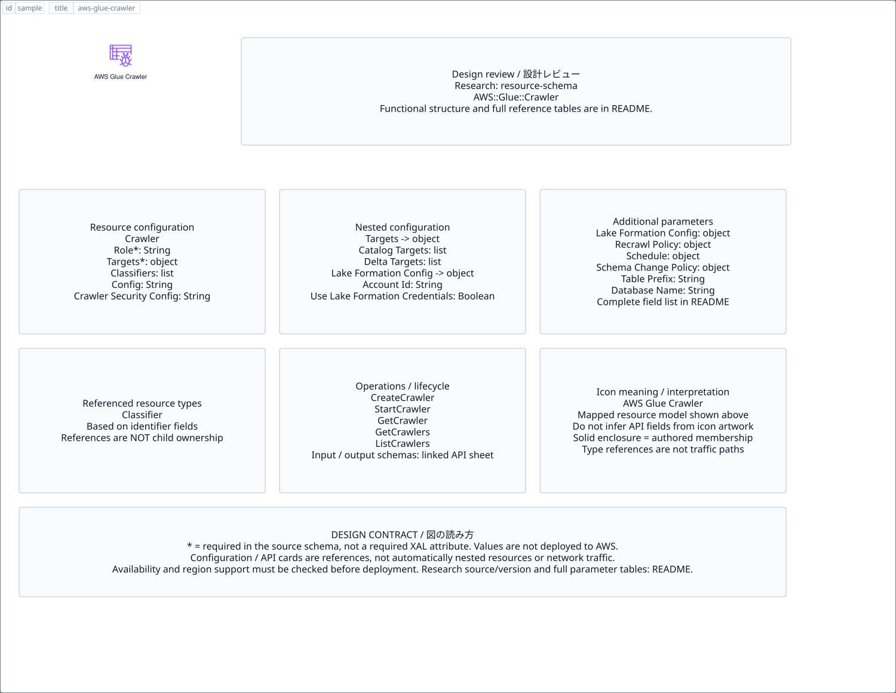

# `aws-glue-crawler` — AWS Glue Crawler

[SVG preview](sample.svg) · [Editable XAL](sample.xal) · [Catalog](../README.md)



AWS resource icon. Use a label and explicit annotations to describe its role; scope is selected by the author.

- Kind: `resource`; category: Analytics.
- Diagram scope: `logical` (recommendation, not AWS deployment validation).
- Default catalog ID: 1432. Covered catalog IDs: 1432.
- Implementation: V1 and V2; fixed AWS icon with a wrapped label and explicit functional annotations.

## Parameters

`id` is a required, unique connection ID, not a catalog number. `label`/`title`/`name` override the label; an empty label hides it. `size` > 0 defaults to 48 px. `label-width` > 0 defaults to 160 px (default box width, at least icon size + 12 px). Explicit `width`/`height` must contain the icon and label. `visible="false"` hides it. Children and icon overrides are not supported; use a group for containment.

`detail` adds a free-form diagram annotation. `show-details="false"` hides annotation text. Only supplied values are shown; none are sent to AWS. Service/resource annotations appear on separate wrapped lines.

| Parameter | Type | Meaning | Example |
|---|---|---|---|
| `input` | text | Input data annotation | `Application events` |
| `output` | text | Output data annotation | `Insights` |

## Review notes

The catalog provides a baseline for per-component development, not a simulation of the AWS control plane. This component's current functional parameters are the ones listed above. Additional service-specific visual behavior can be developed here without replacing catalog IDs in diagrams. Edit `sample.xal`, then run:

```sh
npm run generate:aws-samples -- --render --tag=aws-glue-crawler
```

<!-- aws-functional-research:start -->
## 機能調査・構成デザイン（2026-09-06）

分類: `resource-schema`。サービス文脈: [`aws-glue`](../aws-glue/README.md)。

サンプルはアイコンと、設定・内包構造・関連リソース・操作を分離したレビューシートです。設定カードは編集可能な `rectangle`、グループは既存の専用タグで実装しています。カードのフィールド名を新しい XAL 属性として受理するわけではありません。専用タグが受理する属性は上の Parameters 表を参照してください。

実線の通信と、設定の参照・同じサービスに属する型一覧を区別します。スキーマの必須項目は AWS 側の仕様であり、図の必須入力ではありません。記載の構成モデル/API は取り込んだ公式資料の範囲であり、全リージョン・全機能の完全性や稼働可否を保証しません。

### 構成モデル: `AWS::Glue::Crawler`

[公式リファレンス](https://docs.aws.amazon.com/AWSCloudFormation/latest/UserGuide/aws-resource-glue-crawler.html)。全 14 プロパティを型付きで列挙します（表示カードには主要項目のみ）。

| Field | Type | Required in AWS schema |
|---|---|---|
| [Classifiers](https://docs.aws.amazon.com/AWSCloudFormation/latest/UserGuide/aws-resource-glue-crawler.html#cfn-glue-crawler-classifiers) | `List<String>` | no |
| [Configuration](https://docs.aws.amazon.com/AWSCloudFormation/latest/UserGuide/aws-resource-glue-crawler.html#cfn-glue-crawler-configuration) | `String` | no |
| [CrawlerSecurityConfiguration](https://docs.aws.amazon.com/AWSCloudFormation/latest/UserGuide/aws-resource-glue-crawler.html#cfn-glue-crawler-crawlersecurityconfiguration) | `String` | no |
| [DatabaseName](https://docs.aws.amazon.com/AWSCloudFormation/latest/UserGuide/aws-resource-glue-crawler.html#cfn-glue-crawler-databasename) | `String` | no |
| [Description](https://docs.aws.amazon.com/AWSCloudFormation/latest/UserGuide/aws-resource-glue-crawler.html#cfn-glue-crawler-description) | `String` | no |
| [LakeFormationConfiguration](https://docs.aws.amazon.com/AWSCloudFormation/latest/UserGuide/aws-resource-glue-crawler.html#cfn-glue-crawler-lakeformationconfiguration) | `LakeFormationConfiguration` | no |
| [Name](https://docs.aws.amazon.com/AWSCloudFormation/latest/UserGuide/aws-resource-glue-crawler.html#cfn-glue-crawler-name) | `String` | no |
| [RecrawlPolicy](https://docs.aws.amazon.com/AWSCloudFormation/latest/UserGuide/aws-resource-glue-crawler.html#cfn-glue-crawler-recrawlpolicy) | `RecrawlPolicy` | no |
| [Role](https://docs.aws.amazon.com/AWSCloudFormation/latest/UserGuide/aws-resource-glue-crawler.html#cfn-glue-crawler-role) | `String` | yes |
| [Schedule](https://docs.aws.amazon.com/AWSCloudFormation/latest/UserGuide/aws-resource-glue-crawler.html#cfn-glue-crawler-schedule) | `Schedule` | no |
| [SchemaChangePolicy](https://docs.aws.amazon.com/AWSCloudFormation/latest/UserGuide/aws-resource-glue-crawler.html#cfn-glue-crawler-schemachangepolicy) | `SchemaChangePolicy` | no |
| [TablePrefix](https://docs.aws.amazon.com/AWSCloudFormation/latest/UserGuide/aws-resource-glue-crawler.html#cfn-glue-crawler-tableprefix) | `String` | no |
| [Tags](https://docs.aws.amazon.com/AWSCloudFormation/latest/UserGuide/aws-resource-glue-crawler.html#cfn-glue-crawler-tags) | `Json` | no |
| [Targets](https://docs.aws.amazon.com/AWSCloudFormation/latest/UserGuide/aws-resource-glue-crawler.html#cfn-glue-crawler-targets) | `Targets` | yes |

#### Targets → `AWS::Glue::Crawler.Targets`

| Field | Type | Required in AWS schema |
|---|---|---|
| [CatalogTargets](https://docs.aws.amazon.com/AWSCloudFormation/latest/UserGuide/aws-properties-glue-crawler-targets.html#cfn-glue-crawler-targets-catalogtargets) | `List<CatalogTarget>` | no |
| [DeltaTargets](https://docs.aws.amazon.com/AWSCloudFormation/latest/UserGuide/aws-properties-glue-crawler-targets.html#cfn-glue-crawler-targets-deltatargets) | `List<DeltaTarget>` | no |
| [DynamoDBTargets](https://docs.aws.amazon.com/AWSCloudFormation/latest/UserGuide/aws-properties-glue-crawler-targets.html#cfn-glue-crawler-targets-dynamodbtargets) | `List<DynamoDBTarget>` | no |
| [HudiTargets](https://docs.aws.amazon.com/AWSCloudFormation/latest/UserGuide/aws-properties-glue-crawler-targets.html#cfn-glue-crawler-targets-huditargets) | `List<HudiTarget>` | no |
| [IcebergTargets](https://docs.aws.amazon.com/AWSCloudFormation/latest/UserGuide/aws-properties-glue-crawler-targets.html#cfn-glue-crawler-targets-icebergtargets) | `List<IcebergTarget>` | no |
| [JdbcTargets](https://docs.aws.amazon.com/AWSCloudFormation/latest/UserGuide/aws-properties-glue-crawler-targets.html#cfn-glue-crawler-targets-jdbctargets) | `List<JdbcTarget>` | no |
| [MongoDBTargets](https://docs.aws.amazon.com/AWSCloudFormation/latest/UserGuide/aws-properties-glue-crawler-targets.html#cfn-glue-crawler-targets-mongodbtargets) | `List<MongoDBTarget>` | no |
| [S3Targets](https://docs.aws.amazon.com/AWSCloudFormation/latest/UserGuide/aws-properties-glue-crawler-targets.html#cfn-glue-crawler-targets-s3targets) | `List<S3Target>` | no |

#### LakeFormationConfiguration → `AWS::Glue::Crawler.LakeFormationConfiguration`

| Field | Type | Required in AWS schema |
|---|---|---|
| [AccountId](https://docs.aws.amazon.com/AWSCloudFormation/latest/UserGuide/aws-properties-glue-crawler-lakeformationconfiguration.html#cfn-glue-crawler-lakeformationconfiguration-accountid) | `String` | no |
| [UseLakeFormationCredentials](https://docs.aws.amazon.com/AWSCloudFormation/latest/UserGuide/aws-properties-glue-crawler-lakeformationconfiguration.html#cfn-glue-crawler-lakeformationconfiguration-uselakeformationcredentials) | `Boolean` | no |

#### RecrawlPolicy → `AWS::Glue::Crawler.RecrawlPolicy`

| Field | Type | Required in AWS schema |
|---|---|---|
| [RecrawlBehavior](https://docs.aws.amazon.com/AWSCloudFormation/latest/UserGuide/aws-properties-glue-crawler-recrawlpolicy.html#cfn-glue-crawler-recrawlpolicy-recrawlbehavior) | `String` | no |

#### Schedule → `AWS::Glue::Crawler.Schedule`

| Field | Type | Required in AWS schema |
|---|---|---|
| [ScheduleExpression](https://docs.aws.amazon.com/AWSCloudFormation/latest/UserGuide/aws-properties-glue-crawler-schedule.html#cfn-glue-crawler-schedule-scheduleexpression) | `String` | no |

#### SchemaChangePolicy → `AWS::Glue::Crawler.SchemaChangePolicy`

| Field | Type | Required in AWS schema |
|---|---|---|
| [DeleteBehavior](https://docs.aws.amazon.com/AWSCloudFormation/latest/UserGuide/aws-properties-glue-crawler-schemachangepolicy.html#cfn-glue-crawler-schemachangepolicy-deletebehavior) | `String` | no |
| [UpdateBehavior](https://docs.aws.amazon.com/AWSCloudFormation/latest/UserGuide/aws-properties-glue-crawler-schemachangepolicy.html#cfn-glue-crawler-schemachangepolicy-updatebehavior) | `String` | no |

### 関連する構成リソース（29 型）

同じサービス文脈の型一覧です。すべてがこのアイコンの子リソースという意味ではありません。さらに深い入れ子は [公式スキーマのスナップショット](../research/cloudformation-models.json) に記録しています。

- [AWS::Glue::Blueprint](https://docs.aws.amazon.com/AWSCloudFormation/latest/UserGuide/aws-resource-glue-blueprint.html)
- [AWS::Glue::Catalog](https://docs.aws.amazon.com/AWSCloudFormation/latest/UserGuide/aws-resource-glue-catalog.html)
- [AWS::Glue::Classifier](https://docs.aws.amazon.com/AWSCloudFormation/latest/UserGuide/aws-resource-glue-classifier.html)
- [AWS::Glue::Connection](https://docs.aws.amazon.com/AWSCloudFormation/latest/UserGuide/aws-resource-glue-connection.html)
- [AWS::Glue::Crawler](https://docs.aws.amazon.com/AWSCloudFormation/latest/UserGuide/aws-resource-glue-crawler.html)
- [AWS::Glue::CustomEntityType](https://docs.aws.amazon.com/AWSCloudFormation/latest/UserGuide/aws-resource-glue-customentitytype.html)
- [AWS::Glue::Database](https://docs.aws.amazon.com/AWSCloudFormation/latest/UserGuide/aws-resource-glue-database.html)
- [AWS::Glue::DataCatalogEncryptionSettings](https://docs.aws.amazon.com/AWSCloudFormation/latest/UserGuide/aws-resource-glue-datacatalogencryptionsettings.html)
- [AWS::Glue::DataQualityRuleset](https://docs.aws.amazon.com/AWSCloudFormation/latest/UserGuide/aws-resource-glue-dataqualityruleset.html)
- [AWS::Glue::DevEndpoint](https://docs.aws.amazon.com/AWSCloudFormation/latest/UserGuide/aws-resource-glue-devendpoint.html)
- [AWS::Glue::IdentityCenterConfiguration](https://docs.aws.amazon.com/AWSCloudFormation/latest/UserGuide/aws-resource-glue-identitycenterconfiguration.html)
- [AWS::Glue::Integration](https://docs.aws.amazon.com/AWSCloudFormation/latest/UserGuide/aws-resource-glue-integration.html)
- [AWS::Glue::IntegrationResourceProperty](https://docs.aws.amazon.com/AWSCloudFormation/latest/UserGuide/aws-resource-glue-integrationresourceproperty.html)
- [AWS::Glue::Job](https://docs.aws.amazon.com/AWSCloudFormation/latest/UserGuide/aws-resource-glue-job.html)
- [AWS::Glue::MLTransform](https://docs.aws.amazon.com/AWSCloudFormation/latest/UserGuide/aws-resource-glue-mltransform.html)
- [AWS::Glue::Partition](https://docs.aws.amazon.com/AWSCloudFormation/latest/UserGuide/aws-resource-glue-partition.html)
- [AWS::Glue::Registry](https://docs.aws.amazon.com/AWSCloudFormation/latest/UserGuide/aws-resource-glue-registry.html)
- [AWS::Glue::Schema](https://docs.aws.amazon.com/AWSCloudFormation/latest/UserGuide/aws-resource-glue-schema.html)
- [AWS::Glue::SchemaVersion](https://docs.aws.amazon.com/AWSCloudFormation/latest/UserGuide/aws-resource-glue-schemaversion.html)
- [AWS::Glue::SchemaVersionMetadata](https://docs.aws.amazon.com/AWSCloudFormation/latest/UserGuide/aws-resource-glue-schemaversionmetadata.html)
- [AWS::Glue::SecurityConfiguration](https://docs.aws.amazon.com/AWSCloudFormation/latest/UserGuide/aws-resource-glue-securityconfiguration.html)
- [AWS::Glue::Session](https://docs.aws.amazon.com/AWSCloudFormation/latest/UserGuide/aws-resource-glue-session.html)
- [AWS::Glue::Table](https://docs.aws.amazon.com/AWSCloudFormation/latest/UserGuide/aws-resource-glue-table.html)
- [AWS::Glue::TableOptimizer](https://docs.aws.amazon.com/AWSCloudFormation/latest/UserGuide/aws-resource-glue-tableoptimizer.html)
- [AWS::Glue::TableVersion](https://docs.aws.amazon.com/AWSCloudFormation/latest/UserGuide/aws-resource-glue-tableversion.html)
- [AWS::Glue::Trigger](https://docs.aws.amazon.com/AWSCloudFormation/latest/UserGuide/aws-resource-glue-trigger.html)
- [AWS::Glue::UsageProfile](https://docs.aws.amazon.com/AWSCloudFormation/latest/UserGuide/aws-resource-glue-usageprofile.html)
- [AWS::Glue::UserDefinedFunction](https://docs.aws.amazon.com/AWSCloudFormation/latest/UserGuide/aws-resource-glue-userdefinedfunction.html)
- [AWS::Glue::Workflow](https://docs.aws.amazon.com/AWSCloudFormation/latest/UserGuide/aws-resource-glue-workflow.html)

### API の操作・パラメータ

- [AWS Glue: 299 操作の入力・出力一覧](../research/api/glue.md)（API version 2017-03-31）

### 出典・調査範囲

- [公式資料 1](https://docs.aws.amazon.com/AWSCloudFormation/latest/UserGuide/aws-resource-glue-crawler.html)
- [公式資料 2](https://github.com/boto/botocore/blob/develop/botocore/data/glue/2017-03-31/service-2.json)

CloudFormation 仕様 263.0.0、AWS SDK 431 サービスモデルをオフラインで参照。取得日・元データの SHA-256 は [調査マニフェスト](../research/README.md) を参照。API モデル名・フィールド名は仕様から抽出し、説明本文を転載していません。利用可能性は全サービス一律には確認できないため、提供終了の確認がないものも「現在利用可能」と断定していません。

### 次の部品レビュー

- 本アイコンが独立したリソースか、機能・状態・デバイスの記号かを確認する。
- 詳細カードのうち専用の子タグ・参照属性として実装する範囲を選ぶ。
- 通信、制御、認証、監視の関係を分け、必要な接続点・配置制約を確認する。
- 編集後は `npm run generate:aws-samples -- --render --tag=aws-glue-crawler`。通常の再描画は XAL/README を上書きしない。
<!-- aws-functional-research:end -->
