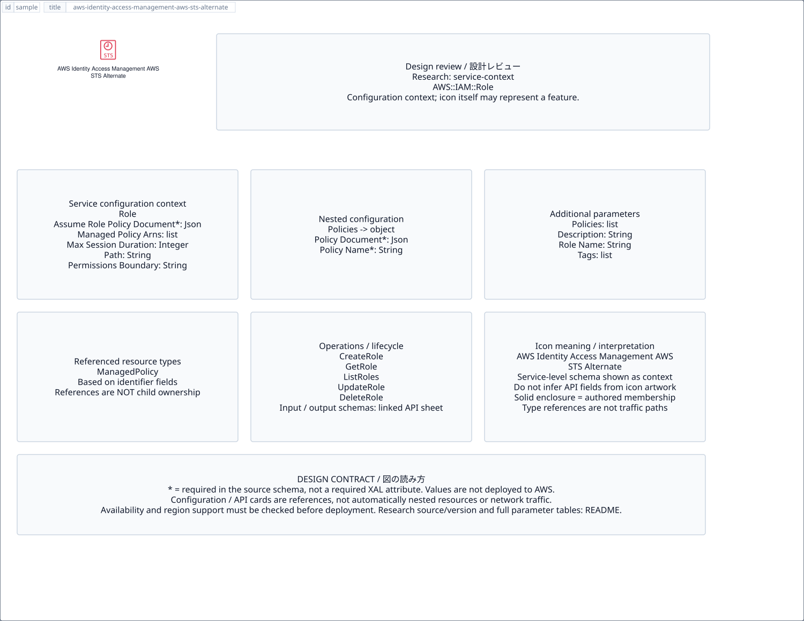

# `aws-identity-access-management-aws-sts-alternate` — AWS Identity Access Management AWS STS Alternate

[SVG preview](sample.svg) · [Editable XAL](sample.xal) · [Catalog](../README.md)



AWS resource icon. Use a label and explicit annotations to describe its role; scope is selected by the author.

- Kind: `resource`; category: Security Identity Compliance.
- Diagram scope: `logical` (recommendation, not AWS deployment validation).
- Default catalog ID: 1469. Covered catalog IDs: 1469.
- Implementation: V1 and V2; fixed AWS icon with a wrapped label and explicit functional annotations.

## Parameters

`id` is a required, unique connection ID, not a catalog number. `label`/`title`/`name` override the label; an empty label hides it. `size` > 0 defaults to 48 px. `label-width` > 0 defaults to 160 px (default box width, at least icon size + 12 px). Explicit `width`/`height` must contain the icon and label. `visible="false"` hides it. Children and icon overrides are not supported; use a group for containment.

`detail` adds a free-form diagram annotation. `show-details="false"` hides annotation text. Only supplied values are shown; none are sent to AWS. Service/resource annotations appear on separate wrapped lines.

| Parameter | Type | Meaning | Example |
|---|---|---|---|
| `protects` | text | Protected resource or policy annotation | `Application access` |

## Review notes

The catalog provides a baseline for per-component development, not a simulation of the AWS control plane. This component's current functional parameters are the ones listed above. Additional service-specific visual behavior can be developed here without replacing catalog IDs in diagrams. Edit `sample.xal`, then run:

```sh
npm run generate:aws-samples -- --render --tag=aws-identity-access-management-aws-sts-alternate
```

<!-- aws-functional-research:start -->
## 機能調査・構成デザイン（2026-09-06）

分類: `service-context`。サービス文脈: [`aws-identity-and-access-management`](../aws-identity-and-access-management/README.md)。

サンプルはアイコンと、設定・内包構造・関連リソース・操作を分離したレビューシートです。設定カードは編集可能な `rectangle`、グループは既存の専用タグで実装しています。カードのフィールド名を新しい XAL 属性として受理するわけではありません。専用タグが受理する属性は上の Parameters 表を参照してください。

実線の通信と、設定の参照・同じサービスに属する型一覧を区別します。スキーマの必須項目は AWS 側の仕様であり、図の必須入力ではありません。記載の構成モデル/API は取り込んだ公式資料の範囲であり、全リージョン・全機能の完全性や稼働可否を保証しません。

**重要:** このアイコンに対応する独立した構成リソースを断定せず、所属サービスの構成モデルを参考表示しています。アイコン名や絵柄から属性・親子関係・通信を推測しません。

### 構成モデル: `AWS::IAM::Role`

[公式リファレンス](https://docs.aws.amazon.com/AWSCloudFormation/latest/UserGuide/aws-resource-iam-role.html)。全 9 プロパティを型付きで列挙します（表示カードには主要項目のみ）。

| Field | Type | Required in AWS schema |
|---|---|---|
| [AssumeRolePolicyDocument](https://docs.aws.amazon.com/AWSCloudFormation/latest/UserGuide/aws-resource-iam-role.html#cfn-iam-role-assumerolepolicydocument) | `Json` | yes |
| [Description](https://docs.aws.amazon.com/AWSCloudFormation/latest/UserGuide/aws-resource-iam-role.html#cfn-iam-role-description) | `String` | no |
| [ManagedPolicyArns](https://docs.aws.amazon.com/AWSCloudFormation/latest/UserGuide/aws-resource-iam-role.html#cfn-iam-role-managedpolicyarns) | `List<String>` | no |
| [MaxSessionDuration](https://docs.aws.amazon.com/AWSCloudFormation/latest/UserGuide/aws-resource-iam-role.html#cfn-iam-role-maxsessionduration) | `Integer` | no |
| [Path](https://docs.aws.amazon.com/AWSCloudFormation/latest/UserGuide/aws-resource-iam-role.html#cfn-iam-role-path) | `String` | no |
| [PermissionsBoundary](https://docs.aws.amazon.com/AWSCloudFormation/latest/UserGuide/aws-resource-iam-role.html#cfn-iam-role-permissionsboundary) | `String` | no |
| [Policies](https://docs.aws.amazon.com/AWSCloudFormation/latest/UserGuide/aws-resource-iam-role.html#cfn-iam-role-policies) | `List<Policy>` | no |
| [RoleName](https://docs.aws.amazon.com/AWSCloudFormation/latest/UserGuide/aws-resource-iam-role.html#cfn-iam-role-rolename) | `String` | no |
| [Tags](https://docs.aws.amazon.com/AWSCloudFormation/latest/UserGuide/aws-resource-iam-role.html#cfn-iam-role-tags) | `List<Tag>` | no |

#### Policies → `AWS::IAM::Role.Policy`

| Field | Type | Required in AWS schema |
|---|---|---|
| [PolicyDocument](https://docs.aws.amazon.com/AWSCloudFormation/latest/UserGuide/aws-properties-iam-role-policy.html#cfn-iam-role-policy-policydocument) | `Json` | yes |
| [PolicyName](https://docs.aws.amazon.com/AWSCloudFormation/latest/UserGuide/aws-properties-iam-role-policy.html#cfn-iam-role-policy-policyname) | `String` | yes |

### 関連する構成リソース（21 型）

同じサービス文脈の型一覧です。すべてがこのアイコンの子リソースという意味ではありません。さらに深い入れ子は [公式スキーマのスナップショット](../research/cloudformation-models.json) に記録しています。

- [AWS::AccessAnalyzer::Analyzer](https://docs.aws.amazon.com/AWSCloudFormation/latest/UserGuide/aws-resource-accessanalyzer-analyzer.html)
- [AWS::AccessAnalyzer::ArchiveRule](https://docs.aws.amazon.com/AWSCloudFormation/latest/UserGuide/aws-resource-accessanalyzer-archiverule.html)
- [AWS::IAM::AccessKey](https://docs.aws.amazon.com/AWSCloudFormation/latest/UserGuide/aws-properties-iam-accesskey.html)
- [AWS::IAM::Group](https://docs.aws.amazon.com/AWSCloudFormation/latest/UserGuide/aws-resource-iam-group.html)
- [AWS::IAM::GroupPolicy](https://docs.aws.amazon.com/AWSCloudFormation/latest/UserGuide/aws-resource-iam-grouppolicy.html)
- [AWS::IAM::InstanceProfile](https://docs.aws.amazon.com/AWSCloudFormation/latest/UserGuide/aws-resource-iam-instanceprofile.html)
- [AWS::IAM::ManagedPolicy](https://docs.aws.amazon.com/AWSCloudFormation/latest/UserGuide/aws-resource-iam-managedpolicy.html)
- [AWS::IAM::OIDCProvider](https://docs.aws.amazon.com/AWSCloudFormation/latest/UserGuide/aws-resource-iam-oidcprovider.html)
- [AWS::IAM::Policy](https://docs.aws.amazon.com/AWSCloudFormation/latest/UserGuide/aws-resource-iam-policy.html)
- [AWS::IAM::Role](https://docs.aws.amazon.com/AWSCloudFormation/latest/UserGuide/aws-resource-iam-role.html)
- [AWS::IAM::RolePolicy](https://docs.aws.amazon.com/AWSCloudFormation/latest/UserGuide/aws-resource-iam-rolepolicy.html)
- [AWS::IAM::SAMLProvider](https://docs.aws.amazon.com/AWSCloudFormation/latest/UserGuide/aws-resource-iam-samlprovider.html)
- [AWS::IAM::ServerCertificate](https://docs.aws.amazon.com/AWSCloudFormation/latest/UserGuide/aws-resource-iam-servercertificate.html)
- [AWS::IAM::ServiceLinkedRole](https://docs.aws.amazon.com/AWSCloudFormation/latest/UserGuide/aws-resource-iam-servicelinkedrole.html)
- [AWS::IAM::User](https://docs.aws.amazon.com/AWSCloudFormation/latest/UserGuide/aws-resource-iam-user.html)
- [AWS::IAM::UserPolicy](https://docs.aws.amazon.com/AWSCloudFormation/latest/UserGuide/aws-resource-iam-userpolicy.html)
- [AWS::IAM::UserToGroupAddition](https://docs.aws.amazon.com/AWSCloudFormation/latest/UserGuide/aws-properties-iam-addusertogroup.html)
- [AWS::IAM::VirtualMFADevice](https://docs.aws.amazon.com/AWSCloudFormation/latest/UserGuide/aws-resource-iam-virtualmfadevice.html)
- [AWS::RolesAnywhere::CRL](https://docs.aws.amazon.com/AWSCloudFormation/latest/UserGuide/aws-resource-rolesanywhere-crl.html)
- [AWS::RolesAnywhere::Profile](https://docs.aws.amazon.com/AWSCloudFormation/latest/UserGuide/aws-resource-rolesanywhere-profile.html)
- [AWS::RolesAnywhere::TrustAnchor](https://docs.aws.amazon.com/AWSCloudFormation/latest/UserGuide/aws-resource-rolesanywhere-trustanchor.html)

### API の操作・パラメータ

- [AWS Identity and Access Management: 180 操作の入力・出力一覧](../research/api/iam.md)（API version 2010-05-08）
- [Access Analyzer: 39 操作の入力・出力一覧](../research/api/accessanalyzer.md)（API version 2019-11-01）
- [IAM Roles Anywhere: 30 操作の入力・出力一覧](../research/api/rolesanywhere.md)（API version 2018-05-10）

### 出典・調査範囲

- [公式資料 1](https://docs.aws.amazon.com/AWSCloudFormation/latest/UserGuide/aws-resource-iam-role.html)
- [公式資料 2](https://github.com/boto/botocore/blob/develop/botocore/data/iam/2010-05-08/service-2.json)
- [公式資料 3](https://github.com/boto/botocore/blob/develop/botocore/data/accessanalyzer/2019-11-01/service-2.json)
- [公式資料 4](https://github.com/boto/botocore/blob/develop/botocore/data/rolesanywhere/2018-05-10/service-2.json)

CloudFormation 仕様 263.0.0、AWS SDK 431 サービスモデルをオフラインで参照。取得日・元データの SHA-256 は [調査マニフェスト](../research/README.md) を参照。API モデル名・フィールド名は仕様から抽出し、説明本文を転載していません。利用可能性は全サービス一律には確認できないため、提供終了の確認がないものも「現在利用可能」と断定していません。

### 次の部品レビュー

- 本アイコンが独立したリソースか、機能・状態・デバイスの記号かを確認する。
- 詳細カードのうち専用の子タグ・参照属性として実装する範囲を選ぶ。
- 通信、制御、認証、監視の関係を分け、必要な接続点・配置制約を確認する。
- 編集後は `npm run generate:aws-samples -- --render --tag=aws-identity-access-management-aws-sts-alternate`。通常の再描画は XAL/README を上書きしない。
<!-- aws-functional-research:end -->
