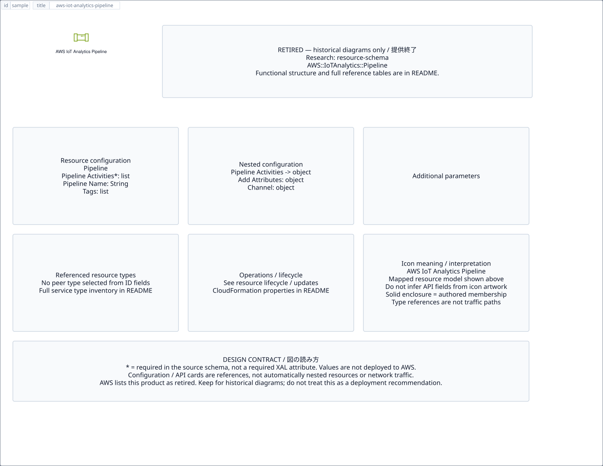

# `aws-iot-analytics-pipeline` — AWS IoT Analytics Pipeline

[SVG preview](sample.svg) · [Editable XAL](sample.xal) · [Catalog](../README.md)



AWS resource icon. Use a label and explicit annotations to describe its role; scope is selected by the author.

- Kind: `resource`; category: IoT.
- Diagram scope: `logical` (recommendation, not AWS deployment validation).
- Default catalog ID: 1341. Covered catalog IDs: 1341.
- Implementation: V1 and V2; fixed AWS icon with a wrapped label and explicit functional annotations.

## Parameters

`id` is a required, unique connection ID, not a catalog number. `label`/`title`/`name` override the label; an empty label hides it. `size` > 0 defaults to 48 px. `label-width` > 0 defaults to 160 px (default box width, at least icon size + 12 px). Explicit `width`/`height` must contain the icon and label. `visible="false"` hides it. Children and icon overrides are not supported; use a group for containment.

`detail` adds a free-form diagram annotation. `show-details="false"` hides annotation text. Only supplied values are shown; none are sent to AWS. Service/resource annotations appear on separate wrapped lines.

| Parameter | Type | Meaning | Example |
|---|---|---|---|
| `role` | text | Architectural role annotation | `Application component` |

## Review notes

The catalog provides a baseline for per-component development, not a simulation of the AWS control plane. This component's current functional parameters are the ones listed above. Additional service-specific visual behavior can be developed here without replacing catalog IDs in diagrams. Edit `sample.xal`, then run:

```sh
npm run generate:aws-samples -- --render --tag=aws-iot-analytics-pipeline
```

<!-- aws-functional-research:start -->
## 機能調査・構成デザイン（2026-09-06）

分類: `resource-schema`。サービス文脈: [`aws-iot-analytics`](../aws-iot-analytics/README.md)。

**提供終了済み。** [AWS lifecycle](https://docs.aws.amazon.com/general/latest/gr/full_shutdown_services.html) に基づく歴史的構成図向けの部品です。スキーマやアイコンの残存は現在の提供を意味しません。

サンプルはアイコンと、設定・内包構造・関連リソース・操作を分離したレビューシートです。設定カードは編集可能な `rectangle`、グループは既存の専用タグで実装しています。カードのフィールド名を新しい XAL 属性として受理するわけではありません。専用タグが受理する属性は上の Parameters 表を参照してください。

実線の通信と、設定の参照・同じサービスに属する型一覧を区別します。スキーマの必須項目は AWS 側の仕様であり、図の必須入力ではありません。記載の構成モデル/API は取り込んだ公式資料の範囲であり、全リージョン・全機能の完全性や稼働可否を保証しません。

### 構成モデル: `AWS::IoTAnalytics::Pipeline`

[公式リファレンス](https://docs.aws.amazon.com/AWSCloudFormation/latest/UserGuide/aws-resource-iotanalytics-pipeline.html)。全 3 プロパティを型付きで列挙します（表示カードには主要項目のみ）。

| Field | Type | Required in AWS schema |
|---|---|---|
| [PipelineActivities](https://docs.aws.amazon.com/AWSCloudFormation/latest/UserGuide/aws-resource-iotanalytics-pipeline.html#cfn-iotanalytics-pipeline-pipelineactivities) | `List<Activity>` | yes |
| [PipelineName](https://docs.aws.amazon.com/AWSCloudFormation/latest/UserGuide/aws-resource-iotanalytics-pipeline.html#cfn-iotanalytics-pipeline-pipelinename) | `String` | no |
| [Tags](https://docs.aws.amazon.com/AWSCloudFormation/latest/UserGuide/aws-resource-iotanalytics-pipeline.html#cfn-iotanalytics-pipeline-tags) | `List<Tag>` | no |

#### PipelineActivities → `AWS::IoTAnalytics::Pipeline.Activity`

| Field | Type | Required in AWS schema |
|---|---|---|
| [AddAttributes](https://docs.aws.amazon.com/AWSCloudFormation/latest/UserGuide/aws-properties-iotanalytics-pipeline-activity.html#cfn-iotanalytics-pipeline-activity-addattributes) | `AddAttributes` | no |
| [Channel](https://docs.aws.amazon.com/AWSCloudFormation/latest/UserGuide/aws-properties-iotanalytics-pipeline-activity.html#cfn-iotanalytics-pipeline-activity-channel) | `Channel` | no |
| [Datastore](https://docs.aws.amazon.com/AWSCloudFormation/latest/UserGuide/aws-properties-iotanalytics-pipeline-activity.html#cfn-iotanalytics-pipeline-activity-datastore) | `Datastore` | no |
| [DeviceRegistryEnrich](https://docs.aws.amazon.com/AWSCloudFormation/latest/UserGuide/aws-properties-iotanalytics-pipeline-activity.html#cfn-iotanalytics-pipeline-activity-deviceregistryenrich) | `DeviceRegistryEnrich` | no |
| [DeviceShadowEnrich](https://docs.aws.amazon.com/AWSCloudFormation/latest/UserGuide/aws-properties-iotanalytics-pipeline-activity.html#cfn-iotanalytics-pipeline-activity-deviceshadowenrich) | `DeviceShadowEnrich` | no |
| [Filter](https://docs.aws.amazon.com/AWSCloudFormation/latest/UserGuide/aws-properties-iotanalytics-pipeline-activity.html#cfn-iotanalytics-pipeline-activity-filter) | `Filter` | no |
| [Lambda](https://docs.aws.amazon.com/AWSCloudFormation/latest/UserGuide/aws-properties-iotanalytics-pipeline-activity.html#cfn-iotanalytics-pipeline-activity-lambda) | `Lambda` | no |
| [Math](https://docs.aws.amazon.com/AWSCloudFormation/latest/UserGuide/aws-properties-iotanalytics-pipeline-activity.html#cfn-iotanalytics-pipeline-activity-math) | `Math` | no |
| [RemoveAttributes](https://docs.aws.amazon.com/AWSCloudFormation/latest/UserGuide/aws-properties-iotanalytics-pipeline-activity.html#cfn-iotanalytics-pipeline-activity-removeattributes) | `RemoveAttributes` | no |
| [SelectAttributes](https://docs.aws.amazon.com/AWSCloudFormation/latest/UserGuide/aws-properties-iotanalytics-pipeline-activity.html#cfn-iotanalytics-pipeline-activity-selectattributes) | `SelectAttributes` | no |

### 関連する構成リソース（4 型）

同じサービス文脈の型一覧です。すべてがこのアイコンの子リソースという意味ではありません。さらに深い入れ子は [公式スキーマのスナップショット](../research/cloudformation-models.json) に記録しています。

- [AWS::IoTAnalytics::Channel](https://docs.aws.amazon.com/AWSCloudFormation/latest/UserGuide/aws-resource-iotanalytics-channel.html)
- [AWS::IoTAnalytics::Dataset](https://docs.aws.amazon.com/AWSCloudFormation/latest/UserGuide/aws-resource-iotanalytics-dataset.html)
- [AWS::IoTAnalytics::Datastore](https://docs.aws.amazon.com/AWSCloudFormation/latest/UserGuide/aws-resource-iotanalytics-datastore.html)
- [AWS::IoTAnalytics::Pipeline](https://docs.aws.amazon.com/AWSCloudFormation/latest/UserGuide/aws-resource-iotanalytics-pipeline.html)

### 出典・調査範囲

- [公式資料 1](https://docs.aws.amazon.com/AWSCloudFormation/latest/UserGuide/aws-resource-iotanalytics-pipeline.html)
- [公式資料 2](https://docs.aws.amazon.com/general/latest/gr/full_shutdown_services.html)

CloudFormation 仕様 263.0.0、AWS SDK 431 サービスモデルをオフラインで参照。取得日・元データの SHA-256 は [調査マニフェスト](../research/README.md) を参照。API モデル名・フィールド名は仕様から抽出し、説明本文を転載していません。利用可能性は全サービス一律には確認できないため、提供終了の確認がないものも「現在利用可能」と断定していません。

### 次の部品レビュー

- 本アイコンが独立したリソースか、機能・状態・デバイスの記号かを確認する。
- 詳細カードのうち専用の子タグ・参照属性として実装する範囲を選ぶ。
- 通信、制御、認証、監視の関係を分け、必要な接続点・配置制約を確認する。
- 編集後は `npm run generate:aws-samples -- --render --tag=aws-iot-analytics-pipeline`。通常の再描画は XAL/README を上書きしない。
<!-- aws-functional-research:end -->
