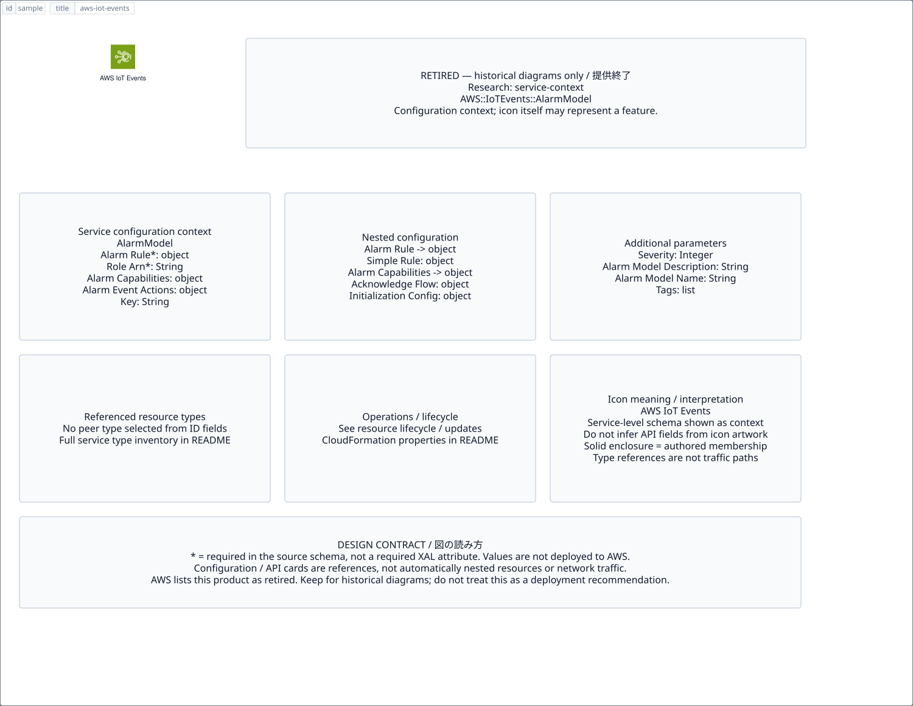

# `aws-iot-events` — AWS IoT Events

[SVG preview](sample.svg) · [Editable XAL](sample.xal) · [Catalog](../README.md)



AWS service icon. Use a label and explicit annotations to describe its role; scope is selected by the author.

- Kind: `service`; category: Internet of Things.
- Diagram scope: `service` (recommendation, not AWS deployment validation).
- Default catalog ID: 426. Covered catalog IDs: 390, 402, 414, 426.
- Implementation: V1 and V2; fixed AWS icon with a wrapped label and explicit functional annotations.

## Parameters

`id` is a required, unique connection ID, not a catalog number. `label`/`title`/`name` override the label; an empty label hides it. `size` > 0 defaults to 48 px. `label-width` > 0 defaults to 160 px (default box width, at least icon size + 12 px). Explicit `width`/`height` must contain the icon and label. `visible="false"` hides it. Children and icon overrides are not supported; use a group for containment.

`detail` adds a free-form diagram annotation. `show-details="false"` hides annotation text. Only supplied values are shown; none are sent to AWS. Service/resource annotations appear on separate wrapped lines.

| Parameter | Type | Meaning | Example |
|---|---|---|---|
| `device` | text | Device/workload annotation | `Sensor` |

## Review notes

The catalog provides a baseline for per-component development, not a simulation of the AWS control plane. This component's current functional parameters are the ones listed above. Additional service-specific visual behavior can be developed here without replacing catalog IDs in diagrams. Edit `sample.xal`, then run:

```sh
npm run generate:aws-samples -- --render --tag=aws-iot-events
```

<!-- aws-functional-research:start -->
## 機能調査・構成デザイン（2026-09-06）

分類: `service-context`。サービス文脈: [`aws-iot-events`](../aws-iot-events/README.md)。

**提供終了済み。** [AWS lifecycle](https://docs.aws.amazon.com/general/latest/gr/full_shutdown_services.html) に基づく歴史的構成図向けの部品です。スキーマやアイコンの残存は現在の提供を意味しません。

サンプルはアイコンと、設定・内包構造・関連リソース・操作を分離したレビューシートです。設定カードは編集可能な `rectangle`、グループは既存の専用タグで実装しています。カードのフィールド名を新しい XAL 属性として受理するわけではありません。専用タグが受理する属性は上の Parameters 表を参照してください。

実線の通信と、設定の参照・同じサービスに属する型一覧を区別します。スキーマの必須項目は AWS 側の仕様であり、図の必須入力ではありません。記載の構成モデル/API は取り込んだ公式資料の範囲であり、全リージョン・全機能の完全性や稼働可否を保証しません。

**重要:** このアイコンに対応する独立した構成リソースを断定せず、所属サービスの構成モデルを参考表示しています。アイコン名や絵柄から属性・親子関係・通信を推測しません。

### 構成モデル: `AWS::IoTEvents::AlarmModel`

[公式リファレンス](https://docs.aws.amazon.com/AWSCloudFormation/latest/UserGuide/aws-resource-iotevents-alarmmodel.html)。全 9 プロパティを型付きで列挙します（表示カードには主要項目のみ）。

| Field | Type | Required in AWS schema |
|---|---|---|
| [AlarmCapabilities](https://docs.aws.amazon.com/AWSCloudFormation/latest/UserGuide/aws-resource-iotevents-alarmmodel.html#cfn-iotevents-alarmmodel-alarmcapabilities) | `AlarmCapabilities` | no |
| [AlarmEventActions](https://docs.aws.amazon.com/AWSCloudFormation/latest/UserGuide/aws-resource-iotevents-alarmmodel.html#cfn-iotevents-alarmmodel-alarmeventactions) | `AlarmEventActions` | no |
| [AlarmModelDescription](https://docs.aws.amazon.com/AWSCloudFormation/latest/UserGuide/aws-resource-iotevents-alarmmodel.html#cfn-iotevents-alarmmodel-alarmmodeldescription) | `String` | no |
| [AlarmModelName](https://docs.aws.amazon.com/AWSCloudFormation/latest/UserGuide/aws-resource-iotevents-alarmmodel.html#cfn-iotevents-alarmmodel-alarmmodelname) | `String` | no |
| [AlarmRule](https://docs.aws.amazon.com/AWSCloudFormation/latest/UserGuide/aws-resource-iotevents-alarmmodel.html#cfn-iotevents-alarmmodel-alarmrule) | `AlarmRule` | yes |
| [Key](https://docs.aws.amazon.com/AWSCloudFormation/latest/UserGuide/aws-resource-iotevents-alarmmodel.html#cfn-iotevents-alarmmodel-key) | `String` | no |
| [RoleArn](https://docs.aws.amazon.com/AWSCloudFormation/latest/UserGuide/aws-resource-iotevents-alarmmodel.html#cfn-iotevents-alarmmodel-rolearn) | `String` | yes |
| [Severity](https://docs.aws.amazon.com/AWSCloudFormation/latest/UserGuide/aws-resource-iotevents-alarmmodel.html#cfn-iotevents-alarmmodel-severity) | `Integer` | no |
| [Tags](https://docs.aws.amazon.com/AWSCloudFormation/latest/UserGuide/aws-resource-iotevents-alarmmodel.html#cfn-iotevents-alarmmodel-tags) | `List<Tag>` | no |

#### AlarmRule → `AWS::IoTEvents::AlarmModel.AlarmRule`

| Field | Type | Required in AWS schema |
|---|---|---|
| [SimpleRule](https://docs.aws.amazon.com/AWSCloudFormation/latest/UserGuide/aws-properties-iotevents-alarmmodel-alarmrule.html#cfn-iotevents-alarmmodel-alarmrule-simplerule) | `SimpleRule` | no |

#### AlarmCapabilities → `AWS::IoTEvents::AlarmModel.AlarmCapabilities`

| Field | Type | Required in AWS schema |
|---|---|---|
| [AcknowledgeFlow](https://docs.aws.amazon.com/AWSCloudFormation/latest/UserGuide/aws-properties-iotevents-alarmmodel-alarmcapabilities.html#cfn-iotevents-alarmmodel-alarmcapabilities-acknowledgeflow) | `AcknowledgeFlow` | no |
| [InitializationConfiguration](https://docs.aws.amazon.com/AWSCloudFormation/latest/UserGuide/aws-properties-iotevents-alarmmodel-alarmcapabilities.html#cfn-iotevents-alarmmodel-alarmcapabilities-initializationconfiguration) | `InitializationConfiguration` | no |

#### AlarmEventActions → `AWS::IoTEvents::AlarmModel.AlarmEventActions`

| Field | Type | Required in AWS schema |
|---|---|---|
| [AlarmActions](https://docs.aws.amazon.com/AWSCloudFormation/latest/UserGuide/aws-properties-iotevents-alarmmodel-alarmeventactions.html#cfn-iotevents-alarmmodel-alarmeventactions-alarmactions) | `List<AlarmAction>` | no |

### 関連する構成リソース（3 型）

同じサービス文脈の型一覧です。すべてがこのアイコンの子リソースという意味ではありません。さらに深い入れ子は [公式スキーマのスナップショット](../research/cloudformation-models.json) に記録しています。

- [AWS::IoTEvents::AlarmModel](https://docs.aws.amazon.com/AWSCloudFormation/latest/UserGuide/aws-resource-iotevents-alarmmodel.html)
- [AWS::IoTEvents::DetectorModel](https://docs.aws.amazon.com/AWSCloudFormation/latest/UserGuide/aws-resource-iotevents-detectormodel.html)
- [AWS::IoTEvents::Input](https://docs.aws.amazon.com/AWSCloudFormation/latest/UserGuide/aws-resource-iotevents-input.html)

### 出典・調査範囲

- [公式資料 1](https://docs.aws.amazon.com/AWSCloudFormation/latest/UserGuide/aws-resource-iotevents-alarmmodel.html)
- [公式資料 2](https://docs.aws.amazon.com/general/latest/gr/full_shutdown_services.html)

CloudFormation 仕様 263.0.0、AWS SDK 431 サービスモデルをオフラインで参照。取得日・元データの SHA-256 は [調査マニフェスト](../research/README.md) を参照。API モデル名・フィールド名は仕様から抽出し、説明本文を転載していません。利用可能性は全サービス一律には確認できないため、提供終了の確認がないものも「現在利用可能」と断定していません。

### 次の部品レビュー

- 本アイコンが独立したリソースか、機能・状態・デバイスの記号かを確認する。
- 詳細カードのうち専用の子タグ・参照属性として実装する範囲を選ぶ。
- 通信、制御、認証、監視の関係を分け、必要な接続点・配置制約を確認する。
- 編集後は `npm run generate:aws-samples -- --render --tag=aws-iot-events`。通常の再描画は XAL/README を上書きしない。
<!-- aws-functional-research:end -->
