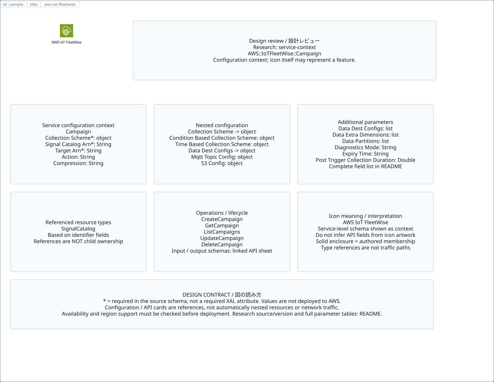

# `aws-iot-fleetwise` — AWS IoT FleetWise

[SVG preview](sample.svg) · [Editable XAL](sample.xal) · [Catalog](../README.md)



AWS service icon. Use a label and explicit annotations to describe its role; scope is selected by the author.

- Kind: `service`; category: Internet of Things.
- Diagram scope: `service` (recommendation, not AWS deployment validation).
- Default catalog ID: 428. Covered catalog IDs: 392, 404, 416, 428.
- Implementation: V1 and V2; fixed AWS icon with a wrapped label and explicit functional annotations.

## Parameters

`id` is a required, unique connection ID, not a catalog number. `label`/`title`/`name` override the label; an empty label hides it. `size` > 0 defaults to 48 px. `label-width` > 0 defaults to 160 px (default box width, at least icon size + 12 px). Explicit `width`/`height` must contain the icon and label. `visible="false"` hides it. Children and icon overrides are not supported; use a group for containment.

`detail` adds a free-form diagram annotation. `show-details="false"` hides annotation text. Only supplied values are shown; none are sent to AWS. Service/resource annotations appear on separate wrapped lines.

| Parameter | Type | Meaning | Example |
|---|---|---|---|
| `device` | text | Device/workload annotation | `Sensor` |

## Review notes

The catalog provides a baseline for per-component development, not a simulation of the AWS control plane. This component's current functional parameters are the ones listed above. Additional service-specific visual behavior can be developed here without replacing catalog IDs in diagrams. Edit `sample.xal`, then run:

```sh
npm run generate:aws-samples -- --render --tag=aws-iot-fleetwise
```

<!-- aws-functional-research:start -->
## 機能調査・構成デザイン（2026-09-06）

分類: `service-context`。サービス文脈: [`aws-iot-fleetwise`](../aws-iot-fleetwise/README.md)。

サンプルはアイコンと、設定・内包構造・関連リソース・操作を分離したレビューシートです。設定カードは編集可能な `rectangle`、グループは既存の専用タグで実装しています。カードのフィールド名を新しい XAL 属性として受理するわけではありません。専用タグが受理する属性は上の Parameters 表を参照してください。

実線の通信と、設定の参照・同じサービスに属する型一覧を区別します。スキーマの必須項目は AWS 側の仕様であり、図の必須入力ではありません。記載の構成モデル/API は取り込んだ公式資料の範囲であり、全リージョン・全機能の完全性や稼働可否を保証しません。

**重要:** このアイコンに対応する独立した構成リソースを断定せず、所属サービスの構成モデルを参考表示しています。アイコン名や絵柄から属性・親子関係・通信を推測しません。

### 構成モデル: `AWS::IoTFleetWise::Campaign`

[公式リファレンス](https://docs.aws.amazon.com/AWSCloudFormation/latest/UserGuide/aws-resource-iotfleetwise-campaign.html)。全 19 プロパティを型付きで列挙します（表示カードには主要項目のみ）。

| Field | Type | Required in AWS schema |
|---|---|---|
| [Action](https://docs.aws.amazon.com/AWSCloudFormation/latest/UserGuide/aws-resource-iotfleetwise-campaign.html#cfn-iotfleetwise-campaign-action) | `String` | no |
| [CollectionScheme](https://docs.aws.amazon.com/AWSCloudFormation/latest/UserGuide/aws-resource-iotfleetwise-campaign.html#cfn-iotfleetwise-campaign-collectionscheme) | `CollectionScheme` | yes |
| [Compression](https://docs.aws.amazon.com/AWSCloudFormation/latest/UserGuide/aws-resource-iotfleetwise-campaign.html#cfn-iotfleetwise-campaign-compression) | `String` | no |
| [DataDestinationConfigs](https://docs.aws.amazon.com/AWSCloudFormation/latest/UserGuide/aws-resource-iotfleetwise-campaign.html#cfn-iotfleetwise-campaign-datadestinationconfigs) | `List<DataDestinationConfig>` | no |
| [DataExtraDimensions](https://docs.aws.amazon.com/AWSCloudFormation/latest/UserGuide/aws-resource-iotfleetwise-campaign.html#cfn-iotfleetwise-campaign-dataextradimensions) | `List<String>` | no |
| [DataPartitions](https://docs.aws.amazon.com/AWSCloudFormation/latest/UserGuide/aws-resource-iotfleetwise-campaign.html#cfn-iotfleetwise-campaign-datapartitions) | `List<DataPartition>` | no |
| [Description](https://docs.aws.amazon.com/AWSCloudFormation/latest/UserGuide/aws-resource-iotfleetwise-campaign.html#cfn-iotfleetwise-campaign-description) | `String` | no |
| [DiagnosticsMode](https://docs.aws.amazon.com/AWSCloudFormation/latest/UserGuide/aws-resource-iotfleetwise-campaign.html#cfn-iotfleetwise-campaign-diagnosticsmode) | `String` | no |
| [ExpiryTime](https://docs.aws.amazon.com/AWSCloudFormation/latest/UserGuide/aws-resource-iotfleetwise-campaign.html#cfn-iotfleetwise-campaign-expirytime) | `String` | no |
| [Name](https://docs.aws.amazon.com/AWSCloudFormation/latest/UserGuide/aws-resource-iotfleetwise-campaign.html#cfn-iotfleetwise-campaign-name) | `String` | yes |
| [PostTriggerCollectionDuration](https://docs.aws.amazon.com/AWSCloudFormation/latest/UserGuide/aws-resource-iotfleetwise-campaign.html#cfn-iotfleetwise-campaign-posttriggercollectionduration) | `Double` | no |
| [Priority](https://docs.aws.amazon.com/AWSCloudFormation/latest/UserGuide/aws-resource-iotfleetwise-campaign.html#cfn-iotfleetwise-campaign-priority) | `Integer` | no |
| [SignalCatalogArn](https://docs.aws.amazon.com/AWSCloudFormation/latest/UserGuide/aws-resource-iotfleetwise-campaign.html#cfn-iotfleetwise-campaign-signalcatalogarn) | `String` | yes |
| [SignalsToCollect](https://docs.aws.amazon.com/AWSCloudFormation/latest/UserGuide/aws-resource-iotfleetwise-campaign.html#cfn-iotfleetwise-campaign-signalstocollect) | `List<SignalInformation>` | no |
| [SignalsToFetch](https://docs.aws.amazon.com/AWSCloudFormation/latest/UserGuide/aws-resource-iotfleetwise-campaign.html#cfn-iotfleetwise-campaign-signalstofetch) | `List<SignalFetchInformation>` | no |
| [SpoolingMode](https://docs.aws.amazon.com/AWSCloudFormation/latest/UserGuide/aws-resource-iotfleetwise-campaign.html#cfn-iotfleetwise-campaign-spoolingmode) | `String` | no |
| [StartTime](https://docs.aws.amazon.com/AWSCloudFormation/latest/UserGuide/aws-resource-iotfleetwise-campaign.html#cfn-iotfleetwise-campaign-starttime) | `String` | no |
| [Tags](https://docs.aws.amazon.com/AWSCloudFormation/latest/UserGuide/aws-resource-iotfleetwise-campaign.html#cfn-iotfleetwise-campaign-tags) | `List<Tag>` | no |
| [TargetArn](https://docs.aws.amazon.com/AWSCloudFormation/latest/UserGuide/aws-resource-iotfleetwise-campaign.html#cfn-iotfleetwise-campaign-targetarn) | `String` | yes |

#### CollectionScheme → `AWS::IoTFleetWise::Campaign.CollectionScheme`

| Field | Type | Required in AWS schema |
|---|---|---|
| [ConditionBasedCollectionScheme](https://docs.aws.amazon.com/AWSCloudFormation/latest/UserGuide/aws-properties-iotfleetwise-campaign-collectionscheme.html#cfn-iotfleetwise-campaign-collectionscheme-conditionbasedcollectionscheme) | `ConditionBasedCollectionScheme` | no |
| [TimeBasedCollectionScheme](https://docs.aws.amazon.com/AWSCloudFormation/latest/UserGuide/aws-properties-iotfleetwise-campaign-collectionscheme.html#cfn-iotfleetwise-campaign-collectionscheme-timebasedcollectionscheme) | `TimeBasedCollectionScheme` | no |

#### DataDestinationConfigs → `AWS::IoTFleetWise::Campaign.DataDestinationConfig`

| Field | Type | Required in AWS schema |
|---|---|---|
| [MqttTopicConfig](https://docs.aws.amazon.com/AWSCloudFormation/latest/UserGuide/aws-properties-iotfleetwise-campaign-datadestinationconfig.html#cfn-iotfleetwise-campaign-datadestinationconfig-mqtttopicconfig) | `MqttTopicConfig` | no |
| [S3Config](https://docs.aws.amazon.com/AWSCloudFormation/latest/UserGuide/aws-properties-iotfleetwise-campaign-datadestinationconfig.html#cfn-iotfleetwise-campaign-datadestinationconfig-s3config) | `S3Config` | no |
| [TimestreamConfig](https://docs.aws.amazon.com/AWSCloudFormation/latest/UserGuide/aws-properties-iotfleetwise-campaign-datadestinationconfig.html#cfn-iotfleetwise-campaign-datadestinationconfig-timestreamconfig) | `TimestreamConfig` | no |

#### DataPartitions → `AWS::IoTFleetWise::Campaign.DataPartition`

| Field | Type | Required in AWS schema |
|---|---|---|
| [Id](https://docs.aws.amazon.com/AWSCloudFormation/latest/UserGuide/aws-properties-iotfleetwise-campaign-datapartition.html#cfn-iotfleetwise-campaign-datapartition-id) | `String` | yes |
| [StorageOptions](https://docs.aws.amazon.com/AWSCloudFormation/latest/UserGuide/aws-properties-iotfleetwise-campaign-datapartition.html#cfn-iotfleetwise-campaign-datapartition-storageoptions) | `DataPartitionStorageOptions` | yes |
| [UploadOptions](https://docs.aws.amazon.com/AWSCloudFormation/latest/UserGuide/aws-properties-iotfleetwise-campaign-datapartition.html#cfn-iotfleetwise-campaign-datapartition-uploadoptions) | `DataPartitionUploadOptions` | no |

#### SignalsToCollect → `AWS::IoTFleetWise::Campaign.SignalInformation`

| Field | Type | Required in AWS schema |
|---|---|---|
| [DataPartitionId](https://docs.aws.amazon.com/AWSCloudFormation/latest/UserGuide/aws-properties-iotfleetwise-campaign-signalinformation.html#cfn-iotfleetwise-campaign-signalinformation-datapartitionid) | `String` | no |
| [MaxSampleCount](https://docs.aws.amazon.com/AWSCloudFormation/latest/UserGuide/aws-properties-iotfleetwise-campaign-signalinformation.html#cfn-iotfleetwise-campaign-signalinformation-maxsamplecount) | `Double` | no |
| [MinimumSamplingIntervalMs](https://docs.aws.amazon.com/AWSCloudFormation/latest/UserGuide/aws-properties-iotfleetwise-campaign-signalinformation.html#cfn-iotfleetwise-campaign-signalinformation-minimumsamplingintervalms) | `Double` | no |
| [Name](https://docs.aws.amazon.com/AWSCloudFormation/latest/UserGuide/aws-properties-iotfleetwise-campaign-signalinformation.html#cfn-iotfleetwise-campaign-signalinformation-name) | `String` | yes |

#### SignalsToFetch → `AWS::IoTFleetWise::Campaign.SignalFetchInformation`

| Field | Type | Required in AWS schema |
|---|---|---|
| [Actions](https://docs.aws.amazon.com/AWSCloudFormation/latest/UserGuide/aws-properties-iotfleetwise-campaign-signalfetchinformation.html#cfn-iotfleetwise-campaign-signalfetchinformation-actions) | `List<String>` | yes |
| [ConditionLanguageVersion](https://docs.aws.amazon.com/AWSCloudFormation/latest/UserGuide/aws-properties-iotfleetwise-campaign-signalfetchinformation.html#cfn-iotfleetwise-campaign-signalfetchinformation-conditionlanguageversion) | `Double` | no |
| [FullyQualifiedName](https://docs.aws.amazon.com/AWSCloudFormation/latest/UserGuide/aws-properties-iotfleetwise-campaign-signalfetchinformation.html#cfn-iotfleetwise-campaign-signalfetchinformation-fullyqualifiedname) | `String` | yes |
| [SignalFetchConfig](https://docs.aws.amazon.com/AWSCloudFormation/latest/UserGuide/aws-properties-iotfleetwise-campaign-signalfetchinformation.html#cfn-iotfleetwise-campaign-signalfetchinformation-signalfetchconfig) | `SignalFetchConfig` | yes |

### 関連する構成リソース（7 型）

同じサービス文脈の型一覧です。すべてがこのアイコンの子リソースという意味ではありません。さらに深い入れ子は [公式スキーマのスナップショット](../research/cloudformation-models.json) に記録しています。

- [AWS::IoTFleetWise::Campaign](https://docs.aws.amazon.com/AWSCloudFormation/latest/UserGuide/aws-resource-iotfleetwise-campaign.html)
- [AWS::IoTFleetWise::DecoderManifest](https://docs.aws.amazon.com/AWSCloudFormation/latest/UserGuide/aws-resource-iotfleetwise-decodermanifest.html)
- [AWS::IoTFleetWise::Fleet](https://docs.aws.amazon.com/AWSCloudFormation/latest/UserGuide/aws-resource-iotfleetwise-fleet.html)
- [AWS::IoTFleetWise::ModelManifest](https://docs.aws.amazon.com/AWSCloudFormation/latest/UserGuide/aws-resource-iotfleetwise-modelmanifest.html)
- [AWS::IoTFleetWise::SignalCatalog](https://docs.aws.amazon.com/AWSCloudFormation/latest/UserGuide/aws-resource-iotfleetwise-signalcatalog.html)
- [AWS::IoTFleetWise::StateTemplate](https://docs.aws.amazon.com/AWSCloudFormation/latest/UserGuide/aws-resource-iotfleetwise-statetemplate.html)
- [AWS::IoTFleetWise::Vehicle](https://docs.aws.amazon.com/AWSCloudFormation/latest/UserGuide/aws-resource-iotfleetwise-vehicle.html)

### API の操作・パラメータ

- [AWS IoT FleetWise: 57 操作の入力・出力一覧](../research/api/iotfleetwise.md)（API version 2021-06-17）

### 出典・調査範囲

- [公式資料 1](https://docs.aws.amazon.com/AWSCloudFormation/latest/UserGuide/aws-resource-iotfleetwise-campaign.html)
- [公式資料 2](https://github.com/boto/botocore/blob/develop/botocore/data/iotfleetwise/2021-06-17/service-2.json)

CloudFormation 仕様 263.0.0、AWS SDK 431 サービスモデルをオフラインで参照。取得日・元データの SHA-256 は [調査マニフェスト](../research/README.md) を参照。API モデル名・フィールド名は仕様から抽出し、説明本文を転載していません。利用可能性は全サービス一律には確認できないため、提供終了の確認がないものも「現在利用可能」と断定していません。

### 次の部品レビュー

- 本アイコンが独立したリソースか、機能・状態・デバイスの記号かを確認する。
- 詳細カードのうち専用の子タグ・参照属性として実装する範囲を選ぶ。
- 通信、制御、認証、監視の関係を分け、必要な接続点・配置制約を確認する。
- 編集後は `npm run generate:aws-samples -- --render --tag=aws-iot-fleetwise`。通常の再描画は XAL/README を上書きしない。
<!-- aws-functional-research:end -->
