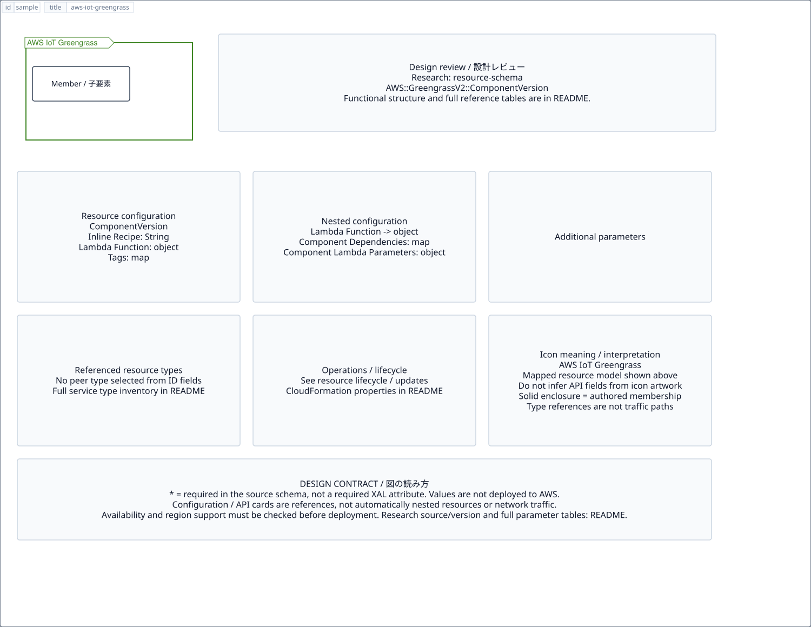

# `aws-iot-greengrass` — AWS IoT Greengrass

[SVG preview](sample.svg) · [Editable XAL](sample.xal) · [Catalog](../README.md)



Logical containment boundary; children remain individually connectable. The header uses the AWS group color and icon.

- Kind: `group`; category: Group.
- Diagram scope: `edge` (recommendation, not AWS deployment validation).
- Default catalog ID: none (text-only group). Covered catalog IDs: none.
- Implementation: V1 and V2; container with AWS border/header styling and connectable children.

## Parameters

Existing container parameters (`id`, `title`, `width`, `height`, `gap`, `class`, `layout`, `visible`) remain available.

`detail` adds a free-form diagram annotation. `show-details="false"` hides annotation text. Only supplied values are shown; none are sent to AWS. Group annotations are appended to the single-line header.

| Parameter | Type | Meaning | Example |
|---|---|---|---|


## Review notes

The catalog provides a baseline for per-component development, not a simulation of the AWS control plane. This component's current functional parameters are the ones listed above. Additional service-specific visual behavior can be developed here without replacing catalog IDs in diagrams. Edit `sample.xal`, then run:

```sh
npm run generate:aws-samples -- --render --tag=aws-iot-greengrass
```

<!-- aws-functional-research:start -->
## 機能調査・構成デザイン（2026-09-06）

分類: `resource-schema`。

サンプルはアイコンと、設定・内包構造・関連リソース・操作を分離したレビューシートです。設定カードは編集可能な `rectangle`、グループは既存の専用タグで実装しています。カードのフィールド名を新しい XAL 属性として受理するわけではありません。専用タグが受理する属性は上の Parameters 表を参照してください。

実線の通信と、設定の参照・同じサービスに属する型一覧を区別します。スキーマの必須項目は AWS 側の仕様であり、図の必須入力ではありません。記載の構成モデル/API は取り込んだ公式資料の範囲であり、全リージョン・全機能の完全性や稼働可否を保証しません。

### 構成モデル: `AWS::GreengrassV2::ComponentVersion`

[公式リファレンス](https://docs.aws.amazon.com/AWSCloudFormation/latest/UserGuide/aws-resource-greengrassv2-componentversion.html)。全 3 プロパティを型付きで列挙します（表示カードには主要項目のみ）。

| Field | Type | Required in AWS schema |
|---|---|---|
| [InlineRecipe](https://docs.aws.amazon.com/AWSCloudFormation/latest/UserGuide/aws-resource-greengrassv2-componentversion.html#cfn-greengrassv2-componentversion-inlinerecipe) | `String` | no |
| [LambdaFunction](https://docs.aws.amazon.com/AWSCloudFormation/latest/UserGuide/aws-resource-greengrassv2-componentversion.html#cfn-greengrassv2-componentversion-lambdafunction) | `LambdaFunctionRecipeSource` | no |
| [Tags](https://docs.aws.amazon.com/AWSCloudFormation/latest/UserGuide/aws-resource-greengrassv2-componentversion.html#cfn-greengrassv2-componentversion-tags) | `Map<String>` | no |

#### LambdaFunction → `AWS::GreengrassV2::ComponentVersion.LambdaFunctionRecipeSource`

| Field | Type | Required in AWS schema |
|---|---|---|
| [ComponentDependencies](https://docs.aws.amazon.com/AWSCloudFormation/latest/UserGuide/aws-properties-greengrassv2-componentversion-lambdafunctionrecipesource.html#cfn-greengrassv2-componentversion-lambdafunctionrecipesource-componentdependencies) | `Map<ComponentDependencyRequirement>` | no |
| [ComponentLambdaParameters](https://docs.aws.amazon.com/AWSCloudFormation/latest/UserGuide/aws-properties-greengrassv2-componentversion-lambdafunctionrecipesource.html#cfn-greengrassv2-componentversion-lambdafunctionrecipesource-componentlambdaparameters) | `LambdaExecutionParameters` | no |
| [ComponentName](https://docs.aws.amazon.com/AWSCloudFormation/latest/UserGuide/aws-properties-greengrassv2-componentversion-lambdafunctionrecipesource.html#cfn-greengrassv2-componentversion-lambdafunctionrecipesource-componentname) | `String` | no |
| [ComponentPlatforms](https://docs.aws.amazon.com/AWSCloudFormation/latest/UserGuide/aws-properties-greengrassv2-componentversion-lambdafunctionrecipesource.html#cfn-greengrassv2-componentversion-lambdafunctionrecipesource-componentplatforms) | `List<ComponentPlatform>` | no |
| [ComponentVersion](https://docs.aws.amazon.com/AWSCloudFormation/latest/UserGuide/aws-properties-greengrassv2-componentversion-lambdafunctionrecipesource.html#cfn-greengrassv2-componentversion-lambdafunctionrecipesource-componentversion) | `String` | no |
| [LambdaArn](https://docs.aws.amazon.com/AWSCloudFormation/latest/UserGuide/aws-properties-greengrassv2-componentversion-lambdafunctionrecipesource.html#cfn-greengrassv2-componentversion-lambdafunctionrecipesource-lambdaarn) | `String` | no |

### 関連する構成リソース（1 型）

同じサービス文脈の型一覧です。すべてがこのアイコンの子リソースという意味ではありません。さらに深い入れ子は [公式スキーマのスナップショット](../research/cloudformation-models.json) に記録しています。

- [AWS::GreengrassV2::ComponentVersion](https://docs.aws.amazon.com/AWSCloudFormation/latest/UserGuide/aws-resource-greengrassv2-componentversion.html)

### 出典・調査範囲

- [公式資料 1](https://docs.aws.amazon.com/AWSCloudFormation/latest/UserGuide/aws-resource-greengrassv2-componentversion.html)

CloudFormation 仕様 263.0.0、AWS SDK 431 サービスモデルをオフラインで参照。取得日・元データの SHA-256 は [調査マニフェスト](../research/README.md) を参照。API モデル名・フィールド名は仕様から抽出し、説明本文を転載していません。利用可能性は全サービス一律には確認できないため、提供終了の確認がないものも「現在利用可能」と断定していません。

### 次の部品レビュー

- 本アイコンが独立したリソースか、機能・状態・デバイスの記号かを確認する。
- 詳細カードのうち専用の子タグ・参照属性として実装する範囲を選ぶ。
- 通信、制御、認証、監視の関係を分け、必要な接続点・配置制約を確認する。
- 編集後は `npm run generate:aws-samples -- --render --tag=aws-iot-greengrass`。通常の再描画は XAL/README を上書きしない。
<!-- aws-functional-research:end -->
