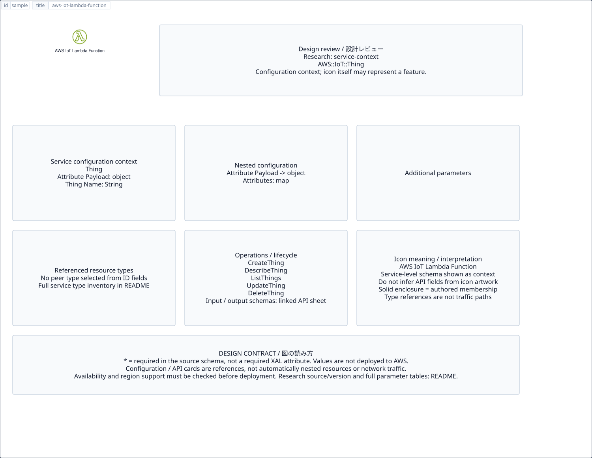

# `aws-iot-lambda-function` — AWS IoT Lambda Function

[SVG preview](sample.svg) · [Editable XAL](sample.xal) · [Catalog](../README.md)



AWS resource icon. Use a label and explicit annotations to describe its role; scope is selected by the author.

- Kind: `resource`; category: IoT.
- Diagram scope: `logical` (recommendation, not AWS deployment validation).
- Default catalog ID: 1378. Covered catalog IDs: 1378.
- Implementation: V1 and V2; fixed AWS icon with a wrapped label and explicit functional annotations.

## Parameters

`id` is a required, unique connection ID, not a catalog number. `label`/`title`/`name` override the label; an empty label hides it. `size` > 0 defaults to 48 px. `label-width` > 0 defaults to 160 px (default box width, at least icon size + 12 px). Explicit `width`/`height` must contain the icon and label. `visible="false"` hides it. Children and icon overrides are not supported; use a group for containment.

`detail` adds a free-form diagram annotation. `show-details="false"` hides annotation text. Only supplied values are shown; none are sent to AWS. Service/resource annotations appear on separate wrapped lines.

| Parameter | Type | Meaning | Example |
|---|---|---|---|
| `role` | text | Architectural role annotation | `Application component` |

## Review notes

The catalog provides a baseline for per-component development, not a simulation of the AWS control plane. This component's current functional parameters are the ones listed above. Additional service-specific visual behavior can be developed here without replacing catalog IDs in diagrams. Edit `sample.xal`, then run:

```sh
npm run generate:aws-samples -- --render --tag=aws-iot-lambda-function
```

<!-- aws-functional-research:start -->
## 機能調査・構成デザイン（2026-09-06）

分類: `service-context`。サービス文脈: [`aws-iot-core`](../aws-iot-core/README.md)。

サンプルはアイコンと、設定・内包構造・関連リソース・操作を分離したレビューシートです。設定カードは編集可能な `rectangle`、グループは既存の専用タグで実装しています。カードのフィールド名を新しい XAL 属性として受理するわけではありません。専用タグが受理する属性は上の Parameters 表を参照してください。

実線の通信と、設定の参照・同じサービスに属する型一覧を区別します。スキーマの必須項目は AWS 側の仕様であり、図の必須入力ではありません。記載の構成モデル/API は取り込んだ公式資料の範囲であり、全リージョン・全機能の完全性や稼働可否を保証しません。

**重要:** このアイコンに対応する独立した構成リソースを断定せず、所属サービスの構成モデルを参考表示しています。アイコン名や絵柄から属性・親子関係・通信を推測しません。

### 構成モデル: `AWS::IoT::Thing`

[公式リファレンス](https://docs.aws.amazon.com/AWSCloudFormation/latest/UserGuide/aws-resource-iot-thing.html)。全 2 プロパティを型付きで列挙します（表示カードには主要項目のみ）。

| Field | Type | Required in AWS schema |
|---|---|---|
| [AttributePayload](https://docs.aws.amazon.com/AWSCloudFormation/latest/UserGuide/aws-resource-iot-thing.html#cfn-iot-thing-attributepayload) | `AttributePayload` | no |
| [ThingName](https://docs.aws.amazon.com/AWSCloudFormation/latest/UserGuide/aws-resource-iot-thing.html#cfn-iot-thing-thingname) | `String` | no |

#### AttributePayload → `AWS::IoT::Thing.AttributePayload`

| Field | Type | Required in AWS schema |
|---|---|---|
| [Attributes](https://docs.aws.amazon.com/AWSCloudFormation/latest/UserGuide/aws-properties-iot-thing-attributepayload.html#cfn-iot-thing-attributepayload-attributes) | `Map<String>` | no |

### 関連する構成リソース（44 型）

同じサービス文脈の型一覧です。すべてがこのアイコンの子リソースという意味ではありません。さらに深い入れ子は [公式スキーマのスナップショット](../research/cloudformation-models.json) に記録しています。

- [AWS::IoT::AccountAuditConfiguration](https://docs.aws.amazon.com/AWSCloudFormation/latest/UserGuide/aws-resource-iot-accountauditconfiguration.html)
- [AWS::IoT::Authorizer](https://docs.aws.amazon.com/AWSCloudFormation/latest/UserGuide/aws-resource-iot-authorizer.html)
- [AWS::IoT::BillingGroup](https://docs.aws.amazon.com/AWSCloudFormation/latest/UserGuide/aws-resource-iot-billinggroup.html)
- [AWS::IoT::CACertificate](https://docs.aws.amazon.com/AWSCloudFormation/latest/UserGuide/aws-resource-iot-cacertificate.html)
- [AWS::IoT::Certificate](https://docs.aws.amazon.com/AWSCloudFormation/latest/UserGuide/aws-resource-iot-certificate.html)
- [AWS::IoT::CertificateProvider](https://docs.aws.amazon.com/AWSCloudFormation/latest/UserGuide/aws-resource-iot-certificateprovider.html)
- [AWS::IoT::Command](https://docs.aws.amazon.com/AWSCloudFormation/latest/UserGuide/aws-resource-iot-command.html)
- [AWS::IoT::CustomMetric](https://docs.aws.amazon.com/AWSCloudFormation/latest/UserGuide/aws-resource-iot-custommetric.html)
- [AWS::IoT::Dimension](https://docs.aws.amazon.com/AWSCloudFormation/latest/UserGuide/aws-resource-iot-dimension.html)
- [AWS::IoT::DomainConfiguration](https://docs.aws.amazon.com/AWSCloudFormation/latest/UserGuide/aws-resource-iot-domainconfiguration.html)
- [AWS::IoT::EncryptionConfiguration](https://docs.aws.amazon.com/AWSCloudFormation/latest/UserGuide/aws-resource-iot-encryptionconfiguration.html)
- [AWS::IoT::FleetMetric](https://docs.aws.amazon.com/AWSCloudFormation/latest/UserGuide/aws-resource-iot-fleetmetric.html)
- [AWS::IoT::Index](https://docs.aws.amazon.com/AWSCloudFormation/latest/UserGuide/aws-resource-iot-index.html)
- [AWS::IoT::Job](https://docs.aws.amazon.com/AWSCloudFormation/latest/UserGuide/aws-resource-iot-job.html)
- [AWS::IoT::JobTemplate](https://docs.aws.amazon.com/AWSCloudFormation/latest/UserGuide/aws-resource-iot-jobtemplate.html)
- [AWS::IoT::Logging](https://docs.aws.amazon.com/AWSCloudFormation/latest/UserGuide/aws-resource-iot-logging.html)
- [AWS::IoT::MitigationAction](https://docs.aws.amazon.com/AWSCloudFormation/latest/UserGuide/aws-resource-iot-mitigationaction.html)
- [AWS::IoT::Policy](https://docs.aws.amazon.com/AWSCloudFormation/latest/UserGuide/aws-resource-iot-policy.html)
- [AWS::IoT::PolicyPrincipalAttachment](https://docs.aws.amazon.com/AWSCloudFormation/latest/UserGuide/aws-resource-iot-policyprincipalattachment.html)
- [AWS::IoT::ProvisioningTemplate](https://docs.aws.amazon.com/AWSCloudFormation/latest/UserGuide/aws-resource-iot-provisioningtemplate.html)
- [AWS::IoT::ResourceSpecificLogging](https://docs.aws.amazon.com/AWSCloudFormation/latest/UserGuide/aws-resource-iot-resourcespecificlogging.html)
- [AWS::IoT::RoleAlias](https://docs.aws.amazon.com/AWSCloudFormation/latest/UserGuide/aws-resource-iot-rolealias.html)
- [AWS::IoT::ScheduledAudit](https://docs.aws.amazon.com/AWSCloudFormation/latest/UserGuide/aws-resource-iot-scheduledaudit.html)
- [AWS::IoT::SecurityProfile](https://docs.aws.amazon.com/AWSCloudFormation/latest/UserGuide/aws-resource-iot-securityprofile.html)
- [AWS::IoT::SoftwarePackage](https://docs.aws.amazon.com/AWSCloudFormation/latest/UserGuide/aws-resource-iot-softwarepackage.html)
- [AWS::IoT::SoftwarePackageVersion](https://docs.aws.amazon.com/AWSCloudFormation/latest/UserGuide/aws-resource-iot-softwarepackageversion.html)
- [AWS::IoT::Stream](https://docs.aws.amazon.com/AWSCloudFormation/latest/UserGuide/aws-resource-iot-stream.html)
- [AWS::IoT::Thing](https://docs.aws.amazon.com/AWSCloudFormation/latest/UserGuide/aws-resource-iot-thing.html)
- [AWS::IoT::ThingGroup](https://docs.aws.amazon.com/AWSCloudFormation/latest/UserGuide/aws-resource-iot-thinggroup.html)
- [AWS::IoT::ThingPrincipalAttachment](https://docs.aws.amazon.com/AWSCloudFormation/latest/UserGuide/aws-resource-iot-thingprincipalattachment.html)
- [AWS::IoT::ThingType](https://docs.aws.amazon.com/AWSCloudFormation/latest/UserGuide/aws-resource-iot-thingtype.html)
- [AWS::IoT::TopicRule](https://docs.aws.amazon.com/AWSCloudFormation/latest/UserGuide/aws-resource-iot-topicrule.html)
- [AWS::IoT::TopicRuleDestination](https://docs.aws.amazon.com/AWSCloudFormation/latest/UserGuide/aws-resource-iot-topicruledestination.html)
- [AWS::IoTWireless::Destination](https://docs.aws.amazon.com/AWSCloudFormation/latest/UserGuide/aws-resource-iotwireless-destination.html)
- [AWS::IoTWireless::DeviceProfile](https://docs.aws.amazon.com/AWSCloudFormation/latest/UserGuide/aws-resource-iotwireless-deviceprofile.html)
- [AWS::IoTWireless::FuotaTask](https://docs.aws.amazon.com/AWSCloudFormation/latest/UserGuide/aws-resource-iotwireless-fuotatask.html)
- [AWS::IoTWireless::MulticastGroup](https://docs.aws.amazon.com/AWSCloudFormation/latest/UserGuide/aws-resource-iotwireless-multicastgroup.html)
- [AWS::IoTWireless::NetworkAnalyzerConfiguration](https://docs.aws.amazon.com/AWSCloudFormation/latest/UserGuide/aws-resource-iotwireless-networkanalyzerconfiguration.html)
- [AWS::IoTWireless::PartnerAccount](https://docs.aws.amazon.com/AWSCloudFormation/latest/UserGuide/aws-resource-iotwireless-partneraccount.html)
- [AWS::IoTWireless::ServiceProfile](https://docs.aws.amazon.com/AWSCloudFormation/latest/UserGuide/aws-resource-iotwireless-serviceprofile.html)
- [AWS::IoTWireless::TaskDefinition](https://docs.aws.amazon.com/AWSCloudFormation/latest/UserGuide/aws-resource-iotwireless-taskdefinition.html)
- [AWS::IoTWireless::WirelessDevice](https://docs.aws.amazon.com/AWSCloudFormation/latest/UserGuide/aws-resource-iotwireless-wirelessdevice.html)
- [AWS::IoTWireless::WirelessDeviceImportTask](https://docs.aws.amazon.com/AWSCloudFormation/latest/UserGuide/aws-resource-iotwireless-wirelessdeviceimporttask.html)
- [AWS::IoTWireless::WirelessGateway](https://docs.aws.amazon.com/AWSCloudFormation/latest/UserGuide/aws-resource-iotwireless-wirelessgateway.html)

### API の操作・パラメータ

- [AWS IoT: 272 操作の入力・出力一覧](../research/api/iot.md)（API version 2015-05-28）
- [AWS IoT Wireless: 112 操作の入力・出力一覧](../research/api/iotwireless.md)（API version 2020-11-22）

### 出典・調査範囲

- [公式資料 1](https://docs.aws.amazon.com/AWSCloudFormation/latest/UserGuide/aws-resource-iot-thing.html)
- [公式資料 2](https://github.com/boto/botocore/blob/develop/botocore/data/iot/2015-05-28/service-2.json)
- [公式資料 3](https://github.com/boto/botocore/blob/develop/botocore/data/iotwireless/2020-11-22/service-2.json)

CloudFormation 仕様 263.0.0、AWS SDK 431 サービスモデルをオフラインで参照。取得日・元データの SHA-256 は [調査マニフェスト](../research/README.md) を参照。API モデル名・フィールド名は仕様から抽出し、説明本文を転載していません。利用可能性は全サービス一律には確認できないため、提供終了の確認がないものも「現在利用可能」と断定していません。

### 次の部品レビュー

- 本アイコンが独立したリソースか、機能・状態・デバイスの記号かを確認する。
- 詳細カードのうち専用の子タグ・参照属性として実装する範囲を選ぶ。
- 通信、制御、認証、監視の関係を分け、必要な接続点・配置制約を確認する。
- 編集後は `npm run generate:aws-samples -- --render --tag=aws-iot-lambda-function`。通常の再描画は XAL/README を上書きしない。
<!-- aws-functional-research:end -->
