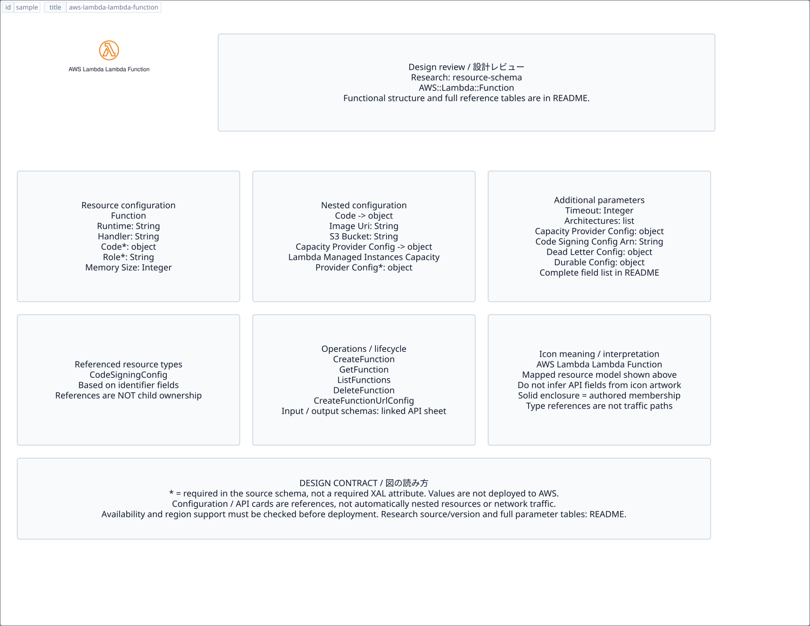

# `aws-lambda-lambda-function` — AWS Lambda Lambda Function

[SVG preview](sample.svg) · [Editable XAL](sample.xal) · [Catalog](../README.md)



AWS resource icon. Use a label and explicit annotations to describe its role; scope is selected by the author.

- Kind: `resource`; category: Compute.
- Diagram scope: `region` (recommendation, not AWS deployment validation).
- Default catalog ID: 1783. Covered catalog IDs: 1783.
- Implementation: V1 and V2; fixed AWS icon with a wrapped label and explicit functional annotations.

## Parameters

`id` is a required, unique connection ID, not a catalog number. `label`/`title`/`name` override the label; an empty label hides it. `size` > 0 defaults to 48 px. `label-width` > 0 defaults to 160 px (default box width, at least icon size + 12 px). Explicit `width`/`height` must contain the icon and label. `visible="false"` hides it. Children and icon overrides are not supported; use a group for containment.

`detail` adds a free-form diagram annotation. `show-details="false"` hides annotation text. Only supplied values are shown; none are sent to AWS. Service/resource annotations appear on separate wrapped lines.

| Parameter | Type | Meaning | Example |
|---|---|---|---|
| `runtime` | text | Runtime annotation (no version validation) | `provided.al2023` |
| `memory-mb` | integer | Configured memory annotation | `512` |

## Review notes

The catalog provides a baseline for per-component development, not a simulation of the AWS control plane. This component's current functional parameters are the ones listed above. Additional service-specific visual behavior can be developed here without replacing catalog IDs in diagrams. Edit `sample.xal`, then run:

```sh
npm run generate:aws-samples -- --render --tag=aws-lambda-lambda-function
```

<!-- aws-functional-research:start -->
## 機能調査・構成デザイン（2026-09-06）

分類: `resource-schema`。サービス文脈: [`aws-lambda`](../aws-lambda/README.md)。

サンプルはアイコンと、設定・内包構造・関連リソース・操作を分離したレビューシートです。設定カードは編集可能な `rectangle`、グループは既存の専用タグで実装しています。カードのフィールド名を新しい XAL 属性として受理するわけではありません。専用タグが受理する属性は上の Parameters 表を参照してください。

実線の通信と、設定の参照・同じサービスに属する型一覧を区別します。スキーマの必須項目は AWS 側の仕様であり、図の必須入力ではありません。記載の構成モデル/API は取り込んだ公式資料の範囲であり、全リージョン・全機能の完全性や稼働可否を保証しません。

### 構成モデル: `AWS::Lambda::Function`

[公式リファレンス](https://docs.aws.amazon.com/AWSCloudFormation/latest/UserGuide/aws-resource-lambda-function.html)。全 31 プロパティを型付きで列挙します（表示カードには主要項目のみ）。

| Field | Type | Required in AWS schema |
|---|---|---|
| [Architectures](https://docs.aws.amazon.com/AWSCloudFormation/latest/UserGuide/aws-resource-lambda-function.html#cfn-lambda-function-architectures) | `List<String>` | no |
| [CapacityProviderConfig](https://docs.aws.amazon.com/AWSCloudFormation/latest/UserGuide/aws-resource-lambda-function.html#cfn-lambda-function-capacityproviderconfig) | `CapacityProviderConfig` | no |
| [Code](https://docs.aws.amazon.com/AWSCloudFormation/latest/UserGuide/aws-resource-lambda-function.html#cfn-lambda-function-code) | `Code` | yes |
| [CodeSigningConfigArn](https://docs.aws.amazon.com/AWSCloudFormation/latest/UserGuide/aws-resource-lambda-function.html#cfn-lambda-function-codesigningconfigarn) | `String` | no |
| [DeadLetterConfig](https://docs.aws.amazon.com/AWSCloudFormation/latest/UserGuide/aws-resource-lambda-function.html#cfn-lambda-function-deadletterconfig) | `DeadLetterConfig` | no |
| [Description](https://docs.aws.amazon.com/AWSCloudFormation/latest/UserGuide/aws-resource-lambda-function.html#cfn-lambda-function-description) | `String` | no |
| [DurableConfig](https://docs.aws.amazon.com/AWSCloudFormation/latest/UserGuide/aws-resource-lambda-function.html#cfn-lambda-function-durableconfig) | `DurableConfig` | no |
| [Environment](https://docs.aws.amazon.com/AWSCloudFormation/latest/UserGuide/aws-resource-lambda-function.html#cfn-lambda-function-environment) | `Environment` | no |
| [EphemeralStorage](https://docs.aws.amazon.com/AWSCloudFormation/latest/UserGuide/aws-resource-lambda-function.html#cfn-lambda-function-ephemeralstorage) | `EphemeralStorage` | no |
| [FileSystemConfigs](https://docs.aws.amazon.com/AWSCloudFormation/latest/UserGuide/aws-resource-lambda-function.html#cfn-lambda-function-filesystemconfigs) | `List<FileSystemConfig>` | no |
| [FunctionName](https://docs.aws.amazon.com/AWSCloudFormation/latest/UserGuide/aws-resource-lambda-function.html#cfn-lambda-function-functionname) | `String` | no |
| [FunctionScalingConfig](https://docs.aws.amazon.com/AWSCloudFormation/latest/UserGuide/aws-resource-lambda-function.html#cfn-lambda-function-functionscalingconfig) | `FunctionScalingConfig` | no |
| [Handler](https://docs.aws.amazon.com/AWSCloudFormation/latest/UserGuide/aws-resource-lambda-function.html#cfn-lambda-function-handler) | `String` | no |
| [ImageConfig](https://docs.aws.amazon.com/AWSCloudFormation/latest/UserGuide/aws-resource-lambda-function.html#cfn-lambda-function-imageconfig) | `ImageConfig` | no |
| [KmsKeyArn](https://docs.aws.amazon.com/AWSCloudFormation/latest/UserGuide/aws-resource-lambda-function.html#cfn-lambda-function-kmskeyarn) | `String` | no |
| [Layers](https://docs.aws.amazon.com/AWSCloudFormation/latest/UserGuide/aws-resource-lambda-function.html#cfn-lambda-function-layers) | `List<String>` | no |
| [LoggingConfig](https://docs.aws.amazon.com/AWSCloudFormation/latest/UserGuide/aws-resource-lambda-function.html#cfn-lambda-function-loggingconfig) | `LoggingConfig` | no |
| [MemorySize](https://docs.aws.amazon.com/AWSCloudFormation/latest/UserGuide/aws-resource-lambda-function.html#cfn-lambda-function-memorysize) | `Integer` | no |
| [PackageType](https://docs.aws.amazon.com/AWSCloudFormation/latest/UserGuide/aws-resource-lambda-function.html#cfn-lambda-function-packagetype) | `String` | no |
| [PublishToLatestPublished](https://docs.aws.amazon.com/AWSCloudFormation/latest/UserGuide/aws-resource-lambda-function.html#cfn-lambda-function-publishtolatestpublished) | `Boolean` | no |
| [RecursiveLoop](https://docs.aws.amazon.com/AWSCloudFormation/latest/UserGuide/aws-resource-lambda-function.html#cfn-lambda-function-recursiveloop) | `String` | no |
| [ReservedConcurrentExecutions](https://docs.aws.amazon.com/AWSCloudFormation/latest/UserGuide/aws-resource-lambda-function.html#cfn-lambda-function-reservedconcurrentexecutions) | `Integer` | no |
| [Role](https://docs.aws.amazon.com/AWSCloudFormation/latest/UserGuide/aws-resource-lambda-function.html#cfn-lambda-function-role) | `String` | yes |
| [Runtime](https://docs.aws.amazon.com/AWSCloudFormation/latest/UserGuide/aws-resource-lambda-function.html#cfn-lambda-function-runtime) | `String` | no |
| [RuntimeManagementConfig](https://docs.aws.amazon.com/AWSCloudFormation/latest/UserGuide/aws-resource-lambda-function.html#cfn-lambda-function-runtimemanagementconfig) | `RuntimeManagementConfig` | no |
| [SnapStart](https://docs.aws.amazon.com/AWSCloudFormation/latest/UserGuide/aws-resource-lambda-function.html#cfn-lambda-function-snapstart) | `SnapStart` | no |
| [Tags](https://docs.aws.amazon.com/AWSCloudFormation/latest/UserGuide/aws-resource-lambda-function.html#cfn-lambda-function-tags) | `List<Tag>` | no |
| [TenancyConfig](https://docs.aws.amazon.com/AWSCloudFormation/latest/UserGuide/aws-resource-lambda-function.html#cfn-lambda-function-tenancyconfig) | `TenancyConfig` | no |
| [Timeout](https://docs.aws.amazon.com/AWSCloudFormation/latest/UserGuide/aws-resource-lambda-function.html#cfn-lambda-function-timeout) | `Integer` | no |
| [TracingConfig](https://docs.aws.amazon.com/AWSCloudFormation/latest/UserGuide/aws-resource-lambda-function.html#cfn-lambda-function-tracingconfig) | `TracingConfig` | no |
| [VpcConfig](https://docs.aws.amazon.com/AWSCloudFormation/latest/UserGuide/aws-resource-lambda-function.html#cfn-lambda-function-vpcconfig) | `VpcConfig` | no |

#### Code → `AWS::Lambda::Function.Code`

| Field | Type | Required in AWS schema |
|---|---|---|
| [ImageUri](https://docs.aws.amazon.com/AWSCloudFormation/latest/UserGuide/aws-properties-lambda-function-code.html#cfn-lambda-function-code-imageuri) | `String` | no |
| [S3Bucket](https://docs.aws.amazon.com/AWSCloudFormation/latest/UserGuide/aws-properties-lambda-function-code.html#cfn-lambda-function-code-s3bucket) | `String` | no |
| [S3Key](https://docs.aws.amazon.com/AWSCloudFormation/latest/UserGuide/aws-properties-lambda-function-code.html#cfn-lambda-function-code-s3key) | `String` | no |
| [S3ObjectStorageMode](https://docs.aws.amazon.com/AWSCloudFormation/latest/UserGuide/aws-properties-lambda-function-code.html#cfn-lambda-function-code-s3objectstoragemode) | `String` | no |
| [S3ObjectVersion](https://docs.aws.amazon.com/AWSCloudFormation/latest/UserGuide/aws-properties-lambda-function-code.html#cfn-lambda-function-code-s3objectversion) | `String` | no |
| [SourceKMSKeyArn](https://docs.aws.amazon.com/AWSCloudFormation/latest/UserGuide/aws-properties-lambda-function-code.html#cfn-lambda-function-code-sourcekmskeyarn) | `String` | no |
| [ZipFile](https://docs.aws.amazon.com/AWSCloudFormation/latest/UserGuide/aws-properties-lambda-function-code.html#cfn-lambda-function-code-zipfile) | `String` | no |

#### CapacityProviderConfig → `AWS::Lambda::Function.CapacityProviderConfig`

| Field | Type | Required in AWS schema |
|---|---|---|
| [LambdaManagedInstancesCapacityProviderConfig](https://docs.aws.amazon.com/AWSCloudFormation/latest/UserGuide/aws-properties-lambda-function-capacityproviderconfig.html#cfn-lambda-function-capacityproviderconfig-lambdamanagedinstancescapacityproviderconfig) | `LambdaManagedInstancesCapacityProviderConfig` | yes |

#### DeadLetterConfig → `AWS::Lambda::Function.DeadLetterConfig`

| Field | Type | Required in AWS schema |
|---|---|---|
| [TargetArn](https://docs.aws.amazon.com/AWSCloudFormation/latest/UserGuide/aws-properties-lambda-function-deadletterconfig.html#cfn-lambda-function-deadletterconfig-targetarn) | `String` | no |

#### DurableConfig → `AWS::Lambda::Function.DurableConfig`

| Field | Type | Required in AWS schema |
|---|---|---|
| [ExecutionTimeout](https://docs.aws.amazon.com/AWSCloudFormation/latest/UserGuide/aws-properties-lambda-function-durableconfig.html#cfn-lambda-function-durableconfig-executiontimeout) | `Integer` | yes |
| [KMSKeyArn](https://docs.aws.amazon.com/AWSCloudFormation/latest/UserGuide/aws-properties-lambda-function-durableconfig.html#cfn-lambda-function-durableconfig-kmskeyarn) | `String` | no |
| [RetentionPeriodInDays](https://docs.aws.amazon.com/AWSCloudFormation/latest/UserGuide/aws-properties-lambda-function-durableconfig.html#cfn-lambda-function-durableconfig-retentionperiodindays) | `Integer` | no |

#### Environment → `AWS::Lambda::Function.Environment`

| Field | Type | Required in AWS schema |
|---|---|---|
| [Variables](https://docs.aws.amazon.com/AWSCloudFormation/latest/UserGuide/aws-properties-lambda-function-environment.html#cfn-lambda-function-environment-variables) | `Map<String>` | no |

#### EphemeralStorage → `AWS::Lambda::Function.EphemeralStorage`

| Field | Type | Required in AWS schema |
|---|---|---|
| [Size](https://docs.aws.amazon.com/AWSCloudFormation/latest/UserGuide/aws-properties-lambda-function-ephemeralstorage.html#cfn-lambda-function-ephemeralstorage-size) | `Integer` | yes |

#### FileSystemConfigs → `AWS::Lambda::Function.FileSystemConfig`

| Field | Type | Required in AWS schema |
|---|---|---|
| [Arn](https://docs.aws.amazon.com/AWSCloudFormation/latest/UserGuide/aws-properties-lambda-function-filesystemconfig.html#cfn-lambda-function-filesystemconfig-arn) | `String` | yes |
| [LocalMountPath](https://docs.aws.amazon.com/AWSCloudFormation/latest/UserGuide/aws-properties-lambda-function-filesystemconfig.html#cfn-lambda-function-filesystemconfig-localmountpath) | `String` | yes |
| [S3FilesConfig](https://docs.aws.amazon.com/AWSCloudFormation/latest/UserGuide/aws-properties-lambda-function-filesystemconfig.html#cfn-lambda-function-filesystemconfig-s3filesconfig) | `S3FilesConfig` | no |

#### FunctionScalingConfig → `AWS::Lambda::Function.FunctionScalingConfig`

| Field | Type | Required in AWS schema |
|---|---|---|
| [MaxExecutionEnvironments](https://docs.aws.amazon.com/AWSCloudFormation/latest/UserGuide/aws-properties-lambda-function-functionscalingconfig.html#cfn-lambda-function-functionscalingconfig-maxexecutionenvironments) | `Integer` | no |
| [MinExecutionEnvironments](https://docs.aws.amazon.com/AWSCloudFormation/latest/UserGuide/aws-properties-lambda-function-functionscalingconfig.html#cfn-lambda-function-functionscalingconfig-minexecutionenvironments) | `Integer` | no |

#### ImageConfig → `AWS::Lambda::Function.ImageConfig`

| Field | Type | Required in AWS schema |
|---|---|---|
| [Command](https://docs.aws.amazon.com/AWSCloudFormation/latest/UserGuide/aws-properties-lambda-function-imageconfig.html#cfn-lambda-function-imageconfig-command) | `List<String>` | no |
| [EntryPoint](https://docs.aws.amazon.com/AWSCloudFormation/latest/UserGuide/aws-properties-lambda-function-imageconfig.html#cfn-lambda-function-imageconfig-entrypoint) | `List<String>` | no |
| [WorkingDirectory](https://docs.aws.amazon.com/AWSCloudFormation/latest/UserGuide/aws-properties-lambda-function-imageconfig.html#cfn-lambda-function-imageconfig-workingdirectory) | `String` | no |

#### LoggingConfig → `AWS::Lambda::Function.LoggingConfig`

| Field | Type | Required in AWS schema |
|---|---|---|
| [ApplicationLogLevel](https://docs.aws.amazon.com/AWSCloudFormation/latest/UserGuide/aws-properties-lambda-function-loggingconfig.html#cfn-lambda-function-loggingconfig-applicationloglevel) | `String` | no |
| [LogFormat](https://docs.aws.amazon.com/AWSCloudFormation/latest/UserGuide/aws-properties-lambda-function-loggingconfig.html#cfn-lambda-function-loggingconfig-logformat) | `String` | no |
| [LogGroup](https://docs.aws.amazon.com/AWSCloudFormation/latest/UserGuide/aws-properties-lambda-function-loggingconfig.html#cfn-lambda-function-loggingconfig-loggroup) | `String` | no |
| [SystemLogLevel](https://docs.aws.amazon.com/AWSCloudFormation/latest/UserGuide/aws-properties-lambda-function-loggingconfig.html#cfn-lambda-function-loggingconfig-systemloglevel) | `String` | no |

#### RuntimeManagementConfig → `AWS::Lambda::Function.RuntimeManagementConfig`

| Field | Type | Required in AWS schema |
|---|---|---|
| [RuntimeVersionArn](https://docs.aws.amazon.com/AWSCloudFormation/latest/UserGuide/aws-properties-lambda-function-runtimemanagementconfig.html#cfn-lambda-function-runtimemanagementconfig-runtimeversionarn) | `String` | no |
| [UpdateRuntimeOn](https://docs.aws.amazon.com/AWSCloudFormation/latest/UserGuide/aws-properties-lambda-function-runtimemanagementconfig.html#cfn-lambda-function-runtimemanagementconfig-updateruntimeon) | `String` | yes |

#### SnapStart → `AWS::Lambda::Function.SnapStart`

| Field | Type | Required in AWS schema |
|---|---|---|
| [ApplyOn](https://docs.aws.amazon.com/AWSCloudFormation/latest/UserGuide/aws-properties-lambda-function-snapstart.html#cfn-lambda-function-snapstart-applyon) | `String` | yes |

#### TenancyConfig → `AWS::Lambda::Function.TenancyConfig`

| Field | Type | Required in AWS schema |
|---|---|---|
| [TenantIsolationMode](https://docs.aws.amazon.com/AWSCloudFormation/latest/UserGuide/aws-properties-lambda-function-tenancyconfig.html#cfn-lambda-function-tenancyconfig-tenantisolationmode) | `String` | yes |

#### TracingConfig → `AWS::Lambda::Function.TracingConfig`

| Field | Type | Required in AWS schema |
|---|---|---|
| [Mode](https://docs.aws.amazon.com/AWSCloudFormation/latest/UserGuide/aws-properties-lambda-function-tracingconfig.html#cfn-lambda-function-tracingconfig-mode) | `String` | no |

#### VpcConfig → `AWS::Lambda::Function.VpcConfig`

| Field | Type | Required in AWS schema |
|---|---|---|
| [Ipv6AllowedForDualStack](https://docs.aws.amazon.com/AWSCloudFormation/latest/UserGuide/aws-properties-lambda-function-vpcconfig.html#cfn-lambda-function-vpcconfig-ipv6allowedfordualstack) | `Boolean` | no |
| [SecurityGroupIds](https://docs.aws.amazon.com/AWSCloudFormation/latest/UserGuide/aws-properties-lambda-function-vpcconfig.html#cfn-lambda-function-vpcconfig-securitygroupids) | `List<String>` | no |
| [SubnetIds](https://docs.aws.amazon.com/AWSCloudFormation/latest/UserGuide/aws-properties-lambda-function-vpcconfig.html#cfn-lambda-function-vpcconfig-subnetids) | `List<String>` | no |

### 関連する構成リソース（15 型）

同じサービス文脈の型一覧です。すべてがこのアイコンの子リソースという意味ではありません。さらに深い入れ子は [公式スキーマのスナップショット](../research/cloudformation-models.json) に記録しています。

- [AWS::Lambda::Function](https://docs.aws.amazon.com/AWSCloudFormation/latest/UserGuide/aws-resource-lambda-function.html)
- [AWS::Lambda::Alias](https://docs.aws.amazon.com/AWSCloudFormation/latest/UserGuide/aws-resource-lambda-alias.html)
- [AWS::Lambda::CapacityProvider](https://docs.aws.amazon.com/AWSCloudFormation/latest/UserGuide/aws-resource-lambda-capacityprovider.html)
- [AWS::Lambda::CodeSigningConfig](https://docs.aws.amazon.com/AWSCloudFormation/latest/UserGuide/aws-resource-lambda-codesigningconfig.html)
- [AWS::Lambda::DurableExecution](https://docs.aws.amazon.com/AWSCloudFormation/latest/UserGuide/aws-resource-lambda-durableexecution.html)
- [AWS::Lambda::EventInvokeConfig](https://docs.aws.amazon.com/AWSCloudFormation/latest/UserGuide/aws-resource-lambda-eventinvokeconfig.html)
- [AWS::Lambda::EventSourceMapping](https://docs.aws.amazon.com/AWSCloudFormation/latest/UserGuide/aws-resource-lambda-eventsourcemapping.html)
- [AWS::Lambda::LayerVersion](https://docs.aws.amazon.com/AWSCloudFormation/latest/UserGuide/aws-resource-lambda-layerversion.html)
- [AWS::Lambda::LayerVersionPermission](https://docs.aws.amazon.com/AWSCloudFormation/latest/UserGuide/aws-resource-lambda-layerversionpermission.html)
- [AWS::Lambda::MicrovmImage](https://docs.aws.amazon.com/AWSCloudFormation/latest/UserGuide/aws-resource-lambda-microvmimage.html)
- [AWS::Lambda::NetworkConnector](https://docs.aws.amazon.com/AWSCloudFormation/latest/UserGuide/aws-resource-lambda-networkconnector.html)
- [AWS::Lambda::Permission](https://docs.aws.amazon.com/AWSCloudFormation/latest/UserGuide/aws-resource-lambda-permission.html)
- [AWS::Lambda::ResourcePolicy](https://docs.aws.amazon.com/AWSCloudFormation/latest/UserGuide/aws-resource-lambda-resourcepolicy.html)
- [AWS::Lambda::Url](https://docs.aws.amazon.com/AWSCloudFormation/latest/UserGuide/aws-resource-lambda-url.html)
- [AWS::Lambda::Version](https://docs.aws.amazon.com/AWSCloudFormation/latest/UserGuide/aws-resource-lambda-version.html)

### API の操作・パラメータ

- [AWS Lambda: 88 操作の入力・出力一覧](../research/api/lambda.md)（API version 2015-03-31）

### 出典・調査範囲

- [公式資料 1](https://docs.aws.amazon.com/AWSCloudFormation/latest/UserGuide/aws-resource-lambda-function.html)
- [公式資料 2](https://github.com/boto/botocore/blob/develop/botocore/data/lambda/2015-03-31/service-2.json)

CloudFormation 仕様 263.0.0、AWS SDK 431 サービスモデルをオフラインで参照。取得日・元データの SHA-256 は [調査マニフェスト](../research/README.md) を参照。API モデル名・フィールド名は仕様から抽出し、説明本文を転載していません。利用可能性は全サービス一律には確認できないため、提供終了の確認がないものも「現在利用可能」と断定していません。

### 次の部品レビュー

- 本アイコンが独立したリソースか、機能・状態・デバイスの記号かを確認する。
- 詳細カードのうち専用の子タグ・参照属性として実装する範囲を選ぶ。
- 通信、制御、認証、監視の関係を分け、必要な接続点・配置制約を確認する。
- 編集後は `npm run generate:aws-samples -- --render --tag=aws-lambda-lambda-function`。通常の再描画は XAL/README を上書きしない。
<!-- aws-functional-research:end -->
