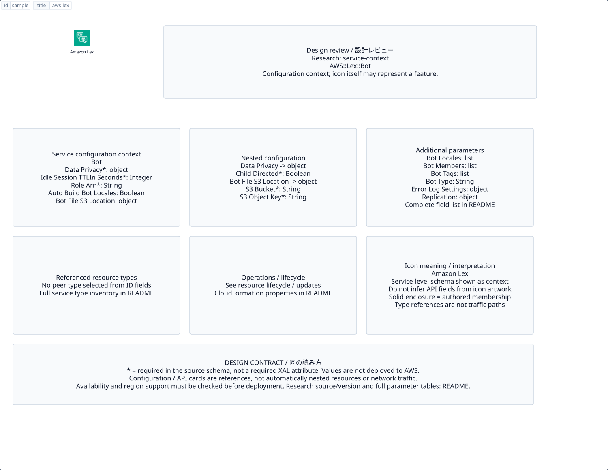

# `aws-lex` — Amazon Lex

[SVG preview](sample.svg) · [Editable XAL](sample.xal) · [Catalog](../README.md)



AWS service icon. Use a label and explicit annotations to describe its role; scope is selected by the author.

- Kind: `service`; category: Artificial Intelligence.
- Diagram scope: `service` (recommendation, not AWS deployment validation).
- Default catalog ID: 982. Covered catalog IDs: 859, 900, 941, 982.
- Implementation: V1 and V2; fixed AWS icon with a wrapped label and explicit functional annotations.

## Parameters

`id` is a required, unique connection ID, not a catalog number. `label`/`title`/`name` override the label; an empty label hides it. `size` > 0 defaults to 48 px. `label-width` > 0 defaults to 160 px (default box width, at least icon size + 12 px). Explicit `width`/`height` must contain the icon and label. `visible="false"` hides it. Children and icon overrides are not supported; use a group for containment.

`detail` adds a free-form diagram annotation. `show-details="false"` hides annotation text. Only supplied values are shown; none are sent to AWS. Service/resource annotations appear on separate wrapped lines.

| Parameter | Type | Meaning | Example |
|---|---|---|---|
| `input` | text | Input data annotation | `Application events` |
| `output` | text | Output data annotation | `Insights` |

## Review notes

The catalog provides a baseline for per-component development, not a simulation of the AWS control plane. This component's current functional parameters are the ones listed above. Additional service-specific visual behavior can be developed here without replacing catalog IDs in diagrams. Edit `sample.xal`, then run:

```sh
npm run generate:aws-samples -- --render --tag=aws-lex
```

<!-- aws-functional-research:start -->
## 機能調査・構成デザイン（2026-09-06）

分類: `service-context`。サービス文脈: [`aws-lex`](../aws-lex/README.md)。

サンプルはアイコンと、設定・内包構造・関連リソース・操作を分離したレビューシートです。設定カードは編集可能な `rectangle`、グループは既存の専用タグで実装しています。カードのフィールド名を新しい XAL 属性として受理するわけではありません。専用タグが受理する属性は上の Parameters 表を参照してください。

実線の通信と、設定の参照・同じサービスに属する型一覧を区別します。スキーマの必須項目は AWS 側の仕様であり、図の必須入力ではありません。記載の構成モデル/API は取り込んだ公式資料の範囲であり、全リージョン・全機能の完全性や稼働可否を保証しません。

**重要:** このアイコンに対応する独立した構成リソースを断定せず、所属サービスの構成モデルを参考表示しています。アイコン名や絵柄から属性・親子関係・通信を推測しません。

### 構成モデル: `AWS::Lex::Bot`

[公式リファレンス](https://docs.aws.amazon.com/AWSCloudFormation/latest/UserGuide/aws-resource-lex-bot.html)。全 15 プロパティを型付きで列挙します（表示カードには主要項目のみ）。

| Field | Type | Required in AWS schema |
|---|---|---|
| [AutoBuildBotLocales](https://docs.aws.amazon.com/AWSCloudFormation/latest/UserGuide/aws-resource-lex-bot.html#cfn-lex-bot-autobuildbotlocales) | `Boolean` | no |
| [BotFileS3Location](https://docs.aws.amazon.com/AWSCloudFormation/latest/UserGuide/aws-resource-lex-bot.html#cfn-lex-bot-botfiles3location) | `S3Location` | no |
| [BotLocales](https://docs.aws.amazon.com/AWSCloudFormation/latest/UserGuide/aws-resource-lex-bot.html#cfn-lex-bot-botlocales) | `List<BotLocale>` | no |
| [BotMembers](https://docs.aws.amazon.com/AWSCloudFormation/latest/UserGuide/aws-resource-lex-bot.html#cfn-lex-bot-botmembers) | `List<BotMember>` | no |
| [BotTags](https://docs.aws.amazon.com/AWSCloudFormation/latest/UserGuide/aws-resource-lex-bot.html#cfn-lex-bot-bottags) | `List<Tag>` | no |
| [BotType](https://docs.aws.amazon.com/AWSCloudFormation/latest/UserGuide/aws-resource-lex-bot.html#cfn-lex-bot-bottype) | `String` | no |
| [DataPrivacy](https://docs.aws.amazon.com/AWSCloudFormation/latest/UserGuide/aws-resource-lex-bot.html#cfn-lex-bot-dataprivacy) | `DataPrivacy` | yes |
| [Description](https://docs.aws.amazon.com/AWSCloudFormation/latest/UserGuide/aws-resource-lex-bot.html#cfn-lex-bot-description) | `String` | no |
| [ErrorLogSettings](https://docs.aws.amazon.com/AWSCloudFormation/latest/UserGuide/aws-resource-lex-bot.html#cfn-lex-bot-errorlogsettings) | `ErrorLogSettings` | no |
| [IdleSessionTTLInSeconds](https://docs.aws.amazon.com/AWSCloudFormation/latest/UserGuide/aws-resource-lex-bot.html#cfn-lex-bot-idlesessionttlinseconds) | `Integer` | yes |
| [Name](https://docs.aws.amazon.com/AWSCloudFormation/latest/UserGuide/aws-resource-lex-bot.html#cfn-lex-bot-name) | `String` | yes |
| [Replication](https://docs.aws.amazon.com/AWSCloudFormation/latest/UserGuide/aws-resource-lex-bot.html#cfn-lex-bot-replication) | `Replication` | no |
| [RoleArn](https://docs.aws.amazon.com/AWSCloudFormation/latest/UserGuide/aws-resource-lex-bot.html#cfn-lex-bot-rolearn) | `String` | yes |
| [TestBotAliasSettings](https://docs.aws.amazon.com/AWSCloudFormation/latest/UserGuide/aws-resource-lex-bot.html#cfn-lex-bot-testbotaliassettings) | `TestBotAliasSettings` | no |
| [TestBotAliasTags](https://docs.aws.amazon.com/AWSCloudFormation/latest/UserGuide/aws-resource-lex-bot.html#cfn-lex-bot-testbotaliastags) | `List<Tag>` | no |

#### DataPrivacy → `AWS::Lex::Bot.DataPrivacy`

| Field | Type | Required in AWS schema |
|---|---|---|
| [ChildDirected](https://docs.aws.amazon.com/AWSCloudFormation/latest/UserGuide/aws-properties-lex-bot-dataprivacy.html#cfn-lex-bot-dataprivacy-childdirected) | `Boolean` | yes |

#### BotFileS3Location → `AWS::Lex::Bot.S3Location`

| Field | Type | Required in AWS schema |
|---|---|---|
| [S3Bucket](https://docs.aws.amazon.com/AWSCloudFormation/latest/UserGuide/aws-properties-lex-bot-s3location.html#cfn-lex-bot-s3location-s3bucket) | `String` | yes |
| [S3ObjectKey](https://docs.aws.amazon.com/AWSCloudFormation/latest/UserGuide/aws-properties-lex-bot-s3location.html#cfn-lex-bot-s3location-s3objectkey) | `String` | yes |
| [S3ObjectVersion](https://docs.aws.amazon.com/AWSCloudFormation/latest/UserGuide/aws-properties-lex-bot-s3location.html#cfn-lex-bot-s3location-s3objectversion) | `String` | no |

#### BotLocales → `AWS::Lex::Bot.BotLocale`

| Field | Type | Required in AWS schema |
|---|---|---|
| [AudioFillerSettings](https://docs.aws.amazon.com/AWSCloudFormation/latest/UserGuide/aws-properties-lex-bot-botlocale.html#cfn-lex-bot-botlocale-audiofillersettings) | `AudioFillerSettings` | no |
| [CustomVocabulary](https://docs.aws.amazon.com/AWSCloudFormation/latest/UserGuide/aws-properties-lex-bot-botlocale.html#cfn-lex-bot-botlocale-customvocabulary) | `CustomVocabulary` | no |
| [Description](https://docs.aws.amazon.com/AWSCloudFormation/latest/UserGuide/aws-properties-lex-bot-botlocale.html#cfn-lex-bot-botlocale-description) | `String` | no |
| [GenerativeAISettings](https://docs.aws.amazon.com/AWSCloudFormation/latest/UserGuide/aws-properties-lex-bot-botlocale.html#cfn-lex-bot-botlocale-generativeaisettings) | `GenerativeAISettings` | no |
| [Intents](https://docs.aws.amazon.com/AWSCloudFormation/latest/UserGuide/aws-properties-lex-bot-botlocale.html#cfn-lex-bot-botlocale-intents) | `List<Intent>` | no |
| [LocaleId](https://docs.aws.amazon.com/AWSCloudFormation/latest/UserGuide/aws-properties-lex-bot-botlocale.html#cfn-lex-bot-botlocale-localeid) | `String` | yes |
| [NluConfidenceThreshold](https://docs.aws.amazon.com/AWSCloudFormation/latest/UserGuide/aws-properties-lex-bot-botlocale.html#cfn-lex-bot-botlocale-nluconfidencethreshold) | `Double` | yes |
| [SlotTypes](https://docs.aws.amazon.com/AWSCloudFormation/latest/UserGuide/aws-properties-lex-bot-botlocale.html#cfn-lex-bot-botlocale-slottypes) | `List<SlotType>` | no |
| [SpeechDetectionSensitivity](https://docs.aws.amazon.com/AWSCloudFormation/latest/UserGuide/aws-properties-lex-bot-botlocale.html#cfn-lex-bot-botlocale-speechdetectionsensitivity) | `String` | no |
| [SpeechRecognitionSettings](https://docs.aws.amazon.com/AWSCloudFormation/latest/UserGuide/aws-properties-lex-bot-botlocale.html#cfn-lex-bot-botlocale-speechrecognitionsettings) | `SpeechRecognitionSettings` | no |
| [UnifiedSpeechSettings](https://docs.aws.amazon.com/AWSCloudFormation/latest/UserGuide/aws-properties-lex-bot-botlocale.html#cfn-lex-bot-botlocale-unifiedspeechsettings) | `UnifiedSpeechSettings` | no |
| [VoiceSettings](https://docs.aws.amazon.com/AWSCloudFormation/latest/UserGuide/aws-properties-lex-bot-botlocale.html#cfn-lex-bot-botlocale-voicesettings) | `VoiceSettings` | no |

#### BotMembers → `AWS::Lex::Bot.BotMember`

| Field | Type | Required in AWS schema |
|---|---|---|
| [BotMemberAliasId](https://docs.aws.amazon.com/AWSCloudFormation/latest/UserGuide/aws-properties-lex-bot-botmember.html#cfn-lex-bot-botmember-botmemberaliasid) | `String` | yes |
| [BotMemberAliasName](https://docs.aws.amazon.com/AWSCloudFormation/latest/UserGuide/aws-properties-lex-bot-botmember.html#cfn-lex-bot-botmember-botmemberaliasname) | `String` | yes |
| [BotMemberId](https://docs.aws.amazon.com/AWSCloudFormation/latest/UserGuide/aws-properties-lex-bot-botmember.html#cfn-lex-bot-botmember-botmemberid) | `String` | yes |
| [BotMemberName](https://docs.aws.amazon.com/AWSCloudFormation/latest/UserGuide/aws-properties-lex-bot-botmember.html#cfn-lex-bot-botmember-botmembername) | `String` | yes |
| [BotMemberVersion](https://docs.aws.amazon.com/AWSCloudFormation/latest/UserGuide/aws-properties-lex-bot-botmember.html#cfn-lex-bot-botmember-botmemberversion) | `String` | yes |

#### ErrorLogSettings → `AWS::Lex::Bot.ErrorLogSettings`

| Field | Type | Required in AWS schema |
|---|---|---|
| [Enabled](https://docs.aws.amazon.com/AWSCloudFormation/latest/UserGuide/aws-properties-lex-bot-errorlogsettings.html#cfn-lex-bot-errorlogsettings-enabled) | `Boolean` | yes |

#### Replication → `AWS::Lex::Bot.Replication`

| Field | Type | Required in AWS schema |
|---|---|---|
| [ReplicaRegions](https://docs.aws.amazon.com/AWSCloudFormation/latest/UserGuide/aws-properties-lex-bot-replication.html#cfn-lex-bot-replication-replicaregions) | `List<String>` | yes |

#### TestBotAliasSettings → `AWS::Lex::Bot.TestBotAliasSettings`

| Field | Type | Required in AWS schema |
|---|---|---|
| [BotAliasLocaleSettings](https://docs.aws.amazon.com/AWSCloudFormation/latest/UserGuide/aws-properties-lex-bot-testbotaliassettings.html#cfn-lex-bot-testbotaliassettings-botaliaslocalesettings) | `List<BotAliasLocaleSettingsItem>` | no |
| [ConversationLogSettings](https://docs.aws.amazon.com/AWSCloudFormation/latest/UserGuide/aws-properties-lex-bot-testbotaliassettings.html#cfn-lex-bot-testbotaliassettings-conversationlogsettings) | `ConversationLogSettings` | no |
| [Description](https://docs.aws.amazon.com/AWSCloudFormation/latest/UserGuide/aws-properties-lex-bot-testbotaliassettings.html#cfn-lex-bot-testbotaliassettings-description) | `String` | no |
| [SentimentAnalysisSettings](https://docs.aws.amazon.com/AWSCloudFormation/latest/UserGuide/aws-properties-lex-bot-testbotaliassettings.html#cfn-lex-bot-testbotaliassettings-sentimentanalysissettings) | `SentimentAnalysisSettings` | no |

### 関連する構成リソース（4 型）

同じサービス文脈の型一覧です。すべてがこのアイコンの子リソースという意味ではありません。さらに深い入れ子は [公式スキーマのスナップショット](../research/cloudformation-models.json) に記録しています。

- [AWS::Lex::Bot](https://docs.aws.amazon.com/AWSCloudFormation/latest/UserGuide/aws-resource-lex-bot.html)
- [AWS::Lex::BotAlias](https://docs.aws.amazon.com/AWSCloudFormation/latest/UserGuide/aws-resource-lex-botalias.html)
- [AWS::Lex::BotVersion](https://docs.aws.amazon.com/AWSCloudFormation/latest/UserGuide/aws-resource-lex-botversion.html)
- [AWS::Lex::ResourcePolicy](https://docs.aws.amazon.com/AWSCloudFormation/latest/UserGuide/aws-resource-lex-resourcepolicy.html)

### 出典・調査範囲

- [公式資料 1](https://docs.aws.amazon.com/AWSCloudFormation/latest/UserGuide/aws-resource-lex-bot.html)

CloudFormation 仕様 263.0.0、AWS SDK 431 サービスモデルをオフラインで参照。取得日・元データの SHA-256 は [調査マニフェスト](../research/README.md) を参照。API モデル名・フィールド名は仕様から抽出し、説明本文を転載していません。利用可能性は全サービス一律には確認できないため、提供終了の確認がないものも「現在利用可能」と断定していません。

### 次の部品レビュー

- 本アイコンが独立したリソースか、機能・状態・デバイスの記号かを確認する。
- 詳細カードのうち専用の子タグ・参照属性として実装する範囲を選ぶ。
- 通信、制御、認証、監視の関係を分け、必要な接続点・配置制約を確認する。
- 編集後は `npm run generate:aws-samples -- --render --tag=aws-lex`。通常の再描画は XAL/README を上書きしない。
<!-- aws-functional-research:end -->
