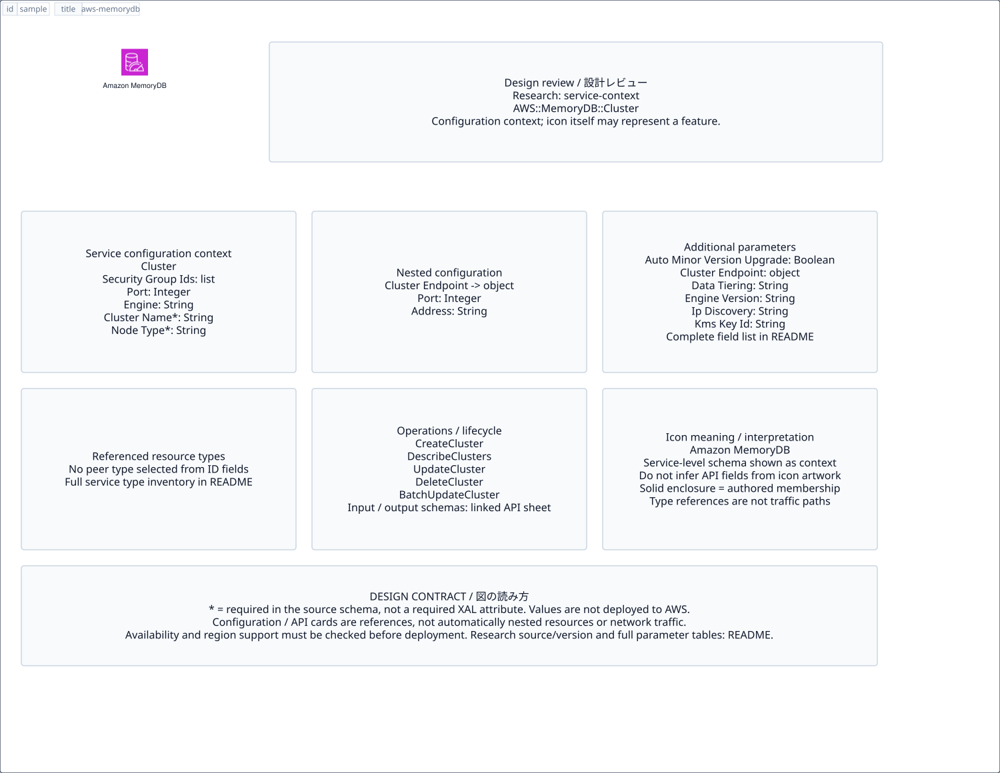

# `aws-memorydb` — Amazon MemoryDB

[SVG preview](sample.svg) · [Editable XAL](sample.xal) · [Catalog](../README.md)



AWS service icon. Use a label and explicit annotations to describe its role; scope is selected by the author.

- Kind: `service`; category: Database.
- Diagram scope: `service` (recommendation, not AWS deployment validation).
- Default catalog ID: 148. Covered catalog IDs: 115, 126, 137, 148.
- Implementation: V1 and V2; fixed AWS icon with a wrapped label and explicit functional annotations.

## Parameters

`id` is a required, unique connection ID, not a catalog number. `label`/`title`/`name` override the label; an empty label hides it. `size` > 0 defaults to 48 px. `label-width` > 0 defaults to 160 px (default box width, at least icon size + 12 px). Explicit `width`/`height` must contain the icon and label. `visible="false"` hides it. Children and icon overrides are not supported; use a group for containment.

`detail` adds a free-form diagram annotation. `show-details="false"` hides annotation text. Only supplied values are shown; none are sent to AWS. Service/resource annotations appear on separate wrapped lines.

| Parameter | Type | Meaning | Example |
|---|---|---|---|
| `data-model` | text | Data model annotation | `Application records` |

## Review notes

The catalog provides a baseline for per-component development, not a simulation of the AWS control plane. This component's current functional parameters are the ones listed above. Additional service-specific visual behavior can be developed here without replacing catalog IDs in diagrams. Edit `sample.xal`, then run:

```sh
npm run generate:aws-samples -- --render --tag=aws-memorydb
```

<!-- aws-functional-research:start -->
## 機能調査・構成デザイン（2026-09-06）

分類: `service-context`。サービス文脈: [`aws-memorydb`](../aws-memorydb/README.md)。

サンプルはアイコンと、設定・内包構造・関連リソース・操作を分離したレビューシートです。設定カードは編集可能な `rectangle`、グループは既存の専用タグで実装しています。カードのフィールド名を新しい XAL 属性として受理するわけではありません。専用タグが受理する属性は上の Parameters 表を参照してください。

実線の通信と、設定の参照・同じサービスに属する型一覧を区別します。スキーマの必須項目は AWS 側の仕様であり、図の必須入力ではありません。記載の構成モデル/API は取り込んだ公式資料の範囲であり、全リージョン・全機能の完全性や稼働可否を保証しません。

**重要:** このアイコンに対応する独立した構成リソースを断定せず、所属サービスの構成モデルを参考表示しています。アイコン名や絵柄から属性・親子関係・通信を推測しません。

### 構成モデル: `AWS::MemoryDB::Cluster`

[公式リファレンス](https://docs.aws.amazon.com/AWSCloudFormation/latest/UserGuide/aws-resource-memorydb-cluster.html)。全 29 プロパティを型付きで列挙します（表示カードには主要項目のみ）。

| Field | Type | Required in AWS schema |
|---|---|---|
| [ACLName](https://docs.aws.amazon.com/AWSCloudFormation/latest/UserGuide/aws-resource-memorydb-cluster.html#cfn-memorydb-cluster-aclname) | `String` | yes |
| [AutoMinorVersionUpgrade](https://docs.aws.amazon.com/AWSCloudFormation/latest/UserGuide/aws-resource-memorydb-cluster.html#cfn-memorydb-cluster-autominorversionupgrade) | `Boolean` | no |
| [ClusterEndpoint](https://docs.aws.amazon.com/AWSCloudFormation/latest/UserGuide/aws-resource-memorydb-cluster.html#cfn-memorydb-cluster-clusterendpoint) | `Endpoint` | no |
| [ClusterName](https://docs.aws.amazon.com/AWSCloudFormation/latest/UserGuide/aws-resource-memorydb-cluster.html#cfn-memorydb-cluster-clustername) | `String` | yes |
| [DataTiering](https://docs.aws.amazon.com/AWSCloudFormation/latest/UserGuide/aws-resource-memorydb-cluster.html#cfn-memorydb-cluster-datatiering) | `String` | no |
| [Description](https://docs.aws.amazon.com/AWSCloudFormation/latest/UserGuide/aws-resource-memorydb-cluster.html#cfn-memorydb-cluster-description) | `String` | no |
| [Engine](https://docs.aws.amazon.com/AWSCloudFormation/latest/UserGuide/aws-resource-memorydb-cluster.html#cfn-memorydb-cluster-engine) | `String` | no |
| [EngineVersion](https://docs.aws.amazon.com/AWSCloudFormation/latest/UserGuide/aws-resource-memorydb-cluster.html#cfn-memorydb-cluster-engineversion) | `String` | no |
| [FinalSnapshotName](https://docs.aws.amazon.com/AWSCloudFormation/latest/UserGuide/aws-resource-memorydb-cluster.html#cfn-memorydb-cluster-finalsnapshotname) | `String` | no |
| [IpDiscovery](https://docs.aws.amazon.com/AWSCloudFormation/latest/UserGuide/aws-resource-memorydb-cluster.html#cfn-memorydb-cluster-ipdiscovery) | `String` | no |
| [KmsKeyId](https://docs.aws.amazon.com/AWSCloudFormation/latest/UserGuide/aws-resource-memorydb-cluster.html#cfn-memorydb-cluster-kmskeyid) | `String` | no |
| [MaintenanceWindow](https://docs.aws.amazon.com/AWSCloudFormation/latest/UserGuide/aws-resource-memorydb-cluster.html#cfn-memorydb-cluster-maintenancewindow) | `String` | no |
| [MultiRegionClusterName](https://docs.aws.amazon.com/AWSCloudFormation/latest/UserGuide/aws-resource-memorydb-cluster.html#cfn-memorydb-cluster-multiregionclustername) | `String` | no |
| [NetworkType](https://docs.aws.amazon.com/AWSCloudFormation/latest/UserGuide/aws-resource-memorydb-cluster.html#cfn-memorydb-cluster-networktype) | `String` | no |
| [NodeType](https://docs.aws.amazon.com/AWSCloudFormation/latest/UserGuide/aws-resource-memorydb-cluster.html#cfn-memorydb-cluster-nodetype) | `String` | yes |
| [NumReplicasPerShard](https://docs.aws.amazon.com/AWSCloudFormation/latest/UserGuide/aws-resource-memorydb-cluster.html#cfn-memorydb-cluster-numreplicaspershard) | `Integer` | no |
| [NumShards](https://docs.aws.amazon.com/AWSCloudFormation/latest/UserGuide/aws-resource-memorydb-cluster.html#cfn-memorydb-cluster-numshards) | `Integer` | no |
| [ParameterGroupName](https://docs.aws.amazon.com/AWSCloudFormation/latest/UserGuide/aws-resource-memorydb-cluster.html#cfn-memorydb-cluster-parametergroupname) | `String` | no |
| [Port](https://docs.aws.amazon.com/AWSCloudFormation/latest/UserGuide/aws-resource-memorydb-cluster.html#cfn-memorydb-cluster-port) | `Integer` | no |
| [SecurityGroupIds](https://docs.aws.amazon.com/AWSCloudFormation/latest/UserGuide/aws-resource-memorydb-cluster.html#cfn-memorydb-cluster-securitygroupids) | `List<String>` | no |
| [SnapshotArns](https://docs.aws.amazon.com/AWSCloudFormation/latest/UserGuide/aws-resource-memorydb-cluster.html#cfn-memorydb-cluster-snapshotarns) | `List<String>` | no |
| [SnapshotName](https://docs.aws.amazon.com/AWSCloudFormation/latest/UserGuide/aws-resource-memorydb-cluster.html#cfn-memorydb-cluster-snapshotname) | `String` | no |
| [SnapshotRetentionLimit](https://docs.aws.amazon.com/AWSCloudFormation/latest/UserGuide/aws-resource-memorydb-cluster.html#cfn-memorydb-cluster-snapshotretentionlimit) | `Integer` | no |
| [SnapshotWindow](https://docs.aws.amazon.com/AWSCloudFormation/latest/UserGuide/aws-resource-memorydb-cluster.html#cfn-memorydb-cluster-snapshotwindow) | `String` | no |
| [SnsTopicArn](https://docs.aws.amazon.com/AWSCloudFormation/latest/UserGuide/aws-resource-memorydb-cluster.html#cfn-memorydb-cluster-snstopicarn) | `String` | no |
| [SnsTopicStatus](https://docs.aws.amazon.com/AWSCloudFormation/latest/UserGuide/aws-resource-memorydb-cluster.html#cfn-memorydb-cluster-snstopicstatus) | `String` | no |
| [SubnetGroupName](https://docs.aws.amazon.com/AWSCloudFormation/latest/UserGuide/aws-resource-memorydb-cluster.html#cfn-memorydb-cluster-subnetgroupname) | `String` | no |
| [Tags](https://docs.aws.amazon.com/AWSCloudFormation/latest/UserGuide/aws-resource-memorydb-cluster.html#cfn-memorydb-cluster-tags) | `List<Tag>` | no |
| [TLSEnabled](https://docs.aws.amazon.com/AWSCloudFormation/latest/UserGuide/aws-resource-memorydb-cluster.html#cfn-memorydb-cluster-tlsenabled) | `Boolean` | no |

#### ClusterEndpoint → `AWS::MemoryDB::Cluster.Endpoint`

| Field | Type | Required in AWS schema |
|---|---|---|
| [Address](https://docs.aws.amazon.com/AWSCloudFormation/latest/UserGuide/aws-properties-memorydb-cluster-endpoint.html#cfn-memorydb-cluster-endpoint-address) | `String` | no |
| [Port](https://docs.aws.amazon.com/AWSCloudFormation/latest/UserGuide/aws-properties-memorydb-cluster-endpoint.html#cfn-memorydb-cluster-endpoint-port) | `Integer` | no |

### 関連する構成リソース（8 型）

同じサービス文脈の型一覧です。すべてがこのアイコンの子リソースという意味ではありません。さらに深い入れ子は [公式スキーマのスナップショット](../research/cloudformation-models.json) に記録しています。

- [AWS::MemoryDB::ACL](https://docs.aws.amazon.com/AWSCloudFormation/latest/UserGuide/aws-resource-memorydb-acl.html)
- [AWS::MemoryDB::Cluster](https://docs.aws.amazon.com/AWSCloudFormation/latest/UserGuide/aws-resource-memorydb-cluster.html)
- [AWS::MemoryDB::MultiRegionCluster](https://docs.aws.amazon.com/AWSCloudFormation/latest/UserGuide/aws-resource-memorydb-multiregioncluster.html)
- [AWS::MemoryDB::MultiRegionParameterGroup](https://docs.aws.amazon.com/AWSCloudFormation/latest/UserGuide/aws-resource-memorydb-multiregionparametergroup.html)
- [AWS::MemoryDB::ParameterGroup](https://docs.aws.amazon.com/AWSCloudFormation/latest/UserGuide/aws-resource-memorydb-parametergroup.html)
- [AWS::MemoryDB::ReservedNode](https://docs.aws.amazon.com/AWSCloudFormation/latest/UserGuide/aws-resource-memorydb-reservednode.html)
- [AWS::MemoryDB::SubnetGroup](https://docs.aws.amazon.com/AWSCloudFormation/latest/UserGuide/aws-resource-memorydb-subnetgroup.html)
- [AWS::MemoryDB::User](https://docs.aws.amazon.com/AWSCloudFormation/latest/UserGuide/aws-resource-memorydb-user.html)

### API の操作・パラメータ

- [Amazon MemoryDB: 45 操作の入力・出力一覧](../research/api/memorydb.md)（API version 2021-01-01）

### 出典・調査範囲

- [公式資料 1](https://docs.aws.amazon.com/AWSCloudFormation/latest/UserGuide/aws-resource-memorydb-cluster.html)
- [公式資料 2](https://github.com/boto/botocore/blob/develop/botocore/data/memorydb/2021-01-01/service-2.json)

CloudFormation 仕様 263.0.0、AWS SDK 431 サービスモデルをオフラインで参照。取得日・元データの SHA-256 は [調査マニフェスト](../research/README.md) を参照。API モデル名・フィールド名は仕様から抽出し、説明本文を転載していません。利用可能性は全サービス一律には確認できないため、提供終了の確認がないものも「現在利用可能」と断定していません。

### 次の部品レビュー

- 本アイコンが独立したリソースか、機能・状態・デバイスの記号かを確認する。
- 詳細カードのうち専用の子タグ・参照属性として実装する範囲を選ぶ。
- 通信、制御、認証、監視の関係を分け、必要な接続点・配置制約を確認する。
- 編集後は `npm run generate:aws-samples -- --render --tag=aws-memorydb`。通常の再描画は XAL/README を上書きしない。
<!-- aws-functional-research:end -->
