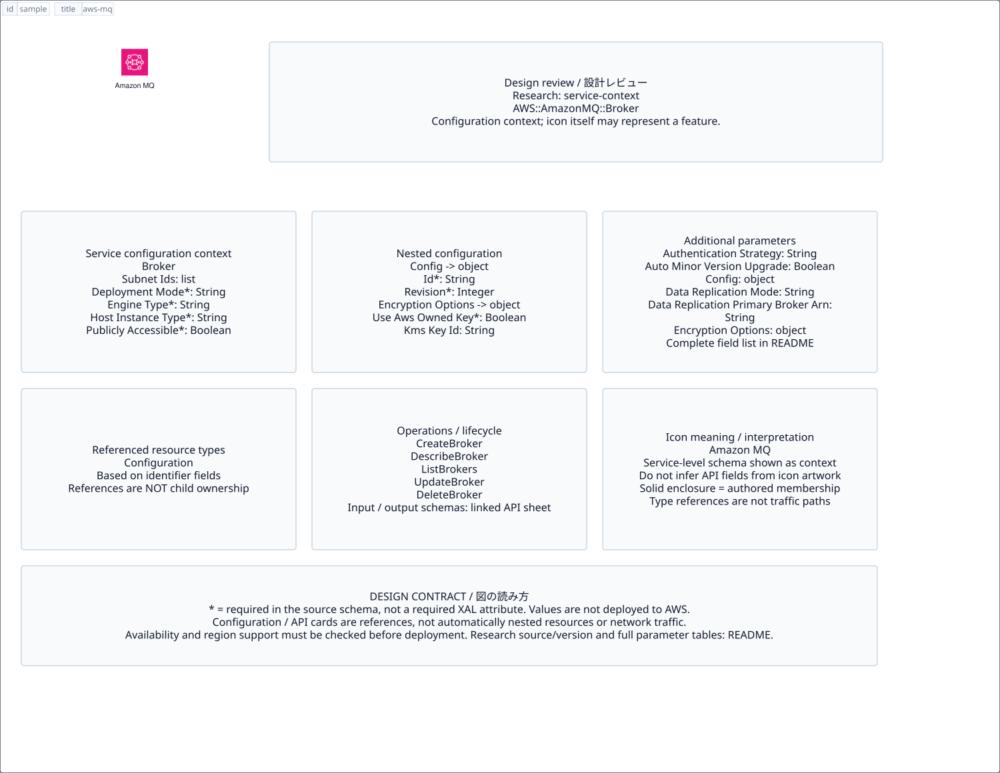

# `aws-mq` — Amazon MQ

[SVG preview](sample.svg) · [Editable XAL](sample.xal) · [Catalog](../README.md)



AWS service icon. Use a label and explicit annotations to describe its role; scope is selected by the author.

- Kind: `service`; category: App Integration.
- Diagram scope: `service` (recommendation, not AWS deployment validation).
- Default catalog ID: 733. Covered catalog IDs: 703, 713, 723, 733.
- Implementation: V1 and V2; fixed AWS icon with a wrapped label and explicit functional annotations.

## Parameters

`id` is a required, unique connection ID, not a catalog number. `label`/`title`/`name` override the label; an empty label hides it. `size` > 0 defaults to 48 px. `label-width` > 0 defaults to 160 px (default box width, at least icon size + 12 px). Explicit `width`/`height` must contain the icon and label. `visible="false"` hides it. Children and icon overrides are not supported; use a group for containment.

`detail` adds a free-form diagram annotation. `show-details="false"` hides annotation text. Only supplied values are shown; none are sent to AWS. Service/resource annotations appear on separate wrapped lines.

| Parameter | Type | Meaning | Example |
|---|---|---|---|
| `message` | text | Message/event annotation | `Order events` |

## Review notes

The catalog provides a baseline for per-component development, not a simulation of the AWS control plane. This component's current functional parameters are the ones listed above. Additional service-specific visual behavior can be developed here without replacing catalog IDs in diagrams. Edit `sample.xal`, then run:

```sh
npm run generate:aws-samples -- --render --tag=aws-mq
```

<!-- aws-functional-research:start -->
## 機能調査・構成デザイン（2026-09-06）

分類: `service-context`。サービス文脈: [`aws-mq`](../aws-mq/README.md)。

サンプルはアイコンと、設定・内包構造・関連リソース・操作を分離したレビューシートです。設定カードは編集可能な `rectangle`、グループは既存の専用タグで実装しています。カードのフィールド名を新しい XAL 属性として受理するわけではありません。専用タグが受理する属性は上の Parameters 表を参照してください。

実線の通信と、設定の参照・同じサービスに属する型一覧を区別します。スキーマの必須項目は AWS 側の仕様であり、図の必須入力ではありません。記載の構成モデル/API は取り込んだ公式資料の範囲であり、全リージョン・全機能の完全性や稼働可否を保証しません。

**重要:** このアイコンに対応する独立した構成リソースを断定せず、所属サービスの構成モデルを参考表示しています。アイコン名や絵柄から属性・親子関係・通信を推測しません。

### 構成モデル: `AWS::AmazonMQ::Broker`

[公式リファレンス](https://docs.aws.amazon.com/AWSCloudFormation/latest/UserGuide/aws-resource-amazonmq-broker.html)。全 22 プロパティを型付きで列挙します（表示カードには主要項目のみ）。

| Field | Type | Required in AWS schema |
|---|---|---|
| [AuthenticationStrategy](https://docs.aws.amazon.com/AWSCloudFormation/latest/UserGuide/aws-resource-amazonmq-broker.html#cfn-amazonmq-broker-authenticationstrategy) | `String` | no |
| [AutoMinorVersionUpgrade](https://docs.aws.amazon.com/AWSCloudFormation/latest/UserGuide/aws-resource-amazonmq-broker.html#cfn-amazonmq-broker-autominorversionupgrade) | `Boolean` | no |
| [BrokerName](https://docs.aws.amazon.com/AWSCloudFormation/latest/UserGuide/aws-resource-amazonmq-broker.html#cfn-amazonmq-broker-brokername) | `String` | yes |
| [Configuration](https://docs.aws.amazon.com/AWSCloudFormation/latest/UserGuide/aws-resource-amazonmq-broker.html#cfn-amazonmq-broker-configuration) | `ConfigurationId` | no |
| [DataReplicationMode](https://docs.aws.amazon.com/AWSCloudFormation/latest/UserGuide/aws-resource-amazonmq-broker.html#cfn-amazonmq-broker-datareplicationmode) | `String` | no |
| [DataReplicationPrimaryBrokerArn](https://docs.aws.amazon.com/AWSCloudFormation/latest/UserGuide/aws-resource-amazonmq-broker.html#cfn-amazonmq-broker-datareplicationprimarybrokerarn) | `String` | no |
| [DeploymentMode](https://docs.aws.amazon.com/AWSCloudFormation/latest/UserGuide/aws-resource-amazonmq-broker.html#cfn-amazonmq-broker-deploymentmode) | `String` | yes |
| [EncryptionOptions](https://docs.aws.amazon.com/AWSCloudFormation/latest/UserGuide/aws-resource-amazonmq-broker.html#cfn-amazonmq-broker-encryptionoptions) | `EncryptionOptions` | no |
| [EngineType](https://docs.aws.amazon.com/AWSCloudFormation/latest/UserGuide/aws-resource-amazonmq-broker.html#cfn-amazonmq-broker-enginetype) | `String` | yes |
| [EngineVersion](https://docs.aws.amazon.com/AWSCloudFormation/latest/UserGuide/aws-resource-amazonmq-broker.html#cfn-amazonmq-broker-engineversion) | `String` | no |
| [HostInstanceType](https://docs.aws.amazon.com/AWSCloudFormation/latest/UserGuide/aws-resource-amazonmq-broker.html#cfn-amazonmq-broker-hostinstancetype) | `String` | yes |
| [LdapServerMetadata](https://docs.aws.amazon.com/AWSCloudFormation/latest/UserGuide/aws-resource-amazonmq-broker.html#cfn-amazonmq-broker-ldapservermetadata) | `LdapServerMetadata` | no |
| [Logs](https://docs.aws.amazon.com/AWSCloudFormation/latest/UserGuide/aws-resource-amazonmq-broker.html#cfn-amazonmq-broker-logs) | `LogList` | no |
| [MaintenanceWindowStartTime](https://docs.aws.amazon.com/AWSCloudFormation/latest/UserGuide/aws-resource-amazonmq-broker.html#cfn-amazonmq-broker-maintenancewindowstarttime) | `MaintenanceWindow` | no |
| [PubliclyAccessible](https://docs.aws.amazon.com/AWSCloudFormation/latest/UserGuide/aws-resource-amazonmq-broker.html#cfn-amazonmq-broker-publiclyaccessible) | `Boolean` | yes |
| [ResourceShareArns](https://docs.aws.amazon.com/AWSCloudFormation/latest/UserGuide/aws-resource-amazonmq-broker.html#cfn-amazonmq-broker-resourcesharearns) | `List<String>` | no |
| [SecurityGroups](https://docs.aws.amazon.com/AWSCloudFormation/latest/UserGuide/aws-resource-amazonmq-broker.html#cfn-amazonmq-broker-securitygroups) | `List<String>` | no |
| [StorageSize](https://docs.aws.amazon.com/AWSCloudFormation/latest/UserGuide/aws-resource-amazonmq-broker.html#cfn-amazonmq-broker-storagesize) | `Integer` | no |
| [StorageType](https://docs.aws.amazon.com/AWSCloudFormation/latest/UserGuide/aws-resource-amazonmq-broker.html#cfn-amazonmq-broker-storagetype) | `String` | no |
| [SubnetIds](https://docs.aws.amazon.com/AWSCloudFormation/latest/UserGuide/aws-resource-amazonmq-broker.html#cfn-amazonmq-broker-subnetids) | `List<String>` | no |
| [Tags](https://docs.aws.amazon.com/AWSCloudFormation/latest/UserGuide/aws-resource-amazonmq-broker.html#cfn-amazonmq-broker-tags) | `List<TagsEntry>` | no |
| [Users](https://docs.aws.amazon.com/AWSCloudFormation/latest/UserGuide/aws-resource-amazonmq-broker.html#cfn-amazonmq-broker-users) | `List<User>` | no |

#### Configuration → `AWS::AmazonMQ::Broker.ConfigurationId`

| Field | Type | Required in AWS schema |
|---|---|---|
| [Id](https://docs.aws.amazon.com/AWSCloudFormation/latest/UserGuide/aws-properties-amazonmq-broker-configurationid.html#cfn-amazonmq-broker-configurationid-id) | `String` | yes |
| [Revision](https://docs.aws.amazon.com/AWSCloudFormation/latest/UserGuide/aws-properties-amazonmq-broker-configurationid.html#cfn-amazonmq-broker-configurationid-revision) | `Integer` | yes |

#### EncryptionOptions → `AWS::AmazonMQ::Broker.EncryptionOptions`

| Field | Type | Required in AWS schema |
|---|---|---|
| [KmsKeyId](https://docs.aws.amazon.com/AWSCloudFormation/latest/UserGuide/aws-properties-amazonmq-broker-encryptionoptions.html#cfn-amazonmq-broker-encryptionoptions-kmskeyid) | `String` | no |
| [UseAwsOwnedKey](https://docs.aws.amazon.com/AWSCloudFormation/latest/UserGuide/aws-properties-amazonmq-broker-encryptionoptions.html#cfn-amazonmq-broker-encryptionoptions-useawsownedkey) | `Boolean` | yes |

#### LdapServerMetadata → `AWS::AmazonMQ::Broker.LdapServerMetadata`

| Field | Type | Required in AWS schema |
|---|---|---|
| [Hosts](https://docs.aws.amazon.com/AWSCloudFormation/latest/UserGuide/aws-properties-amazonmq-broker-ldapservermetadata.html#cfn-amazonmq-broker-ldapservermetadata-hosts) | `List<String>` | yes |
| [RoleBase](https://docs.aws.amazon.com/AWSCloudFormation/latest/UserGuide/aws-properties-amazonmq-broker-ldapservermetadata.html#cfn-amazonmq-broker-ldapservermetadata-rolebase) | `String` | yes |
| [RoleName](https://docs.aws.amazon.com/AWSCloudFormation/latest/UserGuide/aws-properties-amazonmq-broker-ldapservermetadata.html#cfn-amazonmq-broker-ldapservermetadata-rolename) | `String` | no |
| [RoleSearchMatching](https://docs.aws.amazon.com/AWSCloudFormation/latest/UserGuide/aws-properties-amazonmq-broker-ldapservermetadata.html#cfn-amazonmq-broker-ldapservermetadata-rolesearchmatching) | `String` | yes |
| [RoleSearchSubtree](https://docs.aws.amazon.com/AWSCloudFormation/latest/UserGuide/aws-properties-amazonmq-broker-ldapservermetadata.html#cfn-amazonmq-broker-ldapservermetadata-rolesearchsubtree) | `Boolean` | no |
| [ServiceAccountPassword](https://docs.aws.amazon.com/AWSCloudFormation/latest/UserGuide/aws-properties-amazonmq-broker-ldapservermetadata.html#cfn-amazonmq-broker-ldapservermetadata-serviceaccountpassword) | `String` | no |
| [ServiceAccountUsername](https://docs.aws.amazon.com/AWSCloudFormation/latest/UserGuide/aws-properties-amazonmq-broker-ldapservermetadata.html#cfn-amazonmq-broker-ldapservermetadata-serviceaccountusername) | `String` | yes |
| [UserBase](https://docs.aws.amazon.com/AWSCloudFormation/latest/UserGuide/aws-properties-amazonmq-broker-ldapservermetadata.html#cfn-amazonmq-broker-ldapservermetadata-userbase) | `String` | yes |
| [UserRoleName](https://docs.aws.amazon.com/AWSCloudFormation/latest/UserGuide/aws-properties-amazonmq-broker-ldapservermetadata.html#cfn-amazonmq-broker-ldapservermetadata-userrolename) | `String` | no |
| [UserSearchMatching](https://docs.aws.amazon.com/AWSCloudFormation/latest/UserGuide/aws-properties-amazonmq-broker-ldapservermetadata.html#cfn-amazonmq-broker-ldapservermetadata-usersearchmatching) | `String` | yes |
| [UserSearchSubtree](https://docs.aws.amazon.com/AWSCloudFormation/latest/UserGuide/aws-properties-amazonmq-broker-ldapservermetadata.html#cfn-amazonmq-broker-ldapservermetadata-usersearchsubtree) | `Boolean` | no |

#### Logs → `AWS::AmazonMQ::Broker.LogList`

| Field | Type | Required in AWS schema |
|---|---|---|
| [Audit](https://docs.aws.amazon.com/AWSCloudFormation/latest/UserGuide/aws-properties-amazonmq-broker-loglist.html#cfn-amazonmq-broker-loglist-audit) | `Boolean` | no |
| [General](https://docs.aws.amazon.com/AWSCloudFormation/latest/UserGuide/aws-properties-amazonmq-broker-loglist.html#cfn-amazonmq-broker-loglist-general) | `Boolean` | no |

#### MaintenanceWindowStartTime → `AWS::AmazonMQ::Broker.MaintenanceWindow`

| Field | Type | Required in AWS schema |
|---|---|---|
| [DayOfWeek](https://docs.aws.amazon.com/AWSCloudFormation/latest/UserGuide/aws-properties-amazonmq-broker-maintenancewindow.html#cfn-amazonmq-broker-maintenancewindow-dayofweek) | `String` | yes |
| [TimeOfDay](https://docs.aws.amazon.com/AWSCloudFormation/latest/UserGuide/aws-properties-amazonmq-broker-maintenancewindow.html#cfn-amazonmq-broker-maintenancewindow-timeofday) | `String` | yes |
| [TimeZone](https://docs.aws.amazon.com/AWSCloudFormation/latest/UserGuide/aws-properties-amazonmq-broker-maintenancewindow.html#cfn-amazonmq-broker-maintenancewindow-timezone) | `String` | yes |

#### Users → `AWS::AmazonMQ::Broker.User`

| Field | Type | Required in AWS schema |
|---|---|---|
| [ConsoleAccess](https://docs.aws.amazon.com/AWSCloudFormation/latest/UserGuide/aws-properties-amazonmq-broker-user.html#cfn-amazonmq-broker-user-consoleaccess) | `Boolean` | no |
| [Groups](https://docs.aws.amazon.com/AWSCloudFormation/latest/UserGuide/aws-properties-amazonmq-broker-user.html#cfn-amazonmq-broker-user-groups) | `List<String>` | no |
| [Password](https://docs.aws.amazon.com/AWSCloudFormation/latest/UserGuide/aws-properties-amazonmq-broker-user.html#cfn-amazonmq-broker-user-password) | `String` | yes |
| [ReplicationUser](https://docs.aws.amazon.com/AWSCloudFormation/latest/UserGuide/aws-properties-amazonmq-broker-user.html#cfn-amazonmq-broker-user-replicationuser) | `Boolean` | no |
| [Username](https://docs.aws.amazon.com/AWSCloudFormation/latest/UserGuide/aws-properties-amazonmq-broker-user.html#cfn-amazonmq-broker-user-username) | `String` | yes |

#### Tags → `AWS::AmazonMQ::Broker.TagsEntry`

| Field | Type | Required in AWS schema |
|---|---|---|
| [Key](https://docs.aws.amazon.com/AWSCloudFormation/latest/UserGuide/aws-properties-amazonmq-broker-tagsentry.html#cfn-amazonmq-broker-tagsentry-key) | `String` | yes |
| [Value](https://docs.aws.amazon.com/AWSCloudFormation/latest/UserGuide/aws-properties-amazonmq-broker-tagsentry.html#cfn-amazonmq-broker-tagsentry-value) | `String` | yes |

### 関連する構成リソース（3 型）

同じサービス文脈の型一覧です。すべてがこのアイコンの子リソースという意味ではありません。さらに深い入れ子は [公式スキーマのスナップショット](../research/cloudformation-models.json) に記録しています。

- [AWS::AmazonMQ::Broker](https://docs.aws.amazon.com/AWSCloudFormation/latest/UserGuide/aws-resource-amazonmq-broker.html)
- [AWS::AmazonMQ::Configuration](https://docs.aws.amazon.com/AWSCloudFormation/latest/UserGuide/aws-resource-amazonmq-configuration.html)
- [AWS::AmazonMQ::ConfigurationAssociation](https://docs.aws.amazon.com/AWSCloudFormation/latest/UserGuide/aws-resource-amazonmq-configurationassociation.html)

### API の操作・パラメータ

- [AmazonMQ: 25 操作の入力・出力一覧](../research/api/mq.md)（API version 2017-11-27）

### 出典・調査範囲

- [公式資料 1](https://docs.aws.amazon.com/AWSCloudFormation/latest/UserGuide/aws-resource-amazonmq-broker.html)
- [公式資料 2](https://github.com/boto/botocore/blob/develop/botocore/data/mq/2017-11-27/service-2.json)

CloudFormation 仕様 263.0.0、AWS SDK 431 サービスモデルをオフラインで参照。取得日・元データの SHA-256 は [調査マニフェスト](../research/README.md) を参照。API モデル名・フィールド名は仕様から抽出し、説明本文を転載していません。利用可能性は全サービス一律には確認できないため、提供終了の確認がないものも「現在利用可能」と断定していません。

### 次の部品レビュー

- 本アイコンが独立したリソースか、機能・状態・デバイスの記号かを確認する。
- 詳細カードのうち専用の子タグ・参照属性として実装する範囲を選ぶ。
- 通信、制御、認証、監視の関係を分け、必要な接続点・配置制約を確認する。
- 編集後は `npm run generate:aws-samples -- --render --tag=aws-mq`。通常の再描画は XAL/README を上書きしない。
<!-- aws-functional-research:end -->
