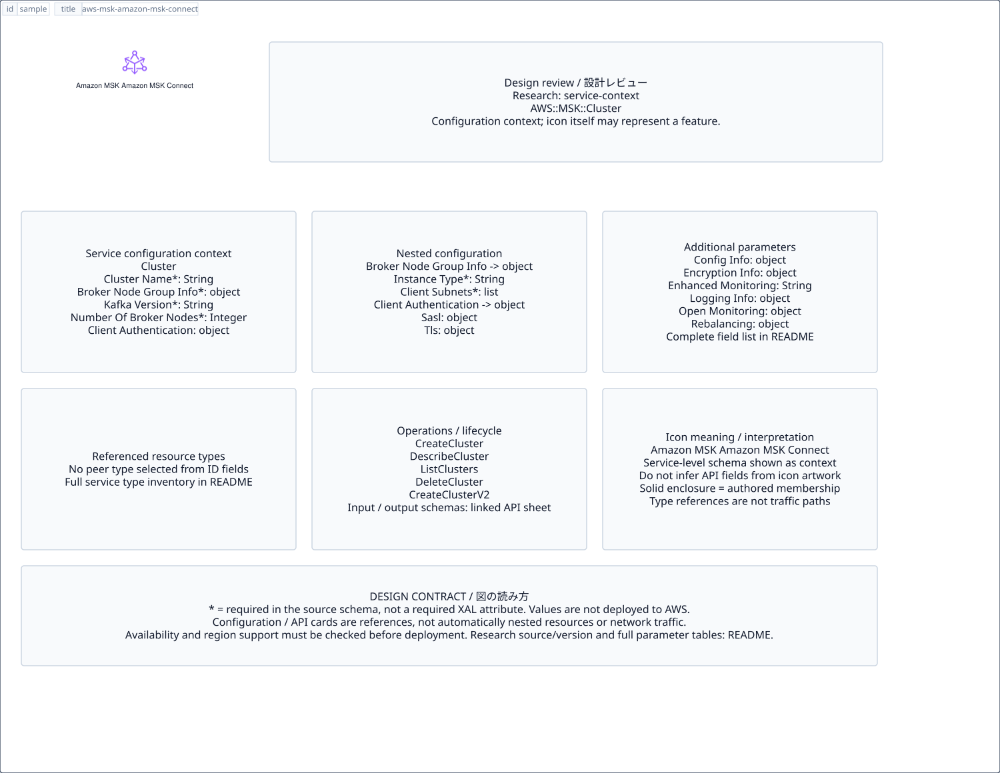

# `aws-msk-amazon-msk-connect` — Amazon MSK Amazon MSK Connect

[SVG preview](sample.svg) · [Editable XAL](sample.xal) · [Catalog](../README.md)



AWS resource icon. Use a label and explicit annotations to describe its role; scope is selected by the author.

- Kind: `resource`; category: Analytics.
- Diagram scope: `logical` (recommendation, not AWS deployment validation).
- Default catalog ID: 1444. Covered catalog IDs: 1444.
- Implementation: V1 and V2; fixed AWS icon with a wrapped label and explicit functional annotations.

## Parameters

`id` is a required, unique connection ID, not a catalog number. `label`/`title`/`name` override the label; an empty label hides it. `size` > 0 defaults to 48 px. `label-width` > 0 defaults to 160 px (default box width, at least icon size + 12 px). Explicit `width`/`height` must contain the icon and label. `visible="false"` hides it. Children and icon overrides are not supported; use a group for containment.

`detail` adds a free-form diagram annotation. `show-details="false"` hides annotation text. Only supplied values are shown; none are sent to AWS. Service/resource annotations appear on separate wrapped lines.

| Parameter | Type | Meaning | Example |
|---|---|---|---|
| `input` | text | Input data annotation | `Application events` |
| `output` | text | Output data annotation | `Insights` |

## Review notes

The catalog provides a baseline for per-component development, not a simulation of the AWS control plane. This component's current functional parameters are the ones listed above. Additional service-specific visual behavior can be developed here without replacing catalog IDs in diagrams. Edit `sample.xal`, then run:

```sh
npm run generate:aws-samples -- --render --tag=aws-msk-amazon-msk-connect
```

<!-- aws-functional-research:start -->
## 機能調査・構成デザイン（2026-09-06）

分類: `service-context`。サービス文脈: [`aws-managed-streaming-for-apache-kafka`](../aws-managed-streaming-for-apache-kafka/README.md)。

サンプルはアイコンと、設定・内包構造・関連リソース・操作を分離したレビューシートです。設定カードは編集可能な `rectangle`、グループは既存の専用タグで実装しています。カードのフィールド名を新しい XAL 属性として受理するわけではありません。専用タグが受理する属性は上の Parameters 表を参照してください。

実線の通信と、設定の参照・同じサービスに属する型一覧を区別します。スキーマの必須項目は AWS 側の仕様であり、図の必須入力ではありません。記載の構成モデル/API は取り込んだ公式資料の範囲であり、全リージョン・全機能の完全性や稼働可否を保証しません。

**重要:** このアイコンに対応する独立した構成リソースを断定せず、所属サービスの構成モデルを参考表示しています。アイコン名や絵柄から属性・親子関係・通信を推測しません。

### 構成モデル: `AWS::MSK::Cluster`

[公式リファレンス](https://docs.aws.amazon.com/AWSCloudFormation/latest/UserGuide/aws-resource-msk-cluster.html)。全 14 プロパティを型付きで列挙します（表示カードには主要項目のみ）。

| Field | Type | Required in AWS schema |
|---|---|---|
| [BrokerNodeGroupInfo](https://docs.aws.amazon.com/AWSCloudFormation/latest/UserGuide/aws-resource-msk-cluster.html#cfn-msk-cluster-brokernodegroupinfo) | `BrokerNodeGroupInfo` | yes |
| [ClientAuthentication](https://docs.aws.amazon.com/AWSCloudFormation/latest/UserGuide/aws-resource-msk-cluster.html#cfn-msk-cluster-clientauthentication) | `ClientAuthentication` | no |
| [ClusterName](https://docs.aws.amazon.com/AWSCloudFormation/latest/UserGuide/aws-resource-msk-cluster.html#cfn-msk-cluster-clustername) | `String` | yes |
| [ConfigurationInfo](https://docs.aws.amazon.com/AWSCloudFormation/latest/UserGuide/aws-resource-msk-cluster.html#cfn-msk-cluster-configurationinfo) | `ConfigurationInfo` | no |
| [EncryptionInfo](https://docs.aws.amazon.com/AWSCloudFormation/latest/UserGuide/aws-resource-msk-cluster.html#cfn-msk-cluster-encryptioninfo) | `EncryptionInfo` | no |
| [EnhancedMonitoring](https://docs.aws.amazon.com/AWSCloudFormation/latest/UserGuide/aws-resource-msk-cluster.html#cfn-msk-cluster-enhancedmonitoring) | `String` | no |
| [KafkaVersion](https://docs.aws.amazon.com/AWSCloudFormation/latest/UserGuide/aws-resource-msk-cluster.html#cfn-msk-cluster-kafkaversion) | `String` | yes |
| [LoggingInfo](https://docs.aws.amazon.com/AWSCloudFormation/latest/UserGuide/aws-resource-msk-cluster.html#cfn-msk-cluster-logginginfo) | `LoggingInfo` | no |
| [NumberOfBrokerNodes](https://docs.aws.amazon.com/AWSCloudFormation/latest/UserGuide/aws-resource-msk-cluster.html#cfn-msk-cluster-numberofbrokernodes) | `Integer` | yes |
| [OpenMonitoring](https://docs.aws.amazon.com/AWSCloudFormation/latest/UserGuide/aws-resource-msk-cluster.html#cfn-msk-cluster-openmonitoring) | `OpenMonitoring` | no |
| [Rebalancing](https://docs.aws.amazon.com/AWSCloudFormation/latest/UserGuide/aws-resource-msk-cluster.html#cfn-msk-cluster-rebalancing) | `Rebalancing` | no |
| [StorageMode](https://docs.aws.amazon.com/AWSCloudFormation/latest/UserGuide/aws-resource-msk-cluster.html#cfn-msk-cluster-storagemode) | `String` | no |
| [Tags](https://docs.aws.amazon.com/AWSCloudFormation/latest/UserGuide/aws-resource-msk-cluster.html#cfn-msk-cluster-tags) | `Map<String>` | no |
| [ZookeeperAccess](https://docs.aws.amazon.com/AWSCloudFormation/latest/UserGuide/aws-resource-msk-cluster.html#cfn-msk-cluster-zookeeperaccess) | `ZookeeperAccess` | no |

#### BrokerNodeGroupInfo → `AWS::MSK::Cluster.BrokerNodeGroupInfo`

| Field | Type | Required in AWS schema |
|---|---|---|
| [BrokerAZDistribution](https://docs.aws.amazon.com/AWSCloudFormation/latest/UserGuide/aws-properties-msk-cluster-brokernodegroupinfo.html#cfn-msk-cluster-brokernodegroupinfo-brokerazdistribution) | `String` | no |
| [ClientSubnets](https://docs.aws.amazon.com/AWSCloudFormation/latest/UserGuide/aws-properties-msk-cluster-brokernodegroupinfo.html#cfn-msk-cluster-brokernodegroupinfo-clientsubnets) | `List<String>` | yes |
| [ConnectivityInfo](https://docs.aws.amazon.com/AWSCloudFormation/latest/UserGuide/aws-properties-msk-cluster-brokernodegroupinfo.html#cfn-msk-cluster-brokernodegroupinfo-connectivityinfo) | `ConnectivityInfo` | no |
| [InstanceType](https://docs.aws.amazon.com/AWSCloudFormation/latest/UserGuide/aws-properties-msk-cluster-brokernodegroupinfo.html#cfn-msk-cluster-brokernodegroupinfo-instancetype) | `String` | yes |
| [SecurityGroups](https://docs.aws.amazon.com/AWSCloudFormation/latest/UserGuide/aws-properties-msk-cluster-brokernodegroupinfo.html#cfn-msk-cluster-brokernodegroupinfo-securitygroups) | `List<String>` | no |
| [StorageInfo](https://docs.aws.amazon.com/AWSCloudFormation/latest/UserGuide/aws-properties-msk-cluster-brokernodegroupinfo.html#cfn-msk-cluster-brokernodegroupinfo-storageinfo) | `StorageInfo` | no |

#### ClientAuthentication → `AWS::MSK::Cluster.ClientAuthentication`

| Field | Type | Required in AWS schema |
|---|---|---|
| [Sasl](https://docs.aws.amazon.com/AWSCloudFormation/latest/UserGuide/aws-properties-msk-cluster-clientauthentication.html#cfn-msk-cluster-clientauthentication-sasl) | `Sasl` | no |
| [Tls](https://docs.aws.amazon.com/AWSCloudFormation/latest/UserGuide/aws-properties-msk-cluster-clientauthentication.html#cfn-msk-cluster-clientauthentication-tls) | `Tls` | no |
| [Unauthenticated](https://docs.aws.amazon.com/AWSCloudFormation/latest/UserGuide/aws-properties-msk-cluster-clientauthentication.html#cfn-msk-cluster-clientauthentication-unauthenticated) | `Unauthenticated` | no |

#### ConfigurationInfo → `AWS::MSK::Cluster.ConfigurationInfo`

| Field | Type | Required in AWS schema |
|---|---|---|
| [Arn](https://docs.aws.amazon.com/AWSCloudFormation/latest/UserGuide/aws-properties-msk-cluster-configurationinfo.html#cfn-msk-cluster-configurationinfo-arn) | `String` | yes |
| [Revision](https://docs.aws.amazon.com/AWSCloudFormation/latest/UserGuide/aws-properties-msk-cluster-configurationinfo.html#cfn-msk-cluster-configurationinfo-revision) | `Integer` | yes |

#### EncryptionInfo → `AWS::MSK::Cluster.EncryptionInfo`

| Field | Type | Required in AWS schema |
|---|---|---|
| [EncryptionAtRest](https://docs.aws.amazon.com/AWSCloudFormation/latest/UserGuide/aws-properties-msk-cluster-encryptioninfo.html#cfn-msk-cluster-encryptioninfo-encryptionatrest) | `EncryptionAtRest` | no |
| [EncryptionInTransit](https://docs.aws.amazon.com/AWSCloudFormation/latest/UserGuide/aws-properties-msk-cluster-encryptioninfo.html#cfn-msk-cluster-encryptioninfo-encryptionintransit) | `EncryptionInTransit` | no |

#### LoggingInfo → `AWS::MSK::Cluster.LoggingInfo`

| Field | Type | Required in AWS schema |
|---|---|---|
| [AuthorizerLogs](https://docs.aws.amazon.com/AWSCloudFormation/latest/UserGuide/aws-properties-msk-cluster-logginginfo.html#cfn-msk-cluster-logginginfo-authorizerlogs) | `AuthorizerLogs` | no |
| [BrokerLogs](https://docs.aws.amazon.com/AWSCloudFormation/latest/UserGuide/aws-properties-msk-cluster-logginginfo.html#cfn-msk-cluster-logginginfo-brokerlogs) | `BrokerLogs` | no |

#### OpenMonitoring → `AWS::MSK::Cluster.OpenMonitoring`

| Field | Type | Required in AWS schema |
|---|---|---|
| [Prometheus](https://docs.aws.amazon.com/AWSCloudFormation/latest/UserGuide/aws-properties-msk-cluster-openmonitoring.html#cfn-msk-cluster-openmonitoring-prometheus) | `Prometheus` | yes |

#### Rebalancing → `AWS::MSK::Cluster.Rebalancing`

| Field | Type | Required in AWS schema |
|---|---|---|
| [Status](https://docs.aws.amazon.com/AWSCloudFormation/latest/UserGuide/aws-properties-msk-cluster-rebalancing.html#cfn-msk-cluster-rebalancing-status) | `String` | yes |

#### ZookeeperAccess → `AWS::MSK::Cluster.ZookeeperAccess`

| Field | Type | Required in AWS schema |
|---|---|---|
| [Enabled](https://docs.aws.amazon.com/AWSCloudFormation/latest/UserGuide/aws-properties-msk-cluster-zookeeperaccess.html#cfn-msk-cluster-zookeeperaccess-enabled) | `Boolean` | no |

### 関連する構成リソース（13 型）

同じサービス文脈の型一覧です。すべてがこのアイコンの子リソースという意味ではありません。さらに深い入れ子は [公式スキーマのスナップショット](../research/cloudformation-models.json) に記録しています。

- [AWS::KafkaConnect::Connector](https://docs.aws.amazon.com/AWSCloudFormation/latest/UserGuide/aws-resource-kafkaconnect-connector.html)
- [AWS::KafkaConnect::ConnectorOperation](https://docs.aws.amazon.com/AWSCloudFormation/latest/UserGuide/aws-resource-kafkaconnect-connectoroperation.html)
- [AWS::KafkaConnect::CustomPlugin](https://docs.aws.amazon.com/AWSCloudFormation/latest/UserGuide/aws-resource-kafkaconnect-customplugin.html)
- [AWS::KafkaConnect::WorkerConfiguration](https://docs.aws.amazon.com/AWSCloudFormation/latest/UserGuide/aws-resource-kafkaconnect-workerconfiguration.html)
- [AWS::MSK::BatchScramSecret](https://docs.aws.amazon.com/AWSCloudFormation/latest/UserGuide/aws-resource-msk-batchscramsecret.html)
- [AWS::MSK::Channel](https://docs.aws.amazon.com/AWSCloudFormation/latest/UserGuide/aws-resource-msk-channel.html)
- [AWS::MSK::Cluster](https://docs.aws.amazon.com/AWSCloudFormation/latest/UserGuide/aws-resource-msk-cluster.html)
- [AWS::MSK::ClusterPolicy](https://docs.aws.amazon.com/AWSCloudFormation/latest/UserGuide/aws-resource-msk-clusterpolicy.html)
- [AWS::MSK::Configuration](https://docs.aws.amazon.com/AWSCloudFormation/latest/UserGuide/aws-resource-msk-configuration.html)
- [AWS::MSK::Replicator](https://docs.aws.amazon.com/AWSCloudFormation/latest/UserGuide/aws-resource-msk-replicator.html)
- [AWS::MSK::ServerlessCluster](https://docs.aws.amazon.com/AWSCloudFormation/latest/UserGuide/aws-resource-msk-serverlesscluster.html)
- [AWS::MSK::Topic](https://docs.aws.amazon.com/AWSCloudFormation/latest/UserGuide/aws-resource-msk-topic.html)
- [AWS::MSK::VpcConnection](https://docs.aws.amazon.com/AWSCloudFormation/latest/UserGuide/aws-resource-msk-vpcconnection.html)

### API の操作・パラメータ

- [Managed Streaming for Kafka: 64 操作の入力・出力一覧](../research/api/kafka.md)（API version 2018-11-14）
- [Managed Streaming for Kafka Connect: 19 操作の入力・出力一覧](../research/api/kafkaconnect.md)（API version 2021-09-14）

### 出典・調査範囲

- [公式資料 1](https://docs.aws.amazon.com/AWSCloudFormation/latest/UserGuide/aws-resource-msk-cluster.html)
- [公式資料 2](https://github.com/boto/botocore/blob/develop/botocore/data/kafka/2018-11-14/service-2.json)
- [公式資料 3](https://github.com/boto/botocore/blob/develop/botocore/data/kafkaconnect/2021-09-14/service-2.json)

CloudFormation 仕様 263.0.0、AWS SDK 431 サービスモデルをオフラインで参照。取得日・元データの SHA-256 は [調査マニフェスト](../research/README.md) を参照。API モデル名・フィールド名は仕様から抽出し、説明本文を転載していません。利用可能性は全サービス一律には確認できないため、提供終了の確認がないものも「現在利用可能」と断定していません。

### 次の部品レビュー

- 本アイコンが独立したリソースか、機能・状態・デバイスの記号かを確認する。
- 詳細カードのうち専用の子タグ・参照属性として実装する範囲を選ぶ。
- 通信、制御、認証、監視の関係を分け、必要な接続点・配置制約を確認する。
- 編集後は `npm run generate:aws-samples -- --render --tag=aws-msk-amazon-msk-connect`。通常の再描画は XAL/README を上書きしない。
<!-- aws-functional-research:end -->
